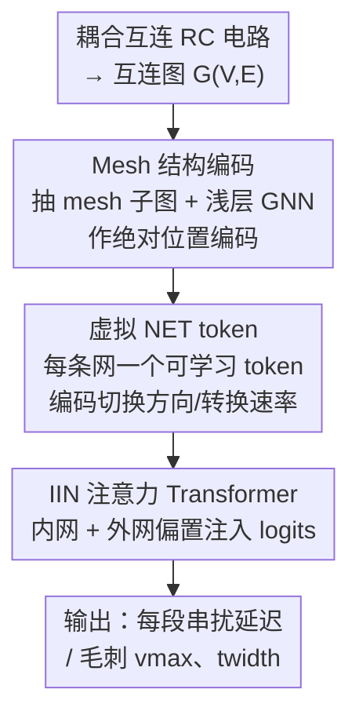

# Si-GT: Fast Interconnect Signal Integrity Analysis for Integrated Circuit Design via Graph Transformers

**会议**: ICLR 2026  
**OpenReview**: [https://openreview.net/forum?id=orO5727bSh](https://openreview.net/forum?id=orO5727bSh)  
**代码**: https://github.com/xlab-ub/Si-GT  
**领域**: 图学习 / 图 Transformer / EDA  
**关键词**: 信号完整性, 串扰, 互连建模, 图 Transformer, EDA

## 一句话总结
Si-GT 把芯片互连建模成耦合 RC 电路图，用一个为串扰效应定制的图 Transformer（mesh 结构编码 + 虚拟 NET token + 内/外网注意力偏置）直接预测串扰延迟和毛刺，精度超过现有 GNN / 图 Transformer，且推理只要 4ms，比 SPICE 仿真快两个数量级。

## 研究背景与动机
**领域现状**：在集成电路（IC）设计中，互连线之间的电容耦合会引发串扰（crosstalk），导致受害线（victim）上出现延迟变化和瞬态毛刺（glitch），直接威胁芯片的时序正确性和功能正确性。工程师目前依赖 SPICE 这类电路仿真器来做信号完整性（Signal Integrity, SI）分析，结果精确但计算代价随设计规模急剧上升，在超大规模集成电路（VLSI）流程中反复跑 SPICE 几乎不可承受。

**现有痛点**：近年用机器学习做 SI 的代理模型大多只盯着「时序预测」，想把 sign-off timer 里的黑盒时序公式拟合出来。这些方法有一个共同的硬伤——它们既不在数据集里、也不在模型里显式建模串扰：没有 aggressor–victim 的切换交互，没有信号 pattern 相关的分析。换句话说，它们绕开了串扰这个最棘手的物理现象。

**核心矛盾**：把图学习用到 SI 上的难点在于，串扰效应同时带有两种依赖关系——一种是长程依赖（信号从驱动端传播到远处的负载），另一种是相邻网之间的依赖（耦合网之间的能量转移）。传统消息传递 GNN 因为 over-smoothing / over-squashing，抓不住长程依赖；而单纯的图 Transformer 又没把电路特有的耦合结构和信号切换 pattern 编进归纳偏置里。

**本文目标**：设计一个既能捕捉长程信号传播、又能显式建模相邻网耦合、还能感知信号切换方向/转换速率的图学习模型，直接预测串扰延迟 $\hat{D}^s_i$ 和毛刺的峰值电压 $v^s_{max}$、噪声宽度 $t^s_{width}$。

**切入角度**：图 Transformer 的自注意力天然擅长长程依赖，作者由此出发——但关键是把电路物理（mesh 耦合结构、网级切换特性、内/外网连接）作为归纳偏置注入到 Transformer 里，而不是让模型从零去猜。

**核心 idea**：用「mesh 结构编码 + 虚拟 NET token + 内/外网（IIN）注意力偏置」三件套，把互连图的局部耦合结构、网级信号特性和耦合连接关系一起塞进图 Transformer，让它在保留长程建模能力的同时理解串扰的物理本质。

## 方法详解

### 整体框架
Si-GT 解决的是：给定一组耦合互连（两条 aggressor + 一条 victim）的等效 RC 电路，预测每个线段上的串扰延迟或毛刺。它先把物理版图转成图——每条网 $net_i$ 被切成 $L$ 段等长线段，每个线段端点是一个节点（携带线电容 $C_w$），节点间的边分两类：同一条网内部的「内网连接」（边特征 $[R_w, 0]$）和不同网之间通过耦合电容相连的「外网连接」（边特征 $[0, \hat{C}]$）。

整个 pipeline 是：输入互连图 → 在每个节点周围抽取 mesh 子图并用浅层 GNN 编码成节点的绝对位置编码 → 为每条网注入一个可学习的虚拟 NET token（带切换方向、转换速率等网级属性）→ 送进 6 层带 IIN 注意力偏置的 Transformer 编码器 → 输出每个线段的延迟 / 毛刺预测。三个核心设计分别对应「节点级结构」「网级表示」「注意力级耦合结构」三个层面，互相补位。

### 关键设计

**1. Mesh 结构编码：把局部耦合结构当作节点的绝对位置编码**

普通图 Transformer 的节点特征里没有「这个节点周围耦合成什么样」的信息，模型只能靠注意力慢慢摸索。作者定义了「耦合 mesh 单元」——对 $net_i$ 上第 $s$ 段末端的节点 $v^s_i$，若它与相邻网 $net_j$ 在该段耦合，就取子图 $\{v^{s-1}_i, v^s_i, v^{s-1}_j, v^s_j\}$ 作为一个 mesh 单元；一个节点和几条网耦合就构成几个 mesh 单元（例如同时和 $net_j$、$net_k$ 耦合就有两个单元）。把节点周围这些 mesh 单元组成的子图 $mesh(v^s_i)$ 用一个浅层 $GNN_l$（$l=2$）聚合，得到的嵌入加到线性投影后的节点特征上作为 Transformer 输入：

$$h^{(0)}(v^s_i) = GNN_l(mesh(v^s_i)) + en(x(v^s_i)) \in \mathbb{R}^d$$

这样做的妙处有二：一是把高阶 mesh 结构信息编进节点特征，给模型一个「局部耦合长什么样」的先验；二是因为 mesh 子图只在真正耦合的网之间构造，未耦合的网天然被隔离开，避免模型把不相干的 aggressor 混在一起。每条网的驱动节点（起点 $v^0_i$）嵌入初始化为零向量。

**2. 虚拟 NET token：用网级 token 聚合全局信号特性**

信号从源端传到 sink 端时，相邻线段之间的电磁干扰会逐段累积，最终在所有网的 sink 处造成显著畸变——这是一种网级的全局交互，逐节点特征很难直接表达。作者为每条网引入一个可学习的虚拟 `<NET>` token $h^{(0)}_{<NET>} \in \mathbb{R}^d$，它在自注意力里和该网所有节点交互，把网级属性（如切换方向、转换速率）编码进这个 token 的嵌入。

为了不让一个网的 token 串到别的网上去，作者给 IIN 注意力的 softmax logits 加了一个注意力掩码 $M_{NET}$：当 token $i$ 代表 $net_i$、而节点 $j$ 不属于 $net_i$ 的节点集 $V^i_S$ 时，掩码值设为 $-\infty$，否则为 0：

$$M_{NET}(i,j) := \begin{cases} -\infty, & i\ \text{代表}\ net_i\ \text{且}\ j \notin V^i_S \\ 0, & \text{否则} \end{cases}$$

这保证每个 NET token 只从自己网内的节点聚合信息，但它对其他所有节点仍然可见——既做到网级表示的纯粹性，又让网级信息能广播出去。消融实验里这个 token 是贡献最大的设计。

**3. IIN 内/外网注意力：把电路连接结构直接注入注意力偏置**

串扰的两类连接——内网连接（信号沿单条网传播时的逐步畸变与噪声累积）和外网连接（耦合网之间的能量转移通道）——都对结果至关重要，但标准自注意力对它们一视同仁。作者设计了两个结构偏置函数显式编码它们。内网编码 $\phi_{Intra}(v^u_i, v^v_i)$ 沿路径累加线电阻，刻画同一条网内节点的相对位置：当 $\{v^u_i,\dots,v^v_i\}\subseteq V^i_S$ 时取 $\frac{1}{d_{uv}\cdot R^i_w}$（$d_{uv}=|v-u|$ 为沿网距离），不同网之间则为 0。外网编码 $\phi_{Inter}(v^u_i, v^u_j)$ 在 $net_i$、$net_j$ 于第 $(u+1)$ 段耦合时取耦合电容 $\hat{C}^{ij}_{u+1}$，否则为 0。

两类偏置经可学习线性变换后并入注意力 logits，再叠加最短路径距离编码 $\tilde{\Phi}_d$ 和边特征编码 $\tilde{\Phi}_{sp}$：

$$\text{Attn-IIN}(X) = \text{softmax}\left(\frac{QK^\top}{\sqrt{d_K}} + \tilde{\Phi}_{IIN} + \tilde{\Phi}_d + \tilde{\Phi}_{sp}\right)V$$

其中 $\tilde{\phi}_{IIN}=\tilde{\phi}_{Intra}+\tilde{\phi}_{Inter}$。这等于把「谁和谁在物理上沿网相连、谁和谁通过耦合电容相连」直接写进注意力分数，让 Transformer 在算相似度时就带上电路拓扑先验，而不是纯靠数据拟合。注意力可视化显示，Si-GT 能清晰隔离两条互不耦合的 aggressor，而 Graphomer 做不到。

### 损失函数 / 训练策略
两个任务（延迟、毛刺）分别训练独立模型，对每个线段（Segment）或 sink 处回归对应指标，以 SPICE 仿真为金标准。Si-GT 用 $l=2$ 层 GNN（hidden 64）做 mesh 编码，6 层 Transformer 编码器、4 个注意力头、嵌入维度 64、FFN 128；用 AdamW 训练 60 epoch、batch size 256，多项式学习率衰减 + 线性 warmup，学习率衰减到 1e-9，weight decay 1e-4；在 2×A100 上训练。

## 实验关键数据

### 主实验
作者构建了首个 IC 互连信号完整性数据集：基于「两 aggressor + 一 victim」电路，扫描网长（10–100 µm）、线间距、耦合电容、victim 状态、切换方向、转换速率等参数，用 Synopsys HSPICE 生成 200,200 条延迟样本 + 187,309 条毛刺样本。评测用 mean relative accuracy（%）。

| 任务 | 指标 | 最佳 GNN (DeepGCN) | 最佳 GT baseline | Si-GT |
|------|------|------|------|------|
| 延迟·AV Segment | $\hat{D}_{vic}$ | 85.49 | 88.23 (Graphomer/GPS) | 88.32 |
| 延迟·AV Sink | $\hat{D}_{vic}$ | 50.17 | 87.36 (GraphGPS) | 87.39 |
| 延迟·AV Sink | $\hat{D}_{agg}$ | 35.11 | 71.02 (Graphomer) | 71.82 |
| 毛刺·V Sink | $t_{width}$ | 83.99 | 98.29 (GraphGPS) | 98.53 |
| 毛刺·V Sink | $v_{max}$ | 82.56 | 97.94 (GraphGPS) | 98.63 |

传统 GNN 在 sink 级延迟预测上崩盘（victim sink 仅 ~50%、aggressor sink ~35%），而图 Transformer 整体碾压；Si-GT 在更难的延迟任务上几乎所有实验里都拿到最高精度。计算效率上，Si-GT 平均推理 4.0ms（Graphomer 2.4ms、GraphGPS 6.8ms），而 SPICE 即便短互连也要 100ms 以上，且耗时随互连长度急剧上升。

### 消融实验
逐个加入 NET token、MPE（mesh 结构编码）、IIN（含内网 $\phi_{Intra}$、外网 $\phi_{Inter}$）：

| 配置 (NET/MPE/IIN) | 延迟 Seg $\hat{D}_{vic}$ | 延迟 Sink $\hat{D}_{agg}$ | 毛刺 Seg $v_{max}$ | 毛刺 Sink $v_{max}$ |
|------|------|------|------|------|
| 全去掉 (baseline) | 88.23 | 71.02 | 89.49 | 94.17 |
| +NET | 88.28 | 71.04 | 97.70 | 97.57 |
| +NET+MPE | 88.25 | 71.93 | 97.85 | 97.90 |
| 全开 (Full) | 88.32 | 71.82 | 97.78 | 98.63 |

### 关键发现
- 虚拟 NET token 是单点贡献最大的设计：仅加它，毛刺 segment 的 $v_{max}$ 就从 89.49 跳到 97.70（+8 个点），在所有任务里都带来大幅提升。
- MPE 对 aggressor 延迟预测特别有用（sink $\hat{D}_{agg}$ 从 71.04 升到 71.93），说明局部 mesh 结构帮模型分清了不同 aggressor。
- 所有模型在「短互连」上都泛化差——作者归因于短互连耦合多样性低、数据集里样本稀少，而非模型本身缺陷。
- 用 segment 数据训练的 Transformer 在 victim 延迟的 sink 级预测上反而比直接用 sink 数据训练更好；Si-GT 的 segment↔sink 精度差最小，鲁棒性最强。

## 亮点与洞察
- 把「电路物理」拆成三个不同抽象层级注入模型——节点级（mesh 编码）、网级（NET token）、注意力级（IIN 偏置）——而不是堆一个大模型，这种「分层注入归纳偏置」的思路很值得迁移到其他带强结构先验的回归任务。
- 用注意力掩码 $M_{NET}$ 把虚拟 token 的感受野限制在本网内、但保持对外可见，是一个简洁又有效的「软隔离」技巧：既要网级聚合的纯粹，又要信息能广播。
- 最让人「啊哈」的是它顺手填了一个空白——第一个专门面向 IC 互连信号完整性、显式建模串扰的大规模数据集（38.7 万样本），把 EDA 里长期靠 SPICE 的串扰分析变成可学习问题。

## 局限与展望
- 数据集固定在「两 aggressor + 一 victim」的简化拓扑，真实版图里一条 victim 可能被更多 aggressor 围绕，多耦合、复杂版图下的泛化未验证。
- 短互连上所有模型都泛化差，作者把锅甩给数据稀疏，但没有给出主动的重采样 / 数据增强方案来补救。
- 精度以 mean relative accuracy 衡量，延迟任务里 aggressor sink 仍只有 ~71%，离工程级 sign-off 精度还有距离；论文也未讨论预测误差对下游时序违例判定的实际影响。
- 全部基于 Intel 14nm FinFET 工艺参数，跨工艺节点的可迁移性待考。

## 相关工作与启发
- **vs 传统 ML for SI（时序预测类）**：以往工作只拟合 sign-off timer 的时序公式，既不在数据也不在模型里建模串扰；Si-GT 把串扰的切换 pattern、耦合结构显式编进归纳偏置，直接预测延迟和毛刺两类指标。
- **vs Graphomer / GraphGPS**：Graphomer 把结构信息融进注意力但无耦合专属偏置，注意力图分不清两条 aggressor；GraphGPS 先消息传递再全局注意力。Si-GT 用 IIN 偏置显式区分内网/外网连接，注意力图能干净隔离未耦合网，延迟任务上稳定领先。
- **vs 传统消息传递 GNN（GCN/GAT/GIN/SAGE）**：这些方法受 over-smoothing/over-squashing 限制抓不住长程依赖，长互连上精度随长度下降；Si-GT 借自注意力保持长程建模能力，长互连上仍稳健。

## 评分
- 新颖性: ⭐⭐⭐⭐ 三层归纳偏置注入 + 首个串扰数据集，问题切入扎实
- 实验充分度: ⭐⭐⭐⭐ 多任务多 baseline + 消融 + 效率 + 注意力可视化，但拓扑较简化
- 写作质量: ⭐⭐⭐⭐ 物理动机和方法对应清晰，公式定义到位
- 价值: ⭐⭐⭐⭐ 给 EDA 串扰分析提供可扩展代理模型，工程实用性强

<!-- RELATED:START -->

## 相关论文

- [\[ICLR 2026\] Graph Tokenization for Bridging Graphs and Transformers](graph_tokenization_for_bridging_graphs_and_transformers.md)
- [\[ACL 2025\] Fast-and-Frugal Text-Graph Transformers are Effective Link Predictors](../../ACL2025/graph_learning/fast-and-frugal_text-graph_transformers_are_effective_link_predictors.md)
- [\[ICLR 2026\] Graph Signal Processing Meets Mamba2: Adaptive Filter Bank via Delta Modulation](graph_signal_processing_meets_mamba2_adaptive_filter_bank_via_delta_modulation.md)
- [\[ICLR 2026\] Topology Matters in RTL Circuit Representation Learning](topology_matters_in_rtl_circuit_representation_learning.md)
- [\[NeurIPS 2025\] FALCON: An ML Framework for Fully Automated Layout-Constrained Analog Circuit Design](../../NeurIPS2025/graph_learning/falcon_an_ml_framework_for_fully_automated_layout-constrained_analog_circuit_des.md)

<!-- RELATED:END -->
