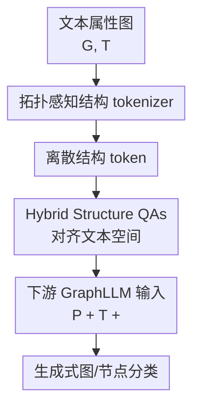

# <SOG$_k$>: One LLM Token for Explicit Graph Structural Understanding

**会议**: ICLR2026  
**OpenReview**: [https://openreview.net/forum?id=eXidGkRUFt](https://openreview.net/forum?id=eXidGkRUFt)  
**代码**: https://github.com/Jingyao-Wu/SOG  
**领域**: 图学习 / GraphLLM  
**关键词**: 结构 token, 图结构理解, GraphLLM, 离散拓扑编码, 结构幻觉  

## 一句话总结
本文把整张图或目标节点的拓扑压缩成一个与 LLM 原生词表共存的离散结构 token `<SOG$_k$>`，再用结构问答把它和文本 token 对齐，从而在分子图分类和节点分类上用极少 token 显著提升 LLM 的图结构理解能力。

## 研究背景与动机
**领域现状**：LLM 处理文本属性图时，常见范式是把 LLM 当作预测器：输入任务说明、节点或图的文本属性，再让模型直接生成类别或答案。问题在于图不是天然序列，拓扑关系必须被转换成某种可被 LLM 接收的形式。现有 GraphLLM 方法大致有两类：一类把边、邻接表、k-hop 邻域等改写成自然语言；另一类用 GNN 或投影器把图压成连续 embedding，再作为 soft prompt 拼进 LLM 输入。

**现有痛点**：Graph-to-Text 的好处是和语言空间一致，但代价是 token 很贵。真实图稍微大一点，边列表和邻域描述就会把上下文塞满，而且节点和边的叙述顺序变化也会让 LLM 给出不同判断，这就是论文强调的 structural hallucination。Graph-to-Embedding 则反过来省 token，却把图表示投影到 LLM token embedding 附近；这些连续向量并不是词表里的离散 token，容易与原生语言 token 空间错位，导致模型“看见了一个向量”，却不一定知道它对应什么拓扑模式。

**核心矛盾**：图结构输入需要同时满足三个要求：完整表达拓扑、占用极少 token、和 LLM 已有 token 空间对齐。文本化图结构通常牺牲效率和稳定性，soft prompt 通常牺牲对齐性。本文的切入点是：如果结构本身也能被离散成 LLM 词表中的特殊 token，那么结构输入就不再是外部模态，而是可以像一个普通词一样被模型读取、生成和比较。

**本文目标**：作者希望构造一组特殊结构 token `{<SOG$_1$>, ..., <SOG$_K$>}`，让每张图根据拓扑映射到其中一个 `<SOG$_k$>`。这个 token 既要足够选择性，能区分不同拓扑原型；又要和文本 token 同处一个可训练空间，能在下游任务中与 SMILES、论文标题、任务 prompt 等语义信息协同工作。

**切入角度**：论文没有继续把图写成长文本，也没有只做连续 soft prompt，而是借鉴离散 codebook / vector quantization 的思路：先用拓扑感知 tokenizer 学到一组结构原型，再把图的全局结构选成一个离散索引。随后通过结构问答让 LLM 学会“这个结构 token 和哪些结构相似、它对应什么文本描述、哪些 token 是近邻”。

**核心 idea**：用一个可选中的离散结构 token `<SOG$_k$>` 代替长篇拓扑文本或连续图 embedding，把图结构压进 LLM 原生 token 空间，从根上缓解 token 冗余和跨模态错位。

## 方法详解

### 整体框架
本文方法可以理解为三段式 Graph-to-Token pipeline。第一段从文本属性图中抽出纯拓扑，用层次遍历给节点添加相对位置属性，再通过 GNN 和离散 codebook 把图结构映射到一个结构 token。第二段构造与任务无关的 Hybrid Structure QAs，让 LLM 学会结构 token 之间的近邻、相似性和文本描述对应关系。第三段在下游任务中，把任务 prompt、文本属性和 `<SOG$_k$>` 一起输入 LLM，用生成式分类完成图级或节点级预测。

这里的关键不是“把图压缩”本身，而是压缩后的表示仍然是离散 token。论文预先扩展 LLM 词表，形成 $V' = V \cup \{<SOG_1>, ..., <SOG_K>\}$。对一张图，模型输入由任务 prompt $P$、文本属性 $T$ 和结构 token `<SOG$_k$>` 组成，生成输出 $O = M(\{P, T, <SOG_k>\}\mid G; V', \Theta)$。这样结构信息不再以一串边描述或一个外部 embedding 出现，而是成为 LLM 可以注意、比较和生成的显式符号。

### 关键设计
**1. 拓扑感知结构 tokenizer：把图结构选成一个高度选择性的离散 token**

普通图序列化最大的问题是节点编号和边顺序没有稳定语义。本文先给图找一个 anchor node，默认用节点度这类重要性指标选中心，然后用相对 anchor 的 hop 距离和同 hop 内的重要性排序给每个节点写入结构属性，例如 “first-hop neighbor #1” 或 “second-hop neighbor #3”。这一步把原来任意编号的节点变成了带空间坐标的节点，减少了排列变化导致的结构幻觉。

有了这些结构属性后，论文用文本 encoder $f_T(\cdot)$ 把属性转成初始节点特征 $X_s$，并额外加入一个连接所有节点的 virtual global node。随后 GNN $f_G(\cdot)$ 通过消息传递得到结构隐表示 $H_s=f_G(X_s)$，其中 global node 的表示被当作整张图的结构表示。到这里仍然是连续空间，所以作者进一步引入结构 codebook $C=\{c_1,...,c_K\}$，对每个节点表示按欧氏距离选择最近 codebook entry：$k = \arg\min_j \|h_s^i-c_j\|_2^2$。最终整张图使用 global node 对应的 vocabulary index，成为 `<SOG$_k$>`。

这个设计的价值在于“压缩”和“选择性”同时发生。一个图不是被投影成任意软向量，而是必须落到某个有限结构原型上；同一 scaffold 或相似拓扑会倾向选择同一个 token，不同拓扑则选择不同 token。论文后面的 toy case 也显示，给同一图换成随机或静态结构 token，LLM 输出正确标签的概率会明显变化，说明 `<SOG$_k$>` 不是装饰性标记，而是在承担真实的结构判别信息。

**2. 自监督拓扑重构：让 codebook token 真正记住图结构而不是只记住训练标签**

离散 token 如果只靠下游监督学习，很容易退化成类别捷径。本文在 tokenizer 阶段使用自监督拓扑重构来约束 codebook：选中的 codebook entries 经过轻量 decoder $f_q(\cdot)$ 重构节点特征 $\hat{X}$，再用 $\hat{A}=\hat{X}\hat{X}^T$ 重构邻接矩阵。训练目标包含邻接矩阵重构误差、update loss 和 commitment loss：

$$
\mathcal{L}=\|A-\hat{A}\|_F^2 + \|sg[H_s]-z_e(H_s)\|_2^2 + \beta\|H_s-sg[z_e(H_s)]\|_2^2.
$$

其中 $sg[\cdot]$ 表示 stop-gradient，$z_e(H_s)$ 表示为每个节点选中的 codebook entry。第一项迫使离散表示保留拓扑，后两项让连续 GNN 表示和离散 codebook 互相靠拢，并避免编码器在量化边界附近漂移。这样训练出的 `<SOG$_k$>` 更像“图结构词表”，而不是某个任务上的隐式分类标签。

这个设计也解释了为什么论文强调 K 的选择。结构词表太小，不同拓扑会被挤到同一个 token，表达力不足；词表太大，token 过细则可能过拟合具体图。实验中 $K=256$ 的平均表现最好，说明这个规模在分子图 benchmark 上大致平衡了结构区分度和泛化能力。

**3. Hybrid Structure QAs：用结构问答把 `<SOG$_k$>` 拉进 LLM 文本 token 空间**

即使 tokenizer 能选出结构 token，LLM 也还不知道这些新增 token 的语义。本文构造三类与下游任务无关的结构问答来做对齐。第一类是 k-nearest token neighbor matching：给定 `<SOG$_i$>`，要求模型回答它在结构向量空间中的最近邻 token；这让 LLM embedding 空间保留局部结构邻域。第二类是 true/false structure similarity judgment：给两个结构 token，让模型判断它们是否表示相似结构；正负样本由连续 global node embedding 的余弦相似度阈值决定，相当于把结构对比学习转成语言问答。第三类是 description-token pair matching：给出文本化的图连接描述，让模型生成对应结构 token，直接把自然语言拓扑描述和离散结构 token 连起来。

训练时，作者冻结已有文本 token embedding，只更新新加入的结构 token embedding，并用 LoRA 让 LLM 获得上下文感知的结构适配能力。这个选择很关键：如果大幅改动原有词表，可能破坏 LLM 已学到的语言知识；只更新结构 token 和少量 LoRA 参数，则更像是在原语言空间旁边补上一组结构词，并教模型怎么读它们。由于这些 QA 不依赖具体 molecule label、citation label 或下游任务，它们可以服务于图级分类，也可以扩展到节点级分类。

**4. 下游生成式分类：把结构 token、文本属性和任务 prompt 合成同一条 LLM 输入**

完成结构对齐后，下游阶段并不改变 LLM-as-Predictor 的基本接口。系统 prompt 说明任务，例如“根据结构 token 和文本属性判断分子是否有毒”；用户 prompt 里包含任务描述 $P$、原始文本属性 $T$，以及 `[Structural Token] <SOG$_k$>`。训练目标仍是生成 ground-truth label 的自回归损失：$\mathcal{L}=-\sum_t \log p_\Theta(y_t\mid y_{<t}, P, T, <SOG_k>)$。

这种设计把结构理解拆成了两层：通用层学会 `<SOG$_k$>` 的结构语义，任务层再学会某个结构语义对 BBBP、Tox21、BACE 或 Cora/Pubmed 标签意味着什么。相比把整张图文本化后让 LLM 临场读拓扑，这种方式把“读图结构”的负担提前沉淀到 tokenizer 和结构 QA 中，下游输入只需要一个 token 就能携带全局或局部结构信号。

### 一个完整示例
以一个分子图分类任务为例，输入分子有 SMILES 文本属性，同时也有原子和键构成的图结构。传统 Graph-to-Text 会把键连接关系写成较长序列，例如 A 与 B 相连、A 与 C 相连、B 与 D 相连；soft prompt 会用 GNN 得到一个连续向量，再经 projector 拼进 LLM。本文则先从分子图中选 degree 最大或最重要的节点作为 anchor，把其他节点标成 first-hop、second-hop 等相对位置，再通过 GNN 聚合到 global node。

假设 global node 最终最近的 codebook entry 是第 157 个，输入给 LLM 的不是完整邻接表，而是一行 `[Structural Token] <SOG$_{157}$>`。在结构 QA 预训练中，LLM 已经见过 `<SOG$_{157}$>` 的近邻 token、相似/不相似 token 对，以及某些拓扑文本描述与它的匹配关系。到 BBBP 或 Tox21 任务里，LLM 同时看到 SMILES 和 `<SOG$_{157}$>`，就可以把“这个分子长得像哪类 scaffold”和“这个 SMILES 的化学语义”结合起来生成 True/False。

节点分类也类似。对 Cora 或 Pubmed 中的目标论文节点，方法先采样 2-hop ego-graph，把目标节点局部邻域映射成一个节点级结构 token。下游 prompt 中同时给出论文标题/摘要等文本信息和该局部结构 token，模型据此判断目标节点属于哪个研究类别。这里 `<SOG$_k$>` 从图级 global node 扩展到局部节点视角，说明这个 tokenization 思路不只服务于分子图，也能表达局部结构模式。

### 损失函数 / 训练策略
训练分三步。第一步是结构 tokenizer 训练：用 SentenceTransformers all-MiniLM-L6-v2 编码结构属性，用两层 GCN 做结构 encoder，结构词表大小默认 $K=256$。先用邻接重构任务 warm-up GCN，再联合优化 GCN 和离散结构 codebook。论文给出的实现细节中，warm-up 学习率为 $1\times10^{-2}$，联合阶段 GCN 学习率为 $5\times10^{-2}$，结构 token 离散 embedding 学习率为 $0.5$，优化器为 Adam。

第二步是结构 token 与 LLM 的 QA 对齐。作者使用 LLaMA2-7B-chat 和 Llama-3.2-3B-Instruct 两个 backbone，只优化新增结构 token embedding，并通过 LoRA 注入结构上下文能力；学习率为 $5\times10^{-4}$，LoRA rank 为 16，优化器为 AdamW。已有文本 token 被冻结，避免破坏原语言空间。

第三步是任务特定 fine-tuning。对图级分类，输入是任务 prompt、分子 SMILES 或其他文本属性，以及 `<SOG$_k$>`，输出是二分类标签。由于 MoleculeNet 多数任务类别不平衡，作者对不同数据集采用了不同的重采样或联合训练策略，例如对部分任务做 1:1 minority oversampling，对 Tox21 部分任务联合 17 个任务训练。对节点分类，方法采样 2-hop ego-graph，并使用目标节点对应的结构 token 完成 Cora/Pubmed 分类。

## 实验关键数据

### 主实验
图级实验覆盖 MoleculeNet 的 BBBP、Tox21、ClinTox、HIV 和 BACE 五个数据集，指标为 AUC-ROC。论文比较了大模型 zero-shot、非 LLM 分子图方法、小模型 zero/few-shot、LoRA SFT、soft prompt 和本文 `<SOG$_k$>`。最值得注意的是，本文用 3B/7B LLM 加一个结构 token，就能在多数组合上超过更大的通用 LLM 或传统 graph-language baseline。

| Backbone / 方法 | BBBP | Tox21 | ClinTox | HIV | BACE |
|--------|------|------|---------|-----|------|
| GPT-4 zero-shot | 61.5 | 55.2 | 51.6 | 65.9 | 62.5 |
| Galactica-120B zero-shot | 66.1 | 68.9 | 82.6 | 74.5 | 61.7 |
| LLaMA3-3B LoRA SFT | 60.2 ± 1.2 | 50.8 ± 0.8 | 63.8 ± 2.8 | 51.5 ± 0.7 | 50.5 ± 2.9 |
| LLaMA3-3B `<SOG$_k$>` | 76.9 ± 3.1 | 83.4 ± 3.3 | 85.5 ± 3.7 | 75.7 ± 1.6 | 63.3 ± 4.2 |
| LLaMA2-7B LoRA SFT | 55.0 ± 0.8 | 60.6 ± 3.4 | 59.3 ± 3.7 | 78.1 ± 2.2 | 61.7 ± 2.7 |
| LLaMA2-7B `<SOG$_k$>` | 66.4 ± 2.7 | 72.4 ± 3.1 | 94.3 ± 0.1 | 83.2 ± 1.9 | 98.4 ± 0.8 |

节点级实验在 Cora 和 Pubmed 上评估 accuracy 和 micro-F1。这里 `<SOG$_k$>` 使用目标节点 2-hop ego-graph 的局部结构 token，而不是整图 global token。

| 方法 | Cora Acc | Cora F1 | Pubmed Acc | Pubmed F1 |
|------|----------|---------|------------|-----------|
| GPT-4o | 68.62 | 68.49 | 77.96 | 71.79 |
| DeepSeek-chat | 65.62 | 65.77 | 79.23 | 74.30 |
| ZEROG | 62.52 | 57.53 | 79.08 | 77.94 |
| GraphGPT | 24.90 | 7.98 | 39.85 | 20.07 |
| 本文 LLaMA3-3B | 91.58 | 78.62 | 97.46 | 85.50 |
| 本文 LLaMA2-7B | 88.80 | 71.28 | 96.27 | 89.64 |

### 消融实验
结构 token 的消融直接检验 `<SOG$_k$>` 是否真的有用。作者比较了三种变体：完全去掉结构 token、所有样本使用同一个 static token、随机替换成 random token。结果显示，正确映射的结构 token 在绝大多数数据集上明显优于这些替代方案。

| Model | 配置 | BBBP | Tox21 | ClinTox | HIV | BACE |
|------|------|------|------|---------|-----|------|
| LLaMA3-3B | w/o Structural Token | 61.2 | 72.3 | 81.8 | 53.0 | 53.2 |
| LLaMA3-3B | Static Structural Token | 60.7 | 67.8 | 52.5 | 54.6 | 54.3 |
| LLaMA3-3B | Random Structural Token | 57.3 | 62.2 | 52.8 | 55.3 | 55.8 |
| LLaMA3-3B | Ours | 76.9 | 83.4 | 85.5 | 75.7 | 63.3 |
| LLaMA2-7B | w/o Structural Token | 61.3 | 66.4 | 79.5 | 69.6 | 94.2 |
| LLaMA2-7B | Static Structural Token | 64.7 | 69.1 | 92.0 | 81.5 | 94.2 |
| LLaMA2-7B | Random Structural Token | 62.1 | 68.6 | 88.5 | 83.4 | 96.7 |
| LLaMA2-7B | Ours | 66.4 | 72.4 | 94.3 | 83.2 | 98.4 |

结构设计敏感性实验显示，结构词表大小和 anchor node 选择都会影响效果。$K=256$ 在平均表现上最好；anchor 策略里 degree 的平均表现为 78.4，高于 random、PageRank 和 betweenness。这个结果支持论文的直觉：结构 token 需要足够细的词表和稳定的拓扑坐标系。

| 设计选择 | 主要结论 | 解释 |
|------|------|------|
| 结构词表大小 $K$ | $K=256$ 平均最佳 | 太小混淆结构原型，太大更易过拟合 |
| anchor by degree | 平均 78.4，优于其他 anchor | degree 中心在分子图中提供稳定结构参照 |
| Hybrid QAs 全部使用 | 通常优于单独某类 QA | 近邻、相似性、文本描述三种信号互补 |
| 正确 token vs random/static | 正确 token 最稳 | token 选择具有图结构选择性，不是普通占位符 |

### 关键发现
- `<SOG$_k$>` 的最大收益来自把结构信息变成 LLM 可读的离散符号，而不是单纯增加参数。Soft prompt 在 LLaMA3-3B 上甚至比 zero-shot 更差，说明连续图 embedding 与语言 token 空间错位确实会伤害小模型。
- 结构 token 的选择具有可解释性：相关性热力图显示前 50 个结构 token 非对角相关性较低，说明 token 冗余不高；分子 case study 中，共享 Bemis-Murcko scaffold 的分子常映射到同一个结构 token。
- 节点分类结果说明 tokenizer 不只捕捉整图 scaffold，也能通过 ego-graph 捕捉局部结构。这个扩展性是论文比较重要的证据，否则方法可能只被理解成分子图上的特殊技巧。
- description-token matching 有时会让性能略降，论文解释为细粒度结构描述增加了学习难度。这提示结构对齐 QA 不是越难越好，需要在可学习性和结构细节之间取平衡。

## 亮点与洞察
- 把图结构做成一个“词”是本文最干净的想法。它避免了 Graph-to-Text 的长上下文开销，也绕开了 soft prompt 的模态错位，让图拓扑以离散 token 的方式进入 LLM 注意力机制。
- tokenizer 的 anchor + hop-relative attribute 很实用。它没有假设原始节点编号可靠，而是重新建立一个相对坐标系，专门针对 LLM 对节点/边排列敏感的问题。
- Hybrid Structure QAs 是方法成立的关键中间层。新增 `<SOG$_k$>` 如果没有语言化训练，只是词表里的陌生符号；通过近邻、相似性和描述匹配三类问答，模型才逐步知道这些符号之间有什么拓扑关系。
- 实验中 `<SOG$_k$>` 在 3B/7B 模型上超过不少大模型 baseline，说明图结构不是单靠参数规模就能补齐的能力。把结构输入形式做对，可能比把语言模型做大更有效。
- 这个思路可以迁移到其他结构化数据。比如知识图谱子图、程序调用图、交通网络、甚至多模态场景图，都可能先学习结构词表，再把离散 token 拼进 LLM prompt。

## 局限与展望
- 当前 graph-level 主实验集中在 MoleculeNet 分子分类，拓扑规模和类型相对规整。对于异质图、动态图、超大知识图谱或高阶关系图，一个 `<SOG$_k$>` 是否还能表达足够结构信息，需要进一步验证。
- 单 token 压缩非常优雅，但也可能成为信息瓶颈。不同任务可能关注不同结构粒度：毒性预测看 scaffold，社交网络预测可能看社区和桥接节点；一个 global token 未必总能覆盖所有任务相关细节。
- tokenizer 和 QA 对齐引入了额外预训练流程。相比直接文本化图结构，本文方法需要训练 GNN/codebook、构造结构 QA、扩展 LLM 词表和 LoRA 微调，工程成本更高。
- 论文的 interpretability 主要来自 token 相关性、scaffold 一致性和可视化案例，还没有系统证明每个 `<SOG$_k$>` 对应可命名的人类拓扑概念。未来可以给结构 token 自动生成描述，形成真正可检索的 graph vocabulary。
- description-token matching 有时带来性能下降，说明文本描述与离散结构 token 的对齐并非完全稳定。后续可以研究课程学习、难例采样或分层结构 token，先学粗 scaffold，再学细粒度拓扑。

## 相关工作与启发
- **vs Graph-to-Text 方法**: Talk Like a Graph、InstructGraph、GraphText、LangTopo 等方法把图关系写成自然语言、代码或邻域文本，优势是直接利用 LLM 的语言理解；本文则把拓扑压成 `<SOG$_k$>`，优势是 token 极省且顺序更稳定，劣势是需要额外 tokenizer 和对齐训练。
- **vs Graph-to-Embedding / Soft Prompt 方法**: GraphGPT、LLaGA、G-retriever、GraphAdapter 等方法用 GNN 或投影器把图 embedding 接入 LLM，能减少文本长度；本文指出这些连续向量与 LLM 原生 token 空间存在错位，因此改用离散结构 token，并通过 QA 让它住进文本 token embedding 邻域。
- **vs VQGraph / 离散图表示**: 本文借鉴了自监督 topology reconstruction 和 codebook 量化思想，但目标不是替代 GNN/MLP 做图分类，而是为 LLM 提供可读结构 token。换言之，它把离散图表示从图模型内部表征推进到语言模型输入接口。
- **对后续研究的启发**: 如果结构 token 能成立，那么 GraphLLM 的关键问题可能不只是 prompt 怎么写，而是“给 LLM 的结构词表怎么造”。未来可以考虑多粒度结构 token、可组合结构 token、跨数据集共享结构词表，以及让 LLM 反向生成或编辑图结构 token。

## 评分
- 新颖性: ⭐⭐⭐⭐⭐ 把整张图拓扑显式离散成一个 LLM token，并围绕 token 对齐设计完整训练流程，想法清晰且辨识度很高。
- 实验充分度: ⭐⭐⭐⭐☆ 覆盖图级和节点级任务、主实验和多种消融都比较完整，但图类型仍偏分子和 citation benchmark，异质/动态图验证不足。
- 写作质量: ⭐⭐⭐⭐☆ 论文结构清楚，方法图和实验问题设置直接；部分实现细节和 QA 构造阈值说明还可以更细。
- 价值: ⭐⭐⭐⭐⭐ 对 GraphLLM 输入表示有直接启发，尤其适合需要结构紧凑输入、又不想牺牲 LLM token 空间对齐的场景。

<!-- RELATED:START -->

## 相关论文

- [\[NeurIPS 2025\] The Underappreciated Power of Vision Models for Graph Structural Understanding](../../NeurIPS2025/graph_learning/the_underappreciated_power_of_vision_models_for_graph_structural_understanding.md)
- [\[ICLR 2026\] Entropy-Guided Dynamic Tokens for Graph-LLM Alignment in Molecular Understanding](entropy-guided_dynamic_tokens_for_graph-llm_alignment_in_molecular_understanding.md)
- [\[ICLR 2026\] Towards Improved Sentence Representations using Token Graphs](towards_improved_sentence_representations_using_token_graphs.md)
- [\[ICLR 2026\] One for Two: A Unified Framework for Imbalanced Graph Classification via Dynamic Balanced Prototype](one_for_two_a_unified_framework_for_imbalanced_graph_classification_via_dynamic_.md)
- [\[ICLR 2026\] SAGA: Structural Aggregation Guided Alignment with Dynamic View and Neighborhood Order Selection for Multiview Graph Domain Adaptation](saga_structural_aggregation_guided_alignment_with_dynamic_view_and_neighborhood_.md)

<!-- RELATED:END -->
