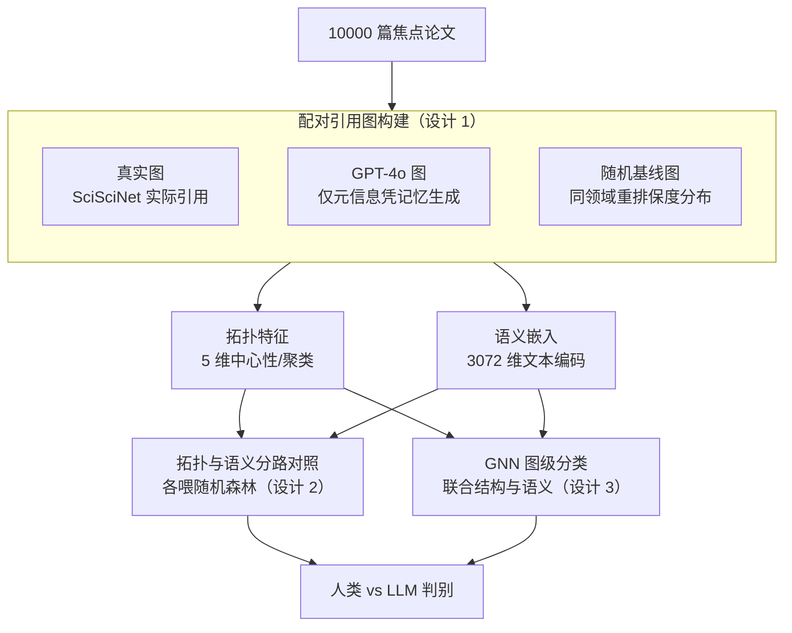

# Structurally Human, Semantically Biased: Detecting LLM-Generated References with Embeddings and GNNs

**会议**: ICLR 2026  
**arXiv**: [2601.20704](https://arxiv.org/abs/2601.20704)  
**代码**: 无  
**领域**: AI安全 / 图学习  
**关键词**: LLM引用检测, 引用图, 图神经网络, 语义嵌入, 学术诚信

## 一句话总结
通过构建 10000 篇论文的配对引用图（人类 vs GPT-4o 生成 vs 随机基线），发现 LLM 生成的参考文献在图拓扑结构上与人类几乎不可区分（RF 仅 60% 准确率），但语义嵌入可有效检测（RF 83%，GNN 93%），说明 LLM 精确模仿了引用拓扑但留下了可检测的语义指纹。

## 研究背景与动机

**领域现状**：LLM 越来越多地被用于合成科学知识、起草文献综述和建议参考文献。先前研究发现 LLM 生成的参考文献在粗粒度指标上与人类相似（标题长度、团队规模、引用数），但在细节上有系统偏差（马太效应加强、偏好近期论文、减少自引用）。

**现有痛点**：尚不清楚能否可靠地区分 LLM 和人类生成的参考文献列表。单条引用审计（如 LLM-Check）不足以捕获列表级别的模式。

**核心矛盾**：LLM 是否真正理解引用结构，还是只是表面模仿？如果拓扑结构相同，差异在哪里？

**本文目标**：系统评估 LLM 生成的引用图与人类引用图在结构和语义两个维度上的差异，并开发检测方法。

**切入角度**：渐进式建模策略——从可解释的图结构特征到语义嵌入，再到 GNN，逐步分解拓扑 vs 语义的贡献。

**核心 idea**：LLM 参考文献"结构上像人类，语义上有偏差"——检测应针对内容信号而非图结构。

## 方法详解

### 整体框架

整套方法是一个层层剥离的对照实验：先为同一批焦点论文构建三种可直接比较的引用图（人类真实、GPT-4o 生成、领域匹配随机基线），再从每张图分别抽取纯拓扑特征和纯语义嵌入，分两路去喂分类器，看哪一路信号才真正撑得起"人类 vs LLM"的判别。检测器从可解释的随机森林一直递进到能联合利用结构和语义的 GNN，从而把拓扑贡献和语义贡献拆解清楚。

### 关键设计

**1. 配对引用图构建：让三种来源的图在同一焦点论文上严格可比**

判别 LLM 引用是否"像人类"最大的混淆因素，是不同论文的主题和领域本身就会带来引用结构差异。为此本文从 SciSciNet 采样 10000 篇焦点论文，对每篇都构建三张共享同一主节点的引用图：真实图的边来自 SciSciNet 检索到的实际引用关系；GPT-4o 图只喂入标题、摘要、作者等元信息，让模型纯参数化地"凭记忆"生成参考列表，不接任何检索；随机基线图则在同领域内均匀重排引用、保持度分布不变。三张图共享焦点节点、规模相当，差异只来自引用内容本身，这样后续任何判别力都能干净地归因到"人类 vs 生成"而非主题分布差异。随机基线进一步充当锚点——如果连随机图都难以区分，说明任务本身退化。

**2. 拓扑特征与语义嵌入的分路对照：定位判别信号到底来自结构还是内容**

为了回答"LLM 是真懂引用结构还是只在表面模仿"，本文把两类信号严格隔离后各自送进分类器。拓扑路只取五个图结构量——度中心性、接近中心性、特征向量中心性、聚类系数和边数，刻画引用网络的连接形态；语义路则用 OpenAI text-embedding-3-large 把每个节点的论文文本编码成 3072 维嵌入，再聚合成图级表示。两路特征分别喂同一个随机森林，准确率的落差就直接量化了拓扑与内容各自携带多少判别信息。实验里拓扑路只有 0.608（几乎贴着随机），语义路跳到 0.835，正是这个对比支撑了"结构像人、语义有偏"的核心结论。为排除"3072 维本身带来的容量优势"这一干扰，作者还用随机嵌入替换真实嵌入，准确率掉回约 0.50，确认判别力来自语义结构而非维度。

**3. GNN 图级分类：联合结构与语义把上限推到最高**

随机森林只能吃聚合后的图级特征，会丢掉节点间的关系信息。本文进一步用 GCN/GAT/GIN/GraphSAGE 做图级二分类，节点特征可以是 5 维结构属性，也可以是 3072 维语义嵌入，经过消息传递和图级 readout 后输出"人类 vs 生成"。当节点特征用语义嵌入时，GNN 把准确率从随机森林的 0.835 进一步推到 0.93——既验证了图结构能放大语义信号，也给出了该任务可达的检测上限；而仅用结构特征的 GNN 仍停在约 0.55，再次印证拓扑本身不足以区分。

### 损失函数 / 训练策略

GNN 用 Adam 优化器训练，数据按 70/15/15 划分训练/验证/测试，且类别平衡以避免偏置。鲁棒性上做了两层交叉验证：生成器侧用 GPT-4o 与 Claude Sonnet 4.5 双 LLM（GPT 训练、Claude 测试仍保持约 0.72 准确率，说明检测器不是过拟合单一生成器）；嵌入侧用 SPECTER 与 OpenAI 双模型，确认语义指纹不依赖特定编码器。

## 实验关键数据

### 主实验

| 方法 | GT vs GPT | GT vs Random | GPT vs Random |
|------|----------|-------------|--------------|
| RF (结构特征) | 0.608 | 0.896 | 0.928 |
| RF (语义嵌入) | **0.835** | 0.908 | 0.953 |
| GNN (结构特征) | ~0.55 | ~0.90 | ~0.93 |
| GNN (语义嵌入) | **0.93** | ~0.95 | ~0.97 |

### 消融实验

| 配置 | GT vs GPT 准确率 | 说明 |
|------|----------------|------|
| GNN + 嵌入 | 93% | 最佳 |
| RF + 嵌入 | 83.5% | 语义嵌入贡献大 |
| RF + 结构 | 60.8% | 接近随机 |
| GNN + 结构 | ~55% | 结构完全不够 |
| 随机嵌入替换 | ~50% | 确认非维度效应 |
| 跨生成器（GPT训练→Claude测试） | ~72% | 泛化到其他LLM |

### 关键发现
- **拓扑几乎不可区分**：GPT 引用图的中心性、聚类系数与真实图高度重叠，RF 仅 60%
- **语义指纹可检测**：嵌入特征将准确率从 60% 提升到 83%（RF）/ 93%（GNN）
- **随机基线容易区分**：真实 vs 随机 89%+，GPT vs 随机 93%+——说明 GPT 确实生成了结构合理的引用
- **跨 LLM 泛化**：GPT-4o 训练的分类器对 Claude 仍有 72% 准确率
- **用随机嵌入替换后准确率降到 50%**，确认是语义结构而非维度带来的区分力

## 亮点与洞察
- **"结构像人，语义有偏"的发现**对审计和去偏策略有直接指导意义——应关注内容信号而非图结构
- **领域匹配随机基线**的设计严谨——同领域重排引用控制了主题分布
- **渐进式分析**（结构→嵌入→GNN）清晰展示了每个层次的贡献

## 局限与展望
- 仅测试了参数化生成（无 RAG），实际应用中 LLM 可能有检索增强
- 语义差异的具体维度（近期偏好、声望偏好等）未深入分析
- 3072-D 嵌入的哪些维度驱动区分力？
- 仅二分类，未探索多分类（部分 LLM 参考）

## 相关工作与启发
- **vs LLM-Check**：LLM-Check 审计单条引用存在性，本文评估整个引用列表的图级模式
- **vs Algaba et al.**：先前工作发现粗粒度一致性，本文通过 GNN + 嵌入实现高准确率自动检测

## 评分
- 新颖性: ⭐⭐⭐⭐ 引用图+GNN 的组合新颖，但分析框架本身较直接
- 实验充分度: ⭐⭐⭐⭐⭐ 10000 图、双 LLM、双嵌入模型、多基线、随机嵌入控制，非常全面
- 写作质量: ⭐⭐⭐⭐ 可视化出色，逐层分析清晰
- 价值: ⭐⭐⭐⭐ 对学术诚信和 AI 辅助写作有实际意义

<!-- RELATED:START -->

## 相关论文

- [\[ICLR 2026\] Bridging ML and Algorithms: Comparison of Hyperbolic Embeddings](bridging_ml_and_algorithms_comparison_of_hyperbolic_embeddings.md)
- [\[ICML 2025\] LLM Enhancers for GNNs: An Analysis from the Perspective of Causal Mechanism Identification](../../ICML2025/graph_learning/llm_enhancers_for_gnns_an_analysis_from_the_perspective_of_causal_mechanism_iden.md)
- [\[ACL 2026\] Graph-Based Alternatives to LLMs for Human Simulation](../../ACL2026/graph_learning/graph-based_alternatives_to_llms_for_human_simulation.md)
- [\[ICLR 2026\] Glance for Context: Learning When to Leverage LLMs for Node-Aware GNN-LLM Fusion](glance_for_context_learning_when_to_leverage_llms_for_node-aware_gnn-llm_fusion.md)
- [\[ICLR 2026\] On the Expressive Power of GNNs for Boolean Satisfiability](on_the_expressive_power_of_gnns_for_boolean_satisfiability.md)

<!-- RELATED:END -->
