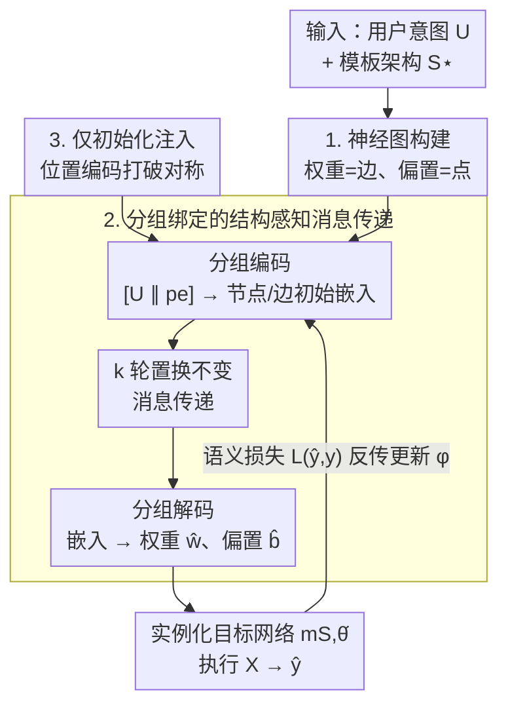

# Structure-Aware Graph Hypernetworks for Neural Program Synthesis

**会议**: ICLR 2026  
**OpenReview**: [https://openreview.net/forum?id=x7zOzUwtR7](https://openreview.net/forum?id=x7zOzUwtR7)  
**代码**: 有（论文 App. F 承诺开源完整代码与数据集）  
**领域**: 图学习 / 超网络 / 神经程序合成 / 元学习  
**关键词**: 神经程序合成, 超网络, 神经图, 置换对称, OOD 泛化

## 一句话总结
把"程序合成"重铸为在固定网络架构的权重空间里做连续优化，并提出一个结构感知的图超网络 Meta-GNN——它把目标网络画成"权重=边、偏置=点"的神经图、在置换等价组内绑定编码/消息/解码参数，从而折叠掉神经元置换带来的冗余监督，使得从用户意图一次前向直接生成整套权重、并显著提升对未见意图的 OOD 泛化。

## 研究背景与动机

**领域现状**：传统程序合成把任务建模成在符号空间（抽象语法树、DSL）里做组合搜索，用约束求解找出满足用户意图的程序，代表系统有 SKETCH、SyGuS、CEGIS 等。它们能给出强正确性保证，但也被两个老大难卡住。

**现有痛点**：其一是**搜索**——离散程序空间需要昂贵的枚举，且语法和语义纠缠在一起，一个小改动可能同时破坏两者，目标函数曲面是分段常数的；其二是**验证**——正确性是硬性的 True/False 判定，只告诉你"对/错"，不给"离正确还差多少"的梯度信号。这两点让符号合成很难规模化到小 DSL 或短代码片段之外。

**核心矛盾**：根本症结在于"离散符号 + 硬判定"。只要还在离散 token 空间里搜、只要监督信号只有通过/失败两档，就既享受不到梯度，也拿不到分级的改进方向。

**本文目标**：作者提出一个**连续松弛**——把带结构 $S$、权重 $\theta$ 的神经网络本身当作一段可执行程序，定义"神经程序"（NeuroP）为二元组 $(S,\theta)$。固定一个模板架构 $S^\star$ 后，合成就退化成"从用户意图 $U$ 直接生成权重 $\theta$"：语法因构造而天然合法，语义则由可微的前向 $\mathrm{exec}(S^\star,\theta,X)$ 给出。代价是放弃了精确正确性保证（得到的是高精度但非完美的近似程序），换来的是梯度优化和稠密的学习信号。

**切入角度**：在这个框架下，最难也最有价值的问题是——能不能学到一个**可靠的 $U\to\theta$ 映射，外推到训练时从未见过的意图**（即真正的 OOD 泛化）？一个看似现成的工具是经典超网络（HyperNetworks），但它把目标网络当黑箱、吐出一个**扁平的权重列表**，完全无视目标网络的结构和神经元置换对称性。问题在于：同一个函数有许多等价的权重实现（隐层神经元换个排列、权重跟着换，网络功能完全不变），扁平超网络把这些等价解当成不同的监督目标，**监督被人为切碎**，OOD 泛化随之受损。

**核心 idea**：用一个**结构感知的图超网络**代替扁平超网络——把目标架构解码成它的计算图（权重为边、偏置为点），在置换等价的神经元组内绑定编码器/解码器参数，并沿图结构做对称感知的消息传递，从而把对称导致的等价类**坍缩成一个**，在不损失表达力的前提下缩小有效搜索空间。

## 方法详解

### 整体框架

方法要解决的是：给定一段用户意图 $U$（如"模 $p$ 加法"里的素数 $p$）和一个固定模板架构 $S^\star$，一次前向就生成出整套权重 $\hat\theta=M_\phi(U)$，让实例化后的网络 $m_{S,\hat\theta}$ 真的实现 $U$ 想要的行为，并且对训练时没见过的 $U$ 也能成立（零样本，部署时拿不到任何测试 $(X,Y)$）。

整条管线是这样转的：先把模板架构 $S^\star$ 翻成一张**神经图** $G^\star=(V,E)$（偏置当节点、权重当边）；元学习器 $M_\phi$ 的可学习参数 $\phi$ 只活在三组模块里——编码器 $f_{\mathrm{enc}}$、消息函数 $f_{\mathrm{msg}}$、解码器 $f_{\mathrm{dec}}$，且都在置换等价组内**共享**。编码器把"意图 + 每个槽位的位置编码"映成节点/边的初始嵌入；接着跑 $k$ 轮**置换不变聚合**的消息传递，得到节点/边嵌入；解码器再把嵌入映回标量，写进目标网络的权重 $\hat w_{ij}$ 和偏置 $\hat b_i$。实例化后的网络在输入 $X$ 上前向得到 $\hat y$，语义损失 $L(\hat y,y)$ 的梯度一路反传穿过"实例化网络 → 解码 → 消息传递 → 编码"来更新 $\phi$。

作者按"结构感知强度"给出三档元架构作为对照：**Meta-MLP**（结构无关，一个 MLP 直接吐扁平权重向量，即经典超网络）、**Meta-gMLP**（按槽位分组、组内绑定编码，但用一个全局 mixer 拼接所有槽位）、**Meta-GNN**（既分组又沿图结构做局部消息传递）。本文主角是 Meta-GNN。

### 关键设计

**1. 神经图构建：把目标网络的计算结构变成一张可消息传递的图**

经典超网络无视目标网络结构，是它把等价解当不同目标、切碎监督的根源。本文的第一步就是把这个结构显式地编码进来：将固定模板 $S^\star$ 表示成有向多重图 $G^\star=(V,E)$，**偏置当节点、权重当边**。在这张图上定义自同构 $\phi:V\to V$——一种节点重标号，要求它保持邻接、尊重节点类型（输入/隐藏/输出/偏置）、并保持权重共享约束；每个自同构通过 $\phi_e(i,j)=(\phi(i),\phi(j))$ 诱导出一致的参数置换，统一囊括了 MLP 的隐单元置换和 CNN 的通道置换。关键事实是：自同构不改变实例化网络的函数，而定义在 $G^\star$ 上的消息传递 GNN 对这些诱导置换是可证等变的。相比此前只覆盖 MLP/CNN 的神经图工作，本文把这套表示推广到了**完整的 Transformer**——含多头注意力、残差通路、层归一化。

**2. 分组绑定的结构感知消息传递：在置换等价组内共享参数、用置换不变聚合折叠对称冗余**

这是 Meta-GNN 的核心引擎，直接针对"等价权重被当成不同目标"的痛点。所有 MLP 模块（编码、消息、更新、解码）的参数都按 DeepSet 风格在置换等价组 $g\in G$ 内**绑定共享**，聚合 $\mathrm{AGG}$ 用置换不变（顺序无关）的算子。初始化阶段，节点/边嵌入由"意图 $U$ 拼接该槽位位置编码"经组内共享编码器得到：

$$h^0_V(i)=f\big([\,U\,\|\,p_V(i)\,];\,\phi^{g_V(i)}_{\mathrm{enc}}\big),\qquad h^0_E(i,j)=f\big([\,U\,\|\,p_{E(i,j)}\,];\,\phi^{g_{E(i,j)}}_{\mathrm{enc}}\big).$$

随后 $k$ 轮消息传递在邻域 $N(i)$ 上聚合并更新节点/边嵌入：$m^t_i=\mathrm{AGG}_{j\in N(i)}\,f(h^{t-1}_V(i),h^{t-1}_V(j),h^{t-1}_E(i,j);\phi_{\mathrm{msg}})$，再分别更新 $h^t_V$、$h^t_E$；最后组内共享解码器把终态嵌入映成标量 $\hat b_i,\hat w_{ij}$。其等变性可形式化为：若所有 $\phi_{\mathrm{enc}},\phi_{\mathrm{msg}},\phi_{\mathrm{upd}},\phi_{\mathrm{dec}}$ 组内共享、且 $\mathrm{AGG}$ 顺序无关，则对任意 $\phi\in\mathrm{Aut}(G^\star)$ 有 $\hat\theta(U;G^\star)\mapsto\rho_\Theta(\phi)\,\hat\theta(U;G^\star)=\hat\theta(U;\phi\cdot G^\star)$。直观上，这让"功能等价的一整族权重"在学习时被坍缩成同一个目标——监督不再被对称性切碎、信号更一致；同时局部消息传递自带的"locality"也利用了计算图的拓扑，这正是扁平 Meta-MLP 建模不了的结构先验。

**3. 仅在初始化注入位置编码：在"严格等变"与"可部署"之间的必要折中**

纯等变会带来一个部署死结：本文是**生成式**的，元学习器必须把标量真的写进 $S^\star$ 固定的张量槽位里；可如果隐单元始终可交换，就**没有一个置换规范的方式**把哪个标量放进哪个槽——这跟训练普通 MLP 必须用非对称初始化来打破神经元可交换性是同一回事。作者借鉴 Transformer 的做法：**只在初始化时**给初始意图嵌入加上位置编码来打破对称，而这些位置码不进入 $f_{\mathrm{enc}}/f_{\mathrm{msg}}/f_{\mathrm{dec}}$ 内部，所以学习过程整体仍是置换不变的。这样既保住了目标网络的表达力、坍缩了对称冗余、缩小了有效搜索空间，又让生成的权重能稳定落槽、真正可执行。

### 一个完整示例

以 ADDMOD-$p$（计算 $y=(a+b)\bmod p$）为例走一遍：用户意图就是一个素数 $p$，目标网络是一层 Transformer（约 6048 个权重）。元学习器**只**收到 $U=\{p\}$，先把这层 Transformer 翻成神经图，编码器从 $[p\,\|\,$位置码$]$ 生成节点/边初始嵌入，跑 $k$ 轮消息传递后解码出整套权重，实例化的 Transformer 即可对任意 $(a,b)$ 输出 $\hat y$。训练时对一批 $\{((p,a,b),y)\}$ 用交叉熵反传更新 $\phi$。值得一提的是机理分析的发现：在一个**训练时没见过的** $p=83$ 上，合成出的输入嵌入矩阵 $W_E$ 做 PCA 恰好呈现经典的"时钟"几何（把 token 映到 $(\cos\tilde\theta,\sin\tilde\theta)$）；把各素数的 $W_E(p)$ 拉平做全局 PCA，更落在一条细长的一维轨迹上，拟合出闭式依赖 $x=\cos(5.672/p+3.631)$、$\mathrm{PC1}(p)=23.43\,x$（整体 $R^2>0.94$）——说明元学习器学到的是底层算法、而非记忆实例。

### 损失函数 / 训练策略

训练端到端最小化语义损失 $L_{\mathrm{sem}}(\theta)=\mathbb{E}_{(X,Y)\sim D_U}[L(\mathrm{exec}(S^\star,\theta,X),Y)]$，$L$ 为可微损失，梯度穿过实例化网络回传更新 $\phi$。三个任务故意配不同架构+损失以证明管线与架构/损失无关：SUMFIRST-$n$ 用 MLP+MSE、ADDMOD-$p$ 用 Transformer+交叉熵、1D-ARC 用 seq2seq Transformer+交叉熵。所有模型做**容量匹配**（可训练参数量可比）。每个模型用 10 个随机种子训练，既评估对初始化的方差、也提升收敛到 OOD 表现好的权重的概率。

## 实验关键数据

### 主实验

三个基准：SUMFIRST-$n$（前缀求和，意图为长度 $n\in[1,10]$，193 个权重）、ADDMOD-$p$（模加，意图为素数 $p<100$，6048 个权重）、1D-ARC 混合（多程序族的 1D 变换，意图为"(族, 参数)"，约 17568 个权重）。主指标是求解实例的百分比（精确匹配；SUMFIRST 取整后比对）。下表为各模型在 **OOD Test（未见意图）** 上的准确率：

| 任务 | direct | Meta-MLP | Meta-gMLP | Meta-GNN |
|------|--------|----------|-----------|----------|
| SUMFIRST-$n$ | 0.140 | 0.145 | 0.344 | **0.866** |
| ADDMOD-$p$ | 0.682–0.699 | 0.947 | 0.883 | 0.943 |
| 1D-ARC（混合） | 0.603 | 0.625 | 0.610 | **0.713** |

所有元模型在**同分布 Test** 上都接近 100%（一次前向就生成语义正确的程序，包括约 17k 参数的 seq2seq Transformer），真正的分水岭在 OOD：元学习器（预测权重）整体显著强于 direct 基线（预测输出），而 Meta-GNN 在 SUMFIRST 和 1D-ARC 上明显领先。诚实地说，ADDMOD-$p$ 上 Meta-MLP（0.947）与 Meta-GNN（0.943）基本打平、Meta-MLP 还微微靠前——作者的结论是 Meta-GNN "最强且最可靠"，主要体现在跨任务的一致性上。

### 消融实验

三档元架构的递进本身就是一次"结构感知强度"消融：

| 配置 | 结构感知 | OOD 表现 | 说明 |
|------|---------|---------|------|
| Meta-MLP | 无（扁平权重） | SUMFIRST 0.145 | 经典超网络，忽略结构与置换对称 |
| Meta-gMLP | 仅分组 | SUMFIRST 0.344 | 加分组绑定，但全局 mixer 在大 $T$ 上成容量瓶颈 |
| Meta-GNN | 分组 + 图结构 | SUMFIRST 0.866 | 局部消息传递 + 组内共享，OOD 大幅领先 |

1D-ARC 的**逐族** OOD（Table 3）进一步揭示结构感知的作用：在 Flip 族上**只有** Meta-GNN 达到高 OOD（0.898），其余元学习器仅 0.12–0.17；MoveRight 上 direct Transformer 无法外推（OOD 0.000）而元学习器都成功；RecolorBar(color) 对所有元学习器都不可学（意图是无序数结构的类别变量，未见颜色无从外推）。

### 关键发现
- **结构先验是 OOD 的关键**：把目标看成神经图、用结构感知消息传递坍缩权重空间冗余，监督更不碎、学习信号更一致，OOD 随之更强——SUMFIRST 上 Meta-GNN 把 OOD 从 ~0.14 拉到 0.866。
- **Meta-gMLP 排名不稳的原因**：它的全局 mixer 要处理 $[h_t]_{t=1}^{T}\in\mathbb{R}^{T\cdot d_{\mathrm{meta}}}$，$T$ 一大就逼着 $d_{\mathrm{meta}}$ 缩水形成容量瓶颈；Meta-MLP 容量随自身宽度（与 $T$ 无关）扩展，Meta-GNN 靠局部消息传递+组内共享避开了全局拼接，因此在大目标网络上更稳。
- **学到算法而非记忆实例**：ADDMOD-$p$ 上合成权重在未见素数上恢复出"时钟"表示，并能抽出闭式 $U\to\theta$ 映射（$R^2>0.94$），是元学习器内化底层算法的直接证据。

## 亮点与洞察
- **把"程序"等同于"权重向量"**：NeuroP 这一视角把程序合成从离散符号搜索整体搬进连续权重空间，语法由模板构造保证、语义可微，绕开了 DSL 工程与硬判定验证——这是最让人"啊哈"的重构。
- **用对称性当"减负"而非"约束"**：神经元置换对称通常被看作分析对象，本文把它当成压缩搜索空间的杠杆——组内绑定 + 置换不变聚合把等价类坍缩成一个目标，监督不再被切碎。这套"图等变 + 参数绑定"的思路可迁移到任何需要生成结构化参数（如生成另一网络权重、生成图上信号）的任务。
- **"等变 vs 可部署"的折中很实用**：纯等变在生成式落槽时反而失效，"只在初始化打破对称、其余保持不变"是个干净的工程化答案，对一切要把对称模型用于确定性输出的场景都有借鉴价值。

## 局限与展望
- **基准刻意偏小、偏合成**：三个家族都是结构化的小程序空间，作者承认这是为隔离"严格零样本 $U\to\theta$ 可行性"并做机理分析，但与大、噪声大的真实域有距离。
- **目标架构都很浅**：当前每个任务只用 1 隐层 MLP / 1 层 Transformer / 1 层 seq2seq，为的是保持可解释、利用已知 ground-truth 机制；推广到更深或混合架构留作未来工作（成本随 $|V|+|E|$ 近似线性增长）。
- **未与符号/神经符号合成系统直接对比**：因为那些方法依赖手工 DSL、引入 DSL 会让性能主要取决于 DSL 设计、掩盖本文研究的权重空间机制，故只用容量匹配的 direct 神经基线。
- **意图形式受限**：当前意图是简单的标量/类别，更现实的自然语言或 few-shot I/O 例子（如 ARC）需要更复杂的超网络，是明确的下一步。

## 相关工作与启发
- **vs 经典超网络（HyperNetworks, Ha et al. 2016）**：它们把目标网络当黑箱、吐扁平权重列表、忽略置换对称（即本文的 Meta-MLP 基线）；本文沿计算图做结构感知生成，坍缩对称冗余，OOD 显著更强。
- **vs 权重空间等变网络（DWSNets/Navon 2023、Lim 2024、Zhou 2024）**：那些工作是**判别式**——吃进已训练好的网络做分析/编辑，且多限于 MLP/CNN；本文是**生成式**——把意图映成一整套可执行权重，并把神经图与对称感知消息传递扩展到完整 Transformer。
- **vs MAML 类元学习**：多数元学习/超网络在测试时仍需某种监督（如在新任务的标注样本上做梯度自适应）；本文要求**完全零样本**生成，部署时只给意图 $U$、拿不到任何 $(X,Y)$。
- **vs 神经符号合成（NSPS、NEAR、SYNAPSE 等）**：它们最终仍解码回离散代码、依赖手工 DSL 或可微逻辑；本文彻底抛开 DSL 与中间符号草图，直接把固定架构的整条权重向量当作合成出的程序。

## 评分
- 新颖性: ⭐⭐⭐⭐⭐ 把程序合成重铸为权重空间连续优化、并用图等变超网络解决置换对称导致的监督碎片化，视角与方法都很新。
- 实验充分度: ⭐⭐⭐⭐ 三类架构/损失 + 三档结构感知消融 + 机理分析（闭式 $U\to\theta$）扎实，但基准偏小且未对比符号系统。
- 写作质量: ⭐⭐⭐⭐⭐ 动机推导清晰、图示与机理分析到位，框架与设计对应紧密。
- 价值: ⭐⭐⭐⭐ 为"神经程序合成"这一新生方向给出可靠的 OOD 路线与可解释证据，但当前架构偏浅、离真实应用尚远。

<!-- RELATED:START -->

## 相关论文

- [\[ICLR 2026\] WATS: Wavelet-Aware Temperature Scaling for Reliable Graph Neural Networks](wats_wavelet-aware_temperature_scaling_for_reliable_graph_neural_networks.md)
- [\[ICLR 2026\] Confident Block Diagonal Structure-Aware Invariable Graph Completion for Incomplete Multi-view Clustering](confident_block_diagonal_structure-aware_invariable_graph_completion_for_incompl.md)
- [\[CVPR 2025\] NN-Former: Rethinking Graph Structure in Neural Architecture Representation](../../CVPR2025/graph_learning/nn-former_rethinking_graph_structure_in_neural_architecture_representation.md)
- [\[ICLR 2026\] Global and Local Topology-Aware Graph Generation via Dual Conditioning Diffusion](global_and_local_topology-aware_graph_generation_via_dual_conditioning_diffusion.md)
- [\[NeurIPS 2025\] SSTAG: Structure-Aware Self-Supervised Learning Method for Text-Attributed Graphs](../../NeurIPS2025/graph_learning/sstag_structure-aware_self-supervised_learning_method_for_text-attributed_graphs.md)

<!-- RELATED:END -->
