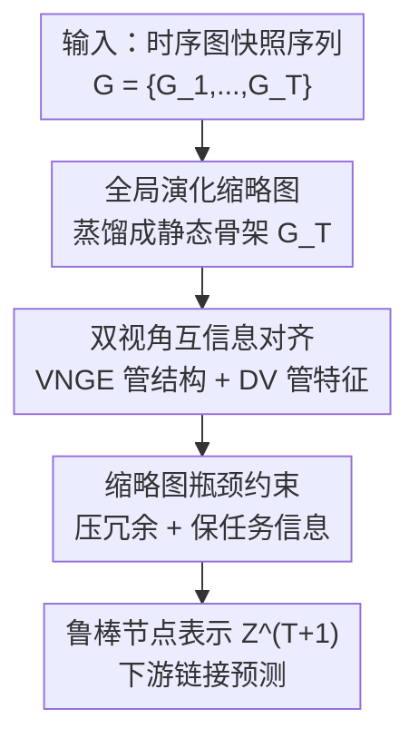

# Temporal Graph Thumbnail: Robust Representation Learning with Global Evolutionary Skeleton

**会议**: ICLR 2026  
**OpenReview**: [https://openreview.net/forum?id=a4e0zoaiD8](https://openreview.net/forum?id=a4e0zoaiD8)  
**代码**: https://github.com/shiwning/TGT  
**领域**: 图表示学习 / 时序图  
**关键词**: 时序图、表示鲁棒性、冯·诺依曼图熵、信息瓶颈、全局演化

## 一句话总结
TGT 把整段时序图蒸馏成一张静态"缩略图"（global evolutionary skeleton），用冯·诺依曼图熵刻画结构演化、用 Donsker-Varadhan 互信息估计刻画特征演化，再以这张缩略图作为信息瓶颈约束来引导表示学习；在 Bitcoin / MathOverflow / MOOC 三个数据集上，干净与多种噪声扰动下的链接预测都显著超过 SOTA，尤其在快速演化和重噪声场景。

## 研究背景与动机

**领域现状**：时序图（temporal graph）被广泛用于交通、推荐、社交网络等随时间演化的系统建模。主流时序图表示学习把静态图的消息聚合/传递机制（message passing）扩展到动态场景：要么把图切成离散快照当时间序列分析，要么以连续在线方式建模节点特征与拓扑的变化。无论哪种，节点表示的上下文都靠沿拓扑聚合"时空邻居"的信息得到。

**现有痛点**：真实数据充满噪声——答非所问的离题内容、错误的边关联、网络延迟导致的消息乱序等。由于表示完全依赖邻居聚合，冗余/错误的节点特征、虚假/过期的边、错记的时间戳都会直接污染上下文质量，进而拖垮表示。已有鲁棒方法分两路：一是**邻居采样自适应**（用强化学习把邻居更新建成序列决策、或把噪声传播建成马尔可夫链再重连边），二是**历史信息辅助**（挖掘跨序列的不变历史模式、或用信息瓶颈捕获时序相关性）。

**核心矛盾**：这两路都受困于"采样范围太窄"。当邻居和历史信息同时不可靠时，学到的嵌入质量会急剧恶化，也抓不住长程时序依赖。作者把根因归到两点：(a) **缺乏全局演化建模**——只盯局部邻居，忽略了连续动态里编码的时序规律，局部信息不足以抵抗噪声时性能就崩；(b) **缺乏有效的去噪约束**——去噪过度会扭曲关键信息、去噪不足又留残噪，没有约束时这个 trade-off 难以拿捏。

**本文目标**：拆成两个子问题——(i) 如何从时序图建模一张能充当其"骨架"、承载全局演化特征的缩略图；(ii) 如何基于这张缩略图设计有效约束，引导鲁棒的学习过程。

**切入角度**：类比视频封面——用一张静态图概括整段视频的内容。作者认为时序图也能抽出一张静态图（类似快照），把整段演化信息封装成它的"缩略图"（thumbnail）。这张图刻画的是全局演化骨架，天然能跨越局部采样范围、对抗局部噪声。

**核心 idea**：用一张承载全局演化骨架的缩略图，既作为对原图的压缩、又作为信息瓶颈约束，引导表示在"压冗余去噪"和"保留任务信息"之间取得平衡。

## 方法详解

### 整体框架
TGT 的输入是离散时间动态图序列 $G=\{G_i\}_{i=1}^{T}$（TGT 主要面向离散时间动态图），目标是产出下一时刻的鲁棒节点嵌入 $Z^{T+1}\in\mathbb{R}^{n\times k}$ 供下游任务（链接预测、节点分类）使用，并且要在节点/结构特征稀疏、不可靠或被扰动时依然稳健。整条管线分两块：先**建模缩略图** $G_T$ 把整段演化蒸馏成一张静态骨架图，再用这张缩略图作为**信息瓶颈约束**去引导表示学习。

缩略图通过一组指派矩阵 $S=\{S_1,\dots,S_T\}$ 把每个快照的节点映射到缩略图节点上（$s^i_{a\alpha}=1$ 表示 $G_i$ 中节点 $a$ 映射到 $G_T$ 中节点 $\alpha$），并以一个加权条件似然 $P(G\mid G_T,S)$ 来刻画"在缩略图下整段序列的演化概率"，其中可学习权重 $B^i_a$ 量化各快照的概率贡献。缩略图建模与瓶颈约束分别贡献一项损失，最终联合优化。

### 关键设计

**1. 全局演化缩略图：把整段时序图蒸馏成一张静态骨架图**

针对"只盯局部邻居、忽略全局演化"的痛点，TGT 显式建模一张静态缩略图 $G_T=\{V_{G_T},E_{G_T}\}$，让它充当整段时序过程的演化骨架。形式上用指派函数 $F$ 把各快照节点映射到缩略图节点（式 1），并把"给定缩略图与指派、整段序列出现的概率"写成一个加权条件似然 $P(G\mid G_T,S)$。由于快照之间存在时序依赖、不能简单当独立分布连乘，作者把联合分布建成对每个快照-缩略图对的加权条件分布，由可学习系数 $B^i_a$ 参数化（式 2），其中 $\mu=\ln\frac{1-P_e}{P_e}$、$P_e$ 是观测顶点与缩略图顶点之间的匹配错误概率。这样一张"封面图"就把整段演化压缩成一个可作为中间约束的静态对象——这是后续所有约束的载体，也是它能跨越局部采样范围、抵抗局部噪声的根源。

**2. 双视角互信息对齐：VNGE 管结构演化、DV 估计管特征演化**

光有缩略图的形式还不够，关键是怎么让它真正"装下"全局演化。TGT 从两个视角用互信息把缩略图和原始序列对齐。结构演化这一侧选用**冯·诺依曼图熵**（von Neumann graph entropy, VNGE），因为它能连贯地追踪时序拓扑变化、编码演化中的结构特征；作者用 $H_{VN}$ 的近似式（式 4，基于有向边的入度 $d^{in}$、出度 $d^{out}$）计算缩略图的结构熵，再写出结构互信息

$$I_s(G_T;G)=H_{VN}(G_T)-\sum_{G_i\in G}B_i\,H_{VN}(G_T\mid G_i),$$

其中 $B_i$ 是量化各快照贡献的可学习概率权重。特征演化这一侧则用 **Donsker-Varadhan（DV）表示**为节点特征互信息构造估计量 $I_{DV}(G_T;G)=\sup_{f\in\mathcal{F}}\{\mathbb{E}_P[f(V_G)]-\log\mathbb{E}_Q[e^{f(V_G)}]\}$（式 6），其中 $f$ 由可学习神经网络层实现。两项相加取负作为缩略图建模损失 $L_{evolution}=-(I_s(G_T;G)+I_{DV}(G_T;G))$（式 11），同时最大化结构与特征两侧的互信息——这正是"结构 + 特征"双视角各司其职、把全局演化真正注入缩略图的地方。

**3. 缩略图瓶颈约束：用骨架做信息瓶颈，压冗余又保任务信息**

有了承载全局演化的缩略图，还要把它变成约束去引导表示，解决"去噪过度 vs 去噪不足"的两难。TGT 把缩略图当成信息瓶颈：$G_{T}^{IB}=\arg\min_{G_T}\{-I(Y;G_T)+\beta I(G;G_T)\}$（式 8）。其中**最小性**靠最小化 $I(G;G_T)$ 的上界来压掉原图冗余，**充分性**靠最大化 $I(Y;G_T)$ 的下界来保住任务相关的本质特征。受 GIB 启发，作者把 $I(G;G_T)$ 的上界变分近似成 **Thumbnail Bottleneck（TB）约束**，分别对特征项 $TB_{G_TX}$ 和结构项 $TB_{G_TA}$ 实例化：特征项把变分分布 $Q(Z^{(l)}_{G_TX})$ 设成高斯混合 $\sum_k\pi_k\Phi(\mu_{q,k},\sigma^2_{q,k})$（式 12），结构项把 $Q(Z^{(l)}_{G_TA})$ 设成伯努利分布、用 KL 散度 $D_{KL}(\text{Bernoulli}(\alpha_p)\,\|\,\text{Bernoulli}(\phi))$ 衡量（式 13）。下界一侧在链接预测里把任务似然建成类别分布，优化时退化为交叉熵 $-L_{CE}(w_{out}\cdot Z_{G_TX},Y)$（式 14）。这种"上界压冗余、下界保任务"的双向约束，正是它能在去噪与保信息之间稳住的关键。

### 损失函数 / 训练策略
瓶颈约束损失 $L_B=-I(Y;G_T)+\beta\big[\sum_{t\in S_A}TB^{(t)}_{G_TA}+\sum_{t\in S_X}TB^{(t)}_{G_TX}\big]$（式 15），其中 $S_A,S_X$ 是满足局部依赖假设（k 跳、$\Delta t$ 时间窗）的索引集。总目标为

$$L=L_B+\lambda\cdot L_{evolution},$$

$\lambda$ 是拉格朗日乘子超参（式 16）。骨干网络采用 **GAT**：式 6 里的 $F$ 与式 2 里的 $P_e$ 都是 GAT 编码器，快照权重 $B^t_a$ 由节点编码经前馈层 + softmax 得到。式 5 里的 $G_i$ 取自时间邻域 $[t-\Delta t,t]$，邻域大小可作超参配置。

## 实验关键数据

### 主实验
干净设置下的归纳式（inductive）链接预测，三个数据集上 TGT 在 AUC/AP 上全面领先（数值越大越好）：

| 数据集 | 指标 | TGT | 次优 baseline | 提升 |
|--------|------|------|----------------|------|
| Bitcoin | AUC | **91.41** | 74.47 (JODIE) | +16.94 |
| Bitcoin | AP | **91.01** | 75.50 (JODIE) | +15.51 |
| MathOverflow | AUC | **82.38** | 80.29 (DGIB) | +2.09 |
| MathOverflow | AP | **81.17** | 79.99 (DGIB) | +1.18 |
| MOOC | AUC | **95.42** | 93.06 (DGIB) | +2.36 |
| MOOC | AP | **94.56** | 93.29 (GIB+LSTM) | +1.27 |

baseline 分两类：动态 GNN（EvolveGCN / JODIE / DyREP / TGN）与鲁棒/瓶颈类（DIDA / GIB+LSTM / DGIB）。Bitcoin 节点特征稀疏，TGT 的全局演化建模优势最突出（AUC 提升近 17 个点）；MathOverflow 社交交互噪声多，鲁棒类整体强于普通动态 GNN；MOOC 演化频率极高（每天演化约 1.37 万次），TGT 仍保持明显领先。

### 鲁棒性实验
在训练数据上注入三类对抗扰动（AUC，节选 Bitcoin）：

| 扰动类型 | 强度 | TGT | 最强 baseline | 说明 |
|----------|------|-----|----------------|------|
| 特征扰动（高斯噪声） | 50% | **80.62** | 64.20 (DIDA) | 式 12 特征约束滤噪 |
| 结构扰动（Nettack 改边） | 20% | **80.95** | 65.69 (DIDA) | 式 13 结构约束护拓扑 |
| 时序扰动（打乱快照顺序） | n=5 | **85.64** | 64.29 (DIDA) | 式 5 VNGE 约束演化轨迹 |

三类扰动下 TGT 相对 baseline 的领先幅度普遍比干净设置更大——说明缩略图约束主要在"噪声越重越管用"。

### 消融实验

| 配置 | 做法 | 效果 |
|------|------|------|
| Full (TGT) | 完整模型 | 干净 91.41（Bitcoin AUC） |
| W/O VNGE | 式 11 里用归一化节点度代替冯·诺依曼图熵 | 基础精度与鲁棒性明显下降 |
| W/O T | 把 $I_s(G_T;G)$ 整项置零（去掉缩略图结构项） | 精度与鲁棒性大幅退化 |

### 关键发现
- 缩略图（thumbnail）是去噪引导的核心：去掉它（W/O T）后基础精度与鲁棒性都大幅退化，验证全局演化骨架确实在抵抗噪声。
- VNGE 不可替换为简单的节点度：W/O VNGE 后掉点明显，说明冯·诺依曼图熵编码的结构依赖（式 4）比归一化度数承载了更丰富的拓扑演化信息。
- 优势随噪声强度放大：扰动越重、演化越快（如 MOOC），TGT 相对 baseline 的领先越明显，印证"全局演化建模在局部信息失效时托底"的设计动机。

## 亮点与洞察
- **"视频封面"类比落地为可计算对象**：把"用一张静态图概括整段时序演化"这个直觉，落成带指派矩阵 + 条件似然的缩略图建模，并用 VNGE + DV 两条互信息把全局演化真正注入——类比讲得通、也算得出来，是很漂亮的工程化。
- **结构与特征解耦建模**：结构演化交给冯·诺依曼图熵、特征演化交给 Donsker-Varadhan 估计，两条线各管一摊再相加，比单一互信息估计更有针对性；VNGE 的在线计算让它能跟随时序拓扑连贯变化。
- **把缩略图当瓶颈而非辅助输入**：很多方法把额外结构当 side information 喂进去，TGT 则把缩略图放进信息瓶颈的"瓶颈位"，用上界压冗余、下界保任务，思路可迁移到任何"想用全局先验约束局部表示"的场景。

## 局限与展望
- **聚焦离散时间动态图**：方法明确面向离散快照序列，对连续时间事件流（如 TGN 那类逐事件更新）需要额外适配，缩略图与指派矩阵在连续设置下如何定义并不直接。
- **下游任务覆盖较窄**：实验主要在链接预测上验证，节点分类等任务虽在动机里提及但实证较少，泛化性还需更多任务佐证。
- **计算与超参成本**：VNGE 在线计算、DV 估计器、TB 约束里的高斯混合/伯努利分布都引入额外参数与超参（$\beta$、$\lambda$、邻域 $\Delta t$、混合分量数等），训练复杂度与调参负担相比纯邻居采样方法更高，论文未深入分析其可扩展性。

## 相关工作与启发
- **vs 邻居采样自适应（如 RL 邻居更新 / 马尔可夫重连边）**：它们在局部采样范围内调权去噪，噪声密集或长程依赖时力不从心；TGT 直接建模全局演化骨架，跳出局部采样范围，这是面对重噪声时领先幅度拉大的根因。
- **vs DIDA**：DIDA 靠跨序列不变历史模式应对分布漂移，在时序扰动上表现稳健；TGT 用 VNGE 显式约束演化轨迹（式 5），在多数数据集上更优，但 DIDA 在专门的分布漂移场景仍有竞争力。
- **vs GIB / DGIB**：GIB 对静态图快照算信息瓶颈、DGIB 加历史约束；TGT 把瓶颈约束的"中间变量"换成承载全局演化的缩略图（式 8–9），相当于给信息瓶颈接上了一个全局演化先验，故在干净与噪声设置下普遍优于二者。

## 评分
- 新颖性: ⭐⭐⭐⭐⭐ 把时序图"缩略图"概念形式化为可计算的全局演化骨架，并接入信息瓶颈，角度新颖。
- 实验充分度: ⭐⭐⭐⭐ 三数据集 × 三类扰动 + 消融较完整，但下游任务偏链接预测、缺连续时间设置。
- 写作质量: ⭐⭐⭐⭐ 动机—方法—理论链条清晰，公式密集但配文到位；部分实例化细节需查附录。
- 价值: ⭐⭐⭐⭐ "全局先验约束局部表示"的范式可迁移，重噪声/快速演化场景实用价值高。

<!-- RELATED:START -->

## 相关论文

- [\[ICLR 2026\] Topology Matters in RTL Circuit Representation Learning](topology_matters_in_rtl_circuit_representation_learning.md)
- [\[ICLR 2026\] On the Trade-off Between Expressivity and Privacy in Graph Representation Learning](on_the_trade-off_between_expressivity_and_privacy_in_graph_representation_learni.md)
- [\[ICLR 2026\] EvA: Evolutionary Attacks on Graphs](eva_evolutionary_attacks_on_graphs.md)
- [\[ICLR 2026\] TGM: A Modular and Efficient Library for Machine Learning on Temporal Graphs](tgm_a_modular_and_efficient_library_for_machine_learning_on_temporal_graphs.md)
- [\[ACL 2025\] Disentangled Multi-span Evolutionary Network against Temporal Knowledge Graph Reasoning](../../ACL2025/graph_learning/disentangled_multi-span_evolutionary_network_against_temporal_knowledge_graph_re.md)

<!-- RELATED:END -->
