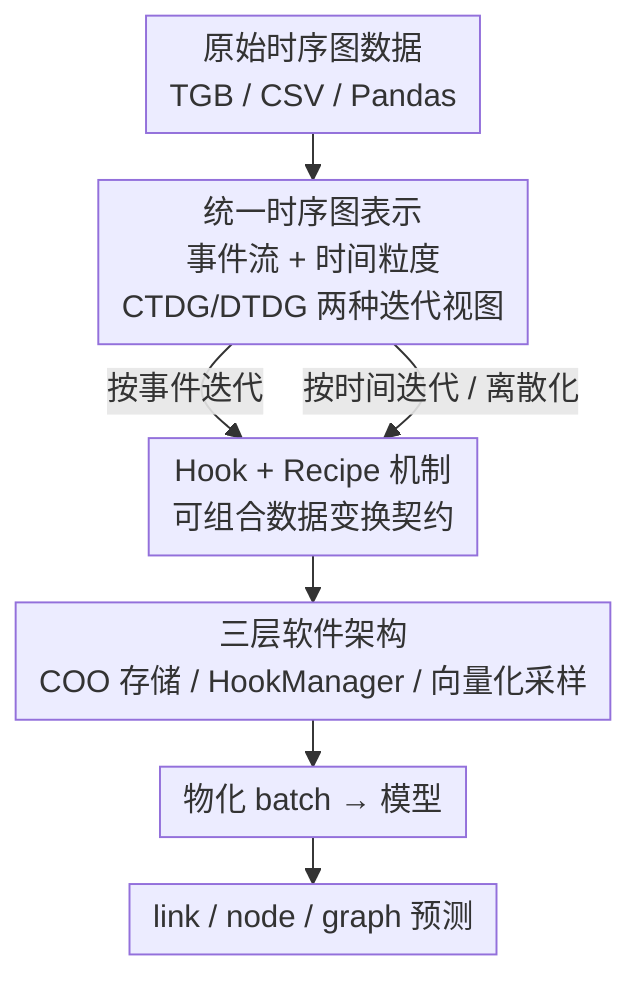

# TGM: A Modular and Efficient Library for Machine Learning on Temporal Graphs

**会议**: ICLR 2026  
**OpenReview**: [https://openreview.net/forum?id=kFgsebdKje](https://openreview.net/forum?id=kFgsebdKje)  
**代码**: https://github.com/tgm-team/tgm  
**领域**: 图机器学习 / 时序图 / 研究框架  
**关键词**: 时序图学习、CTDG、DTDG、Hook 机制、图离散化

## 一句话总结
TGM 是首个把连续时间动态图（CTDG）和离散时间动态图（DTDG）统一在同一套数据抽象下的时序图学习研究框架，用「事件流 + 时间粒度迭代」统一两种范式、用可组合的 Hook 机制标准化数据变换，端到端训练比常用库 DyGLib 平均快 7.8×、图离散化平均快 175×。

## 研究背景与动机
**领域现状**：静态图机器学习已经有 PyG、DGL 这样成熟的基础设施，研究者可以专注于设计模型而不用重复造轮子。但时序图（Temporal Graph，随时间演化的网络，如交易网络、社交网络、通信网络）这一快速发展的方向，却缺少与之对等的库——而时序图学习恰恰需要把"时间"当成一等公民来处理。

**现有痛点**：现有时序图库（DyGLib、TGL、DistTGL、TGLite、PyG Temporal 等）普遍"专而窄"：大多只实现单一算法家族（比如只支持基于消息传递的连续时间模型），无法支持新兴的 Transformer 类时序图模型；几乎都不提供时间粒度转换（time conversion）操作，而这对分析时序图的时间分辨率至关重要；同时普遍缺乏可复现研究所需的工程能力——profiling 工具、单元测试、模块化抽象。

**核心矛盾**：时序图领域不像 NLP 有 Transformer 这样的"标准架构"收口，存在一条根本性的范式割裂——**CTDG（连续时间）把图看成带时间戳的事件流，DTDG（离散时间）把图看成一系列静态快照序列，二者需要完全不同的数据管线**。这导致两条研究路线无法直接比较、思想无法互相迁移，连"时序邻居采样""负边构造"这类核心操作各库实现都不一致，公平 benchmark 和快速原型都很困难。

**本文目标**：造一个模块化、高效、面向研究的时序图学习库，要同时支持 CTDG 和 DTDG、原生支持时间粒度转换、覆盖 link / node / graph 三个层级的任务。

**切入角度**：作者的关键观察是——CTDG 和 DTDG 其实不是两种不同的数据类型，而是**对同一份底层事件流的两种不同迭代方式**。只要把时序图统一表示成"时间有序的事件序列"，再用"时间粒度"这一抽象去区分"按事件迭代"还是"按时间迭代"，两种范式就能被装进同一个框架。

**核心 idea**：用「事件流 + 时间粒度迭代视图」统一 CTDG/DTDG，用「Hook + Recipe」的可组合契约把所有时序图数据变换标准化，再用三层软件架构 + 全向量化实现把效率拉满。

## 方法详解

### 整体框架
TGM 不是一个模型，而是一套时序图学习的研究框架，核心是用一套统一抽象同时承载连续时间和离散时间两条范式。它把整个时序图工作流拆成三层：**数据层**用不可变的、按时间排序的 COO 存储原始事件，并通过轻量级"图视图"切片出时序子图、做向量化离散化；**执行层**由一个 HookManager 把用户注册的 Hook（或预置 Recipe）在数据加载时透明地施加到每个 batch 上，负责时序邻居采样、负边生成、设备搬运等变换；**ML 层**把变换后的 batch 在设备上物化（materialize）成张量，喂给模型做 link / node / graph 级别预测。

贯穿三层的关键是「时序图表示」：时序图被统一定义成时间有序的事件序列（含边事件和节点事件），CTDG 与 DTDG 只是两种迭代方式——按固定事件数迭代就是 CTDG，按固定时间粒度迭代就是 DTDG，二者之间靠"离散化"算子互转。下图给出从原始数据到三层处理再到预测输出的整体流向，三个贡献节点分别对应下面的三个关键设计。

### 关键设计

**1. 统一时序图表示：把 CTDG 和 DTDG 当作同一事件流的两种迭代视图**

这一点直接瓦解了"连续时间 vs 离散时间需要两套数据管线"的核心矛盾。TGM 把时序图定义为时间有序的事件序列 $G=\{e_0,\dots,e_T\}$，每个事件要么是**边事件** $(t,s,d,x_{edge})$（节点 $s,d$ 在 $t$ 时刻的一次交互，带边特征），要么是**节点事件** $(t,s,x_{node})$（节点 $s$ 在 $t$ 时刻到达新特征）——节点事件是 TGM 的一个"首创"，天然刻画社交媒体发帖等节点级活动。关键在于：每个时序图都有一个原生时间粒度 $\tau$（仍能区分所有事件时间戳的最粗时间单位），CTDG/DTDG 不是数据类型而是迭代方式——**CTDG 用事件序粒度 $\tau_{event}$，每个 batch 含固定数量的事件**（与真实时间无关）；**DTDG 用一个比原生粒度更粗的 $\hat\tau$ 迭代，每个 batch 对应一个等长时间区间 $G|_{[t_i,t_{i+1}]}$，$|t_{i+1}-t_i|=\hat\tau$**，也就是一个快照。两者之间靠离散化算子衔接：

$$\psi_r:(G,\tau)\mapsto(\hat G,\hat\tau)$$

它把事件按 $\hat\tau$ 划进等价类、对每个类施加一个归约算子 $r$（例如合并区间内的重复边），得到每类一个代表事件的粗粒度图 $\hat G$。正因为有了这个统一表示，TGM 才能让 DTDG 模型（GCN、GCLSTM 等）直接跑在原本是 CTDG 的任务上，也才能把"快照粒度"当成一个可调超参来研究。

**2. Hook 与 Recipe：用 require/produce 契约把数据变换标准化并自动编排**

时序图工作流里"邻居采样、负边构造、设备搬运、评测"这些操作在各库实现混乱、互不复用，这正是公平 benchmark 难做的原因之一。TGM 把每个数据变换抽象成一个 **Hook** $\phi_{R,P}$，它声明一个契约：需要输入 batch 上具备属性集合 $R$，产出新属性集合 $P$，作用是把物化 batch 的属性从 $A$ 扩成 $A\cup P$（如"采样 Hook"要求 $\{negatives\}$、产出 $\{neighbors\}$）。多个 Hook 组成一个 **Recipe**，它们之间的依赖由属性供需关系诱导出一个有向图：

$$\phi_i\to\phi_j\iff P_i\cap R_j\neq\varnothing$$

只要这个依赖图无环、且每个 Hook 的需求都被前序满足（$\forall j,\ R_j\subset\bigcup_{i<j}P_i$），它就是一个合法 Recipe，可以通过拓扑排序得到唯一执行顺序。这样一来，复杂工作流（如 TGAT link prediction、密度态 DOS 分析）就能用极少的样板代码声明式地拼出来，Hook 之间还能跨任务复用。TGM 预置了 TGB link prediction 等常用 Recipe，帮新手避开"在不同 split 间错误共享状态"这类坑。

**3. 三层软件架构 + 全向量化实现：把统一抽象落成既可扩展又高效的系统**

前两个设计是概念层，这一层是把它们变成跑得快的代码。数据层用**不可变、按时间排序的 COO 存储**加缓存索引，从而能对时间戳做二分查找——这对"取最近邻居"至关重要；其上是轻量、并发安全的**图视图**，每个视图只记录时间边界并用时间粒度抽象编码读访问，使得 CTDG 风格和 DTDG 风格的加载都能在零拷贝下完成。执行层的 **HookManager** 负责管理共享状态、解析 Hook 依赖、在数据加载时透明执行：Hook 按时间顺序处理 batch 以保持时序性，而同一 batch 内的事件级操作（邻居采样、设备搬运、负边生成）则**并行执行**，这是效率的主要来源之一。ML 层把 batch 在设备上物化成张量，并把可学习组件（memory、attention、link decoder）与图管理解耦，方便研究者快速原型新模型。效率的另一关键是**全向量化的 recency 采样器**——用 PyTorch 原生的环形缓冲区实现，访问对缓存友好；评测时 TGM 每个 batch 只采样一次（batch 级去重），而 DyGLib 对每个预测都重复采样，这让 TGM 在 TGN/tgbl-wiki 上最高比 DyGLib 快达 246×。

## 实验关键数据

### 主实验
效率是核心卖点。在 link property prediction 上，TGM 始终位列最快的前两名，全面超过 DyGLib 和 TGL，仅略逊于高度专用的 TGLite（每 epoch 训练秒数，越低越好）：

| 模型 / tgbl-wiki | TGM | DyGLib | TGLite | TGL |
|------|------|--------|--------|-----|
| TGAT | 6.97 | 41.24 | **4.85** | 10.00 |
| TGN | 10.59 | 63.37 | **6.80** | 23.32 |
| DyGFormer | **17.00** | 75.10 | ✕ | ✕ |
| TPNet | 12.28 | ✕ | ✕ | ✕ |
| GCN（DTDG） | 2.50 | ✕ | ✕ | ✕ |

TGM 在 DyGFormer 上对 DyGLib 取得 4.4× 加速，且唯一支持 DTDG 模型（GCN/GCLSTM）和 SOTA 的 TPNet。node property prediction 上对 DyGLib 最高 10× 加速（TGN/tgbn-trade）。

图离散化更夸张（离散到小时级快照的延迟，秒，越低越好）：

| 数据集 | UTG | TGM | 加速 |
|--------|-----|-----|------|
| tgbl-wiki | 1.94 | 0.04 | 49.6× |
| tgbl-subreddit | 8.83 | 0.21 | 41.6× |
| tgbl-lastfm | 19.94 | 0.05 | **433×** |

### 消融 / 分析实验
TGM 的统一框架解锁了过去难以研究的问题。快照时间粒度对 DTDG 模型的链接预测影响巨大（MRR，越高越好）：

| 时间粒度 / tgbl-wiki | GCN | T-GCN | GCLSTM |
|------|------|-------|--------|
| Hourly | 0.510 | 0.509 | **0.395** |
| Daily | **0.702** | **0.540** | 0.372 |
| Weekly | 0.393 | 0.330 | 0.323 |

正确性测试（tgbl-wiki link prediction / tgbn-trade node prediction）显示 TGM 复现的所有模型都落在 TGB 报告的预期区间内，且揭示出互补现象：**CTDG 模型（TPNet/DyGFormer）在 link prediction 上更强，DTDG 模型（GCLSTM/GCN）在 node prediction 上更强**。

### 关键发现
- **离散化的 433× 加速来自全向量化**：把 UTG 中 cache-unfriendly 的 Python 字典换成 PyTorch 原生向量化实现，这是工程而非算法的胜利。
- **粒度即超参**：GCN 在 tgbl-wiki 上从 weekly 换到 daily 快照，MRR 提升 30%；TGM 让换粒度只需改一行代码，因此首次能把"快照分辨率"当成可系统研究的超参。
- **batch 配置是被忽视的超参**：CTDG 模型（TGAT）的验证 batch size 与时间单位会显著影响报告的 MRR——更大 batch、更粗时间单位会让性能明显退化，提示过往评测设置可能不公平。

## 亮点与洞察
- 最"啊哈"的一点：CTDG 与 DTDG 长期被当成两种数据类型，TGM 指出它们只是**对同一事件流的两种迭代视图**，一句话级别的抽象重构就抹平了整个领域的范式割裂——这是典型的"换个表示，问题消失"。
- Hook 的 require/produce 契约 + 拓扑排序自动编排，本质是把数据管线写成了**带类型签名的可组合函数**，依赖正确性由框架保证，这套思路可以迁移到任何"多步数据变换 + 易错状态管理"的 ML pipeline。
- 把"时间粒度"和"batch 配置"从隐藏的实现细节提升为可调超参，直接催生了三个新研究问题（图属性预测、粒度敏感性、batch 敏感性），说明好的基础设施本身就能解锁新研究。

## 局限与展望
- 作者承认未做超参搜索，正确性测试用的是固定超参，因此跨库的绝对性能数字不宜过度解读；表中跨模型/跨任务的快慢比较也受架构差异影响，不能简单横比。
- 效率优势部分依赖数据存放于 CPU host memory、按需搬到 GPU 的设定；论文也提到 batch size 显著影响模型表现（附录讨论），说明"公平比较"本身仍是开放问题。
- 作为研究导向库，TGM 强调灵活与可复现，但大规模分布式 / 多 GPU 训练（TGL、DistTGL 的强项）不是其重点，超大图场景的扩展性有待验证。

## 相关工作与启发
- **vs DyGLib**：DyGLib 是当前最流行的 CTDG 研究库，但缺乏模块化、对 DTDG 支持弱、评测时对每个预测重复采样邻居；TGM 用统一表示 + batch 级去重 + 向量化采样，端到端平均快 7.8×，并同时覆盖 CTDG/DTDG。
- **vs TGLite**：TGLite 是为连续时间消息传递模型高度系统优化的库，在 TGAT/TGN 上比 TGM 略快，但只支持单一算法家族；TGM 用略微的速度让步换来了对 Transformer 类、DTDG 类、TPNet 等的广覆盖。
- **vs UTG**：UTG 首次概念性地演示了用图离散化比较 CTDG/DTDG，但实现慢、数据集少、不为复用设计；TGM 把离散化做成全向量化操作（最高 433× 加速），并把这套统一思路落成了健壮可复用的框架。

## 评分
- 新颖性: ⭐⭐⭐⭐⭐ 首个统一 CTDG/DTDG 的时序图库，事件流 + 迭代视图的抽象重构是真正的概念创新。
- 实验充分度: ⭐⭐⭐⭐ 效率、正确性、扩展性三类实验都覆盖，跨库/跨任务多数据集，但绝对性能受固定超参限制。
- 写作质量: ⭐⭐⭐⭐⭐ 动机—抽象—系统—实验逻辑清晰，定义形式化到位。
- 价值: ⭐⭐⭐⭐⭐ 作为基础设施降低了整个时序图研究的门槛，并解锁了若干新研究问题。

<!-- RELATED:START -->

## 相关论文

- [\[ICLR 2026\] Efficient Learning on Large Graphs using a Densifying Regularity Lemma](efficient_learning_on_large_graphs_using_a_densifying_regularity_lemma.md)
- [\[ICLR 2026\] Relatron: Automating Relational Machine Learning over Relational Databases](relatron_automating_relational_machine_learning_over_relational_databases.md)
- [\[ICLR 2026\] Revisiting Node Affinity Prediction in Temporal Graphs](revisting_node_affinity_prediction_in_temporal_graphs.md)
- [\[ICLR 2026\] Inductive Reasoning for Temporal Knowledge Graphs with Emerging Entities](inductive_reasoning_for_temporal_knowledge_graphs_with_emerging_entities.md)
- [\[ICLR 2026\] Towards Quantifying Long-Range Interactions in Graph Machine Learning: A Large Graph Dataset and a Measurement](towards_quantifying_long-range_interactions_in_graph_machine_learning_a_large_gr.md)

<!-- RELATED:END -->
