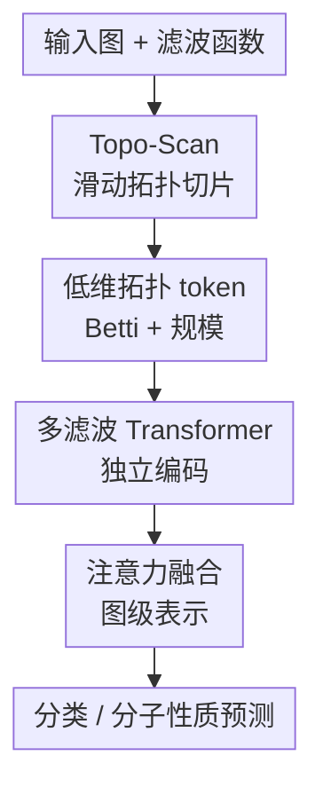

# TopoFormer: Topology Meets Attention for Graph Learning

**会议**: ICLR2026  
**OpenReview**: [https://openreview.net/forum?id=xanpQt9YZh](https://openreview.net/forum?id=xanpQt9YZh)  
**代码**: https://github.com/joshem163/TOPOFORMER  
**领域**: 图学习 / 拓扑图表示学习  
**关键词**: 图学习, 拓扑数据分析, Topo-Scan, Transformer, 分子性质预测

## 一句话总结
TopoFormer 把图按节点或边滤波函数切成一串局部拓扑切片，用每个切片的 Betti 数和规模统计组成短 token 序列，再交给 Transformer 学图级表示，在图分类和分子性质预测上以较低计算成本达到接近或超过强基线的效果。

## 研究背景与动机
**领域现状**：图学习里最常见的路线仍然是 GNN 或 graph Transformer：先在节点层做消息传递、注意力或结构位置编码，再通过 pooling 得到图级表示。另一条路线来自拓扑数据分析，尤其是 Persistent Homology（PH），它用滤波过程跟踪连通分支、环等拓扑结构如何随尺度变化出现和消失，天然适合描述图的多尺度结构。

**现有痛点**：PH 对图很有吸引力，但标准流程并不轻：需要构造滤波、计算 persistence diagram，再把 diagram 向量化成 persistence image、landscape 或 Betti curve 等特征。这里有两个问题。第一，persistence diagram 的全局约化计算开销大，尤其在 clique complex 较稠密时会被高阶单纯形拖慢。第二，diagram 向量化本身是一个额外设计选择，不同向量化方式会显著影响下游效果，模型并不能直接利用滤波过程里的“顺序结构”。

**核心矛盾**：图上的常规 sublevel filtration 还容易“早饱和”。如果高值或关键节点很早进入子图，后续阈值下大部分结构已经被纳入，晚出现的局部环、局部连通变化反而被淹没。也就是说，PH 想捕捉多尺度结构，但标准累积式滤波会把图越滚越大，导致后段 token 信息变少；Transformer 擅长处理序列，但 PH 输出又常被压成无序的全局向量。

**本文目标**：作者希望保留拓扑结构的稳定性和多尺度归纳偏置，同时绕开完整 persistence diagram 的昂贵计算与手工向量化，把图直接变成短的、顺序明确的、attention-friendly 的拓扑 token 序列。

**切入角度**：TopoFormer 的观察是，图本身已经有边关系和 clique complex 结构，不一定非要用严格嵌套的 PH 过程才能提取有用拓扑信号。与其让阈值从小到大累积整张图，不如用滑动窗口在滤波轴上切片，每个切片只看一段局部范围内诱导出来的子图结构。

**核心 idea**：用 Topo-Scan 将图沿滤波函数切成有序拓扑切片，把每个切片的 $\beta_0$、$\beta_1$、节点数和边数作为 token，再用 Transformer 对这串拓扑 token 做图级建模。

## 方法详解

### 整体框架
TopoFormer 的输入是一张图 $G=(V,E)$，以及一个或多个节点/边滤波函数，例如 degree centrality、Ollivier-Ricci curvature、Heat Kernel Signature 或分子里的 atomic weight。Topo-Scan 先在滤波值轴上放置一组窗口，每个窗口诱导出一个局部子图，再把子图提升为 clique complex 并计算简单拓扑不变量；这些切片按窗口顺序排列成拓扑序列，最后由 Transformer 编码、融合并输出图分类或分子性质预测。

单个滤波函数会产生一条长度约为窗口数的序列。论文实验中常用 20 个阈值、窗口宽度 $m=2$，因此每个滤波得到 19 个切片；每个切片 token 是四维 $(\beta_0, \beta_1, |V_i|, |E_i|)$，拼起来就是一条轻量拓扑序列。多个滤波函数对应多条序列，分别进独立 Transformer，再用可学习融合权重或注意力融合为最终图表示。

### 关键设计
**1. Topo-Scan：用滑动切片替代累积式 PH，避免拓扑信号早饱和**

标准 PH sublevel filtration 对阈值 $\alpha_i$ 通常取 $\{v\mid f(v)\le \alpha_i\}$，所以子图是一路累积的。Topo-Scan 改成看区间窗口：给定阈值 $\alpha_0<\alpha_1<\cdots<\alpha_N$ 和窗口厚度 $m$，第 $i$ 个窗口选取 $V_i=\{v_r\in V\mid \alpha_i\le f(v_r)\le \alpha_{i+m}\}$，再取诱导边 $E_i=\{e_{rs}\in E\mid v_r,v_s\in V_i\}$，得到切片图 $G_i=(V_i,E_i)$ 及其 clique complex $\widehat{G_i}$。

这个变化看似很小，实际是在改变信息流。PH 的窗口左端固定在最小阈值，越往后越像“把整张图吞进去”；Topo-Scan 的窗口左右端一起移动，每一步都只观察某个滤波值段内的局部结构，因此晚出现的节点群、局部环和连接模式不会被早期结构淹没。论文的 toy example 显示，普通 PH 在示例图上得到的 $\beta_1$ 序列几乎全为 0，而 Topo-Scan 能在中间切片里看到环结构，说明它不是在复刻 PH，而是在用 interlevel 视角重新组织图拓扑。

**2. 低维拓扑 token：保留顺序结构，而不是把 diagram 压成全局向量**

每个 Topo-Scan 切片只输出四个量：$\beta_0(\widehat{G_i})$ 表示连通分支数量，$\beta_1(\widehat{G_i})$ 表示环或洞的数量，$|V_i|$ 与 $|E_i|$ 用作规模和归一化信号。于是一个滤波函数生成的序列可以写成 $\Gamma(G)=\{(\beta_0^i,\beta_1^i,|V_i|,|E_i|)\}_{i=1}^{T}$。

作者刻意没有用更复杂的 persistence image 或 landscape。原因是 Topo-Scan 的价值正来自“拓扑如何沿滤波轴变化”的顺序结构；如果把所有切片聚合成一个全局向量，Transformer 就无法区分早期、中期、晚期结构的上下文。四维 token 虽然朴素，但把连通性、环结构和切片规模放在同一时间轴上，恰好对应 attention 擅长处理的有序 token 接口。

**3. 多滤波 Transformer：让不同结构排序给出互补视角**

同一张图用不同滤波函数切，会看到不同的拓扑层次。degree centrality 更偏向局部连接强弱，Ollivier-Ricci curvature 更强调边或局部几何，HKS 带有谱/扩散视角；分子任务中 atomic weight 又提供化学属性排序。TopoFormer 不把这些滤波简单拼成一个大特征，而是让每个滤波序列先经过独立 Transformer 编码。

具体地，输入序列 $x\in\mathbb{R}^{B\times T\times D}$ 先经 embedding 层映射到 hidden dimension，并加入位置编码 $P$，再通过多层 Transformer encoder 得到表示 $z$。当有两条拓扑序列 $X_1,X_2$ 和一条额外特征 $X_3$（如分子指纹）时，模型使用两个 Transformer $T_1,T_2$ 和一个 MLP $M$ 分别得到 $z_1,z_2,z_3$，再通过可学习权重融合：$z_{combined}=\alpha z_1+\beta z_2+(1-\alpha-\beta)z_3$。这样模型可以根据任务自动调节“拓扑滤波”和“领域特征”各自的贡献。

**4. 稳定且可并行的计算：把全局 persistence 约化换成独立切片 Betti 计算**

Topo-Scan 的切片之间相互独立，所以可以并行计算。每个切片上，$\beta_0$ 可用 1-skeleton 上的 union-find 得到，$\beta_1$ 由稀疏边-三角形算子和三角形枚举得到，不需要完整 persistence diagram 的边界矩阵全局约化。论文给出的复杂度是对 $L$ 个滤波、$k$ 个切片累计 $O(L\sum_t(|V_t|+|E_t|+T_t))$，其中 $T_t$ 是第 $t$ 个切片的三角形数。

理论上，作者把切片 token 解释为 upper-star filtration 的 interlevel Betti number。若两个节点函数 $f,g$ 在同一 clique complex 上只发生小扰动，则对应 Topo-Scan 序列满足离散 $\ell_1$ 稳定性：$\|\widehat{\beta}_k(G,f)-\widehat{\beta}_k(G,g)\|_1\le C d_B(M_k^f,M_k^g)\le C\|f-g\|_\infty$。这说明滤波信号的小变化不会让整串拓扑 token 剧烈跳变，给模型的输入表示提供了类似 PH 稳定性的保障。

### 一个完整示例
假设一张社交图里每个节点都有 degree centrality，Topo-Scan 先把 degree 取值范围切成 20 个阈值，并用 $m=2$ 的窗口生成 19 个区间。第一个窗口可能只包含低度节点之间的局部连接，模型看到的是较多零散分量，即 $\beta_0$ 较高、$\beta_1$ 较低；中间窗口开始纳入中等连接度的节点群，若这些节点之间形成闭环或社区边界，$\beta_1$ 会升高；后面窗口只关注高度节点附近的核心结构，而不是把低度节点也继续累积进来。

最终 Transformer 读到的不是“第 17 个节点连向谁”，而是“沿 degree 层级移动时，连通分支和环结构如何变化”。如果同一张图再用 HKS 过滤，另一条序列会从谱扩散角度给出结构层次。两个序列被独立编码后融合，分类头据此判断图属于哪一类社交网络或分子性质标签。

### 损失函数 / 训练策略
图分类任务使用 Topo-Scan 生成拓扑签名序列后训练 Transformer 分类器，采用 10-fold cross validation。主要设置包括 Adam 优化器、学习率 0.001、dropout 0.5、weight decay $10^{-4}$、batch normalization，Transformer hidden dimension 为 32。实验中图分类使用 Ollivier-Ricci curvature 与 HKS 两类滤波；分子性质预测和 OGBG-MOLHIV 使用 atomic weight 与 Ollivier-Ricci curvature。

分子性质预测版本记为 TOPOFORMER*，在拓扑分支之外加入 Extended-Connectivity Fingerprints（ECFP）分支。ECFP 通过两层 MLP 编码，输出维度与 TopoFormer 分支对齐，再与拓扑表示进行 attention 或可学习加权融合。分子任务采用 scaffold split AUC，并在多个 MoleculeNet 数据集上报告三次运行结果。

## 实验关键数据

### 主实验
图分类主表覆盖 8 个常用 benchmark，TopoFormer 的平均偏离最优值 AvD 为 0.5，平均排名 AvR 为 1.5。它在 BZR、MUTAG、PROTEINS、IMDB-M、REDDIT-B、REDDIT-5K 上取得表中最优或接近最优，并整体超过多种 GNN、拓扑方法和图核方法。

| 数据集 | 指标 | TopoFormer | 强基线 / 之前SOTA | 提升或差距 |
|--------|------|------------|-------------------|------------|
| BZR | Accuracy | 92.36±4.11 | DASP 89.40±3.10 | +2.96 |
| MUTAG | Accuracy | 94.68±4.30 | PGOT 92.63±2.58 | +2.05 |
| PROTEINS | Accuracy | 77.64±3.64 | TopoGCL 77.30±0.89 | +0.34 |
| IMDB-M | Accuracy | 55.40±4.78 | TopoGCL 52.81±0.31 | +2.59 |
| REDDIT-B | Accuracy | 91.50±1.89 | EMP 91.03±0.22 | +0.47 |
| REDDIT-5K | Accuracy | 57.99±1.94 | DASP 57.60±1.60 | +0.39 |
| 平均 | AvD / AvR | 0.5 / 1.5 | DASP 1.6 / 2.8 | 排名更稳 |

分子性质预测中，TopoFormer* 与 ECFP 结合后在 ToxCast、ClinTox、BACE 上取得表中最佳 ROC AUC，在 Tox21 上为第二梯队，整体 AvD=2.5、AvR=2.8。它不是在所有分子数据集上都赢，例如 BBBP 上 KANO 更高，但拓扑分支和分子指纹的互补性很明显。

| 数据集 | 指标 | TopoFormer* | 表中最佳或强基线 | 结论 |
|--------|------|-------------|------------------|------|
| ToxCast | ROC AUC | 75.3±0.5 | KANO 73.2±1.6 | 最优 |
| ClinTox | ROC AUC | 96.5±0.6 | MV-Mol 95.6±1.6 | 最优 |
| BACE | ROC AUC | 95.9±0.3 | KANO 93.1±2.1 | 最优 |
| Tox21 | ROC AUC | 82.7±0.5 | KANO 83.7±1.3 | 接近最优 |
| HIV | ROC AUC | 81.2±0.8 | KANO 85.1±2.2 | 有差距但竞争力尚可 |
| OGBG-MOLHIV | ROC AUC | 78.19±0.19 | Graphormer 80.51±0.53 | 低约 2.3 点 |

### 消融实验
论文的消融主要回答三个问题：Topo-Scan 是否比标准 PH token 更有用，窗口宽度是否敏感，以及多滤波是否优于单滤波。结果整体支持作者的设计，但也显示多滤波增益不是每个数据集都很大。

| 配置 | 代表结果 | 说明 |
|------|----------|------|
| PH-MLP + degree | MUTAG 84.06±4.65, IMDB-B 65.70±4.03 | 普通 PH Betti 向量 + MLP，顺序信息利用不足 |
| PH-TR + degree | MUTAG 86.11±5.23, IMDB-B 75.00±2.11 | Transformer 用上序列后明显强于 MLP |
| TopoFormer + degree | MUTAG 92.54±5.12, BZR 91.10±5.14 | 同滤波下 Topo-Scan 通常进一步提升 |
| width $m=2$ | O.Ricci 下 IMDB-B 79.10±3.78, REDDIT-B 91.40±1.24 | 多数设置里 $m=2$ 是稳妥选择 |
| HKS only | MUTAG 95.32±5.58, COX2 83.95±2.99 | 单滤波已经很强 |
| HKS + O.Ricci | BZR 92.36±4.11, IMDB-M 55.40±4.78 | 多滤波带来互补增益，并形成最终主模型 |

### 关键发现
- Topo-Scan 的收益并不只是“用了 Transformer”。PH-TR 已经比 PH-MLP 强，但在相同 degree / O.Ricci / HKS 滤波下，TopoFormer 多数数据集继续提升，说明滑动 interlevel 切片比累积 sublevel 序列更能保留有用结构。
- 分子任务里 TOPOFORMER* 的提升来自拓扑和化学指纹互补。单独 TopoFormer 或单独 FP-MLP 都不是最强，二者融合后在随机 split 表中多个数据集优于 PH+ECFP+TR。
- 运行时优势在稠密图上尤其明显。IMDB-B 上 Topo-Scan 用 9.67 秒，而标准 PH 用 135.48 秒；IMDB-M 上 Topo-Scan 17.81 秒，PH 234.30 秒，约为 13-14 倍差距。REDDIT 图更稀疏，差距缩小但仍稳定存在。
- 宽度参数不是越大越好。$m=2$ 多数情况下表现最好或接近最好，说明较薄切片能更好保留局部拓扑变化；过厚窗口会重新走向“过度聚合”。

## 亮点与洞察
- 这篇论文最巧的地方是没有把拓扑方法继续卷向更复杂的 diagram/vectorization，而是把 PH 中“随尺度变化的结构”重新整理成 Transformer 能直接吃的 token 序列。它抓住了拓扑和注意力之间的接口问题。
- Topo-Scan 对图任务很自然：图不像点云那样必须通过距离膨胀来生成复杂，节点/边本身就有可排序的属性。用窗口切片把“某一层级的诱导子图”拿出来，比无限追求完整 persistence diagram 更贴近可学习表示。
- 低维 token 是一个克制但有效的选择。$\beta_0$、$\beta_1$、节点数、边数不是很花哨，却能把连接、环和切片规模同时交给模型；对很多 graph-level 任务，这类粗粒度结构可能比高成本的精细 barcode 更稳。
- 该思路可以迁移到动态图、异质图和知识图谱。关键不是固定用 degree 或 HKS，而是为具体领域定义有意义的滤波函数，例如时间戳、关系置信度、节点活跃度或药物结构中的原子属性，再用 Topo-Scan 生成任务相关的拓扑序列。
- 它也给 graph foundation model 一个比较现实的方向：与其直接把超大图节点全部 token 化，不如先构造稳定的图级拓扑 token，作为可迁移的结构摘要和其他 node/edge token 表示互补。

## 局限与展望
- 表达能力仍然受限于低维 Betti token。$\beta_0$ 和 $\beta_1$ 能描述连通分支与环，但会丢掉很多细粒度属性，例如具体节点标签、边类型、环的语义位置和高阶局部 motif。
- 滤波函数目前主要是固定手工选择，如 degree、Ollivier-Ricci、HKS、atomic weight。若滤波函数与任务不匹配，Topo-Scan 看到的层级顺序也会偏；论文虽然展示多滤波能缓解，但还没有系统学习滤波函数。
- 方法主要面向图级任务。对节点分类、边预测、动态图预测等需要局部输出的问题，如何把切片级拓扑 token 回连到节点或边仍不清楚。
- 分子任务的强结果依赖 ECFP 融合，说明纯拓扑序列还不能完全替代成熟化学描述符。后续可以研究哪些分子性质更依赖拓扑环/连通结构，哪些更依赖化学官能团。
- 理论稳定性建立在固定 clique complex、共享阈值网格等条件上。真实训练中若按数据集分位数选阈值，或在大图上近似计算曲率和三角形，稳定性与误差传播仍需要更细的分析。

## 相关工作与启发
- **vs Persistent Homology pipeline**: 传统 PH 计算 persistence diagram 后再向量化，理论优雅但计算和向量化选择都重。TopoFormer 保留拓扑稳定性和多尺度视角，却改用 interlevel 切片序列，牺牲完整 barcode 信息来换取可并行、可 attention 化的表示。
- **vs PersLay / DMP / EMP / MP-HSM 等拓扑图方法**: 这些方法通常围绕 persistence diagram、mapper 或多参数 persistence 设计拓扑特征。TopoFormer 的差异在于它不把拓扑作为静态外部特征，而是把拓扑演化过程本身变成序列输入。
- **vs Graphormer / GPS 等 graph Transformer**: Graphormer 直接在节点 token 上注入最短路、中心性或结构 bias；TopoFormer 先把整张图压缩成拓扑 token，再做图级 attention。前者更细粒度，后者更轻量、更偏全局结构摘要。
- **vs GNN + pooling**: 传统 GNN 先学习节点嵌入，再用 DiffPool、SAGPool、Top-K 等 pooling 汇总。TopoFormer 绕开节点嵌入更新，直接从图整体的拓扑切片构造表示，对图级分类更简洁，但也因此较难处理需要节点级解释的任务。
- **vs 分子指纹模型**: ECFP 等指纹编码化学局部子结构，Topo-Scan 编码图拓扑层级。TOPOFORMER* 的实验说明二者不是替代关系，而是互补关系：指纹提供化学语义，拓扑序列提供结构组织方式。

## 评分
- 新颖性: ⭐⭐⭐⭐☆ 把 interlevel 拓扑切片组织成 Transformer token 的思路清晰且有辨识度，但核心 token 本身比较基础。
- 实验充分度: ⭐⭐⭐⭐☆ 覆盖图分类、MPP、OGBG-MOLHIV、PH 对比、宽度和滤波消融，比较扎实；但节点/边级任务和更大规模预训练还没验证。
- 写作质量: ⭐⭐⭐⭐☆ 动机、方法和复杂度解释较完整，附录补了稳定性证明；部分表格很多，读者需要自己筛重点。
- 价值: ⭐⭐⭐⭐☆ 对想把 TDA 信号接入深度图学习的人很有启发，尤其是“拓扑序列化”这个接口设计，后续可扩展空间大。

<!-- RELATED:START -->

## 相关论文

- [\[ICLR 2026\] Topology Matters in RTL Circuit Representation Learning](topology_matters_in_rtl_circuit_representation_learning.md)
- [\[ICLR 2026\] Global and Local Topology-Aware Graph Generation via Dual Conditioning Diffusion](global_and_local_topology-aware_graph_generation_via_dual_conditioning_diffusion.md)
- [\[AAAI 2026\] Kernelized Edge Attention: Addressing Semantic Attention Blurring in Temporal Graph Neural Networks](../../AAAI2026/graph_learning/kernelized_edge_attention_addressing_semantic_attention_blurring_in_temporal_gra.md)
- [\[ICLR 2026\] Graph Signal Processing Meets Mamba2: Adaptive Filter Bank via Delta Modulation](graph_signal_processing_meets_mamba2_adaptive_filter_bank_via_delta_modulation.md)
- [\[AAAI 2026\] Spiking Heterogeneous Graph Attention Networks](../../AAAI2026/graph_learning/spiking_heterogeneous_graph_attention_networks.md)

<!-- RELATED:END -->
