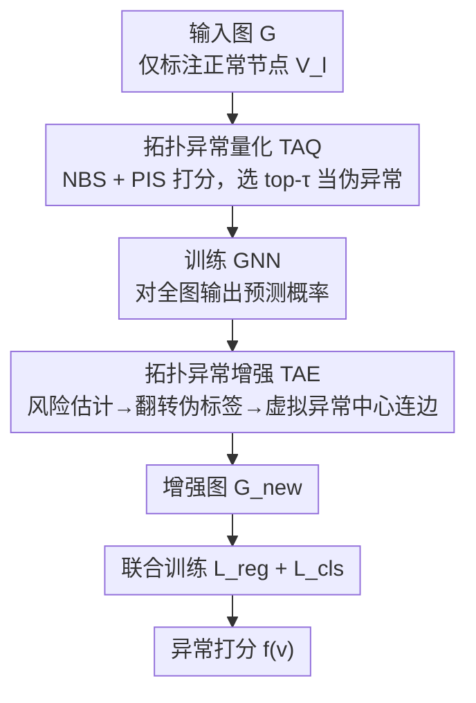

# Topological Anomaly Quantification for Semi-Supervised Graph Anomaly Detection

**会议**: ICLR 2026  
**OpenReview**: [https://openreview.net/forum?id=ZURYrJgigi](https://openreview.net/forum?id=ZURYrJgigi)  
**代码**: https://github.com/TingGuo301/TAQ-GAD  
**领域**: 图异常检测 / 半监督学习 / 图神经网络  
**关键词**: 图异常检测, 半监督, 伪异常生成, 拓扑量化, 图增强

## 一句话总结
针对"只有正常节点标签"的半监督图异常检测，TAQ-GAD 用两个纯拓扑指标（边界分 NBS + 隔离分 PIS）量化每个标注正常节点的"异常程度"，从中筛出高质量伪异常节点，再用拓扑增强模块（TAE）生成虚拟异常中心并重连图结构，最终在增强图上联合训练，在 6 个数据集上稳定超过 GGAD 等 SOTA。

## 研究背景与动机

**领域现状**：图异常检测（GAD）要在图里找出偏离正常模式的节点，广泛用于金融欺诈、入侵检测等。无监督方法只能靠图自身结构，难以对齐"语义异常"；带标注的半监督方法更可靠，但同时标注正常+异常节点又不现实——真实异常稀少且标注昂贵。因此"只标注正常节点"的设定最贴近现实：把易得的正常节点当作可靠锚点，把任务从"找全局离群点"转成"找偏离正常画像的节点"。

**现有痛点**：在标签稀缺下，主流是**生成式**方法人工合成伪异常来补充训练负样本，分两类——特征插值（在正常节点特征间线性/非线性插值）和噪声扰动（往正常节点的特征或结构里加随机噪声）。但前者生成的样本过于平滑、抓不住真实异常的边界形态；后者注入的扰动是随机、无引导的，导致伪异常代表性与可靠性都低。

**核心矛盾**：根本问题在于这些方法**缺一个量化机制**来评估"一个节点到底有多异常"。没有量化，就只能靠随机扰动碰运气，合成的伪异常无法模拟真实场景里复杂而有意义的异常模式。

**本文目标**：在只有正常标签的前提下，先给节点的异常程度一个可计算的拓扑度量，据此从标注正常节点里**挑出真正接近异常的那批**当伪异常，再强化它们的拓扑上下文，让模型学到更可分的决策边界。

**切入角度**：作者观察到异常节点有两条稳定的拓扑特征——① 与正常节点的连接密度明显比正常节点之间稀疏（处于"边界"）；② 在同类内部结构上更孤立（"少而散"）。这两点都能纯靠图结构算出来，不需要异常标签。

**核心 idea**：用拓扑量化代替随机扰动来生成伪异常——设计 NBS（边界分）和 NIS/PIS（隔离分）两个指标打分，挑高分节点当伪异常，再用拓扑增强重连图结构。

## 方法详解

### 整体框架
TAQ-GAD 的输入是一张属性图 $G=(V,A,X)$，其中只有一小撮节点 $V_l$ 被标注为正常，其余未标注；输出是一个异常打分函数，使正常节点分数低于异常节点。整条流水线分三步走：先用**拓扑异常量化模块（TAQ）**给每个标注正常节点算一个综合异常分，按比例 $\tau$ 选出最高分的当伪异常节点；接着训练一个 GNN，对全图节点输出预测概率；再用**拓扑异常增强模块（TAE）**根据预测置信度估计节点风险、翻转高风险节点的伪标签、生成虚拟异常中心并和其他节点建拓扑连边，得到增强图 $G_{new}$；最后在增强图上用正则项+分类损失联合训练。

### 关键设计

**1. 拓扑异常量化 TAQ：用两个无需异常标签的拓扑指标筛伪异常**

这一步直接针对"伪异常没有量化、靠随机扰动"的痛点。作者把"一个节点有多异常"拆成两个可计算的拓扑维度。**边界分 NBS** 衡量节点离正常区域边界有多近，用它 $K$-跳邻域里标注正常邻居的占比来反向定义：

$$\mathrm{NBS}(v_i) = 1 - \frac{|N(v_i) \cap V_l|}{|N(v_i)|}$$

NBS 越高说明该节点和标注正常类的连接越少、越可能落在决策边界附近。**隔离分 NIS** 衡量节点在同类内部的结构孤立程度，定义为它到同类邻居的平均最短路径 $\mathrm{NIS}(v_i)=\frac{1}{|N_s(v_i)|}\sum_{v_j\in N_s(v_i)}\mathrm{path}(v_i,v_j)$，值越大越孤立。但 NIS 需要节点类别标签，而本设定下没有异常标签，于是作者用一个纯局部结构的**代理隔离分 PIS** 顶替：

$$\mathrm{PIS}(v_i)=1-\frac{1}{2}\left(\frac{|E(N(v_i))|}{\binom{d_i}{2}+\epsilon}+\frac{\log(d_i+e)}{D+1}\right)$$

其中 $d_i$ 是节点度、$|E(N(v_i))|$ 是其邻居间的边数、$D$ 是全图最大度。第一项刻画局部聚类密度，第二项惩罚高度数节点以突出结构稀疏性；PIS 高就意味着"邻居又少又彼此不相连"，正好对应异常节点"少而散"的结构。最终综合分 $\mathrm{Score}(v_i)=\lambda_1 \mathrm{NBS}(v_i)+\lambda_2 \mathrm{PIS}(v_i)$，对所有标注节点排序后取 top-$\tau$ 比例当伪异常。作者还给了两条定理：同质性+标注偏置下异常节点的 NBS 系统性高于正常节点；PIS 极高时节点为异常的后验概率显著上升——为两个指标提供了理论依据。和旧方法的区别在于：伪异常不再是随机扰动出来的合成点，而是从真实标注正常节点里"挑"出来的、拓扑上最像异常的那批，代表性天然更强。

**2. 拓扑异常增强 TAE：估风险、翻标签、连虚拟异常中心**

光有伪异常还不够，它们在图里的拓扑上下文仍稀薄。TAE 分两阶段强化异常节点的连通性。**第一阶段估风险并修正伪标签**：对节点预测分布 $P_{v_i}=[p^{(0)}_{v_i},p^{(1)}_{v_i}]$ 先算不确定度 $u(v_i)=1-\max_c p^{(c)}_{v_i}$，再相对该类平均不确定度算风险分 $r(v_i)=\max(0, u(v_i)-\bar u_{\hat y_i})\times w_{\hat y_i}$，其中 $w_{\hat y_i}$ 是按类频率倒数算的权重，倾向给少数（异常）类更高重要性——这样能抵消两类不确定度差异带来的选择偏置。对高风险节点（$r(v_i)>0$）施加**标签翻转策略**：算邻域类别后验 $p^{post(c)}_{v_i}=\frac{|\{v_j\in N(v_i):\hat y_j=c\}|}{|N(v_i)|}$，若邻居强烈支持相反类（$p^{post(1-\hat y_i)}_{v_i}>p^{post(\hat y_i)}_{v_i}$）就把该节点伪标签翻成相反类，依据是拓扑一致性原则——邻居共识和当前预测冲突时，原预测很可能错。**第二阶段建虚拟异常中心**：对每类算质心，节点 $v_i$ 与质心的连接概率为 $P(v_i,v^{virtual}_c)=r(v_i)\cdot p^{post(c)}_{v_i}\cdot(1-\mathbb{I}[\hat y_i=c])$，通过概率采样生成虚拟边，构造增强图 $G_{new}$。这一步让异常节点和异常中心的连通性被加强，信息上下文更丰富、更可分。

**3. 正则化+分类的联合训练目标**

最终在增强图上联合优化 $L_{total}=\alpha\cdot L_{reg}+\beta\cdot L_{cls}$。分类损失 $L_{cls}=\mathrm{BCE}(f(X_{new}),Y_{new})$ 是主目标，标签 $Y_{new}$ 同时用到真实正常标签和 TAE 修正后的伪标签；正则项 $L_{reg}=\|Z\|_F^2$ 对节点嵌入做 Frobenius 范数惩罚，防止嵌入数值过大导致过拟合。消融显示 $L_{reg}$ 并非可有可无的点缀，去掉它各数据集都明显掉点，说明在伪标签带噪的训练里约束嵌入幅度对稳定性很关键。

### 损失函数 / 训练策略
$L_{total}=\alpha L_{reg}+\beta L_{cls}$，$\alpha,\beta$ 平衡两项贡献。实现上用 PyTorch + PyG，统一嵌入维度 300，Adam 优化，邻域跳数 $K=2$。伪异常比例 $\tau$ 对结果较敏感（多数数据集 $\tau=0.05$ 最优），而 $(\alpha,\beta)$ 和 $\lambda_2$ 则相对不敏感。

## 实验关键数据

### 主实验
6 个真实数据集（Amazon、T-Finance、Reddit、Elliptic、Photo、DGraph），指标 AUROC / AUPRC，半监督设定下标注率 $\rho=15\%$。下表为半监督方法的主结果（节选 AUROC，与生成式 SOTA GGAD 对比）：

| 数据集 | 指标 | TAQ-GAD | GGAD | CHRN |
|--------|------|---------|------|------|
| Amazon | AUROC | **0.9474** | 0.9443 | 0.9346 |
| T-Finance | AUROC | **0.8675** | 0.8228 | 0.7581 |
| Reddit | AUROC | **0.6682** | 0.6354 | 0.5731 |
| Elliptic | AUROC | **0.7453** | 0.7290 | 0.7315 |
| Photo | AUROC | **0.7107** | 0.6476 | 0.6223 |
| Elliptic | AUPRC | **0.3573** | 0.2425 | 0.2101 |
| Photo | AUPRC | **0.2073** | 0.1420 | 0.1420 |

在极端低异常率的 DGraph 上，各标注率（0.05%–0.5%）TAQ-GAD 全面超过 GGAD，如 0.5% 时 AUROC 0.6623 vs 0.5940、AUPRC 0.0162 vs 0.0083。即使标注率降到 $\rho=10\%$，TAQ-GAD 仍在 Amazon（0.9365 vs 0.8796）、T-Finance（0.8501 vs 0.7252）等数据集稳定领先。

### 消融实验

| 配置 | Amazon AUROC | Elliptic AUROC | Photo AUROC | 说明 |
|------|------|------|------|------|
| Baseline (GCN) | 0.7262 | 0.3228 | 0.4198 | 裸 GCN |
| +NBS | 0.8579 | 0.5022 | 0.7305 | 单加边界分 |
| +PIS | 0.9033 | 0.6422 | 0.6114 | 单加隔离分 |
| +NBS+PIS | 0.9261 | 0.7159 | 0.7878 | 两指标互补 |
| +NBS+PIS+TAE | **0.9571** | **0.7534** | **0.8632** | 完整模型 |
| $L_{cls}$ only | 0.9386 | 0.7315 | 0.8209 | 去正则项 |
| $L_{cls}+L_{reg}$ | **0.9571** | **0.7534** | **0.8632** | 完整损失 |

还对比了朴素伪标签策略：随机选 / 选低度节点当伪异常，二者在 Reddit、Photo、Amazon 上都明显逊于 TAQ-GAD（如 Reddit AUROC：Random 0.5443、Low-degree 0.5579、TAQ-GAD 0.6682）。

### 关键发现
- NBS 与 PIS 各自单独加都涨点，合起来 (+NBS+PIS) 一致显著优于单模块，证实"边界"和"隔离"两个拓扑维度互补；TAE 再加一层增益、每个数据集都拿到最高分，是把模型推到最优的关键模块。
- 正则项 $L_{reg}$ 不是摆设：去掉后各数据集普遍掉点，在伪标签带噪的训练里约束嵌入幅度对防过拟合很重要。
- $\tau$ 敏感而其余超参鲁棒：Amazon/Elliptic/T-Finance 在 $\tau=0.05$ 最优、过大会引入噪声（Elliptic 从 0.7 掉到 0.4），但 Reddit 反而要到 $\tau=0.5$；$(\alpha,\beta)$ 和 $\lambda_2$ 则几乎不敏感，说明方法不依赖精细的损失权重调参。
- 朴素 Random/Low-degree 选伪异常远不如拓扑量化，验证了"挑高质量伪异常"比"凑数量"更重要。

## 亮点与洞察
- **把"伪异常质量"问题转成"可计算的拓扑量化"**：不再随机扰动碰运气，而是用 NBS+PIS 给每个标注正常节点打分、挑最像异常的当伪异常，思路清晰且可迁移到其他缺负样本的图任务。
- **PIS 作为 NIS 的无标签代理很巧**：NIS 要类别标签，PIS 仅用局部度/邻居边数就能近似"少而散"的结构，既绕开了标签缺失，又便于在大图上扩展。
- **TAE 把"修伪标签"和"造拓扑上下文"合在一起**：风险估计+邻域共识翻转标签纠错，再用虚拟异常中心补连边，让稀疏的异常节点获得更可分的结构上下文，这套"先纠错再增强"的组合可借鉴到一般的半监督图学习。

## 局限与展望
- 伪异常比例 $\tau$ 对数据集高度敏感（有的 0.05 最优、Reddit 要 0.5），缺一个自适应选 $\tau$ 的机制，换数据集需重新调。
- 整套量化基于同质性（homophily）与标注偏置假设（定理 1/2 的前提），在强异质（heterophilic）图或正常标注本身有偏的场景下，NBS/PIS 的判别力可能下降，论文未充分验证这类极端图。
- PIS 仅用一阶/局部结构，对那些"局部稠密但全局异常"的伪装攻击可能失效；可考虑引入更高阶或谱域结构信号补强。

## 相关工作与启发
- **vs GGAD**: 同属"只标注正常节点"的生成式 GAD，GGAD 靠 asymmetric local affinity + egocentric closeness 两个先验约束生成离群点表示；本文不生成新特征点，而是用 NBS/PIS 量化打分从真实正常节点里挑伪异常 + TAE 重连图结构，伪异常代表性更强，各标注率下稳定超过 GGAD。
- **vs 特征插值类（gADAM / AuGAN / GraphENS）**: 它们在嵌入/特征空间插值合成异常，样本过平滑、抓不住边界形态；本文从拓扑而非特征空间入手，直接挑边界与孤立节点。
- **vs 噪声扰动类（DAGAD）**: 后者靠表示置换+随机噪声造伪异常，扰动无引导；本文用可计算的拓扑分引导筛选，并有定理支撑。

## 评分
- 新颖性: ⭐⭐⭐⭐ 把伪异常质量问题转成可量化的拓扑指标 + 无标签代理 PIS，角度新颖且有理论支撑
- 实验充分度: ⭐⭐⭐⭐ 6 数据集、多标注率、消融+敏感性+朴素策略对比较完整，但多在小图，缺超大图与异质图验证
- 写作质量: ⭐⭐⭐⭐ 指标定义清晰、定理与图示到位，TAE 部分符号略密
- 价值: ⭐⭐⭐⭐ 现实约束（只标正常）下的实用方法，代码开源，易迁移到金融/安全等缺异常标签的场景

<!-- RELATED:START -->

## 相关论文

- [\[ICLR 2026\] DR-GGAD: Dual Residual Centering for Mitigating Anomaly Non‑Discriminativity in Generalist Graph Anomaly Detection](dr-ggad_dual_residual_centering_for_mitigating_anomaly_nondiscriminativity_in_ge.md)
- [\[ICML 2026\] ProMoS: Generalist Graph Anomaly Detection via Prototype-Based Distillation](../../ICML2026/graph_learning/generalist_graph_anomaly_detection_via_prototype-based_distillation.md)
- [\[ICLR 2026\] Dynamic Multi-sample Mixup with Gradient Exploration for Open-set Graph Anomaly Detection](dynamic_multi-sample_mixup_with_gradient_exploration_for_open-set_graph_anomaly_.md)
- [\[ICLR 2026\] Forest-Based Graph Learning for Semi-Supervised Node Classification](forest-based_graph_learning_for_semi-supervised_node_classification.md)
- [\[ICML 2026\] Rethinking Feature Alignment in Generalist Graph Anomaly Detection: A Relational Fingerprint-based Approach](../../ICML2026/graph_learning/rethinking_feature_alignment_in_generalist_graph_anomaly_detection_a_relational_.md)

<!-- RELATED:END -->
