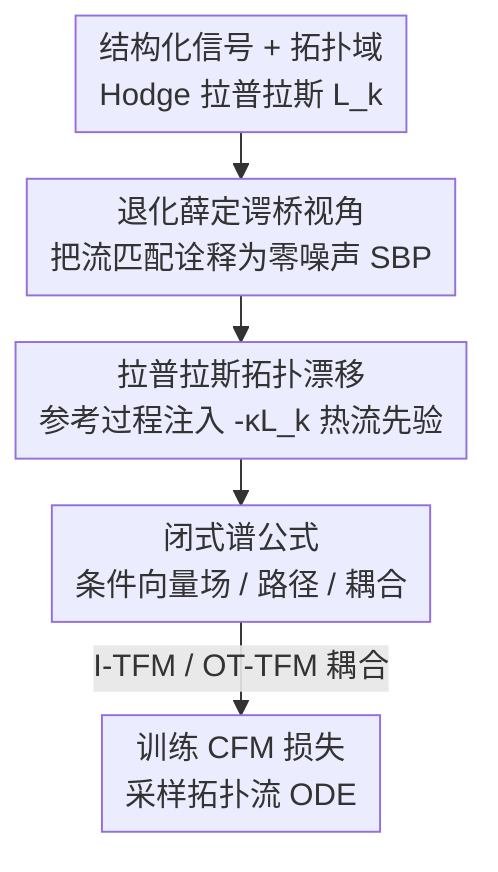

# Topological Flow Matching

**会议**: ICLR 2026  
**OpenReview**: [https://openreview.net/forum?id=5CM3ax45Ma](https://openreview.net/forum?id=5CM3ax45Ma)  
**代码**: https://github.com/KacperWyrwal/topological-flow-matching  
**领域**: 图学习 / 生成模型 / 流匹配  
**关键词**: 流匹配, 薛定谔桥, Hodge 拉普拉斯, 拓扑信号, 单纯复形

## 一句话总结
把流匹配重新诠释为"零噪声极限下的退化薛定谔桥"，再给其参考过程加一项由 Hodge 拉普拉斯导出的热扩散漂移，就得到 topological flow matching（TFM）——一个保留仿真无关训练目标与确定性采样路径、可即插即用替换标准流匹配的拓扑感知生成框架，在脑 fMRI、洋流、地震、交通等结构化信号上大幅超过流匹配与拓扑薛定谔桥。

## 研究背景与动机
**领域现状**：流匹配（Flow Matching, FM）是当前最强的生成框架之一，靠学习一个时间相关的向量场 $u_t$、沿流动 ODE $\dot X_t = u_t(X_t)$ 把简单分布 $\mu_0$（如 $\mathcal N(0,I)$）输运到数据分布 $\mu_1$。它的吸引力在于**仿真无关**（simulation-free）的可扩展训练目标和**确定性**采样路径，已在图像、视频、音频乃至科学计算上达到 SOTA。

**现有痛点**：科学与工程中最有价值的数据往往不是独立散点，而是**定义在结构化域上的信号**——脑区图上的 fMRI、网格上的洋流速度、路网上的交通流。这些域的拓扑结构本身就携带关键信息，但标准 FM 把信号当成欧氏空间里的点，完全无视域的拓扑与几何。

**核心矛盾**：几何/拓扑深度学习早已证明"尊重底层结构能带来显著增益"，FM 也已被推广到黎曼流形、离散空间上**生成点**；但还没有人把这种思路用于在结构化域上**建模信号**（如脑图节点上的 fMRI）。与此同时，已有的拓扑薛定谔桥匹配（TSBM, Yang 2025）虽能注入拓扑，却需要昂贵的随机仿真、采样路径也是随机的，丢掉了 FM 最香的两个优点。

**本文目标**：找到一种**有原则**地把拓扑信息注入 FM 的方式，且必须同时保住"仿真无关 + 确定性路径"，从而能直接顶替标准 FM。

**切入角度**：作者注意到 FM 与薛定谔桥问题（SBP）之间存在精确联系——OT-CFM 恰好是"零漂移、噪声 $\sigma\to0$"的退化 SBP 的解。既然 SBP 的参考过程扮演"先验"的角色，那么只要把这个先验从"无漂移布朗运动"换成"带拓扑漂移的扩散"，解就会被偏置到尊重域的拓扑。

**核心 idea**：用一项**拉普拉斯导出的漂移**（heat 漂移 $-\kappa L_k X_t$）增广参考过程，沿 SBP→OT-CFM 的同一套推导走一遍，就得到拓扑感知的 TFM——既注入了拓扑，又保留了闭式、仿真无关、确定性的全部好处。

## 方法详解

### 整体框架
TFM 的目标是：在图/单纯复形这类结构化域上生成信号，同时保留 FM 的仿真无关训练与确定性采样。整条思路分三步搭起来——先把标准流匹配**重新诠释**成一个退化薛定谔桥（这给"在哪儿注入拓扑"提供了原则性的接口），再往参考过程里**注入一项拉普拉斯热漂移**作为拓扑先验，最后把"漂移版"SBP 沿原推导重做一遍、得到全部**闭式谱公式**，于是训练只需最小化一个 CFM 损失、采样只需积分一条拓扑流 ODE。

其中域结构由 **Hodge 拉普拉斯** $L_k := B_k^\top B_k + B_{k+1}B_{k+1}^\top$ 编码（$B_k$ 是边界矩阵，$k=0$ 退化为图拉普拉斯 $L_0=B_1B_1^\top$）。$L_k$ 的非零特征值对应波状（高频）信号，**零特征值**对应拓扑特征（连通分量、环/洞/上同调类）。这个谱分解是后面所有设计的支点。

### 关键设计

**1. 退化薛定谔桥视角：把流匹配诠释成零噪声 SBP**

要"有原则地"注入拓扑，先得找到一个能挂载拓扑的接口——作者的做法是把 FM 翻译成薛定谔桥语言。SBP 在给定参考律 $P$（先验）、初/末观测 $\mu_0,\mu_1$ 下，求最可能的后验演化 $\min D_{KL}(Q\|P)$。作者证明：取**零漂移** $b=0$、常噪声 $\sigma\in\mathbb R^+$ 并令 $\sigma\to0$ 时，SBP 的三个核心组件恰好逐一退化成 CFM 的组件——条件向量场退化为直线场 $u^{x_0,x_1}_t(x)=x_1-x_0$、条件路径退化为 $\delta_{(1-t)x_0+tx_1}$、熵正则 OT 耦合退化为精确 OT 耦合（于是 $Q^*_{01}$ 正是 OT-CFM 用的 $\pi^*$，而 I-CFM 对应独立耦合近似 $Q^*_{01}\approx\mu_0\otimes\mu_1$）。由命题 1，OT-CFM 学到的边际向量场正是这个退化 SBP 解的漂移。

这个视角的价值在于：参考律 $P$ 是先验，**换先验就能换偏置**。标准 FM 的先验是"无结构的布朗运动"，所以它学到的是欧氏空间里能量最小的输运（Benamou–Brenier OT）；只要把先验替换成"尊重拓扑的扩散"，得到的解就会自动尊重拓扑。注意零噪声 SBP 严格说并不适定，但其最优漂移在 $\sigma\to0$ 下确实收敛，所以这是一个形式上但可严格化的"蓝图"。

**2. 拉普拉斯拓扑漂移：用热方程参考过程把拓扑当先验注入**

有了接口，就往参考过程里加一项拓扑漂移 $b_t(X_t)=H_t(L_k)X_t+\alpha_t$，参考过程变为 $\mathrm dX_t = (H_t(L_k)X_t+\alpha_t)\,\mathrm dt + \sigma\,\mathrm dW_t$。$H_t$ 取多项式即可逼近 $L_k$ 的任意解析函数（Cayley–Hamilton），作者聚焦最有解释力的一支 $H_t(L_k)=-\kappa L_k$（$\kappa>0$）：零噪声极限下参考过程就是**图/单纯复形上的热方程** $\dot X_t=-\kappa L_k X_t$。

为什么这恰好是"拓扑先验"？在 $L_k=U_k D_k U_k^\top$ 的谱坐标 $Y:=U_k^\top X$ 下，热方程对角化为 $\dot Y^i_t=-\kappa\lambda_i Y^i_t$，解 $Y^i_t=\exp(-\kappa\lambda_i t)Y^i_0$。于是**非零特征值**（高频、波状）分量按频率成比例地指数衰减——相当于去噪/平滑；而**零特征值**分量（连通分量、环绕"洞"的上同调类，即域的拓扑特征）保持不变。一句话：这个漂移是一个**拓扑感知的平滑偏置**——抑制无关高频振荡、保留与域结构对齐的成分，偏置强度由 $\kappa$ 控制。生成任务里还能进一步把初始分布也设为**热高斯过程** $\mu_0=\mathcal N(0,\exp(-\kappa L_k))$（$\kappa=0$ 退回标准高斯，等于禁止相邻单纯形间的热流）。

**3. 闭式谱公式：让 TFM 保持仿真无关、确定性、即插即用**

注入漂移后有个隐患：若直接给拓扑流 ODE $\dot X_t=H_t(L_k)X_t+\alpha_t+u_t(X_t)$ 随手挑一个 $u^{x_0,x_1}_t$，会要么把拓扑抵消掉（退回 CFM）、要么不可解。退化 SBP 的好处是它给出**唯一**且有原则的 $u^{x_0,x_1}_t$。作者沿用 OT-CFM 的推导，对"漂移版"SBP 重做一遍，得到条件向量场（命题 2）、条件路径（命题 3）、以及耦合的传输代价（命题 4），且在 $H_t(L_k)=-\kappa L_k$ 时全部化为**逐谱坐标的标量闭式**。例如条件路径在谱坐标下为

$$ (m^{y_0,y_1}_t)^i = \frac{\sinh(\kappa\lambda_i(1-t))}{\sinh(\kappa\lambda_i)}y^i_0 + \frac{\sinh(\kappa\lambda_i t)}{\sinh(\kappa\lambda_i)}y^i_1\quad(\lambda_i\neq0,\ \kappa\neq0), $$

在 $\lambda_i=0$ 或 $\kappa=0$ 时退回 CFM 的直线 $ty^i_1+(1-t)y^i_0$；传输代价 $c(y_0,y_1)=\sum_i \frac{2\kappa\lambda_i}{1-\exp(-2\kappa\lambda_i)}\big(y^i_1-\exp(-\kappa\lambda_i)y^i_0\big)^2$。因为条件桥 $(X_t\mid X_0,X_1)$ 在零噪声极限下**确定性地集中在均值上**，TFM 的训练目标依然是一个标准 CFM 平方损失 $\mathbb E\,\|u^{X_0,X_1}_t(X)-u^\theta_t(X)\|^2$——无需任何随机仿真。任选耦合 $\pi$ 都得到合法变体：**I-TFM**（独立耦合 $\mu_0\otimes\mu_1$）和 **OT-TFM**（用 $Q^*_{01}$ 求解退化拓扑 SBP，传输代价同样有闭式、可像欧氏 OT 一样高效求）。正因为这些公式与 CFM 一一镜像，TFM 才能**即插即用**顶替标准 FM。

### 损失函数 / 训练策略
训练即最小化条件 CFM 损失 $\mathbb E_{t\sim U[0,1),\,(X_0,X_1)\sim\pi,\,X\sim P^{X_0,X_1}_t}\big[\|u^{X_0,X_1}_t(X)-u^\theta_t(X)\|^2\big]$，由于条件桥确定性，这是仿真无关的。采样时积分拓扑流 ODE $\dot X_t=-\kappa L_k X_t + u^\theta_t(X_t)$。实验中固定 $\kappa=2.0$（逐实验调 $\kappa$ 可更好），图像生成因网格拓扑信息少而用 $\kappa=0.01$；模型、数据、设置尽量复用 Yang (2025) 以保证公平比较。

## 实验关键数据

### 主实验
在 graphs 与 2-单纯复形上的真实数据集做生成（$\mu_0$ 简单 / $\mu_1$ 为数据）与匹配（$\mu_0,\mu_1$ 均为数据分布），指标为 **1-Wasserstein 距离（越低越好）**，对比标准 CFM 与最佳 TSBM 变体。

| 方法 | Earthquakes | Traffic flows | Brain fMRI | Single-cell | Ocean currents |
|------|------|------|------|------|------|
| I-CFM | 8.37 | 1.72 | 11.71 | 0.022 | 1.95 |
| OT-CFM | 8.25 | 1.59 | 11.30 | 0.019 | 2.00 |
| I-TFM | **4.93** | **1.27** | 6.33 | **0.018** | **1.87** |
| OT-TFM | 5.53 | **1.27** | **5.86** | 0.019 | 1.91 |
| TSBM (best) | 7.69 | 9.92 | 7.51 | 0.140 | 6.89 |

TFM 在所有任务上都超过 CFM，且在结构最复杂的域上增益最大（脑 fMRI 11.30→5.86、地震 8.25→4.93 近乎腰斩）；同时一致优于需仿真的 TSBM，验证了"仿真无关框架"也能拿到拓扑红利。

### 消融 / 分析实验
把图像当作 $32\times32\times3$ 网格上的节点信号，在 CIFAR-10 上看拓扑平滑能否帮到图像生成（FID，越低越好，10 次运行）：

| 配置 | FID 均值 | FID 中位数 | 标准差 | 说明 |
|------|---------|---------|------|------|
| I-CFM | 3.7005 | 3.7061 | 0.0462 | 欧氏基线 |
| OT-CFM | 3.8238 | 3.8308 | 0.0615 | 欧氏基线 |
| I-TFM | **3.6972** | **3.6795** | 0.0821 | 比 I-CFM 略好 |
| OT-TFM | **3.8107** | **3.8046** | 0.0771 | 比 OT-CFM 略好 |

### 关键发现
- **增益来源是复杂拓扑**：CIFAR-10 上 TFM 仅微小改进且方差较大，而在地震/交通/脑图上提升巨大——正面印证 TFM 的红利来自"捕捉复杂域的拓扑特征"，规则网格拓扑信息少所以收益小。
- **反常的 I-TFM > OT-TFM**：地震实验里独立耦合的 I-TFM（4.93）反而优于理论上更"正统"的 OT-TFM（5.53）；脑 fMRI 则 OT-TFM 更优。说明最优耦合的优势并非在所有结构上都稳定兑现。
- **拓扑漂移直观可视**：MNIST 条件路径可视化（图 2）显示 TFM 的"噪声→数据"轨迹明显比 CFM 更平滑，直观对应"抑制高频、保拓扑"的谱分析。

## 亮点与洞察
- **"换参考过程 = 换归纳偏置"是个可复用的支点**：把 FM 看成退化 SBP 后，注入先验只是替换参考过程的漂移——这条接口不止能塞热漂移，也能塞 Matérn 型漂移、可学习 $\kappa$，甚至时间相关拉普拉斯（从而做"两个不同空间上信号"的匹配），通用性很强。
- **谱坐标把一切化简到标量**：所有矩阵级的桥/耦合公式在 $L_k$ 的特征基下都退成逐坐标 $\lambda_i$ 的 1-D 公式，既好实现又给出"零特征值=拓扑特征被保留"的清晰解释，是把抽象拓扑落到可计算公式的关键一招。
- **"drop-in 替换"是工程上的大卖点**：TFM 与 CFM 公式一一镜像，意味着已有 FM 管线只要把直线桥/欧氏代价换成谱版闭式即可，几乎零迁移成本就能吃到拓扑红利。

## 局限与展望
- **作者承认**：只探索了基于热方程的自然漂移；未来可试 Matérn 型漂移或带可学习扩散率 $\kappa$ 的漂移；时间相关拉普拉斯可支持跨空间匹配；流形上的 TFM 变体可用于地统计、机器人等。
- **自己发现**：固定 $\kappa$ 已不错但"逐实验调 $\kappa$ 更好"，说明对超参仍有一定敏感性，缺少自适应选 $\kappa$ 的机制；OT-TFM 并非总优于 I-TFM（地震反例），最优耦合的实际收益不稳定；图像/规则网格上几乎没有提升，限定了方法的适用边界（复杂拓扑才划算）；可视化主要在 MNIST/小图，超大规模复形上的可扩展性未充分压测。

## 相关工作与启发
- **vs 标准流匹配（CFM / OT-CFM）**: 二者都用仿真无关、确定性的流 ODE，但 CFM 把信号当欧氏点、忽略域结构；TFM 在参考过程里加拉普拉斯热漂移注入拓扑，公式一一镜像，可即插即用替换，复杂结构上大幅领先。
- **vs 拓扑薛定谔桥匹配（TSBM, Yang 2025）**: 二者都用 Laplacian 漂移注入拓扑，灵感同源；但 TSBM 走随机 SBP，需要昂贵仿真、采样路径随机，TFM 走零噪声极限拿到闭式、确定性、仿真无关的目标，且在同一套数据上一致更优——本质区别是"用 FM 的方式而非 SDE 仿真的方式"求解拓扑桥。
- **vs 几何/离散流匹配（黎曼流形 FM、离散 FM）**: 它们把 FM 推广到在流形/离散空间上**生成点**；TFM 解决的是正交的另一面——在固定结构化域上**建模信号**（如脑图节点上的 fMRI），二者可视为 FM 拓扑化的两条互补路线。

## 评分
- 新颖性: ⭐⭐⭐⭐⭐ 把 FM 重诠释为退化 SBP 并据此原则性注入拉普拉斯漂移，视角干净、推导完整。
- 实验充分度: ⭐⭐⭐⭐ 覆盖地震/交通/脑 fMRI/单细胞/洋流/图像 6 类域并与 CFM、TSBM 公平对比，但每域基本单一指标、缺更系统的 $\kappa$/耦合敏感性研究。
- 写作质量: ⭐⭐⭐⭐⭐ 从 SBP→CFM→TFM 的"蓝图—注入—镜像"叙事清晰，谱分析把直觉与公式扣得很紧。
- 价值: ⭐⭐⭐⭐⭐ 给结构化信号生成提供了零迁移成本、即插即用且有理论支撑的拓扑感知方案，对科学计算场景实用性高。

<!-- RELATED:START -->

## 相关论文

- [\[ICLR 2026\] Bures-Wasserstein Flow Matching for Graph Generation](bures-wasserstein_flow_matching_for_graph_generation.md)
- [\[ICLR 2026\] Topological Anomaly Quantification for Semi-Supervised Graph Anomaly Detection](topological_anomaly_quantification_for_semi-supervised_graph_anomaly_detection.md)
- [\[ICLR 2026\] Differentiable Lifting for Topological Neural Networks](differentiable_lifting_for_topological_neural_networks.md)
- [\[ICLR 2026\] FlowSymm: Physics–Aware, Symmetry–Preserving Graph Attention for Network Flow Completion](flowsymm_physicsaware_symmetrypreserving_graph_attention_for_network_flow_comple.md)
- [\[ICML 2026\] Graph-GRPO: Training Graph Flow Models with Reinforcement Learning](../../ICML2026/graph_learning/graph-grpo_training_graph_flow_models_with_reinforcement_learning.md)

<!-- RELATED:END -->
