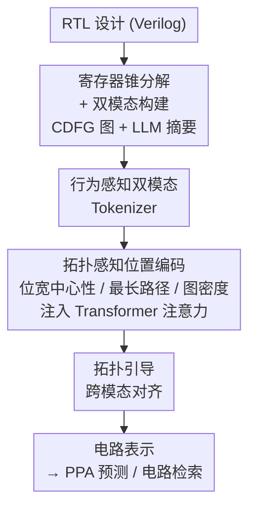

# Topology Matters in RTL Circuit Representation Learning

**会议**: ICLR 2026  
**OpenReview**: [https://openreview.net/forum?id=bn6bD7TowO](https://openreview.net/forum?id=bn6bD7TowO)  
**代码**: https://github.com/BUPT-GAMMA/TopoRTL.git  
**领域**: 图表示学习 / EDA 芯片设计  
**关键词**: RTL 表示学习, 电路拓扑, 多模态对齐, 位置编码, PPA 预测

## 一句话总结
针对现有 RTL 电路表示学习把 Verilog 当普通代码、忽略硬件拓扑的问题，TopoRTL 把电路拆成寄存器锥、构建「图 + 文本摘要」双模态，再用三种拓扑感知位置编码注入注意力、配合拓扑引导的跨模态对齐，用仅 29M 参数在 PPA 预测和电路检索上超过 7B 级文本大模型。

## 研究背景与动机
**领域现状**：用表示学习把芯片设计中的电路映射到低维向量空间，是 EDA「设计左移」（把性能预测、问题检测前移到早期阶段）的基础能力，可服务 PPA（性能/功耗/面积）预测、电路检索、电路生成等下游任务。RTL（寄存器传输级，工业上用 Verilog 描述）是数字电路中最关键的抽象层，因此大量工作把 RTL 当软件代码处理——CodeV 用 GPT-3.5 给 Verilog 生成自然语言描述再微调 LLM，DeepRTL/DeepRTL2 在「Verilog↔描述」数据上微调 CodeT5+，本质都是基于文本学语法语义。

**现有痛点**：RTL 不是普通编程语言，它本质上是一张结构化数据流图，行为意图与拓扑结构密不可分。论文用图 1 给出反直觉例子：电路 A 和 B 拓扑几乎一样、但实现的功能不同（一个减法、一个加法）；电路 B 和 C 都是四输入加法器、功能完全相同，但 B 是链式结构、C 是树式结构，链式更省功耗、树式时序更优——同样的功能因拓扑不同会带来截然不同的物理表现。纯文本方法看不到这种拓扑差异，导致表示不完整、下游任务受限。

**核心矛盾**：文本方法（LLM）擅长行为语义但天然不擅长图结构数据，抓不住拓扑；传统拓扑方法（手工特征工程把 Verilog 转图）又缺语义泛化能力；而近期多模态尝试如 CircuitFusion 要靠昂贵的逻辑综合（生成门级网表）来隐式推断拓扑，效率低、违背「设计左移」初衷。三类方法都没能在 RTL 原生层面同时拿到行为和拓扑。

**本文目标**：在不依赖综合的前提下，直接从 RTL 同时建模行为函数和拓扑结构，让表示对拓扑敏感。

**切入角度**：作者把 RTL 信号传播拆成两个阶段——计算阶段（信号穿过组合逻辑网络，互连密度影响功耗、传播路径深度影响时序）和存储阶段（时钟边沿寄存器锁存结果，位宽决定数据精度、反映操作复杂度）。这个「双阶段」视角揭示：拓扑不只是组合逻辑的连线，它本身就是行为函数的一种有意表达，因此可以用一组贴合存储/计算维度的结构特征把拓扑显式编码进来。

**核心 idea**：把电路拆成寄存器锥、构建图与文本双模态，用「位宽中心性 + 最长路径 + 图密度」三种拓扑感知位置编码改造 Transformer 注意力，再用拓扑约束做跨模态对齐，让表示既懂行为又懂拓扑。

## 方法详解

### 整体框架
TopoRTL 的输入是一份 RTL 设计（Verilog），输出是一组既保留行为语义、又对拓扑差异敏感的电路向量表示，可直接用于 PPA 预测和电路检索。整条流水线先做数据预处理（把设计拆成寄存器锥、为每个锥造图模态和文本摘要模态），再过三个核心组件：双模态 tokenizer 给两路模态产生初始嵌入，拓扑感知位置编码 + Transformer 把结构信息注入注意力，最后拓扑引导的跨模态对齐把两路模态拉到一致语义空间。

### 关键设计

**1. 寄存器锥分解 + 图-文本双模态构建：把一整块电路拆成可对齐的语义单元**

纯把整份 Verilog 喂给模型既丢拓扑又粒度太粗。TopoRTL 借「子设计划分」思路，用寄存器驱动的反向遍历把设计拆成寄存器锥（register cone）：给定含 $\{R_i\}_{i=1}^{N}$ 个寄存器的设计，先建信号依赖字典，再从每个寄存器 $R_i$ 沿组合逻辑反向遍历到它的输入/相连寄存器，最后用 Yosys 把识别出的信号还原成语法正确、可验证的子电路 $V^{R_i}$。每个子电路再造两路模态：图模态把 $V^{R_i}$ 转成控制-数据流图（CDFG）$G^{R_i}$，节点是组合逻辑和寄存器、边是信号连通性，显式建模拓扑；文本模态则用 GPT-OSS-120B 给每个子电路生成描述高层功能意图的行为摘要 $S^{R_i}$。这样一份设计变成 $N$ 个寄存器锥、每个锥两路互补表示，为后续「拓扑由图来管、行为由文本来管」打好基础。

**2. 三种拓扑感知位置编码 + 拓扑感知注意力：把硬件结构变成 Transformer 能感知的归纳偏置**

香草 Transformer 对线性序列在行，但看不出 RTL 的层次拓扑——信号路径和连接密度对功能至关重要却被忽略。TopoRTL 顺着「存储/计算双阶段」设计了三种编码。**位宽中心性编码**对应存储阶段：寄存器位宽直接决定数据精度（32 位算术单元需要宽位宽，1 位控制信号窄位宽即可），从 Verilog 声明（如 `reg [31:0] data;`）抽出 $bit(R_i)$，为每个可能的位宽值学一对可查表嵌入 $a^{bit}_G, a^{bit}_S$，加到 MLP 处理后的节点特征上：$h^{R_i}_G = x^{R_i} + a^{bit(R_i)}_G$，把位宽和功能复杂度关联起来。**最长路径编码**与**密度编码**对应计算阶段：对每个寄存器锥取从其它寄存器到 $R_i$ 的路径长度集合 $L^{R_i}$（用伪逻辑门数衡量），为抗离群点取 Top-K 最长路径求均值 $l^{R_i} = \text{MEAN}(\text{Top-K}(L^{R_i}))$，再构关系矩阵 $\Delta L_{ij} = |l^{R_i} - l^{R_j}|$ 表征关键路径差异；图密度 $\rho^{R_i} = \frac{E^{R_i}}{N^{R_i}(N^{R_i}-1)}$ 量化局部互连紧密程度（越高功耗越大、耦合越紧），同样构差异矩阵 $\Delta \rho_{ij}$。最关键的一步是把这两个差异矩阵当作偏置注入注意力分数：

$$A_{Gij} = \frac{(h^{R_i}_G W^Q_G)(h^{R_j}_G W^K_G)^T}{\sqrt{d}} + \alpha_G \cdot f_G(\Delta L_{ij}) + \beta_G \cdot g_G(\Delta \rho_{ij})$$

其中 $f_G, g_G$ 是可学习的 MLP 映射、$\alpha_G, \beta_G$ 是可学习缩放系数。这样注意力会随寄存器对之间的时序特征（路径深度差）和结构复杂度（密度差）动态调整关注度；代表整块电路的虚拟节点 $R_0$ 则把所有空间编码重置为独立可学习标量单独处理。图、文本两路各过一套这样的 Transformer。

**3. 拓扑引导的跨模态对齐：用拓扑约束把图模态和文本模态拉到一致语义**

光有两路独立表示还不够，需要让「图懂的拓扑」和「文本懂的行为」对齐又不破坏拓扑结构。TopoRTL 构造两种互补的融合 $Y = (H_G, \hat{H}_S)$ 与 $Z = (\hat{H}_G, H_S)$（一边用图的输入嵌入配文本的编码输出、另一边反过来），各自跨节点取均值得全局表示 $y, z$。对齐用一个带 margin 的四元组/对比损失，既把正对 $(y,z)$ 拉近，又要求其距离小于拓扑不相似负样本的距离（负样本从 batch 内随机取 $y_{neg}, z_{neg}$）：

$$L_{fuse} = [\|y - z\|_2^2 - \|y - z_{neg}\|_2^2 + \beta]_+ + [\|z - y\|_2^2 - \|z - y_{neg}\|_2^2 + \beta]_+$$

其中 $\beta$ 控制正负样本间距 margin，$[\cdot]_+ = \max(0, \cdot)$。这个损失同时作为预训练损失，让两路模态在保持拓扑一致性的前提下达成语义对齐，从而在检索这类行为敏感任务里也能借拓扑过滤掉无关样本、提升匹配可靠性。

### 损失函数 / 训练策略
双模态 tokenizer 通过行为等价对比学习任务 + 掩码建模任务预训练（图 tokenizer 映射子电路到紧凑潜表示，文本 tokenizer 基于 BERT 编码摘要）；主框架的预训练目标即上面拓扑引导对齐的 $L_{fuse}$。整体架构轻量，仅 29.13M 参数。

## 实验关键数据

数据集为 115 份 RTL 设计（来自 OpenCores、VexRiscv、ITC'99、DeepCircuitX），抽寄存器锥后得 7,576 个子电路。两个下游任务：PPA 预测（回归，指标 PCC / R² / MAPE / RRSE）和自然语言代码检索（按 $L \in \{5,8,10,15\}$ 个负样本检索分类，指标 AUC）。基线含图模态（GCN-MLP/GCN-GNN）、文本模态（Qwen3-Embedding 0.6B/4B/8B、Verilog 专用 CodeV 三个变体 6.7B–7B）、多模态（CircuitFusion）。

### 主实验（PPA 预测，节选 Area / Power / WNS）

| 指标 | TopoRTL (29M) | CircuitFusion (150M) | CodeV-QC (7B) | Qwen3-E-8B |
|------|------|------|------|------|
| Area PCC↑ | **0.863** | 0.647 | 0.818 | 0.720 |
| Area MAPE↓ | **7.952** | 13.242 | 10.830 | 12.079 |
| Power PCC↑ | **0.884** | 0.657 | 0.805 | 0.766 |
| Power MAPE↓ | **25.033** | 43.073 | 37.314 | 37.826 |
| WNS PCC↑ | **0.862** | 0.817 | 0.762 | 0.849 |
| WNS RRSE↓ | **0.580** | 0.808 | 1.400 | 0.674 |

TopoRTL 以远小的参数量（29M vs 7B 文本模型）在 Area/Power 上大幅领先（Area PCC ↑5.5%、Power PCC ↑6.9%、Area MAPE ↓26.2%、Power MAPE ↓31.5%），并在 WNS 上刷新时序基准；Slack 上与最强基线持平。检索任务（图 3）中 TopoRTL 在所有 $L$ 取值下都稳定保持约 0.8 AUC，优于全部基线，鲁棒性最好。

### 消融实验（图 5）

| 配置 | 现象 |
|------|------|
| Full TopoRTL | 完整模型，整体最优 |
| w/o bit-width | 去掉位宽编码后掉点明显，位宽编码最有效地捕捉拓扑与复杂度 |
| w/o max-path | 去掉最长路径编码，效果有增有减不稳定 |
| w/o graph-density | 去掉密度编码，效果同样不稳定 |
| w/o cross-modal loss | 去掉拓扑引导对齐，时序略升但其它拓扑/行为任务大幅下降 |

### 关键发现
- 位宽中心性编码贡献最大、最稳定；最长路径与图密度编码单独看效果不一致，作者认为这说明电路表示需要多种互补的拓扑信号配合，而非依赖单一结构特征。
- 拓扑引导对齐「偏向拓扑保真」：它优先保证拓扑-语义一致性，可能让 Slack 这类时序精度略降，但显著提升其它拓扑与行为任务，对设计优化整体更有利。
- t-SNE 可视化（图 4）显示 TopoRTL 的表示在 Area/Power 上呈平滑梯度、在 Slack 上呈不重叠的清晰簇，而 CircuitFusion 分布破碎、簇严重纠缠；TopoRTL 的 Slack 簇里仍有孤立离群点，反映 RTL 与门级实现间尚未解决的抽象损失。

## 亮点与洞察
- 把硬件领域知识（双阶段信号传播：存储看位宽、计算看路径深度与密度）翻译成三种可注入注意力的位置编码偏置，是「领域归纳偏置 > 暴力堆参数」的漂亮范例——29M 打 7B。
- 不靠逻辑综合就拿到拓扑，真正贴合 EDA「设计左移」，避免了 CircuitFusion 那种依赖门级网表的高成本路径。
- 「拓扑差异矩阵 $\Delta L, \Delta \rho$ 当注意力偏置」这一手可迁移到其它结构化图序列任务：凡是节点间存在可量化结构距离（路径、密度、层级）的场景，都能把它做成可学习偏置注入 Transformer。

## 局限与展望
- 当前寄存器锥分解假设同步时序电路，会在抽取过程中破坏时钟域关系，未来需做时钟感知分解以支持异步电路。
- 数据集仅 115 份设计 / 7,576 子电路，规模有限，扩到更大更多样的 RTL 数据才能验证跨架构泛化。
- 最长路径与密度编码效果不稳定，位置编码仍有提升空间；Slack 表示里的离群点也暴露 RTL 抽象与门级实现的对齐缺口。

## 相关工作与启发
- **vs CircuitFusion（多模态）**: 它整合代码/摘要/图，但靠预训练时引入门级网表来隐式推断拓扑，成本高且违背左移；TopoRTL 直接从 RTL 用硬件归纳偏置显式抽拓扑，更轻更快、PPA 全面领先。
- **vs SNS v2（拓扑对比）**: 它把电路分成寄存器锥做功能等价对比预训练，但牺牲了拓扑感知，无法区分图 1 里功能相同、拓扑不同的电路 B 和 C；TopoRTL 正是要把这种拓扑差异显式编码出来。
- **vs CodeV / DeepRTL（文本 LLM）**: 它们把 RTL 当软件代码学语法语义，抓不到图结构拓扑；TopoRTL 以图模态补上拓扑、用对齐保住行为，证明拓扑信息对 RTL 表示不可或缺。

## 评分
- 新颖性: ⭐⭐⭐⭐⭐ 「拓扑即行为」的观察 + 三种硬件启发位置编码注入注意力，角度新且自洽
- 实验充分度: ⭐⭐⭐⭐ PPA 五指标 + 检索 + t-SNE + 消融较完整，但数据集规模偏小
- 写作质量: ⭐⭐⭐⭐ 双阶段动机讲得清楚、图 1 反例有说服力，公式记号略密
- 价值: ⭐⭐⭐⭐⭐ 轻量超大模型、贴合设计左移，对 EDA 表示学习有实际意义

<!-- RELATED:START -->

## 相关论文

- [\[CVPR 2026\] R2G: A Multi-View Circuit Graph Benchmark Suite from RTL to GDSII](../../CVPR2026/graph_learning/r2g_multi_view_circuit_graph_benchmark_suite_from_rtl_to_gdsii.md)
- [\[ICLR 2026\] On the Trade-off Between Expressivity and Privacy in Graph Representation Learning](on_the_trade-off_between_expressivity_and_privacy_in_graph_representation_learni.md)
- [\[ICLR 2026\] Temporal Graph Thumbnail: Robust Representation Learning with Global Evolutionary Skeleton](temporal_graph_thumbnail_robust_representation_learning_with_global_evolutionary.md)
- [\[ICLR 2026\] Global and Local Topology-Aware Graph Generation via Dual Conditioning Diffusion](global_and_local_topology-aware_graph_generation_via_dual_conditioning_diffusion.md)
- [\[ICLR 2026\] $\ell_1$ Latent Distance Based Continuous-Time Graph Representation](ell_1_latent_distance_based_continuous-time_graph_representation.md)

<!-- RELATED:END -->
