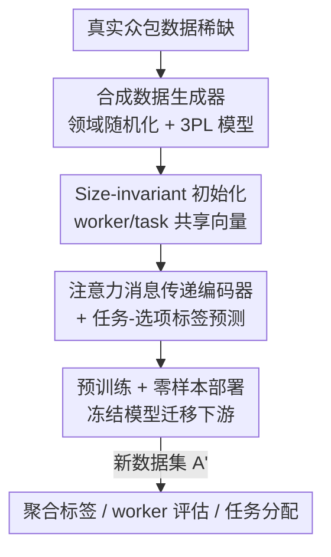

# Towards a Foundation Model for Crowdsourced Label Aggregation

**会议**: ICLR 2026  
**OpenReview**: [https://openreview.net/forum?id=FF9QVQduAu](https://openreview.net/forum?id=FF9QVQduAu)  
**代码**: https://github.com/liiuhaao/CrowdFM (有)  
**领域**: 图学习 / 众包标签聚合 / 基础模型  
**关键词**: 标签聚合, 众包, 二部图神经网络, 合成数据预训练, 零样本泛化

## 一句话总结
CrowdFM 把"从众包噪声标签里推真值"这件事从"每个数据集单独估参数"升级成"一个预训练好的二部图神经网络零样本通吃"：用领域随机化的合成众包数据预训练一个显式建模 worker / task / option 的注意力 GNN，在 22 个真实数据集上无需任何重训就能匹配甚至超过逐数据集定制的方法，且推理只要 0.53 秒/数据集。

## 研究背景与动机

**领域现状**：众包用大量非专家标注换规模，但 worker 水平参差导致标签互相矛盾，所以需要"标签聚合"从噪声标注里推断真值。这个方向长期被两套互斥范式统治：一边是多数投票（Majority Voting, MV），简单、可扩展、免训练、任何数据集直接用，但假设所有 worker 质量相同，在异质场景下精度不够；另一边是从概率图模型（Dawid-Skene、GLAD、EBCC）到深度学习（LAA、TiReMGE、GOVERN）的一大票高精度方法，每个都得在新数据集上从零估计 worker 能力、任务难度等数据集专属参数。

**现有痛点**：高精度方法全都被锁死在"逐数据集（dataset-specific）"范式里——参数不跨数据集共享，每来一个新部署就要重训一遍，既不可扩展、又脆弱、还无法迁移知识。换句话说，它们用 MV 赖以实用的那些性质（免训练、通用）换了精度。

**核心矛盾**：精度与通用性之间存在结构性的二选一。能不能要一个既有高精度方法的准、又有 MV 的可扩展与免训练的模型？已有的跨数据集尝试 HyperLM 开了头，但它的图结构里没有显式的 worker-task 建模，训练又用均匀分布的合成数据，和真实众包模式严重错位，真实场景下表现很差。

**本文目标**：做一个真正可迁移的众包聚合基础模型，要同时啃下两块硬骨头——（1）通用众包表征：worker / task / option 数量千变万化、标注模式各异，模型得能把任意配置都编码成有意义、能体现异质性的表示；（2）真实合成数据：基础模型需要海量预训练数据，但公开众包数据极稀缺，合成数据又必须忠实反映真实众包模式才能支撑迁移。

**核心 idea**：用一个显式建模 worker / task / option 三类节点的二部图神经网络当聚合函数，在领域随机化的合成众包数据上预训练，让它学到"集体智慧"的通用原理，从而零样本泛化到任何新数据集，免重训。

## 方法详解

### 整体框架

CrowdFM 把聚合从"在单个数据集 $D^{(s)}$ 上做最大似然估计 $\Theta^{(s)*}=\arg\max \log p(A^{(s)}\mid\Theta^{(s)})$"改成"学一个参数共享的聚合函数 $F_\Theta: A \mapsto \hat{Y}$，在数据集分布 $p_D$ 上最小化期望损失 $\Theta^*=\arg\min_\Theta \mathbb{E}_{D\sim p_D}[\ell(F_\Theta(A),Y)]$"。预训练完 $F_{\Theta^*}$ 就冻住，对新标注集 $A'$ 直接 $\hat{Y}'=F_{\Theta^*}(A')$ 零样本推理，根本不再估参数——这是它和逐数据集范式的根本区别。

整条 pipeline 三大块串起来：先用领域随机化的**合成数据生成器**造出海量风格各异的众包数据集（解决数据稀缺）；再用一个 **size-invariant 初始化 + 注意力消息传递的二部图编码器**把 worker/task/option 编码成表征并预测聚合标签（解决通用表征）；最后**预训练冻结、零样本部署**到真实数据，并把学到的表征迁移到 worker 评估、任务分配等下游应用。

### 关键设计

**1. 领域随机化的合成数据生成器：用 3PL 响应模型造出忠实于真实众包的海量预训练数据**

基础模型要大规模预训练，可公开真实众包数据极少，HyperLM 用的均匀随机生成又和真实模式对不上。CrowdFM 的解法是把众包数据的每个关键侧面都随机化，逼模型见过千姿百态的场景：**全局结构随机化**——每个合成数据集独立采样任务数 $N$、worker 数 $M$、选项数 $K$、每任务期望标注数 $A$，覆盖各种规模与稀疏度；**行为异质性**——worker 能力 $\theta_i\sim\mathcal{N}(\mu_\theta,\sigma_\theta^2)$、任务难度 $\beta_j\sim\mathcal{N}(\mu_\beta,\sigma_\beta^2)$、区分度 $\alpha_j$、猜测率 $c_j$ 都随机采，且这些分布的超参本身又对每个数据集随机抽，产生异质的 worker/task 画像；**任务分配机制**——worker 标注容量 $L_i$ 取自重尾分布以再现"少数人标很多、多数人标很少"的长尾参与，每任务标注人数 $n_j$ 服从泊松分布，造出自然不均的标注覆盖。

最关键的是标注生成用了**项目反应理论的三参数 logistic（3PL）模型**，让观测标签同时体现 worker 技能与任务属性、又留出随机犯错的余地：worker $w_i$ 对任务 $t_j$ 标对的概率为

$$p_{ij} = c_j + (1-c_j)\cdot\sigma\big(D\alpha_j(\theta_i-\beta_j)\big),$$

其中 $\sigma$ 是 logistic 函数、$D$ 为缩放常数。观测标签 $a_{ij}$ 以概率 $p_{ij}$ 取真值 $y_j$，以 $1-p_{ij}$ 从剩下 $K-1$ 个选项里随机挑错。正是这个生成器让模型学的是"跨数据集都成立的聚合规律"而非过拟合到某个固定设置，消融里去掉它（w/o SG）精度明显掉，印证了 sim-to-real 迁移对多样合成数据的依赖。

**2. Size-invariant 初始化：让任意规模的数据集都能套同一套参数**

传统聚合方法常依赖 one-hot 身份特征或标注统计量来初始化节点，这等于把模型绑死在某个固定 worker/task 数量上，换数据集就废了。CrowdFM 反其道而行：所有 worker 节点共享同一个可学习向量 $x_w\in\mathbb{R}^d$、所有 task 节点共享另一个 $x_t\in\mathbb{R}^d$，option 节点则按类别各自从固定维高斯独立初始化：

$$z^{(0)}_{w_i}=x_w,\quad z^{(0)}_{t_j}=x_t,\quad z^{(0)}_{o_k}\sim\mathcal{N}(0,I_d).$$

背后的哲学是：在看到任何标注之前，所有 worker（所有 task 同理）是不可区分的，它们的差异应当只在关系证据被纳入后才"长出来"，而不靠任何数据集专属先验。option 用随机初始化保证候选标签之间有足够区分度，且不管选项数多少都成立。这一步是整个跨数据集泛化的地基——参数维度只跟隐藏维 $d$ 有关，与 $N$、$M$、$K$ 全部解耦。

**3. 注意力消息传递编码器 + 任务-选项预测头：从纯关系证据里"长出"worker/task 的差异**

从无差别的初始化出发，编码器要靠 $L$ 层基于注意力的聚合，沿着观测标注逐渐把本来一模一样的 worker/task 节点区分开。对每条标注 $(w_i,t_j,a_{ij})$ 构造三元表示 $h^{(l)}_{ij}=[z^{(l)}_{w_i},z^{(l)}_{t_j},z_{a_{ij}}]\in\mathbb{R}^{3d}$，经类型专属线性投影得到 query/key/value，再用缩放点积注意力在"汇入同一中心节点的所有标注"上归一化：

$$\alpha^{(l)}_{ij}=\mathrm{softmax}\!\left(\frac{\langle q_{ij},k_{ij}\rangle}{\sqrt{d}}\right),\quad z^{(l+1)}=\mathrm{LayerNorm}\Big(z^{(l)}+\sum_{(i,j)\in\mathcal{N}}\alpha^{(l)}_{ij}v_{ij}\Big).$$

注意力让模型能按标注模式自适应地给不同标注分配权重（而不是均匀平均），这正是建模标注异质性的核心——消融里把注意力换成 mean 聚合（w/o AT）造成的精度跌幅最大。编码完后预测头把任务嵌入 $z_{t_j}$ 与每个选项嵌入 $z_{o_k}$ 拼接送进共享前馈网络出 logits $\hat{l}_{jk}=g([z_{t_j},z_{o_k}])$，softmax 后取 $\hat{y}_j=\arg\max_k \hat{p}_{jk}$。这种"任务-选项配对"的设计让模型能处理任意选项数，同时捕捉任务-选项交互。

**4. 合成预训练 + 零样本部署 + 下游头迁移：一次预训练通吃聚合与多种应用**

模型在 $S$ 个合成数据集上联合优化平均交叉熵 $\mathcal{L}=-\frac1S\sum_s\big(\sum_j\sum_k \mathbf{1}[y^{(s)}_j=k]\log\hat{p}^{(s)}_{jk}\big)$，训练时每步动态采样不同配置，最大化场景多样性。预训练完参数固定为 $F^*$，对新标注集直接 $\hat{Y}=F^*(A')$，无任何参数更新即可部署。更进一步，把编码器冻住、只在其表征上训练轻量下游头，就能复用预训练知识做两类应用：**worker/task 评估**（用回归头 $\hat{a}_i=g_a(z_{w_i})$、$\hat{d}_j=g_d(z_{t_j})$ 以 MSE 拟合合成生成器给的真值 $\theta_i,\beta_j$，评估 worker 能力与任务难度）；**任务分配**（用兼容性头 $\hat{c}_{ij}=g_c(z_{w_i},z_{t_j})$ 以 BCE 预测某 worker 是否会标对某任务，指导预算受限下的智能派单）。下游头训一次即可跨数据集直接用，体现了"单一预训练网络承载可迁移知识"的基础模型范式。

### 损失函数 / 训练策略
预训练用跨合成数据集的平均交叉熵（式 11）联合优化编码器与预测头；下游 worker/task 评估头用 MSE（式 13），任务分配兼容性头用 BCE（式 14）。训练数据为动态生成、每步重采样的合成众包数据集。

## 实验关键数据

### 主实验

22 个真实众包数据集上，CrowdFM 单一固定模型在 21/22 上超过 MV，是所有方法里 #Win 最高的；平均比 MV 高 +1.64 个百分点，且推理高效。

| 方法 | #Win↑ | 平均 Acc.↑ | 运行时(s)↓ | vs CrowdFM p 值 |
|------|-------|-----------|-----------|------|
| MV | - | 81.78 | 0.04 | 0.00003 |
| BWA | 17 | 83.31 | 0.10 | 0.60871 |
| EBCC | 17 | 84.08 | 2.95 | 0.90089 |
| DS | 16 | 83.02 | 5.24 | 0.31889 |
| GOVERN（最佳深度法） | 13 | 82.61 | 95.43 | 0.28992 |
| HyperLM（跨数据集对手） | 12 | 80.81 | 0.88 | 0.01793 |
| **CrowdFM** | **21** | **83.41** | **0.53** | - |

CrowdFM 平均精度 83.41%，与最强的 EBCC（84.08%）无统计显著差异（$p=0.90089$），但 EBCC 每数据集要 2.95 秒、CrowdFM 只要 0.53 秒；相比 LAA（223 s）、TiReMGE（26.8 s）、GOVERN（91.46 s）这些深度方法更是快出数量级。逐数据集来看，Web 和 MS 上比 MV 高出 +12.93% 和 +9.43%，Bird +3.70%、RTE +2.18%，唯一小幅落后是 Senti（-0.08%，且 Senti 本身偏离合成训练分布）。

### 消融实验

| 配置 | 关键指标 | 说明 |
|------|---------|------|
| Full model | 最优 | 完整 CrowdFM |
| w/o AT（注意力换 mean 聚合） | 掉幅最大 | 注意力是建模标注异质性的关键 |
| w/o SG（合成生成器换均匀随机） | 明显下降 | 多样合成数据对 sim-to-real 迁移至关重要 |
| GNN 层数 $L$ ↑ | 稳步提升 | 更长程消息传递有助捕捉标注模式 |
| 嵌入维 $d$（2/4/更高） | 维度 2 不够、4 够基本、更高更好 | 维度反映 worker 行为建模容量 |

### 关键发现
- 去掉注意力（w/o AT）掉点最多——说明区分对待不同标注、而非均匀平均，是聚合异质众包的核心机制。
- 去掉领域随机化生成器（w/o SG）也明显掉点——合成数据的多样性直接决定能否迁移到真实数据。
- worker/task 评估上，CrowdFM 预测值与合成真值（Pearson/Spearman）强相关，迁移到真实 Web 数据后与"个体 worker 准确率/任务错误率"代理指标也强相关，说明即便预训练时没监督这些属性，表征里也自然捕捉到了 worker 行为与任务难度。
- 任务分配上，用兼容性预测派单（Predictor）显著优于随机派单；有意思的是后几轮 MV 精度开始下滑（优质 pair 先被分掉、剩下越来越噪），而 CrowdFM 仍稳定，体现它对噪声标注的韧性。

## 亮点与洞察
- **范式转换最值钱**：把"逐数据集估参"换成"一次预训练、零样本通吃"，等于给标签聚合做了 GPT 式的基础模型化，既保住 MV 的免训练通用，又拿到高精度方法的准。
- **size-invariant 初始化是泛化的真正地基**：让所有 worker/task 起步时不可区分、只靠关系证据"长出"差异，从根上去掉了数据集专属先验，参数维度只跟 $d$ 走——这个思路可迁移到任何"实体无固有特征、只有交互"的图任务（如推荐冷启动、社交网络对齐）。
- **用 3PL/IRT 当合成器的生成模型很巧**：项目反应理论本就是心理测量学里刻画"被试能力×题目难度"的成熟模型，搬来生成众包标注既有理论根基又能注入真实异质性，比均匀随机生成靠谱得多。
- **一套编码器三种用途**：冻结编码器 + 轻量头同时支撑聚合、worker 评估、任务分配，把"基础模型 = 可迁移表征"落到了众包这个小众但实用的场景。

## 局限与展望
- 评估只覆盖**分类型**众包任务（指标用 accuracy），对回归型、排序型、结构化标注任务是否成立未验证。
- 强依赖合成数据生成器的"真实性"：一旦真实场景偏离 3PL 假设（如恶意对抗标注、协同作弊、worker 间相关性），生成器没建模到，迁移可能失效——Senti 上的小幅落后已是 domain shift 的信号。
- 模型对 worker 间相关性（EBCC 显式建模的东西）没有显式机制，纯靠注意力隐式吸收；在 worker 高度相关的数据上是否吃亏值得深究。
- 维度/层数消融显示"更大更好"，但论文止步于此，未给出在更大规模配置下的收益-成本曲线，scaling 行为仍待系统刻画。

## 相关工作与启发
- **vs 逐数据集方法（DS / EBCC / BWA / GLAD / GOVERN）**: 它们逐数据集估 worker 混淆矩阵/能力/难度，精度高但必须从零重训、不可迁移；CrowdFM 单模型零样本，精度与最强者持平却快一到两个数量级。
- **vs HyperLM**: 同样追求免重训跨数据集，但 HyperLM 为程序化弱监督设计、用均匀随机生成数据、每条二值标注一个节点导致高开销且不可扩展、且没有显式 worker/task 表征无法做下游；CrowdFM 显式建模 worker/task/option、用领域随机化 + 3PL 贴近真实，且精度（83.41 vs 80.81）和效率（0.53 vs 0.88 s）双赢。
- **vs MV**: MV 免训练通用但假设 worker 同质、精度受限；CrowdFM 保住免训练通用的同时显式建模异质性，21/22 数据集胜过 MV。

## 评分
- 新颖性: ⭐⭐⭐⭐⭐ 把标签聚合彻底基础模型化，size-invariant 初始化 + 3PL 合成器是干净有力的组合创新。
- 实验充分度: ⭐⭐⭐⭐ 22 个真实数据集 + 显著性检验 + 两类下游应用很扎实，但仅限分类任务、缺 scaling 上限刻画。
- 写作质量: ⭐⭐⭐⭐⭐ 动机的"精度 vs 通用"二元对立讲得清楚，方法与公式衔接利落。
- 价值: ⭐⭐⭐⭐⭐ 免重训、0.53 秒/数据集、还能直接迁移到 worker 评估与派单，工程落地价值高。

<!-- RELATED:START -->

## 相关论文

- [\[ICLR 2026\] HGNet: Scalable Foundation Model for Automated Knowledge Graph Generation from Scientific Literature](hgnet_scalable_foundation_model_for_automated_knowledge_graph_generation_from_sc.md)
- [\[ICLR 2026\] FLOCK: A Knowledge Graph Foundation Model via Learning on Random Walks](flock_a_knowledge_graph_foundation_model_via_learning_on_random_walks.md)
- [\[ICLR 2026\] HYPER: A Foundation Model for Inductive Link Prediction with Knowledge Hypergraphs](hyper_a_foundation_model_for_inductive_link_prediction_with_knowledge_hypergraph.md)
- [\[ICML 2026\] Structure-Centric Graph Foundation Model via Geometric Bases](../../ICML2026/graph_learning/structure-centric_graph_foundation_model_via_geometric_bases.md)
- [\[ICLR 2026\] PRISM: Partial-label Relational Inference with Spatial and Spectral Cues](prism_partial-label_relational_inference_with_spatial_and_spectral_cues.md)

<!-- RELATED:END -->
