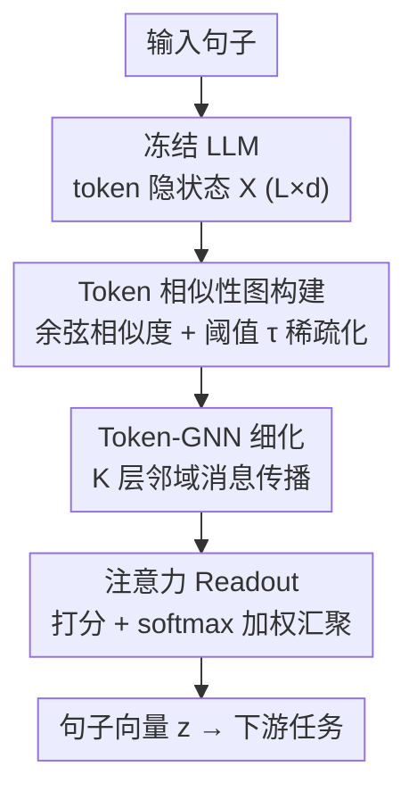

# Towards Improved Sentence Representations using Token Graphs

**会议**: ICLR 2026  
**arXiv**: [2603.03389](https://arxiv.org/abs/2603.03389)  
**代码**: [https://github.com/ipsitmantri/GLOT](https://github.com/ipsitmantri/GLOT)  
**领域**: NLP / 图学习  
**关键词**: 句子表征, 图神经网络, Token图, 池化, 冻结LLM

## 一句话总结
提出 Glot，一种轻量结构感知池化模块，将冻结 LLM 的 token 级隐状态构建为潜在相似性图，通过 GNN 细化后聚合为句子表征，在 GLUE/MTEB 上与微调方法竞争力相当但仅需 20× 更少参数和 100× 更快训练。

## 研究背景与动机

**领域现状**：LLM 产生 token 级隐状态，但许多下游任务需要单向量句子表征。标准做法是 mean/max/[CLS] 池化——将 token 视为独立集合。

**现有痛点**：(a) 标准池化丢弃了自注意力层捕获的丰富关系结构；(b) 当仅少数 token 携带任务相关信号时，mean 池化被噪声淹没；(c) decoder-only LLM 的 causal attention 优化了 next-token prediction 而非句子理解。全模型微调太贵。

**核心矛盾**：如何在不微调 LLM 的条件下，从冻结模型的输出中获得高质量句子表征？

**本文目标**：将池化重新定义为"先做关系学习，再聚合"——token 不是独立集合而是图。

**切入角度**：LLM 的 token 隐状态天然携带相似性结构（cosine similarity），可以构建潜在图。GNN 在图上传播信息后再聚合，比 DeepSets 框架更强。

**核心 idea**：Glot = Token 相似性图构建 + Token-GNN 细化 + 可学习 readout。冻结 LLM backbone，仅训练轻量 GNN head。

## 方法详解

### 整体框架

Glot 想解决的问题是：怎样在不微调 LLM 的前提下，从冻结模型吐出的 token 隐状态里得到一条高质量的句子向量。它的思路是把"句子池化"从一步聚合改造成"先建关系、再聚合"的两阶段流程。冻结 LLM 先输出 token 级隐状态矩阵 $\mathbf{X} \in \mathbb{R}^{L \times d}$；Glot 据此用余弦相似度构建一张 token 相似性图，把自注意力里隐含的 token 关系显式恢复出来；再用一个轻量 GNN 在图上做若干轮消息传播，把每个 token 的表征细化得吸收了邻居信息；最后用可学习的注意力 readout 给 token 打分加权，汇成单条句子向量 $\mathbf{z}$ 送往下游任务。整个 LLM backbone 全程冻结，只训练 GNN 头和任务分类器。

### 关键设计

**1. Token 相似性图构建：把"独立 token 集合"恢复成带结构的图**

标准 mean/max 池化默认 token 之间互不相关，等于扔掉了自注意力辛苦学到的关系。Glot 反过来用隐状态本身的几何把这层关系显式恢复出来：对任意两个 token 计算余弦相似度 $\mathbf{S}_{ij} = \cos(\mathbf{x}_i, \mathbf{x}_j)$，只有当 $\mathbf{S}_{ij} > \tau$ 时才在它们之间连一条边，$\tau$ 是控制稀疏度的阈值超参数。这样得到的潜在图只保留语义相关的连接、剔除噪声边，既给后续 GNN 提供了有意义的消息通路，又把计算量压在稀疏图上。

**2. Token-GNN 细化：让 token 之间真正交换信息，建模否定、修饰这类依赖**

光有图还不够，关键是在图上做消息传播，让一个 token 的表征吸收邻居信息。Glot 堆 $K$ 层 GNN，每层先聚合邻域 $\mathbf{a}_i^{(\ell)} = \text{AGGREGATE}_{j \in \mathcal{N}_i}(\mathbf{h}_j^{(\ell)})$，再把自身与邻域拼接后过线性变换和非线性 $\mathbf{h}_i^{(\ell+1)} = \sigma(\mathbf{W}^{(\ell)} \text{CONCAT}(\mathbf{h}_i^{(\ell)}, \mathbf{a}_i^{(\ell)}))$。这一步是和纯集合方法拉开差距的核心：像"not good"里 not 对 good 的否定语义，必须靠 token 间交互才能编码，而退化到 $K=0$ 的 DeepSets 框架（AdaPool 也属于此类）根本无法表达这种交互。

**3. 可学习注意力 Readout：自适应决定哪些 token 该被放大**

细化完还要把 $L$ 个 token 压成一条向量，固定的 mean/max 在只有少数 token 携带信号时会被淹没。Glot 改用注意力打分：先算每个 token 的分数 $m_i = \mathbf{v}^\top \tanh(\mathbf{W}_m \mathbf{u}_i + \mathbf{b}_m)$，softmax 归一化成权重 $\pi = \text{softmax}(\mathbf{m})$，再加权求和 $\mathbf{z} = \sum_i \pi_i \mathbf{u}_i$。这套打分让模型自适应地把权重压到任务相关 token 上，且作者从理论上证明：当退化各组件时 Glot 可以严格还原出 mean/max/CLS 乃至 AdaPool，即这些经典池化都是 Glot 的特例。

### 损失函数 / 训练策略

训练用任务特定损失——分类任务用交叉熵，语义相似度任务用 cosine 目标。LLM backbone 完全冻结，只更新 GNN 头与任务分类器，可训练参数量比 LoRA 等 PEFT 方法还少约 20×，因此训练显著更快。

## 实验关键数据

### 主实验（GLUE + 冻结 BERT）

| 方法 | CoLA (MCC) | SST-2 (Acc) | STS-B (Spea) | MRPC (F1) | QQP (F1) |
|------|-----------|-----------|------------|---------|---------|
| [CLS] | 22.66 | 83.83 | 61.08 | 79.58 | 19.70 |
| Mean | 19.55 | 82.91 | 74.96 | 80.28 | 29.01 |
| AdaPool | 29.20 | 87.72 | 80.01 | 77.99 | 40.15 |
| **Glot** | **47.49** | **90.25** | **83.86** | **82.58** | **62.19** |

### 消融实验（信号稀释压力测试）

| 方法 | 0% 噪声 | 50% 噪声 | 90% 噪声 |
|------|---------|---------|---------|
| Mean | ~92% | ~70% | ~52% |
| AdaPool | ~93% | ~78% | ~60% |
| **Glot** | ~95% | ~94% | **97%+** |

### 关键发现
- **CoLA 上 Glot 比 [CLS] 提升 +25 MCC**（47.49 vs 22.66）——关系建模对语言理解至关重要
- **信号稀释压力测试**：90% 随机干扰 token 时，Mean 和 AdaPool 崩溃（~50-60%），Glot 保持 97%+
- **Decoder-only LLM 受益最大**：SmolLM2 和 TinyLlama 上 Glot 相比 Mean 提升很大
- **参数效率极高**：比 LoRA 等 PEFT 方法少 20× 参数，训练快 100×+
- **理论保证**：Glot 严格泛化 DeepSets，GNN 消息传播 > 纯集合函数

## 亮点与洞察
- **"池化即关系学习"的新范式**：不把 token 当独立集合，而是构建图做基于关系的压缩
- **冻结 LLM + 轻量 GNN 的实用价值**：避免昂贵微调，仅需少量可训练参数
- **压力测试的诊断价值**：90% 噪声下的鲁棒性差异清晰展示了关系学习 vs 独立聚合的本质区别

## 局限与展望
- 图构建依赖 cosine 相似度阈值 $\tau$，需要调参
- GNN 增加内存和计算开销（虽比微调少得多）
- 未探索预训练 GNN head 跨任务迁移的可能性
- 长文本（如文档级）的 token 图可能过大

## 相关工作与启发
- **vs AdaPool (Brothers, 2025)**：AdaPool 学习 token 权重但在 DeepSets 框架下，无法建模 token 交互。Glot 通过 GNN 有结构优势
- **vs TextGCN**：TextGCN 在语料级构建词共现图用于分类，Glot 在句子级构建 token 图用于表征
- **vs ColBERT**：ColBERT 保留 multi-vector 表征，Glot 压缩到 single-vector

## 评分
- 新颖性: ⭐⭐⭐⭐⭐ 将池化重定义为图关系学习是新颖且有理论支撑的范式转换
- 实验充分度: ⭐⭐⭐⭐⭐ GLUE+MTEB+IMDB+压力测试+6种backbone，非常全面
- 写作质量: ⭐⭐⭐⭐⭐ 动机清晰，从理论到实践逻辑完整
- 价值: ⭐⭐⭐⭐⭐ 高效实用，对冻结 LLM 的下游应用有即时价值

<!-- RELATED:START -->

## 相关论文

- [\[ICLR 2026\] Exchangeability of GNN Representations with Applications to Graph Retrieval](exchangeability_of_gnn_representations_with_applications_to_graph_retrieval.md)
- [\[ICLR 2026\] CORDS - Continuous Representations of Discrete Structures](cords_-_continuous_representations_of_discrete_structures.md)
- [\[ACL 2026\] What Makes AI Research Replicable? Executable Knowledge Graphs as Scientific Knowledge Representations](../../ACL2026/graph_learning/what_makes_ai_research_replicable_executable_knowledge_graphs_as_scientific_know.md)
- [\[ICLR 2026\] EvA: Evolutionary Attacks on Graphs](eva_evolutionary_attacks_on_graphs.md)
- [\[ICML 2025\] Banyan: Improved Representation Learning with Explicit Structure](../../ICML2025/graph_learning/banyan_improved_representation_learning_with_explicit_structure.md)

<!-- RELATED:END -->
