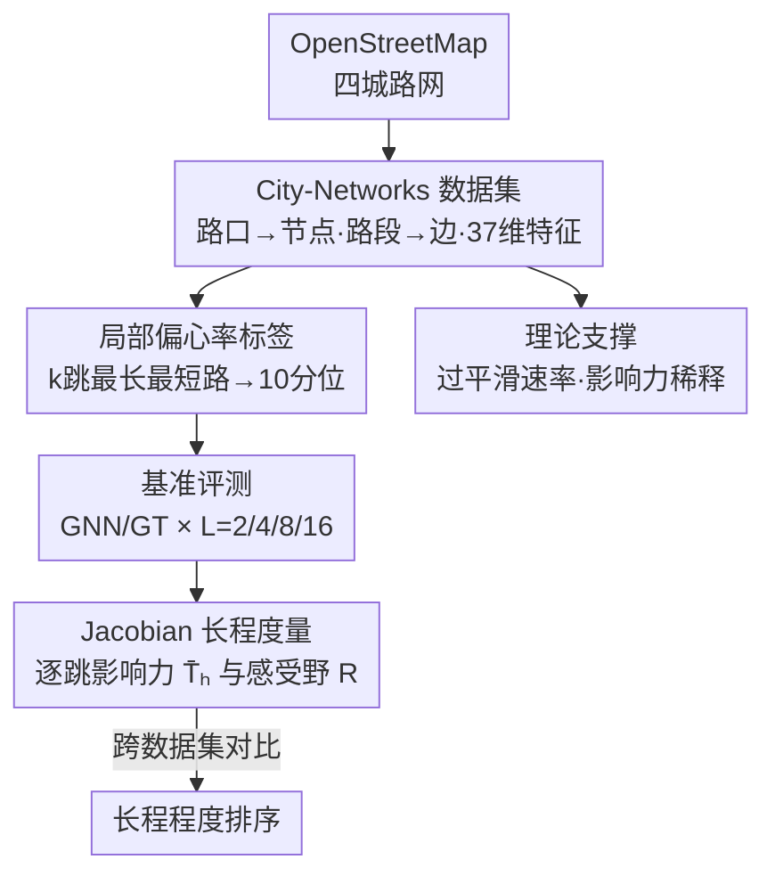

# Towards Quantifying Long-Range Interactions in Graph Machine Learning: A Large Graph Dataset and a Measurement

**会议**: ICLR 2026  
**OpenReview**: [https://openreview.net/forum?id=fylMiUmg39](https://openreview.net/forum?id=fylMiUmg39)  
**代码**: https://github.com/LeonResearch/City-Networks (有)  
**领域**: 图机器学习 / 图神经网络 / 数据集与基准  
**关键词**: 长程依赖、图神经网络、图 Transformer、过平滑、Jacobian 影响力

## 一句话总结
本文用四座真实城市的道路网络构建了一个百万级节点、直径上百的大图转导式数据集 City-Networks，并用「局部偏心率」标注出天然需要远距离信息的节点分类任务；在此基础上提出一个基于 Jacobian 的「逐跳影响力」度量，可以直接量化任意 GNN/GT 究竟用到了多远的邻居信息，从而把过去靠「全局注意力 vs 局部聚合」性能差来间接论证长程依赖的做法，换成可测、可比、有理论支撑的方案。

## 研究背景与动机
**领域现状**：图神经网络（尤其消息传递类 MPNN）每层只在一跳邻居间交换信息，要捕捉「远处节点才决定本节点标签」的长程依赖就得堆很多层。社区里通常通过对比「用全局注意力的图 Transformer（GT）」和「用局部聚合的经典 GNN」，把二者的性能差归因于长程依赖的存在。

**现有痛点**：这种间接论证不可靠。一方面，性能差很容易被超参数调优左右（Tönshoff 等已指出 LRGB 上的结论受调参影响很大），所谓「长程性」的判断变得含糊。另一方面，现有长程基准（LRGB 的超像素/分子图、各种合成 ring 图）几乎都是**归纳式（inductive）小图**，规模只有 $10$ 到 $10^2$ 个节点；而真正难的恰恰是把 GT 用到大图转导任务上——因为位置编码和全局注意力的计算复杂度在大图上会爆炸。社区里缺一个「大规模、真实拓扑、转导式」的长程基准。

**核心矛盾**：长程依赖本身在图学习里是个根本性的两难。增加 GNN 层数确实能把远处信息传过来，但同时引入过平滑（over-smoothing）、过挤压（over-squashing）、梯度消失；而 GT 靠二次复杂度的注意力规避深度问题，却在大图上撞上可扩展性墙。没有合适的数据集和度量，谁也说不清一个模型到底「用到了多远」。

**本文目标**：拆成三个子问题——(1) 如何以可控、可验证的方式在图上造出长程信号；(2) 如何把这种信号放到大规模真实网络上、检验模型的可扩展性；(3) 如何定义一个有原则的度量去量化、横向比较不同数据集的「长程程度」。

**切入角度**：作者注意到城市道路网络有一种和社交/引文网络截然不同的拓扑——网格状、低最大度数、超长直径（伦敦直径达 404），不存在「小世界效应」。这种拓扑天然适合设计「必须走很多跳才能算出来」的标签。

**核心 idea**：用真实城市路网造大图，用「k 跳局部偏心率」当标签制造**已知 ground-truth 范围**的长程任务；再用训练好模型的 Jacobian 算出「第 h 跳邻居对预测的影响力」，把长程依赖从「猜」变成「测」。

## 方法详解

### 整体框架
整篇工作可以看成一条「造数据 → 跑基准 → 量长程 → 给理论」的流水线。先从 OpenStreetMap 抓取四座城市（巴黎、上海、洛杉矶、伦敦）的全路网，把节点（路口）和边（路段）的原始属性整理成 37 维节点特征；接着用只看 k 跳邻居的「局部偏心率」$\hat\varepsilon_k(v)$ 给每个节点打标签，并分成 10 个分位数变成 10 类分类任务，由此得到一个**标签范围天然等于 k 跳**的转导式数据集。然后把经典 GNN（GCN/SAGE/GAT/GCNII…）和图 Transformer（GraphGPS/Exphormer/SGFormer）在不同层数 $L\in\{2,4,8,16\}$ 下跑一遍，观察「加深是否带来稳定提升」。再对训练好的模型计算逐跳 Jacobian 影响力 $\bar T_h$ 与影响力加权感受野尺寸 $R$，把「模型实际用到多远」量化出来并跨数据集对比。最后从谱分析（过平滑速率↔代数连通度/直径）和影响力稀释两个角度给出理论支撑。

### 关键设计

**1. City-Networks：用真实城市路网造「大且长」的转导式图**

针对「没有大规模真实长程基准」这个空白，作者直接拿四座城市的完整道路网络当图。节点是路口、边是路段，先把边特征（路长、限速、道路类型等）按入射边平均后拼接到节点上，得到「路口周边平均限速 / 附近是否多住宅路」这类 37 维节点特征；图取最大连通分量并视为无向，只保留连通性。最终数据集规模从巴黎的 11.4 万节点到伦敦的 56.9 万节点，直径从 121 到 404——远超 Cora（直径 19）、ogbn-arxiv（25）、PascalVOC-SP（28）等常用图。关键在于这种拓扑的**统计特性和社交/引文网络完全不同**：平均度只有 $2.7\!\sim\!3.2$、聚类系数低到 $0.03\!\sim\!0.04$、没有 hub 节点带来的小世界捷径。正是这种「网格状、稀疏、长直径」让长程信号「跑得远而不被抄近路」，也为后面的理论分析（大直径抑制过平滑）埋下伏笔。

**2. 局部偏心率标签：造出范围已知、可调、必须用拓扑+特征才能解的长程任务**

光有大图还不够，标签得「天然需要远处信息」才行。作者选了一个有现实意义的任务——预测路口的「可达性」，它与网络科学里的节点偏心率 $\varepsilon(v)$（$v$ 到全图所有点的最大距离）直接相关。但直接用全局偏心率有两个毛病：其一长程程度不可控，且实践中城中心节点的偏心率几乎能被地理坐标单独猜出来，反而不需要远程信息；其二精确偏心率要算全对最短路，复杂度 $O(|V|^3)$，在百万节点图上根本算不动。于是作者定义只看 k 跳邻居 $N_k(v)$ 的**局部偏心率**：

$$\hat\varepsilon_k(v)=\max_{u\in N_k(v)}\rho_w(v,u),\qquad \rho_w(v,u)=\min_{\pi\in P(v,u)}\sum_{e\in\pi}w(e),$$

其中 $w(e)$ 取路段长度（仅此处用加权）。把所有节点的 $\hat\varepsilon_k(v)$ 分成 10 个分位数作为 10 类标签。这个设计妙在三点：算 $\hat\varepsilon_k$ 必须探到 k 跳，于是任务的**真值范围 = k**，可控可测；由于 k 和边权对模型都是未知的，模型必须把远处的结构信息和局部空间特征（坐标、道路类型、土地用途）结合起来才能推断，避免标签被单一因素（纯结构或纯特征）短路；同时它绕开了 $O(|V|^3)$ 的算力墙。作者在 8 到 32 之间扫描后定 $k=16$，在「足够长程」和「k 层模型能塞进常见 GPU」之间取平衡。

**3. 基于 Jacobian 的逐跳影响力度量：把「用到多远」直接测出来**

有了任务还要能量化模型实际用了多远，这正是过去靠性能差间接论证的薄弱处。作者借用节点对影响力分数 $I(v,u)=\sum_i\sum_j \big|\partial H^{(L)}_{vi}/\partial X_{uj}\big|$（输出对输入特征的 Jacobian 的 $\ell_1$ 聚合），度量节点 $v$ 的预测对节点 $u$ 输入的敏感度。在此基础上定义第 $h$ 跳的**平均总影响力**：

$$T_h(v)=I_{\text{sum}}(v,h)=\sum_{u:\rho(v,u)=h} I(v,u),\qquad \bar T_h=\frac1N\sum_v I_{\text{sum}}(v,h),$$

即把所有「恰好 $h$ 跳」的邻居影响力求和再对全图节点平均（$h=0$ 时就是节点自身特征对输出的影响）。再进一步定义**影响力加权感受野的平均尺寸**：

$$R=\frac1N\sum_{v\in V}\frac{\sum_{h\ge0} h\cdot T_h(v)}{\sum_{h\ge0} T_h(v)},$$

直观上 $R$ 就是「平均每单位影响力来自多远」——长程任务里远处节点贡献的影响占比更高，$R$ 就更大。这个度量是 generic 的：只要模型可微，无需改架构、不假设模型类别，对任何 GNN 或 GT 都能算。和并行工作 Bamberger 等只给聚合范围不同，本文强调用逐跳 $\bar T_h$ 当**依赖衰减的诊断工具**，能画出「影响力随跳数怎么掉」的曲线。

**4. 理论支撑：把数据集拓扑和度量选择都论证到位**

作者没把理论停在「实验好看」上，而是给数据集和度量各补了一块谱论证。数据集这边，从线性 GCN 的过平滑视角出发：无限层时图卷积会把所有节点特征塌缩成归一化邪接算子 $\tilde S_{\text{adj}}$ 最大特征向量的标量倍，原始特征信息完全丢失；过平滑的速率由次大正特征值 $\lambda_{N-1}$ 控制（它越大、塌缩越慢）。作者证明 Theorem 5.2 给出下界

$$\lambda_{N-1}(\tilde S_{\text{adj}})>\frac{2\sqrt{d_{\max}-1}}{d_{\max}}-\frac{2}{\text{diam}(G)}\Big(1+\frac{2\sqrt{d_{\max}-1}}{d_{\max}}\Big),$$

该下界随最大度 $d_{\max}$ 递减、随直径 $\text{diam}(G)$ 递增——也就是说**大直径、低度数的图更抗过平滑**，正好解释了为什么 City-Networks 上加深层数能持续涨点。度量这边，作者证明在网格状图里第 $h$ 跳的「壳层」节点数按 $|N_h(v)|\sim h^{D-1}$ 增长，于是如果用**均值**聚合影响力，单个强影响节点会被同壳层一堆无关节点稀释到 $0$（$I_{\text{mean}}\le I^*/(C_1 h^{D-1})\to0$）；而用**求和** $I_{\text{sum}}$ 则始终有下界 $I^*$。这从数学上论证了 $T_h$ 该用 sum 而非 mean，否则长程信号会被几何稀释掉。

## 实验关键数据

### 主实验
在四城上做转导式节点分类，训练/验证/测试划分 10%/10%/80%，对每个模型在 $L\in\{2,4,8,16\}$ 下评测，取 5 个随机种子的均值±标准差。核心现象是：**所有 baseline 在 City-Networks 上随层数 $L$ 从 2 增到 16 都稳定涨点**，说明浅模型即便充分训练也比不过深模型——长程信息的增益盖过了深度的副作用。作为对照，同样的模型在 Cora、ogbn-arxiv 上随 $L$ 增大反而掉点（任务是局部的 + 深度问题），在 Amazon-Ratings、PascalVOC-SP 上基本不变（相对短程）。

下表是 $L=16$ 时各模型在四城上的最优准确率（%），MLP（不看拓扑）远低于所有用图的模型，直接证明任务必须依赖图结构：

| 模型 | 类型 | Paris | Shanghai | Los Angeles | London |
|------|------|-------|----------|-------------|--------|
| MLP | 无图 | 25.5 | 28.4 | 24.1 | 27.9 |
| GCN | MPNN | 53.2 | 62.1 | 58.3 | 50.1 |
| GraphSAGE | MPNN | 54.6 | 68.3 | 61.4 | 55.4 |
| GAT | MPNN | 51.1 | 68.0 | 59.5 | 52.0 |
| ChebNet | MPNN | 54.1 | 66.5 | 61.4 | 54.7 |
| GraphGPS | GT | 52.1 | 63.0 | 59.8 | OOM |
| Exphormer | GT | 55.1 | 70.2 | 63.8 | 49.5 |
| SGFormer | GT | 52.0 | 64.1 | 60.1 | 48.3 |

值得注意的是 GraphGPS 在 56.9 万节点的伦敦图上直接 OOM（48GB GPU），印证了「GT 难扩展到大图」的痛点；而 GT 即便能跑，相对经典 GNN 也没有压倒性优势，说明长程性不能简单等同于「有没有全局注意力」。

### 长程度量验证
用 $L=16$ 的模型计算影响力加权感受野尺寸 $R$（越大代表用到的邻居越远），下表节选可见 City-Networks 上的 $R$ 在所有模型下都系统性高于 Cora/ogbn-arxiv/Amazon/PascalVOC：

| 模型 | Paris | Shanghai | London | Cora | ogbn-arxiv | PascalVOC |
|------|-------|----------|--------|------|-----------|-----------|
| GCN | 4.86 | 5.55 | 6.09 | 2.56 | 1.34 | 3.38 |
| GraphSAGE | 4.92 | 5.73 | 5.97 | 2.37 | 1.40 | 2.99 |
| GraphGPS | 8.18 | 7.88 | OOM | 2.65 | OOM | 7.14 |
| Exphormer | 5.71 | 7.06 | 7.90 | 2.84 | 2.80 | 1.42 |

进一步把 $\bar T_h$ 归一化为 $\bar T_h/\bar T_0$ 后画曲线：Cora/ogbn-arxiv 上影响力在远跳处**迅速衰减**，City-Networks 上衰减则明显慢得多，Amazon/PascalVOC 介于两者之间、影响力集中在前几跳。虽然 $R$ 和 $\bar T_h$ 都依赖具体模型，但跨数据集的**排序一致**：要在 City-Networks 上做好，模型必须利用更远的跳数。

### 关键发现
- 「加深就涨点」与「加深就掉点」在不同数据集上的反转，是判断任务是否长程的最直接信号；MLP 与图模型的巨大差距确认了任务真的依赖拓扑而非纯特征。
- $R$ 的跨数据集排序稳定地把 City-Networks 排在最长程一端，验证了这套 Jacobian 度量确实抓到了「用到多远」，且无需改模型架构。
- 度量本身依赖被测模型，模型偏差会带来对真值范围的有偏估计——这是作者明确承认的局限，逐跳曲线只能横向定性排序、不宜当成绝对真值。

## 亮点与洞察
- **把「长程性」从间接论证变成可直接测量**：过去用「GT vs GNN 性能差」来论证长程依赖，本文用 Jacobian 逐跳影响力直接量化，绕开了对调参极其敏感的间接推断，这是方法论上的实质进步。
- **标签设计自带 ground-truth 范围**：用局部偏心率 $\hat\varepsilon_k$ 把任务真值范围钉死在 k 跳，使得「模型该用多远」有了可对照的标准答案，这种「先定范围再造任务」的思路可迁移到其它需要可控难度的合成基准。
- **sum vs mean 的稀释证明很巧**：通过网格图壳层节点数 $\sim h^{D-1}$ 的几何增长，从数学上说明均值聚合会把长程信号稀释为零、必须用求和——这是一个容易被忽略却影响度量正确性的细节。
- **真实拓扑撑起理论**：大直径/低度数抑制过平滑的谱论证，把「为什么这个数据集上深模型反而更好」从经验观察提升到有界证明。

## 局限与展望
- 度量是模型相关的：影响力由训练好的模型 Jacobian 算出，模型本身的偏差会传导到对真值范围的估计上，不同模型给出的 $R$ 不能当绝对长程程度比较。
- Jacobian 类方法在大而稠密的图上计算开销大、且数值稳定性是已知难题（作者在附录承认）；本数据集恰好是稀疏图才得以可行，换成稠密图未必适用。
- 任务范围由人为设定的 $k=16$ 决定，虽可调但单一设置下只验证了一个长程档位；不同 $k$ 下模型行为的系统性研究仍待展开。
- 数据集目前只有四座城市、单一任务（可达性分位分类），任务多样性有限，是否能推广到其它真实大图长程任务有待检验。

## 相关工作与启发
- **vs LRGB（Dwivedi 等）**：LRGB 用超像素/分子小图（$10\!\sim\!10^2$ 节点）做归纳任务，靠 GT 与 GNN 性能差间接论证长程；本文做大规模真实路网（$10^5\!\sim\!10^6$ 节点）转导任务，且用 Jacobian 直接量化长程，避开了 LRGB 对超参极敏感、结论含糊的问题。
- **vs Bamberger 等（并行工作）**：两者都基于最短路定义影响力范围，本文的 $R$ 可看作其聚合度量的一个特例；区别在于本文进一步用逐跳 $\bar T_h$ 作为依赖衰减的诊断工具，能画出影响力随跳数的衰减曲线，而非只给一个聚合数。
- **vs 异配图基准（Amazon-Ratings 等）**：异配（连接节点属性不同）不等于长程，本文实验显示这些任务相对短程（$R$ 偏小、影响力集中在前几跳），说明「长程」是独立于同配/异配的另一维度。

## 评分
- 新颖性: ⭐⭐⭐⭐⭐ 首个大规模真实拓扑、转导式长程基准 + 通用 Jacobian 长程度量，方法论上把间接论证升级为可测
- 实验充分度: ⭐⭐⭐⭐ 覆盖 4 城、多种 GNN/GT、多层数与跨数据集对比，但任务单一、度量的模型依赖性限制了结论强度
- 写作质量: ⭐⭐⭐⭐⭐ 数据集设计、度量定义、理论论证三条线层层咬合，动机与权衡交代得很清楚
- 价值: ⭐⭐⭐⭐⭐ 给图长程依赖研究提供了可复用的大图基准、即插即用的度量和理论工具，已上线 PyTorch Geometric

<!-- RELATED:START -->

## 相关论文

- [\[ICLR 2026\] LRIM: a Physics-Based Benchmark for Provably Evaluating Long-Range Capabilities in Graph Learning](lrim_a_physics-based_benchmark_for_provably_evaluating_long-range_capabilities_i.md)
- [\[ICLR 2026\] Improving Long-Range Interactions in Graph Neural Simulators via Hamiltonian Dynamics](improving_long-range_interactions_in_graph_neural_simulators_via_hamiltonian_dyn.md)
- [\[ICML 2025\] On Measuring Long-Range Interactions in Graph Neural Networks](../../ICML2025/graph_learning/on_measuring_long-range_interactions_in_graph_neural_networks.md)
- [\[ICLR 2026\] Relatron: Automating Relational Machine Learning over Relational Databases](relatron_automating_relational_machine_learning_over_relational_databases.md)
- [\[ICLR 2026\] Learning from Historical Activations in Graph Neural Networks](learning_from_historical_activations_in_graph_neural_networks.md)

<!-- RELATED:END -->
