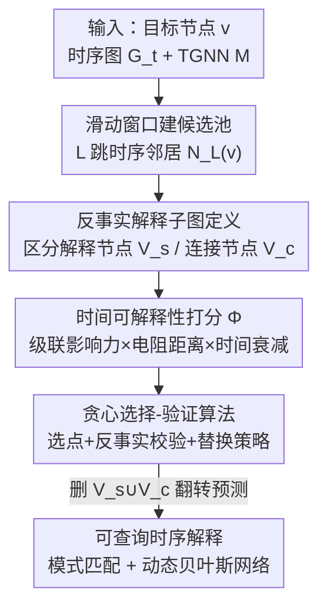

# Training-Free Counterfactual Explanation for Temporal Graph Model Inference

**会议**: ICLR 2026  
**OpenReview**: [https://openreview.net/forum?id=NqtYz3A8tQ](https://openreview.net/forum?id=NqtYz3A8tQ)  
**代码**: https://github.com/nicej1899/TemGX/  
**领域**: 图学习 / 时序图神经网络 / 可解释性  
**关键词**: 时序图神经网络, 反事实解释, 时间影响力, 子模优化, 可查询解释

## 一句话总结
TemGX 是一个免训练、模型无关、可查询的时序图神经网络（TGNN）解释框架——它把"哪段历史子图导致了 TGNN 的当前预测"形式化成滑动窗口下的反事实分析，用一套融合"级联影响力 + 时间有效电阻 + 时间衰减"的可解释性打分挑出真正影响决策的节点，并以贪心"选择-验证"算法在保证 $(1-1/e)$ 近似的前提下高效生成解释，在 fidelity 和速度上都明显超过现有 TGNN 解释器。

## 研究背景与动机

**领域现状**：TGNN 把 GNN 扩展到动态图，输入是一串图快照序列 $G_t=\{G_1,\dots,G_{t-1}\}$，编码器 $f_E$ 把每个时刻的节点编码成嵌入 $Z_{t-1}$，解码器 $f_D$ 再预测下一时刻 $Z_t$，用于交通预测、链路预测、金融交易异常检测等任务，效果很强。

**现有痛点**：但 TGNN 的决策埋在多层非线性变换和复杂时间机制里，是个"黑箱"。在金融反洗钱、安全审计这种需要"拿证据"的场景，光给一个"illicit"标签没用，执法者需要知道"是哪些历史交易导致它被判为非法"。已有的 TGNN 解释器要么只找重要节点特征（抓不住节点间复杂的时间依赖），要么按信息瓶颈采样高频 motif（会混入与决策无关、非反事实的结构），而且大多需要额外训练一个解释模型，还不支持用户对解释结果做交互式查询。

**核心矛盾**：好的时序解释需要同时满足三个互相牵扯的要求——(1) **反事实可验证**：去掉这段结构，TGNN 的预测真的会变；(2) **时间内聚**：能沿时间路径捕捉传播影响，而不是孤立看某个时刻；(3) **可查询**：用户能像查数据库一样检索"这段解释里有没有 Peel Chain 模式、何时演变成 Spindle"。现有方法没有一个把三者统一起来。

**本文目标**：给定一个 TGNN 输出 $M(G_t,v)$，找出一组**反事实、内聚的时序子图**作为实例级解释，再把这些结构在时间上汇总成可统计推断、可模式匹配查询的对象。

**切入角度**：作者有一个关键观察——**不是所有能在时间上到达目标节点 $v$ 的节点都在"影响"它的决策**。真正负责 TGNN 输出的节点，可能"来自过去"、在结构上离 $v$ 很远。所以解释结构里应当区分两类节点：真正改变决策的"解释节点" $V_s$，和只是把它们在时间上连到 $v$ 的"连接节点" $V_c$。

**核心 idea**：把解释任务写成"在滑动窗口里、在大小预算 $k$ 下，最大化一套时间影响力打分 $\Phi$"的约束优化问题；用免训练的贪心选择-验证算法直接在预训练好的 TGNN 上搜索，每选一个节点都做一次反事实验证，保证留下的都是"删了会翻转预测"的结构。

## 方法详解

### 整体框架

TemGX 要解决的是：给定目标节点 $v_t$、它的 TGNN 输出，以及一个时长约束 $\delta$，输出一组时序解释子图 $\eta$，使得"删掉这些子图里的解释节点，TGNN 对 $v_t$ 的预测就会改变"。整体是一条"建候选池 → 算时间影响力 → 反事实验证选点 → 组装可查询解释"的流水线，全程不训练任何解释模型，只反复调用预训练 TGNN 做前向推断。

具体地：先对每个长度 $\delta$ 的滑动窗口，从目标节点 $v$ 出发取它的 $L$ 跳时序邻居作为候选池 $C$；对每个候选算一个时间影响力分 $\Phi$，这个分由三部分耦合而成——独立级联模型给出的删边影响力 $\inf$、刻画嵌入传播的时间有效电阻距离 $\mathrm{trd}$、以及让近期交互更重要的时间衰减 $e^{-\lambda(t-t')}$；然后贪心地按 $\Phi$ 从高到低选节点，每选一个就调 Verify 检查它是否真的保持反事实性质，选满预算 $k$ 后用替换策略继续优化；最后由解释节点 $V_s$ 加上保证时间连通的连接节点 $V_c$ 诱导出子图 $G_\epsilon$，并暴露成可做时序模式匹配 / 动态贝叶斯网络推断的查询接口。

### 关键设计

**1. 反事实时序解释子图：把"什么是解释"形式化，并区分解释节点与连接节点**

针对"已有方法混入无关结构、抓不住时间依赖"的痛点，作者先给"解释"一个可验证的定义。一条时序边 $e=(u,v,t)$ 是 $M(G_t,v)$ 的**反事实边**，当且仅当把它删掉后预测变了：$M(G_t\setminus\{e\},v)\neq M(G_t,v)$；只要某节点有一条邻接边是反事实边，它就是**解释节点**。一个解释子图 $G_\epsilon=(V_\epsilon,E_\epsilon)$ 由窗口 $\delta$ 诱导，其节点 $V_\epsilon=V_s\cup V_c$：$V_s$ 是解释节点集合，$V_c$ 是**时间连接节点**——它们本身未必改变决策，但保证每个 $v_s\in V_s$ 都能在 $\delta$ 时长内沿时序路径"到达"目标 $v$（即 $v_s\ \delta\text{-reaches}\ v$）。这个区分是核心洞察：真正负责输出的节点可能在结构上离 $v$ 很远、来自过去，强行只要"邻接重要节点"会漏掉它们，而把"是否改变决策"和"是否在时间上连通"两件事拆开，既保住反事实性又保住时间内聚性。论文还证明：验证一组节点是否构成合格解释是 PTIME（构造 Verify 过程，算影响力分并调 TGNN 看反事实集是否为空），但生成最优解释整体是 **NP-hard**（从最大覆盖问题归约）。

**2. 时间可解释性度量 Φ：用"级联影响力 × 电阻距离 × 时间衰减"刻画动态影响**

要从候选里挑出真正影响决策的节点，需要一个契合 TGNN 推断过程的打分。作者扩展独立级联模型（ICM）：一条边在时刻 $t$ 对 $v$ 的时间影响力定义为删边前后输出概率之差的绝对值 $p_e=\big|\Pr(G_t,v)-\Pr(G_t\setminus\{e\},v)\big|$（取绝对值是因为删边既可能升高也可能降低概率）；解释节点 $v_s$ 对 $v$ 的影响力沿所有 $\delta$-可达时序路径递归聚合：

$$\inf(v_s,v,t)=1-\prod_{\substack{(v',v,t')\in E\\ t-\delta\le t'\le t}}\big(1-p(v',v,t')\cdot \inf(v_s,v',t')\big)$$

光有传播概率还不够，TGNN 推断本质是嵌入沿时序路径的扩散，作者引入**时间有效电阻距离**来近似这一过程：$\mathrm{trd}(v_s,v,t')=(Z_{t'}(v_s)-Z_t(v))^T L_{t'}^I (Z_{t'}(v_s)-Z_t(v))$，其中 $L_{t'}^I$ 是快照拉普拉斯矩阵的伪逆，可用低多项式时间近似。最终把两者与时间衰减相乘聚合成节点集的时间可解释性：

$$\Phi(V_s,v)=\frac{1}{\delta}\sum_{v_s\in V_s}\sum_{t'=t-\delta+1}^{t-1}\inf(v_s,v,t')\,g(\mathrm{trd}(v_s,v,t'))\,e^{-\lambda(t-t')}$$

这里 $g$ 是电阻距离的单调递减函数，$\lambda>0$ 控制指数时间衰减。设计巧在**乘法形式**：电阻距离是"调制"而非"抵消"影响力，时间衰减 $e^{-\lambda(t-t')}$ 让近期交互权重更大。由于 $\inf,g\in[0,1]$、衰减项 $\in(0,1]$，可证 $\Phi\in[0,1]$，$\Phi$ 越大表示在 $\delta$-可达约束下影响越强、越新。衰减参数 $\lambda$ 自适应于时间粒度。

**3. 贪心选择-验证算法：免训练、一遍扫描、(1-1/e) 近似保证**

NP-hard 的生成问题需要高效近似算法。TemGX 走"选择-验证"流程：从 $V_s=\{v\}$ 和候选池 $C=N_L(v)$ 起步，每轮选出 $\Phi$ 最大的候选 $v_s^*$，更新其余候选的影响力分，再调 Verify 确认它保持反事实性质——通过就并入 $V_s$，失败就从 $C$ 移除。当 $|V_s|$ 达到预算 $k$ 时触发**替换策略**：在 $V_s$ 里找一个节点 $v_s^{*'}$，若用候选 $v_s^*$ 替换它能带来更大的边际影响增益 $\Phi(V_s\setminus\{v_s^{*'}\}\cup\{v_s^*\})$ 且通过验证，就执行交换。作者证明该算法是 $(1-1/e)$-近似：通过把问题归约成时序边流上、带基数约束的在线单调子模最大化，并证明贪心替换策略对单调子模函数 $\Phi$ 给出 $(1-1/e)$ 保证。复杂度上它是"一遍扫描"算法——滑动窗口前移时，每个节点及其时序邻居只访问处理一次，最多 $t$ 轮选点、每轮 $O(|N_L(v)|\cdot T_I)$（$T_I$ 是 TGNN 多项式时间推断代价）。整个过程不训练任何解释模型，直接在预训练 TGNN 上搜索，这正是"training-free"的来源。

**4. 可查询时序解释：把解释子图变成能模式匹配、能统计推断的对象**

实例级子图只回答"这一次为什么"，作者进一步让解释可被反复查询。一方面，TemGX 暴露**时序模式匹配**接口：用户给一个时序模式 $Q_\eta=(V_Q,E_Q,\sigma,\delta')$（带节点标签、边的时间序约束 $\sigma$、时长 $\delta'$），系统在解释子图集合 $\eta$ 里找满足标签匹配且 $\delta'$-可达的映射，可用成熟的时序模式匹配算法高效处理——例如直接检索"这段历史里是否出现 Peel Chain / Spindle 洗钱模式、何时从一种演变到另一种"。另一方面，TemGX 还能学一个**动态贝叶斯网络**做统计推断，把多个实例级结构在时间上汇总成全局模型，理解演变的时间依赖。这一设计把"一次性的归因"升级成"可持续审计、可问答"的解释资产，是与现有 TGNN 解释器最大的差异点之一。

## 实验关键数据

### 主实验

在 6 个真实时序图上评测：链路预测用 Wiki、UCIM（backbone：TGN、TGAT）；时空回归用 METR-LA、PEMS-BAY（backbone：STGCN、DCRNN）；分类用 Multihost、Elliptic++。对比 TempME、TGNNExplainer、CoDy（链路预测）与 TGVex（回归）。指标为 Fidelity、AUFSC（fidelity-sparsity 曲线下面积）和单条解释生成时间。其中 TempME / TGNNExplainer 是学习型、需额外训练，CoDy 与 TemGX 同为免训练搜索。

| 数据集 / Backbone | 指标 | TemGX | CoDy | TempME | TGNNExplainer |
|------|------|------|------|------|------|
| UCIM / TGN | Fidelity | **0.468** | 0.394 | 0.219 | 0.072 |
| UCIM / TGN | AUFSC | **0.475** | 0.361 | 0.218 | 0.073 |
| UCIM / TGAT | Fidelity | **0.415** | 0.382 | 0.156 | 0.187 |
| Wiki / TGN | Fidelity | **0.262** | 0.219 | 0.128 | 0.098 |
| Wiki / TGAT | AUFSC | **0.340** | 0.184 | 0.155 | 0.117 |

TemGX 在所有数据集 / 模型上 fidelity 和 AUFSC 都最优：UCIM+TGN 上 fidelity 比 TempME 高 113%、比 TGNNExplainer 高 6.5×，比强基线 CoDy 还高 19%；AUFSC 比 CoDy 高 31%。回归任务上比 TGVex 在 PEMS-BAY(DCRNN) 上 AUFSC 高约 65%。作者归因于时间影响力分 + 反事实性质能抓住快照法漏掉的动态依赖。

### 效率对比

由于没有独立消融表，这里以"效率 / 训练开销"作为第二张分析表（单位：秒，单条解释生成时间）。

| 数据集 / Backbone | TemGX | CoDy | TempME | TGNNExplainer |
|------|------|------|------|------|
| UCIM / TGN | **8.2** | 35.0 | 88.4 | 68.5 |
| Wiki / TGN | **12.5** | 125.0 | 72.8 | 65.2 |
| METR-LA / STGCN | **6.1** | — | — | — (TGVex 6.8) |

TemGX 链路预测最慢也只要 12.5s、回归约 6.7s；在稠密图 Wiki 上比 TGNNExplainer/TempME 快 5.2×–6.4×、比 CoDy 快达 10×；UCIM 上比 TempME 快 10.8×。关键在于它一遍扫描、免训练，而 TGNNExplainer/TempME 解释前还要先训练一个 navigator / motif scorer。

### 关键发现
- **反事实 + 时间影响力是涨点主因**：纯基于快照模式挖掘的 TGVex 因忽略 $\delta$-可达和动态时间依赖而表现差；TempME 靠 motif 在部分链路预测场景有竞争力，但只抓高频 motif、漏掉低频但高影响的时序模式。
- **同为免训练，TemGX 全面压过 CoDy**：在相同 training-free 设定下，TemGX 的 AUFSC/Fidelity 大幅高于 CoDy（基于蒙特卡洛树搜索），且速度快得多，效率差距在实践中进一步拉大。
- **稠密图上优势最明显**：TGNNExplainer 的边中心蒙特卡洛搜索在 Wiki 这种稠密图上难以定位累积时间影响强的节点，而 TemGX 的节点级影响力聚合恰好擅长此处。
- **案例研究验证可查询性**：在比特币交易图上，TemGX 为"非法"节点 140 给出三个解释子图，恰好对齐已知 Spindle / Peel Chain 洗钱模式并展示其演变；在 Multihost 网络安全数据上准确覆盖了三阶段攻击的关键 host1–host2 路径。

## 亮点与洞察
- **"解释节点 vs 连接节点"的拆分**是全文最 aha 的设计：把"是否改变决策"和"是否时间连通"两件事解耦，既保反事实又保内聚，直接解释了为什么它能抓住"来自过去、结构上远离"的影响源——这个思路可迁移到任何需要"远程归因"的图解释任务。
- **乘法式的影响力聚合**很巧：让电阻距离去"调制"而非"抵消"级联影响、再叠时间衰减，使打分天然落在 $[0,1]$ 且偏好近期强影响，避免了加性打分里各项量纲打架。
- **把 NP-hard 解释生成归约成在线子模最大化**，从而用贪心 + 替换策略拿到 $(1-1/e)$ 保证，是把组合优化理论用在可解释性上的漂亮一手。
- **免训练 + 可查询**两点合起来很实用：不用为每个 TGNN 训练专门解释器，且解释结果能被反复做模式匹配 / 贝叶斯推断，适合金融、安全这种需要持续审计的落地场景。

## 局限与展望
- **作者承认的局限**：当前框架面向单图 / 单输出的滑动窗口分析，未来要扩展到大规模分布式网络和实时图流的解释。
- **缺独立消融**：论文主要给出端到端对比和效率，没有把 $\inf$、$\mathrm{trd}$、时间衰减三项分别拆开做消融，难以量化各项各自贡献多少；$g$ 函数的具体形式和 $\lambda$ 的敏感性也讲得较少（⚠️ 细节以原文 Appendix 为准）。
- **反事实验证依赖反复调用 TGNN 前向**：虽然单条推断是多项式时间，但在超大图或长窗口下 Verify 次数会累积，实时性可能受限。
- **改进思路**：可以把 Verify 的反事实校验做近似 / 批量化以进一步提速；或把 $\delta$、$k$、$\lambda$ 做成可学习 / 自适应，减少人工设定。

## 相关工作与启发
- **vs TGNNExplainer**：它预训练一个 navigator 推断事件重要性、再用蒙特卡洛树搜索找最小化交叉熵的事件；TemGX 免训练、按节点级时间影响力聚合，在稠密图上更稳更快，且只生成边的它无法像 TemGX 那样区分解释 / 连接节点。
- **vs TempME**：它按信息瓶颈采样并打分时序 motif；TemGX 用反事实性质而非 motif 频率，能抓低频高影响结构，且不需训练 motif scorer。
- **vs CoDy**：两者都免训练且都做反事实（删事件翻转预测），但 CoDy 用蒙特卡洛树搜索找最小事件子集，TemGX 用带 $(1-1/e)$ 保证的子模贪心 + 时间可解释性打分，fidelity 和速度都明显更优。
- **vs TGVex / 静态 GNN 解释**：把静态解释器套在滑动窗口快照上会忽略 $\delta$-可达和动态依赖，TemGX 的时间影响力度量正是为动态图量身定制。

## 评分
- 新颖性: ⭐⭐⭐⭐⭐ 首个把反事实分析、实例级时间可解释性、连续查询统一进一个免训练 TGNN 解释框架，"解释节点 / 连接节点"拆分是真洞察。
- 实验充分度: ⭐⭐⭐⭐ 6 数据集 4 backbone、fidelity/AUFSC/效率三维对比 + 两个真实案例研究，但缺对三项打分的独立消融。
- 写作质量: ⭐⭐⭐⭐ 形式化定义、复杂度与近似比证明都给到，逻辑清晰；部分度量细节（$g$、$\lambda$ 选择）压在附录。
- 价值: ⭐⭐⭐⭐⭐ 免训练 + 可查询 + 有理论保证，金融反洗钱、网络安全审计等需要"拿证据"的场景直接可用。

<!-- RELATED:START -->

## 相关论文

- [\[ICML 2026\] GILT: An LLM-Free, Tuning-Free Graph Foundational Model for In-Context Learning](../../ICML2026/graph_learning/gilt_an_llm-free_tuning-free_graph_foundational_model_for_in-context_learning.md)
- [\[ICLR 2026\] Revisiting Node Affinity Prediction in Temporal Graphs](revisting_node_affinity_prediction_in_temporal_graphs.md)
- [\[CVPR 2025\] Knowledge Bridger: Towards Training-Free Missing Modality Completion](../../CVPR2025/graph_learning/knowledge_bridger_towards_training-free_missing_modality_completion.md)
- [\[ICML 2025\] CoDy: Counterfactual Explainers for Dynamic Graphs](../../ICML2025/graph_learning/cody_counterfactual_explainers_for_dynamic_graphs.md)
- [\[ICLR 2026\] PRISM: Partial-label Relational Inference with Spatial and Spectral Cues](prism_partial-label_relational_inference_with_spatial_and_spectral_cues.md)

<!-- RELATED:END -->
