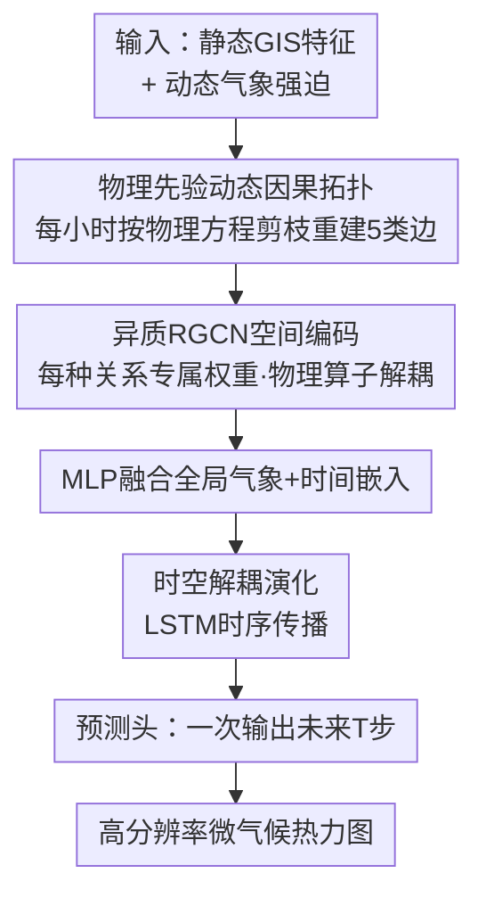

# UrbanGraph: Physics-Informed Spatio-Temporal Dynamic Heterogeneous Graphs for Urban Microclimate Prediction

**会议**: ICLR 2026  
**OpenReview**: [https://openreview.net/forum?id=ckjNF94cIi](https://openreview.net/forum?id=ckjNF94cIi)  
**代码**: 无  
**领域**: 图学习 / 时空预测 / 物理先验  
**关键词**: 动态异质图, 物理先验归纳偏置, 城市微气候, 因果剪枝, RGCN

## 一句话总结
UrbanGraph 把太阳遮挡、植被蒸散、对流扩散这些**已知物理规律直接编码进图的拓扑结构**——每小时按物理方程重建一张稀疏的动态异质图，再用 RGCN+LSTM 解耦空间与时序，在城市微气候预测上达到 SOTA（R²=0.8542），同时相比隐式动态图基线 LRGCN 把 FLOPs 砍掉 73.8%、训练加速 21%。

## 研究背景与动机

**领域现状**：城市微气候（如体感温度 UTCI、平均辐射温度 MRT、风速等）的预测直接关系到建筑能耗和公共健康。传统做法是 CFD、ENVI-met 这类高保真物理数值模拟，精度高但计算开销巨大，无法做大规模、长时序的预测。于是数据驱动方法成为方向：网格类的 CNN，以及把城市实体建成图的 GNN。

**现有痛点**：网格模型（CNN）受限于欧氏假设，难以刻画城市中**非局部、各向异性**的物理依赖——比如阴影会"跳过"中间空间投到远处、风是有方向的定向流动，这些用卷积要堆很深才能近似。GNN 虽然天然适合建模空间依赖，但已有 GNN 方法有两个硬伤：(1) **缺乏物理一致性**，它们用统一的消息传递机制，无法区分"植被蒸散降温"和"建筑遮挡降温"这类本质不同的物理过程；(2) **无法建模时变性**，大多依赖一张固定的图结构，而真实物理过程（如阴影范围）是随太阳位置实时变化的。

**核心矛盾**：城市里任意一点的物理状态，是由众多异质实体（建筑、植被、地面）通过**时变物理过程**共同决定的。要把这种连续物理场的因果关系，准确地抽象成离散的图表示，既不能丢掉关键因果信息（标准图拓扑做不到），又要让网络能区分不同物理算子、还得保持计算高效——可解释性与效率之间存在张力。

**本文目标**：设计一种**基于结构的归纳偏置（structure-based inductive bias）**，能把多个独立、时变的物理过程显式编码进图结构，并配一套能解耦这些过程的神经架构。

**切入角度**：作者的关键观察是——与其让模型从数据里**隐式**学一张潜在图（implicit latent graph learning，容易学到噪声里的虚假相关），不如把**物理第一性原理**直接翻译成一张随时间重构的因果拓扑。物理方程本身就是最强的先验，用它当"硬约束"来裁剪图的连边，能直接把模型的感受野对齐到真实的物理影响域。

**核心 idea**：把时变物理因果（遮挡、对流等）显式写进图的拓扑，每小时做一次"因果剪枝"重建稀疏图，让结构本身携带物理知识；再用异质消息传递给每种物理关系分配专属参数实现"物理算子解耦"。

## 方法详解

### 整体框架
UrbanGraph 要解决的是：给定城市的静态 GIS 特征（建筑高度、树高、地表类型）和动态气象强迫（太阳辐射/位置、温度、湿度、风速风向），预测未来若干小时的高分辨率微气候场。它把城市离散成网格，每个网格是一个节点 $v$，整个环境表示成一串随时间变化的动态异质图序列 $\{G_t\}$，其中 $G_t=(V, E_t, R)$：节点集 $V$ 和关系类型集 $R$ 是静态的，唯有边集 $E_t$ 每小时按当时的物理条件重建。

整条管线分两大块：(1) **物理先验图表示**——按物理方程把当前小时的五类边连出来，得到一张稀疏且物理一致的拓扑；(2) **UrbanGraph 架构**——三层 RGCN 做空间编码（每种关系一套权重，实现物理算子解耦），融合全局气象/时间特征后送进 LSTM 做时序演化，最后由预测头一次性输出未来 $T_{pred}$ 步。下图给出从输入到微气候热力图的完整流向。

### 关键设计

**1. 物理先验驱动的动态因果拓扑：把时变物理规律剪进图结构**

这是全文的灵魂，针对的是"GNN 缺乏物理一致性 + 无法建模时变性"两个痛点。作者不让模型自己去学图，而是每小时根据物理方程**显式重建**边集 $E_t$，连出五类边、分静态与动态两大类。三类**动态边**每小时更新：

- **遮挡边（SHADING）**：编码定向辐射阻挡。从遮挡物节点 $v_i$（建筑/树，高 $h_{obj}$）向地面节点 $v_j$ 连一条有向边，条件是欧氏距离 $d(v_i,v_j)$ 不超过阴影长度、且角度落在阴影宽度内。阴影长度由太阳高度角实时算出 $L_{shadow,t}=h_{obj}/\tan(\theta_{elev,t})$，阴影主方向 $\varphi_{shadow,t}=(\varphi_{azimuth,t}+180°)\bmod 360°$。太阳一动，这些边就跟着重连，严格保证"被遮区域依赖于遮挡物"的因果。
- **植被蒸散边（VEGETATION EVAPOTRANSPIRATION）**：建模随太阳变化的局部生物物理降温。从树节点向半径 $R_{activity,t}$ 内的节点连边，半径随当前辐射缩放 $R_{activity,t}=R_{base}\cdot \mathrm{clip}(I_t/1000, 0.5, 1.2)$——辐射越强、蒸散影响范围越大。
- **对流扩散边（CONVECTIVE DIFFUSION）**：编码流体各向异性。把"邻近"重定义为风调制的**有效距离** $d_{eff}(v_i,v_j)=d(v_i,v_j)/\alpha_{wind,t}\le R_{local}$，其中风调制因子 $\alpha_{wind,t}=1.0+\lambda_{wind}\cdot\cos(\Delta\theta_{wind})\cdot(v_{wind,t}/v_{max})$ 顺风方向拉伸、逆风压缩连接距离，近似平流过程。

两类**静态边**作为补充与冗余：**语义相似边**把每个节点连到归一化特征空间里的 k 近邻，捕捉非局部的功能相似（如同材质），充当备用信息通路；**内部连续边**让大块连续物体（建筑群、植被斑块）的内部节点连到八邻域，建模物体内部的热惯性传导。

这一整套相当于把物理第一性原理当成**硬结构约束**，强行把模型感受野对齐真实影响域，缩小假设空间、避免从噪声里学虚假相关。而且因为图被剪得稀疏，FLOPs 和训练时间都比隐式动态图大幅下降——这正是后面 73.8% FLOPs 削减的来源。

**2. 异质消息传递作为物理算子近似器：给每种物理过程一套专属参数**

针对"统一消息传递无法区分不同物理过程"的痛点。作者用三层 RGCN（关系图卷积）做空间编码，其单层更新为

$$h_i^{(l+1)}=\sigma\Big(\sum_{r\in R}\sum_{j\in N_i^r}\frac{1}{c_{i,r}}W_r^{(l)}h_j^{(l)}+W_0^{(l)}h_i^{(l)}\Big)$$

关键在于**每种关系 $r$（遮挡 / 蒸散 / 对流 / 语义 / 连续）都有独立的可学习权重矩阵 $W_r$**。这意味着 RGCN 在结构上就把不同物理过程**解耦**成各自的子过程去近似，而不是用一套参数硬拟合所有物理定律。作者称之为"物理算子近似器"。这样做还顺带缓解了同质 GNN 常见的过平滑——因为不同关系的信息不会被搅成一锅粥。消融实验里去掉异质性（退化成同质 GCN），R² 从 0.8629 掉到约 0.8347，印证了"同质图里单一参数拟合多种物理定律会造成因果纠缠"。

**3. 时空解耦的演化架构：RGCN 管空间、LSTM 管时序**

针对"如何处理既变节点特征又变拓扑的复杂图序列"的痛点。UrbanGraph 没用 LRGCN 那种把时空算子耦合在一起的设计，而是**把空间交互与时序演化解耦**：在每个时刻先由 RGCN 把动态拓扑解析成物理一致的空间表示 $h_{v,t}^{RGCN}$，再把它与全局气象嵌入 $e_t^{env}$、时间嵌入 $e_t^{time}$ 拼接、过融合 MLP 得到 $x_{v,t}^{LSTM}=\mathrm{MLP}_{fusion}([h_{v,t}^{RGCN}\oplus e_t^{env}\oplus e_t^{time}])$，最后送进 LSTM 建模时序。初始隐状态由首帧空间特征投影而来 $h_0=\mathrm{MLP}_{h_0}(h_{v,t_0}^{RGCN})$，预测头一次性解码出全部未来 $T_{pred}$ 步。

作者特意选 LSTM 而非 Attention，理由是物理传输过程（如热扩散）具有**马尔可夫性**——未来状态从紧邻的过去连续演化而来，递归结构更契合；而因为动态拓扑已经在 RGCN 里被显式解析过，LSTM 拿到的是物理一致的状态表示，优化复杂度更低。消融里把动态图换成静态图（所有时刻共用一张图），R² 从 0.8629 掉到 0.8057，说明时变因果剪枝（主动剔除如移动阴影这类已不相关的连边）确实在降低优化难度。

## 实验关键数据

### 主实验
数据集是用 ENVI-met 高保真模拟生成的高分辨率城市微气候数据（水平 4m、垂直 3m 网格），396 个城市街区按 70%/20%/10% 划分，**测试集是空间上完全没见过的街区**以严格检验泛化。主评 UTCI，但六个变量全预测。对比四类基线：网格类（CGAN-LSTM、Pix2Pix+PINN）、静态时空 GNN（GCN/GINE-LSTM、STGCN、ASTGCN）、生成式图（GAE/GGAN-LSTM）、动态图（LRGCN、RGCN-GRU/Transformer）。

| 模型 | 类别 | FLOPs | Avg R² ↑ | Avg RMSE ↓ | 训练(epoch/s) |
|------|------|-------|----------|------------|---------------|
| Pix2Pix+PINN | 网格(软物理损失) | $1.10\times10^{10}$ | 0.8320 | 1.1485 | 17.5 |
| GAE-LSTM | 生成式图 | $1.05\times10^{10}$ | 0.8494 | 1.0687 | 36.7 |
| LRGCN | 动态图(隐式递归) | $3.49\times10^{10}$ | 0.8422 | 1.0889 | 31.1 |
| **UrbanGraph** | **本文** | $\mathbf{9.13\times10^{9}}$ | **0.8542** | **1.0535** | **24.5** |

关键对比：相比最强动态图基线 LRGCN，UrbanGraph 在精度更高的同时把 FLOPs 砍掉 73.8%（$9.13\times10^9$ vs $3.49\times10^{10}$）、训练快 21%（24.5s vs 31.1s）——验证了显式因果剪枝优于隐式递归。超过 Pix2Pix+PINN（软物理损失约束）则说明**硬结构约束的物理一致性优于软损失约束**。逐小时误差分析显示本文在整个 12 小时预测窗内 RMSE 始终最低，午后（14:00、17:00）气候波动剧烈时鲁棒性尤为突出。

### 消融实验

| 配置 | R² | MSE | 说明 |
|------|----|----|------|
| Base（完整） | 0.8629 | 1.0976 | 异质 + 动态 |
| Homo（去异质，退化同质 GCN） | 0.8336 | 1.4275 | 单参数拟合多物理定律→因果纠缠 |
| Static（去动态，全时刻共用一张图） | 0.8057 | 1.6678 | 无法剔除已不相关的连边 |

### 关键发现
- **动态机制贡献最大**：去掉动态图 R² 掉约 7.1%（0.8629→0.8057），远超去异质的约 3.5%（0.8629→0.8347，⚠️ 表中 Homo 记为 0.8336，与正文 0.8347 略有出入，以原文为准）。说明"按物理实时重构拓扑"比"区分关系类型"更关键。
- **跨物理域泛化**：作者另建了受 Navier-Stokes 方程支配的 UWF3D 城市风场数据集，UrbanGraph 在 u 分量上 R²>0.88，从标量热扩散迁移到矢量流场依旧坚挺，证明这套显式拓扑编码范式不局限于微气候。
- **真实尺度验证**：NUS 校园微尺度标定 r>0.73、新加坡全城部署 r=0.842，说明物理参数化在异质城市形态下仍有效。

## 亮点与洞察
- **"把物理方程当成图结构生成器"是最巧的一笔**：别人要么把物理塞进 loss（软约束、训练贵），要么塞进输入特征（observational bias），UrbanGraph 把物理做成**动态拓扑的硬约束**——既保证一致性又不付 PDE 求解器的代价，还顺带把图剪稀疏省了算力。一举多得。
- **稀疏即高效**：因果剪枝不只是为了物理正确，它直接带来 73.8% 的 FLOPs 削减——这把"可解释性"和"效率"这对常见 trade-off 变成了双赢，很反直觉。
- **可迁移性强**：只要研究对象由**已知物理方程**支配（风场、污染扩散、交通流……），"把第一性原理编码成时变图拓扑 + 异质 RGCN 解耦算子"这套范式都能套用，从微气候到 Navier-Stokes 风场的迁移就是证据。

## 局限与展望
- **依赖已知物理方程**：方法的前提是物理过程可被显式写成连边规则（阴影长度、有效距离等），对那些机理不清或难以离散化的过程并不适用，泛化边界就是"physics-informed"这个词本身。
- **拓扑构建是启发式 + 预设参数**：阈值（$R_{base}$、$\lambda_{wind}$、$v_{max}$、阴影角宽等）来自城市物理文献的经验上界，靠静态语义边做冗余来兜底启发式的不完美，但这些超参的敏感性与跨城市可移植性仍需更系统验证。
- **数据来自模拟**：训练数据由 ENVI-met 生成而非真实观测，虽有 NUS/新加坡的真实标定，但模拟器自身的偏差是否会被模型继承，值得进一步考察。
- **改进思路**：可考虑让连边阈值从硬预设变成可学习/可微的软门控，在保持物理先验的同时减少手工调参；或把因果剪枝规则做成可由数据微调的"物理 + 学习"混合拓扑。

## 相关工作与启发
- **vs Pix2Pix+PINN（软物理约束）**：PINN 把 PDE 残差放进损失函数当软约束，训练开销大且约束是"软"的。本文把物理做成图结构的硬约束，精度更高（0.8542 vs 0.8320）且无 PDE 求解器开销——硬结构约束 > 软损失约束。
- **vs LRGCN（隐式动态图）**：LRGCN 用递归方式隐式学习图演化，把图变化当成数据驱动的观测现象。本文则用物理第一性原理在每个时刻**显式重构**拓扑（因果剪枝），精度更高的同时 FLOPs 省 73.8%、训练快 21%。
- **vs 同质 GNN（GCN-LSTM 等）**：同质图用统一消息传递，无法区分遮挡与对流等异质物理过程。本文用 RGCN 给每种关系专属权重实现物理算子解耦，消融显示去掉异质性 R² 掉约 3.5%。
- **vs 生成式图（GAE/GGAN-LSTM）**：它们从隐空间学潜在图结构，易学到虚假相关。本文用物理硬约束直接给出拓扑，缩小假设空间、提升数据效率。

## 评分
- 新颖性: ⭐⭐⭐⭐⭐ "把时变物理方程编码成动态图拓扑做硬约束"这一结构归纳偏置思路新颖且自洽
- 实验充分度: ⭐⭐⭐⭐ 四类基线 + 双消融 + 跨物理域(UWF3D) + 真实尺度标定，较扎实；但代码未开源、部分细节在附录
- 写作质量: ⭐⭐⭐⭐ 动机与方法逻辑清晰，五类边定义明确；个别消融数字正文与表格略有出入
- 价值: ⭐⭐⭐⭐⭐ 在精度与效率上同时 SOTA，且范式可迁移到一切由已知物理方程支配的城市时空预测

<!-- RELATED:START -->

## 相关论文

- [\[ICLR 2026\] Revisiting Node Affinity Prediction in Temporal Graphs](revisting_node_affinity_prediction_in_temporal_graphs.md)
- [\[ICML 2026\] Physics-Informed Coarsening for Multigrid Graph Neural Surrogates](../../ICML2026/graph_learning/physics-informed_coarsening_for_multigrid_graph_neural_surrogates.md)
- [\[ICLR 2026\] Inductive Reasoning for Temporal Knowledge Graphs with Emerging Entities](inductive_reasoning_for_temporal_knowledge_graphs_with_emerging_entities.md)
- [\[ICLR 2026\] TGM: A Modular and Efficient Library for Machine Learning on Temporal Graphs](tgm_a_modular_and_efficient_library_for_machine_learning_on_temporal_graphs.md)
- [\[ICLR 2026\] Beyond Entity Correlations: Disentangling Event Causal Puzzles in Temporal Knowledge Graphs](beyond_entity_correlations_disentangling_event_causal_puzzles_in_temporal_knowle.md)

<!-- RELATED:END -->
