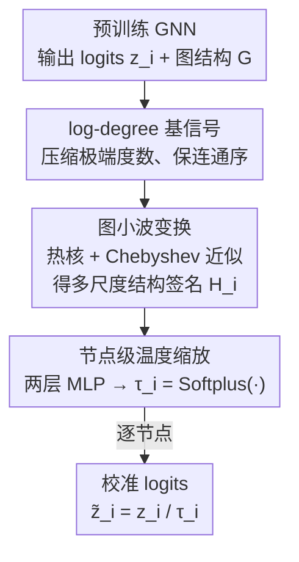

# WATS: Wavelet-Aware Temperature Scaling for Reliable Graph Neural Networks

**会议**: ICLR 2026  
**OpenReview**: [https://openreview.net/forum?id=ZrrVEMyQeU](https://openreview.net/forum?id=ZrrVEMyQeU)  
**代码**: https://github.com/lxy1134/WATS  
**领域**: 图学习 / GNN 置信度校准  
**关键词**: 图神经网络, 置信度校准, 温度缩放, 图小波, 后处理校准

## 一句话总结
WATS 是一个针对节点分类的后处理（post-hoc）校准框架，用可调尺度的热核图小波特征为每个节点预测一个专属温度去缩放 logits，从而在不重训模型、不依赖邻居 logits 的前提下让 GNN 的置信度对齐真实准确率，在 9 个数据集上把 ECE 最多降低 41.2%。

## 研究背景与动机

**领域现状**：GNN 在节点分类等任务上预测很准，但它输出的置信度（confidence）常常和真实的正确率对不上。和 CNN/Transformer 普遍「过自信」相反，GNN 表现出系统性的「欠自信」——预测置信度持续低于实际准确率。要在医疗诊断、金融风控这类高风险场景部署，就必须先把置信度校准好。

**现有痛点**：现有的图感知校准方法（CaGCN、GATS、GETS、SimCalib 等）几乎都依赖**浅层的一跳邻域统计**（邻居的预测置信度、邻居 logits、度数）或不透明的隐层 embedding。这些信号只覆盖了节点的局部信息：GATS 把注意力、邻居温度聚合、邻居置信度平均全限制在 1-hop；CaGCN/GETS 名义上堆两层 GCN 够到 2-hop，但每层本质仍是 1-hop 聚合。结果是它们无法自适应地捕捉更远距离的结构依赖，在低度数、低同质性（low-homophily）区域校准尤其不可靠。

**核心矛盾**：论文用一个简化的一跳置信度估计器 $\hat{c}_i \approx \frac{1}{d_i+1}\sum_{j\in\{i\}\cup N(i)} y_j$ 推出每个节点的校准偏差 $\text{bias}_i \approx \big| y_i - \frac{1}{d_i+1}\sum_{j\in N(i)} y_j \big|$。当 $d_i=2$、邻居标签是 $[0,1]$ 时，均值恒为 $1/3$，与真实标签无关——一跳信号此时完全无信息量。更关键的是 Wang et al. (2022) 观察到的悖论：GNN 越深，准确率越低、置信度反而越高，说明误校准来自**跨越多个尺度的结构效应**，而非单纯的局部邻居信息。

**本文目标**：构建一个校准方法，要求：(i) 灵活吸收邻域信息，且不依赖额外的显式预训练状态（如邻居 logits）；(ii) 在不同图域上都保持高校准性能，同时轻量、后处理；(iii) 在**节点级**做温度缩放，让校正基于多跳结构信息。

**切入角度**：作者引入**图小波**（graph wavelet），因为它能用尺度参数原则性地在多个尺度上捕捉结构信息。与以往把图小波用于重建/平滑节点特征的工作不同，WATS 不重建特征，而是把**小波系数当作结构签名**来指示节点的不确定性。

**核心 idea**：用热核图小波特征替代一跳统计，为每个节点学一个专属温度去做后处理温度缩放，使置信度在细粒度、节点级别对齐正确率。

## 方法详解

### 整体框架
WATS 解决的是「半监督节点分类下 GNN 置信度误校准」问题，整体是一个挂在任意预训练 GNN 之后的轻量插件：输入是已训练好的 GNN 输出的 logits $z_i$ 加上图结构 $G=(V,E)$，输出是校准后的 logits $\tilde z_i = z_i / \tau_i$。中间分两路——结构路用图小波变换从图拓扑里提取每个节点的多尺度结构签名 $H_i$，温度路用一个两层 MLP 把这个结构签名映射成节点专属温度 $\tau_i$。整个过程不动 GNN 的任何参数，只在验证集上用交叉熵学温度预测器。

关键在于：温度 $\tau_i$ 不再来自邻居的置信度或 logits（那些是「不稳定信号」），而是完全来自**纯结构**的小波特征——它只看图怎么连，不看预测对不对，因而稳定、几何感知。

### 关键设计

**1. 用 log-degree 作基信号驱动小波变换：把「连通性」喂进结构签名**

小波变换需要一个初始输入信号 $X_0$。WATS 选择**节点的对数度数（log-degree）**作为 $X_0$。动机很具体：度数编码了一个节点的连通性和它在消息传递里聚合信息的潜力，且前人（GETS）已证明度数与误校准相关；但原始度数分布往往严重右偏（少数超高度数节点），直接用会让回归器学得不稳。取对数能压缩极端度数、同时保留连通性的相对排序，从而稳定训练并提升从低度数到高度数区域的泛化。消融（Table 2）也证实：log-degree 在大多数数据集上 ECE 最优或并列最优，明显优于原始 degree（如 Cora-Full 从 3.77 降到 1.94），只有 Pubmed 上单位矩阵略胜。

**2. 热核图小波变换 + Chebyshev 多项式近似：捕捉可调尺度的多跳结构**

这是 WATS 的核心。传统图傅里叶变换要对归一化拉普拉斯 $L_{sym}=I-D^{-1/2}AD^{-1/2}$ 做特征分解，代价 $O(N^3)$、滤波器无顶点域局部性。WATS 改用图小波：用热核尺度函数 $g(s\lambda)=e^{-s\lambda}$ 构造小波算子 $\Psi_s = U\,\text{diag}(g(s\lambda_1),\dots,g(s\lambda_N))\,U^\top$，其中 $s>0$ 控制扩散范围。为避开特征分解，用 $K$ 阶 Chebyshev 多项式近似：先把拉普拉斯重缩放为 $\hat L = \frac{2}{\lambda_{max}}L_{sym}-I$，再用递推 $T_0=X_0,\ T_1=\hat L X_0,\ T_k=2\hat L T_{k-1}-T_{k-2}$ 得到

$$S = \tfrac{1}{2}c_0 T_0 + \sum_{k=1}^{K} c_k T_k$$

其中 $c_k$ 是训练前可算的常数。最后做行级 $\ell_1$ 归一化 $H_i = S_i / \|S_i\|_1$ 得到每个节点 $K+1$ 维的小波特征。这里 $K$ 决定最大感受野（考虑多少跳），$s$ 控制扩散程度：小 $s$ 抑制扩散、突出局部结构，大 $s$ 允许更广扩散、整合长程上下文。正是这种「尺度可调」让 WATS 能适应不同密度和拓扑的图——这是一跳方法根本做不到的，也是它与用小波做特征重建/平滑的工作的本质区别（WATS 把系数当结构签名，不重建特征）。

**3. 节点级温度缩放：用结构签名预测专属温度去缩放 logits**

拿到小波特征矩阵 $H\in\mathbb{R}^{N\times(K+1)}$ 后，用一个**两层 MLP** 捕捉非线性关系并预测每个节点的温度：$\tau_i = \text{Softplus}(\text{MLP}(H_i))$，Softplus 保证温度为正。校准后的 logits 为 $\tilde z_i = z_i / \tau_i$。温度预测器在验证集上用缩放后 logits 的交叉熵损失训练。相比经典 TS 对所有节点用同一个全局温度，WATS 给每个节点单独的温度，且这个温度来自纯结构信号而非可能带噪的邻居 logits——这让它能在结构稀疏区域（低度数节点欠自信最严重处）做更精细的校正，又因为不依赖邻居注意力而避免了 GATS 在大图上的显存爆炸。

### 损失函数 / 训练策略
后处理设定：先正常训练 GNN（GCN / GAT / GCNII），冻结其参数；按 20% 训练 / 10% 验证+校准 / 70% 测试划分节点。小波特征可预计算并作为静态输入复用。只训练温度预测器（两层 MLP），目标是验证集上缩放后 logits 的交叉熵。ECE 用 10 个 bin 计算，公式为 $\text{ECE}=\sum_{m=1}^{M}\frac{|B_m|}{|N|}\big|\text{Acc}(B_m)-\text{Conf}(B_m)\big|$。

## 实验关键数据

### 主实验
9 个数据集（Cora / Citeseer / Pubmed / Cora-Full / Computers / Photo / Reddit / Roman / Tolokers）× 3 个骨干（GCN / GAT / GCNII），指标为 ECE（↓，10 次运行均值），节选典型结果：

| 数据集 / 骨干 | Uncalib | TS | GATS | GETS | WATS |
|---------------|---------|------|------|------|------|
| Cora / GCN | 22.44 | 2.25 | 2.98 | 2.96 | **1.82** |
| Cora-Full / GAT | 37.21 | 2.50 | 2.70 | 2.16 | **1.11** |
| Computers / GCN | 5.94 | 3.88 | 3.34 | 2.94 | **1.20** |
| Reddit / GAT | 4.79 | 3.29 | oom | 1.10 | **0.54** |
| Roman / GCNII | 21.00 | 3.61 | 4.38 | 4.34 | **2.92** |
| Pubmed / GCN | 14.33 | 2.55 | 2.30 | 2.34 | **1.12** |

WATS 在多数配置下取得最低 ECE，相比图专用基线最多降低 41.2% ECE、平均把校准方差降低 15.84%。GATS 因为对邻域做全注意力，在 Reddit 这种大图上 OOM，而 WATS 仍高效运行。即使在 Photo / Computers 这种基模型本身已较好校准的情况下，WATS 仍能进一步降低误差。

### 消融实验

| 配置 | 关键发现 | 说明 |
|------|---------|------|
| 基信号: log-degree vs degree vs identity | log-degree 多数数据集最优 | 如 Cora-Full ECE 3.77(degree)→1.94(log-degree) |
| 结构特征: 图小波 vs 度数/中介中心性/聚类系数及组合 | 图小波几乎全面胜出 | Citeseer 小波 2.11 vs 度数 3.53 vs 三者组合 7.12 |
| 超参 $k\in\{2,3,4\}$, $s\in\{0.4..4.0\}$ | 中等取值最稳，默认 $k=3,s=2.0$ | 高同质图 $s>1.2$ 后曲线平坦、鲁棒 |

### 关键发现
- **小波特征不可替代**：度数、中介中心性、聚类系数等传统结构描述子单用或组合都泛化差（Citeseer 上组合反而 ECE 高达 7+），说明孤立结构指标不够，必须用图小波这种多尺度信号。
- **低度数区域受益最大**：可靠性图与度数分箱分析显示，欠自信在低度数节点最严重，WATS 校准后跨所有度数区间都对齐对角线并降低方差。
- **超参鲁棒**：在最优点附近一大片区域 WATS 都超过此前 SOTA，$k\in\{3,4\}$ 配中等 $s$ 即稳定取得更低 ECE；高同质图（Cora/Computers）几乎不敏感，异质图对 $k,s$ 更敏感（小 $k$ 漏中尺度结构，大 $k$ 放大噪声传播）。
- **复杂度低**：总时间复杂度 $O(k|E|+|V|kh)$，优于 CaGCN 的 $O(|E|F+|V|F^2)$ 和 GATS 的 $O(|E|FH+|V|F^2)$，$F$ 大或多头注意力时优势明显，且小波变换可预计算复用。

## 亮点与洞察
- **把校准问题转译成结构信号问题**：最「啊哈」的一点是 WATS 不再问「邻居预测得怎样」，而问「这个节点在图里长什么样」——用纯拓扑的小波签名预测温度，天然绕开了邻居 logits 的噪声与不稳定，这个解耦很干净。
- **尺度可调即感受野可调**：$s$ 和 $K$ 一起控制扩散范围，等价于给每个节点一个连续可调的多跳感受野，这正好对上「误校准来自多尺度结构效应」的诊断，思路与机制高度自洽。
- **可迁移的 trick**：「用 Chebyshev 近似的热核小波系数作为轻量结构特征」可以迁移到任何需要多尺度结构描述子又怕特征分解开销的图任务（如异常检测、节点重要性估计），不止校准。

## 局限与展望
- 作者承认范围**仅限节点分类**，且 WATS 依赖「拓扑信号与模型 logits 相关」这一假设；当相关性弱或虚假时，小波导出的温度可能反而损害校准。
- 自己发现的局限：温度只由结构决定，完全忽略了节点特征本身携带的不确定性信息，在特征噪声主导误校准的场景可能力不从心；评测全部用 ECE（10 bins），未涉及其他校准指标或下游决策影响。
- 改进思路：作者计划聚合「结构相似但空间遥远」的节点引入全局结构上下文（需正则化防噪声），并把图小波推广到边预测、动态图等更多图学习任务。

## 相关工作与启发
- **vs GATS**：GATS 对一跳邻域做注意力聚合得到节点温度，受限于 1-hop 且大图上显存爆炸（Reddit OOM）；WATS 用多尺度小波结构签名，既够多跳又轻量。
- **vs CaGCN / GETS**：CaGCN 用 GCN 预测温度、GETS 用度数+特征+logits 的稀疏 MoE，本质仍是堆叠 1-hop 聚合且依赖（可能不稳的）置信度信号；WATS 只用纯结构小波，稳定且可调尺度。
- **vs 经典 TS**：TS 全局一个温度，无法刻画图上节点间的结构异质性；WATS 是其节点级、结构感知的推广。

## 评分
- 新颖性: ⭐⭐⭐⭐ 把图小波作为结构签名引入后处理校准，角度新颖、动机扎实。
- 实验充分度: ⭐⭐⭐⭐ 9 数据集 × 3 骨干 + 基信号/特征/超参三组消融 + 复杂度分析，较完整。
- 写作质量: ⭐⭐⭐ 思路清晰，但公式排版与个别表述有瑕疵（如部分符号定义略乱）。
- 价值: ⭐⭐⭐⭐ 轻量、即插即用、对大图友好，对安全关键场景部署有实用价值。

<!-- RELATED:START -->

## 相关论文

- [\[ICLR 2026\] Learning from Historical Activations in Graph Neural Networks](learning_from_historical_activations_in_graph_neural_networks.md)
- [\[ICLR 2026\] Are We Measuring Oversmoothing in Graph Neural Networks Correctly?](are_we_measuring_oversmoothing_in_graph_neural_networks_correctly.md)
- [\[ICLR 2026\] Structure-Aware Graph Hypernetworks for Neural Program Synthesis](structure-aware_graph_hypernetworks_for_neural_program_synthesis.md)
- [\[ICLR 2026\] Cooperative Sheaf Neural Networks](cooperative_sheaf_neural_networks.md)
- [\[ICLR 2026\] Scaling Knowledge Graph Construction through Synthetic Data Generation and Distillation](scaling_knowledge_graph_construction_through_synthetic_data_generation_and_disti.md)

<!-- RELATED:END -->
