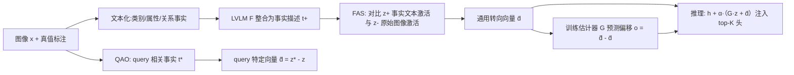

# AFTER: 用自适应事实引导的激活编辑缓解 LVLM 的物体幻觉

**会议**: ICLR 2026  
**OpenReview**: [https://openreview.net/forum?id=ggycXmhrrG](https://openreview.net/forum?id=ggycXmhrrG)  
**代码**: [https://github.com/wytbwytb/AFTER](https://github.com/wytbwytb/AFTER)  
**领域**: 多模态 / LVLM 幻觉缓解  
**关键词**: 物体幻觉, 激活编辑, 语言偏见, 视觉-文本引导, 推理时干预  

## 一句话总结
AFTER 把图像的真值标注「文本化」成类别/属性/关系三类事实，用事实描述与原始图像的激活差构造正向的视觉-文本编辑方向，再训练一个轻量估计器为每个 query 估计偏移量，从而自适应地把 LVLM 的幻觉激活推向事实语义，在 AMBER 上最多降低 16.3% 的幻觉。

## 研究背景与动机
**领域现状**：大型视觉-语言模型（LVLM）在跨模态任务上进步显著，但普遍受困于物体幻觉——生成的回答与图像中真实物体不符。研究普遍认为根因是「语言偏见」：模型过度依赖预训练得到的文本先验，而忽视外部视觉输入，导致类别幻觉（把背包认成滑雪板）、属性幻觉（手套常成对出现的先验导致数错数量）、关系幻觉（"man wearing helmet" 的高频先验压过 "man holding helmet" 的事实）三类错误。

**现有痛点**：缓解幻觉的方法分两路——训练类（重训或加新目标，开销大）和推理时类（对比解码或多轮纠错，多次推理成本高）。近期兴起的「推理时激活编辑」用精心设计的编辑向量直接干预内部激活，开销最低、可迁移性好。但 VTI、ICT 等代表方法都是**通过破坏视觉语义**（向图像注入噪声/模糊）来构造"不可信"激活，再与原始激活对比得到编辑方向。

**核心矛盾**：这类做法只在视觉空间里"做减法"，**完全忽略了事实文本语义提供的正向引导**——图像真值标注里蕴含的事实无法被文本化用来构造正向的转向方向，于是难以显式弥合视觉-文本鸿沟、显式抵消语言偏见。此外，不同 query 强调的物体有各自的视觉-文本关联与特定偏移，而现有方法对所有 query 用**同一个**平均编辑向量，无法适配。

**本文目标**：构造一个既能利用事实文本作正向引导、又能为每个 query 自适应调整的激活编辑方法。

**核心 idea**：**事实文本化 + query 自适应偏移**——把真值标注转成类别/属性/关系事实文本，用"事实文本激活 − 原始图像激活"得到正向通用转向向量（FAS）；再训练一个 query 感知估计器在通用向量基础上预测偏移，做到逐 query 精细编辑（QAO）。

## 方法详解

### 整体框架
AFTER 由 **FAS（事实增强激活转向）** 和 **QAO（query 自适应偏移优化）** 两个串联模块组成。FAS 先把图像真值标注文本化成事实描述，构造"事实文本-原始图像"的可信/不可信样本对，对比激活差得到一个通用且正向的视觉-文本编辑向量；QAO 再训练一个轻量估计器，为每个具体 query 在通用向量上叠加偏移，实现 query 级别的精细转向。推理时把"通用向量 + query 偏移"叠加到受语言偏见影响最大的 top-K 注意力头上。

### 关键设计

**1. 真值标注文本化：把三类事实做成可信语义** —— FAS 的前提是要拿到「正向、可信」的文本语义来对抗语言偏见，而最可靠的正向信号就藏在图像的真值标注里。作者从 COCO 训练集采样图像，把每张图的标注分别转成三类事实：类别事实 $T_c$ 直接整合所有物体的类别标签；属性事实 $T_a$ 聚焦颜色（按分割区域内像素占比最高的颜色标定）、形状（从分割多边形 $S$ 近似轮廓、用顶点数和角度一致性判断方/圆）、数量（按类别标签统计某类出现频次）；关系事实 $T_r$ 则从边界框 $B$ 的中心方向偏移和 IoU 邻近度估计左/右/重叠等空间关系。三类事实分别针对前述三类幻觉，从根上提供"反先验"的事实锚点。

**2. FAS：用事实-原图激活差建模正向转向方向** —— 拿到离散事实后，先用一个现成 LVLM $F$（仅作整合、不引入新信息，且不参与被编辑模型 $M$ 的推理，保证公平）把事实串成连贯的事实描述 $t^+ = F(I_{fst}; (x, [T_c, T_a, T_r]))$。然后**把原始视觉信息当作不可信语义、把事实文本描述当作可信语义**，对每张图配 $n$ 个可能诱发幻觉的问题 $q_i$，构造可信-不可信样本对 $\langle(t^+, q_i),(x, q_i)\rangle$，输入 $M$ 得到激活对 $\langle z_i^+, z_i\rangle$。通用编辑向量就是二者在整个图像集上的平均差：

$$\bar{d} = \frac{1}{n\cdot|X|}\sum_X \sum_{i=1}^{n}(z_i^+ - z_i)$$

这与以往"靠退化图像得不可信激活"形成对比——FAS 是在视觉空间里引入文本事实做正向引导，从而显式弥合视觉-文本鸿沟。

**3. QAO：为每个 query 估计专属偏移** —— 同一张图，不同问题强调的视觉语义不同，统一向量 $\bar d$ 不够精细。QAO 先针对 query 生成更细的描述：对问题 $q_i$ 中提到的每个物体类别 $q_{i,j}$，若它在图中（$q_{i,j}\in T_c$）就用指令 $I_{qst}$ 从 $t^+$ 抽取该物体相关子描述，否则显式写明"图中没有 $q_{i,j}$"，拼成 query 聚焦的描述 $t_i^*$。由此构造 query 专属激活对 $\langle z_i^*, z_i\rangle$，得到该 query 的最优编辑向量 $\tilde d_i = z_i^* - z_i$，并定义期望偏移 $o_i = \tilde d_i - \bar d$。然后训练一个单层 MLP 估计器 $G$，用 MSE 损失让它从 query 聚焦激活 $z_i$ 预测出偏移：

$$\mathcal{L}_G = \frac{1}{n\cdot|X|}\sum_X \sum_{i=1}^{n}\lVert G(z_i) - o_i\rVert^2$$

$G$ 极其轻量（单层 MLP，不微调 LVLM），训练高效。

**4. 自适应编辑注入** —— 推理时把"估计偏移 + 通用向量"叠加到受语言偏见影响最大（向量幅度最大）的 top-K 个注意力头上：

$$h^{l+1} = h^l + \mathrm{Concat}_{k=1}^{H}\big(z^{l,k} + \alpha\cdot[G(z^{l,k}) + \bar d]\big)\cdot W_o^l$$

其中 $\alpha$ 是编辑强度。这样 LVLM 会把更多注意力分配给编辑后的视觉信息，从而抑制幻觉。默认 $K=64$、$\alpha=7$。

## 实验关键数据

### 主实验表格（POPE / MME / AMBER，三个 LVLM）

| 模型 | 方法 | POPE ACC↑ | POPE F1↑ | AMBER CHAIR↓ | AMBER Hal↓ |
|------|------|-----------|----------|--------------|-------------|
| LLaVA-v1.5 | Baseline | 80.1 | 82.3 | 6.9 | 31.6 |
| LLaVA-v1.5 | VTI | 83.2 | 83.4 | 5.1 | 23.7 |
| LLaVA-v1.5 | ICT | 83.7 | 83.7 | 5.4 | 26.6 |
| LLaVA-v1.5 | **Ours** | **85.7** | **85.6** | **4.5** | **20.5** |
| InstructBLIP | Baseline | 80.3 | 82.0 | 7.4 | 35.4 |
| InstructBLIP | **Ours** | **83.5** | **84.2** | **5.2** | **25.1** |
| Shikra | Baseline | 78.9 | 80.3 | 10.9 | 49.5 |
| Shikra | VTI | 80.6 | 81.3 | 7.5 | 38.5 |
| Shikra | **Ours** | **82.5** | **82.5** | **6.9** | **33.2** |

POPE 平均提升准确率 4.1%、F1 2.6%，超过 SOTA 编辑法 ICT 1.3%/0.9%；AMBER 上 Shikra 幻觉降低 16.3%，比次优 VTI 还高 5.3%。

### 消融实验（w/o QAO）

| 模型 | 设置 | POPE ACC↑ | AMBER Hal↓ |
|------|------|-----------|-------------|
| LLaVA-v1.5 | w/o QAO | 83.8 | 22.3 |
| LLaVA-v1.5 | Ours（全） | 85.7 | 20.5 |
| Shikra | w/o QAO | 81.1 | 38.2 |
| Shikra | Ours（全） | 82.5 | 33.2 |

仅用 FAS 的通用向量（w/o QAO）已显著超过基线，但加上 QAO 的 query 自适应编辑后还能进一步提升，证明逐 query 偏移对精确消除 query 特定语言偏见是必要的。

### 关键发现
- **泛化性强**：把 COCO 判别式问题学到的向量直接迁移到 GQA（不同类别空间）和生成式 AMBER（COCO→GQA、Dis→Gen），仍有明显提升，说明 AFTER 学的是通用的语言偏见消除而非过拟合某数据集。
- **不损害通用能力**：在 MME 的感知/认知各维度上平均增分 130.7，Cover 指标几乎不变，说明缓解幻觉的同时还增强了通用视觉能力。

## 亮点与洞察
- **把"正向引导"引入激活编辑**：以往激活编辑都在做"破坏视觉→对比"的减法，AFTER 第一次系统地用真值事实文本作为正向锚点，思路上从"远离不可信"转为"靠近可信事实"，更直接地对症语言偏见。
- **真值标注的结构化文本化**：颜色看像素占比、形状看分割多边形几何、关系看 bbox IoU 与方向，这套把标注转成自然语言事实的流程本身就有复用价值。
- **query 自适应做得很轻**：偏移估计器只是单层 MLP、不动 LVLM，却把"统一向量"升级成"逐 query 向量"，性价比高。

## 局限与展望
- **依赖密集真值标注**：整套事实文本化建立在 COCO 这种有类别/分割/bbox 标注的数据上，迁移到无标注或弱标注域时如何造事实是个问题。
- **需要一个外部 LVLM F 来整合事实**：虽然作者论证 F 不参与推理、保证公平，但构造阶段仍引入了对额外大模型的依赖。
- **Cover 略降的权衡**：抑制幻觉与回答全面性之间存在 trade-off，论文承认 Cover 有微小变化，强压幻觉时可能牺牲覆盖度。
- 编辑强度 $\alpha$、头数 $K$ 等超参对结果敏感，跨模型的最优配置仍需调。

## 相关工作与启发
- **激活编辑路线**：VTI（对比多张扰动图的稳定视觉特征）、ICT（全局加噪+局部模糊造不可信语义）是直接对标对象；AFTER 的差异在于引入事实文本正向引导和 query 自适应。
- **其它推理时方法**：VCD、OPERA 等对比解码/迭代纠错路线，开销更高；训练类如 HACL 需重训。AFTER 站在"低开销 + 可迁移"的激活编辑一侧。
- **启发**：事实文本化的思路可以推广到其它"先验压过证据"的场景（如 VQA 的语言先验、文档理解中的版式先验）；而"通用向量 + 轻量估计器预测偏移"是把静态干预升级为输入自适应干预的通用范式，值得在表示工程（representation engineering）类工作里借鉴。

## 评分
- **新颖性**: ⭐⭐⭐⭐ —— 在激活编辑里首次系统引入事实文本正向引导，并用轻量估计器做 query 自适应偏移，方法组合清晰且对症语言偏见。
- **实验充分度**: ⭐⭐⭐⭐ —— 覆盖 POPE/MME/AMBER 三类基准、三个 LVLM、判别+生成两类任务，含消融与跨分布泛化，较完整。
- **写作质量**: ⭐⭐⭐⭐ —— 动机-矛盾-方法的逻辑链条顺畅，图 2 框架与公式对应清楚。
- **价值**: ⭐⭐⭐⭐ —— 低开销、可迁移、不损通用能力，对实际部署 LVLM 抑制幻觉有直接参考价值，唯一约束是对密集真值标注的依赖。

<!-- RELATED:START -->

## 相关论文

- [\[ICLR 2026\] SHIELD: Suppressing Hallucinations In LVLM Encoders via Bias and Vulnerability Defense](shield_suppressing_hallucinations_in_lvlm_encoders_via_bias_and_vulnerability_de.md)
- [\[ECCV 2024\] BEAF: Observing BEfore-AFter Changes to Evaluate Hallucination in Vision-Language Models](../../ECCV2024/hallucination/beaf_observing_beforeafter_changes_to_evaluate_hallucination.md)
- [\[CVPR 2026\] Cross-Modal Attention Calibration for LVLM Hallucination Mitigation](../../CVPR2026/hallucination/cross-modal_attention_calibration_for_lvlm_hallucination_mitigation.md)
- [\[CVPR 2026\] AdaIAT: Adaptively Increasing Attention to Generated Text to Alleviate Hallucinations in LVLM](../../CVPR2026/hallucination/adaiat_adaptively_increasing_attention_to_generated_text_to_alleviate_hallucinat.md)
- [\[CVPR 2026\] Same Attention, Different Truths: Put Logit-Lens over Visual Attention to Detect and Mitigate LVLM Object Hallucination](../../CVPR2026/hallucination/same_attention_different_truths_put_logit-lens_over_visual_attention_to_detect_a.md)

<!-- RELATED:END -->
