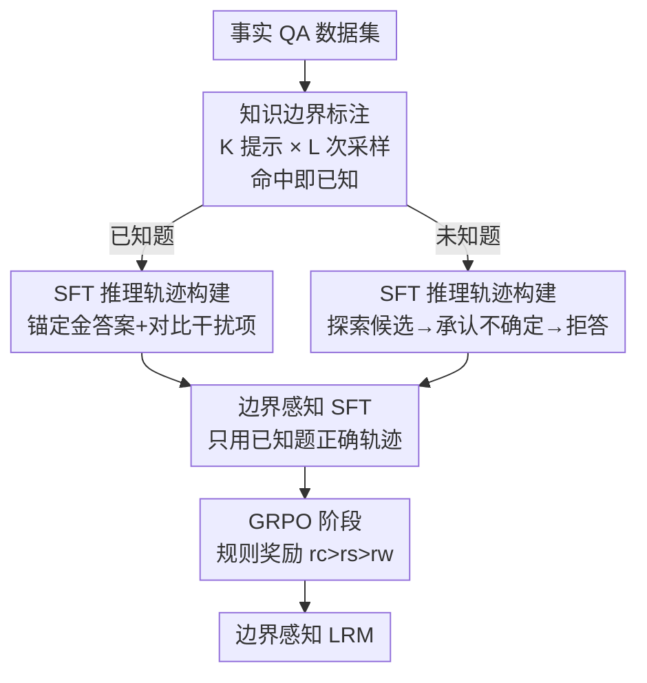

# BARREL: Boundary-Aware Reasoning for Factual and Reliable LRMs

**会议**: ICLR 2026  
**OpenReview**: [https://openreview.net/forum?id=lUEedsO2RO](https://openreview.net/forum?id=lUEedsO2RO)  
**代码**: 待确认  
**领域**: LLM推理 / 事实可靠性 / 幻觉缓解  
**关键词**: 大推理模型、知识边界、不确定性拒答、过度思考、GRPO

## 一句话总结
针对大推理模型（LRM）在事实问答上"宁可编也不说不知道"的毛病，本文先定位出两种由"事实性过度思考"引发的病态推理模式，再用"知识边界标注 → 边界感知 SFT → 基于可靠性奖励的 GRPO"三段式训练框架 BARREL，把 DeepSeek-R1-Distill-Llama-8B 的可靠性从 39.33% 拉到 61.48%，且准确率不降反升。

## 研究背景与动机
**领域现状**：以 OpenAI o1、DeepSeek-R1 为代表的大推理模型（Large Reasoning Models, LRMs）通过长链思维（Long-CoT）在数学、逻辑这类专门推理任务上表现亮眼。人们自然期待这种"会反复思考"的能力也能让模型在事实性任务上更靠谱。

**现有痛点**：事实表现并没有跟着涨，反而退步——faithfulness 幻觉率在上升，事实任务上的有用性在下降。具体表现为两点：一是 LRM 极少承认"我不知道"，碰到不掌握的知识也照样一本正经地编一个自信的答案；二是回答不一致，同一类问题这里答错、那里又答对。论文把事实可靠性拆成"knowing（模型是否真的掌握这块知识）"和"telling（能否把掌握的知识正确说出来）"两个层面，而当前 LRM 在这两件事上都做不好。

**核心矛盾**：作者通过初步实验发现了一个反直觉现象——**事实性过度思考（factual overthinking）**：LRM 在答错时消耗的推理 token 数，反而比答对时更多。也就是说，"想得越久"在事实问答里往往不是更准，而是更容易出错。这背后藏着两种病态推理模式：

- **临门一脚式猜测（Last-minute Guessing）**：通常发生在模型不掌握的问题上。模型经过大量却没有结论的推理后，在结尾突然甩出一个投机性的答案——很像考生在交卷前慌乱地随手填一个。
- **二次思考式螺旋（Second-thought Spiraling）**：通常发生在模型本来掌握的问题上。模型一开始就找对了答案，却继续过度分析，最终把自己正确的结论给推翻了。

**本文目标**：让 LRM 学会"边界感知"的简洁推理——掌握的题坚定地答对，不掌握的题主动承认"Sorry, I don't know"，而不是逢题必答。

**切入角度**：与其在推理之外挂一个外部置信度分类器或人工阈值，不如直接把"探索足够多的候选答案后再下结论、探索不出就拒答"这种推理纪律**训练进模型自己的思维链里**。作者进一步指出，模型不会拒答的根因在于当前 RL 范式只奖励"答对"、从不奖励"拒答"，于是模型被激励去回答每一个问题，无视自身的不确定性。

**核心 idea**：用"知识边界标注 + 针对两种病态模式定制的 SFT 推理轨迹 + 给拒答一个中等奖励的 GRPO"，教 LRM 在思维链内部完成事实可靠性的自我校准。

## 方法详解

### 整体框架
BARREL（Boundary-Aware Reasoning for Reliable and Factual LRMs）是一个三阶段训练框架，输入是一个事实问答数据集，输出是一个"会承认无知、答对题更坚定"的 LRM。三个阶段依次为：(1) **知识边界标注**，判定每道题对目标模型是"已知"还是"未知"；(2) **SFT 推理轨迹构建**，按题型分别构造两类纠正病态模式的思维链并做监督微调；(3) **GRPO 阶段**，用一个规则化的可靠性奖励（答对高分、诚实拒答中分、答错低分）进一步强化模型在事实推理上的泛化能力。前两个阶段需要 known/unknown 标签，最后的 GRPO 阶段则不再依赖标签，靠奖励信号让模型自我调节。

### 关键设计

**1. 知识边界标注：用采样命中率界定模型"会不会"**

要教模型"该答的答、不该答的拒"，前提是先知道每道题对它到底是已知还是未知，否则在不掌握的题上硬训"答对"只会鼓励幻觉。BARREL 沿用 Gekhman 等人的采样策略：对数据集 $D=\{(x_i,y_i^*)\}_{i=1}^N$ 中的每道题 $x_i$，用 $K$ 个不同的 few-shot 提示 $\{P_j\}_{j=1}^K$、每个提示重复采样 $L$ 次，得到答案集合 $Y_i=\{y_i^{j,k}\}_{j=1,k=1}^{K,L}$。只要其中存在任意一个采样答案在评测器 $E$ 下匹配金答案，就把这道题标为"已知"，否则标为"未知"：

$$l_i=\begin{cases}\text{known},&\exists\,y\in Y_i,\ E(y,y_i^*)=1\\\text{unknown},&\text{otherwise}\end{cases}$$

这个"多次采样命中即已知"的判据，本质上是用模型自己的输出分布去探测它的知识边界——能在多次尝试里至少碰对一次，说明相关知识确实在模型里，只是"telling"不稳定；一次都碰不对，则更可能是真的"knowing"缺失。

**2. 边界感知 SFT 轨迹构建：对症下药地纠正两种病态模式**

这是 BARREL 纠正病态推理的核心。作者按题型构造两类截然不同的、有证据支撑的推理轨迹 $T(x_i)$（构造流程见 Algorithm 1，统一以 `RECALL` 召回背景知识开头）：

- 针对**已知题**（纠正 Second-thought Spiraling）：轨迹先检索并锁定带强证据 $e^*$ 的金答案 $\langle y^*,e^*\rangle$，再附上若干证据薄弱的干扰候选 $\{(y_j,e_j)\}$ 做对比，最后用 `CONFIRM` 以坚实证据重新确认、给出自信结论。关键在于"先锚定正确答案再去看别的候选"，避免模型在看了一堆干扰项后把对的答案给晃没了。
- 针对**未知题**（纠正 Last-minute Guessing）：轨迹同样先探索若干貌似合理的答案-证据对 $\{(y_j,e_j)\}$，但若始终找不到一个证据足够充分的答案，就显式 `Acknowledge Uncertainty` 记录不确定性，最终输出一个谨慎、确认过的拒答。这样模型学会"可以探索高概率路径，但不过度承诺、不幻觉"。

这些轨迹由 GPT-4 配合详细指令和 BARREL 范例生成，呈现 Long-CoT 风格。随后用 SFT 让模型模仿这种边界感知的审慎推理：对每道题构造完整输出 $o_i^*=T(x_i)\,\|\,a_i$，其中 $a_i$ 对已知题是金答案、对未知题是不确定性拒答（"Sorry, I don't know"），最小化负对数似然 $L(\theta)=-\sum_i\log P_\theta(o_i^*\mid x_i)$。一个重要细节：SFT **只在已知题的正确答案上微调**，因为在未知知识上微调反而会助长幻觉。

**3. 给拒答一个中等奖励的 GRPO：让模型自我内化"准确率-拒答"权衡**

SFT 只能教会基础的拒答模式，准确率偏低、且容易拒答过度。BARREL 接着用 GRPO 强化，核心是一个三档规则奖励——把回答分成答对、有效拒答、答错三类，分别给奖励 $r_c$、$r_s$、$r_w$：

$$R(o_i,y_i^*)=\begin{cases}r_c,&E(o_i,y_i^*)=1\\r_s,&o_i\ \text{含有效拒答短语}\\r_w,&\text{otherwise}\end{cases},\qquad r_c>r_s>r_w$$

实践中取 $r_c=1$、$r_s=-0.5$、$r_w=-1$。**这个中间档 $r_s$ 是全文的点睛之笔**：答错的惩罚比诚实拒答更重，于是当模型不确定时，"拒答"比"硬答"更划算，从而被激励去承认知识边界。这恰好补上了前面指出的 RL 范式根因缺陷——普通 RL 从不奖励拒答，模型只能逢题必答。值得注意的是，GRPO 阶段的奖励是规则化的、**不需要 known/unknown 标注**，模型靠奖励信号自我调节，因而能更好地泛化。优化目标是标准的 GRPO 裁剪式 reward-weighted 目标：对每道题采样 $G$ 条轨迹，用组内奖励归一化的优势 $\hat{A}_{j,t}=(R(o_j,y_i^*)-\bar{R})/\sigma_r$ 做策略更新，并带 KL 正则约束。

### 损失函数 / 训练策略
- **SFT 目标**：$L(\theta)=-\sum_{i=1}^N\log P_\theta(o_i^*\mid x_i)$，仅在已知题的正确轨迹上训练。
- **GRPO 目标**：裁剪式 reward-weighted 目标（公式 7），优势用组内奖励标准化得到。
- **奖励取值**：$r_c=1,\ r_s=-0.5,\ r_w=-1$。

## 实验关键数据

### 主实验
训练集为 TriviaQA、SciQ、NQ-Open 三个数据集，分别覆盖通识、科学、网页问答；评测从每个数据集测试集各采 1000 题，共 3000 题。指标三项：准确率 Acc.（$N_c/N$）、真实性 Truth.（$(N_c+N_r)/N$，把诚实拒答也算"没说错"）、可靠性 Rel.（综合考虑答题率与真实性的加权指标，避免"全拒答刷满真实性"的漏洞）。下表为三个模型的平均结果（×100）：

| 模型 | 方法 | Acc. ↑ | Truth. ↑ | Rel. ↑ |
|------|------|--------|----------|--------|
| DeepSeek-R1-Distill-Llama-8B | Distill | 38.43 | 39.33 | 39.33 |
| DeepSeek-R1-Distill-Llama-8B | Vanilla GRPO w/ Probing | 40.30 | 58.67 | 55.29 |
| DeepSeek-R1-Distill-Llama-8B | **BARREL** | **40.70** | **70.40** | **61.58** |
| DeepSeek-R1-Distill-Qwen-7B | Vanilla GRPO w/ Probing | 17.93 | 59.83 | 42.28 |
| DeepSeek-R1-Distill-Qwen-7B | **BARREL** | **28.27** | **74.50** | **53.12** |
| Qwen3-8B | Vanilla GRPO w/ Probing | 41.63 | 63.90 | 58.94 |
| Qwen3-8B | **BARREL** | **50.50** | **80.40** | **71.46** |

可以看到 BARREL 在三个模型上都把可靠性大幅推高，且准确率不仅没掉、反而普遍优于蒸馏与外部置信度估计基线。相比靠外部探针/口头置信度的后处理方法（它们常因校准偏差损失准确率），BARREL 用 RL 直接让模型在思维链里内化"准确率-拒答"权衡，取得更优平衡。

### 消融实验

| 配置 | 关键现象 | 说明 |
|------|---------|------|
| 完整 BARREL（SFT+GRPO） | 高 Acc. + 高 Truth. | 两阶段缺一不可 |
| 仅 SFT（SFT only） | Truth. 不错但 Acc. 偏低 | SFT 只学到基础拒答，常拒答过度、推理仍有瑕疵 |
| 仅 GRPO（无 SFT/无中等奖励的 Vanilla GRPO） | 几乎不拒答（Abstain≈0） | 缺少拒答机制，无法表达不确定性 |
| SFT 中调高 known:unknown 比例 | Acc. ↑ 但 Truth. ↓ | SFT 阶段存在明显权衡，单靠 SFT 难两全 |

### 关键发现
- **中等奖励是可靠性的关键**：给诚实拒答一个介于"答对"和"答错"之间的奖励，是 BARREL 能学会主动拒答的根本；普通 GRPO 因不奖励拒答，Abstain 率几乎为 0。
- **GRPO 阶段不可省**：SFT 能教会拒答模式但准确率受限且易过度拒答，GRPO 通过通用监督信号让模型自我调节、纠正 SFT 引入的过度拒答与瑕疵推理，同时缓解"事实性过度思考"。
- **SFT 阶段存在准确率-真实性天花板**：随 known:unknown 比例上升准确率涨、真实性跌，单阶段难以兼得，必须靠后续 GRPO 突破。

## 亮点与洞察
- **"事实性过度思考"是个漂亮的诊断性发现**：把"答错时用的 token 比答对时还多"量化出来，并归因到 Last-minute Guessing 与 Second-thought Spiraling 两种可命名、可对症的模式，让后续方法设计有的放矢，而不是泛泛地"提升事实性"。
- **把可靠性问题归因到 RL 奖励设计的结构缺陷**：指出"模型不会拒答"的根因是 RL 从不奖励拒答，这个洞察很有迁移价值——任何想让模型学会"知之为知之"的 RL 训练，都可以借鉴"给诚实拒答一个中等正/弱负奖励"的思路。
- **把推理纪律训练进思维链内部**，而非外挂置信度分类器或阈值，避免了后处理方法的校准偏差，是"让模型自己学会校准"的一个具体可行范式。
- **可迁移的 trick**：用"多提示×多采样命中率"探测知识边界、SFT 只在已知题正确答案上微调以防幻觉——这两点几乎可以直接搬到其他事实对齐/拒答训练里。

## 局限与展望
- **依赖知识边界标注的质量**：known/unknown 的判定基于采样命中率，受采样次数 $K\times L$、提示设计与评测器 $E$ 的影响；边界标注噪声会直接传导到 SFT 轨迹的"该不该拒答"上。
- **轨迹由 GPT-4 生成**：SFT 推理轨迹依赖更强模型蒸馏，可能引入 GPT-4 自身的事实偏差，且对没有强外部模型可用的场景不友好。
- **评测以字符串匹配为主**：答案正确性靠 boxed 答案的字符串匹配判定，对开放式/多别名答案可能存在判定偏差。
- **规模与领域有限**：受算力限制只在 7–8B 量级模型、三个事实 QA 数据集上验证；在更大模型、多跳推理或非英语事实任务上的效果仍待检验。

## 相关工作与启发
- **vs 知识边界类方法（置信度校准 / 内部状态探针 / 不确定性估计）**：这类方法多在"非推理模型"上、或用外部探针做拒答判定；BARREL 把边界感知做成可解释的结构化推理轨迹，直接长在 LRM 的思维链里。
- **vs 事实对齐 / 拒答数据微调（RLKF、refusal-aware SFT/DPO 等）**：前人主要面向非推理模型、或依赖外部反馈信号触发拒答；BARREL 聚焦"纠正 LRM 的推理病态模式"，并用规则化的三档奖励让拒答能力在 GRPO 中泛化。
- **vs Vanilla GRPO / 后处理置信度（Verbal Confidence、Probing）**：普通 GRPO 不奖励拒答故几乎不拒答；后处理探针易因校准偏差掉准确率。BARREL 靠中等拒答奖励在 RL 内部完成"准确率-拒答"权衡，平衡更优。

## 评分
- 新颖性: ⭐⭐⭐⭐⭐ 首次系统性地让 LRM 用推理来"承认无知"，并把根因定位到 RL 不奖励拒答这一结构缺陷。
- 实验充分度: ⭐⭐⭐⭐ 三模型三数据集、含基线对比与两阶段消融，但模型规模与任务类型偏有限。
- 写作质量: ⭐⭐⭐⭐⭐ 诊断（两种病态模式）→ 方法（三阶段）→ 验证（中等奖励消融）逻辑闭环、叙事清晰。
- 价值: ⭐⭐⭐⭐⭐ 事实可靠性是 LRM 落地的刚需，"给拒答中等奖励"的思路简单且高度可迁移。

<!-- RELATED:START -->

## 相关论文

- [\[NeurIPS 2025\] Reasoning Models Hallucinate More: Factuality-Aware Reinforcement Learning for Large Reasoning Models](../../NeurIPS2025/hallucination/reasoning_models_hallucinate_more_factuality-aware_reinforcement_learning_for_la.md)
- [\[ICLR 2026\] Mechanistic Detection and Mitigation of Hallucination in Large Reasoning Models](mechanistic_detection_and_mitigation_of_hallucination_in_large_reasoning_models.md)
- [\[ICLR 2026\] High Accuracy, Less Talk (HALT): Reliable LLMs through Capability-Aligned Finetuning](high_accuracy_less_talk_halt_reliable_llms_through_capability-aligned_finetuning.md)
- [\[ICLR 2026\] HalluGuard: Demystifying Data-Driven and Reasoning-Driven Hallucinations in LLMs](halluguard_demystifying_data-driven_and_reasoning-driven_hallucinations_in_llms.md)
- [\[ICLR 2026\] Leveraging Pretrained Knowledge at Inference Time: LoRA-Gated Contrastive Decoding for Multilingual Factual Language Generation in Adapted LLMs](leveraging_pretrained_knowledge_at_inference_time_lora-gated_contrastive_decodin.md)

<!-- RELATED:END -->
