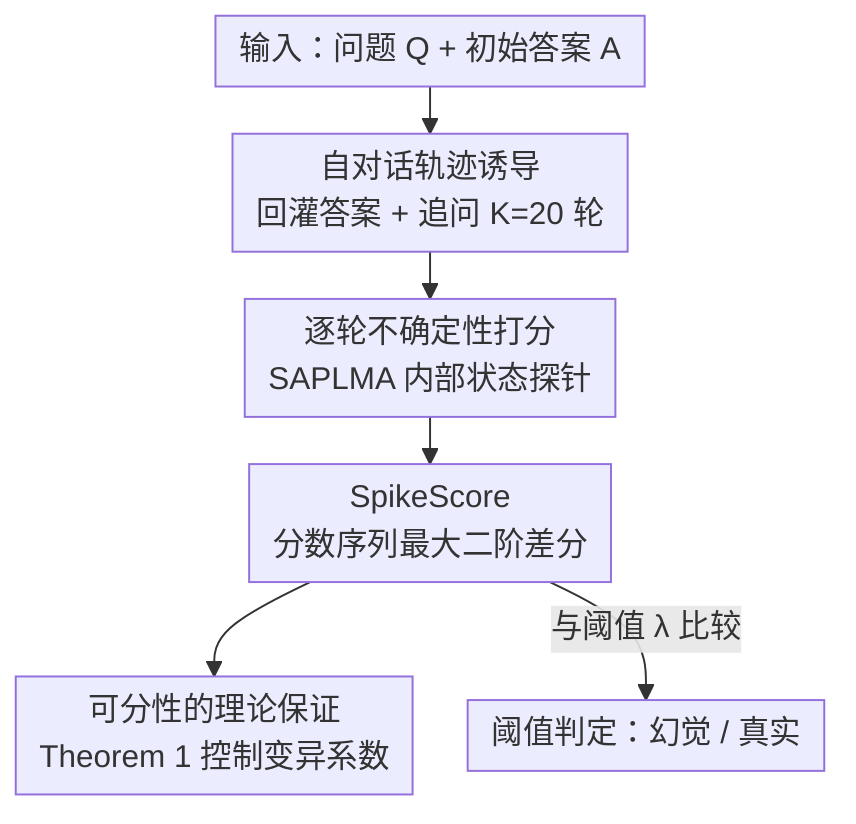

# Beyond In-Domain Detection: SpikeScore for Cross-Domain Hallucination Detection

**会议**: ICLR2026  
**OpenReview**: [https://openreview.net/forum?id=Y16qXOaylp](https://openreview.net/forum?id=Y16qXOaylp)  
**代码**: 待确认  
**领域**: 幻觉检测 / LLM 可靠性  
**关键词**: 幻觉检测, 跨域泛化, 多轮自对话, 二阶差分, 不确定性

## 一句话总结
作者发现「由幻觉答案引出的多轮自对话，其不确定性分数会出现远比真实答案剧烈的尖峰抖动」，于是把这种抖动量化成 **SpikeScore**（分数序列的最大二阶差分），用一个阈值就能做到只在单个领域训练、却能跨多个领域稳定检测幻觉，在四个 LLM、六个 benchmark 上的跨域 AUROC 全面超过 PRISM、ICR Probe 等专门的跨域方法。

## 研究背景与动机
**领域现状**：LLM 幻觉检测目前分两派。训练无关（training-free）方法靠模型自身信号——困惑度、语义熵、一致性、注意力模式——来判断答案是否可靠；训练相关（training-based）方法则在某一层隐藏激活上接一个轻量分类器（如 SAPLMA、SEP）去预测真假。后者在**同域**测试集上普遍更强，因此成了主流。

**现有痛点**：训练相关方法有一个致命短板——**换个领域就崩**。已有研究显示，SAPLMA、SEP 这类方法一旦测试域和训练域不同，性能会断崖式下跌。原因是它们学到的是「领域特定特征」，对分布漂移极其脆弱。也就是说，最强的那一派恰恰最不能用于真实部署，因为真实场景里几乎不可能保证测试问题和训练问题同分布。

**核心矛盾**：判别力（separability）和跨域不变性（domain invariance）之间存在张力。过去的工作大多只盯着「挑战 1」——在单个领域内把幻觉答案和真实答案分开；而真实需求还要求「挑战 2」——这个可分性要在不同领域之间稳定保持。同时满足两者的指标一直缺失。

**本文目标**：作者把这个被忽视的问题正式定义为 **可泛化幻觉检测（Generalizable Hallucination Detection, GHD）**：只用单个训练域 $P_{Q,T}$ 的数据训练检测器，却要在 $N$ 个相关测试域 $P^1_{Q,T},\dots,P^N_{Q,T}$ 上都稳。当 $N=1$ 且测试域等于训练域时，GHD 退化为经典幻觉检测。

**切入角度**：一个有意思的现象给了启发——LLM 在多轮对话里经常**自相矛盾**，尤其当用户改变立场、反复质疑时，模型会随之倒戈、推翻自己之前的结论。作者假设：这种不稳定性正是模型内部不确定性的外显，而且**幻觉答案触发的不稳定要远大于真实答案**，因为错误答案更容易激活模型的自我纠错机制、引发剧烈的来回摇摆。关键在于，这种「摇摆」是一种**跨领域普遍存在**的行为，不依赖具体话题，因而有望成为领域不变的指标。

**核心 idea**：把初始答案回灌为上下文、追问若干轮构造一条「自对话轨迹」，对每轮答案打不确定性分；幻觉轨迹的分数曲线会出现**急升急降的尖峰**，真实轨迹则相对平滑——用「分数曲线的最大二阶差分（曲率）」即 SpikeScore 来捕捉这种局部突变，就得到一个跨域可分的幻觉指标。

## 方法详解

### 整体框架
给定一个问题 $Q$ 和模型的初始答案 $A$，方法不去看答案本身的某个静态特征，而是**让模型继续和自己对话**：把 $A$ 当作对话起点，用一组通用的追问 prompt 一轮轮诱导出后续答案 $A_2,\dots,A_K$（默认 $K=20$ 轮），形成一条标准化的「自对话轨迹」。对轨迹上的每一轮答案，用一个训练相关的打分器（默认 SAPLMA）算出它的不确定性分数，得到一条分数序列 $S(Q,A)=[S(A_1),\dots,S(A_K)]$。接着对这条序列计算 **SpikeScore = 最大二阶差分**，刻画曲线里最剧烈的那一次「急升急降」。最后拿 SpikeScore 和一个阈值 $\lambda$ 比大小：超过阈值判为幻觉，否则判为真实。整条流水线是**后处理（post-hoc）**的——只要拿到一段自然语言答案就能跑，因此天然兼容 RAG 等带检索/工具调用的上游管线。

### 关键设计

**1. 自对话轨迹诱导：把静态答案变成可观测的动态不稳定性**

过去的检测器只盯着「答案这一个点」，看不到模型在被追问时的反应，而恰恰是这种反应里藏着跨域不变的信号。作者把初始答案 $A_1=A$ 当作多轮对话的第一轮，然后用一个事先编好的、与初始问题自然衔接的追问 prompt 库，逐轮诱导出后续答案。第 $k$ 轮答案的生成形式化为
$$A_k \sim P_\theta(\cdot \mid Q, A_1, P_2, A_2, \dots, P_i, A_i, \dots, P_k),\quad k>1,$$
其中 $P_i$ 是第 $i$ 轮的诱导 prompt。这些 prompt 的设计目标是「在已有 $i$ 轮上下文下引出语境连贯的回应」，模拟真实对话里用户顺着上一轮继续追问的场景。这样每个 $(Q,A)$ 都被展开成一条**标准化、可统计**的轨迹，把「模型内部不确定性」从看不见的隐变量变成了一条可以画出来、可以量化的曲线。之所以这能跨域，是因为「被质疑就动摇」是模型族层面的普遍行为，与具体是数学题还是常识题无关。

**2. SpikeScore：用最大二阶差分捕捉局部尖峰，而非全局方差**

有了分数序列，怎么量化它的「抖动」？最直接的想法是算方差或变异系数（Sun et al. 2025a 的 coefficient-of-variation score 就是后者），但这类全局指标只反映序列整体的起伏，会**抹平**幻觉轨迹最关键的特征——那种「快速上冲又陡然回落」的局部尖峰。作者主张测量**局部曲率**更灵敏，于是定义 SpikeScore 为分数序列的最大二阶差分：
$$\mathrm{Max}|\Delta^2|(S(Q,A)) = \max_{1<k<K-1}\big|\,S(A_{k+1}) - 2S(A_k) + S(A_{k-1})\,\big|.$$
二阶差分正是离散意义下的「曲率」，它在曲线发生急升急降（先涨后跌、拐点最尖锐）处取到最大值，对应序列里**最剧烈的一次不稳定**。幻觉答案在多轮纠错中反复横跳，会产生很大的二阶差分；真实答案即便偶有微调也平滑得多，二阶差分小。相比一阶变化（差分/方差），二阶差分对「方向反转的尖锐程度」更敏感，这正是区分幻觉与真实的判别信号所在。

**3. 可分性的理论保证：在受控变异系数下证明跨域分离**

光有经验观察不够，作者还想从理论上说明 SpikeScore 为什么能同时解决挑战 1 和挑战 2。他们先在实验里确立两个观察：**期望不变性**——幻觉域的 SpikeScore 均值是非幻觉域的两倍以上（$2\,\mathbb{E}_{\text{真实}} < \mathbb{E}_{\text{幻觉}}$）；**标准差差异**——幻觉域标准差更大，与非幻觉域的标准差之比落在 $1$ 到 $2.5$ 之间。单看均值有 2 倍差距很好，但幻觉域方差也更大，可能侵蚀可分性。于是 Theorem 1 给出关键的桥梁：只要非幻觉域的**变异系数**（标准差除以期望）$\mathrm{CV}\le 0.1\cdot t$ 受控，就有
$$P\big(\mathrm{Max}|\Delta^2|(S(Q',H')) > \mathrm{Max}|\Delta^2|(S(Q,A))\big) \ge \frac{1}{1+0.0725\cdot t^2},$$
即「幻觉样本的 SpikeScore 高于真实样本」这件事有可证的概率下界。实验进一步测得各域变异系数都不超过 $0.2$（对应 $t=2$），代入即得分离概率 $\ge 0.775$。由于评测采用「留一域、其余域均匀混合」的池化协议，从概率角度等价于对各测试域的可分性取期望，因此这个下界天然刻画的是**跨域**而非单域的可分性——这正是把挑战 1 的单域可分提升到挑战 2 的跨域可分的理论支点。（注：部分推导细节以原文 Appendix A 为准。）

**4. 阈值检测、backbone 无关与 RAG 扩展：一个即插即用的检测框架**

最终的检测器极简：算出 SpikeScore 后与阈值 $\lambda$ 比较，
$$D_\lambda(Q,A) = \begin{cases}0, & \mathrm{Max}|\Delta^2|(S(Q,A)) < \lambda \ (\text{真实})\\ 1, & \text{否则}\ (\text{幻觉})\end{cases}$$
没有任何需要重新训练的跨域模块。更重要的是，SpikeScore 是一个**与打分器解耦**的框架：作者把它分别接到训练相关的 SAPLMA、SEP 和训练无关的 Perplexity、Reasoning score、In-Context Sharpness 上，全部都能有效检测，说明「幻觉轨迹有尖峰」是一种**通用、可迁移**的特征，而不是 SAPLMA 特有的产物（其中接训练相关打分器效果更好）。又因为整条流水线是后处理的，只需要一段自然语言答案，所以无论上游是否做了检索、工具调用，它都能照常诱导自对话、抽取逐轮分数、算 SpikeScore，从而无缝扩展到 RAG 场景。

### 损失函数 / 训练策略
SpikeScore 本身不引入新训练目标——唯一需要训练的是 backbone 打分器。以默认的 SAPLMA 为例，它在 LLM 内部表示 $E_\theta(\cdot)$ 上接一个 MLP + sigmoid 得到概率输出 $p_W(\cdot)\in[0,1]$，用交叉熵在标注数据 $D_l=\{(Q_i,A_i,y_i)\}$ 上优化：
$$\hat W \in \arg\min_W -\frac1n\sum_{i=1}^n \Big[y_i\log p_W(E_\theta(A_i\mid Q_i)) + (1-y_i)\log\big(1-p_W(E_\theta(A_i\mid Q_i))\big)\Big].$$
训练只在**单个**训练域上进行；跨域能力完全来自 SpikeScore 这一后处理几何特征，而非额外的域适配训练。轨迹长度默认 $K=20$ 轮——实验显示性能在 15–20 轮附近饱和，故取前 20 轮为最具信息量的「早期阶段」。

## 实验关键数据

### 主实验
四个 LLM（Llama-3.2-3B / 3.1-8B、Qwen3-8B / 14B）、六个 benchmark（TriviaQA、CommonsenseQA、Belebele、CoQA、Math、SVAMP），采用「留一域」协议：训练相关方法在每个数据集上训练，所有方法都在其余五个数据集上评测，避免在自己的训练域上测试。指标为跨域平均 AUROC。

| 模型 | Perplexity | SAPLMA（训练相关） | PRISM | ICR Probe | **SpikeScore** |
|------|-----------|-------------------|-------|-----------|----------------|
| Llama-3.2-3B | 0.5953 | 0.5693 | 0.6953 | 0.7463 | **0.7474** |
| Llama-3.1-8B | 0.6425 | 0.5764 | 0.7029 | 0.7439 | **0.7860** |
| Qwen3-8B | 0.6111 | 0.5705 | 0.7032 | 0.7381 | **0.7473** |
| Qwen3-14B | 0.6302 | 0.5787 | 0.7072 | 0.7435 | **0.7874** |

传统训练相关方法（MM、SEP、SAPLMA）跨域几乎全军覆没（平均 AUROC 多在 0.53–0.58）；训练无关方法略好但仍逊于专门的跨域方法；SpikeScore 在所有模型上取得最高平均 AUROC，且在更大模型上提升更明显（作者推测大模型自我纠错更强，尖峰模式更可检测）。

### 消融实验

| 配置 | 关键结论 | 说明 |
|------|---------|------|
| SpikeScore + SAPLMA | Llama-3.1-8B 0.7860 | 默认配置，最佳 |
| SpikeScore + SEP | Llama-3.1-8B 0.7684 | 换训练相关 backbone 仍强 |
| SpikeScore + Reasoning score | Llama-3.1-8B 0.7595 | 训练无关 backbone 也有效 |
| SpikeScore + Perplexity | Llama-3.1-8B 0.7160 | 最弱 backbone 也远超原版 Perplexity 0.6425 |
| 二阶差分 vs 变异系数 | 二阶差分胜出 | 局部曲率比全局变异更判别（Appendix D.3） |
| 对话轮数 K | 15–20 轮饱和 | 支撑默认 $K=20$（Appendix D.4） |

### 关键发现
- **打分器无关性是最强证据**：把 SpikeScore 接到五种不同 backbone 上全部有效，说明「幻觉轨迹有尖峰」是幻觉输出的通用属性，而非某个打分器的偶然产物——这也是它能跨域的根本原因。
- **二阶差分 > 一阶变异**：消融证实捕捉局部曲率（最尖锐的急升急降）比测整体方差更判别，验证了「全局变异会抹平关键尖峰」的设计动机。
- **模型越大越好检**：同族内 8B→14B、3B→8B 性能上升，与「大模型自我纠错更强、抖动更可观测」的解释一致。
- **RAG 场景同样领先**：在 TriviaQA、RAGTruth 上，SpikeScore 的 AUROC（如 Qwen3-14B 0.8697 / 0.8535）显著超过 ICR Probe，证明后处理框架对带检索的管线天然兼容。

## 亮点与洞察
- **把「答案的真假」转化成「对话的动力学」**：不去抠答案本身的静态特征，而是观察模型被自己的答案追问时的反应轨迹——这个视角转换是全文最「啊哈」的地方，也是跨域不变性的来源。
- **二阶差分这个选择很巧**：它正好对应离散曲率，能精准抓住「先冲高再陡跌」的尖峰，而方差/一阶差分会把这种局部剧变平均掉。一个简单的数学量恰好对齐了「自我纠错引发剧烈横跳」的物理直觉。
- **经验观察 → 定理 → 阈值检测的闭环**：作者先用统计观察（均值 2 倍、标准差比 ≤2.5、CV ≤0.2）支撑，再用 Theorem 1 把这些观察转成可证的分离概率下界，最后落到一个无需训练的阈值判定，整条逻辑链很完整。
- **可迁移的 trick**：「回灌答案诱导自对话 + 取分数曲线的某种几何量」这套范式，可以迁移到其他需要跨域不变指标的任务，比如 OOD 检测、答案置信度校准。

## 局限与展望
- **依赖一个可用的逐轮打分器**：SpikeScore 是后处理框架，本身不打分，必须搭配 SAPLMA/SEP 等 backbone；接训练无关打分器虽可用但明显更弱，意味着仍间接依赖训练数据。
- **推理成本高**：每个 $(Q,A)$ 都要诱导 20 轮自对话并逐轮打分，相比单步检测方法（直接看一次激活）开销大得多，实时/大规模场景代价可观，作者未给出延迟分析。
- **理论假设的现实性**：Theorem 1 的下界依赖「变异系数受控（CV≤0.2）」等观察性条件，这些条件在实验六数据集上成立，但在更异质或对抗性的领域是否仍成立、超出「相关领域」假设后会怎样，尚未充分检验。
- **追问 prompt 库的敏感性**：诱导轨迹质量取决于人工编写的 prompt 库，其设计对结果的影响、是否会被刻意构造的输入绕过，文中讨论有限。

## 相关工作与启发
- **vs SAPLMA / SEP（训练相关）**：它们直接在某层激活上训分类器，学到的是领域特定特征，跨域即崩；本文不改它们的训练，而是把它们当 backbone、在多轮轨迹上取二阶差分，把「易过拟合的静态特征」转成「跨域不变的动态曲率」，从而把同样的打分器救活在跨域设置下。
- **vs PRISM / ICR Probe（专门跨域方法）**：这两者是当前跨域幻觉检测的最强基线，但仍是单步特征驱动；SpikeScore 利用多轮对话动力学捕捉低频、领域无关的不稳定模式，在四个模型上平均 AUROC 全面反超（如 Llama-3.1-8B 0.786 vs ICR 0.744）。
- **vs coefficient-of-variation score（Sun et al. 2025a）**：同样是测分数序列波动，但 CV score 是全局变异、会抹平局部尖峰；SpikeScore 用最大二阶差分抓局部曲率，消融中稳定胜出。
- **启发**：「被追问就动摇」这一自相矛盾现象，过去多被当作 LLM 的缺陷来研究；本文反过来把它当作**信号**来利用，提示我们模型的「弱点行为」可能恰恰编码了关于其内部置信的可检测信息。

## 评分
- 新颖性: ⭐⭐⭐⭐⭐ 把幻觉检测从静态特征转到多轮自对话动力学，并正式提出 GHD 问题，视角新颖
- 实验充分度: ⭐⭐⭐⭐⭐ 4 模型 × 6 数据集留一域评测 + backbone 无关性 + RAG 扩展 + 多项消融，相当扎实
- 写作质量: ⭐⭐⭐⭐ 现象→指标→定理→检测逻辑清晰；理论部分依赖观察性假设，表述略需读者自行串联
- 价值: ⭐⭐⭐⭐⭐ 直击训练相关方法跨域崩溃这一真实部署痛点，且方法即插即用、兼容 RAG，实用价值高

<!-- RELATED:START -->

## 相关论文

- [\[ICLR 2026\] VeriTrail: Closed-Domain Hallucination Detection with Traceability](veritrail_closed-domain_hallucination_detection_with_traceable_evidence_synthes.md)
- [\[ACL 2025\] Learning Auxiliary Tasks Improves Reference-Free Hallucination Detection in Open-Domain Long-Form Generation](../../ACL2025/hallucination/learning_auxiliary_tasks_improves_reference-free_hallucination_detection_in_open.md)
- [\[ICLR 2026\] Enhancing Hallucination Detection through Noise Injection](enhancing_hallucination_detection_through_noise_injection.md)
- [\[ICLR 2026\] Cat-PO: Cross-modal Adaptive Token-rewards for Preference Optimization in Truthful Multimodal LLMs](cat-po_cross-modal_adaptive_token-rewards_for_preference_optimization_in_truthfu.md)
- [\[ICLR 2026\] Learning to Reason for Hallucination Span Detection](learning_to_reason_for_hallucination_span_detection.md)

<!-- RELATED:END -->
