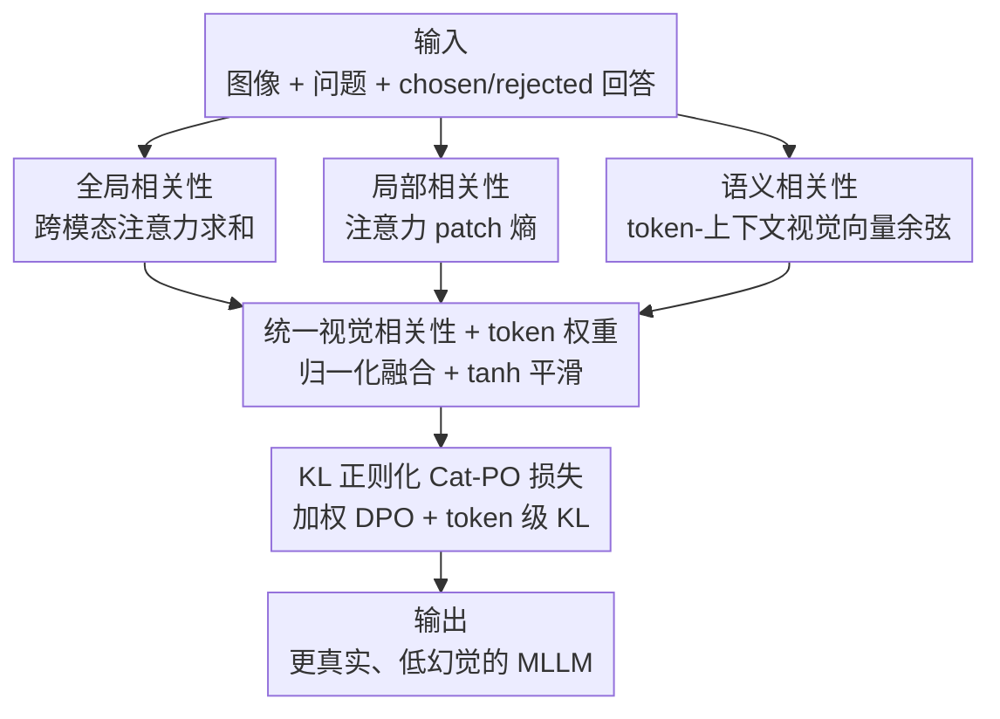

# Cat-PO: Cross-modal Adaptive Token-rewards for Preference Optimization in Truthful Multimodal LLMs

**会议**: ICLR2026  
**OpenReview**: [https://openreview.net/forum?id=iIbe6qDN0A](https://openreview.net/forum?id=iIbe6qDN0A)  
**代码**: https://github.com/gavinzzx/CatPO  
**领域**: 多模态VLM / 幻觉抑制 / 偏好优化  
**关键词**: 多模态幻觉, DPO, token 级奖励, 跨模态注意力, 真实性对齐

## 一句话总结
针对多模态大模型的幻觉问题，本文提出 Cat-PO：在 DPO 偏好优化中，仅靠模型自身的跨模态注意力与相似度，为每个回答 token 计算全局/局部/语义三层视觉相关性，融合成一个平滑的 token 奖励来重新加权 DPO 损失并加上 token 级 KL 正则，从而对幻觉 token 做细粒度纠偏，在 AMBER-Generation、MM-Hal 等基准上比现有 SOTA 高 7%–15%。

## 研究背景与动机

**领域现状**：多模态大模型（MLLM）在图文理解、推理上表现出色，但普遍存在「幻觉」——生成的文字描述与输入图像不符（凭空说出不存在的物体、错误的属性或关系）。为缓解幻觉，主流做法是用偏好学习对模型做微调，其中 DPO（Direct Preference Optimization）因为不需要单独训练奖励模型、流程简单稳定，已成为多模态幻觉抑制的主力工具。

**现有痛点**：作者观察到现有多模态偏好优化方法在「偏好数据解码阶段」存在两个共性缺陷。其一，回答里不同的 token 与视觉内容的关联程度天差地别——如图 1(a) 中描述 "a laptop and a cup" 时，"laptop"、"cup" 这类视觉关键词的跨模态注意力和图文相似度明显高于 "the"、"are" 这类功能词，它们对消除幻觉、生成高质量回答的贡献也不同；但现有 DPO 方法把所有 token 一视同仁地处理，缺乏细粒度纠偏。其二，许多方法依赖外部视觉检测模型、额外噪声注入、昂贵的闭源 LLM API 甚至外部工具来构造偏好信号，既忽视了 MLLM 自身就具备的多模态能力，又抬高了成本。

**核心矛盾**：幻觉的纠偏信号本应是 token 级、且来自图文关联强度的，但 DPO 的梯度却被「平摊」到整条回答的所有 token 上（图 1(c) 上半部分的「flat gradient distribution」）。这种均匀处理使真正该被强化/惩罚的视觉关键 token 得不到聚焦的梯度。

**切入角度**：作者做了一个关键的统计实验（图 1(b)）：只对 chosen 回答中被打高奖励的 top 50% token 应用 DPO，幻觉指标 AMBER-F1、MM-Hal 就显著优于原始 DPO；而对全部 token 都加权后效果更进一步。这说明 token 级的视觉相关性确实是有效的对齐信号，而且这些信号完全可以从 MLLM 内部（注意力、相似度）挖出来，不必借助外部工具。

**核心 idea**：用 MLLM 自身的跨模态注意力与语义相似度，分层算出每个 token 的视觉相关性奖励，再用它去重塑 DPO 的梯度分布（图 1(c) 下半部分的「targeted gradient distribution」），让视觉关键 token 获得有针对性的强化/惩罚。

## 方法详解

### 整体框架

Cat-PO 建立在标准 DPO 之上，整条流水线是「从 MLLM 内部抽信号 → 算 token 奖励 → 把奖励灌回 DPO 损失」四步（对应原文图 2）：

1. **输入**：每条偏好样本是 (图像 $I$, 问题 $x$, chosen 回答 $y^+$, rejected 回答 $y^-$)。图像经 CLIP+ViT 投影到特征空间，问答 token 经 LLM tokenizer 嵌入。
2. **从模型自身抽特征**（不借助任何外部工具/模型）：在多模态 transformer 内部，取出每个回答 token 对图像的跨模态注意力，以及 token 与图像的语义相似度。
3. **算 token 奖励**：基于这些特征，分层计算每个 token 的全局相关性、局部相关性、语义相关性，归一化后融合成统一的视觉相关性分数，再平滑映射成 token 权重；chosen 与 rejected 用不同的映射公式。
4. **加权的 Cat-PO 损失**：把 token 权重灌进标准 DPO 损失，并额外加一个 token 级、按权重调制的 KL 正则项，最终联合优化。

整个过程不引入任何外部检测器、噪声注入或闭源 API，奖励信号全部来自 MLLM 自己。

### 关键设计

**1. 跨模态注意力的全局相关性：用注意力总量量化 token 对整图的关注度**

针对「不同 token 与视觉关联强度不同、却被均匀处理」这一痛点，第一层信号直接复用 transformer 里现成的跨模态注意力。对回答中第 $t$ 个 token $y_t$，把它当 query，图像经视觉编码器得到的 $N_p$ 个视觉 token 特征 $\{v_1,\dots,v_{N_p}\}$ 当 key/value，得到注意力序列 $\{a_{t,1},\dots,a_{t,N_p}\}$。全局相关性定义为这些注意力分数之和：

$$S_{\text{global}}(y_t) = \sum_{j=1}^{N_p} a_{t,j}$$

$S_{\text{global}}$ 越高，说明模型处理该 token 时越「整体性地」盯着图看，意味着这个 token 与图像的全局对齐越强。它捕捉的是「关不关注图」，但还分不清注意力是聚焦在关键区域还是散乱地铺满全图。

**2. patch 熵的局部相关性：用注意力分布的熵区分「聚焦」与「弥散」**

全局相关性只看总量，无法区分注意力是集中在少数关键 patch 上、还是均匀散开。作者借信息熵来刻画这种聚焦程度：先把 $y_t$ 对所有 $N_p$ 个 patch 的注意力归一化成概率分布 $P_{t,j} = a_{t,j}/\sum_k a_{t,k}$，再算 patch 熵（加小量 $\epsilon\approx10^{-12}$ 保数值稳定）：

$$H(P_t) = -\sum_{j=1}^{N_p} P_{t,j}\log(P_{t,j}+\epsilon)$$

然后用 1 减去归一化熵得到局部相关性（$N_p>1$ 时）：

$$S_{\text{local}}(y_t) = 1 - \frac{H(P_t)}{\log N_p}$$

熵越低 → $S_{\text{local}}$ 越高 → 注意力越尖锐地集中在少数 patch，说明该 token 与图像某个具体局部区域强绑定。这一层补上了全局相关性看不到的「聚焦/弥散」维度，是判断 token 是否真的有视觉锚点的关键。

**3. 跨模态相似度的语义相关性：用预训练编码器的先验补足语义对齐**

注意力是模型内部的关注信号，但不一定等于「语义上对不对」。第三层引入一个来自预训练跨模态编码器的语义先验：先用注意力权重 $\alpha_{t,j}$ 对视觉特征做加权，得到该 token 最关注区域的上下文视觉向量 $v_c(y_t)=\sum_j \alpha_{t,j} v_j$，再算它与 token 嵌入 $e(y_t)$ 的余弦相似度：

$$S_{\text{semantic}}(y_t) = \cos\big(e(y_t), v_c(y_t)\big) = \frac{e(y_t)\cdot v_c(y_t)}{\|e(y_t)\|\,\|v_c(y_t)\|}$$

它衡量的是 token 表示与其最关注视觉区域之间的语义对齐，与基于注意力的全局/局部相关性互补——注意力告诉你「看哪」，相似度告诉你「看对没」。后面的鲁棒性分析（图 7）也印证了二者的互补：当某 token 注意力错位时高语义相似度能纠正它，反之注意力异常聚焦也能补偿偏低的相似度，从而避免单一信号失效被放大。

**4. 统一相关性融合 + 平滑 token 权重 + KL 正则化 Cat-PO 损失：把奖励灌回 DPO 梯度**

最后一步把三层信号融成一个数、平滑成权重、再注入损失。先把三个相关性归一化到 $[0,1]$，按系数 $\alpha$ 在「注意力支路（全局+局部，各占一半）」和「语义支路」之间加权融合：

$$s_i = \alpha\big(0.5\,S_{\text{global},i} + 0.5\,S_{\text{local},i}\big) + (1-\alpha)\,S_{\text{semantic},i}$$

直接把 $s_i$ 灌进损失会导致梯度不稳，因此用 $\tanh$ 做平滑非线性 $T_i=\tanh(s_i)\in(0,1)$，并加一个基础权重 $\lambda_{\text{ref}}>0$ 维持可控的动态范围。chosen 与 rejected 用相反的映射：

$$w_i = \begin{cases}\lambda_{\text{ref}} + T_i, & y_i\in y^+\\ \lambda_{\text{ref}} + (1-T_i), & y_i\in y^-\end{cases}$$

这样 chosen 回答里越贴合图像的 token（$T_i\uparrow$）被奖励越多，rejected 回答里弱对齐/幻觉的 token（$(1-T_i)\uparrow$）被惩罚越重。把这些权重灌进 DPO 的对数似然比，得到加权 DPO 损失：

$$\mathcal{L}_{\text{wDPO}} = -\log\sigma\Big(\beta\big(\pi_\theta^{(w)} - \pi_{\text{ref}}^{(w)}\big)\Big)$$

其中 $\pi_\theta^{(w)}=\sum_t\big(w_t^+\log\pi_\theta(y_t^+|h_t^+) - w_t^-\log\pi_\theta(y_t^-|h_t^-)\big)$，参考策略同理。为了让策略不偏离参考、稳住训练，再加一个 token 级、按权重调制的 KL 惩罚：

$$\mathcal{L}_{\text{KL}} = \lambda\Big(\sum_t w_t^+\,\text{KL}\big(\pi_\theta(\cdot|h_t^+)\,\|\,\pi_{\text{ref}}(\cdot|h_t^+)\big) + \sum_t w_t^-\,\text{KL}\big(\pi_\theta(\cdot|h_t^-)\,\|\,\pi_{\text{ref}}(\cdot|h_t^-)\big)\Big)$$

最终目标是两者之和 $\mathcal{L}_{\text{Cat-PO}} = \mathcal{L}_{\text{wDPO}} + \mathcal{L}_{\text{KL}}$。最小化它能让策略既编码人类偏好、又编码细粒度的 token–视觉对齐，在压制幻觉的同时保住生成质量。

### 损失函数 / 训练策略
训练数据用广泛使用的 RLHF-V 数据集（5,733 条，每条含图像、问题、高质量回答、低质量回答）。主实验训练 6 个 epoch，有效 batch size 32（靠梯度累积实现），DPO 超参 $\beta_{\text{DPO}}=0.1$，融合系数 $\alpha$ 与 KL 系数 $\lambda_{\text{KL}}$ 经超参分析后取 $\alpha\approx0.5$、$\lambda_{\text{KL}}=0.03$。

## 实验关键数据

### 主实验
基于 LLaVA-v1.5-7B/-13B、用 RLHF-V 数据训练，在 AMBER（判别 Disc / 生成 Gene）、MM-Hal、LLaVA-Bench、SEED 上对比主流偏好对齐方法：

| 模型 / 方法 | AMBER-Gene F1 ↑ | AMBER-Gene CHAIR ↓ | MM-Hal Score ↑ | MM-Hal Rate ↓ | LLaVA ↑ |
|------|------|------|------|------|------|
| LLaVA-v1.5-7B（基座） | 74.3 | 7.8 | 2.01 | 61.4 | 65.6 |
| + DPO | 82.1 | 5.7 | 2.14 | 58.3 | 69.1 |
| + RLHF-V | 78.5 | 5.5 | 2.02 | 60.4 | 68.0 |
| + V-DPO | 81.6 | 5.6 | 2.16 | 56.0 | - |
| + TPO | 85.0 | - | 2.47 | 51.0 | 70.2 |
| **+ Cat-PO（本文）** | **85.3** | **4.8** | **2.74** | **42.0** | **70.3** |

在 7B 上，MM-Hal Score 从 DPO 的 2.14 拉到 2.74、幻觉率 Rate 从 58.3% 降到 42.0%；13B 上 MM-Hal Rate 也从 DPO 的 51.0% 降到 42.0%、Score 升到 2.85。作者称在 AMBER-Generation 与 MM-Hal 上比现有 SOTA 高 7%–15%。换到 Qwen2.5-VL-3B 上（图 3）同样优于 Qwen 与 Qwen+DPO，验证跨模型泛化性。

### 消融实验

| 配置 | MM-Hal Score ↑ | MM-Hal Rate ↓ | CHAIR ↓ |
|------|------|------|------|
| DPO-only | 2.14 | 58.3 | 5.7 |
| Attention-only（仅注意力相关性） | 2.34 | 55.0 | 5.3 |
| Similarity-only（仅语义相似度） | 2.51 | 47.0 | 5.1 |
| Cat-PO without KL | 2.36 | 53.0 | 5.1 |
| **Cat-PO（完整）** | **2.74** | **42.0** | **4.8** |

### 关键发现
- **三层信号互补、缺一不可**：注意力相关性与语义相似度单独用都能涨点，但组合后增益更大；去掉 token 级 KL 项（without KL）性能明显回落，证明 KL 正则是稳定训练的必要件。
- **加权 token 比例越高越好**：把权重只加到 chosen 回答 top 30% / top 50% token 时，top 30% 反而比 top 50% 增益更稳，但加到全部 token（100%）才最好，说明「剩余 50%」的 token 也有可观贡献（图 4a）。
- **权重算得准**：只给 top 30% token 加权 vs 只给 bottom 30% 加权（图 4d），前者增益显著大于后者，反向印证奖励确实抓到了真正的视觉关键 token。
- **超参敏感性**：$\alpha$ 过大或过小都掉点，需在注意力支路与语义支路间平衡；$\lambda_{\text{KL}}=0.03$ 是灵活性与约束偏离间的最优点（图 4b/c）。
- **可学习融合反而更差**：把固定的 $\alpha$/0.5 系数换成可学习参数 $\gamma,\delta$（式 11）后 MM-Hal Score 从 2.74 跌到 2.55、Rate 从 42% 升到 50%（表 4）；作者推测因为 DPO 不直接监督权重分配，可学习系数会过拟合噪声，固定均匀加权反而更稳。

## 亮点与洞察
- **「奖励信号全来自模型自己」是最大卖点**：不引入任何外部检测器、噪声注入或闭源 API，只靠 transformer 里现成的跨模态注意力 + 一个预训练编码器的相似度，就把 token 级视觉对齐信号挖出来，省成本又自洽——这条路线对资源受限场景很有迁移价值。
- **三层相关性的「互补纠错」很巧**：图 7 的鲁棒性分析显示，注意力错位时靠语义相似度纠偏、相似度异常时靠聚焦注意力补偿，多信号融合避免了单支路失效被放大，这种「多视图互证」的思路可迁移到任何需要可靠 token 打分的对齐任务。
- **chosen/rejected 用对称取反映射很简洁**：$\lambda_{\text{ref}}+T_i$ 与 $\lambda_{\text{ref}}+(1-T_i)$ 一正一反，一个公式同时实现「强化对齐 token / 惩罚幻觉 token」，是个干净可复用的 trick。
- **统计实验先验证再设计**：先用「只对 top 50% token 做 DPO 就涨点」（图 1b）证明 token 级加权方向有效，再据此设计方法，动机扎实。

## 局限与展望
- **依赖现成偏好数据**：方法只重塑 DPO 的 token 权重，仍需 RLHF-V 这类已标注的 chosen/rejected 对，没解决偏好数据本身的获取/质量问题。
- **对抗场景下略有回落**：在 POPE 最难的 Adversarial 子集上，Acc/Precision/F1 比平均分别低约 2%/4%/2%（表 3），说明在高度对抗、刻意诱导幻觉的边缘场景里奖励的鲁棒性还有余量。
- **融合是固定均匀权重**：可学习融合反而更差，意味着当前融合方式偏经验、缺乏自适应；如何在不过拟合噪声的前提下让融合系数随样本/token 自适应，是个待解问题。
- **语义相似度依赖外部编码器质量**：语义相关性那一支用的是预训练跨模态编码器的嵌入，编码器本身的偏差会直接传导进奖励，论文未深入讨论这一来源的误差。

## 相关工作与启发
- **vs DPO**：标准 DPO 把梯度平摊到所有 token（flat gradient），Cat-PO 用 token 奖励重塑梯度分布（targeted gradient），在不改 DPO 框架的前提下做细粒度纠偏。
- **vs TPO**：TPO 也在 DPO 里引入 token 级信息（自校准、视觉锚定奖励），但 Cat-PO 强调三层（全局/局部/语义）相关性的分层融合且完全不依赖外部工具，主结果上 MM-Hal Rate（42.0 vs 51.0）更优。
- **vs V-DPO**：V-DPO 靠「图文对比偏好 + 视觉引导 DPO」强化视觉上下文学习，Cat-PO 不构造额外对比对，而是直接从注意力/相似度抽 token 权重。
- **vs POVID / RLHF-V**：POVID 靠注入幻觉文本+图像加噪造数据、RLHF-V 靠分段人工偏好采集，都在「数据侧」做文章；Cat-PO 转向「损失/解码侧」的 token 加权，思路正交、可与这些数据增强方法叠加。

## 评分
- 新颖性: ⭐⭐⭐⭐ 「纯靠模型自身信号的三层 token 奖励 + 对称取反映射」组合新颖，但底座仍是 DPO 加权这一较成熟范式。
- 实验充分度: ⭐⭐⭐⭐ 覆盖多基座（LLaVA 7B/13B、Qwen2.5-VL）、多基准（AMBER/MM-Hal/LLaVA/SEED/POPE）、完整消融与超参分析，唯训练数据较单一（主要 RLHF-V）。
- 写作质量: ⭐⭐⭐⭐ 动机—统计实验—方法—验证链条清晰，公式完整，图示直观。
- 价值: ⭐⭐⭐⭐ 不引入外部工具就能稳定降幻觉，成本友好、易复现，对多模态对齐有实际参考价值。

<!-- RELATED:START -->

## 相关论文

- [\[CVPR 2026\] MoD-DPO: Towards Mitigating Cross-modal Hallucinations in Omni LLMs using Modality Decoupled Preference Optimization](../../CVPR2026/hallucination/mod-dpo_towards_mitigating_cross-modal_hallucinations_in_omni_llms_using_modalit.md)
- [\[NeurIPS 2025\] Mitigating Hallucination Through Theory-Consistent Symmetric Multimodal Preference Optimization](../../NeurIPS2025/hallucination/mitigating_hallucination_through_theory-consistent_symmetric_multimodal_preferen.md)
- [\[ICLR 2026\] P2-DPO: Grounding Hallucination in Perceptual Processing via Calibration Direct Preference Optimization](p2-dpo_grounding_hallucination_in_perceptual_processing_via_calibration_direct_p.md)
- [\[CVPR 2026\] MAD: Modality-Adaptive Decoding for Mitigating Cross-Modal Hallucinations in Multimodal Large Language Models](../../CVPR2026/hallucination/mad_modality-adaptive_decoding_for_mitigating_cross-modal_hallucinations_in_mult.md)
- [\[CVPR 2026\] Cross-Modal Attention Calibration for LVLM Hallucination Mitigation](../../CVPR2026/hallucination/cross-modal_attention_calibration_for_lvlm_hallucination_mitigation.md)

<!-- RELATED:END -->
