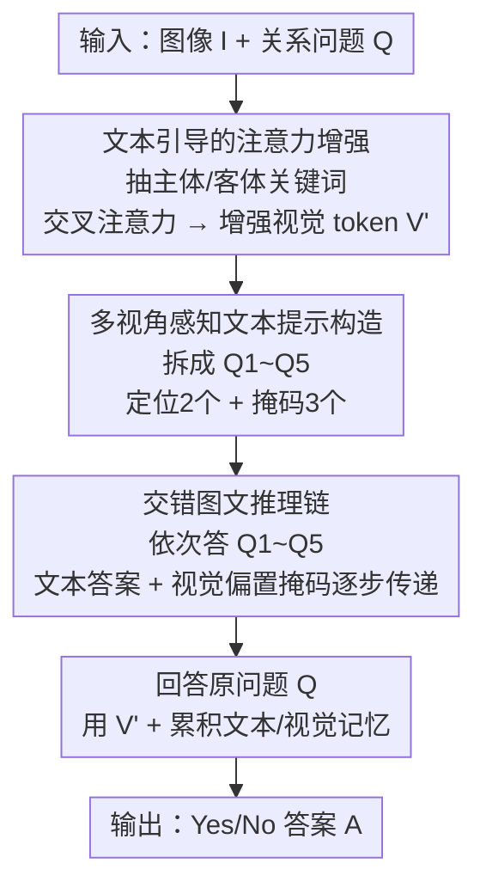

# ChainMPQ: Interleaved Text-Image Reasoning Chains for Mitigating Relation Hallucinations

**会议**: ICLR2026  
**OpenReview**: [https://openreview.net/forum?id=x5UMMVUfkO](https://openreview.net/forum?id=x5UMMVUfkO)  
**代码**: [项目页](https://yike-wu.github.io/chainmpq-project)  
**领域**: 多模态VLM / 幻觉缓解  
**关键词**: 关系幻觉, LVLM, 交错图文推理链, 多视角问题, 注意力增强

## 一句话总结
ChainMPQ 是一个无需训练的推理框架：把"主体—关系—客体"这一关系问题拆成 5 个互补子问题，按顺序喂给视觉语言模型，并把每一步的文本答案与视觉注意力记忆传递给后续步骤，形成交错的图文推理链，从而在多个 LVLM 和关系幻觉基准上稳定降低关系幻觉。

## 研究背景与动机
**领域现状**：大型视觉语言模型（LVLM）在图像描述、视觉问答等任务上表现很强，但仍受幻觉困扰。幻觉一般分三类——物体幻觉（认错实体）、属性幻觉（认错颜色/形状等属性）、关系幻觉（实体认对了，但推错它们之间的关系）。

**现有痛点**：物体幻觉和属性幻觉已经被偏好优化、对比解码、中间层修正等方法大幅缓解，但关系幻觉占了全部幻觉的近 40%，却最少有人专门处理。已有的针对关系幻觉的工作（构造高质量微调数据、约束感知提示、Detect-then-Calibrate 用中间层校准 logits、Triplet Description 把图像转成三元组），都把关系推理当成**单步推断**：期望模型一次性同时识别实体并判定关系。

**核心矛盾**：单步推断高度依赖语言先验而非系统的视觉分析。比如"a man stand on a surfboard"，模型见到 man 和 surfboard 就顺着语言习惯答"yes, standing"，根本没去核对画面里其实是"riding"。问题根因在于：把"定位实体 + 判定关系"这件本该分步的事压成了一步，视觉证据被语言先验盖过。

**切入角度**：人类做关系推理是**结构化分步**的——先定位并识别相关物体，再观察它们的交互，最后综合视觉证据下结论。作者从这个观察出发，并借鉴交错模态思维链（ICoT，在推理过程中逐步更新中间视觉状态）的思路。

**核心 idea**：用"分解 + 渐进式多模态记忆"代替"单步推断"——把关系问题拆成围绕主体/客体/关系的多视角子问题，按顺序推理，并让前面步骤的**文本答案**和**视觉注意力**作为记忆支撑后面的步骤，把推理过程显式化、逐步消解关系幻觉。

## 方法详解

### 整体框架
任务设定很明确：给定图像 $I$ 和一个关系问题 $Q$（如"图里这个男人是不是站在冲浪板上？"），输出准确的 Yes/No 答案 $A$。关系幻觉指模型把主体、客体都检测对了，却给出错误的关系判断。

ChainMPQ 是无需训练的框架，整体分三个串行模块：(1) **文本引导的注意力增强**——从问题里抽出主体、客体关键词，用交叉注意力放大对应的图像区域，得到增强视觉 token $V'$；(2) **多视角感知文本提示构造**——把原问题按主体/客体/关系拆成 5 个互补子问题；(3) **交错图文推理链**——把 5 个子问题依次输入模型，用每一步的答案当文本上下文、用每一步的 top-k 活跃视觉 token 构造的偏置掩码当视觉上下文，逐步累积多模态证据，最后再回答原问题产出最终答案。

### 关键设计

**1. 文本引导的注意力增强：先把主体客体在画面上"圈出来"再推关系**

关系推理的前提是把相关实体精确定位，否则后续判断都是空中楼阁。作者用 spaCy 从输入问题里抽出主体和客体关键词，编码成文本表示 $X \in \mathbb{R}^{N \times d_t}$（$N$ 是关键词数，通常为 2），图像经视觉编码器得到视觉特征 $V \in \mathbb{R}^{M \times d_v}$（$M$ 是 patch 数）。然后用一次交叉注意力，让**视觉特征当 Query、关键词文本当 Key 和 Value**：

$$V' = \mathrm{softmax}\!\left(\frac{V X^T}{\sqrt{d_t}}\right) X$$

这样得到的增强视觉 token $V'$ 会突出主体、客体所在的图像区域，为后续每一步关系推理打底。这一步是"功能性"增强：消融显示它单独贡献有限（去掉只掉 1.14%），但它给整条链提供了一个聚焦实体的视觉起点。

**2. 多视角感知文本提示构造：把一个关系问题拆成 5 个互补子问题**

针对"单步推断依赖语言先验"的痛点，作者把原问题分解成主体 [S]、客体 [O]、关系 [R] 三个成分，再构造 5 个互补问题：前两个做**实体定位**（Q1: 主体在哪？Q2: 客体在哪？）；后三个用**掩码策略**——遮住客体问"主体在和什么交互"（Q3），遮住主体问"客体被什么作用"（Q4），遮住关系问"两者总体是什么关系"（Q5）。以"Does the dog chase a disc?"为例，会变成"狗在哪 / 飞盘在哪 / 狗在追什么 / 飞盘被谁追 / 狗和飞盘是什么关系"。每个子问题只盯关系的一个侧面，强迫模型先分头分析各成分再下总判断，降低对语言先验的依赖。消融里这一模块最关键：去掉它掉 3.68%，是整条链的基石。

**3. 交错图文推理链：让文本答案和视觉注意力记忆一起往后传**

跟以往纯文本提示方法不同，本模块同时把**文本信息**和**视觉信息**沿推理步骤传递。每答一个子问题 $Q_i$，模型用增强视觉 token $V'$、累积上下文 $C_i$（前面各步答案）以及早期的视觉记忆生成答案 $A_i$。前两问（定位）不加上下文直接回答；从第三问起，从最后 $n$ 层 decoder 提取关键词 token 对应的注意力，刻画模型对视觉区域的关注：

$$\mathrm{Attn}_i = \frac{1}{|T| \cdot n} \sum_{t \in T} \sum_{\ell=L-n}^{L-1} \mathrm{Attn}^{(\ell)}[t, :]$$

然后用**基于熵的自适应策略**选 top-k 视觉 token：$k = k_{max} \cdot \hat{H}(\mathrm{Attn}_i)$（$\hat{H}$ 是注意力分布的归一化熵，$k_{max}=20$）——注意力越分散选越多 token，越集中选越少。选出的 token 归一化成偏置掩码 $M_i$，在后续步骤里以置信度加权的方式注入注意力计算：

$$\alpha_i = \lambda \cdot \mathrm{Conf}_{prev_i}, \quad \mathrm{Attn}_{i+1} = \mathrm{softmax}\!\left(\frac{QK^\top}{\sqrt{d_k}} + \alpha_i \cdot M_i\right) V$$

其中 $\alpha_i$ 是随答案置信度增大的权重，$\lambda$ 是最大偏置系数（实验取 5）。多轮的历史视觉偏置则按 $\alpha$ 加权平均累加。这样模型在逐步推理中既保持视觉焦点、又渐进地建立对关系的理解，最终答案来自系统性的关系分析而非表层模式匹配。消融里去掉它掉 3.08%，说明"传递视觉记忆"和"多视角问题"几乎同等重要。

### 一个完整示例
以 action 类样本"Does a man stand on a surfboard in the image?"走一遍：
- **Q1 主体定位**："The man is in the ocean, riding a surfboard on a wave."
- **Q2 客体定位**："The surfboard is in the water, with the man riding on it."
- **Q3（掩客体）**："What is the man standing on?" → "The man isn't standing, he was riding on a surfboard."
- **Q4（掩主体）**："Who is standing on the surfboard?" → "No one is standing on the surfboard."
- **Q5（掩关系）**："What is the relationship between the man and the surfboard?" → "A man is riding on the surfboard."
- **回答原问题**：综合上述文本答案 + 各步注意力偏置 → "No, he is riding on the surfboard."

而 baseline 直接答会顺着语言先验给出"Yes, the man is standing on a surfboard"。可以看到分解迫使模型在 Q3/Q4 就发现"没人站着"，并把"riding"这个线索通过文本上下文和注意力传递到最终判断，纠正了关系幻觉。

## 实验关键数据

### 主实验
在 4 个开源 LVLM（LLaVA-1.5-7B、InstructBLIP-7B、Qwen2.5-VL-7B、InternVL3.5-8B）和两个**关系专用**基准 MMRel、R-Bench（image-level）上评测，与 Vanilla、约束感知 Prompting、Detect-then-Calibrate、标准 CoT 对比。ChainMPQ 在所有模型/基准上一致领先：

| 模型 | 基准 | 指标 | Vanilla | 最佳 baseline | 本文 |
|------|------|------|---------|---------------|------|
| LLaVA-1.5 | MMRel | Acc | 59.02 | 63.50 (Calibrate) | **65.20** |
| LLaVA-1.5 | R-Bench | Acc | 71.23 | 75.86 (Prompting) | **76.04** |
| LLaVA-1.5 | R-Bench | Prec | 64.27 | 67.86 (Calibrate) | **72.03** |
| Qwen2.5-VL | MMRel | Acc | 66.10 | 71.36 (Calibrate) | **73.52** |
| InternVL3.5 | R-Bench | Acc | 82.33 | 83.97 (Prompting) | **85.05** |

精度（Precision）提升尤其明显（LLaVA 在 R-Bench 上比最佳 baseline 高 4.17%），说明它减少了假阳性的关系预测；F1 同步提升说明在不牺牲召回的情况下提高了整体可靠性。跨四种不同架构的一致改进表明该方法是模型无关的，而非利用某种特定架构特性。

### 消融实验
在 LLaVA-1.5 + MMRel 上做核心组件消融：

| 配置 | Acc | Prec | F1 | 说明 |
|------|-----|------|----|------|
| ChainMPQ (Full) | 65.20 | 64.75 | 71.21 | 完整模型 |
| w/o Enhancement | 64.06 | 63.25 | 69.42 | 去注意力增强，掉 1.14% |
| w/o Multi-perspective | 61.52 | 60.84 | 67.53 | 只留 Q5，掉 3.68% |
| w/o Interleaved | 62.12 | 61.47 | 68.01 | 去视觉记忆只留文本，掉 3.08% |

三个消融变体都仍高于 baseline（59.02%），完整模型效果最强。

### 关键发现
- **多视角问题构造贡献最大**（去掉掉 3.68%），是整条推理链的基石；交错链传递视觉记忆几乎同等重要（掉 3.08%）；注意力增强贡献最小但稳定（掉 1.14%）。
- **超参敏感性**：$k_{max}$ 在 20（约占 10% patch）、$\lambda=5$ 时精度峰值。$k_{max}$ 太大模型用了几乎全部 token，削弱对关键区域的聚焦、破坏正常注意力；太小则漏掉散布的关键视觉特征。$\lambda$ 太大模型过度依赖历史记忆、扰乱注意力传播；太小偏置太弱、退化到 baseline。
- **效率-精度权衡**：完整链每样本 3.3s（vanilla 0.9s）。提出两个轻量版——Light1 只留 Q1/Q2/Q5（Q1、Q2 可并行），1.5s/样本、∆Acc/∆Time 最优；Light2 只留 Q3/Q4/Q5。精度优先用完整版，要平衡延迟用 Light1。

## 亮点与洞察
- **把"单步关系判断"显式拆成人类式分步推理**：先定位再观察交互再综合，且通过掩码策略系统地生成互补子问题，这个分解方式简单但直指关系幻觉的根因（依赖语言先验）。
- **同时传递文本记忆和视觉记忆**：很多多模态 CoT 只传文本，本文把每步的 top-k 视觉注意力做成偏置掩码注入后续注意力，让"看哪里"也能跨步累积——这是它区别于纯文本提示方法的核心，也是消融里第二重要的模块。
- **基于熵的自适应 top-k**：注意力越集中选越少 token、越分散选越多，比固定 k 更稳健，可迁移到任何需要从注意力图里挑关键视觉区域的任务。
- **完全无需训练**：可即插即用到 LLaVA、InstructBLIP、Qwen2.5-VL、InternVL3.5 等不同架构，落地成本低。

## 局限与展望
- **推理开销大**：完整链每样本 3.3s，是 vanilla 的 ~3.7 倍。虽有 Light1/Light2 缓解，但对延迟敏感场景仍是负担。
- **任务范围窄**：只针对 Yes/No 形式的关系问答，且评测集中在 MMRel/R-Bench 的 action 与 spatial 类（两者占 MMRel 90%+），对开放式生成、复杂多关系场景是否同样有效未充分验证。
- **依赖关键词抽取与注意力质量**：spaCy 抽主体/客体若出错、或底层模型注意力图本身不可靠，整条链的定位与偏置都会受影响；论文未深入分析这类级联失败。
- **改进思路**：可探索把 5 个子问题做成可学习/自适应数量（按问题复杂度动态裁剪），或把视觉偏置掩码与更精细的分割/检测信号结合，进一步提升定位精度并压缩延迟。

## 相关工作与启发
- **vs Detect-then-Calibrate（Zheng et al. 2024）**：它用中间层隐状态校准最终输出 logits，仍是单步、纯输出侧的修正；本文显式分步推理并传递视觉记忆，从推理过程入手而非只改最后一层，精度/F1 全面更高。
- **vs Constraint-Aware Prompting（Wu et al. 2025a）**：它靠纯文本约束提示引导感知，信息只在文本侧流动；本文在文本提示之外加了跨步的视觉注意力偏置传递，弥补了"看哪里"无法累积的短板。
- **vs ICoT（Gao et al. 2025）**：ChainMPQ 借鉴了 ICoT"在推理中逐步更新视觉状态"的思想，但把它具体化为面向关系幻觉的主体—客体—关系三成分分解 + 多视角子问题构造，是 ICoT 思路在关系推理这一具体问题上的落地。

## 评分
- 新颖性: ⭐⭐⭐⭐ 把人类式分步关系推理 + 文本/视觉双记忆传递做成无训练框架，针对被忽视的关系幻觉，角度清晰。
- 实验充分度: ⭐⭐⭐⭐ 4 个模型 × 2 个关系基准 + 核心组件消融 + 超参敏感性 + 效率权衡，较完整；但任务局限于 Yes/No 关系问答。
- 写作质量: ⭐⭐⭐⭐ 动机—方法—实验逻辑顺畅，图 2 把三模块讲清；部分公式符号（如多轮加权平均）略简。
- 价值: ⭐⭐⭐⭐ 即插即用、模型无关，对关系幻觉这一高占比低关注问题有实用价值。

<!-- RELATED:START -->

## 相关论文

- [\[NeurIPS 2025\] Hallucination as an Upper Bound: A New Perspective on Text-to-Image Evaluation](../../NeurIPS2025/hallucination/hallucination_as_an_upper_bound_a_new_perspective_on_text-to-image_evaluation.md)
- [\[ICLR 2026\] HalluGuard: Demystifying Data-Driven and Reasoning-Driven Hallucinations in LLMs](halluguard_demystifying_data-driven_and_reasoning-driven_hallucinations_in_llms.md)
- [\[CVPR 2026\] AdaIAT: Adaptively Increasing Attention to Generated Text to Alleviate Hallucinations in LVLM](../../CVPR2026/hallucination/adaiat_adaptively_increasing_attention_to_generated_text_to_alleviate_hallucinat.md)
- [\[ICLR 2026\] GHOST: Hallucination-Inducing Image Generation for Multimodal LLMs](ghost_hallucination-inducing_image_generation_for_multimodal_llms.md)
- [\[CVPR 2026\] HalluGen: Synthesizing Realistic and Controllable Hallucinations for Evaluating Image Restoration](../../CVPR2026/hallucination/hallugen_synthesizing_realistic_and_controllable_hallucinations_for_evaluating_i.md)

<!-- RELATED:END -->
