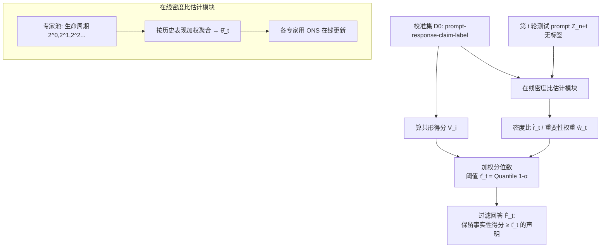

# CoFact: Conformal Factuality Guarantees for Language Models under Covariate Shift

**会议**: ICLR 2026  
**OpenReview**: [https://openreview.net/forum?id=eiBp7rsc3K](https://openreview.net/forum?id=eiBp7rsc3K)  
**代码**: [https://github.com/huzr1999/CoFact](https://github.com/huzr1999/CoFact)  
**领域**: 幻觉缓解 / 共形预测 / 在线学习  
**关键词**: Conformal Prediction, Factuality Guarantee, Covariate Shift, Density Ratio Estimation, Online Learning, Hallucination  

## 一句话总结
把 LLM 事实性控制中固定不变的"共形阈值"换成随测试分布在线漂移而自适应调整的阈值，用在线密度比估计动态对校准集重加权，从而在 prompt 流持续协变量漂移、且拿不到测试标签的现实场景下，依然保证幻觉率不超过用户设定的 α。

## 研究背景与动机
- **领域现状**：为了给 LLM 输出提供"可证明的事实性保证"，共形预测（conformal prediction）被引入幻觉缓解。代表方法 SCP（Mohri & Hashimoto, 2024）把一条回答拆成原子子声明（atomic claims），用校准集分位数定一个阈值 τ，过滤掉事实性得分低于 τ 的声明，从而以概率保证最终保留的声明里出现幻觉的概率 $\le \alpha$；CondCP（Cherian et al., 2024）进一步把边际保证升级为分组（subgroup）保证。
- **现有痛点**：这套保证的地基是**可交换性假设**（exchangeability）——校准数据和测试数据同分布。但真实部署里这个假设几乎必然被打破：用户话题随时间漂移（疫情期间 Covid 相关词频剧烈起伏）、用户构成变化，测试 prompt 分布会持续偏离校准集。地基一塌，分位数阈值就不再校准，保证形同虚设。
- **核心矛盾**：已有处理协变量漂移的共形方法（Tibshirani et al., 2019）需要**在整个测试集上做静态密度比估计**，无法应对样本逐个到达、分布连续演化的在线流；而已有在线共形方法（ACI 等）又**假设每次预测后立刻拿到真值标签**——可幻觉场景里"这条声明到底是不是事实"的反馈往往缺失或严重延迟。两条现成路线都用不了。
- **本文目标**：在"prompt 来自未知且动态演化的分布、且预测后拿不到测试标签"这一双重困难下，仍为 LLM 输出提供事实性保证，即把 T 轮的平均幻觉率与目标 α 的差距压到可证明趋零。
- **核心 idea**：**用在线密度比估计实时追踪校准分布与当前测试分布之间的漂移，据此对校准样本动态重加权来重算阈值**，绕开可交换性假设；并把密度比估计建模成一个**动态遗憾最小化**问题，用专家集成（online ensemble）在没有测试标签的情况下持续逼近真实密度比。

## 方法详解

### 整体框架
CoFact 把"事实性过滤"和"分布追踪"两层拼在一起：底层沿用 SCP 的原子声明过滤范式（按阈值 τ 砍掉低事实性声明），但把固定阈值替换成**每一轮 t 都重新计算的自适应阈值 $\hat\tau_t$**；这个阈值由当前估计的密度比 $\hat r_t$ 对校准样本重加权后取分位数得到。而 $\hat r_t$ 本身由一个在线密度比估计模块产出——该模块维护一池生命周期呈几何级数的专家，每轮聚合活跃专家给出全局密度比估计，从而在没有标签监督下追踪协变量漂移。

### 关键设计

**1. Oracle 视角：用密度比重加权把协变量漂移"扳正"。** 先在理想情形下说清原理——假设第 t 轮的真实密度比 $r^*_t(Z) = D_t(Z)/D_0(Z)$ 已知。标准做法（Tibshirani et al., 2019）是在算阈值时，不再对校准样本一视同仁，而是按密度比给它们加权：归一化权重 $w^*_t(Z) = \frac{r^*_t(Z)}{\sum_{i=1}^n r^*_t(Z_i) + r^*_t(Z_{n+t})}$，阈值变成加权分位数 $\tau_t = \mathrm{Quantile}\big(1-\alpha; \sum_{i=1}^n w^*_t(Z_i)\delta_{V_i} + w^*_t(Z_{n+t})\delta_\infty\big)$。直觉是：与当前测试分布更像的校准样本被赋予更大权重，从而让分位数对齐到"漂移后的世界"。在 Assumption 1（条件分布 $D_t(W|Z)=D_0(W|Z)$ 不变、密度比有界 $r^*_t \le B$）下，这样得到的过滤回答严格满足幻觉率 $\le \alpha$（Corollary 1）。这一步给出了方法的目标形态，但真实密度比拿不到，引出下一步。

**2. 把密度比估计转成动态遗憾最小化。** 真实密度比不仅未知、还连续变化，所以不能一次估出一个静态比值。CoFact 借助 Sugiyama 等人的结论——密度比估计可写成一个 Bregman 散度最小化问题，定义损失 $L^\psi_t(r) = \mathbb{E}_{Z\sim D_0}[\partial\psi(r(Z))r(Z) - \psi(r(Z))] - \mathbb{E}_{Z\sim D_t}[\partial\psi(r(Z))]$，选不同散度函数 $\psi$ 可还原 LSIF / 逻辑回归 / UKL 等经典估计法。把密度比函数类实例化成对数线性模型 $\hat r_t(z) = \exp(-\phi(z)^\top \hat\theta_t)$（$\phi$ 是神经网络抽的特征，范数有界以便分析泛化），目标就变成寻找一串参数 $\{\hat\theta_t\}$ 去最小化**累积损失差**（动态遗憾）$\sum_{t=1}^T \big(L^\psi_t(\hat r_t) - L^\psi_t(r^*_t)\big)$。因为真分布拿不到，实际用校准集和测试样本做经验风险最小化（Eq. 14-15）。关键点在于：这是个**动态**遗憾而非静态遗憾——比较对象 $\theta^*_t$ 本身逐轮变化，正对应"分布在漂移"。

**3. 专家集成在线追踪漂移。** 要让一串估计器在变化分布上整体表现好，CoFact 采用 Zhang et al. (2023) 的在线集成框架，靠三步循环把不同时间尺度的历史信息揉到一起：① **活跃集更新**——专家被赋予几何级数的生命周期（$2^0, 2^1, 2^2, \dots$），到期就重启，于是池里同时有"只看近期"和"看很长一段历史"的专家；② **模型聚合**——按各专家的历史表现加权，聚合出全局参数 $\hat\theta_t$，这一步让全局模型能自适应地侧重不同历史片段，从而捕捉不同节奏的协变量漂移；③ **专家更新**——每个活跃专家用在线牛顿步（ONS）更新自身参数以最小化当轮遗憾。这套机制的妙处是：无需测试标签，只靠 prompt-response 的特征分布差异就能在线追踪密度比，正好绕开"幻觉场景拿不到真值反馈"的死结。

**4. 把估计密度比接回共形阈值并给出收敛保证。** 拿到 $\hat r_t$ 后，直接替换 Oracle 公式里的 $r^*_t$：归一化权重 $\hat w_t(Z) = \frac{\hat r_t(Z)}{\sum_{i=1}^n \hat r_t(Z_i) + \hat r_t(Z_{n+t})}$，阈值 $\hat\tau_t = \mathrm{Quantile}\big(1-\alpha; \sum_i \hat w_t(Z_i)\delta_{V_i} + \hat w_t(Z_{n+t})\delta_\infty\big)$，过滤回答 $\hat F_t(C_{n+t}) = \{C_{(n+t)j} \mid p(C_{(n+t)j}, P_{n+t}) \ge \hat\tau_t\}$。理论上（Theorem 1，在 Assumption 1-4 下，含密度比落在假设空间、散度强凸、burn-in 后估计密度比均值有正下界等温和条件），T 轮平均幻觉率与 α 的差距以高概率被界住：$\big|\frac{1}{T}\sum_{t=1}^T \widehat{\mathrm{err}}_t - \alpha\big| \le \tilde O\big(\max\{T^{-2/3}V_T^{2/3}, T^{-1/2}\} + n^{-1/2}\big)$，其中 $V_T = \sum_{t=2}^T \|D_t(z)-D_{t-1}(z)\|_1$ 度量输入分布的累计变化量。这条界揭示：随时间 T 和校准集大小 n 增大，差距趋零；且收敛速率被漂移剧烈程度 $V_T$ 拖慢——漂移越猛越难追，与直觉一致。

## 实验关键数据

设定：目标事实性 $1-\alpha=0.9$；基线为 SCP（边际保证）与 CondCP（分组保证）；指标为 Factuality（$1-$平均幻觉率，越接近 0.9 越好，**不是越高越好**——过高意味着过度保守）和 Claims Retained（保留声明比例，越高说明信息损失越小）。

### 主实验表格（模拟协变量漂移，T=2000，5 次随机种子）

MedLFQA（医疗长问答），四种漂移模式 Lin/Squ/Sin/Ber：

| 方法 | Factuality (Lin) | Claims Retained (Lin) | Factuality (Ber) | Claims Retained (Ber) |
|------|------|------|------|------|
| SCP | 0.811 | 0.912 | 0.828 | 0.910 |
| CondCP | 0.940 | 0.389 | 0.949 | 0.364 |
| **CoFact** | **0.895** | 0.715 | **0.900** | 0.714 |

WikiData（维基传记短文本）：

| 方法 | Factuality (Lin) | Claims Retained (Lin) | Factuality (Ber) | Claims Retained (Ber) |
|------|------|------|------|------|
| SCP | 0.884 | 0.780 | 0.875 | 0.782 |
| CondCP | 0.724 | 0.910 | 0.716 | 0.909 |
| **CoFact** | **0.896** | 0.748 | **0.897** | 0.749 |

- SCP 在所有漂移下事实性都掉到目标线以下（MedLFQA 仅 ~0.81），暴露可交换性被破坏后的脆弱；CondCP 要么事实性虚高但保留率崩到 0.39（过度保守，砍掉一大半声明），要么在 WikiData 上事实性塌到 0.72。只有 CoFact 在两个数据集、四种漂移下都稳定贴近 0.9。

### 关键发现（真实世界漂移 WildChat+）

- **新基准 WildChat+**：基于 WildChat 真实用户 prompt 构建，配 LLM 回答与事实性标注；用 LDA 取 10 个主题、按时间戳切 40 段，可视化证实主题占比随时间显著漂移（确有持续协变量漂移）。数据按时间前 50% 校准、后 50% 测试。
- CoFact 前 ~50 步因适应数据不足同样达不到目标，但**逐步适应演化分布，150 步后稳定逼近 0.9**；SCP 与 CondCP 在大部分时间步都守不住 0.9。
- **Case study**：对 "What is Visual Studio Code?" 的回答，CoFact 精确删掉幻觉声明 "open-source"（VS Code 实为闭源专有软件、仅核心 Code-OSS 开源），同时保留绝大多数正确信息。
- 时序曲线（Figure 1）显示 CoFact 曲线在 1000 步后持续压在 SCP 之上，越往后优势越明显——印证在线追踪的累积收益。

## 亮点与洞察
- **问题设定切中现实盲点**：现有共形事实性保证默认"校准≈测试"，但 LLM 服务面对的是话题随时间漂移的真实 prompt 流，这篇把"动态协变量漂移 + 无测试标签"这一被忽视但极现实的组合正式化，定位精准。
- **两难的优雅破解**：静态协变量漂移方法要全量测试集、在线共形方法要即时标签——CoFact 用"在线密度比估计 + 专家集成"同时绕开两者，密度比只需 prompt-response 特征分布差异，天然不依赖事实性标签。
- **理论与直觉对齐**：收敛界显式含漂移量 $V_T$，把"漂移越猛越难保证"这一直觉量化进 bound，而非空泛的渐近趋零。
- **配套新基准有实用价值**：WildChat+ 带真实用户 prompt + 事实标注 + 时间戳，填补了"真实协变量漂移下评测 LLM 事实性"的数据空缺。

## 局限与展望
- **保证是 T 轮平均意义下的**，而非每一步逐点保证；前 ~50-150 步的"冷启动期"事实性明显低于目标，对延迟敏感或短会话场景不够友好。
- **依赖一组温和但实在的假设**：条件分布不变（$D_t(W|Z)=D_0(W|Z)$，只允许协变量漂移、不允许概念漂移）、密度比有界、真实密度比落在对数线性假设空间内。若 prompt-response 与事实性的关系本身随时间变化（concept shift），框架不再覆盖。
- **密度比估计质量是命门**：特征映射 $\phi$（神经网络表示）和专家集成的超参直接决定追踪精度，论文未深入探讨表示选择/估计误差对最终保证的敏感性。
- 事实性得分 $p$ 仍依赖外部打分器/标注流程，端到端可靠性受其上限制约。
- 未来可向逐点（而非平均）保证、概念漂移、以及更强的密度比估计器方向推进。

## 相关工作与启发
- **共形事实性控制**：SCP（Mohri & Hashimoto, 2024）开创"原子声明 + 共形过滤"范式，CondCP（Cherian et al., 2024）加分组保证——CoFact 直接站在它们的过滤框架上，只替换"阈值如何随分布演化"。
- **协变量漂移下的共形预测**：Tibshirani et al. (2019) 的加权共形是 Oracle 公式的来源，但其静态密度比设定无法在线化，正是 CoFact 要突破的。
- **在线/非平稳共形**：ACI（Gibbs & Candes, 2021）及后续自适应步长、更细时间分辨率的方法（Areces et al., 2025）追求漂移下覆盖，但都假设即时标签反馈——CoFact 的"无标签 + 密度比追踪"路线给这一族方法提供了在监督缺失场景下的替代思路。
- **在线学习 × 统计保证的缝合**：把密度比估计转成动态遗憾最小化、再用专家集成（Zhang et al., 2023）+ ONS 求解，是"用在线学习工具箱武装共形预测"的范例，对其他需要在漂移中维持统计保证的任务（如在线校准、流式异常检测）有迁移价值。

## 评分
- **新颖性**: ⭐⭐⭐⭐ — 首次系统处理"动态协变量漂移 + 无测试标签"下的 LLM 共形事实性保证，把在线密度比估计/动态遗憾巧妙嵌进共形过滤，问题设定与解法都有原创性。
- **实验充分度**: ⭐⭐⭐⭐ — 两个模拟数据集 × 四种漂移模式 + 自建真实漂移基准 WildChat+，含时序曲线、主题漂移分析与 case study，对比基线到位；略欠对密度比估计误差/超参敏感性的消融。
- **写作质量**: ⭐⭐⭐⭐ — 从 Oracle 到实用算法、再到理论界的递进清晰，符号表和假设交代规范；公式密集，对在线学习背景较弱的读者门槛偏高。
- **价值**: ⭐⭐⭐⭐ — 直击 LLM 真实部署中"分布持续漂移导致事实性保证失效"的痛点，理论 + 开源代码 + 新基准齐全，对高风险场景（医疗/法律/金融）的可靠 LLM 落地有实际意义。

<!-- RELATED:START -->

## 相关论文

- [\[ACL 2025\] REFIND at SemEval-2025 Task 3: Retrieval-Augmented Factuality Hallucination Detection in Large Language Models](../../ACL2025/hallucination/refind_at_semeval-2025_task_3_retrieval-augmented_factuality_hallucination_detec.md)
- [\[CVPR 2026\] FINER: MLLMs Hallucinate under Fine-grained Negative Queries](../../CVPR2026/hallucination/finer_mllms_hallucinate_under_fine-grained_negative_queries.md)
- [\[ICLR 2026\] NDAD: Negative-Direction Aware Decoding for Large Language Models via Controllable Hallucination Signal Injection](ndad_negative-direction_aware_decoding_for_large_language_models_via_controllabl.md)
- [\[NeurIPS 2025\] Reasoning Models Hallucinate More: Factuality-Aware Reinforcement Learning for Large Reasoning Models](../../NeurIPS2025/hallucination/reasoning_models_hallucinate_more_factuality-aware_reinforcement_learning_for_la.md)
- [\[ICLR 2026\] TraceDet: Hallucination Detection from the Decoding Trace of Diffusion Large Language Models](tracedet_hallucination_detection_from_the_decoding_trace_of_diffusion_large_lang.md)

<!-- RELATED:END -->
