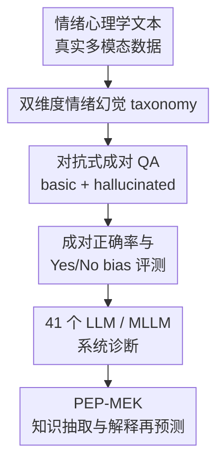

# EmotionHallucer: Evaluating Emotion Hallucinations in Multimodal Large Language Models

**会议**: ICLR2026  
**OpenReview**: [https://openreview.net/forum?id=ahWmeQG3K2](https://openreview.net/forum?id=ahWmeQG3K2)  
**代码**: https://github.com/xxtars/EmotionHallucer  
**领域**: 多模态大模型幻觉评测 / 情绪理解  
**关键词**: 情绪幻觉, 多模态大模型, 评测基准, 情绪心理学, 对抗式问答  

## 一句话总结
EmotionHallucer 是一个面向 MLLM 情绪理解的幻觉评测基准，它把情绪幻觉拆成“情绪心理学知识”和“真实多模态情绪感知”两大维度，用成对的 basic / hallucinated 二元问答检测模型是否既能做基本情绪判断、又能拒绝看似合理但错误的情绪描述，并进一步提出 PEP-MEK 推理框架让模型在多模态情绪感知子集上平均提升 9.90%。

## 研究背景与动机
**领域现状**：多模态大模型已经能处理图像、视频、语音和文本，情绪理解也从传统的文本情感分析、表情识别、语音情绪识别，逐渐走向跨模态的“看见、听见、读懂并解释情绪”。与此同时，MLLM 幻觉评测已经有不少工作关注物体、事实或一般视觉语言问答中的错误生成。

**现有痛点**：情绪理解里的幻觉却没有被单独拆出来评测。一般幻觉基准会问模型图里有没有某个物体、回答是否违背事实，但情绪错误常常更隐蔽：模型可能正确看到一个人皱眉，却把情绪推成兴奋；也可能知道“焦虑”和“恐惧”很接近，却把心理学定义改得似是而非。这样的错误既不是单纯视觉识别错，也不是普通事实问答错，而是感知线索、心理知识和社会语境混在一起后的失真。

**核心矛盾**：人类理解情绪依赖生理反应、认知评价、社会学习和文化规则的长期耦合，MLLM 则主要从数据相关性里学习外在行为线索。模型可以学到“笑脸通常表示开心”，但未必真正区分情绪类别、强度、原因、文化规范和非语言线索之间的关系。因此，若只看模型能否给出一个情绪标签，很难知道它是在理解，还是在把常见模式顺嘴接上。

**本文目标**：作者想回答三个问题：第一，怎样定义并分类 MLLM 的情绪幻觉；第二，现有 LLM / MLLM 在这类幻觉上到底表现如何，哪些模型、哪些模态、哪些任务最脆弱；第三，能否利用情绪心理学知识和显式解释过程，缓解模型在多模态情绪感知中的幻觉。

**切入角度**：论文把情绪幻觉切成两个互补视角。一边是情绪心理学知识，考模型是否知道理论、定义和经验发现；另一边是真实多模态情绪感知，考模型是否能从文本、图像、音频、短视频和长视频里抓住正确情绪线索，并拒绝被伪造的情绪描述带偏。这个角度很实用，因为它同时覆盖“知识事实性”和“输入忠实性”。

**核心 idea**：用心理学知识和真实多模态样本构造 basic / hallucinated 成对二元问答，让模型必须同时答对原始陈述和被篡改陈述，才能算真正抵抗了情绪幻觉。

## 方法详解
### 整体框架
EmotionHallucer 的主体不是训练一个新模型，而是搭建一个专门的情绪幻觉诊断仪。输入侧来自两类来源：权威情绪心理学文本，以及文本、图像、音频、视频情绪理解数据集；标注侧把每个样本加工成 basic question 和 hallucinated question；评测侧要求模型对成对问题做 YES / NO 判断，并用 pair-level accuracy 与 Yes/No bias 指标分析模型是否真的识别出幻觉。基于评测发现，论文还提出 PEP-MEK，把“先抽取多模态与情绪知识、再预测、解释、再预测”的过程作为即插即用缓解框架。

### 关键设计
**1. 双维度情绪幻觉 taxonomy：把情绪错误拆成知识幻觉和感知幻觉**

论文首先明确，情绪幻觉不能只沿用普通物体幻觉的定义。情绪理解既包含“心理学上这句话对不对”，也包含“输入里这些人的表情、语气、语义和社交互动是否支持这个情绪解释”。因此 EmotionHallucer 先分为两大类：Emotion Psychology Knowledge Hallucination 和 Multimodality Perception Hallucination。前者更接近 factuality hallucination，后者更接近 faithfulness hallucination。

知识维度下面有 Theory、Definition、Finding 三类。Theory 检查模型是否理解情绪理论中的关键关系，例如连续维度模型与离散类别模型的差别；Definition 检查焦虑、情绪、认知评价等概念定义是否被篡改；Finding 检查跨文化表达、发展差异等经验发现是否被反转。感知维度下面有 Category、Intensity、Reasoning Result、Reasoning Cue 四类。Category 是情绪类别错配，Intensity 是强弱程度被夸大或压低，Reasoning Result 是线索识别可能正确但最终情绪推理错，Reasoning Cue 则直接检查模型是否遗漏、误读或捏造了支撑情绪判断的关键线索。

这个 taxonomy 的价值在于它把“模型答错情绪题”拆成了可诊断的失败模式。比如一个模型说图中红领带的人很开心，可能是 category 错，也可能是 cue 错；如果模型能看到大家在笑却忽略红领带的人表情严肃，那它的问题就在个体线索绑定和注意力上，而不只是“不懂开心”。

**2. 对抗式成对 QA：用 basic / hallucinated 同时约束能力和抗幻觉性**

EmotionHallucer 没有采用开放式 caption 或让 LLM 当裁判来评分，而是把每个评测样本做成一对二元问题。basic question 保留正确的情绪知识或感知描述，用来确认模型具备基本理解能力；hallucinated question 则在原句基础上做局部篡改，例如把连续维度改成离散类别、把个人主义和集体主义文化结论对调、把正常强度的悲伤改成强烈悲伤，或把图像里某个人的表情错误地描述为开心。

成对评测的关键是：只有 basic 和 hallucinated 两个问题都答对，模型才算这个 pair 正确。这避免了两个常见假象。第一，模型如果只会无脑回答 YES，它可能在 basic 上看起来很高，但会在 hallucinated 上暴露；第二，模型如果只会怀疑一切而回答 NO，也会在 basic 上失败。换句话说，指标不是奖励“乐观”或“保守”，而是奖励模型能区分真实陈述和伪造陈述。

论文还刻意平衡 YES / NO 答案，并报告 Yes Percentage Difference 和 False Positive Ratio。若 $d_y$ 接近 0，说明模型预测 YES 的比例接近真实 YES 比例；若 $r_{fp}$ 接近 0.5，说明错误回答里的 YES / NO 倾向更均衡。这样可以把“模型真的会判断”与“模型有语言先验偏置”分开看。

**3. 跨模态数据构建：让情绪幻觉覆盖文本、图像、音频和视频的真实线索**

数据来源不是单一合成模板。知识部分来自 Shiota 和 Kalat 的情绪心理学教材，筛选清晰、权威、无歧义的理论、定义和经验陈述，再通过增加、删除、反转或扭曲关键概念生成幻觉版本。真实感知部分则来自多个已有情绪理解数据集：SOUL 用于文本主观理解，Twitter15 / Twitter17 用于图像，RAVDESS 用于音频，MER 2023 与 Social-IQ 2.0 用于短视频和长视频。

每个模态的构造都贴着它自己的情绪线索走。文本侧强调评论中的隐含态度和上下文语气；图像侧处理多人场景和细粒度表情绑定；音频侧只看声调、韵律和强度，不依赖语义内容；视频侧同时利用话语、表情、姿态和社会互动，并在 Social-IQ 2.0 这类长视频里保留更复杂的社交推理。标注流程包括数据源选择、样本过滤、basic QA 构造、hallucinated QA 构造，以及两轮 cross review；只有 basic 和 hallucinated 都通过交叉审核，样本才进入最终基准。

最终基准包含 2,742 个问题，覆盖 150 张图像、368 段音频、230 段视频，平均问题长度 31.6 词。这个规模不算巨型，但它的重点不是堆题量，而是把情绪心理学知识、现实多模态线索和对抗式幻觉扰动放在同一套评测协议里。

**4. PEP-MEK：用情绪知识抽取和解释再预测缓解感知幻觉**

评测结果显示，模型在情绪心理学知识上通常比在多模态感知上强很多。作者据此提出 PEP-MEK，也就是 Predict-Explain-Predict with Modality and Emotion Knowledge。它不是重新训练模型，而是在推理时加一个结构化过程：先让模型从输入中抽取 modality knowledge 和 emotion knowledge，再根据这些知识做第一次 YES / NO 预测，然后要求模型解释自己的初始答案、检查事实和逻辑，最后给出第二次 YES / NO。

这里的 MEK 抽取不是普通“描述图片/视频”。prompt 会要求模型列出整体场景氛围、人物数量、表情、头部姿态、视线、身体姿态、手势、语音语调、文本情绪词、人物关系、互动状态、情绪类别、强度以及可能原因。也就是说，模型被迫先把支撑情绪判断的证据摊开，再回答问题。Explain 阶段则让模型把初始答案和证据对照起来，检查解释是否事实准确、逻辑是否成立。

这套设计特别针对情绪任务的两个薄弱点：一是模型容易忽略细小但关键的个体线索，二是模型容易从“整体氛围”跳到错误的个人结论。PEP-MEK 的定性例子里，Qwen2.5-Omni 初始认为“红领带的人表情开心”成立；加入解释后，模型注意到多数人微笑，但红领带的人本身并不明显开心，最终把答案改为 NO。这说明它的改进来自更细粒度的证据绑定，而不是简单多想几步。

### 损失函数 / 训练策略
本文没有训练新模型，也没有提出新的优化损失。EmotionHallucer 是评测基准，核心是数据构建与 pair-level evaluation；PEP-MEK 是推理时 prompt 框架，使用默认超参数调用各模型。对于小于 235B 参数的模型，作者在单张或四张 A100 上本地运行；更大的闭源模型通过开发者 API 访问。PEP-MEK 的计算代价主要来自额外的知识抽取和解释轮次，附录报告了 token cost 与 wall-clock latency，用来说明性能增益和推理开销之间的取舍。

## 实验关键数据

### 主实验
论文评测了 41 个 LLM / MLLM，并根据是否支持音频分成完整 EmotionHallucer 和 NoAudio 子集。完整四模态评测里，只有 Qwen2.5-Omni、Emotion-LLaMA、Gemini-2.5-Flash、Gemini-2.5-Pro 等少数模型能覆盖所有输入；NoAudio 子集则能纳入更多视觉语言模型。

| 设置 | 模型 | Basic ↑ | Hallucinated ↑ | Overall ↑ | Yes/No bias 观察 |
|------|------|---------|----------------|-----------|------------------|
| EmotionHallucer 全模态 | Qwen2.5-Omni-7B | 52.81 | 63.46 | 18.65 | $d_y=-0.05$, $r_{fp}=0.44$，偏置相对温和但整体很低 |
| EmotionHallucer 全模态 | Emotion-LLaMA-7B | 72.88 | 33.45 | 15.43 | $d_y=0.20$, $r_{fp}=0.71$，明显偏向 YES |
| EmotionHallucer 全模态 | Gemini-2.5-Flash | 69.41 | 68.15 | 45.06 | $d_y=0.01$, $r_{fp}=0.51$，准确率和偏置都最好之一 |
| EmotionHallucer 全模态 | Gemini-2.5-Pro | 70.30 | 67.56 | 44.17 | $d_y=0.01$, $r_{fp}=0.52$，与 Flash 接近 |
| EmotionHallucer-NoAudio | Qwen2.5-VL-72B | 78.08 | 62.15 | 43.02 | 开源模型中最好，超过随机基线 |
| EmotionHallucer-NoAudio | GPT-5 | 67.10 | 78.17 | 49.35 | hallucinated 识别强，但 basic 相对保守 |
| EmotionHallucer-NoAudio | Gemini-2.5-Pro | 81.31 | 67.01 | 51.58 | NoAudio 子集最佳 overall |

最直接的结论是：当前模型在情绪幻觉上离可靠还很远。完整四模态设置中，开源模型整体 accuracy 都低于 25% 的随机猜测基线；闭源 Gemini 系列表现明显更好，但 overall 也只有 45% 左右。NoAudio 子集稍容易一些，Gemini-2.5-Pro 达到 51.58%，Qwen2.5-VL-72B 作为开源模型达到 43.02%，但仍说明视觉/文本情绪幻觉不是已解决问题。

更细粒度的单模态分析显示，模型在 Emotion Knowledge 上最好，然后从文本感知、图像感知、音频感知到视频感知逐步变差。作者认为原因有两点：当前模型训练仍以文本知识为主，情绪知识问答更像结构化知识检索；而真实多模态情绪理解缺少高质量细粒度标注，尤其是音频和视频中的情绪线索需要跨时间、跨人物、跨社会语境整合。

### 消融实验
PEP-MEK 的实验集中在 EmotionHallucer-P，也就是多模态感知幻觉部分。它比较 Original input、只加入 MEK、以及完整 MEK + Explain 三种设置，并进一步比较去掉 emotion-specific guidance 的 PEP-MK。

| 配置 | Qwen2.5-Omni Overall ↑ | Emotion-LLaMA Overall ↑ | Gemini-2.5-Flash Overall ↑ | 说明 |
|------|-------------------------|--------------------------|-----------------------------|------|
| Original input | 10.49 | 9.65 | 33.44 | 直接对问题做 YES / NO 判断 |
| + MEK | 15.58 | 19.12 | 35.84 | 先抽取多模态与情绪知识，再预测 |
| + MEK + Explain / PEP-MEK | 20.15 | 26.03 | 37.84 | 再加入解释、验证和第二次预测 |
| + PEP-MK | 13.21 | 16.80 | 30.55 | 只抽取通用模态知识，去掉情绪知识指导 |
| + PEP-MEK | 20.15 | 26.03 | 37.84 | 情绪知识指导恢复后显著更好 |

这组消融说明两件事。第一，MEK 本身就能提升，说明让模型先显式列出情绪相关线索，比直接判断更稳。第二，Explain 阶段继续提升，说明“解释并验证”不是纯粹的格式装饰，而能让模型重新检查初始预测中的证据绑定问题。Emotion-LLaMA 从 9.65 提到 26.03，是最大受益者，也同步改善了 YES 偏置。

论文还把 PEP-MEK 和 CoT、majority voting、self-consistency、心理学 RAG 做比较。在 Qwen2.5-Omni 上，CoT overall 为 14.79，majority voting 为 10.78，self-consistency 为 17.31，RAG 为 13.40，而 PEP-MEK 达到 20.15。这个结果很有意思：泛化推理技巧确实能帮一点，但不如把计算预算花在“情绪线索抽取 + 情绪知识解释”上。

### 关键发现
- 当前 MLLM 普遍有情绪幻觉问题，尤其是完整四模态输入下，开源模型 overall 很低；闭源模型更强，但也远未达到可以放心部署到情绪敏感场景的水平。
- 情绪心理学知识比真实多模态情绪感知容易。模型更擅长回答“概念/理论/发现是否正确”，不擅长从图像、音频、视频里稳定绑定人物、线索、强度和原因。
- YES/NO bias 很重要。Emotion-LLaMA 在 basic 上很高，但 hallucinated 上很低，说明情绪专门模型可能更容易相信情绪描述，而不是更会识别情绪幻觉。
- PEP-MEK 的收益来自任务特定结构化推理，而不是简单延长回答。去掉 emotion-specific knowledge 后，PEP-MK 明显弱于 PEP-MEK；这说明情绪类别、强度、线索和原因这些心理学维度是关键。
- 视频和音频仍是难点。长视频需要跨时间整合情绪线索，音频需要解析语调、节奏和强度；这些恰好是当前通用 MLLM 训练最薄弱的部分。

## 亮点与洞察
- **把情绪幻觉定义清楚了**：论文没有笼统说“模型情绪理解不好”，而是把幻觉拆成理论、定义、发现、类别、强度、推理结果、推理线索七类。这让后续研究可以具体讨论模型错在哪里，而不是只报一个情绪识别 accuracy。
- **成对 QA 是很务实的评测协议**：开放式情绪描述更贴近真实应用，但自动评分很不稳定；EmotionHallucer 先用 basic / hallucinated pair 做受控诊断，是一个更可靠的起点。pair-level accuracy 也比单题 accuracy 更能压住 YES 偏置。
- **情绪专门模型未必更抗幻觉**：Emotion-LLaMA 的 basic 表现高，但 hallucinated 表现低，提示情绪微调可能强化“看到情绪描述就认同”的倾向。对情绪安全应用来说，拒绝错误情绪解释和生成正确情绪解释同样重要。
- **PEP-MEK 的启发可以迁移**：很多多模态幻觉都不是“没看见”，而是“看见了但证据绑定错了”。把输入先转成结构化线索，再让模型解释和复核，可能也适用于医疗图像报告、社交场景理解、动作意图推理等需要细粒度证据绑定的任务。
- **心理学知识不是装饰**：作者不是简单往 prompt 里加“think step by step”，而是让模型显式考虑情绪类别、强度、原因、表情、姿态、语调和社交互动。这提醒我们，垂直领域幻觉缓解往往需要领域本体，而不只是通用推理模板。

## 局限与展望
- 基准仍然有人工标注噪声。虽然作者用了 cross review，但情绪理解本身具有主观性，尤其是强度、原因和社交语境判断，很难完全消除标注者分歧。
- 当前交互语言是英语，尚未系统评测跨语言、跨文化情绪差异。情绪表达的 display rules、非语言规范和情绪词粒度都受文化影响，用英文问题去问多文化样本只能覆盖其中一部分。
- 二元 QA 可控但不够真实。真实应用中，模型往往输出开放式描述或建议，幻觉可能出现在长答案的某个 span、某条因果解释或某个错误归因里。作者在未来工作中也提到要探索 structured open-ended annotation，把实体、激活/未激活线索、情绪类别、强度和推理路径分开标注。
- PEP-MEK 需要额外推理成本。附录显示它增加 token 和延迟，尤其在长视频场景中成本更明显。安全敏感任务可以接受这种换取稳健性的开销，但大规模实时交互系统需要进一步优化。
- 论文揭示了现象，但对根因分析还不够深。模型为什么在音频/视频情绪线索上失败，是预训练偏置、模态对齐问题、缺少情绪监督，还是推理链内部表征混乱，仍需要机制层面研究。

## 相关工作与启发
- **vs 一般 MLLM 幻觉评测**: 物体幻觉、caption 幻觉或通用视觉问答幻觉主要检查输出是否忠实于图像事实；EmotionHallucer 则检查情绪知识、情绪线索和情绪推理是否被扭曲。它的优势是领域更细，劣势是覆盖面更窄、标注更依赖心理学和情绪理解专业判断。
- **vs 情绪识别 / 多模态情绪理解数据集**: RAVDESS、MER 2023、SOUL 等数据集通常评测模型能否识别情绪类别、强度或情感倾向；EmotionHallucer 把这些样本改造成 basic / hallucinated 对抗问答，关注“模型能否拒绝错误情绪陈述”。这比传统分类 accuracy 更接近可靠性评测。
- **vs CoT / self-consistency / RAG 幻觉缓解**: 通用 CoT 和 self-consistency 能让模型多想或多采样，RAG 能补知识，但它们不一定知道情绪任务该看哪些线索。PEP-MEK 的启发是：先设计领域相关的证据槽位，再让模型围绕这些槽位解释和复核。
- **对后续工作的启发**: 可以把 EmotionHallucer 扩展成开放式标注基准，检测长回答中具体哪个情绪线索或推理步骤幻觉；也可以做跨文化情绪幻觉评测，比较模型对不同文化 display rules 的稳定性；还可以结合表征分析，寻找模型内部是否存在可解释的情绪线索绑定失败模式。

## 评分
- 新颖性: ⭐⭐⭐⭐☆ 首个专门面向 MLLM 情绪幻觉的基准，taxonomy 和 pair-level 评测很有辨识度，但 PEP-MEK 本身更像 prompt 框架而非模型级新方法。
- 实验充分度: ⭐⭐⭐⭐☆ 覆盖 41 个模型、多个模态、主实验和 PEP-MEK 消融都比较完整；不足是开放式评测和跨文化评测还停留在未来方向。
- 写作质量: ⭐⭐⭐⭐☆ 论文结构清楚，基准定义、实验和缓解框架衔接自然；部分表格和附录信息较多，读者需要来回对照才能完全理解各子集。
- 价值: ⭐⭐⭐⭐⭐ 情绪理解是高风险的人机交互能力，EmotionHallucer 把“会识别情绪”和“不会编造情绪”分开评测，对情绪安全、社会智能和多模态可靠性研究都很有用。

<!-- RELATED:START -->

## 相关论文

- [\[ICLR 2026\] Dynamic Multimodal Activation Steering for Hallucination Mitigation in Large Vision-Language Models](dynamic_multimodal_activation_steering_for_hallucination_mitigation_in_large_vis.md)
- [\[CVPR 2026\] Evaluating and Easing Hallucinations for GUI Grounding](../../CVPR2026/hallucination/exposing_and_evaluating_hallucinations_for_gui_grounding.md)
- [\[ICLR 2026\] Look Carefully: Adaptive Visual Reinforcements in Multimodal Large Language Models for Hallucination Mitigation](look_carefully_adaptive_visual_reinforcements_in_multimodal_large_language_model.md)
- [\[ACL 2025\] Beyond Facts: Evaluating Intent Hallucination in Large Language Models](../../ACL2025/hallucination/intent_hallucination_eval.md)
- [\[AAAI 2026\] Verb Mirage: Unveiling and Assessing Verb Concept Hallucinations in Multimodal Large Language Models](../../AAAI2026/hallucination/verb_mirage_unveiling_and_assessing_verb_concept_hallucinations_in_multimodal_la.md)

<!-- RELATED:END -->
