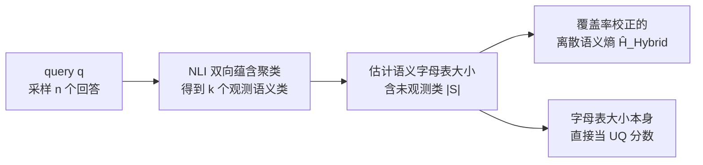

# Estimating Semantic Alphabet Size for LLM Uncertainty Quantification

**会议**: ICLR 2026  
**OpenReview**: [https://openreview.net/forum?id=uYK6GPVg1O](https://openreview.net/forum?id=uYK6GPVg1O)  
**代码**: 待确认  
**领域**: LLM 不确定性量化 / 幻觉检测  
**关键词**: 语义熵、不确定性量化、幻觉检测、黑盒方法、unseen species、Good-Turing、覆盖率校正  

## 一句话总结
本文指出经典「离散语义熵」(DSE) 在小样本下会系统性低估真实语义熵，借鉴种群生态学的「未见物种」问题提出一个混合语义字母表大小估计器，并据此对 DSE 做样本覆盖率校正，让黑盒不确定性估计在更可解释的前提下追平甚至超过 KLE、SNNE 等复杂 SOTA 方法。

## 研究背景与动机
**领域现状**：大模型在风险敏感场景需要「拿不准就弃答」的能力，因此要可靠地量化其内在不确定性 (UQ)。在商用推理 API 场景下，模型内部激活和 token 对数概率往往拿不到，只能走「黑盒」路线——靠多次采样 LLM 的输出来估计不确定性。Kuhn et al. (2023) 提出的语义熵 (SE) 是这条路上的代表：把多个回答按语义等价类聚类，再在语义类上算熵。Farquhar et al. (2024) 进一步给出适合黑盒的离散版本 DSE，直接用语义类的经验频率代替概率。

**现有痛点**：黑盒 UQ 的根本约束是「采样贵」——每多采一个回答就是一次完整推理，大规模部署时财务/算力都吃不消，所以**必须从极少样本（典型 $n=10$）里就估准**。但近期把 SE 做强的工作（KLE 用核方法把图节点嵌入、SNNE 引入相似度函数和尺度参数）都是以牺牲可解释性、增加超参数为代价换性能。

**核心矛盾**：DSE 本质是熵的「插值估计器」(plugin estimator)，而插值估计器有理论上已知的负偏差。在小样本下，能被观测到的语义类数 $k$ 远小于真实的语义字母表大小 $|S|$（即处于「欠采样区」），导致经验分布比真实分布更「不惊讶」，于是 **DSE 系统性低估真实语义熵**（论文用 Figure 2 实证：DSE/SE\* 的比值长期低于 1）。

**本文目标**：在不牺牲可解释性、不堆超参数的前提下，修正这种低估，做到「少样本也估得准」。

**核心 idea**（标签加粗）：**把语义类聚类问题对应到生态学的「未见物种」问题**——给定 $n$ 个观测样本，要估计还有多少物种没被采到。语义类就是「物种」，于是可以直接搬用 Good-Turing 覆盖率与 Chao-Shen 覆盖率校正熵这套成熟工具来补偿未观测语义类。

## 方法详解

### 整体框架
方法分三步（对应论文 Figure 1）：先对 query $q$ 采样 $n$ 个 LLM 回答；再用 NLI 模型按「双向蕴含=同义」把回答聚成语义等价类；最后**不直接用观测到的类数 $k$ 当字母表大小**，而是估计包含未观测类在内的真实语义字母表大小 $\hat{|S|}$，并用它对离散语义熵做覆盖率校正。整套流程只依赖回答文本本身（黑盒），不需要内部概率。

### 关键设计

**1. 从覆盖率估计语义字母表大小：把 Good-Turing 搬进语义熵。** 插值 DSE 隐含地假设字母表大小就是观测到的类数 $k$（Lin et al. 称为 NumSets），在欠采样区必然偏小。论文借用生态学的样本覆盖率 $C=k/|S|$（已采到的类占全部类的比例）。Good-Turing 用「只出现一次的类」（singleton，数量记 $f_1$）来估覆盖率 $\hat{C}_{GT}=1-\frac{f_1}{n}$——直觉是：如果还有很多孤例，说明没采全。由此反解出一个字母表大小估计器 $\hat{|S|}_{GT}=\frac{kn}{n-f_1}$。singleton 越多，估出的字母表越大，正好补偿被漏掉的稀有语义类。

**2. 混合字母表大小估计器：用谱方法补 Good-Turing 的死角。** $\hat{|S|}_{GT}$ 有两处失效：当 $f_1=0$（没有孤例）时它退化回 NumSets；当所有样本互不同义（$f_1=n$）时分母为零、直接无定义。另一边，Lin et al. (2024) 的连续谱估计器 $U_{EigV}=\sum_{i=1}^{n}\max(0,1-\lambda_i)$（$\lambda_i$ 是回答相似度图归一化拉普拉斯的特征值）虽然平滑，但可能小于 $k$，违反「$k$ 是 $|S|$ 下界」这一硬约束。本文取两者之长，提出混合估计器：

$$\hat{|S|}_{Hybrid}=\begin{cases}U_{EigV}, & f_1=n\\ \max\left(\hat{|S|}_{GT},\,U_{EigV}\right), & \text{otherwise}\end{cases}$$

即正常情况下取两个估计的较大值（既不低于 $k$，又能吸收谱方法的平滑信号），只有在「全互异」这个 Good-Turing 失效的极端时才退回谱估计器。

**3. 混合覆盖率校正熵：把字母表估计回灌进 Chao-Shen 熵。** Chao & Shen (2003) 给出一个覆盖率校正的离散熵 $\hat{H}_{CS}$，用估计覆盖率 $\hat{C}_{GT}$ 去缩放经验频率 $\hat{p}_i$ 并做去偏校正。本文把其中的覆盖率项替换成上面的混合字母表估计，得到混合 DSE：

$$\hat{H}_{Hybrid}=-\sum_{i=1}^{k}\frac{\frac{k\hat{p}_i}{\hat{|S|}_{Hybrid}}\log\left(\frac{k\hat{p}_i}{\hat{|S|}_{Hybrid}}\right)}{1-\left(1-\frac{k\hat{p}_i}{\hat{|S|}_{Hybrid}}\right)^n}$$

分子里 $\frac{k\hat{p}_i}{\hat{|S|}_{Hybrid}}$ 相当于用更大的字母表「稀释」经验频率，把概率质量分给未观测类；分母 $1-(1-\cdot)^n$ 是对「该类至少被采到一次」的去偏修正。最终效果是把被插值估计器低估的熵补回去。

**4. 一个反直觉的副产物：字母表大小本身就是好分数。** 既然语义类数和不确定性强相关，论文索性把 $\hat{|S|}_{Hybrid}$ 和 $U_{EigV}$ 这两个「字母表大小估计器」直接当作不确定性分数用于幻觉检测——不再额外算熵，单纯数「能采出多少种语义」就当置信度，呼应了 Kuhn et al. (2023) 「观测到的语义类数本身就是合理的不确定性度量」的观察。

## 实验关键数据

**设置**：5 个指令微调模型（Gemma-2-9B、Gemma-3-12B、Llama-3.1-8B、Mistral-v0.3-7B、Phi-3.5-3.8B），4 个 QA 数据集（HotpotQA、SQuAD 2.0、BioASQ、自建多答案集 POTATO）。$\tau=1.0$ 采样算不确定性，$\tau=0.1$ 取「best guess」判对错。典型样本量 $n=10$。以「白盒 SE @ $n=100$」记作 $SE^*$ 当作真值代理。

### 主实验：SE 估计精度（MSE，越低越好，节选 HotpotQA/BioASQ）

| 数据集 | 估计器 | Gemma-2-9B | Llama-3.1-8B | Mistral-7B | Phi-3.5 |
|---|---|---|---|---|---|
| HotpotQA | $\hat{H}_{Plugin}$ (DSE) | 0.46 | 0.68 | 0.59 | 0.61 |
| HotpotQA | $\hat{H}_{CS-GT}$ | 0.39 | 0.56 | 0.46 | 0.47 |
| HotpotQA | **$\hat{H}_{Hybrid}$** | **0.30** | **0.45** | **0.39** | **0.39** |
| BioASQ | $\hat{H}_{Plugin}$ (DSE) | 1.64 | 1.68 | 2.04 | 1.82 |
| BioASQ | $\hat{H}_{CS-GT}$ | 0.96 | 1.06 | 1.31 | 0.99 |
| BioASQ | **$\hat{H}_{Hybrid}$** | **0.78** | **0.80** | **0.73** | **0.83** |

混合 DSE 在 5 模型 × 4 数据集的几乎所有组合上取得最低 MSE，BioASQ 上把插值 DSE 的误差砍掉一半以上。

### 消融 / 排名实验：幻觉检测（AUROC → Bradley-Terry 潜在强度排名）

| 现象 | 结果 |
|---|---|
| 混合 DSE vs 其他显式 SE 估计器 | $\hat{H}_{Hybrid}$ 在显式 SE 估计器中排名最高，**超过白盒 SE** |
| 字母表大小估计器 vs 复杂 UQ | $\hat{|S|}_{Hybrid}$ (rank CI [1,4]) 与 $U_{EigV}$ (rank CI [1,3]，最高潜在强度) 跻身前列 |
| 与 KLE 对比 | KLE rank CI [1,3]，三者并列顶端，均优于白盒 SE 和其他显式 SE |

### 关键发现
- **DSE 确实系统性低估**：DSE/$SE^*$ 比值跨样本量长期低于 1，实证印证插值估计器负偏差理论。
- **覆盖率校正稳定降偏差**：混合 DSE 在多数样本量下都比插值 DSE 更接近 $SE^*$；唯一过冲出现在 Gemma-3-12B 的 POTATO 上，溯源仅由 3 个近零熵异常样本驱动，剔除后恢复正常。
- **越简单越能打**：仅靠「数语义类」的字母表大小估计器，能跑赢 SNNE（rank 固定在 6）等复杂黑盒方法，且全程保持高可解释性。

## 亮点与洞察
- **跨学科迁移漂亮**：把「未见物种估计」这套生态学统计工具（Good-Turing、Chao-Shen）干净地映射到语义熵估计，理论根基扎实、可解释性强，而非堆神经网络。
- **混合设计很务实**：精确点出 $\hat{|S|}_{GT}$ 和 $U_{EigV}$ 各自的失效边界，用 $\max$ + 分支条件互补，既守住「$\ge k$」的硬约束又吸收谱信号。
- **评测方法学考究**：不止报 AUROC 点估计，而用 DeLong CI + Bradley-Terry 潜在强度 + 蒙特卡洛模拟比赛 + 排名 CI，认真处理「AUROC 本身有不确定性」这件被多数 UQ 论文忽略的事。
- **反直觉结论有价值**：「字母表大小本身就能当 UQ 分数、还能赢复杂方法」，提醒社区不必盲目追求方法复杂度。

## 局限与展望
- **依赖真值代理**：以白盒 SE @ $n=100$ 当「真实语义熵」，本身是近似，结论的绝对意义受此假设约束。
- **聚类质量瓶颈**：整套方法建立在 NLI 双向蕴含聚类之上，语义等价判定出错会直接污染字母表大小估计，论文未深究这一上游误差。
- **POTATO 过冲未根治**：靠剔除近零熵样本来「恢复」模式，说明在某些分布（答案类别极多）下校正仍不稳。
- **场景受限**：实验都是句子级 QA，长文本生成、多轮对话等场景下语义聚类与覆盖率假设是否成立未验证。
- **Good-Turing 的样本量敏感性**：$f_1$ 在 $n=10$ 这种极小样本下方差大，覆盖率估计本身可能抖动，未来可结合更稳健的覆盖率估计或贝叶斯先验。

## 相关工作与启发
- **语义熵谱系**：Kuhn et al. (2023) SE → Farquhar et al. (2024) 离散 DSE → Nikitin et al. (2024) KLE / Nguyen et al. (2025) SNNE（往复杂方向走），本文反其道而行，往「更简单更可解释」方向修正 DSE 的统计偏差。
- **未见物种 / 熵估计**：Fisher (1943)、Good (1953) Good-Turing、Chao & Shen (2003) 覆盖率校正熵，是本文的理论来源；插值估计器负偏差由 Basharin (1959)、Harris (1975) 奠基。
- **早期 LLM UQ**：Linguistic Confidence (Mielke et al. 2022)、P(True) (Kadavath et al. 2022)、SelfCheckGPT 等自评式方法是另一条线，本文聚焦采样式黑盒路线。
- **启发**：当一个领域的指标在「小样本」下系统性失真时，去隔壁成熟统计学科（生态学、信息论）找去偏工具，往往比堆模型更划算；同时「评测指标本身的不确定性」值得被认真建模。

## 评分
- 新颖性: ⭐⭐⭐⭐ — 跨学科把未见物种估计迁移到语义熵的视角清新，混合估计器设计巧妙；但底层工具（Good-Turing/Chao-Shen）是现成的，属于「漂亮的组合创新」而非全新方法。
- 实验充分度: ⭐⭐⭐⭐ — 5 模型 × 4 数据集，估计精度与幻觉检测双任务，评测方法学（Bradley-Terry + 排名 CI）严谨；扣分在仅限句子级 QA、真值依赖白盒 SE 代理。
- 写作质量: ⭐⭐⭐⭐ — 动机—理论—方法—实验链条清晰，公式与图配合到位，对失效边界和异常样本诚实交代。
- 价值: ⭐⭐⭐⭐ — 黑盒少样本 UQ 是部署可信 LLM 的刚需，「简单可解释方法能追平复杂 SOTA」的结论对实践直接有用。

<!-- RELATED:START -->

## 相关论文

- [\[CVPR 2026\] Thinking in Uncertainty: Mitigating Hallucinations in MLRMs with Latent Entropy-Aware Decoding](../../CVPR2026/hallucination/thinking_in_uncertainty_mitigating_hallucinations_in_mlrms_with_latent_entropy-a.md)
- [\[ACL 2026\] 为什么 LLM 在结构化知识上产生幻觉：推理过程的机制分析](../../ACL2026/hallucination/why_llms_hallucinate_on_structured_knowledge_a_mechanistic_analysis_of_reasoning.md)
- [\[ACL 2026\] Two Pathways to Truthfulness: On the Intrinsic Encoding of LLM Hallucinations](../../ACL2026/hallucination/two_pathways_to_truthfulness_on_the_intrinsic_encoding_of_llm_hallucinations.md)
- [\[ACL 2025\] HalluLens: LLM Hallucination Benchmark](../../ACL2025/hallucination/hallulens_llm_hallucination_benchmark.md)
- [\[ICML 2026\] REALISTA: Realistic Latent Adversarial Attacks that Elicit LLM Hallucinations](../../ICML2026/hallucination/realista_realistic_latent_adversarial_attacks_that_elicit_llm_hallucinations.md)

<!-- RELATED:END -->
