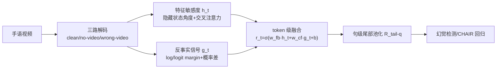

# Grounding or Guessing? Visual Signals for Detecting Hallucinations in Sign Language Translation

**会议**: ICLR 2026  
**OpenReview**: [https://openreview.net/forum?id=bLFW2T3UHq](https://openreview.net/forum?id=bLFW2T3UHq)  
**代码**: 待确认  
**领域**: 多模态幻觉检测 / 手语翻译  
**关键词**: 手语翻译, 幻觉检测, 视觉接地, 反事实扰动, 可靠性评分  

## 一句话总结
本文首次研究手语翻译（SLT）中的幻觉问题，提出一个 token 级"可靠性"分数，用特征敏感度 + 反事实扰动量化解码器到底是"看视频接地"还是"靠语言先验猜测"，从而无需参考译文即可预测幻觉风险，并揭示 gloss-free 模型为何更容易幻觉。

## 研究背景与动机
**领域现状**：手语翻译本质是 video→text，但与一般视频理解任务根本不同——手语是一门有自己词汇和语法的完整自然语言，视觉模态不是辅助信息而是**源语言本身**。早期方法依赖 gloss（人工标注的视频→手语标签）提供强对齐监督，但 gloss 标注昂贵、难扩展；近年主流转向以 LLM 为骨干的 gloss-free 架构。

**现有痛点**：gloss-free 模型把连续的手语动作直接映射成自然语言，缺少 gloss 这一中间对齐监督。当视觉表示薄弱（手势模糊或视频质量差）时，语言模型会主导解码，产出**流畅但脱离手语者真实意图**的译文，即幻觉。这与大型视觉语言模型（LVLM）中"语言先验压过视觉证据"的现象同源。

**核心矛盾**：现有幻觉检测的文本侧信号（置信度、熵、困惑度）只能捕捉语言上的不确定性，却**无法判断输出是否真被视觉输入支撑**。在 SLT 里视觉就是源语言，幻觉直接等价于翻译错误，所以"量化视觉接地程度"才是关键。

**本文目标**：给每个生成 token 一个可靠性分数，量化它依赖视频证据还是语言先验，并把信号汇聚成句级风险分，用于无参考的幻觉排序与检测。

**核心 idea**：**"接地 vs 猜测"作为透镜**——通过对比正常解码与反事实解码（视频被掩码或替换为错误视频），同时从"内部状态变化"和"输出概率优势"两个角度衡量视频到底有没有真正帮助预测，把这两类证据线性融合成 token 级可靠性，再池化成句级分数。

## 方法详解

### 整体框架
方法在每个解码步并行跑三遍解码器：用真实视频（clean）、无视频（cross-attention 关闭）、错误视频（mismatched）。从中提取两类信号——**特征敏感度**（隐藏状态/交叉注意力在去掉视频时的漂移，反映内部依赖）与**反事实信号**（真实视频相对错误/无视频的概率优势，反映外部证据）。两类信号经线性融合 + sigmoid 得到 token 级可靠性 $r_t$，再用尾部池化得到句级可靠性，输入下游分类器/回归器预测幻觉。

### 关键设计

**1. 特征敏感度信号：度量内部对视觉的依赖。** 核心直觉是——如果去掉视频后解码器的内部状态几乎不变，说明这个 token 本来就没在"看"视频。一方面用**隐藏状态方向变化**刻画：把有视频 $h_t^{vid}$ 与掩码输入 $h_t^{0}$ 之间的夹角归一化为 $s_t^{hid}=\pi^{-1}\arccos\frac{\langle h_t^{vid}, h_t^{0}\rangle}{\|h_t^{vid}\|\|h_t^{0}\|}$，角度越大说明方向偏转越剧烈、对视频依赖越强。另一方面用**交叉注意力质量**刻画：对所有层和头聚合解码器指向视频编码位置的注意力均值，再减去掩码输入下的对应质量并做分位数缩放到 $[0,1]$，即 $s_t^{attn}$，值越大代表越倚重接地的视频信息。

**2. 反事实信号：度量视频是否真的有用。** 特征信号只说明状态"变了"，但没说明视频是否**积极地帮助了所选 token**。为此跑三路解码，对 clean 选出的 token $y_t$ 定义反事实分布 $p_{cf}(y_t|c_t)=\max\big(p_0(y_t|c_t),\, p_{mis}(y_t|c_t,x')\big)$——取无视频与错误视频中**更强的那个对手**而非平均，是为了避免假阳性：只要任一对手已能几乎同样好地解释 $y_t$，这个 token 就该判为未接地。在此基础上算五个互补度量：log 概率边际 $s_t^{log}=\log p_{vid}(y_t)-\log p_{cf}(y_t)$、尺度稳定的 logit 边际 $s_t^{logit}$、归一化概率增益 $s_t^{prob}=\sigma(s_t^{log})$，以及相对无视频/错误视频的绝对概率优势 $\Delta_t^{clean}$、$\Delta_t^{mis}$。边际反映跨尺度的相对强度，delta 给出绝对概率增益，两者互补——当且仅当真实视频让 token 比两种反事实都更可能时，可靠性才高。

**3. token 级与句级融合。** 把特征信号 $h_t=(s_t^{hid}, s_t^{attn})$ 与反事实信号 $g_t$（含 5 个 margin/delta 及原始概率，共 7 维）做线性融合：$r_t=\sigma(w_{fb}^\top h_t + w_{cf}^\top g_t + b)$。由于幻觉监督只在句级可得，再用**尾部池化**把 $\{r_t\}$ 聚成定长特征：$R_{tail\text{-}q}=\frac{1}{\lceil qT\rceil}\sum_{t\in\text{lowest }q\%} r_t$，主用 tail-10（最低 10% token 的均值）。这是因为幻觉恰恰藏在可靠性分布的**低尾**——那里聚集的多是"猜出来"的 token，用尾部统计比整句均值更敏感。

**4. 文本基线与 META 融合。** 用单调的等渗回归（ISO）把可靠性赤字映射到幻觉率 $\text{CHAIR}\approx\text{ISO}(1-R^*)$，从而跨数据集/模型可比。同时给出 META 变体：把接地信号与文本侧不确定性（置信度、熵、困惑度）拼接后过线性层，验证视觉接地是否提供了文本信号之外的**互补信息**。

## 实验关键数据

### 主实验表格
在 PHOENIX-2014T（DGS→DE）与 CSL-Daily（CSL→ZH）两个数据集、gloss-free（SpaMo）与 gloss-based（TwoStream-SLT）两类模型上评测。检测以 CHAIR>0 为幻觉标签，指标 AUC / AP / ACC@0.5；回归报告 Pearson / Spearman / ISO。

| 方法 | CSL-GB (AUC/AP/ACC) | CSL-GF | PHOENIX-GB | PHOENIX-GF |
|------|------|------|------|------|
| Grounding (ours) | 0.803/0.991/0.963 | 0.951/0.998/0.970 | 0.827/0.954/0.899 | 0.918/0.986/0.938 |
| **META (ours)** | **0.865/0.994/0.753** | **0.963/0.999/0.883** | **0.899/0.978/0.864** | **0.940/0.992/0.872** |
| Confidence | 0.647/0.976/0.508 | 0.953/0.998/0.868 | 0.618/0.887/0.645 | 0.926/0.989/0.860 |
| Perplexity | 0.609/0.980/0.610 | 0.952/0.998/0.842 | 0.595/0.892/0.561 | 0.888/0.979/0.713 |
| Token entropy | 0.729/0.985/0.665 | 0.958/0.998/0.866 | 0.639/0.900/0.581 | 0.871/0.975/0.731 |

相比熵/困惑度，最多 +0.20 AUC、+0.30 ACC；AP 接近 0.99。摘要给出整体检测准确率约 97%、回归 Spearman ρ=0.72。

### 消融实验表格
论文围绕特征 vs 反事实信号、池化算子（mean vs tail-10%）做消融，并在视觉退化（高斯噪声、时间下采样、随机丢帧）与语言退化（错误起始 prompt 前缀）下做压力测试。

| 回归 (Pearson/Spearman/ISO) | CSL-GF | PHOENIX-GF |
|------|------|------|
| Grounding (ours) | -0.682/-0.680/0.722 | -0.623/-0.590/0.650 |
| **META (ours)** | **-0.736/-0.705/0.755** | **-0.650/-0.613/0.675** |
| Confidence | -0.685/-0.657/0.714 | -0.612/-0.578/0.637 |
| Token entropy | -0.670/-0.698/0.748 | -0.468/-0.544/0.625 |

### 关键发现
- **可靠性与幻觉强负相关**：grounding usage 越高，CHAIR 越低，跨数据集、跨架构一致；gloss-free 模型相关性更强（幻觉更多→监督更丰富→负斜率更陡）。
- **接地信号本身就超过文本基线**，融合文本信号的 META 进一步最优，证明视觉接地提供了文本概率之外的互补信息。
- **gloss-free 比 gloss-based 幻觉更多**，根因是前者系统性地**少用视觉信息**、默认回退到语言先验。
- 可靠性在视觉退化下随之下降，且能区分"接地 token"与"猜测 token"，支持无参考的风险估计。

## 亮点与洞察
- **问题首创**：明确指出并首次系统研究 SLT 中的幻觉——这里视觉是源语言，幻觉直接等价于翻译错误，比一般 LVLM 的物体幻觉更尖锐。
- **诊断视角巧妙**：把"幻觉"重新框定为"视觉接地不足"，用反事实三路解码把抽象的"接地"变成可量化、可解释的 token 级分数。
- **取 max 而非 mean 的反事实设计**很关键，从原理上避免了"只要有一种反事实能解释 token 就误判为接地"的假阳性。
- **尾部池化**抓住了幻觉藏在低可靠性尾部的本质，比整句均值更对症。

## 局限与展望
- 幻觉标签依赖 CHAIR（基于实体重叠），本身是近似度量，可能漏掉非实体类的语义幻觉。
- 方法需要对每个 token 跑三路解码（clean/no-video/wrong-video），推理开销较大，难直接用于在线低延迟场景。
- 只在两个数据集、两种架构上验证，更大规模 gloss-free LLM 骨干上的可迁移性仍待考察。
- 当前是"检测/诊断"工具，如何把可靠性信号回灌到训练或解码以**主动减少**幻觉是自然的下一步。

## 相关工作与启发
- 承接 LVLM 幻觉研究（CHAIR、SelfCheckGPT 一致性采样、注意力对齐、扰动分析）与文本侧不确定性度量（熵、困惑度、语义熵），但指出它们对视觉输入"不可知"。
- 反事实思路与 Chlon et al. (2025) 相关，区别在于本文只取单个最强反事实而非多个平均。
- 启发：在任何"视觉是源/强证据"的多模态生成任务中，都可以用反事实扰动 + 内部敏感度构建无参考的接地度量，作为幻觉的早期预警信号。

## 评分
- 新颖性: ⭐⭐⭐⭐⭐ 首次研究 SLT 幻觉，"接地 vs 猜测"的可靠性透镜与反事实取 max 设计都有原创性。
- 实验充分度: ⭐⭐⭐⭐ 覆盖两数据集×两架构、检测+回归+迁移+压力测试，较扎实；但模型/数据规模有限。
- 写作质量: ⭐⭐⭐⭐ 动机清晰、信号定义严谨、图示直观。
- 价值: ⭐⭐⭐⭐ 为 SLT 与更广义多模态幻觉检测提供了可复用的无参考诊断工具。

<!-- RELATED:START -->

## 相关论文

- [\[ICLR 2026\] LUMINA: Detecting Hallucinations in RAG System with Context-Knowledge Signals](lumina_detecting_hallucinations_in_rag_system_with_context-knowledge_signals.md)
- [\[ACL 2026\] FinGround: Detecting and Grounding Financial Hallucinations via Atomic Claim Verification](../../ACL2026/hallucination/finground_detecting_and_grounding_financial_hallucinations_via_atomic_claim_veri.md)
- [\[ICLR 2026\] PostAlign: Multimodal Grounding as a Corrective Lens for MLLMs](postalign_multimodal_grounding_as_a_corrective_lens_for_mllms.md)
- [\[ICLR 2026\] Visual Multi-Agent System: Mitigating Hallucination Snowballing via Visual Flow](visual_multi-agent_system_mitigating_hallucination_snowballing_via_visual_flow.md)
- [\[ICLR 2026\] Look Carefully: Adaptive Visual Reinforcements in Multimodal Large Language Models for Hallucination Mitigation](look_carefully_adaptive_visual_reinforcements_in_multimodal_large_language_model.md)

<!-- RELATED:END -->
