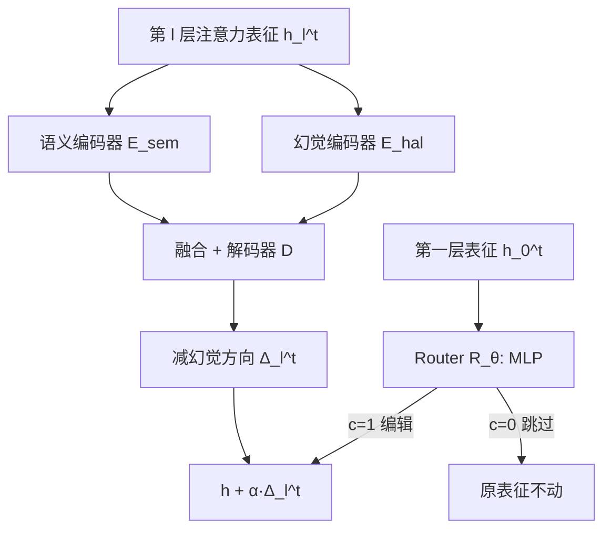

# Hallucination-aware Intermediate Representation Edit in Large Vision-Language Models

**会议**: ICLR 2026  
**OpenReview**: [https://openreview.net/forum?id=v8C2Cd0lAh](https://openreview.net/forum?id=v8C2Cd0lAh)  
**代码**: [https://github.com/ASGO-MM/HIRE](https://github.com/ASGO-MM/HIRE)  
**领域**: 多模态幻觉缓解 / LVLM  
**关键词**: LVLM 幻觉, 表征编辑, 对比学习, DPO, 可控生成  

## 一句话总结
HIRE 不重训也不做双前向，而是在 LVLM 中间表征层"就地编辑"——用对偶编码器把幻觉成分从语义里剥离出来、沿"减幻觉方向"做一次平移，再用轻量 Router 只对高风险 token 出手，在三个基准上以接近原始推理的开销刷到 SOTA，还能通过一个超参反向放大幻觉做可控生成。

## 研究背景与动机
**领域现状**：LVLM 在多模态推理与场景理解上表现强劲，但普遍存在"幻觉"——输出内容与图像事实相矛盾。主流缓解手段分两类：重训练方法（构造幻觉专项数据集 + 新训练范式微调模型）和对比解码（Contrastive Decoding, CD，推理时把原始输出分布与一个"被削弱、更易幻觉"的变体分布相减来修正 logits）。

**现有痛点**：重训练要付出高昂的数据构造与算力成本，且需要改动模型权重；CD 虽不改权重，却要每次推理跑两遍前向，延迟翻倍，而且它对所有 token 一视同仁地调整概率——像 "in/on/from" 这类几乎不会引发幻觉的常见词也被无差别处理，既浪费计算又可能损害输出连贯性。更进一步，几乎所有方法都缺乏"控制幻觉程度"的能力，但在创意写作等场景里适度幻觉其实是有益的。

**核心矛盾**：要么花大代价重训练、要么承受双前向开销，且都无法对"哪些 token 该管、该管到什么程度"做精细调度。

**本文目标**：在不重训权重、不引入双前向的前提下，动态检测并消除幻觉，同时支持幻觉强度的连续可控。

**核心 idea**：近期研究发现 LVLM 的内部表征中，真实特征与幻觉特征在隐空间里是可分离的。**HIRE 把幻觉缓解从"输出端解码"搬到"中间表征编辑"**——既然真假特征可分，就直接在表征空间里找出"减幻觉方向"并把高风险 token 的表征沿该方向平移，从源头上消除幻觉。

## 方法详解

### 整体框架
HIRE（Hallucination-aware Intermediate Representation Edit）锁定每个 Transformer 层的注意力层表征作为编辑对象，由两个组件协同：**Editor** 负责"往哪个方向编辑"——通过对偶编码器把表征拆成语义子空间和幻觉子空间，算出 token 级的减幻觉方向 $\Delta_l^t$；**Router** 负责"要不要编辑"——一个只看第一层表征的轻量 MLP 做二元决策，决定后续所有层是否启动 Editor。两者都无标注数据，分别用对比学习和 DPO 训练。

### 关键设计

**1. Editor：用对偶编码器把"幻觉"从"语义"里剥出来再编辑** —— 直接操纵表征会破坏语义完整性，因为幻觉文本与正常文本的表征是纠缠的。HIRE 借鉴去纠缠自编码器思路，让语义编码器 $E_{sem}$ 和幻觉编码器 $E_{hal}$ 分别从同一表征 $h_l^t$ 抽出语义分量 $h_{l,sem}^t$ 与幻觉分量 $h_{l,hal}^t$。先在幻觉子空间内对"真实 vs 幻觉"表征求 token 级差值的平均，得到一个与具体 token 无关的"减幻觉方向" $\delta_l$；再把它注入注意力融合（以语义为 query、幻觉分量为 key/value）并经解码器 $D$，得到 token 专属的编辑方向：
$$\Delta_l^t = D(h_{l,sem}^t + f_{attn}(h_{l,sem}^t, h_{l,hal}^t + \delta_l)) - D(h_{l,sem}^t + f_{attn}(h_{l,sem}^t, h_{l,hal}^t - \delta_l))$$
这一"加 $\delta_l$ 解码"减去"减 $\delta_l$ 解码"的对称构造，把整体的减幻觉趋势落到了当前 token 在原始表征空间里的具体平移方向上。

**2. Router：只对高风险 token 出手，用一次浅层决策省掉无谓编辑** —— 对所有 token 编辑既浪费算力又可能误伤干净表征。HIRE 观察到 LVLM 深层冗余、浅层反而保留更多信息，于是让 Router $R_\theta$ 只读第一层表征 $h_0^t$，用一个 MLP 输出二元信号 $c$：$c=1$ 则后续所有层都启动 Editor，$c=0$ 则整句不编辑。最终编辑公式为
$$h_{l,aug}^t = \begin{cases} h_l^t + \alpha \cdot \Delta_l^t & c=1 \\ h_l^t & c=0 \end{cases}$$
强度 $\alpha \in [-1,1]$ 是设计的点睛之笔：$\alpha>0$ 把特征推向低幻觉方向、抑制幻觉，$\alpha<0$ 则反向放大幻觉——这就让"可控幻觉生成"只需调一个超参即可实现。

**3. 无标注下的两条训练线：对比学习训 Editor + 无参考 DPO 训 Router** —— 训练数据稀缺是最大障碍。HIRE 用"同文本配干净图 vs 配加噪图"自动造出真实表征 $H_l^+$ 与幻觉表征 $H_l^-$（视觉不确定性会放大幻觉）。Editor 端用 InfoNCE 对比学习让语义编码器保持跨样本同 token 高相似、幻觉编码器则按"真/假组"聚类而无视 token 语义，再配重建损失与编辑损失（把负样本语义换成正样本幻觉分量后要能解码回正样本）：
$$L_{tl,recon}^+ = \mathrm{MSE}(h_{tl}^+, D(h_{tl,sem}^+ + f_{attn}(h_{tl,sem}^+, h_{tl,hal}^+)))$$
Router 端则用 CHAIRI 给每张图的 N 条候选 caption 打幻觉分，取最优/最差构成偏好对 $(h^+,c^+)$、$(h^-,c^-)$，套用去掉参考模型的 DPO（适合从零训练而非微调）：
$$L_r = -\mathbb{E}_{(h,c)}\left[\log\sigma\left(\beta(\log\pi_\theta(h^+,c^+) - \log\pi_\theta(h^-,c^-))\right)\right]$$
其中 $\beta=0.1$。这样 Editor 学"怎么编辑"、Router 学"何时编辑"，互不干扰地端到端训出来。

## 实验关键数据

### 主实验表格
CHAIR 基准（LLaVA-1.5，max new tokens=512，越低越好）：

| 方法 | CHAIRS↓ | CHAIRI↓ | TFLOPs↓ |
|------|---------|---------|---------|
| baseline | 51.3 | 16.8 | 10.23 |
| VCD | 46.8 | 13.2 | 20.46 |
| Octopus | 39.2 | 11.1 | 21.39 |
| VTI | 35.8 | 11.1 | - |
| **HIRE** | **30.2** | **9.7** | **11.81** |

句级/实例级幻觉相比 baseline 各降约 40%/50%，而 CD 类方法的 TFLOPs 普遍翻倍（约 20+），HIRE 只比 baseline 略增（11.81 vs 10.23）。

POPE 基准（LLaVA-1.5，ALL 设置）：HIRE 达 Acc. 87.27 / F1 87.23，超过次优 Octopus（85.79/83.44），且 TFLOPs 仅 10.62 远低于 CD 类的 16+。AMBER 基准上 HIRE 取得最高综合分，相比 baseline 在 LLaVA-1.5 / InstructBLIP 上分别提升 7.54 / 6.38。

### 消融实验表格
短描述场景（max new tokens=64，LLaVA-1.5）对比可控/DPO 类方法：

| 方法 | CHAIRS↓ | CHAIRI↓ |
|------|---------|---------|
| baseline | 20.4 | 6.2 |
| M3ID+DPO | 13.5 | 5.7 |
| Nullu | 17.0 | 5.9 |
| **HIRE** | 15.2 | **5.4** |

实例级幻觉 CHAIRI 仍取得最低值，说明 token 级编辑方向比纯解码端 DPO 更精准。

### 关键发现
- **效率与效果可兼得**：通过 Router 选择性编辑，HIRE 把"中间表征编辑"的额外开销压到接近 baseline，彻底绕开 CD 的双前向瓶颈。
- **可控性是独有能力**：负 $\alpha$ 能稳定地放大幻觉、生成更具想象力的描述（CHAIRI 从 0.2→0.8 区间连续可调），多数 baseline 不具备这种双向调节。
- **跨模型通用**：在 LLaVA-1.5 与 InstructBLIP 两套架构上均稳定领先，验证了表征可分性假设的普适性。

## 亮点与洞察
- **范式迁移**：把幻觉缓解的"战场"从输出端 logits 移到中间表征，既不像重训练那样改权重，也不像 CD 那样付双前向，是一个介于两者之间的"第三条路"。
- **去纠缠 + 方向编辑**：对偶编码器先把幻觉与语义解耦，再用对称差分构造 token 级编辑方向，巧妙绕开了"直接编辑破坏语义"的难题。
- **一个超参实现可控幻觉**：$\alpha$ 的符号直接决定抑制还是放大幻觉，把"创意写作要保留幻觉"这种实际需求变成连续旋钮。

## 局限与展望
- Router 用"第一层表征决定整句是否编辑"的二元策略较粗，对句中部分 token 幻觉、部分真实的混合情形可能欠精细（论文附录探讨了层级决策替代方案）。
- 编辑方向 $\delta_l$ 依赖"加噪图"造负样本来诱导幻觉，幻觉诱导方式的选择会影响学到的方向质量，泛化到非物体类幻觉（如属性、关系）的效果仍待更系统验证。
- 评测集中在 CHAIR/POPE/AMBER 与 LLaVA-1.5/InstructBLIP，更大规模、更强基座（如 Qwen-VL 系列）上的表现尚未覆盖。

## 相关工作与启发
HIRE 站在两条线索的交汇处：一是 LLM/LVLM 内部表征编码真实性线索、真假特征隐空间可分（Azaria & Mitchell 2023；Li et al. 2024；Duan et al. 2025），这为"表征可编辑"提供了前提；二是表征工程/激活引导（activation steering）思路，但 HIRE 把静态的引导向量升级为由对偶编码器动态生成的 token 级方向。相比 VTI、Nullu 等同样在表征/null space 操作的方法，HIRE 的差异在于显式去纠缠 + Router 选择性编辑 + 可控强度。对后续工作的启发：表征级编辑的"何时编辑/编辑哪些层/编辑多强"可作为独立的可学习策略，这套"Editor 定方向 + Router 定时机"的解耦设计或可迁移到事实性纠错、风格控制等更广义的可控生成任务。

## 评分
- 新颖性: ⭐⭐⭐⭐ 把幻觉缓解从解码端搬到中间表征编辑，并用对偶编码器去纠缠 + DPO Router 选择性编辑，整体范式与组件组合具有清晰新意。
- 实验充分度: ⭐⭐⭐⭐ 覆盖 CHAIR/POPE/AMBER 三基准、两套 LVLM、长短描述与可控生成多维度对比，且附带 TFLOPs 效率证据；更强基座未覆盖略减一星。
- 写作质量: ⭐⭐⭐⭐ 动机—挑战—方法—实验逻辑顺畅，图 2 框架清晰，公式与符号一致。
- 价值: ⭐⭐⭐⭐ 在几乎不增推理开销下实现 SOTA 且支持可控幻觉，对实际部署 LVLM 的幻觉治理有直接价值。

<!-- RELATED:START -->

## 相关论文

- [\[ICLR 2026\] Imitating the Truth: Attention-aware Truth-Guided Enhancement for Hallucination Mitigation in Large Vision-Language Models](imitating_the_truth_attention-aware_truth-guided_enhancement_for_hallucination_m.md)
- [\[ICLR 2026\] NDAD: Negative-Direction Aware Decoding for Large Language Models via Controllable Hallucination Signal Injection](ndad_negative-direction_aware_decoding_for_large_language_models_via_controllabl.md)
- [\[ICLR 2026\] Dynamic Multimodal Activation Steering for Hallucination Mitigation in Large Vision-Language Models](dynamic_multimodal_activation_steering_for_hallucination_mitigation_in_large_vis.md)
- [\[ICLR 2026\] Mitigating Hallucination in Vision-Language Model with Depth and Spatial-aware Key-Value Refinement](mitigating_hallucination_in_vision-language_model_with_depth_and_spatial-aware_k.md)
- [\[CVPR 2026\] Residual Decoding: Mitigating Hallucinations in Large Vision-Language Models via History-Aware Residual Guidance](../../CVPR2026/hallucination/residual_decoding_mitigating_hallucinations_in_large_vision-language_models_via_.md)

<!-- RELATED:END -->
