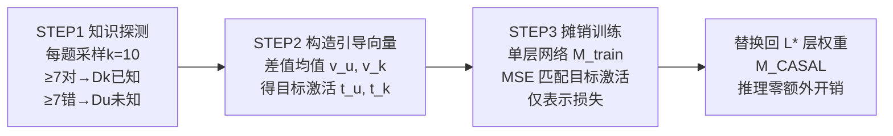

# Hallucination Reduction with CASAL: Contrastive Activation Steering for Amortized Learning

**会议**: ICLR 2026  
**OpenReview**: [https://openreview.net/forum?id=YM3RcI3q0E](https://openreview.net/forum?id=YM3RcI3q0E)  
**代码**: [https://github.com/facebookresearch/CASAL](https://github.com/facebookresearch/CASAL)  
**领域**: 幻觉缓解 / 可解释性 / 表示工程  
**关键词**: 幻觉, 激活引导, 摊销优化, 知识边界, 表示损失, MoE  

## 一句话总结
CASAL 把推理时的激活引导（activation steering）"摊销"进模型权重——只训练单层的一个子模块、只用表示损失（不用交叉熵），就能让 LLM "知道的答、不知道的弃答"，在多个短问答基准上把幻觉率降低 30%–40%，且比 LoRA 类基线省 ~30× 算力、~20× 数据。

## 研究背景与动机
**领域现状**：可解释性研究发现 LLM 的残差流激活里编码了"自知之明"——已知（known）与未知（unknown）问题的激活沿线性方向可分；沿这些方向做激活引导能降低过度自信、让模型承认不确定。

**现有痛点**：这类引导方法几乎都是**推理时干预**——每个 query 都要在线解一个局部优化（在每次 forward pass 沿方向平移激活），带来持续的部署开销，还需要实时监控与介入；同时 CAA 这类在线引导会副作用性地拉低本来能答对的题的准确率。另一方面，主流对齐手段（SFT/DPO/GRPO）用交叉熵把模型训成"好考生"，奖励猜测而非承认无知，反而放大幻觉。

**核心矛盾**：模型内部状态**已经**反映了"知道 vs 不知道"，却仍输出自信的错误答案——根因在于训练/评测范式只从外部语料（交叉熵）取信号，没让模型直接利用自己的内部表示。

**本文目标**：设计一个免推理时干预、轻量、数据/算力高效、且能跨分布/跨架构/跨模态泛化的幻觉缓解训练方法。

**核心 idea**：**[摊销 + 纯表示损失]** 把"重复在线引导"换成"一次性离线训练一个小子网去逼近引导解"（摊销优化），并且**只用表示损失作为唯一训练目标**（而非像 RepE/ReFAT 那样把表示损失当交叉熵的辅助项），把知识边界直接烧进权重。

## 方法详解

### 整体框架
CASAL 是"摊销版的激活引导"：与其在推理时对每个 query 反复求解引导问题，不如离线训练一个参数化子网近似该解一次，把引导收益分摊到未来所有 query 上。整条流水线分三步——先探测模型知识边界，再用差值均值构造对比引导向量得到目标激活，最后只训单层网络去匹配这些目标激活。

### 关键设计

**1. 知识边界探测：用一致性把题分成"已知/未知"两堆。** CASAL 先离线给每个问题贴标签，作为后续引导的监督来源。对每个输入 $x$ 采样 $k=10$ 个回答，统计正确数 $s(x)=\sum_i \mathbb{1}[y^{(i)}(x)\ \text{correct}]$；若 $s(x)\geq\tau$（$\tau=7$）记入已知集 $D_k$，若 $k-s(x)\geq\tau$ 记入未知集 $D_u$。阈值取得严格（7/10）是为了只在"确实一致答对"时才认定已知、"确实一致答错"时才认定未知，把决策边界附近的模糊样本剔掉。作者验证该步骤对阈值鲁棒，且因为 SFT/DPO 这些基线也要同一套 known/unknown 标签，所以探测本身不算 CASAL 独有的额外算力。

**2. 对比引导向量：差值均值刻画"问题本身"是否已知。** 在目标层 $L^*$、取问题最后一个 token 位置的残差激活 $a^{L^*}(x)$（之所以取问题末位而非答案位，是要让向量反映"这道题模型知不知道"，而非"答案对不对"）。对两堆分别求均值 $\bar a^{L^*}_k,\ \bar a^{L^*}_u$，再做差得到两个互为反向的引导向量：

$$v^{L^*}_u=\bar a^{L^*}_u-\bar a^{L^*}_k,\qquad v^{L^*}_k=\bar a^{L^*}_k-\bar a^{L^*}_u$$

把引导向量按强度 $\alpha$ 加回激活，得到目标激活 $t^{L^*}_u(x)=a^{L^*}(x)+\alpha v^{L^*}_u$（"不知道就弃答"）和 $t^{L^*}_k(x)=a^{L^*}(x)+\alpha v^{L^*}_k$（"知道就作答"）。这些目标激活被缓存下来，作为下一步的回归目标。

**3. 单层摊销训练：把"在线引导解"蒸馏进权重，且只用表示损失。** 初始化一个单层网络 $M_{train}$，其权重取自原模型 $L^*$ 层的 $W^{L^*}_{original}$，用 MSE 让当前激活去逼近对应目标激活：

$$\mathcal{L}=\underbrace{\mathbb{E}_{x\in D_u}\lVert t^{L^*}_u(x)-a^{L^*}(x)\rVert^2}_{\mathcal{L}_u}+\underbrace{\mathbb{E}_{x\in D_k}\lVert t^{L^*}_k(x)-a^{L^*}(x)\rVert^2}_{\mathcal{L}_k}$$

训练完把学到的 $W^{L^*}_{CASAL}$ 直接换回原模型 $L^*$ 层，得到 $M_{CASAL}$，推理时不再需要任何在线引导。这步的关键是损失**局部于 $L^*$ 层**：前向/反向都只在单层网络内进行，不像交叉熵那样即便只更新一层也得整模型 forward 一遍算输出概率——例如在 32 层模型微调第 16 层，交叉熵需走完 32 层前向、16 层反向，CASAL 只动目标层本身，模型越深省得越多。

**4. 跨生成长度恒定成本：损失只算一个 token 位置。** CASAL 只在问题最后一个 token 处算损失，成本与答案长度无关；而 SFT 要对答案所有 token 平均交叉熵、DPO 要对 chosen/rejected 全部 token 算对数概率，成本随生成长度增长。答案越长，CASAL 相对越省——这也使论文报告的 30× 算力优势其实是保守估计。

## 实验关键数据

### 主实验（效率与不伤已知题）

| 方法 | TriviaQA 拒答率↓ | EntityQA 拒答率↓ | PopQA 准确率↑ | 数据需求 | 算力(FLOPs/token) |
|---|---|---|---|---|---|
| Baseline | 7.93% | 8.94% | 91.08% | — | — |
| SFT | 10.01% | 11.08% | 82.89% | 12,800 | 基准 |
| DPO | 14.37% | 17.66% | 90.25% | 12,800 | 基准 |
| GRPO | 17.77% | 16.67% | 85.78% | 12,800 | 基准 |
| **CASAL** | **7.29%** | **6.84%** | 85.11% | **640** | **~1/30 LoRA** |

CASAL 用 640 条数据即可匹配/超过基线用 12,800 条的效果（>20× 数据效率），拒答率最低、不伤已知题准确率。通用能力（MMLU 68.04 / GSM8K 77.02 / GPQA 33.18 / MT-Bench 7.57）与基线持平甚至 MT-Bench 最高。

### OOD 泛化与跨架构/模态

| 设定 | 数据 | 幻觉率(未知)↓ | 已知题准确率↑ |
|---|---|---|---|
| 跨子集 (TriviaQA Wiki→Web) | 测试 Web | 50.7% → 32.4% | 90.08% |
| 跨数据集 (TriviaQA→EntityQA) | 测试 EntityQA | 50.7% → 11.7% | 95.77% |
| VLM (Qwen2.5-VL-7B, WorldCuisines) | — | 72.4% → 33.3% (−38.7%) | 90.36% |
| VLM (Landmark-VQA) | — | 75.8% → 31.3% | 99% |
| MoE (OLMoE) | — | −42.9% | 不变 |

### 关键发现
- **表示分离 ↔ 行为改善强相关**：训练中 known/unknown 的 Silhouette 聚类分离度上升，与幻觉率下降高度吻合（logistic 拟合 $R^2=0.945$），说明 CASAL 的有效性来自更忠实地编码并利用知识边界。
- **优于在线引导 CAA**：在未知题上幻觉率与 CAA 相当，但 CASAL 不伤已知题准确率，而 CAA 会拉低原本能答对的题——印证在线引导的副作用。
- **MoE 中 known/unknown 在同一批 experts 内共表示**，CASAL 用同一套局部表示损失即可跨 experts 收敛，是首个对 dense 与 MoE 都有效的引导式训练方法。

## 亮点与洞察
- **"摊销优化 × 可解释性"的桥**：把"推理时对每个样本求引导解"重构成"离线训一个函数逼近解"，是 VAE/摊销推断思想在表示工程上的优雅落地。
- **纯表示损失训练 LLM**：据作者所述是首批仅以表示级目标（不配交叉熵）训练 LLM 的方法，让"从内部表示取学习信号"成为主目标而非辅助项。
- **局部损失带来的双重高效**：损失局部于单层 → 跨深度省；损失只算一个 token → 跨长度恒定，两者叠加得到 30× 算力 + 20× 数据优势。
- **广覆盖**：text-only / VLM、dense / MoE 全打通，工程落地价值高。

## 局限与展望
- 依赖知识探测阶段的标签质量，而探测要对每题采样 10 次；对开放式/长问答（非短问答 QA）如何定义 known/unknown 并不显然。
- 只训单层、只在问题末位 token 监督，对需要多步推理或答案过程中才暴露不确定性的场景覆盖有限。
- 引导向量用"差值均值"这一线性假设，若知识边界在某些领域非线性可分，效果可能打折。
- PopQA 上拒答率（19.89%）相对偏高、并非全面最优，说明不同数据分布上的平衡仍需调参。

## 相关工作与启发
- **推理时引导**（CAA, Rimsky 2024；Turner 2024；Ferrando 2025）：CASAL 直接把它们的收益烧进权重，消除每实例干预——这是本文最直接的"对照与超越"对象。
- **表示级微调**（RepE, ReFAT 等）：都把表示损失当交叉熵的辅助项；CASAL 把它当唯一目标，是方法论上的关键差异。
- **摊销优化**（VAE/Kingma 2013、Rezende 2014）：提供了"用参数化函数替代重复优化"的理论框架。
- 启发：凡是"推理时反复求解的轻量优化"，都可考虑用摊销思路蒸馏进权重，把部署期开销前置到训练期。

## 评分
- **新颖性**: ⭐⭐⭐⭐⭐ — "摊销激活引导 + 纯表示损失"的组合视角新颖，且首次打通 dense/MoE 与多模态。
- **实验充分度**: ⭐⭐⭐⭐ — 覆盖短问答、通用能力、OOD、VLM、MoE，对比 SFT/DPO/GRPO/CAA 充分；但局限于短问答 QA，长文/开放式场景未验证。
- **写作质量**: ⭐⭐⭐⭐ — 算法、图示、动机叙述清晰，效率分析（跨深度/跨长度）讲得透。
- **价值**: ⭐⭐⭐⭐⭐ — 数据/算力双重高效 + 不伤通用能力 + 广架构覆盖，生产部署价值突出。

<!-- RELATED:START -->

## 相关论文

- [\[ICLR 2026\] Dynamic Multimodal Activation Steering for Hallucination Mitigation in Large Vision-Language Models](dynamic_multimodal_activation_steering_for_hallucination_mitigation_in_large_vis.md)
- [\[ICLR 2026\] Learning to Reason for Hallucination Span Detection](learning_to_reason_for_hallucination_span_detection.md)
- [\[ACL 2025\] Activation Steering Decoding: Mitigating Hallucination in Large Vision-Language Models through Bidirectional Hidden State Intervention](../../ACL2025/hallucination/activation_steering_decoding_mitigating_hallucination_in_large_vision-language_m.md)
- [\[ICML 2026\] Learning from Fine-Grained Visual Discrepancies: Mitigating Multimodal Hallucinations via In-Context Visual Contrastive Optimization](../../ICML2026/hallucination/learning_from_fine-grained_visual_discrepancies_mitigating_multimodal_hallucinat.md)
- [\[ICLR 2026\] Leveraging Pretrained Knowledge at Inference Time: LoRA-Gated Contrastive Decoding for Multilingual Factual Language Generation in Adapted LLMs](leveraging_pretrained_knowledge_at_inference_time_lora-gated_contrastive_decodin.md)

<!-- RELATED:END -->
