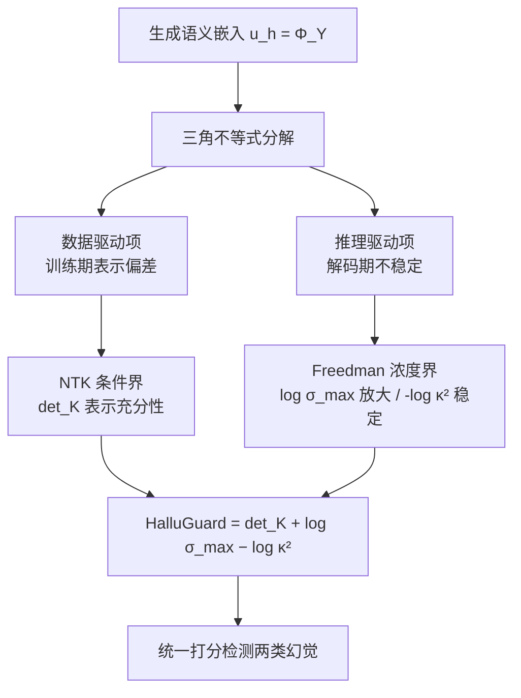

# HalluGuard: Demystifying Data-Driven and Reasoning-Driven Hallucinations in LLMs

**会议**: ICLR 2026  
**OpenReview**: [https://openreview.net/forum?id=ZURs3YZclt](https://openreview.net/forum?id=ZURs3YZclt)  
**代码**: 已开源（HalluGuard，论文中给出链接）  
**领域**: 大模型幻觉检测 / 可信 LLM  
**关键词**: 幻觉检测, Neural Tangent Kernel, 幻觉风险界, 数据驱动幻觉, 推理驱动幻觉  

## 一句话总结
本文提出统一的「幻觉风险界（Hallucination Risk Bound）」理论框架，把 LLM 幻觉风险用三角不等式分解为**数据驱动项**（训练期表示偏差）与**推理驱动项**（解码期不稳定），并据此设计无需外部参考、无需幻觉标注的 NTK 谱代理分数 HalluGuard，在 10 个基准、11 个基线、9 个骨干上一致取得 SOTA。

## 研究背景与动机
**领域现状**：LLM 在医疗、法律、科研等高风险场景的落地被幻觉问题卡住。学界普遍把幻觉归为两类来源——**数据驱动幻觉**（预训练/微调阶段编码进去的错误、偏差、不完整知识）与**推理驱动幻觉**（推理时的逻辑断裂、多步推理崩溃）。检测方法也沿这两条线分裂：数据驱动派靠检索文档/参考对比、或 SelfCheckGPT 式采样一致性；推理驱动派靠 perplexity、length-normalized entropy、semantic entropy、energy score，或探查内部表示（Inside 的协方差谱、ICR Probe 的残差流、RACE 的多步推理诊断）。

**现有痛点**：绝大多数方法只盯住**单一**幻觉类型，且依赖任务特定启发式（外部检索、特定阈值），泛化能力差。更关键的是，它们无法刻画幻觉的**演化**——真实生成中，一个初始的事实误判会在多步推理里被放大成完全扭曲的结论（论文用疾病诊断的例子：初始误分类 → 诊断扭曲 → 延误治疗）。

**核心矛盾**：幻觉在实践中**几乎从不是纯粹的单一类型**。作者统计发现：在指令跟随的 Natural 上 88.9% 的错误是逻辑误步（推理驱动）、仅 11.1% 是事实错误；而在数学的 MATH-500 上 98.1% 是推理错误、仅 1.9% 是事实瑕疵。同一套检测器面对差异如此巨大的混合比例，靠单一信号必然失灵。

**本文目标**：回答两个问题——(1) 如何用统一理论刻画幻觉如何涌现与演化？(2) 如何不依赖外部参考和任务启发式就高效检测？

**核心 idea（统一分解 + NTK 谱代理）**：先用一条三角不等式把总风险**严格分解**为数据驱动项与推理驱动项，前者用 NTK 几何（特征图条件数）刻画训练期的逼近差距，后者用鞅过程的浓度不等式刻画解码期沿序列长度的指数级放大；再把这条理论界**翻译成可在推理时实时计算**的 NTK 谱代理分数，三个谱量分别对应表示充分性、rollout 放大、谱不稳定性。

## 方法详解

### 整体框架
方法分两层：**理论层**先把幻觉风险 $\|u^* - u_h\|$（真值语义嵌入与生成语义嵌入之差）用三角不等式拆成数据驱动项 $\|u^*-\mathbb{E}[u_h]\|$ 与推理驱动项 $\|u_h-\mathbb{E}[u_h]\|$，并分别给出 NTK 条件界与 Freedman 浓度界，合成出「幻觉风险界」定理；**落地层**因为亿级参数 LLM 的逐步 Jacobian 不可直接算，于是把定理里的每一项替换成可计算、稳定、忠实于分解的 NTK 谱代理，加和成最终的 HalluGuard 分数。

### 关键设计
**1. 幻觉风险分解：一条三角不等式定下两类来源的边界。** 这是全文的理论支点，也是最朴素却最有效的一步。作者把待检序列编码到连续语义空间 $\mathcal{U}_h$，真值表示记 $u^*=\Phi(y^*)$、生成表示记 $u_h=\Phi(Y)$，对总风险直接套三角不等式：$\|u^*-u_h\| \le \underbrace{\|u^*-\mathbb{E}[u_h]\|}_{\text{数据驱动}} + \underbrace{\|u_h-\mathbb{E}[u_h]\|}_{\text{推理驱动}}$。第一项度量「平均生成」偏离真值多远——这是模型学到的表示里的系统性偏差，与训练有关；第二项度量单次随机 rollout 偏离自身期望多远——这是解码采样引入的不稳定，与推理有关。一条不等式就把此前各自为政的两派检测方法收进同一坐标系，也为「先有数据偏差、再被推理放大」的演化叙事提供了形式化骨架。

**2. 数据驱动项用 NTK 几何刻画逼近差距。** 作者借 Céa 引理（带曲率惩罚）把数据驱动项界为 $\|u^*-\mathbb{E}[u_h]\| \le \frac{\Lambda}{\gamma}\inf_{u\in U_h}\|u^*-u\|$，其中 $\gamma=\lambda_{\min}(K_\Phi)$ 是扰动嵌入上 NTK Gram 矩阵的最小特征值，$\Lambda$ 是算子映射的范数界。比值 $\Lambda/\gamma$ 正是特征图的**条件数**：NTK 谱越良态、对真值生成的逼近越紧。这个比值又能进一步被预训练-微调失配控制，$\frac{\Lambda}{\gamma} \le 1 + k_{pt}\frac{\log\mathcal{O}(P,L)+k\cdot\epsilon_{\text{mismatch}}}{\text{Signal}_k}$，其中 $\epsilon_{\text{mismatch}}$ 是 prompt 与 query 分布间的 Wasserstein 距离、$\text{Signal}_k$ 是 top-k 特征子空间里的任务对齐能量。直观结论：失配越大、或任务信号越弱，数据驱动幻觉越严重。

**3. 推理驱动项用鞅浓度刻画沿序列的指数放大。** 作者把自回归生成建模成鞅过程，用 Freedman 不等式界住偏离期望的程度：$\|u_h-\mathbb{E}[u_h]\| \le K\cdot\exp(-\tfrac{K\epsilon^2}{C})\cdot\alpha(e^{\beta T}-1)$，其中 $K$ 是平均的 rollout 数、$\beta$ 概括逐步局部 Jacobian 的增长率、$T$ 是序列长度。关键洞察是 $e^{\beta T}$ 项——**推理驱动幻觉随序列长度指数增长**，这正解释了为何长链推理特别容易崩。把它与数据驱动界合并即得「幻觉风险界」定理（Theorem 3.2），在 $\|\prod_{t=1}^T J_t\|_2 \le e^{\beta T}$ 的假设下给出总风险的统一上界。

**4. HalluGuard 谱代理：把不可算的定理压成可实时算的三项加和。** 逐步 Jacobian 在亿级模型上不可行，作者寻找忠实代理。对数据驱动项，用 NTK 逼近论证得 $\inf_{u\in U_h}\|u^*-u\| \le C_d\det(K)^{-c_d}\|u^*\|$，故 $\det(K)$ 捕获表示是否充分；对 rollout 放大，由 $\|\prod_t J_t\|_2 \le \sigma_{\max}^T$（$\sigma_{\max}=\sup_t\|J_t\|_2$）得 $\log\sigma_{\max}$ 作为逐步放大率的稳定代理；对谱不稳定，扰动分析给出 $\mathrm{Var}[u_h]\le c_v\,\kappa(K)^2\|\delta\|^2$，故用 $-\log\kappa^2$ 惩罚病态条件数。三者加和即 $\text{HalluGuard}(u_h) = \det(K) + \log\sigma_{\max} - \log\kappa^2$。一组轻量投影层作为自监督谱校准模块离线用 AdamW 训练，把异构骨干的 NTK 谱对齐到可比几何空间——**无需幻觉标注、无需任务监督、骨干全程冻结、推理零额外开销**。表 1 的相关性验证支撑了分工：$\det(K)$ 在数据型 SQuAD 上相关系数 0.84，$\log\sigma_{\max}-\log\kappa^2$ 在推理型 MATH-500 上相关系数 0.88。

## 实验关键数据
设置：10 个基准（数据型 QA：RAGTruth/NQ-Open/HotpotQA/SQuAD；推理型：GSM8K/MATH-500/BBH；指令型：TruthfulQA/HaluEval/Natural），11 个基线，9 个骨干（Llama2/3 系列、OPT-6.7B、Mistral-7B、QwQ-32B、GPT-2）。指标为 AUROC / AUPRC，分 ROUGE 参考与 LLM-as-judge 两种评测。

### 主实验表格（代表性基准，QwQ-32B，AUROC_r / AUPRC_r）

| 方法 | RAGTruth | Math-500 | TruthfulQA |
|---|---|---|---|
| **HalluGuard** | **84.59 / 81.15** | **81.76 / 79.76** | **74.26 / 72.76** |
| Inside | 77.72 / 73.47 | 80.80 / 71.49 | 70.89 / 64.44 |
| Perplexity | 73.91 / 72.92 | 60.28 / 57.75 | 55.29 / 52.46 |
| SelfCheckGPT | 65.79 / 62.45 | 64.56 / 62.49 | 55.86 / 54.95 |
| RACE | 71.13 / 69.96 | 59.50 / 55.83 | 55.75 / 52.62 |

在 Math-500 上较次优最多提升 8.3%，RAGTruth 上最多 7.7%，TruthfulQA 上最多 6.2%，推理型基准提升尤为显著。

### 消融实验表格（跨规模骨干，AUROC_r，SQuAD）

| 骨干 | HalluGuard | 次优 |
|---|---|---|
| Llama2-7B（小） | **81.05** | 73.63（Inside） |
| Llama3-8B | **79.56** | 76.13（Inside） |
| Llama2-13B（中） | **81.45** | 74.68（Inside） |
| Llama2-70B（大） | **83.80** | 81.24（Inside） |

各项谱量与对应任务族趋势的逐项消融（图 2）：数据驱动项在 SQuAD 上紧贴 ground-truth 的 AUROC 下降曲线，推理驱动项在 MATH-500 上镜像随推理漂移加剧的单调下降，证明三项分工与理论分解一致。

### 关键发现
- **小骨干增益最大**：在 Llama2-7B 的 HaluEval 上 AUPRC_r 达 72.89%，比次优高 10% 以上；小模型本就更易幻觉，HalluGuard 收益最显著且跨规模稳定。
- **可指导测试时推理**：把检测器接入 beam search，Qwen2.5-Math-7B 在 MATH-500 上达 81.00% 准确率（比 IO Prompt 高约 10%），Llama3.1-8B 在 Natural 上达 70.96%（高 15.72%）——检测器不只是事后裁判，还能在线引导模型走向可靠解。
- **能抓细粒度幻觉**：在 PAWS（高表面重叠但语义相反的改写）案例研究中，HalluGuard 跨规模一致超越基线，说明它对「字面像、语义错」的隐蔽幻觉也有效。

## 亮点与洞察
- **理论与代理一一对应**：从三角不等式分解 → NTK 条件界 + Freedman 浓度界 → 三个可算谱量，每一步都有形式化对应，避免了「先有 trick 再补故事」的常见拼凑感。
- **统一了割裂的两派**：第一次把数据驱动检测与推理驱动检测放进同一风险界，并解释二者如何在多步生成中演化、相互放大。
- **零标注零运行开销**：谱校准离线完成、骨干冻结、推理期只算谱量，工程落地友好；不依赖外部检索是高风险闭域场景的实质优势。
- **$e^{\beta T}$ 的洞察**：把「长链推理为何易崩」量化为推理驱动项随序列长度指数增长，给链式推理的可靠性研究提供了清晰抓手。

## 局限与展望
- **NTK 假设的现实落差**：理论建立在无限宽极限与 NTK 近似常数的假设上，真实有限宽 LLM 训练中 NTK 会漂移，谱代理与真实风险界的逼近紧度缺乏定量保证。
- **谱量计算成本**：虽称推理零开销，但 $\det(K)$、$\kappa(K)$ 需要构造 NTK Gram 矩阵并做特征分解，扩展到超长上下文或超大 batch 时的可扩展性论文未充分讨论。
- **语义编码器 $\Phi$ 的依赖**：整个框架依赖一个把序列映到语义空间的编码器，其质量与偏差会直接影响 $u^*$ 与 $u_h$ 的可靠性，论文未深入分析编码器选择的敏感性。
- **演化刻画偏理论**：「涌现与演化」主要靠风险界的定性叙述与案例支撑，缺少在真实多步轨迹上逐步追踪两类幻觉此消彼长的细粒度实证。

## 相关工作与启发
本文坐落在三条线交汇处：(1) 不确定性式检测（Perplexity、LN-Entropy、Semantic Entropy、Energy、P(true)）——HalluGuard 把它们解释为只触及数据驱动项的特例；(2) 一致性式检测（SelfCheckGPT、Lexical Similarity、FActScore、RACE）——对应推理驱动项的跨样本一致性视角；(3) 内部状态探查（Inside 的协方差谱、MIND）——与本文同走表示几何路线，但 HalluGuard 用 NTK 谱给出了理论界而非纯经验信号。启发在于：**与其为每种幻觉造一个检测器，不如先找到能把它们统一分解的风险量，再为每一分量找可计算代理**——这种「先分解、后代理」的范式对其他可信性问题（校准、OOD 检测）同样有借鉴价值。

## 评分
- **新颖性**: ⭐⭐⭐⭐⭐ 把幻觉风险用三角不等式严格分解为数据/推理两项，并各自配 NTK 条件界与 Freedman 浓度界，再压成可实时算的谱代理，理论-落地链条完整且原创。
- **实验充分度**: ⭐⭐⭐⭐ 10 基准 × 11 基线 × 9 骨干覆盖全面，含跨规模、逐项消融、测试时引导、细粒度案例；略欠对 NTK 谱计算开销与编码器敏感性的实证。
- **写作质量**: ⭐⭐⭐⭐ 理论叙事清晰、动机统计有说服力；但定理与假设密集，对非理论背景读者门槛偏高。
- **价值**: ⭐⭐⭐⭐⭐ 无参考、无标注、零运行开销且能在线指导推理，对高风险闭域场景的可信 LLM 部署有直接实用价值。

<!-- RELATED:START -->

## 相关论文

- [\[ICLR 2026\] ChainMPQ: Interleaved Text-Image Reasoning Chains for Mitigating Relation Hallucinations](chainmpq_interleaved_text-image_reasoning_chains_for_mitigating_relation_halluci.md)
- [\[ICLR 2026\] BARREL: Boundary-Aware Reasoning for Factual and Reliable LRMs](barrel_boundary-aware_reasoning_for_factual_and_reliable_lrms.md)
- [\[ICLR 2026\] Mechanistic Detection and Mitigation of Hallucination in Large Reasoning Models](mechanistic_detection_and_mitigation_of_hallucination_in_large_reasoning_models.md)
- [\[ACL 2026\] The Reasoning Trap: How Enhancing LLM Reasoning Amplifies Tool Hallucination](../../ACL2026/hallucination/the_reasoning_trap_how_enhancing_llm_reasoning_amplifies_tool_hallucination.md)
- [\[ACL 2026\] MeasHalu: Mitigation of Scientific Measurement Hallucinations for LLMs](../../ACL2026/hallucination/meashalu_mitigation_of_scientific_measurement_hallucinations_for_large_language_.md)

<!-- RELATED:END -->
