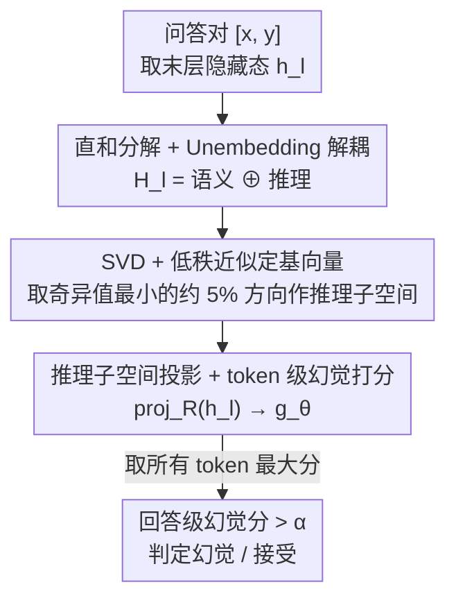

# HARP: Hallucination Detection via Reasoning Subspace Projection

**会议**: ICLR 2026  
**OpenReview**: [https://openreview.net/forum?id=ShEDWasmDG](https://openreview.net/forum?id=ShEDWasmDG)  
**领域**: LLM幻觉检测 / 机制可解释性  
**关键词**: 幻觉检测, 推理子空间, SVD, 隐藏态分解, Unembedding层  

## 一句话总结
HARP 把 LLM 的隐藏态空间分解成「语义子空间 ⊕ 推理子空间」，通过对 Unembedding 层做 SVD 找出推理子空间的基向量，再把隐藏态投影到这个仅占约 5% 维度的子空间上作为幻觉检测特征，在 TriviaQA 上把 AUROC 推到 92.8%（比此前最佳高 7.5 个百分点）。

## 研究背景与动机

**领域现状**：检测 LLM 幻觉的主流路线有两类。一类是 probing（探针），直接在隐藏态上训分类器判断真假，如 HaloScope 用未标注嵌入做 SVD 找关键方向；另一类是基于输出一致性，如 EigenScore 用协方差特征值衡量多次采样的语义一致性、Semantic Entropy 用聚类加语义熵。

**现有痛点**：probing 类方法依赖预定义的监督标签，当特征维度很大、类别先验不全时泛化能力差，而且高维隐藏态里塞满了与幻觉无关的噪声；一致性类方法要多次采样，开销大，且只看输出表层语言，无法利用模型内部的推理信息，遇到长上下文、阅读理解这类推理密集型任务就掉点严重（如多种 baseline 在 TyDiQA 上 AUROC 跌到 30%~50%）。

**核心矛盾**：判断一个回答是否幻觉，本质上要看模型「想得对不对」，而不只是「说得通不通顺」。但隐藏态把语义表达信息和内部推理信息混在一起，现有方法没有把二者解耦，导致检测特征既高维又被语义噪声主导，抓不住真正决定真假的推理信号。

**本文目标**：把隐藏态中负责「内部推理」的成分单独抽出来，构造一个低维、干净、可解释的特征，专门用于幻觉检测。

**切入角度**：作者从认知类比出发——人类回答复杂问题遵循「推理 → 表达」流程，先在脑内推理再把部分结果说成语言；类比到 LLM，最后一层隐藏态同时编码了「语义预测信息」（决定下一个 token）和「推理轨迹信息」（支撑多步推理但不直接影响输出）。关键观察是：Unembedding 层只把语义成分压进生成的 token，把推理成分过滤掉了——这说明 Unembedding 层天然就能区分这两类信息。

**核心 idea**：用 Unembedding 层当「解耦器」，对它的参数矩阵做 SVD，把隐藏态空间分解成语义子空间与正交的推理子空间，再把隐藏态投影到推理子空间上做幻觉检测。

## 方法详解

### 整体框架
HARP 要解决的是「怎么从混杂的隐藏态里抽出纯推理信号做幻觉检测」。整体流程是：给定一个问答对，取出 LLM 最后一层的隐藏态 $h_l$，先对 Unembedding 层参数 $W_{unemb}$ 做 SVD 得到一组正交基；按奇异值大小把基向量分成「语义子空间」（对应大奇异值、主导 token 预测）和「推理子空间」（对应近零奇异值、被 Unembedding 过滤掉的方向）；把每个 token 的隐藏态投影到推理子空间的基向量上，得到一个仅约 5% 原维度的紧凑特征；用这个特征训一个轻量检测器 $g_\theta$ 给每个 token 打幻觉分，取整句 token 分数的最大值作为整个回答的幻觉分，超过阈值即判为幻觉。

整个理论支点在于隐藏态空间的直和分解：

$$\mathcal{H}_l = \mathcal{S}_{Semantic} \oplus \mathcal{S}_{Reasoning}$$

其中 $h_{l,Semantic}$ 主导 logits 预测、$h_{l,Reasoning}$ 编码模型的推理过程且对输出几乎无影响。

### 关键设计

**1. 隐藏态直和分解，用 Unembedding 层当语义/推理解耦器**

这一步针对的痛点是：隐藏态把语义和推理混在一起，没法只用推理信号。作者的洞察是末层隐藏态 $h_l$ 同时承载两类信息——为了准确预测下一个 token，$h_l$ 必须保留充足的语义特征，这部分主要被 $W_{unemb}$ 捕获并主导 token 预测；同时为支撑多步推理，$h_l$ 还编码了不直接影响输出的中间推理信息，这部分基本不被 $W_{unemb}$ 捕获。由此把隐藏态空间分解为两个正交子空间的直和 $\mathcal{H}_l = \mathcal{S}_{Semantic} \oplus \mathcal{S}_{Reasoning}$。

之所以能用 Unembedding 层做解耦器，是因为它在生成 token 时只把语义成分压进输出、过滤掉推理成分，所以两个子空间与 $W_{unemb}$ 的交互可以刻画为 $W_{unemb} \cdot \mathcal{S}_{Semantic} \approx W_{unemb} \cdot \mathcal{H}_l$ 和 $W_{unemb} \cdot \mathcal{S}_{Reasoning} \approx 0$——即语义子空间对齐 $W_{unemb}$ 的主作用方向，正交的推理子空间对预测分数贡献可忽略。这个定义把「哪部分是推理信息」从模糊的直觉变成了可计算的代数条件。

**2. SVD 求基向量，用低秩近似在真实模型上界定子空间**

有了上面的代数定义，怎么实际找出这组基向量？作者对 $W_{unemb}$ 做 SVD：$W_{unemb} = U\Sigma V^\top = \sum_{i=1}^d u_i\sigma_i v_i^\top$。对任意隐藏态 $h = \sum_i a_i v_i$，它与 $W_{unemb}$ 的交互是 $W_{unemb}\cdot h = \sum_i (\sigma_i a_i)u_i$。由于 $u_i$ 两两正交，当且仅当所有非零 $a_i$ 对应的奇异值都为零时 $W_{unemb}\cdot h = 0$，即 $h$ 被 Unembedding 过滤掉、落在推理子空间。据此把奇异值为零的方向 $V_R = \{v_i \mid \sigma_i = 0\}$ 定为推理子空间基，其余 $V_S = \{v_i \mid \sigma_i > 0\}$ 定为语义子空间基。

但理想中的 $\sigma = 0$ 在真实模型里几乎不成立，于是改用秩-$k$ 近似：由 Eckart–Young–Mirsky 定理，$W_k = \sum_{i=1}^k u_i\sigma_i v_i^\top$ 是 $W_{unemb}$ 在 Frobenius 范数下的最优 $k$ 秩近似，只要满足信息保留条件 $\|W_{unemb} - W_k\|_F = \sqrt{\sum_{i=k+1}^d \sigma_i^2} \ll \sqrt{\sum_{i=1}^k \sigma_i^2}$，截掉的小奇异值就几乎不损失预测能力。作者观察到 $W_{unemb}$ 末尾约 5% 的奇异值显著小于其余（Qwen-2.5-7B 隐藏维 3584、LLaMA-3.1-8B 为 4096），于是取 $k = d \times 95\%$，把最小的那 5% 奇异值对应方向 $V_R = [v_{k+1},\dots,v_d]$ 当作推理子空间基。这一步的巧妙之处在于：它把「推理子空间」从一个数学理想落实成了可在任意现成 LLM 上计算、且不破坏原模型预测的具体构造。

**3. 推理子空间投影 + token 级幻觉打分**

最后用上面得到的基向量构造检测特征。把隐藏态投影到推理子空间：$\text{proj}_R(h_l) = V_R^\top \cdot h_l$，得到一个维度仅约原始 5% 的特征——它高度聚焦推理信息、滤掉了大部分语义噪声，这正是 HARP 鲁棒性和高精度的来源。作者还发现浅层隐藏态在语义子空间上的投影更强、深层在推理子空间上更强，与子空间定义一致，因此用深层（末层）隐藏态做检测最合适。

检测时对一个含 $n$ 个 token 的问答对 $[x, y]$，逐 token 把隐藏态投影到推理子空间并算幻觉分，取最大值作为整句分数：

$$g_\theta(y\mid x) = \max_{1\le i\le n} g_\theta\!\left(\text{proj}_R\!\left(h_l^{(i)}\right)\right)$$

检测器 $g_\theta$ 用二元交叉熵训练 $L = -flag\cdot\log(g_\theta) - (1-flag)\cdot\log(1-g_\theta)$，再用阈值 $\alpha$ 给出二值判定 $\hat{G}(y\mid x) = \mathbb{I}[g_\theta(y\mid x) > \alpha]$。训练时用 beam search 为每个问题生成多个候选答案并标注是否幻觉，构造多样的监督样本；测试时只需对单次采样的答案做一遍投影，是单次（single-pass）方法，比一致性类的多次采样高效得多。论文给的例子很直观：问「美国首都在哪」，错误答案里「Shanghai」这个 token 拿到 0.73 的幻觉分，而正确答案「Washington」一句里所有 token 都低于 0.01。

### 损失函数 / 训练策略
检测器 $g_\theta$ 用二元交叉熵优化（式 17），$flag\in\{0,1\}$ 标注问答对是否幻觉。训练时用 beam search 生成多候选答案构造监督样本；阈值取 $\alpha = 0.5$，因为实验显示 $\alpha\in[0.2,0.8]$ 时准确率和 F1 都保持高位，说明正常与幻觉答案的分数被拉开了明显间隔。

## 实验关键数据

### 主实验
在 4 个生成式 QA 任务（NQ Open、TruthfulQA、TriviaQA、TyDiQA-GP 英文）上用 Qwen-2.5-7B-Instruct 和 LLaMA-3.1-8B 两个 backbone 评测，指标为 AUROC（%）。

| 模型 | 数据集 | HARP | 之前最佳 baseline | 提升 |
|------|--------|------|------|------|
| Qwen-2.5-7B | TriviaQA | 92.8 | 85.3 (HaloScope) | +7.5 |
| Qwen-2.5-7B | TruthfulQA | 88.1 | 64.4 (Perplexity) | +23.7 |
| Qwen-2.5-7B | TyDiQA | 88.4 | 74.8 (EigenScore) | +13.6 |
| Qwen-2.5-7B | NQ Open | 84.0 | 78.9 (EigenScore) | +5.1 |
| LLaMA-3.1-8B | TriviaQA | 92.9 | 76.3 (Perplexity) | +16.6 |
| LLaMA-3.1-8B | NQ Open | 89.4 | 62.7 (HaloScope) | +26.7 |

HARP 在全部数据集和模型上一致超越所有 baseline，且是单次检测方法。Perplexity、HaloScope 在 TriviaQA 这类答案只有一两个 token 的简单数据上还算能打，但在长上下文的 TyDiQA 上急剧崩盘（Perplexity 在 Qwen 上只有 30.5），而 HARP 在 TyDiQA 上仍有 88.4 / 86.6，说明它能处理推理密集、上下文丰富的输入。

### 消融实验
| 配置 | NQ Open (Qwen) | TruthfulQA (Qwen) | 说明 |
|------|------|------|------|
| HARP | 84.0 | 88.1 | 完整模型 |
| HARP (w/o) | 62.9 | 70.7 | 去掉投影、保留同维原始隐藏态特征 |
| HARP (random) | 67.6 | 68.6 | 从全部基向量里随机选一组做投影 |

去掉投影或随机投影都让性能大幅下降，证明「投影到推理子空间」这一步是必要的——不是单纯降维，而是降到对的那个子空间。

### 关键发现
- **投影到推理子空间是性能核心**：同样维度下，随机选基（67.6）和不投影（62.9）都远逊于投影到推理子空间（84.0），说明关键不在降维而在选对方向。
- **推理子空间维度 256 最优**：在 32~1024 范围扫描，256 维（约占隐藏维 5%）效果最好；维度太大时式 14 的信息保留条件逐渐失效、损害下一 token 预测，同时增加过拟合风险。
- **直和分解的合理性被验证**：只用语义成分（$W_k\cdot h_l$）算 logits 仍保持贪心生成 token 的 top 排名，证明 token 预测主要由语义子空间决定、推理成分确实是「沉默」的。
- **强跨分布泛化**：在源数据集训练、目标数据集测试，HARP 泛化良好；在 TriviaQA 上训练再测 NQ Open，准确率几乎与直接在 NQ Open 上训练持平。

## 亮点与洞察
- **认知类比落地成代数构造**：把「人类先推理后表达」的直觉，精确翻译成「Unembedding 层过滤推理成分」这个可计算条件，再用 SVD 把推理子空间显式找出来——动机和方法是严丝合缝的，不是事后硬贴标签。
- **借现成参数做无监督子空间划分**：推理子空间完全由 $W_{unemb}$ 的 SVD 决定，不需要额外训练或标注就能界定，且 Eckart–Young 保证截断几乎不损失模型预测能力，这个「白嫖模型自带矩阵」的思路可迁移到其他需要解耦表示的任务。
- **降维不是目的，选对子空间才是**：消融里随机投影同样降到 5% 维度却几乎无效，这个对照很有说服力地说明了「特征质量来自推理方向而非维度」，是很值得记住的一条经验。

## 局限与展望
- **依赖「语义/推理可正交直和分解」假设**：把隐藏态严格拆成两个正交子空间是个强假设，真实模型里二者可能纠缠，5% 的截断比例也是经验观察（从奇异值分布拐点选的），换模型/换层未必稳定。
- **推理子空间定义绑死在 Unembedding 层**：方法本质假设「被 Unembedding 过滤 = 推理信息」，但被过滤的方向里也可能混有冗余/噪声而非纯推理，作者用 Reasoning Patch 实验（附录 E）佐证但正文未充分展开。
- **仍需训练监督检测器**：虽然子空间划分无监督，但 $g_\theta$ 仍要标注好的幻觉/非幻觉样本来训练，且 beam search 构造样本有额外开销；评测也只覆盖两个 7B/8B 模型和 QA 任务，更大模型、开放生成、多语种上的表现待验证。

## 相关工作与启发
- **vs HaloScope**：两者都用 SVD 找子空间方向。HaloScope 用未标注嵌入找关键方向再 probing 关联到幻觉，方向是「数据驱动」的；HARP 是对 Unembedding 参数矩阵做 SVD、用代数性质显式界定推理子空间，方向有明确的「被模型过滤」语义，可解释性更强，在长上下文 TyDiQA 上优势明显（HARP 88.4 vs HaloScope 69.0）。
- **vs EigenScore / Semantic Entropy**：这类一致性方法靠多次采样衡量输出层面的语义一致性，开销大且只看表层语言、用不上内部推理信息；HARP 是单次方法，直接从隐藏态的推理子空间取信号，效率和精度都更高。
- **vs 一般 probing 方法**：传统 probing 在高维隐藏态上训分类器，受维度灾难和标签先验不全拖累；HARP 先把特征压到 5% 的推理子空间再 probing，把「降噪」和「分类」解耦，泛化更稳。

## 评分
- 新颖性: ⭐⭐⭐⭐⭐ 用 Unembedding 层 SVD 显式构造推理子空间做幻觉检测，视角和方法都很新。
- 实验充分度: ⭐⭐⭐⭐ 4 数据集 2 模型 + 投影消融 + 维度/阈值/跨分布分析较完整，但模型规模和任务类型偏窄。
- 写作质量: ⭐⭐⭐⭐ 理论推导清晰、认知类比贯穿全文，公式与图配合好读。
- 价值: ⭐⭐⭐⭐⭐ 单次、低维、可解释且大幅领先，对实际部署幻觉检测很有吸引力。

<!-- RELATED:START -->

## 相关论文

- [\[ICLR 2026\] Mechanistic Detection and Mitigation of Hallucination in Large Reasoning Models](mechanistic_detection_and_mitigation_of_hallucination_in_large_reasoning_models.md)
- [\[ICML 2026\] Harnessing Reasoning Trajectories for Hallucination Detection via Answer-agreement Representation Shaping](../../ICML2026/hallucination/harnessing_reasoning_trajectories_for_hallucination_detection_via_answer-agreeme.md)
- [\[ICLR 2026\] BARREL: Boundary-Aware Reasoning for Factual and Reliable LRMs](barrel_boundary-aware_reasoning_for_factual_and_reliable_lrms.md)
- [\[ICLR 2026\] HalluGuard: Demystifying Data-Driven and Reasoning-Driven Hallucinations in LLMs](halluguard_demystifying_data-driven_and_reasoning-driven_hallucinations_in_llms.md)
- [\[ICLR 2026\] Enhancing Hallucination Detection through Noise Injection](enhancing_hallucination_detection_through_noise_injection.md)

<!-- RELATED:END -->
