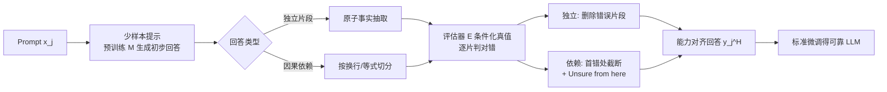

# High Accuracy, Less Talk (HALT): Reliable LLMs through Capability-Aligned Finetuning

**会议**: ICLR 2026  
**OpenReview**: [https://openreview.net/forum?id=LYqBnNVaXD](https://openreview.net/forum?id=LYqBnNVaXD)  
**代码**: 待确认  
**领域**: 大模型可靠性 / 幻觉抑制  
**关键词**: 幻觉, 选择性回答, 能力对齐, 后训练, 校准, 部分弃答  

## 一句话总结
HALT 在微调阶段把预训练模型自己生成的回答拆成"事实片段"并用带真值的评估器逐片判对错，只保留模型确实能正确生成的部分、其余替换为"Unsure from here"，从而训练出一个"只说有把握的话"的可靠 LLM——可调阈值在完整度与正确率之间权衡，单个 Llama3-70B 把四领域平均正确率从 51% 提到 87%。

## 研究背景与动机
**领域现状**：当前 LLM 对任何 prompt 都倾向于"有问必答"，无论问题多难、需要多少领域知识。对写诗这类创意任务这没问题，但在医疗、法律等对事实正确性要求极高的场景，模型在自身知识或能力不足时编造答案（幻觉），会带来真实风险。

**现有痛点**：已有缓解幻觉的工作大多落在两个不理想的极端。一类是测试时方法（语义熵检测、采样后处理、修改解码），需要额外推理开销且通常只覆盖知识检索、不覆盖复杂推理；另一类是"全答或全弃"的弃答训练（如 IDK），粒度太粗，要么完整回答要么整题拒答，无法表达"前几步我会、后面不确定"。同时还有一个被忽视的事实：**在模型不会的样本上做标准微调，反而会加剧幻觉**（Gekhman、Kang 等人观察），因为标准微调用的是 ground-truth 答案，可能超出预训练模型的真实能力边界，等于在教模型"装懂"。

**核心矛盾**：限制模型只输出高置信内容必然减少正确陈述的总数（withhold 掉那些其实可能对的信息），即**完整度（Recall）与正确率（Precision）天然对立**——不同部署场景需要不同的权衡点，但已有方法都给不了这个旋钮。

**本文目标**：后训练出一个输出与自身不确定性对齐的模型——有把握就说、没把握就（部分）弃答，并允许实践者按场景调节完整度/正确率的权衡，且测试时零额外开销。

**核心 idea**：**能力对齐微调（capability-aligned finetuning）**——不再用 ground-truth 答案微调，而是用"预训练模型自己生成、再剔除错误片段后"的回答来微调。理论依据是近期工作发现 LLM 微调并不习得新能力、只学会调用预训练中已有的知识与推理能力（Lin、Zhou 等），因此把训练目标限制在模型能力边界内，既不教它装懂、又能保留它真正会的部分。HALT 不是从更强模型蒸馏，而是直接让模型输出与它自己的能力匹配。

## 方法详解

### 整体框架
给定预训练模型 $M$ 和微调数据集 $D=\{(x_j, y_j)\}$，HALT 为每个 prompt 构造一个"能力对齐"的目标回答 $y_j^H$，组成新数据集 $D_H$ 再做标准微调。流水线四步：①用少样本提示让 $M$ 自己生成初步回答；②把回答切成可独立验证的事实片段；③用带真值的评估器 $E$ 逐片判对错；④后处理——删掉错误片段或用"Unsure from here"截断，得到 $y_j^H$。关键区分是回答的**依赖结构**：独立片段（如人物百科罗列事实）逐片独立判、删错保对；因果依赖片段（如数学推理、代码）一旦某步错则后续全错，从第一个错误处截断并加"Unsure from here"。

### 关键设计

**1. 用模型自己的少样本回答替代 ground-truth 做训练目标，把能力边界焊进数据**：HALT 不直接用 $y_j$ 微调，而是从 $D\setminus\{(x_j,y_j)\}$ 随机抽 4 个 prompt-response 对作为 in-context 示例，拼接目标 prompt 让 $M$ 生成初步回答 $y_j^{pt}=M(\text{concat}(C_j, x_j))$。这一步的精妙在于：用模型自己的生成而非外部金标准，初步回答天然落在模型能力范围内，再剔除其中的错误就得到"模型确实会、且确实对"的子集。论文用 Table 2 验证了这个替代代价很小——在 few-shot best-of-5 回答上微调，相比在 ground-truth 上微调，平均正确率只低 1.7%–3.7%（Mistral-7B 因 in-context learning 较弱差距到 5%–6%），印证"微调不带来新能力、只调用旧能力"的假设。

**2. 按依赖结构分而治之的片段切分与正确性判定**：HALT 假设回答要么由独立片段、要么由因果依赖片段构成，并按领域决定（数学/代码=依赖，百科=独立）。对**独立片段**，用 Song et al. 的事实抽取 LLM 拆出原子陈述（如"奥巴马出生于夏威夷"），评估器 $E$ 以对应 Wikipedia 全文为条件 $J$ 逐条独立判 $E:(f, J)\to\{0,1\}$，最后保留所有正确片段（若全错则整体设为"Unsure from here"）。对**因果依赖片段**，按等号、换行等自然边界切分，让评估器在 ground-truth 逐步解的条件下**只定位第一个出错的片段**，其后全部视为错误并替换成单个"Unsure from here"。评估器用 Llama3-405B 实现，Table 1 显示它每条回答平均误判仅 0.27（Wikipedia，9.58 片段）到 1.14（代码，7.85 行）个片段，数学上定位首错只偏 0.6 步，足够可靠。

**3. 用百分位采样把"能力估计"参数化，得到完整度/正确率旋钮**：单条贪婪解码只能给出一个能力估计点，HALT 改为采样 $N$ 条初步回答 $\{y_j^{pt,n}\}$，按平均片段正确率升序排，取第 $\alpha$ 百分位 $n^*=\lceil\alpha N\rceil$ 作为被处理对象。$\alpha$ 越小越保守——选"最差"的回答意味着只把那些连糟糕样本里都对的内容当作能力，训出的模型正确率高但完整度低；$\alpha$ 越大越激进。实验取 $\alpha\in\{40\%,60\%,80\%\}$（即第三/二/最准的回答，丢弃最差两条因其会逼出近零完整度）。这把"模型能力到底有多强"从一个固定假设变成可调超参，让同一套流水线产出从"惜字如金"到"知无不言"的连续谱系。

**4. F1 作为完整度-正确率的统一度量与 Add-On 软标注变体**：HALT 借鉴二分类，定义完整度（Recall）$=\frac{n_{correct}}{n_{desired}}$、正确率（Precision）$=\frac{n_{correct}}{n_{given}}$，用 F1（二者调和均值）衡量整体质量；$n_{desired}$ 有 $n_{all}$（完整回答所需片段数，与模型能力无关）和 $n_{capable}$（按模型能力定）两种口径。此外提供 **Add-On HALT** 变体：不删错误片段，而是把首个错误及其后片段标注为"Uncertain"保留下来，让用户看到完整回答的同时被告知哪些部分可能不对（便于外部核验或手改代码）——在排除被标注片段时正确率提升与默认 HALT 相当，忽略标注时则保住了与标准微调相当的完整度。

## 实验关键数据

### 主实验
四个开源模型（Llama3-8B/70B、Gemma2-9B、Mistral-7B）× 四领域（Wikibios 传记、MATH 竞赛数学、MedExQA 医疗问答、APPS 入门级编程），对比标准微调（Unchanged）、FactTune、IDK、RandomTrim。

| 设置 | 标准微调正确率 | HALT 调高正确率后 | 完整度保留 |
|------|--------------|-----------------|-----------|
| 单一可靠 Llama3-70B（四领域混合, α=40%） | 51% | **87%**（+36%） | 25% |
| Llama3-70B 各领域平均 | — | +17%（可调 ±17%） | 权衡可调 |
| F1 综合（相对各基线） | baseline | **平均 +4%** | — |

- 调 α 可让 Llama3-70B 正确率波动 ±17%、Llama3-8B ±12%，证明权衡旋钮有效。
- HALT 在多数设置下取得最高的完整度-正确率调和均值（$n_{all}$ 与 $n_{capable}$ 两种口径均如此）。

### 关键组件验证

| 验证项 | 结果 |
|--------|------|
| 评估器 Llama3-405B 误判（每回答片段数） | Wikipedia 0.27 / MATH 0.63 / 医疗 0.41 / 代码 1.14 |
| Few-Shot vs Ground-Truth 微调正确率差距 | 仅 1.7%–3.7%（Mistral 例外 5%–6%） |
| AlpacaEval 通用指令遵循（GPT-5 评判, 578 prompts） | 整体 50.8% 胜率（近平手）；Wikibios 66.0% 胜率 |

### 关键发现
- **选择性弃答不损通用能力**：HALT（α=0.6）对 Llama3-70B 基座近乎平手，在最看重事实正确的 Wikibios 上反而 66% 胜率领先；数学/代码/医疗上 41.8%–45.4% 轻微下降，源于评判者在"完整度优先"时会惩罚弃答。
- **微调不习得新能力**：用模型自己 few-shot 回答替代金标准只损 1.7%–3.7%，从数据侧佐证了 HALT 立论的核心假设。
- **F1 最优解形态**：示意分析显示最高 F1 来自"答对前几个片段后及时弃答"，而非硬答到底。

## 亮点与洞察
- **把"模型能力边界"从假设变成可操作的数据构造目标**——不靠探针、不靠测试时检测，直接在训练数据里就把"会/不会"刻进去，测试时零额外开销，这是与几乎所有幻觉缓解工作最本质的区别。
- **细粒度的部分弃答**比"全答/全弃"更贴近真实可靠性需求：数学推理"前三步对、第四步不确定"能被忠实表达，且天然覆盖推理任务而非只覆盖知识检索。
- **完整度/正确率旋钮 $\alpha$** 让同一方法适配从医疗（要极高正确率）到一般问答（要完整度）的不同部署场景，工程实用性强。
- 用"模型自己的 few-shot 回答"做训练目标这一步，既绕开了"金标准超出能力反增幻觉"的陷阱，又有 Table 2 的实证支撑，立论扎实。

## 局限与展望
- **依赖结构二分过于简化**：只假设回答是"全独立"或"全因果依赖"，现实中存在依赖图等更复杂结构，论文明确将其留作未来工作。
- **评估器需要真值**：构造数据时评估器 $E$ 必须条件化在 ground-truth（Wikipedia 全文 / 逐步解）上，强依赖高质量真值与一个强评估模型（Llama3-405B），对缺乏金标准的领域难以套用。
- **完整度代价显著**：调到最高正确率时完整度只剩 25%（87% 正确率场景），意味着大量原本可能正确的信息被弃掉，"少说话"的代价不小。
- **额外训练开销**：每个待对齐模型都要重新生成 + 后处理数据（采样 N 条、逐片评估），虽然论文论证 1000 样本可能就够、成本可接受，但仍是一次性额外管线。
- **In-context learning 弱的模型受拖累**：Mistral-7B 因 few-shot 能力差，替代金标准的差距扩大到 5%–6%，进而影响最终 HALT 模型效果。

## 相关工作与启发
- **幻觉检测**（探针 Su、隐状态 Chen、语义熵 Farquhar）与**缓解**（权重编辑 Zhang、解码修改 Chuang/DoLa、偏好训练 FactTune、测试时后处理 Mohri）：HALT 区别在于训练侧解决、零测试开销、覆盖推理。
- **弃答训练**（IDK、Brahman、Feng 等）多为"全答或全弃"；HALT 做**片段级部分弃答**并提供权衡旋钮。
- **校准与口头不确定性**（Kadavath logits 校准、Lin 口头置信、Band/Stengel-Eskin 的 verbalized/calibrated hedging）为"模型知道自己不知道"提供基础，HALT 把这种内部校准转化为可执行的选择性生成。
- **"微调不习得新能力"**（Lin、Zhou）与**"在未知样本上微调增幻觉"**（Kang、Gekhman、Tian）是 HALT 立论的两块基石。启发：可靠性问题或许更应在数据构造层面、而非解码或后处理层面解决。

## 评分
- **新颖性**: ⭐⭐⭐⭐ 把"能力边界"焊进微调数据、片段级部分弃答 + 可调权衡旋钮的组合是清晰且少见的角度，虽各组件（事实抽取、校准、弃答）皆有前人，但整合方式与"用模型自身回答替代金标准"的洞察有明显新意。
- **实验充分度**: ⭐⭐⭐⭐ 4 模型 × 4 领域、对比 4 个基线、含评估器误差/few-shot 替代/通用能力 AlpacaEval 等关键验证，覆盖面扎实；略弱在依赖结构二分的假设未被压力测试。
- **写作质量**: ⭐⭐⭐⭐ 动机—方法—权衡的逻辑链清晰，Figure 1/2/4 把"标准 vs HALT""独立 vs 依赖片段""F1 形态"讲得很直观，符号定义规范。
- **价值**: ⭐⭐⭐⭐ 高风险场景对"宁可少说也别编"的可靠 LLM 有强现实需求，测试时零开销 + 可调旋钮的工程友好度高，单模型 51%→87% 的提升有说服力。

<!-- RELATED:START -->

## 相关论文

- [\[AAAI 2026\] Does Less Hallucination Mean Less Creativity? An Empirical Investigation in LLMs](../../AAAI2026/hallucination/does_less_hallucination_mean_less_creativity_an_empirical_investigation_in_llms.md)
- [\[ICLR 2026\] BARREL: Boundary-Aware Reasoning for Factual and Reliable LRMs](barrel_boundary-aware_reasoning_for_factual_and_reliable_lrms.md)
- [\[ICLR 2026\] Enhancing Hallucination Detection through Noise Injection](enhancing_hallucination_detection_through_noise_injection.md)
- [\[ACL 2025\] ICR Probe: Tracking Hidden State Dynamics for Reliable Hallucination Detection in LLMs](../../ACL2025/hallucination/icr_probe_tracking_hidden_state_dynamics_for_reliable_hallucination_detection_in.md)
- [\[ICLR 2026\] HalluGuard: Demystifying Data-Driven and Reasoning-Driven Hallucinations in LLMs](halluguard_demystifying_data-driven_and_reasoning-driven_hallucinations_in_llms.md)

<!-- RELATED:END -->
