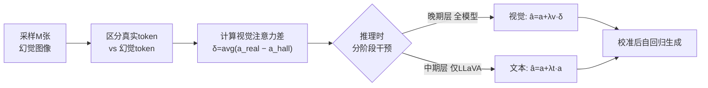

# Imitating the Truth: Attention-aware Truth-Guided Enhancement for Hallucination Mitigation in Large Vision-Language Models

**会议**: ICLR 2026  
**OpenReview**: [https://openreview.net/forum?id=fzZAh18s9G](https://openreview.net/forum?id=fzZAh18s9G)  
**代码**: 待确认  
**领域**: 多模态大模型 / 幻觉缓解  
**关键词**: LVLM, 幻觉缓解, 注意力干预, 训练无关, 解码时增强  

## 一句话总结
本文发现 LVLM 在生成"真实 token"和"幻觉 token"时存在**分阶段、模型特异**的注意力差异，提出训练无关的 AGE 框架——在推理时把视觉/文本注意力"校准"成真实 token 的注意力模式，从而无需重训、不损流畅度地缓解幻觉。

## 研究背景与动机
- **领域现状**：大型视觉语言模型（LVLM，如 LLaVA、MiniGPT-4、mPLUG-Owl2）在图像描述、VQA、指令跟随上表现强劲，但普遍存在**幻觉**——生成与图像证据不符甚至矛盾的内容，严重限制其在自动驾驶、医疗诊断等高风险场景的部署。
- **现有痛点**：主流缓解路线有两类——引入外部辅助模块（Woodpecker、LURE，需额外数据/模型）和解码时干预（OPERA、VCD）。后者虽模型无关、易部署，但**普遍以粗粒度方式工作**：跨层、跨模态地施加统一的注意力增强，无法刻画多模态推理的细腻动态。
- **核心矛盾**：幻觉的成因被简单归结为"视觉关注不足"或"文本先验干扰"，但**一刀切地全局增强视觉注意力既不充分、甚至可能适得其反**——真正的问题是注意力的分阶段、模型特异动态没有被复现。
- **本文目标**：在不训练、不改架构的前提下，对症下药地在"分歧最大"的推理阶段做细粒度注意力干预，让模型模仿真实 token 的注意力行为。
- **核心 idea**：**【真实 token 模仿】** 把一条幻觉回复拆成"真实 token"（图像中确实存在的物体）和"幻觉 token"（凭空捏造的物体），逐层对比二者注意力，发现真实 token 的注意力分布有规律可循；**幻觉的本质是模型未能复现真实 token 那套分阶段、敏感的注意力动态**，因此只要引导模型去模仿它即可缓解。

## 方法详解

### 整体框架
AGE（Attention-aware Truth-Guided Enhancement）是一个训练无关、解码时的框架。它先用极少量（M=10）已知会引发幻觉的 COCO 图像采样回复，区分真实/幻觉 token，计算二者在最后一层的**视觉注意力差**得到一个固定的"目标方向向量" δ；推理时把 δ 注入晚期层的视觉注意力（所有模型通用），并对 LLaVA 这类中期依赖文本的模型额外做文本注意力自乘增强。整个流程不改训练、不改架构，只在前向时改写注意力分数。

### 关键设计

**1. 分阶段注意力差异分析：定位"在哪干预"** 作者把 LVLM 的 L 层解码器划分为早期（0–16）、中期（16–26）、晚期（26–31）三阶段，并定义逐层注意力差异度量。对每个样本 $i$，先算真实 token 与幻觉 token 在某层 $l$ 的平均注意力和 $\bar{s}^{(l,i)}_{(\text{real,vision})}$ 与 $\bar{s}^{(l,i)}_{(\text{hall,vision})}$，再跨 $N=100$ 张图聚合成 $\text{Diff}^l_{\text{image}} = \frac{1}{N}\sum_i (\bar{s}^{(l,i)}_{(\text{real,vision})} - \bar{s}^{(l,i)}_{(\text{hall,vision})})$。$\text{Diff}^l_{\text{image}}>0$ 意味着真实 token 在第 $l$ 层比幻觉 token 更关注视觉。分析揭示了一个**关键共性**：所有模型在晚期阶段（26–31 层）都稳定地呈现显著正差——真实回复更关注视觉，这为通用干预提供了切入点；而中期注意力则高度**模型特异**（LLaVA 中期更依赖文本，MiniGPT-4/mPLUG-Owl2 则视觉全程主导），决定了干预必须分模型定制。

**2. 模仿图像注意力：方向性视觉校准** 针对所有模型晚期共有的"视觉关注不足"，作者没有用粗糙的方向无关自乘放大，而是构造一个**方向向量** $\delta \in \mathbb{R}^n$（$n$ 为视觉 token 数）来精确指向"从幻觉模式到真实模式"的偏移。具体地，从最后一层 $L$ 取真实/幻觉 token 的平均图像注意力向量 $a^i_{(\text{real,vision})}$ 与 $a^i_{(\text{hall,vision})}$，再对 $M$ 个样本做加权平均：$\delta = \frac{1}{M}\sum_{i=1}^{M} w_i \cdot (a^i_{(\text{real,vision})} - a^i_{(\text{hall,vision})})$。推理时把它注入晚期层视觉注意力：$\hat{a}^l_{\text{vision}} = a^l_{\text{vision}} + \lambda_v \times \delta$（实验取 $\lambda_v=100$）。由于 δ 是跨样本聚合的通用方向，它捕捉的是模型注意力空间里的普适校正趋势，而非过拟合到那 M 个样本。

**3. 模仿文本注意力：模型特异的自乘增强** 对 LLaVA-1.5 这类在中期阶段更依赖文本上下文的模型，作者额外加固文本注意力。由于文本注意力向量维度随生成动态变化（无法预先算固定方向向量），这里改用**自乘增强**作为代理：$\hat{a}^l_{\text{text}} = a^l_{\text{text}} + \lambda_t \times a^l_{\text{text}}$（取 $\lambda_t=3$）。它虽不指定具体校正方向，但能放大模型对自身生成上下文的关注，从而复现真实 token 在中期的文本依赖行为。对 MiniGPT-4、mPLUG-Owl2 等视觉全程主导的模型则不做文本干预——这正体现了"分阶段、按模型自适应"的核心理念。

**4. 校准式自回归生成：把干预编织进解码** 上述干预被无缝整合进标准自回归流程：每个解码步 $k$、每层 $l$，模型根据该层所属阶段**条件式**地施加干预——所有 LVLM 在晚期层用 δ 移位视觉注意力，LLaVA 额外在中期层做文本自乘，其余层保持不变。随后用校准后的注意力 $\hat{a}^{(l,k)}_{\text{vision}}, \hat{a}^{(l,k)}_{\text{text}}$ 计算下一隐状态 $h^{(l+1)}_k = h^{(l)}_k + \text{AttentionSubLayer}(\hat{a}^{(l,k)}_{\text{vision}}, V^{(l)}_{\text{vision}}, \hat{a}^{(l,k)}_{\text{text}}, V^{(l,k)}_{\text{text}})$。整个过程在抑制幻觉的同时保持与视觉证据的对齐，提供了一条可解释的可信生成路径。

## 实验关键数据

### 主实验表格
COCO 图像描述（CHAIR，max new token=64，越低越好；BLEU 越高越好），三模型平均：

| 方法 | CS↓ | CI↓ | BLEU↑ |
|------|-----|-----|-------|
| Greedy | 24.95 | 9.14 | 15.21 |
| OPERA | 24.42 | 8.65 | 15.56 |
| VCD | 26.95 | 10.07 | 14.46 |
| LURE | 22.87 | 8.12 | 15.55 |
| VISTA | 20.10 | 6.45 | - |
| **AGE (Ours)** | **17.15** | **6.35** | **16.16** |

POPE 基准（MiniGPT-4，三设置平均）：

| 方法 | Acc↑ | F1↑ |
|------|------|-----|
| Greedy | 56.77 | 69.32 |
| OPERA | 53.77 | 68.12 |
| VCD | 57.11 | 64.35 |
| **AGE (Ours)** | **73.86** | **69.37** |

### 消融实验表格
LLaVA-1.5 / COCO（max new token=128）。SMA=视觉自乘放大；AGE_T=文本注意力干预；AGE_I=方向向量视觉干预：

| SMA | AGE_T | AGE_I | CS↓ | CI↓ | BLEU↑ |
|-----|-------|-------|-----|-----|-------|
| | | | 53.4 | 14.2 | 10.5 |
| ✓ | | | 43.1 | 13.1 | 10.1 |
| | ✓ | | 50.4 | 14.9 | 10.4 |
| | | ✓ | 35.4 | 10.9 | 10.4 |
| | ✓ | ✓ | **31.8** | **10.0** | 10.5 |

### 关键发现
- AGE 在 CHAIRS 上比最新 SOTA（VISTA）再降 2.85%，且 BLEU 不降反升 0.95%，说明缓解幻觉**不以牺牲流畅度/完整度为代价**。
- POPE 上 AGE 比基线平均提升 17.09% Accuracy、比 OPERA 高 20.09% Accuracy，验证"对准真实注意力行为"比"惩罚文本注意力"更有效。
- 消融显示：方向向量视觉干预 AGE_I（CHAIRS 改善 18.0%）显著优于方向无关的自乘放大 SMA（10.3%），证明**精确的向量引导比粗糙缩放更管用**；文本干预 AGE_T 单独也带来 3.0% 改善，二者叠加最佳。
- 仅用 **10 张图**计算 δ 即达 SOTA，说明增益来自复现注意力动态而非外部数据增强。

## 亮点与洞察
- **诊断先行**：把"幻觉"细化到 token 级、逐层级的注意力差异分析，提出"幻觉=未复现真实 token 的分阶段注意力动态"这一可操作的新解释，比"视觉关注不足"更精准。
- **方向向量 vs 自乘**：用真实−幻觉的注意力差构造固定方向向量 δ，比方向无关的全局放大更有针对性，这是相对 OPERA/VCD 等的核心技术增量。
- **训练无关、模型自适应**：晚期视觉干预全模型通用、中期文本干预按模型定制，体现"哪里分歧大就在哪干预"的工程哲学；仅需 10 张图、不改训练与架构，落地成本极低。

## 局限与展望
- δ 在**最后一层**计算并注入晚期层，依赖"晚期视觉差为正"这一经验观察；对注意力动态截然不同的新架构（如非 Transformer 解码器）是否成立未知。
- 文本干预只能用自乘代理（因维度动态变化），缺乏视觉那样的方向性校正，理论上不够优雅；阶段划分（0-16/16-26/26-31）和 $\lambda_v=100, \lambda_t=3$ 等超参均为经验设定，跨模型迁移需重新标定。
- 评测集中在物体存在性幻觉（CHAIR/POPE/MME 子集），对关系、属性、计数等更复杂幻觉的覆盖有限。

## 相关工作与启发
- **解码时干预**：OPERA（惩罚过度自信、精炼 token 选择）、VCD（对比原始与扰动视觉输入的输出分布）、DoLA 等，AGE 与之同属模型无关路线，但用方向向量做细粒度、分阶段校准，区别于它们的粗粒度全局调整。
- **外部模块**：Woodpecker、LURE 依赖额外数据/辅助模型纠错，AGE 仅用 10 张图、无需重训即超越之，凸显"内部注意力校准"的性价比。
- **启发**：把生成内容拆成"可验证真实"与"幻觉"两类、对比其内部表征/注意力差异，是一种通用的可解释诊断范式，可推广到 LLM 文本幻觉、Agent 决策可信度等场景。

## 评分
- **新颖性**: ⭐⭐⭐⭐ token 级分阶段注意力差异分析 + 方向向量校准，视角新且有可解释性，但仍属"解码时注意力干预"大家族的延伸。
- **实验充分度**: ⭐⭐⭐⭐ 覆盖三模型 × 三基准（CHAIR/POPE/MME）+ 消融 + 模型规模分析，证据扎实；幻觉类型覆盖稍窄。
- **写作质量**: ⭐⭐⭐⭐ 动机—分析—方法逻辑清晰，图 1/2/3 把"差异→干预"讲得直观，公式完整。
- **价值**: ⭐⭐⭐⭐ 训练无关、仅需 10 图、即插即用且不损流畅度，工程落地价值高。

<!-- RELATED:START -->

## 相关论文

- [\[ICLR 2026\] Dynamic Multimodal Activation Steering for Hallucination Mitigation in Large Vision-Language Models](dynamic_multimodal_activation_steering_for_hallucination_mitigation_in_large_vis.md)
- [\[ICLR 2026\] Hallucination-aware Intermediate Representation Edit in Large Vision-Language Models](hallucination-aware_intermediate_representation_edit_in_large_vision-language_mo.md)
- [\[CVPR 2026\] CausalLens: Sensitivity-Guided Multi-Head Causal Intervention for Hallucination Mitigation in Large Vision-Language Models](../../CVPR2026/hallucination/causallens_sensitivity-guided_multi-head_causal_intervention_for_hallucination_m.md)
- [\[ICLR 2026\] NDAD: Negative-Direction Aware Decoding for Large Language Models via Controllable Hallucination Signal Injection](ndad_negative-direction_aware_decoding_for_large_language_models_via_controllabl.md)
- [\[ACL 2026\] Spotlight and Shadow: Attention-Guided Dual-Anchor Introspective Decoding for MLLM Hallucination Mitigation](../../ACL2026/hallucination/spotlight_and_shadow_attention-guided_dual-anchor_introspective_decoding_for_mll.md)

<!-- RELATED:END -->
