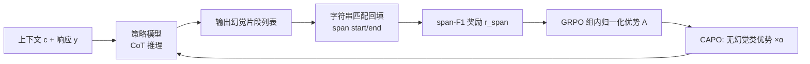

# Learning to Reason for Hallucination Span Detection

**会议**: ICLR 2026  
**OpenReview**: [https://openreview.net/forum?id=ECAK3P92eg](https://openreview.net/forum?id=ECAK3P92eg)  
**代码**: 待确认  
**领域**: 幻觉检测 / 强化学习  
**关键词**: 幻觉跨度检测, 强化学习, GRPO, 推理, span-F1, RAGTruth  

## 一句话总结
本文提出 RL4HS：用强化学习（基于 span-F1 奖励的 GRPO）训练一个会"先推理后定位"的 7B/14B 模型来精确检测幻觉跨度，并设计 Class-Aware Policy Optimization (CAPO) 修正奖励对"无幻觉"类的系统性偏置，在 RAGTruth 上超越 SFT、专有大推理模型（GPT-5、o3）。

## 研究背景与动机
- **领域现状**：大多数幻觉检测工作把问题建模成**二分类**——判断输出"是否含幻觉"。但真实应用（摘要、长问答）往往需要知道**具体哪一段**是幻觉，才能评估内容可靠性，于是有了更细粒度的"幻觉跨度检测 (hallucination span detection)"任务。
- **现有痛点**：跨度检测本质是一个**多步决策过程**——要先抽出输出里所有事实陈述，再逐条核对是否被输入上下文支持。已有的 CoT 工作只在二分类上验证了推理有用，没人探索过**为跨度检测专门训练一个推理模型**；而通用领域的大推理模型（数学/代码训练出来的）直接迁移过来表现也很差。
- **核心矛盾**：CoT 推理在跨度检测上**单次采样 (K=1) 几乎没有增益**，但作者发现当**多次采样取最优 (Span-F1@K)** 时，CoT 随 K 增大显著拉开差距——说明推理"有潜力生成至少一个正确答案"，只是这种能力没被激发到首位输出。
- **本文目标**：回答两个问题——(i) 学到的推理过程对跨度检测是否有用、怎么学？(ii) 是否必须为该任务专门学推理，还是通用推理模型就够？
- **核心 idea**：**用 RL 把"多采样才偶尔答对"的推理潜力固化成"首位就答对"的能力**。以可验证的 span-F1 作为奖励跑 GRPO；并针对 span-F1 奖励的**类别不对称**问题提出 CAPO，给"无幻觉"样本的优势值乘一个缩小因子，避免模型走捷径（**全预测无幻觉 → 高精度低召回的奖励 hacking**）。

## 方法详解

### 整体框架
RL4HS 把跨度检测建模成**生成式**任务：给定上下文 $c$ 和生成响应 $y$，模型先输出一段 CoT 推理（核对每条事实与上下文的一致性），再直接生成幻觉文本片段列表，最后通过字符串匹配回填每段在 $y$ 中的 start/end 位置。训练用 GRPO，奖励直接取预测跨度与真值跨度的 span-F1；再用 CAPO 修正类别奖励失衡。

### 关键设计

**1. 生成式建模 + Span-F1@K 动机验证：把"采样潜力"作为 RL 的切入点。** 已有方法要么用判别式 token 级二分类、要么用生成式直接输出片段；作者选生成式，因为它天然适配 CoT 推理。关键观察来自一个预实验：对每个输入采样 $K$ 次、按 span-F1 取最优，画出 Span-F1@K 曲线。在 $K=1$ 时 CoT 几乎无增益，但随 $K$ 增大，带 CoT 的曲线相比不带 CoT 显著抬升——这说明正确的推理路径已经存在于采样分布里，只是没排在首位。这条曲线正是用 RL（而非 SFT）的直接依据：RL 能把"偶尔采到的好答案"提升为稳定的首位输出。评测统一用数据集级 span-F1，$\text{Precision}=|P\cap G|/|P|$、$\text{Recall}=|P\cap G|/|G|$，其中 $P$、$G$ 分别是预测和真值跨度的字符位置集合并集。

**2. 可验证 Span-F1 奖励驱动的 GRPO：用相对组内排名替代价值网络。** 训练框架选 GRPO 而非 PPO，省去显式价值网络，直接用组内相对得分算 baseline。优势定义为组内奖励的标准化值 $A(\tau)=\big(R_\tau-\text{mean}\{R_i\}\big)/\text{std}\{R_i\}$。奖励函数则直接挂在目标指标上：当真值与预测都为空（确实无幻觉且正确判空）时给满分 $r_{span}=1$，否则取 $\text{span-F1}(\hat S, S)$。这种设计让"有幻觉"和"无幻觉"两类都能被同一奖励统一处理，且奖励完全可验证、无需训练额外的奖励模型。

**3. 诊断奖励不对称：定位 GRPO 的系统性偏置根因。** 作者没有直接套 GRPO 就完事，而是先做了优势分布诊断（Figure 2/3）：发现**无幻觉预测系统性地拿到比幻觉预测更高的优势值**，与预测对错无关。根因在于 $r_{span}$ 的内在不对称——无幻觉类只要输出空列表就能轻松拿高分，而幻觉类必须**精确定位**才有分，小错误就让 F1 奖励陡降。结果 GRPO 倾向于过度激励"判无幻觉"的保守行为，表现为**高精度、被压制的召回**，即一种 reward hacking。值得注意的是：单纯把"判空正确"的奖励值调小**没用**，因为 GRPO 的标准化步骤会把这种缩放抵消掉。

**4. Class-Aware Policy Optimization (CAPO)：在优势层面而非奖励层面做类别再平衡。** 既然在奖励值上做手脚会被标准化抵消，CAPO 改在**优势值**上动刀：只对属于无幻觉类的样本，给其标准化后的优势乘一个缩放因子 $\alpha$，即 $\hat A(\tau)^{(nh)}=\big(\alpha\cdot R_\tau-\text{mean}\{R_i\}\big)/\text{std}\{R_i\}$。取 $\alpha=0.5$（基于验证集选）小于 1，从而压低无幻觉类对策略更新的主导权，缓解其奖励稀疏带来的失衡。训练动态（Figure 4）证实：GRPO 召回随训练持续下滑，而 CAPO 在保持高精度的同时稳住召回，最终 span-F1 一路领先。

## 实验关键数据

### 主实验表格（RAGTruth，span-level F1，三任务平均）

| 模型 | Sum. F1 | QA F1 | D2T F1 | Avg. F1 | Avg. P | Avg. R |
|------|---------|-------|--------|---------|--------|--------|
| GPT-4o-mini w/ CoT | 38.4 | 27.3 | 33.7 | 33.1 | 37.1 | 30.2 |
| GPT-5 w/ CoT | 36.5 | 44.4 | 45.7 | 42.2 | 30.0 | 71.2 |
| o3 w/ CoT | 48.5 | 49.9 | 55.2 | 51.2 | 43.2 | 63.0 |
| Qwen3-14B (推理) | 35.8 | 30.6 | 34.8 | 33.7 | 36.2 | 32.0 |
| SFT-7B | 44.1 | 51.3 | 54.8 | 50.1 | 54.1 | 47.0 |
| SFT-14B | 52.7 | 53.9 | 59.6 | 55.4 | 57.4 | 53.8 |
| Multi-View Attention-7B† | 41.5 | 50.6 | 55.2 | 49.1 | 47.2 | 55.5 |
| **RL4HS-7B** | 50.9 | 56.4 | 60.4 | **55.9** | 62.9 | 51.2 |
| **RL4HS-14B** | **57.6** | 54.8 | 62.6 | **58.3** | 61.3 | 56.1 |

- RL4HS-7B 平均 F1 (55.9) **超过 SFT-7B (50.1)**，甚至超过 SFT-14B (55.4)；RL4HS-14B 进一步到 58.3，**超越 GPT-5 (42.2) 与 o3 (51.2)** 等更大的专有推理模型。

### 消融实验表格（CAPO vs GRPO，Qwen2.5-7B）

| 变体 | Avg. F1 | Avg. P | Avg. R |
|------|---------|--------|--------|
| RL4HS-GRPO-7B | 54.2 | 64.9 | 47.3 |
| **RL4HS-7B (CAPO)** | **55.9** | 62.9 | **51.2** |

- GRPO 精度更高 (64.9) 但召回被压低 (47.3)；CAPO 用略降精度换来召回 +3.9 (47.3→51.2)，整体 F1 提升，印证奖励 hacking 被缓解。

### 关键发现
- **推理潜力靠 RL 激发**：CoT 在 K=1 无用、Span-F1@K 随 K 显著抬升 → RL 把分布里的好答案提到首位。
- **领域内推理是必要的**：留一任务 (leave-one-out) 训练的 RL4HS-OOD-7B 仍优于 QwQ-32B、Qwen3、GPT 系列，说明**专门为跨度检测学推理**比通用大推理模型更有效，且具一定跨任务泛化。
- **奖励缩放不能简单做在奖励值上**：GRPO 的标准化会抵消，必须在优势层面 (CAPO) 干预。

## 亮点与洞察
- **诊断驱动的方法设计**：先用优势分布图把"无幻觉类被系统性偏袒"这个隐患量化出来，再针对性提出 CAPO，逻辑闭环漂亮，而不是盲目堆 trick。
- **小模型胜大模型**：7B 专训模型打败 GPT-5/o3，给"任务专用 RL 比通用推理模型更划算"提供了有力证据。
- **可验证奖励**：直接用 span-F1 当奖励，无需训练奖励模型，工程上简洁可复现。
- **CAPO 的洞察具普适性**：凡是用 GRPO 且存在"空答案/保守答案天然好拿分"的不对称任务（如检测、抽取类任务），都可能遇到同款奖励 hacking，CAPO 的优势层再加权思路可迁移。

## 局限与展望
- 只在 **RAGTruth** 单一基准、三个 CNLG 任务上验证，跨数据集/跨语言泛化未知。
- 缩放因子 $\alpha=0.5$ 靠验证集手调，对不同任务/类别分布是否需要自适应调整未深入探讨。
- 生成式建模需"字符串匹配回填位置"，当幻觉片段与原文措辞不完全一致时定位可能失败。
- 只处理二类（幻觉/非幻觉）的不对称，未扩展到多类型幻觉（如实体错误 vs 关系错误）的细粒度奖励设计。

## 相关工作与启发
- **二分类幻觉检测**（Yang、Tang、Ji 等）：本文从"是否含幻觉"推进到"哪些跨度是幻觉"。
- **生成式 vs 判别式跨度检测**（Wu et al. 2023 RAGTruth；Ogasa & Arase 2025 Multi-View Attention）：本文沿用生成式以适配 CoT。
- **GRPO / 可验证奖励 RL**（Shao et al. DeepSeekMath）：本文把数学/代码领域成熟的 GRPO 迁移到幻觉检测，并暴露+修正了其在不对称任务上的奖励偏置——对所有用 GRPO 做检测/抽取任务的工作都有警示意义。
- **启发**：当 RL 奖励存在"懒惰捷径天然高分"时，与其改奖励值（会被标准化抵消），不如在优势/梯度层面做类别再平衡。

## 评分
- 新颖性: ⭐⭐⭐⭐ 首个用 RL+span 级奖励训练跨度检测推理模型，CAPO 对 GRPO 奖励不对称的诊断与修正有独立价值。
- 实验充分度: ⭐⭐⭐⭐ 覆盖专有/开源/SFT/通用推理多类 baseline，含 5 个研究问题 (Q1–Q5)、训练动态、留一泛化；但仅限 RAGTruth 单基准。
- 写作质量: ⭐⭐⭐⭐ 问题驱动结构清晰，优势分布诊断图把动机讲透。
- 价值: ⭐⭐⭐⭐ 7B 超 GPT-5/o3 的结果有说服力，CAPO 思路可迁移到其他不对称 RL 任务。

<!-- RELATED:START -->

## 相关论文

- [\[ICLR 2026\] Hallucination Reduction with CASAL: Contrastive Activation Steering for Amortized Learning](hallucination_reduction_with_casal_contrastive_activation_steering_for_amortized.md)
- [\[ICLR 2026\] Mechanistic Detection and Mitigation of Hallucination in Large Reasoning Models](mechanistic_detection_and_mitigation_of_hallucination_in_large_reasoning_models.md)
- [\[ICLR 2026\] Enhancing Hallucination Detection through Noise Injection](enhancing_hallucination_detection_through_noise_injection.md)
- [\[ACL 2025\] Learning Auxiliary Tasks Improves Reference-Free Hallucination Detection in Open-Domain Long-Form Generation](../../ACL2025/hallucination/learning_auxiliary_tasks_improves_reference-free_hallucination_detection_in_open.md)
- [\[ICLR 2026\] Beyond In-Domain Detection: SpikeScore for Cross-Domain Hallucination Detection](beyond_in-domain_detection_spikescore_for_cross-domain_hallucination_detection.md)

<!-- RELATED:END -->
