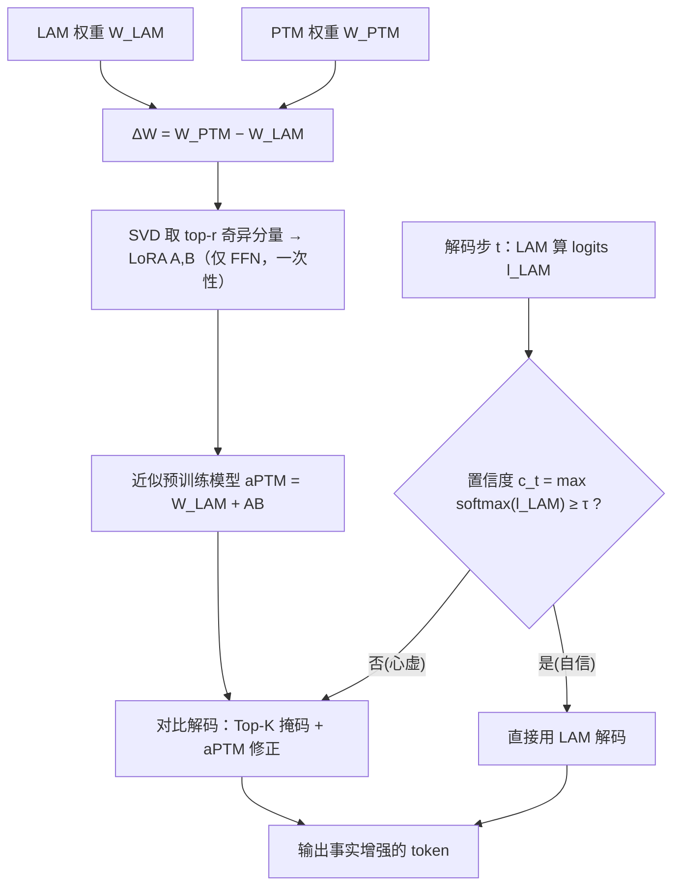

# Leveraging Pretrained Knowledge at Inference Time: LoRA-Gated Contrastive Decoding for Multilingual Factual Language Generation in Adapted LLMs

**会议**: ICLR 2026  
**OpenReview**: [https://openreview.net/forum?id=vzlDdOzXAh](https://openreview.net/forum?id=vzlDdOzXAh)  
**代码**: 待确认  
**领域**: 幻觉抑制 / 多语言事实性 / 推理时解码  
**关键词**: 灾难性遗忘, 对比解码, LoRA, FFN 知识记忆, 训练免费, 多语言 LLM  

## 一句话总结
LGCD 用 SVD 把"原始预训练模型 vs 语言适配模型"的 FFN 权重差分解成一组 LoRA 矩阵，在解码时按 token 置信度动态判断是否触发对比解码，把适配过程中被灾难性遗忘掉的事实知识"重新注入"回来——全程无需训练、无需原始预训练数据。

## 研究背景与动机
- **领域现状**：把通用 LLM 通过持续预训练（CPT）或指令微调适配到某个特定语言（如中文、阿拉伯语、斯瓦希里语），是提升小语种能力的主流做法，社区里已有大量这类 language-adapted models（LAM）。
- **现有痛点**：适配会引发**灾难性遗忘**——模型为了对齐目标语言的风格与流畅度，覆盖掉了初始预训练阶段习得的通用世界知识，导致事实错误和幻觉增多。理想解法是混合原始预训练数据重训，但 LLaMA/Qwen 等主流模型的预训练数据**不公开、不可得**，重训成本也高得离谱。
- **核心矛盾**：适配后的模型在"领域流畅度"和"通用事实知识"之间存在固有 trade-off——既想保留小语种的地道表达，又不想丢掉原模型的事实底子，二者难以兼得。
- **本文目标**：在**不再训练、不访问原始预训练数据**的前提下，于推理时把原始预训练模型（PTM）里残存的事实知识"借"给已适配模型 LAM，提升其事实准确率。
- **核心 idea**：**[FFN 是事实知识的 key-value 记忆]** 既有工作发现 Transformer 的 FFN 层充当存储事实知识的键值记忆。作者据此推断：PTM 的 FFN 权重里隐含的知识可以被显式抽取出来，在解码时按需注入 LAM——只在 LAM "心虚"（低置信）的 token 上触发，避免破坏其流畅度。

## 方法详解

### 整体框架
LGCD（LoRA-Gated Contrastive Decoding）是一个训练免费的推理时解码框架，由三步串成：①一次性地从 PTM 与 LAM 的 FFN 权重差里用 SVD 抽出 LoRA 近似，得到一个"近似预训练模型"aPTM；②解码时逐 token 测 LAM 的置信度，置信就直接用 LAM、心虚就转入对比解码；③对比解码只在 LAM 预测的 Top-K 候选上，用 aPTM 的事实 logits 去修正 LAM，把事实知识塞进去而尽量不扰动流畅生成。

### 关键设计

**1. FFN 权重差的 LoRA 抽取：把"被遗忘的知识"压缩成一次性的轻量旁路。** LGCD 不去碰 LAM 本身，而是逐 FFN 层计算两模型的参数差 $\Delta W_\ell = W^{PTM}_\ell - W^{LAM}_\ell$，再对它做奇异值分解 $\Delta W_\ell = U_\ell \Sigma_\ell V_\ell^\top$，只保留 top-$r$ 个奇异分量构成 LoRA 矩阵 $A_\ell = U_\ell[:,:r]\sqrt{\Sigma_\ell[:r]}$、$B_\ell = \sqrt{\Sigma_\ell[:r]}V_\ell^\top[:r,:]$，于是 PTM 的 FFN 权重被近似为 $W^{aPTM}_\ell = W^{LAM}_\ell + A_\ell B_\ell$。这一步妙在：整个框架里**只算一次**，既不修改 LAM、也不需要同时部署两个完整模型占显存，等于用一组低秩矩阵把"PTM 相对 LAM 多出来的那部分事实知识"提炼出来随用随取；且只作用于 FFN 层（附录 A.3 验证只改 FFN 效果最好），其余组件保持 LAM 原样。

**2. 置信度动态门控：让模型在心虚的时候才去"查事实"。** 每个解码步先让 LAM 算出 logits $l^{LAM}_t$，token 级置信度取词表上的最大概率 $c_t = \max(\mathrm{softmax}(l^{LAM}_t))$。给定阈值 $\tau$，若 $c_t \ge \tau$ 就直接用 LAM 解码（保住领域流畅度），若 $c_t < \tau$ 才转入对比解码去注入 PTM 知识。这种门控把"何时该相信适配模型、何时该求助原模型"交给逐 token 的不确定性来裁决——自信时不打扰、心虚时才纠偏，从机制上化解流畅度与事实性的 trade-off。阈值 $\tau$ 按各语言数据可得性分别设定（附录 A.8）。

**3. Top-K 掩码下的对比解码：定向修正而非粗暴覆盖。** 触发对比时，先用 LoRA 旁路算出 aPTM 的 logits $l^{aPTM}_t = l^{LAM}_t + \mathrm{LoRA}(\Delta W_\ell, h^{LAM}_t)$；为防止对比把两模型概率都很低的"垃圾 token"选出来，只在 LAM 的 Top-K 候选 $T_K = \mathrm{TopK}(l^{LAM}_t, K)$ 内做修正，集合外直接置 $-\infty$。对比 logits 为 $l^{contrast}_t[i] = l^{LAM}_t[i] + \beta\,(l^{aPTM}_t[i] - \alpha\, l^{LAM}_t[i])$（$i \in T_K$）。这里 $\beta$ 控制整体对比强度，$\alpha \in [0,1]$ 控制对 LAM logits 的下压程度——修正项 $(l^{aPTM}_t[i] - \alpha\, l^{LAM}_t[i])$ 在抬高 aPTM 事实信号的同时温和地压制 LAM 可能的过度自信，靠调 $\alpha$ 平滑地调节 LAM 影响力而非突兀地把它整个推翻。

## 实验关键数据

设置：9 种语言（zh/de/pt/ar/fa/ja/ko/id/sw）、12 个公开 LAM（多为 LLaMA-3 系适配版）；任务含多项选择 QA（Global MMLU、多语言 TruthfulQA）与长文本生成（医疗 QA、Multi-FAct）。基线含 Nucleus Sampling、DoLa（层间对比解码）、TIES、SLERP（模型融合）。

### 主实验表格

| 基准 | 设置 | PTM | LAM(NS) | DoLa | TIES | SLERP | **LGCD** |
|---|---|---|---|---|---|---|---|
| Global MMLU | 0-shot avg | 0.448 | 0.441 | 0.439 | 0.449 | 0.445 | **0.477** |
| Global MMLU | 5-shot avg | 0.477 | 0.481 | 0.481 | 0.488 | 0.487 | **0.498** |
| TruthfulQA | 0-shot avg | 0.323 | 0.334 | 0.315 | 0.331 | 0.330 | **0.376** |
| TruthfulQA | 5-shot avg | 0.366 | 0.367 | 0.349 | 0.370 | 0.368 | **0.435** |
| Multi-FAct | avg(9 模型) | — | 0.272 | — | — | — | **0.312 (+0.040)** |

- Global MMLU 0-shot：相对 LAM，LGCD 在 12 个里有 10 个提升；LAM 落后 PTM 的语言增益最大（韩语 +4.5~10.3pp、德语 +6.0pp、日语 +2.9~3.6pp、葡语 +4.1pp）——印证它确实在"找回"适配中丢失的知识。
- TruthfulQA：增益更突出，葡语 +10.8pp、阿拉伯语 +9.2pp、德语 +3.9pp；5-shot 下平均 0.367→0.435。

### 消融 / 行为分析

| 分析维度 | 观察 |
|---|---|
| 对比使用率 vs 阈值 τ | 高资源语言（zh/de/pt/ar/fa）取高阈值（τ≈0.7–0.8），对比使用率陡增（PTM 在这些语言更可靠）；低资源语言（ja/ko/id/sw）LAM 过度自信，取低阈值更偏向 LAM |
| 实体行为（NER） | LGCD 比 LAM 产出更多实体，但与 LAM 实体集合的 Jaccard 重叠仅 ≈1–16%——说明它在**补充** LAM 漏掉的事实实体，而非复读 |
| 触发稀疏性（图 6） | 门控只在少量"决定性事实 token"上触发，稀疏干预即足以把生成引向正确答案 |

### 吞吐（A100，hfl/llama-3-chinese-8b-instruct，100 题均值）

| 策略 | Throughput (tok/s) |
|---|---|
| Greedy | 19.21 |
| Nucleus sampling | 17.47 |
| DoLa | 16.81 |
| Contrastive search | 11.87 |
| LGCD-0.2 | 14.37 |
| LGCD-0.4 / 0.6 | 10.32 |
| LGCD-0.8 | 10.22 |

### 关键发现
- LGCD 在多选 QA、长文本医疗 QA（GPT-4o 与人类双重评审都更受偏好：vs PTM 63.1%、vs LAM 53.5%）、Multi-FAct 三类任务上一致优于解码与融合基线。
- 增益来源是"稀疏、定向"地注入事实实体，而非整体改写——这解释了为什么即便对比使用率低（如日语 elyza、印尼语模型）事实性仍能提升。
- 阈值 τ 越高、对比触发越频繁，吞吐越低（LGCD-0.8 约为 Greedy 的一半），是该方法主要的代价。

## 亮点与洞察
- **"知识就在权重差里"**：把 PTM 与 LAM 的参数差 + SVD 当作一种"无数据的知识抽取器"，绕开了"拿不到原始预训练数据"这个硬约束，思路很巧。
- **门控 + Top-K 双重约束**：既用置信度决定"何时纠"，又用 Top-K 决定"在哪些候选里纠"，把对比解码常见的"选出低质量 token"问题压住了。
- **完全训练免费、即插即用**：一次性 SVD + 推理时旁路，对任意"PTM→LAM"配对都能套，部署成本低。
- 实验覆盖 9 语言 12 模型 + LLM/人类双评审，多语言场景下的实证相当扎实。

## 局限与展望
- **吞吐下降明显**：高阈值下接近腰斩，长文本部署需权衡。
- **依赖 PTM 仍有底子**：低资源语言里 PTM 本身也不可靠时，只能调低阈值少触发，收益受限（Multi-FAct 上 9 模型里仍有 3 个负增益）。
- **需要同时拿到 PTM 和 LAM 权重**才能算差分，对只发布适配版、不发布对应基座的模型不适用。
- 阈值 τ、$\alpha$、$\beta$、$K$、秩 $r$ 等超参较多，且 τ 需按语言调，自动化选择仍是开放问题。

## 相关工作与启发
- **对比解码谱系**：与 DoLa（同模型层间对比）、Contrastive Search 不同，LGCD 是"跨模型（PTM vs LAM）对比"，且对比对象是**显式抽取**出的事实知识而非模型内部分歧。
- **FFN 即知识记忆**（Geva et al. 2020；Dai et al. 2023）：本文是这一观点在"灾难性遗忘修复"上的一次具体落地。
- **模型融合 vs 解码注入**：相比 TIES/SLERP 把两模型权重融合，LGCD 选择在解码时按需注入，更细粒度、可逐 token 控制。
- 启发：把"被遗忘的能力"建模成 PTM-LAM 权重差并低秩化、推理时门控注入，这套范式或可推广到对齐税、领域适配遗忘等其他"适配后能力退化"问题。

## 评分
- 新颖性: ⭐⭐⭐⭐ 把"权重差 SVD→LoRA 近似 PTM"与"置信度门控对比解码"组合用于灾难性遗忘修复，角度新颖，训练免费且无需原始数据是实打实的痛点解法。
- 实验充分度: ⭐⭐⭐⭐ 9 语言 12 模型 4 类任务 + LLM/人类双评审 + 行为分析（实体/触发稀疏性/吞吐），相当全面；唯阈值选择与超参敏感性可再深挖。
- 写作质量: ⭐⭐⭐⭐ 动机—方法—实验逻辑清晰，三组件分工讲得明白，图示（框架/对比使用率/token 级案例）支撑到位。
- 价值: ⭐⭐⭐⭐ 直击多语言适配模型的事实性短板，即插即用、部署门槛低，对小语种 LLM 落地有实际意义；吞吐代价限制了部分高吞吐场景。

<!-- RELATED:START -->

## 相关论文

- [\[ACL 2026\] Understanding New-Knowledge-Induced Factual Hallucinations in LLMs: Analysis and Interpretation](../../ACL2026/hallucination/understanding_new-knowledge-induced_factual_hallucinations_in_llms_analysis_and_.md)
- [\[ACL 2026\] Detecting Hallucinations in SpeechLLMs at Inference Time Using Attention Maps](../../ACL2026/hallucination/detecting_hallucinations_in_speechllms_at_inference_time_using_attention_maps.md)
- [\[ICLR 2026\] GHOST: Hallucination-Inducing Image Generation for Multimodal LLMs](ghost_hallucination-inducing_image_generation_for_multimodal_llms.md)
- [\[CVPR 2025\] Octopus: Alleviating Hallucination via Dynamic Contrastive Decoding](../../CVPR2025/hallucination/octopus_alleviating_hallucination_via_dynamic_contrastive_decoding.md)
- [\[ICLR 2026\] BARREL: Boundary-Aware Reasoning for Factual and Reliable LRMs](barrel_boundary-aware_reasoning_for_factual_and_reliable_lrms.md)

<!-- RELATED:END -->
