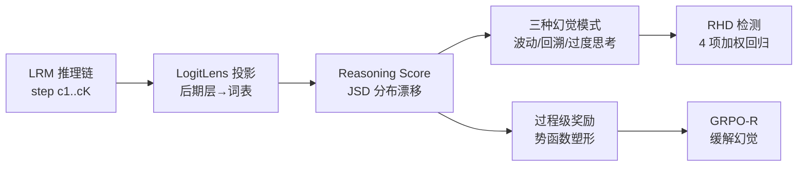

# Mechanistic Detection and Mitigation of Hallucination in Large Reasoning Models

**会议**: ICLR 2026  
**OpenReview**: [https://openreview.net/forum?id=XU2STJa1Fi](https://openreview.net/forum?id=XU2STJa1Fi)  
**代码**: [https://github.com/Jeryi-Sun/Reasoning_Hallucination](https://github.com/Jeryi-Sun/Reasoning_Hallucination)  
**领域**: 幻觉检测 / 大推理模型 / 机制可解释性  
**关键词**: Reasoning Hallucination, Large Reasoning Models, Mechanistic Interpretability, LogitLens, GRPO, Reward Shaping  

## 一句话总结
本文提出基于机制可解释性的 **Reasoning Score**（用 LogitLens 度量后期层 logits 的分布漂移来刻画"推理深度"），据此揭示推理幻觉的三种内部模式，构建检测框架 RHD，并用势函数奖励塑形改造 GRPO 得到 GRPO-R 来缓解幻觉。

## 研究背景与动机
- **领域现状**：DeepSeek-R1、OpenAI O 系列等大推理模型（LRM）靠"outcome-based RL"训练，能生成多步推理链。但随之出现一种更隐蔽的错误——**Reasoning Hallucination（推理幻觉）**：推理链逻辑自洽、读起来很有说服力，结论却是错的。
- **现有痛点**：传统幻觉检测主要针对简单 CoT 任务做"正确性判断"，或停留在表层文本的错误识别，**没有从机制层面解释幻觉的成因**。而直接分析模型生成的文本又会被"看上去合理"的表象误导，加上 Latent CoT 让推理藏进隐状态，文本侧检测更不可靠。
- **核心矛盾**：要判断模型是在做"真·深度推理"还是"浅层模式匹配"，必须探查模型内部，但缺一个能量化"推理深度"的内部信号。
- **本文目标**：从机制可解释性出发，给出一个可量化推理深度的内部度量，进而**统一完成"分析→检测→缓解"全链路**。
- **核心 idea**：**机制可解释性已知"早期层传信息、后期层做复杂推理"** —— 那么把后期层隐状态投影到词表空间，看它相对最后一层分布漂移多大，就能区分浅层匹配（分布稳定）和深度推理（分布显著变化）。这就是 Reasoning Score。

## 方法详解

### 整体框架
方法分三段：先定义 **Reasoning Score** 度量每个推理步的"思考深度"；再用它在 ReTruthQA 上分析出三种幻觉模式（早期深度剧烈波动、错误回溯、过度思考的虚假验证），把这三种模式回归成 **RHD 检测分数**；最后把 Reasoning Score 当作过程级奖励、用势函数塑形注入 GRPO，得到缓解幻觉的 **GRPO-R**。

### 关键设计

**1. Reasoning Score：用 LogitLens 量化推理深度。** 这是全文基石。对推理链 $C=[c_1,\dots,c_K]$ 的每个 token，用 LogitLens 把选定后期层 $j$ 的隐状态投影到词表：$q_j(t)=\mathrm{softmax}(\mathrm{LayerNorm}(h^{(j)}_{m,k})W_U)$，再算它与最后一层锚分布 $q_N$ 的 Jensen–Shannon 散度，对 token 和层求平均得到步级分数 $R^k_{score}=\frac{1}{|c_k|}\sum_{t}\frac{1}{|J|}\sum_{j\in J}\mathrm{JSD}(q_N,q_j)$。直觉是：分数大说明后期层对输出分布做了实质改造（在整合上下文做深推理），分数小说明分布稳定（浅层模式匹配/启发式)。作者在 GSM-NoOp 上验证——被无关 No-Op 短语误导的步骤确实拿到显著更低的 Reasoning Score（2.671 vs 3.267），证明这个分数真的能捕捉推理深度。

**2. 三种幻觉模式与对应内部指标。** 在 ReTruthQA 上用 Reasoning Score 当代理变量，作者识别出三种模式并各设计一个可量化指标。**Pattern #1（早期深度剧烈波动）** 用变异系数 CV 度量早期步窗口的波动：$\mathrm{CV}(C)=\sigma(R^{early}_{score})/\mu(R^{early}_{score})$，幻觉链的 CV 显著更高（0.239 vs 0.150）。**Pattern #2（错误回溯）** 用 Attention Score 度量后期步对"异常的早期步"（落在低四分位的浅层步或超过阈值 $\tau$ 的过度思考步）的注意力占比，幻觉链对这些坏步的注意力更高（0.382 vs 0.307）。**Pattern #3（过度思考的虚假验证）** 发现过度思考步虽然 Reasoning Score 高，困惑度却也偏高（1.872 vs 1.499），呈现 Reasoning Score 与 PPL 的正相关——作者称之为 spurious verification，是 outcome-based 奖励诱发的虚假验证。

**3. RHD：把三模式回归成一个检测分数。** 把上面四个信号线性组合成 Reasoning Hallucination Score：$H_C=\alpha_1\cdot\mathrm{Avg}(R_{score})+\alpha_2\cdot\mathrm{CV}(C)+\alpha_3\cdot\mathrm{AttnScore}(C)+\alpha_4\cdot\mathrm{PCC}(R_{score},\mathrm{PPL}(C))$，分别对应整体推理深度、Pattern #1、#2、#3。系数 $\alpha$ 由回归拟合。好处是检测信号完全来自模型内部推理机制，而非表层文本或外接 PRM。

**4. GRPO-R：势函数塑形把推理深度变成过程奖励。** 缓解侧把推理建模成有限步 MDP，原始奖励只在终点 $t=T$ 给 $R_{final}$。作者用势函数塑形 $\bar r_t=r_t+\gamma\Phi(s_{t+1})-\Phi(s_t)$ 注入过程信号，并把势函数取为裁剪后的 Reasoning Score：$\tilde R_{score}(s_t)=\alpha R_{score}(s_t)$ 当 $R_{score}\le\tau$ 否则置 0，$\Phi(s_t)=-\tilde R_{score}(s_t)$。裁剪是为了"鼓励深推理但不鼓励过度思考"。势函数塑形保证最优策略不变（只重分配 credit）。作者还给出 Theorem 1：增广奖励下的泛化间隙被 Rademacher 复杂度 $R_n(\Pi)$ 控制，Reasoning Score 充当正则化器降低 $R_n(\Pi)$，从而收紧泛化界。最后把它集成进 GRPO 即 GRPO-R。

## 实验关键数据

### 主实验：RHD 检测（ReTruthQA，AUC）

| 类别/方法 | MATH | Science | MultiHopQA |
|---|---|---|---|
| SelfCheckGPT | 0.7727 | 0.6819 | 0.6886 |
| GPT-4o (LCM) | 0.7513 | 0.7045 | 0.7123 |
| EigenScore (Self-Aware) | 0.7539 | 0.6488 | 0.6696 |
| **RHD (Ours, R1-7B)** | **0.7978** | **0.7194** | **0.7361** |

R1-7B 上 RHD 在三域 AUC 全部最优，且多数指标统计显著（†）；多候选排序 MC1/MC2/MC3 同样领先（如 MATH MC1 0.6591）。R1-14B 上在 Science/MultiHopQA 也最优。

### 缓解实验：GRPO-R（准确率）

| 模型/方法 | MATH500 | AIME2024 | GPQA-diamond | GPQA-main |
|---|---|---|---|---|
| DeepSeek-R1-1.5B Base | 0.772 | 0.333 | 0.354 | 0.333 |
| +GRPO | 0.770 | 0.333 | 0.359 | 0.335 |
| **+GRPO-R** | **0.788** | **0.367** | **0.414** | **0.371** |
| Qwen2.5-1.5B +GRPO | 0.480 | 0.033 | 0.247 | 0.214 |
| **Qwen2.5-1.5B +GRPO-R** | **0.490** | **0.133** | **0.247** | **0.243** |

GRPO-R 在多数任务超过标准 GRPO，尤其 OOD 的 GPQA 增益明显，说明推理塑形提升了泛化。

### 关键发现
- Reasoning Score 与"被 No-Op 误导"显著相关，验证其确实度量推理深度。
- 幻觉链在 CV、Attention Score 上都显著高于真实链，且这两种模式跨 Math/Science/MultiHopQA 通用。
- 过度思考步出现"高推理分数 + 高困惑度"的反常正相关（虚假验证），是 outcome-based RL 的副作用。

## 亮点与洞察
- **把"幻觉检测"从表层文本拉回内部机制**：用 LogitLens 后期层分布漂移作为推理深度代理，思路干净且可解释。
- **分析—检测—缓解闭环**：同一个 Reasoning Score 既驱动检测（RHD）又驱动训练（GRPO-R），方法论统一。
- **势函数塑形的理论支撑**：保证策略最优性不变 + Rademacher 复杂度收紧泛化界，给经验改进配了理论。
- **三模式刻画到位**：早期波动、错误回溯、虚假验证三个模式都给了可量化指标，而非泛泛而谈。

## 局限与展望
- Reasoning Score 依赖"早期层传信息、后期层做推理"的层级假设与 LogitLens，跨架构（非标准 Transformer decoder）的普适性需验证。
- 缓解实验只在 1.5B 量级、2000 条 OpenR1-Math 数据上微调，规模偏小；大模型上的收益与稳定性待考。
- "步"的切分、阈值 $\tau$、早期窗口 $r$、late-step 比例 $\eta$ 等超参较多，敏感性虽有附录分析但落地需调参。
- ReTruthQA 的幻觉标签部分依赖 GPT-4o 判定，金标准本身可能引入偏差。

## 相关工作与启发
- **幻觉检测谱系**：不确定性估计（P(True)、LN-Entropy）、内部信号探针、过程批评模型、PRM 等，本文指出 PRM 泛化差、不确定性方法对长度敏感，转而用内部推理机制。
- **机制可解释性**：早期层传信息/后期层做推理、FFN 存知识、LogitLens 解读层级预测——本文把这些发现工程化为可用的检测/训练信号。
- **启发**：把"可解释性探针"从分析工具升级为可微/可回归的监督信号，是连接 interpretability 与 alignment 的有前景路径；势函数塑形让过程奖励"既不改最优策略又能注入先验"也值得在其他 RLHF 场景复用。

## 评分
- 新颖性: ⭐⭐⭐⭐ 用 LogitLens 后期层分布漂移定义推理深度并打通"分析—检测—缓解"，视角新颖。
- 实验充分度: ⭐⭐⭐⭐ 检测侧对比 6 类基线、三域两模型，缓解侧含 OOD GPQA；但缓解规模偏小。
- 写作质量: ⭐⭐⭐⭐ 模式命名清晰、公式与图配套，从机制到方法逻辑连贯。
- 价值: ⭐⭐⭐⭐ 推理幻觉是 LRM 安全核心问题，提供了可解释且可训练的统一方案，实用价值高。

<!-- RELATED:START -->

## 相关论文

- [\[ICLR 2026\] Dynamic Multimodal Activation Steering for Hallucination Mitigation in Large Vision-Language Models](dynamic_multimodal_activation_steering_for_hallucination_mitigation_in_large_vis.md)
- [\[ICLR 2026\] TraceDet: Hallucination Detection from the Decoding Trace of Diffusion Large Language Models](tracedet_hallucination_detection_from_the_decoding_trace_of_diffusion_large_lang.md)
- [\[ICLR 2026\] Look Carefully: Adaptive Visual Reinforcements in Multimodal Large Language Models for Hallucination Mitigation](look_carefully_adaptive_visual_reinforcements_in_multimodal_large_language_model.md)
- [\[NeurIPS 2025\] Reasoning Models Hallucinate More: Factuality-Aware Reinforcement Learning for Large Reasoning Models](../../NeurIPS2025/hallucination/reasoning_models_hallucinate_more_factuality-aware_reinforcement_learning_for_la.md)
- [\[ICLR 2026\] Imitating the Truth: Attention-aware Truth-Guided Enhancement for Hallucination Mitigation in Large Vision-Language Models](imitating_the_truth_attention-aware_truth-guided_enhancement_for_hallucination_m.md)

<!-- RELATED:END -->
