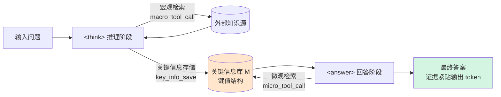

# Micro-Macro Retrieval: Reducing Long-Form Hallucination in Large Language Models

**会议**: ICLR 2026  
**OpenReview**: [https://openreview.net/forum?id=ABdgMoJhlO](https://openreview.net/forum?id=ABdgMoJhlO)  
**代码**: [https://github.com/WoodScene/M2R](https://github.com/WoodScene/M2R)  
**领域**: 幻觉缓解 / 检索增强生成  
**关键词**: 长文本幻觉, 检索增强, retrieve-while-generate, 关键信息库, GRPO, 课程学习  

## 一句话总结
M2R 提出"宏观检索 + 微观检索"双层框架：推理阶段从外部检索粗粒度证据并把答案对齐的关键信息存入键值库，回答阶段再用微观检索把这些关键信息**取出来贴到答案 token 旁边**，通过 GRPO + 课程学习训练，从根本上缓解长文本生成中的幻觉。

## 研究背景与动机
**领域现状**：检索增强语言模型（RALM）通过注入外部知识补足 LLM 的参数化记忆，已成为缓解幻觉的主流范式，ReAct、Self-RAG、ReSearch 等方法把检索与生成交替进行，在多跳问答上效果显著。

**现有痛点**：作者把长文本生成中的核心难题概括为 **Lost in Lengthy Contexts**，它有两个表现：（1）检索结果往往很长，冗余信息让模型难以抓住关键证据；（2）冗长的推理链会让模型遗忘早期的中间结果，导致最终答案出错。

**核心矛盾**：近期研究发现一个关键规律——**关键证据离最终答案越近，事实准确率越高**（与 lost-in-the-middle 现象一致）。但现有 RALM 只是通过多轮检索把外部知识塞进推理过程，**没有任何机制保证关键信息停留在答案附近**，证据一旦在长上下文里被稀释或遗忘，幻觉就会被放大。

**本文目标**：填补这个"关键信息—输出邻近性"的空白，设计一个能主动把证据维持在答案旁边的检索-生成框架，尤其针对长上下文场景。

**核心 idea**：**双层检索 + retrieve-while-generate**——宏观层照常从外部检索证据，但同时把答案对齐的关键事实存进一个结构化键值库；微观层在生成答案时按需从库里取回这些事实，插到对应输出 token 之前，让关键信息和答案"紧贴在一起"。

## 方法详解

### 整体框架
M2R 把一次 rollout 分成严格的 **宏观→微观** 两阶段：`<think>` 推理阶段做宏观检索并把关键信息写入键值库 M，`<answer>` 回答阶段做微观检索从 M 取证据并紧贴答案生成。整个流程用 GRPO 强化学习训练，配合课程学习分两步稳定收敛。

### 关键设计

**1. 双层检索与关键信息库：把证据从"外部"搬到"答案旁边"**
M2R 的核心创新在于区分两类检索。宏观检索沿用传统范式，在 `<think>` 阶段用 `<macro_tool_call>` 多轮调用外部检索器收集粗粒度证据；但关键在于，每当推理产出答案对齐的证据，模型就用 `<key_info_save>` 把它以键值对形式写入结构化仓库 M（检测和存储都由模型在思考阶段自主完成）。到了 `<answer>` 阶段，模型不再依赖外部文档，而是用 `<micro_tool_call>` 查询 M 取回关键值，并强制最终答案直接 grounding 在这些值上（每个值都要包在 `\boxed{}` 里）。这样一来，键值库既充当"防遗忘"的中转站（解决 Limitation 1），又架起宏观检索与微观检索的桥梁，让关键信息始终贴近答案（解决 Limitation 2）。形式上策略被分解为固定的 staged composition：$\pi_\theta(\cdot \mid x; R_{macro}, R_{micro}) = \pi_\theta^{answer}(\cdot \mid x, M; R_{micro}) \circ \pi_\theta^{think}(\cdot \mid x; R_{macro})$，其中 $M = \text{SaveKey}(\pi_\theta^{think}(\cdot \mid x; R_{macro}))$。

**2. 带检索掩码的 GRPO：只对模型自己生成的 token 算梯度**
M2R 用 GRPO 而非 PPO 来避免训练独立的 value critic，从一组 rollout 里估计 baseline，优势归一化为 $A_i = (r_i - \text{mean}(\{r_j\})) / \text{std}(\{r_j\})$。但 rollout 里混入了环境（外部工具）注入的检索结果，这些 token 不是策略生成的。为避免把信用错误地分配给这些 token，作者引入**检索结果掩码**：用二值掩码 $m_t \in \{0,1\}$（策略生成 token 为 1，检索结果为 0），把序列对数概率改写成掩码求和 $\log \pi_\theta(y \mid \cdot) \triangleq \sum_t m_t \log \pi_\theta(y_t \mid y_{<t}, \cdot) / \max(1, \sum_t m_t)$，只在文本推理和模型自己发出的检索查询上更新梯度。值得强调的是，GRPO 在 M2R 里**不优化检索模块本身**，而是教模型"何时调用宏/微检索、如何编排工具调用、该把什么关键信息写进库、如何把取回的证据融进答案"，因此 M2R 对底层检索系统是 agnostic 的。

**3. 规则化奖励：用 F1 三件套绑定"存得准 + 答得对 + 前后一致"**
由于没有监督推理数据，作者设计了纯规则奖励，分格式奖励和答案奖励两部分。格式奖励检查标签使用是否合规（推理阶段的 `<macro_tool_call>`/`<key_info_save>`、回答阶段的 `<micro_tool_call>`，以及答案值是否都用 `\boxed{}` 包裹）。答案奖励则由三个用 F1 计算的子项组成：最终答案正确性 $s_{final}$（`\boxed{}` 抽取值与真值的一致性）、关键信息正确性 $s_{key}$（存进 M 的关键信息是否对齐真值）、一致性分数 $s_{cons}$（存储的关键信息与最终输出是否吻合），合成为 $r_{ans} = s_{final} + \alpha\, s_{key} + \beta\, s_{cons}$。最终 rollout 奖励采用分层赋值：答案正确且 F1 非零给 $r_{ans}$，F1 为零但格式正确给 0.1，格式也错给 0——既奖励正确答案，也保底鼓励格式合规。

**4. 课程学习两阶段训练：先学存证据、再学贴答案**
直接同时优化宏观检索、关键信息存储、微观检索三件事会导致 rollout 不稳、难收敛。作者用课程学习拆成两阶段：第一阶段只训宏观检索 + 关键信息存储，让模型学会识别相关证据并按结构存进库；第二阶段才引入微观检索和细粒度答案 grounding，让模型在已经稳固的证据存储能力之上，学会调用库里的关键信息生成最终回答。这种由易到难的渐进既降低了每一步的学习复杂度、提升训练稳定性，也呼应了人类"先广泛收集整理信息、再提炼成精确可靠答案"的推理方式。

## 实验关键数据
**设置**：基座为 Qwen2.5-3B-Instruct 与 Qwen2.5-7B-Instruct，仅在 MuSiQue 训练集上训练，在四个多跳 QA 基准（HotpotQA、2WikiMultiHopQA、MuSiQue、Bamboogle）上评测，指标为 Exact Match (EM) 与 LLM-as-a-Judge (LJ, gpt-4o-mini)。

### 主实验表格（7B 基座，部分指标 %）

| 方法 | HotpotQA EM | HotpotQA LJ | 2Wiki EM | MuSiQue EM | Bamboogle EM |
|---|---|---|---|---|---|
| Naive RAG | 31.90 | 49.59 | 25.78 | 6.21 | 20.80 |
| COFT | 41.08 | 61.71 | 41.86 | 17.12 | 35.71 |
| SURE | 39.56 | 60.16 | 45.65 | 20.87 | 39.58 |
| ReSearch（强基线） | 43.52 | 63.62 | 47.59 | 22.30 | 42.40 |
| **M2R-7B** | **44.11** | **65.98** | **48.89** | **24.12** | **44.56** |

3B 基座上 M2R 同样在 2Wiki/MuSiQue/Bamboogle 全面超过 ReSearch（如 MuSiQue EM 20.87 vs 19.40）。

### 消融实验表格（3B 基座，MuSiQue）

| 变体 | EM (%) | LJ (%) |
|---|---|---|
| **Full M2R** | **24.12** | **35.44** |
| - One-shot Grounding（一次性灌入全部关键信息） | 23.38 | 34.72 |

### 关键发现
- **微观检索是有效性来源**：M2R 一致优于只在 `<think>` 阶段检索的 ReSearch，证明在回答阶段重新取回关键信息确实提升了事实 grounding。
- **长上下文增益最显著**：在把多个问题拼成一条（HotpotQA-2Q/3Q）的高冗余压力测试下，Naive RAG 和 ReSearch 幻觉率随问题数快速上升，而 M2R 保持稳定准确率和更低幻觉——retrieve-while-generate 不断把证据"重锚定"到输出旁边。
- **按需 grounding > 一次性 grounding**：消融显示一次性灌入全部关键信息会被冗余推理 token 稀释，而 M2R 在每步按需取回、精确插入证据，事实一致性更稳。
- **开销可控**：微观检索仅额外带来 1–2 次调用（相对约 20–30% 的增量），大部分调用开销来自所有多轮 RAG 框架共有的 `<think>` 阶段。

## 亮点与洞察
- **问题定位精准**：把"关键证据—输出邻近性"这个被忽视的瓶颈显式化，并设计出针对性机制，而不是又一个泛泛的检索优化。
- **关键信息库的双重角色**：既是防遗忘的中转站，又是连接宏/微检索的桥梁，一个简单的键值结构同时解决了两个 Limitation。
- **训练工程扎实**：检索结果掩码避免对环境注入 token 错误归因，三件套 F1 奖励把"存准/答对/一致"绑定，课程学习解决联合优化不稳定——每个组件都对应一个具体训练痛点。
- **retrieve-while-generate 范式**：把检索从"生成前的预处理"变成"生成中的逐步重锚定"，与 lost-in-the-middle 现象的机理直接对齐。

## 局限与展望
- **依赖多跳 QA 的可验证答案**：规则奖励和 F1 子项都建立在有明确真值的短答案上，迁移到开放式长文本写作（无标准答案）时奖励设计需要重新考量。
- **关键信息抽取由模型自主完成**：`<key_info_save>` 存什么、是否存全，完全交给模型在 `<think>` 阶段判断，存漏或存错关键信息会直接拖累后续微观检索。
- **额外 20–30% 调用开销**：虽然作者论证可控，但在对延迟敏感的实时场景仍是负担。
- **检索器固定不优化**：M2R 对底层检索 agnostic 是优点也是局限——检索质量本身的瓶颈不会被该框架解决。
- **展望**：把双层检索范式推广到长文档摘要、报告生成等真正的长文本生成任务，并探索软标签/模型评判奖励以摆脱对 F1 真值的依赖。

## 相关工作与启发
- **多轮检索-生成交替**：ReAct、Self-RAG、Iter-RetGen、IRCoT 把检索与生成交错，但只在外部文档上操作，无法复用模型生成的中间推理；M2R 的创新正是从**模型自建的内部关键信息库**检索。
- **coarse-to-fine / 摘要式检索**：COFT 高亮关键参考上下文、SURE 对检索段落生成摘要再选答案，都在缓解长输入"迷失"，但没有强制证据贴近输出 token。
- **RL 训练检索推理**：ReSearch 用 RL 训练多轮搜索推理，是本文最强基线；M2R 在其上增加微观检索 + 邻近性约束。
- **启发**：lost-in-the-middle 不只是评测现象，可以被转化为可优化的训练目标——"把证据搬到答案旁边"这一显式约束，可能比单纯增强检索质量更直接地缓解幻觉。

## 评分
- **新颖性**: ⭐⭐⭐⭐ —— "宏/微双层检索 + 关键信息库 + retrieve-while-generate"是对"证据邻近性"瓶颈的原创性回应，把已知现象转成可训练机制，思路清晰且站得住脚。
- **实验充分度**: ⭐⭐⭐⭐ —— 四基准 × 两基座，含多问题拼接的长上下文压力测试、消融、奖励动态、推理开销分析；略可惜未在真正的开放式长文本生成任务上验证。
- **写作质量**: ⭐⭐⭐⭐ —— 把 Lost in Lengthy Contexts 拆成两个 Limitation、方法用 staged composition 形式化、图 1 直观展示证据邻近性，逻辑顺畅。
- **价值**: ⭐⭐⭐⭐ —— 针对长文本幻觉给出可复现（已开源）且开销可控的方案，对 RAG 实践有直接借鉴意义。

<!-- RELATED:START -->

## 相关论文

- [\[ICML 2026\] Building Reliable Long-Form Generation via Hallucination Rejection Sampling](../../ICML2026/hallucination/building_reliable_long-form_generation_via_hallucination_rejection_sampling.md)
- [\[ACL 2025\] REFIND at SemEval-2025 Task 3: Retrieval-Augmented Factuality Hallucination Detection in Large Language Models](../../ACL2025/hallucination/refind_at_semeval-2025_task_3_retrieval-augmented_factuality_hallucination_detec.md)
- [\[ACL 2025\] Fine-grained Hallucination Detection and Mitigation in Long-form Question Answering](../../ACL2025/hallucination/localizing_and_mitigating_errors_in_long-form_question_answering.md)
- [\[ICLR 2026\] TraceDet: Hallucination Detection from the Decoding Trace of Diffusion Large Language Models](tracedet_hallucination_detection_from_the_decoding_trace_of_diffusion_large_lang.md)
- [\[ICLR 2026\] Mechanistic Detection and Mitigation of Hallucination in Large Reasoning Models](mechanistic_detection_and_mitigation_of_hallucination_in_large_reasoning_models.md)

<!-- RELATED:END -->
