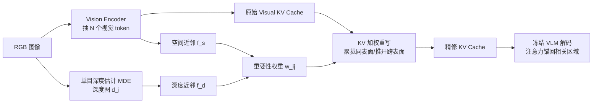

# Mitigating Hallucination in Vision-Language Model with Depth and Spatial-aware Key-Value Refinement

**会议**: ICLR 2026  
**OpenReview**: [https://openreview.net/forum?id=FHTt9ipAra](https://openreview.net/forum?id=FHTt9ipAra)  
**代码**: 待确认  
**领域**: 视觉幻觉抑制 / 多模态大模型  
**关键词**: 视觉幻觉, KV cache, 深度先验, 空间近邻, 训练免费, VLM  

## 一句话总结
作者发现 VLM 的视觉幻觉源于"相邻视觉 token 的 Key 向量失去相干性、各向同性发散"，于是提出训练免费的 DSCR——用单目深度和 2D 空间近邻把同一物体上的 Key/Value 向量重新聚拢、把跨表面的推开，从而在不微调的前提下把跨模态注意力引回相关区域，在五个幻觉基准上最高带来 41.6% 的准确率提升。

## 研究背景与动机
**领域现状**：视觉幻觉（VLM 生成图像中不存在的内容、给错属性、误判空间关系）一直是可靠性短板。主流缓解手段分三类——加视觉监督（bbox/mask）重新训练、用 RL 奖励对齐人类偏好、以及训练免费地重塑注意力或过滤低置信预测。

**现有痛点**：这些方法都能局部见效，但都没回答一个根本问题——**幻觉在模型内部表示层面到底是怎么产生的**。大家在症状（注意力跑偏、过度依赖语言先验）上打补丁，却不清楚是什么内部机制让注意力锚不住视觉 token。

**核心矛盾**：作者用 PCA 可视化 Transformer 的 Key 向量发现一个清晰对照：**不发生幻觉时，空间相邻 patch 的 Key 向量方向高度对齐、且越深层越相干；一旦发生幻觉，Key 向量近乎各向同性地发散，物体边界被抹糊**，跨模态注意力因此无法把视觉信息稳定传给语言模型。也就是说，幻觉的表征根源是"Key 相干性（KV-coherence）的崩塌"。

**本文目标**：在不动模型权重、不微调、不依赖具体 query 的前提下，直接修复 KV cache 的相干性，让注意力重新聚焦到相关图像区域。

**核心 idea**：**[几何先验 + KV 重写]** 把单目**深度**（提供真实 3D 结构，锐化深度断点处的物体边缘、分离前后景、压低遮挡）和 **2D 空间近邻**（强化局部上下文，让相邻 patch 在表示空间里抱团）两类信号直接注入每个 Key/Value 向量，引导同物体 token 形成相干簇、把不同表面或图像平面上远离的 token 推开。

## 方法详解

### 整体框架
DSCR 在解码前对**视觉 token 的 KV cache** 做一次性精修：视觉 token 先正常过冻结的 VLM 得到原始 KV cache，同时用一个现成单目深度估计模型抽出深度图；然后基于 token 间的深度相似度和空间距离算出一组"重要性权重"，把每个 Key/Value 重写成所有视觉 token 的加权和（同表面聚拢、跨表面推开），再用精修后的 cache 替换原始 cache 进行文本生成。整个过程训练免费、模型无关、query 无关，只需一次前向加一次张量乘法。

### 关键设计

**1. 深度与空间双近邻：用几何把"同物体"显式编码进权重**。DSCR 的出发点是把"哪些 patch 该相互对齐"从隐式学习变成显式几何计算。对第 $i$、$j$ 个 patch，深度近邻用高斯核衡量深度差 $f_d(d_i-d_j)=\exp\!\left(-\frac{(d_i-d_j)^2}{2\sigma_d^2}\right)$，深度越接近权重越大——背后的物理直觉是"视差几乎相同的像素几乎一定在同一物理表面，而深度突变恰好对应真实物体边界"；空间近邻同样用 2D 像素坐标的欧氏距离 $f_s(s_i-s_j)=\exp\!\left(-\frac{\|s_i-s_j\|_2^2}{2\sigma_s^2}\right)$ 衡量平面邻近度，强化"相邻 patch 往往共享纹理/语义"的局部先验。两者各带一个指数权重相加得到总近邻度 $\tilde w_{ij}=f_d(d_i-d_j)^\alpha+f_s(s_i-s_j)^\beta$，深度负责跨表面的"切割"、空间负责同表面的"平滑"，二者互补。

**2. 对角屏蔽 + 列归一化：让每个 token 只被邻居精修而非自我强化**。直接用 $\tilde w_{ij}$ 加权会让 token 主要被自己主导，失去"借邻居修复"的意义。作者把自近邻项 $\tilde w_{jj}$ 置零（屏蔽近邻矩阵对角线），再做列归一化得到相对重要性权重 $w_{ij}=\frac{\tilde w_{ij}\cdot \mathbb{I}[i\neq j]}{\sum_k \tilde w_{kj}\cdot \mathbb{I}[k\neq j]}$，保证每个目标 token 的精修完全来自其它 token 的几何加权，从而把"同表面证据"汇聚、"跨深度噪声"分散。这一步在理论上等价于在 Key 向量图上施加一个**图拉普拉斯平滑项**：把同表面 token 压进低频子空间、把跨深度 gap 的 token 拉开，既抑制高频噪声又放大可靠的局部证据。

**3. KV cache 加权重写：一次张量乘法即插即用**。拿到权重后，对第 $j$ 个视觉 token 的 Key/Value 直接用全体视觉 token 加权求和重写 $\hat k_j^I=\sum_i w_{ij}k_i^I$，$\hat v_j^I=\sum_i w_{ij}v_i^I$。同一套权重跨所选 Transformer 层（实验用 10–39 层）和所有注意力头共享，整个重写可由单次张量间乘法完成，开销近乎可忽略，且只作用于视觉 token 对应的 cache，不碰文本 token。正是这种"把幻觉的表征根源（KV 相干性崩塌）直接在 cache 上修复"的视角，让 DSCR 成为首个用辅助几何线索精修 KV cache 来抑制幻觉的方法，并能与现有推理期方法（VCD/OPERA/HALC 等）叠加获得互补增益。

## 实验关键数据

### 主实验表格
MME 幻觉子集（总分，越高越好）：

| 模型 | Baseline | VCD | OPERA | DAMO | AGLA | DSCR(Ours) |
|------|----------|-----|-------|------|------|------------|
| LLaVA-1.5 | 892.68 | 892.68 | 914.69 | 872.20 | 890.17 | **925.96** |
| LLaVA-1.6 | 889.51 | 886.77 | 899.51 | 870.54 | 885.87 | **901.56** |
| Qwen-VL | 825.01 | 844.57 | 830.35 | 865.39 | 822.41 | **872.61** |
| Qwen2.5-VL | 1042.91 | 1032.12 | 1035.41 | 1032.47 | 1040.31 | **1039.97** |

POPE(GQA) / RePOPE(MSCOCO) F1（LLaVA-1.5）：

| 策略 | POPE w/o → w/ | RePOPE w/o → w/ |
|------|---------------|------------------|
| Random | 0.87 → **0.90** | 0.72 → **0.80** (+0.08) |
| Popular | 0.85 → **0.88** | 0.70 → **0.75** |
| Adversarial | 0.80 → **0.83** | 0.68 → **0.73** |

CHAIR（LLaVA-1.5，越低越好）：DSCR 取得最低 $\text{CHAIR}_I=11.2$、并列最低 $\text{CHAIR}_S=39.2$，同时保持 96.1 的平均描述长度（不靠缩短句子来减幻觉）。AMBER 上相对 baseline 把 $\text{CHAIR}_S$ 降约 6.35%、整体 F1 提升约 14.2%。

### 消融实验表格
效率与深度模型鲁棒性：

| 维度 | 结果 |
|------|------|
| 推理时间 | 11.06 s/img，**快于所有同类方法**（VCD 15.13 / OPERA 39.37 / AGLA 23.97），仅比 baseline 9.35 略增 |
| 深度模型 | Depth-Anything-v2 / MiDaS-Lite / DPT-Lite 三选一，GPU 526–2134 MiB 跨度，关键指标波动仅 ±7% |
| 超参敏感性 | 固定 $\sigma_d{=}0.6,\sigma_s{=}0.6,\alpha{=}0.6,\beta{=}0.8$，换设置性能变化 <5% |
| 通用 VL 任务 | COCO captioning：BLEU-4 +0.113、CIDEr +0.380、SPICE +0.031（不仅不掉点反而提升） |

### 关键发现
- **注意力诊断**：原模型常对图像 token 几乎不给注意力、转而依赖 system prompt 和文本先验；DSCR 一致地把注意力拉回相关图像 token，并在"嫌疑 token（suspect token）"位置维持更高注意力。
- **自建深度幻觉 mini-benchmark**（50 张重叠物体、相近深度的图，问最近/最远/最小/最大物体）上 DSCR 提升 41.4% 准确率；MME 位置子集上空间精修带来 6% 增益。
- 即使深度图本身噪声大或用极轻量深度模型，DSCR 仍稳定见效，说明它靠的是几何引导而非精确深度。

## 亮点与洞察
- **把"幻觉"归因到一个可测量的表征量**：相邻 Key 向量的相干性崩塌，用 PCA 可视化 + 注意力诊断双重佐证，比"注意力跑偏"更接近根因。
- **第一个在 KV cache 上做几何精修来抑制幻觉的工作**：视角新颖，且 cache 重写只需一次张量乘法，效率甚至优于多数训练免费基线。
- **正交可叠加**：作为 plug-in 加在 VCD/OPERA/HALC/DAMO/AGLA 之上都能再涨点，工程落地友好。
- **不牺牲通用能力**：很多去幻觉方法会损伤主任务，DSCR 反而小幅提升 captioning 质量。

## 局限与展望
- 依赖单目深度估计模型，虽对深度噪声鲁棒，但在大面积无纹理/反光/透明场景下深度先验可能失效，文中未深入讨论极端失败案例。
- 权重在所选层与所有头间共享同一套近邻权重，缺乏层/头自适应；不同层语义粒度不同，统一权重可能不是最优。
- 高斯核近邻是各向同性的几何假设，对薄长物体、细杆状结构等几何先验不太成立的目标，深度+平面近邻的"同物体"假设可能偏弱。
- 评测以 LLaVA/Qwen 系为主，对更大规模或纯生成式长文本场景的幻觉抑制效果有待验证。

## 相关工作与启发
- **训练免费推理期去幻觉**：VCD（对比解码）、OPERA、HALC、DAMO、AGLA（全局+局部注意力组装）——DSCR 与它们正交并可叠加。
- **几何/深度引导的注意力**：LocalViT、SATA 的局部性先验、DFormerv2 把深度几何自注意力插入 ViT，启发了"深度作为边界先验"的设计；图信号理论中的图拉普拉斯平滑为 cache 重写提供了理论解释。
- **启发**：把"模型内部表征的某个可测量性质崩塌"作为故障归因 → 再用廉价外部先验（深度/坐标）在 cache 层面直接修复，这套"诊断—几何注入—免训练修复"范式可迁移到空间推理、计数、遮挡理解等更广的视觉接地问题。

## 评分
- **新颖性**: ⭐⭐⭐⭐⭐ 把幻觉归因到 KV 相干性，并首次用深度+空间几何精修 KV cache，视角与机制都很新。
- **实验充分度**: ⭐⭐⭐⭐ 覆盖 MME/POPE/RePOPE/CHAIR/AMBER 五基准 + 自建深度 mini-benchmark + 效率/深度模型/超参消融，较全面；多模型验证但偏 LLaVA 系。
- **写作质量**: ⭐⭐⭐⭐ 从 PCA 观察到方法到理论解释（图拉普拉斯）逻辑连贯，图示清晰。
- **价值**: ⭐⭐⭐⭐⭐ 训练免费、即插即用、可叠加、不掉通用能力且效率高，落地价值很强。

<!-- RELATED:START -->

## 相关论文

- [\[CVPR 2026\] KVSmooth: Mitigating Hallucination in Multi-modal Large Language Models through Key-Value Smoothing](../../CVPR2026/hallucination/kvsmooth_mitigating_hallucination_in_multi-modal_large_language_models_through_k.md)
- [\[ICLR 2026\] Hallucination-aware Intermediate Representation Edit in Large Vision-Language Models](hallucination-aware_intermediate_representation_edit_in_large_vision-language_mo.md)
- [\[ICLR 2026\] Imitating the Truth: Attention-aware Truth-Guided Enhancement for Hallucination Mitigation in Large Vision-Language Models](imitating_the_truth_attention-aware_truth-guided_enhancement_for_hallucination_m.md)
- [\[ICLR 2026\] Copy-Paste to Mitigate Large Language Model Hallucinations](copy-paste_to_mitigate_large_language_model_hallucinations.md)
- [\[ICLR 2026\] NDAD: Negative-Direction Aware Decoding for Large Language Models via Controllable Hallucination Signal Injection](ndad_negative-direction_aware_decoding_for_large_language_models_via_controllabl.md)

<!-- RELATED:END -->
