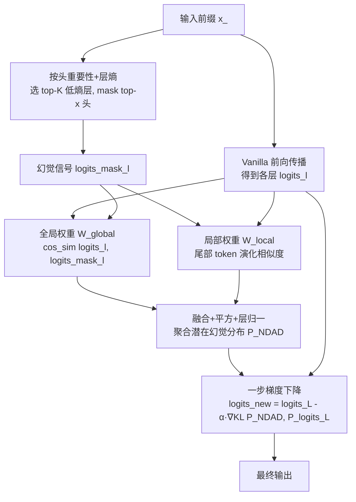

# NDAD: Negative-Direction Aware Decoding for Large Language Models via Controllable Hallucination Signal Injection

**会议**: ICLR 2026  
**OpenReview**: [https://openreview.net/forum?id=fCZf20wK6p](https://openreview.net/forum?id=fCZf20wK6p)  
**代码**: 待确认  
**领域**: 幻觉缓解 / 推理时干预解码  
**关键词**: hallucination, intervention decoding, attention head masking, contrastive decoding, factuality  

## 一句话总结
NDAD 反其道而行：不去从早层"捞"事实信号往上加，而是主动 mask 掉重要注意力头来**诱导出幻觉信号**，再把它作为"负方向"从最终输出分布里减掉，从而无需重训、无需外部知识就提升 LLM 的事实可靠性。

## 研究背景与动机
**领域现状**：缓解 LLM 幻觉主流有两条路——检索增强（RAG）引入外部知识、训练类方法（SFT/RLHF/DPO）更新参数。但前者带来架构复杂度、延迟与对外部库的依赖，后者计算昂贵且跨领域泛化困难。

**现有痛点**：第三条路——推理时干预解码（intervention decoding）越来越受关注，因为预训练其实已经把事实信号编码进了模型内部表征，只是常规解码surface不出来。DoLa、SLED 等代表性方法的共同范式是**从早层表征里提取"忠实证据"**，再用它去 reshape 最终 token 分布——本质是"放大正向"。

**核心矛盾**：放大正向意味着要先准确定位"哪一层/哪些信号是可信的事实方向"，这个定位本身充满噪声；而且把概率质量往某些方向推，容易在spurious或speculative的轨迹上意外堆积质量。

**本文目标**：把校准范式从"boosting positives"翻转为"subtracting negatives"——与其费力找正确方向，不如主动制造一个**可控的幻觉方向**，让最终分布显式地远离它。

**核心 idea**：**[负方向感知]** 既然某些注意力头对维持事实性至关重要，那么 mask 掉它们就能逼模型"露出幻觉的马脚"。NDAD 用这个被诱导出的幻觉分布作为对比解码的负方向，再用全局+局部两个权重控制它的影响力度，最后一步梯度下降把幻觉相关 token 的概率质量减掉。

## 方法详解

### 整体框架
NDAD 在标准自回归解码上叠加三步：① **幻觉信号生成**——按头重要性+层熵选层选头并 mask，得到带幻觉倾向的 `logits_mask`；② **动态加权**——用全局一致性（幻觉信号 vs 原始早层 logits 的方向相似度）和局部发散（尾部 token 是否会演化成最终输出）两个权重，把多层、多方向的幻觉信号聚合成一个潜在幻觉分布 $P_{\text{NDAD}}$；③ **负方向解码**——用一步梯度下降惩罚 $P_{\text{NDAD}}$ 与原始最终分布之间的 KL 散度，调整最终 logits 的同时保留高置信预测。全程只改最后一层 logits，免训练、不依赖外部数据。

### 关键设计

**1. 幻觉信号生成：用"头重要性 × 层熵"精准 mask 出负方向。** NDAD 与 DoLa/SLED 最根本的区别在于信号来源——它不去早层找事实证据，而是显式制造幻觉。依据是已有工作发现某些注意力头对保持事实性、稳定生成起关键作用，一旦削弱这些头的支持，模型就会偏离事实方向、更容易幻觉。具体选哪些头：先沿用 Wu et al. (2024) 的头重要性分数，再额外引入每层分布的熵作为筛选信号——对第 $l$ 层的 $n$ 个头分数归一化后算层熵 $E_l = -\sum_{i=1}^{n} p_{l,i}\log p_{l,i}$，其中 $p_{l,i}=s_{l,i}/\sum_j s_{l,j}$。**低熵意味着重要性集中在少数头上**，说明这些头更具影响力。于是选熵最低的 top-K 层、在这些层里 mask top-x 个头，得到幻觉信号 $\text{logits}^{\text{mask}}_l$。这一步把"哪些头该 mask"从单纯看重要性升级为"重要性集中度"，让诱导出的幻觉更纯净。

**2. 全局一致性权重：衡量幻觉信号有没有参考价值。** 制造出来的幻觉信号未必都靠谱，需要判断它是否真的反映了模型潜在的幻觉方向。NDAD 在同一层内计算幻觉信号与原始 logits 的方向相似度——$W^{\text{global}}_l = \phi(c_l)$，其中 $c_l = \cos\text{sim}(\text{logits}_l, \text{logits}^{\text{mask}}_l)$，$\phi(\cdot)$ 是把值线性映射到 $[0,1]$ 的函数。一致性越高，说明这个幻觉信号越贴近模型真实的潜在幻觉倾向、参考价值越大，因此加权时给它更大的贡献。这相当于给每层的幻觉信号打了一个"可信度"标签，避免把噪声当成负方向。

**3. 局部发散权重：盯住"会变坏"的尾部 token。** 全局权重看的是整层方向，局部权重则聚焦低概率尾部 token——这些 token 按 Mahaut et al. (2024) 的观察往往对应更低的事实性。做法是：把最终层 $\text{logits}_L$ 近似为 ground-truth，取其 top-$I$ token 构造 $I$ 个 one-hot 向量 $\{P_{e_1},...,P_{e_I}\}$ 作为正确方向的近似；同时把 $P_{\text{logits}^{\text{mask}}_l}$ 里 top-$I$ token 的概率压到 $\epsilon\to 0$，得到更干净的尾部幻觉分布 $P^{\text{tail}}_{\text{logits}^{\text{mask}}_l}$。核心判断是：从 premature 到 mature 的演化轨迹 $d_1 = \text{logits}_L - \text{logits}^{\text{mask}}_l$ 应当与尾部分布朝正确方向的演化 $d_2 = \nabla\text{KL}(P^{\text{tail}}, P_{e_i})$ 方向一致。若两者越对齐，说明该尾部 token 越可能演化成最终输出，就该给它更大权重去抑制——局部权重定义为 $W^{\text{local}}_{l,i} = \max(\cos\text{sim}(\text{logits}^{\text{mask}}_l - \text{logits}_L,\ P^{\text{tail}} - P_{e_i}),\ 0)$。

**4. 加权聚合 + 负方向梯度下降：把幻觉分布"减"出去。** 两个权重相乘得到每个正确方向的最终权重 $W_{l,i} = W^{\text{global}}_l W^{\text{local}}_{l,i}$，再做平方变换 $\tilde{W}_{l,i} = (W_{l,i})^2$ 来锐化分布——突出高置信方向、压低边缘噪声。之后层内对 $I$ 个方向归一化得 $P_l$，层间再按 $N_l = Z_l/\sum_l Z_l$ 加权聚合成潜在幻觉分布 $P_{\text{NDAD}} = \sum_{l=1}^{L} N_l P_l$。最后沿用 SLED 的 Evolution Rate $\alpha$ 控制调整幅度，用一步梯度下降惩罚 $P_{\text{NDAD}}$ 与原始分布的 KL 散度：$\text{logits}^{\text{new}}_L = \text{logits}_L - \alpha\nabla\text{KL}(P_{\text{NDAD}}, P_{\text{logits}_L})$。这一步只动最终 logits，把概率质量从幻觉易发区域减掉，同时保留模型原本的高置信预测。

## 实验关键数据

### 主实验表格（Llama 系列，TruthfulQA-MC / FACTOR / CoT）

| 模型 | 方法 | MC1 | MC2 | MC3 | Avg | Factor-Wiki | StrQA | GSM8K |
|------|------|-----|-----|-----|-----|-------------|-------|-------|
| Llama2-7B-base | Greedy | 26.58 | 41.88 | 18.96 | 29.14 | 58.42 | 60.74 | 13.95 |
| | +SLED | 34.15 | 62.57 | 31.89 | 42.87 | 67.00 | 61.27 | 14.63 |
| | **+NDAD** | **34.39** | **62.62** | **31.98** | **43.00** | **67.30** | **61.57** | **14.86** |
| Llama2-13B-base | +SLED | 34.76 | 63.58 | 31.88 | 43.41 | 70.94 | 66.51 | 29.19 |
| | **+NDAD** | **34.88** | **63.60** | **31.97** | **43.48** | **71.18** | **66.81** | **29.26** |
| Llama2-13B-chat | +SLED | 37.45 | 63.50 | 32.90 | 44.62 | 67.50 | 69.74 | 37.15 |
| | **+NDAD** | **37.58** | **63.63** | **33.02** | **44.74** | **67.74** | **69.96** | **37.30** |

开放式生成（EM）上 NDAD 同样稳超 SLED，如 Llama2-7B-base 上 PopQA 26.00 vs 25.86、NQ-Open 26.26 vs 25.96。跨架构（Qwen2.5-7B / Mistral-7B / Llama3-8B）NDAD 在所有配置上达到 SOTA，GSM8K 提升尤其明显（如 Llama3-8B-instruct 77.18 vs SLED 75.82）。70B 大模型上 GSM8K 相对增益达 58%（NDAD +1.44% vs 次优 +0.91%）。

### 消融实验表格（Llama2-7B-base）

| 变体 | MC1 | MC2 | MC3 | Avg | Factor | StrQA | GSM8K |
|------|-----|-----|-----|-----|--------|-------|-------|
| random head | 34.15 | 62.55 | 31.91 | 42.87 | 67.17 | 61.13 | 13.95 |
| random layer | 34.15 | 62.61 | 31.84 | 42.87 | 67.10 | 61.40 | 14.71 |
| w/o global weight | 34.27 | 62.57 | 31.93 | 42.92 | 67.20 | 61.09 | 14.63 |
| w/o local weight | 33.90 | 61.13 | 31.43 | 42.15 | 67.17 | 61.44 | 14.10 |
| **NDAD** | **34.39** | **62.62** | **31.98** | **43.00** | **67.30** | **61.57** | **14.86** |

### 关键发现
- **幻觉信号确实被诱导出来**：直接解码 mask 后的 logits，性能在各模型/数据集上一致下降，GSM8K 跌幅最大——证明复杂推理高度依赖注意力头的聚合，mask 它们能注入更强幻觉信号，也解释了为何 NDAD 在 GSM8K 增益最大（更强的负方向可被更有效地利用）。
- **两个权重缺一不可**：去掉 global 或 local 权重都掉点，local 权重影响更大（去掉后 Avg 从 43.00 降到 42.15）；GSM8K 始终是退化最严重的数据集，说明推理任务对加权机制最敏感。
- **基于重要性的选头/选层优于随机**：random head/layer 普遍弱于 NDAD，验证"头重要性 × 层熵"引导的幻觉诱导是性能增益的来源。
- **超参鲁棒**：mask 头数和层数都呈"先升后降"趋势，在 [6, 13] 区间内性能稳定，对参数不敏感。
- **开销轻量**：Llama2-7B-base 上 NDAD 单样本 runtime 1.34s（Greedy 1.11s / SLED 1.17s）、显存 17.8GB（SLED 15.5GB），代价主要来自负方向信号的引入，仍属 plug-and-play 量级。

## 亮点与洞察
- **范式翻转最有意思**：把"找正确方向加上去"改成"造一个幻觉方向减下来"。找正确方向需要准确定位可信层/可信信号，本身噪声大；而制造幻觉只需 mask 关键头——一个相对鲁棒、可控的操作。这是个很巧的视角转换。
- **"低熵=重要性集中"作为选层信号**很优雅，把头重要性从单点分数升级为分布集中度，比单纯按分数排序更能定位"牵一发动全身"的层。
- **全局+局部双权重**分别管"这个幻觉信号可不可信"和"哪些尾部 token 会变坏"，职责正交、互补，消融证明两者都不可省。
- GSM8K 上增益最大这个现象自洽串起了全文：推理越依赖注意力头 → mask 后幻觉信号越强 → 负方向越有力 → NDAD 增益越大。

## 局限与展望
- **增益普遍偏小**：相对 SLED 多数任务只提升零点几个百分点（如 MC Avg +0.13），作者也坦承 MC 类任务本质是分布拟合问题、过拟合反伤泛化，故"小幅改进可接受"。但这也意味着实际收益边际有限。
- **显存开销不小**：相比 SLED 多用约 2.3GB 显存、runtime 慢约 15%，对资源敏感场景需权衡。
- **依赖外部头重要性分数**：选头依赖 Wu et al. (2024) 的预计算重要性，迁移到新架构时这套分数是否可得/可靠是个前提。
- **超参较多**：mask 层数 K、头数 x、top-$I$、Evolution Rate $\alpha$ 等需要调，虽然论文说区间内鲁棒，但跨任务最优点可能漂移。
- 展望：可探索免外部重要性分数的自适应选头、把负方向思想推广到多模态/代码生成等更复杂的幻觉场景。

## 相关工作与启发
- **干预解码谱系**：ITI 沿"truthful direction"移动激活；AD 用上下文激活熵作约束；CD/ACD/DoLa/SLED 走"对比 logits"路线——其中 SLED 整合多早层加权 + 梯度下降修正最终 logits，是 NDAD 最直接的对比基线和方法骨架来源（$\alpha$、梯度下降框架都沿用自 SLED）。NDAD 的差异是把对比的"另一极"从早层正向证据换成了 mask 诱导的幻觉负向。
- **启发**：① "诱导失败信号再减掉"这个思路可迁移到其他 calibration 问题（如毒性、偏见的负方向解码）；② 用结构性 mask（注意力头）而非加噪来制造可控的"坏样本"，比随机扰动更有语义针对性；③ AD 在 CoT 上崩盘、在知识密集任务上忽强忽弱的对比，提醒上下文熵类约束对任务类型很敏感，而 NDAD 的负方向机制更鲁棒。

## 评分
- **新颖性**: ⭐⭐⭐⭐ 把干预解码从"提取正向事实"翻转为"诱导并减去幻觉负向"，视角新颖；"头重要性 × 层熵"选层、全局/局部双权重都有巧思。
- **实验充分度**: ⭐⭐⭐⭐ 覆盖 7 个模型（含 70B）、多类任务（MC/长段/CoT/开放生成），消融完整（随机选头/层、去权重、超参敏感、开销分析），论证链条自洽。
- **写作质量**: ⭐⭐⭐⭐ 动机—方法—实验逻辑清晰，公式定义到位，图示帮助理解；个别符号（$d_1,d_2$ 的方向定义）稍绕。
- **价值**: ⭐⭐⭐⭐ 免训练、免外部知识、plug-and-play，对落地友好；但相对 SLED 增益普遍较小，实际边际收益有限。

<!-- RELATED:START -->

## 相关论文

- [\[ICLR 2026\] Hallucination-aware Intermediate Representation Edit in Large Vision-Language Models](hallucination-aware_intermediate_representation_edit_in_large_vision-language_mo.md)
- [\[ICLR 2026\] TraceDet: Hallucination Detection from the Decoding Trace of Diffusion Large Language Models](tracedet_hallucination_detection_from_the_decoding_trace_of_diffusion_large_lang.md)
- [\[ICLR 2026\] Imitating the Truth: Attention-aware Truth-Guided Enhancement for Hallucination Mitigation in Large Vision-Language Models](imitating_the_truth_attention-aware_truth-guided_enhancement_for_hallucination_m.md)
- [\[ICLR 2026\] Enhancing Hallucination Detection through Noise Injection](enhancing_hallucination_detection_through_noise_injection.md)
- [\[CVPR 2026\] Residual Decoding: Mitigating Hallucinations in Large Vision-Language Models via History-Aware Residual Guidance](../../CVPR2026/hallucination/residual_decoding_mitigating_hallucinations_in_large_vision-language_models_via_.md)

<!-- RELATED:END -->
