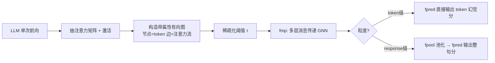

# Neural Message-Passing on Attention Graphs for Hallucination Detection

**会议**: ICLR 2026  
**OpenReview**: [https://openreview.net/forum?id=4twbqwV4br](https://openreview.net/forum?id=4twbqwV4br)  
**代码**: [https://github.com/Noired/charm](https://github.com/Noired/charm)  
**领域**: 幻觉检测 / 图神经网络 / LLM 可解释性  
**关键词**: hallucination detection, attention graph, GNN, message passing, computational traces  

## 一句话总结
把 LLM 内部的注意力矩阵和激活看作一张「带属性的有向图」（token 是节点、注意力流是边），用 GNN 做消息传递来检测幻觉，并从理论上证明该框架能涵盖此前的注意力启发式方法，实验上全面超越它们。

## 研究背景与动机
- **领域现状**：LLM 幻觉检测（HD）主要有两条路线，一是多次采样/自我评判（慢且贵，不适合实时），二是利用解码时产生的「计算轨迹」（computational traces）——主要是对残差流激活做线性探针，或基于注意力图做启发式判断。
- **现有痛点**：基于注意力的方法（Lookback Lens、LLM-Check 等）依赖手工启发式或浅层分类器（如对注意力 Laplacian 跑逻辑回归），表达能力受限；更关键的是，所有方法都把激活、注意力等不同轨迹**孤立**处理，忽视了它们互补的信息。
- **核心矛盾**：注意力本质上是 token 之间的成对关系，天然带有图结构，但现有方法要么把它压成手工标量特征丢掉了结构，要么只看单一信号，缺少一个能统一异质信号、又能利用结构的现代深度学习框架。
- **本文目标**：构建一个统一框架，把计算轨迹表示为带属性图，让幻觉检测变成一个图学习任务，既能在 token 级又能在 response 级检测，还能融合多种轨迹信号。
- **核心 idea**：**【图学习视角】** token 为节点、注意力诱导的有向边连接它们，节点带激活与自注意力特征、边带成对注意力特征，然后直接用 GNN 在这张图上学习，理论上可证明它能逼近已有的注意力启发式。

## 方法详解

### 整体框架
CHARM（Catching HAllucinated Responses via learnable Message-passing）分三步：先从 LLM 一次前向中抽取注意力矩阵和激活，构造一张带属性有向图；再用消息传递 GNN（`fmp`）更新每个 token 的表示；最后视粒度需要，token 级直接预测、response 级则先池化（`fpool`）再过预测头（`fpred`）。整条流水线是 $f = f_{\text{pred}} \circ f_{\text{pool}} \circ f_{\text{mp}}$。

### 关键设计

**1. 计算轨迹图：把内部信号统一成带属性图，点题在于「结构 + 异质特征」一次性打包**。注意力分数 $\alpha_{i,j}^{l,h}$ 本身就是 token 之间的成对（非对称）关系，因此对任意 token 序列 $\vec{s} = \vec{p} \mid \vec{r}$ 自然诱导一张有向图 $G=(V,E)$：节点是全部 token，边 $(T_i, T_j)$（$i>j$）表示 $T_i$ 在某些层某些头上对 $T_j$ 有非零注意力。关键在于「带属性」：边特征取跨层跨头的注意力向量 $x_{E,(i,j)} = \alpha_{i,j}$；节点特征取 token 对自己的注意力（self-score）$\alpha_{i,i}$，并可拼上该层残差流激活 $a_i^l$，即 $x_{V,i} = (\alpha_{i,i} \mid a_i^l)$。这样一张图就同时编码了 token 间交互和 token 自身的计算状态，且能继续扩展容纳 logits 等其他轨迹——这正是它「统一异质信号」的来源。

**2. 注意力稀疏化：用阈值 τ 砍掉弱边，在效率和信息之间换挡**。很小的注意力分数贡献噪声大、对更新 token 表示几乎无用，于是对低于阈值 $\tau$ 的分数置零并丢弃没有任何层/头支撑的边：

$$(X^\tau_E)_{(i,j),(l,h)} = \begin{cases} 0 & \alpha_{i,j}^{l,h} \le \tau \\ \alpha_{i,j}^{l,h} & \text{otherwise} \end{cases}$$

实验显示在 NQ 上把 $\tau$ 从 0.001 提到 0.5，边数从约 20 万降到约 1100、显存从 1177MB 降到 23MB，而 AUPR 几乎不掉（默认 $\tau=0.05$ 在性能与开销间取得最佳折中），说明结构里真正有用的是少数强交互边。

**3. 消息传递层：在注意力图上做局部聚合，并用 prompt/response 标记区分边类型**。第 $t$ 层把 token $i$ 的表示更新为

$$h_i^{(t+1)} = \text{up}_t\!\left(h_i^{(t)},\ \bigoplus_{j:(i,j)\in E} \text{msg}_t\!\left(h_i^{(t)}, h_j^{(t)}, x^\tau_{E,(i,j)}, p_{i,j}\right)\right)$$

其中 $\bigoplus$ 是 sum/avg/max 等置换不变聚合，$\text{up}_t, \text{msg}_t$ 都是 MLP，$h_i^{(0)} = x_{V,i}$；$p_{i,j}$ 是 one-hot 标记，指示这条边是「prompt→response」还是「response→response」，让模型能把对 prompt 和对历史 response 的注意力分别路由到不同子空间。正是这个机制让 CHARM 能区分性地累积两类注意力。

**4. 可表达性证明：CHARM 可证明涵盖已有启发式，体现「不是抛弃而是泛化」**。论文证明了单层 `fmp` 的 CHARM 能任意精度逼近两个代表性方法：一是 token 级的 Lookback Lens（其特征 $\ell_i^{l,h} = P_i^{l,h}/(P_i^{l,h}+R_i^{l,h})$ 是对 prompt 与对 response 注意力的比值，恰好能用消息传递分别累积 prompt/response 注意力再由 up-MLP 做归一化与比值实现）；二是 response 级的 LLM-Check（其得分 $c_l = \frac{1}{H}\sum_h \sum_i \log(\alpha_{i,i}^{l,h})$ 是 token 自注意力的 log 之和，恰好是节点特征经 up-MLP 取 log、再由 `fpool` 与 `fpred` 跨 token/头聚合实现）。这从理论上保证 CHARM 在最坏情况下也能退化为这些手工启发式，因此「严格不弱于」它们。

## 实验关键数据

### 主实验表格
**Token 级（contextual 幻觉，LLaMa-2-7B-chat）**

| Method | NQ AUROC | NQ AUPR | CNN AUROC | CNN AUPR |
|---|---|---|---|---|
| Probas | 49.8 | 16.2 | 54.4 | 8.2 |
| Act-24 | 73.0 | 36.2 | 71.3 | 20.3 |
| Lookback Lens † | 71.9 | 34.3 | 74.4 | 19.7 |
| **CHARM (att)** | **74.8** | **40.3** | **75.4** | **22.7** |

**Response 级（多类型幻觉，Mistral-7B-instruct）**

| Method | Movies AUROC | Winobias AUROC | Math AUROC |
|---|---|---|---|
| Act-24 | 77.0 | 76.6 | 77.7 |
| LapEig | 72.9 | 74.1 | 73.6 |
| CHARM (att) | 80.3 | 70.4 | 76.5 |
| **CHARM (att+act-24)** | 79.7 | **77.8** | **80.8** |

### 消融实验表格
**图结构消融（去掉消息传递，退化为对节点特征堆 dense 层）**

| Method | CNN AUROC | CNN AUPR | Math AUROC | Math AUPR |
|---|---|---|---|---|
| CHARM (no g.) | 70.8 | 19.2 | 80.6 | 82.7 |
| **CHARM** | **75.4** | **22.7** | **81.7** | **83.8** |

**稀疏化阈值 τ（NQ）**：τ=0.5 时边数 1119、显存 23MB、AUPR 38.4；τ=0.05（默认）边数 14884、显存 104MB、AUPR 40.3；τ=0.001 时边数约 20 万、显存 1177MB、AUPR 40.1。

### 关键发现
- **注意力本身就很强**：在 contextual 数据集（NQ/CNN）上，纯注意力的 CHARM(att) 反而比加了激活的版本更好，作者推测注意力已携带主要信号，强模型再加激活反而容易拟合伪相关。
- **激活与注意力在某些任务上协同**：在 Winobias、Math 上加入 act-24 后大幅提升（Winobias AUROC 70.4→77.8），说明不同幻觉类型适合的轨迹组合不同。
- **结构是核心**：去掉图结构后 CNN 上 AUPR 从 22.7 掉到 19.2，验证消息传递的拓扑确实在起作用。
- **零样本迁移有竞争力**：NQ↔CNN 跨数据集 zero-shot 中 CHARM 在 CNN→NQ 排第一、NQ→CNN 排第二，整体优于激活探针。
- **推理极快**：约 $10^{-3}$ 秒/样本，远低于依赖多次采样的方法。

## 亮点与洞察
- **视角切换有说服力**：把「注意力图分析」（此前多停留在描述性研究，如表征坍缩、oversquashing）转成「在注意力图上直接学习做下游任务」，是一次自然但被忽视的范式迁移。
- **理论 + 实验双闭环**：不仅实验赢，还形式化证明新框架能涵盖被它超越的启发式，回答了「为什么应该用更复杂的模型」这一质疑。
- **统一粒度**：同一框架通过 `fpool` 是否为 identity 就能在 token 级和 response 级切换，避免了为不同粒度设计不同方法。
- **工程友好**：稀疏化让显存可在两个数量级间调节而性能几乎不变，给出清晰的精度-效率权衡曲线。

## 局限与展望
- **仅用单层激活**：节点特征只拼了某一层激活（如 layer-24），多层激活、logits 等更丰富轨迹留作未来工作，可能进一步提升。
- **零样本迁移仍是开放问题**：没有任何方法在跨数据集上一致领先，CHARM 也只是「有竞争力」，泛化机制尚不清楚。
- **依赖白盒访问**：需要抽取内部注意力和激活，对闭源 API 模型不适用。
- **激活的"双刃剑"**：在 contextual 数据集上加激活反而掉点，何时该融合哪种轨迹仍缺乏自动判据，目前靠经验/验证集选择。

## 相关工作与启发
- **注意力启发式 HD**：Lookback Lens（prompt/response 注意力比值）、LLM-Check（注意力矩阵 log-determinant）、Binkowski 的谱方法（graph Laplacian + 逻辑回归）——CHARM 把它们统一为自己框架的特例。
- **LLM 计算的图视角**：Barbero 等对注意力图上信号传播的分析（表征坍缩、oversquashing），但停留在结构性描述；本文把它推进到「在图上学习」。
- **激活探针**：对残差流做线性分类的一系列工作，是 CHARM 节点特征的来源之一。
- **启发**：任何「LLM 内部留下成对/结构化痕迹」的任务（如越狱检测、推理路径分析）都可能套用这种「计算轨迹图 + GNN」范式，值得迁移尝试。

## 评分
- **新颖性**: ⭐⭐⭐⭐ 把幻觉检测重构为注意力图上的图学习任务，视角统一且新颖；虽然「注意力图」与「GNN」都不是新概念，但二者结合并配可表达性证明用于 HD 是清晰的贡献。
- **实验充分度**: ⭐⭐⭐⭐ 覆盖 token/response 两种粒度、5 个数据集、多类型幻觉，含图结构/稀疏化/零样本/激活协同等系统消融，回答了 Q1–Q6。
- **写作质量**: ⭐⭐⭐⭐ 动机层层递进，理论命题与证明思路交代清楚，图示直观。
- **价值**: ⭐⭐⭐⭐ 提供了一个可扩展、白盒、推理快的统一 HD 框架，并开源代码，对幻觉检测与 LLM 内部信号利用都有方法论启发。

<!-- RELATED:START -->

## 相关论文

- [\[ACL 2026\] Hallucination Detection in LLMs with Topological Divergence on Attention Graphs](../../ACL2026/hallucination/hallucination_detection_in_llms_with_topological_divergence_on_attention_graphs.md)
- [\[ICLR 2026\] Enhancing Hallucination Detection through Noise Injection](enhancing_hallucination_detection_through_noise_injection.md)
- [\[ACL 2025\] HD-NDEs: Neural Differential Equations for Hallucination Detection in LLMs](../../ACL2025/hallucination/hd-ndes_neural_differential_equations_for_hallucination_detection_in_llms.md)
- [\[ICLR 2026\] VeriTrail: Closed-Domain Hallucination Detection with Traceability](veritrail_closed-domain_hallucination_detection_with_traceable_evidence_synthes.md)
- [\[ICLR 2026\] Learning to Reason for Hallucination Span Detection](learning_to_reason_for_hallucination_span_detection.md)

<!-- RELATED:END -->
