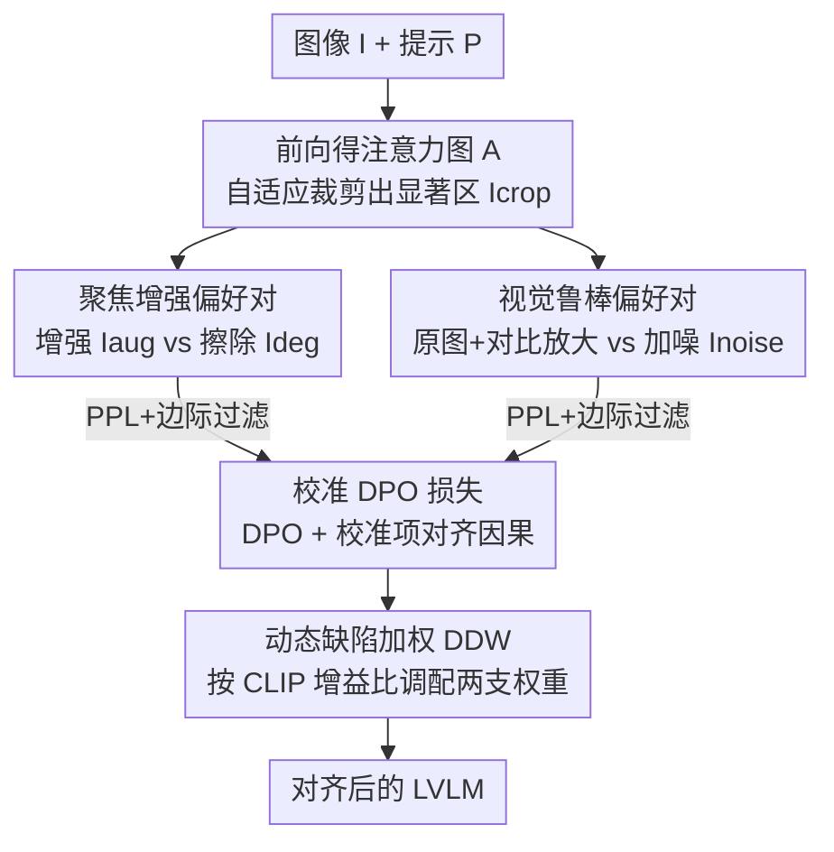

# P2-DPO: Grounding Hallucination in Perceptual Processing via Calibration Direct Preference Optimization

**会议**: ICLR 2026  
**OpenReview**: [https://openreview.net/forum?id=ekOwxTn65Y](https://openreview.net/forum?id=ekOwxTn65Y)  
**代码**: https://github.com/ZrpChuang/P2-DPO  
**领域**: 多模态VLM / 对齐RLHF  
**关键词**: 幻觉抑制, DPO, 偏好优化, on-policy, 视觉鲁棒性

## 一句话总结
P2-DPO 让大视觉语言模型（LVLM）针对自己的视觉短板自动生成 on-policy、视觉相关的偏好对（聚焦增强 + 抗噪），再用一个校准 DPO 损失把视觉信号和文本生成的因果关系对齐，在不依赖任何人工标注的前提下，幻觉基准上超过了靠昂贵人类反馈训练的强基线。

## 研究背景与动机
**领域现状**：抑制 LVLM 幻觉的主流做法是偏好优化，尤其是 DPO——用人工或合成的偏好对，直接从「被纠正后的偏好」里学习，把模型的输出往更忠实于图像的方向拉。数据来源主要有两类：一类是对模型输出做事后文本修订（人或更强的 AI 把幻觉答案改对，作为 winning response），另一类是合成注入幻觉来造对比对。

**现有痛点**：作者把这些做法统称为「事后语义纠正」（Post-hoc Semantic Correction, PSC），并指出它们有一个根本缺陷——只比较文本差异、和图像无关（vision-agnostic）。winning 和 losing 两条回答往往由几乎相同的视觉证据诱导出来，于是它们对「视觉主导参数」的梯度会互相抵消，纠错信号根本没打到视觉处理这个真正的病灶上。更糟的是，这些数据来自外部反馈，本质上是 off-policy 的：如果 winning 回答落在参考模型 $\pi_{ref}$ 的支撑集之外，DPO 的 KL 约束会让对应隐式奖励 $\hat{r}_w \to +\infty$，sigmoid 权重塌缩到 0，梯度直接消失，最有信息量的样本反而学不进去。

**核心矛盾**：作者把幻觉的视觉成因拆成两类——「感知失败」（Perception，模型根本没看到关键证据，是能力上限问题）和「感知处理失败」（Perceptual Processing，模型其实已经看到了关键证据、注意力也定位对了，却在最后一步处理上出错）。感知失败被研究得很多，但感知处理失败这个「最后一公里」问题被严重忽视——它恰恰最适合自纠正，因为模型已经站在正确答案的门口了。感知处理失败又有两种表现：注意力定位正确却答错的「感知瓶颈」，以及对图像质量极度敏感、轻微噪声就崩的「鲁棒性缺失」。

**本文目标**：造一种既视觉相关（vision-grounded）又 on-policy 的偏好数据，专门去修这两个感知处理短板，且不需要任何人工标注。

**切入角度**：既然这些是「模型差一点就对了」的处理失败，那就让模型自己生成偏好对——直接在视觉输入上做因果干预（裁剪增强、擦除、加噪），由模型自己回答出 winning/losing，数据天然是视觉相关且 on-policy 的。

**核心 idea**：用「直接干预视觉输入、由模型自答」生成的 on-policy 视觉对比偏好对，替代「事后改文本」的 off-policy 偏好对，再配一个校准损失把视觉信号和文本生成的因果链显式对齐。

## 方法详解

### 整体框架
P2-DPO 是一个完全自驱动、不依赖外部反馈的 DPO 框架。给定一张图像 $I$ 和提示 $P$，它分三步走：先用一次前向得到答案对图像的注意力图，据此派生出增强 / 退化 / 加噪等几种视觉输入；再让参考模型 $M_{ref}$ 在这些视觉条件下自答，生成两组「正交」的偏好对（聚焦增强对、视觉鲁棒对）；最后用一个组合的校准 DPO 损失训练，并用动态缺陷加权按样本调配两组信号的比重。整个数据生产从一张图-提示实例同时产出两类偏好对，效率高且无需人工标注，生成后还会经过一道质量过滤。

### 关键设计

**1. 视觉相关的 on-policy 偏好对：直接在图像上做干预，而不是改文本**

这是全文的根基，针对 PSC「文本差异 → 梯度抵消 + off-policy 梯度消失」的痛点。作者先在预备分析里形式化地论证了为什么「视觉对比偏好生成」（VCPG）更优：把参数解耦成视觉主导集 $\theta_1$ 和语言主导集 $\theta_2$，DPO 对 $\theta_1$ 的梯度由 winning/losing 文本对数似然梯度之差 $\Delta(\theta_1)$ 驱动，而 $\mathbb{E}[\|\Delta(\theta_1)\|]$ 与「视觉信息依赖」VID（即 $I(Y;F_v\mid P,\theta)$，视觉特征相对提示给文本带来的额外信息量）正相关。PSC 里 winning 和 losing 由相似视觉证据诱导，$I(Y^w;F_v)\approx I(Y^l;F_v)$，梯度相互抵消、$\|\Delta(\theta_1)\|$ 很小；VCPG 则刻意制造「视觉信息落差」$I(Y^w;F_v)\gg I(Y^l;F_v)$，把梯度范数（以及 Fisher 信息 $\mathrm{Tr}(F_{\theta_1})$）顶上去，给视觉参数一个强而精准的优化信号。又因为两条回答都由模型自己生成、不靠外部源，数据天然 on-policy，避开了 off-policy 时 $\hat{r}_w\to+\infty$ 导致 sigmoid 权重塌缩、梯度消失的陷阱。后文用 IPS（隐式偏好强度）实测验证了这一点：off-policy 的 RLHF-V 数据平均 IPS 为 -58.52、负样本比 68.3%，而本文两类 on-policy 数据 IPS 为正、方差小，学起来稳得多。

**2. 聚焦增强偏好对：让模型「看清细节」对比「看不清细节」**

针对「感知瓶颈」——注意力定位对了却答错。作者抓住一个关键观察：模型即使在幻觉时，注意力图也常常正确定位到相关区域。于是先用精心设计的提示引导模型聚焦关键视觉区，做一次前向得到答案对图像的注意力图 $A$；$A$ 由答案到 token 的注意力 $A_{tok}$ 和 token 到图像的注意力 $A_{img}$ 张量积构成（两者都先在所有 $H$ 个注意力头上平均，$\bar{A}=\frac{1}{H}\sum_h A_h$），$A = A_{tok}\otimes A_{img}$ 量化每个图像 patch 对答案的相关度。据此用自适应裁剪算法抠出最显著的视觉实体 $I_{crop}$，再派生两路输入：增强输入 $I_{aug}=\text{Combine}(I, I_{crop})$ 把显著裁剪拼回原图、强化细节；退化输入 $I_{deg}=\text{Erase}(I, \text{Bbox}(I_{crop}))$ 则在原图上对这块区域做轻度擦除。winning 回答 $y^w_{focus}=M_{ref}(I_{aug}, P_{enh})$ 来自「感知更清晰」的状态，losing 回答 $y^l_{focus}=M_{ref}(I_{deg}, P)$ 来自「关键证据被定向破坏」的状态——同一问题、唯一变量是关键区域是否清晰，对比信号精确打在感知处理上。

**3. 视觉鲁棒偏好对：用对比放大造出「抗噪的理想答案」**

针对「鲁棒性缺失」——轻微噪声就让模型崩。三步走：先给原图加高斯噪声得到 $I_{noise}=\text{Noise}(I)$，让模型在低保真输入下生成 losing 回答 $y^l_{rob}=M_{ref}(I_{noise}, P)$；再在原图上生成一个较高质量的初始回答 $y^{init}_{rob}=M_{ref}(I, P)$；最后用「对比放大」（Contrastive Amplification）把它精炼成 winning 回答 $y^w_{rob}$。对比放大把看原图的模型当专家（EP）、看噪图的模型当外行（AT），在每个解码步放大二者 logits 之差，但只在专家预先圈定的候选集 $V_{head}$ 内操作：$y_t\sim\text{softmax}((1+\lambda_{ca})\cdot\text{logits}_{EP}(y_t)-\lambda_{ca}\cdot\text{logits}_{AT}(y_t))$，且 $y_t\in V_{head}(y_{<t})$。这样既把生成推向视觉保真，又靠候选集约束保住语言连贯。值得注意的是，这组偏好对在训练时让 winning 和 losing 都条件在同一张噪图 $I_{noise}$ 上做对比，直接教模型「在噪声里也要给出理想答案」。两类偏好对生成后统一过滤：只保留两条回答困惑度 PPL 都低于流畅阈值 $\tau_{ppl}$、且对数概率边际 $M=\log p_{ref}(y^w)-\log p_{ref}(y^l)$ 落在有效学习区间 $[\theta_{low},\theta_{high}]$ 的样本。

**4. 校准 DPO 损失 + 动态缺陷加权：把因果对齐和两支信号的比重一起调好**

标准 DPO 学到的只是「偏好 $y^w_{focus}$ 胜过 $y^l_{focus}$」的相关性信号，并没把这种偏好归因到视觉干预的因果影响上。为此作者加了一个校准损失 $L_{Calib}$，它基于「感知置信增益」$\Delta\pi(y)\triangleq\log\pi(y\mid I_{aug})-\log\pi(y\mid I_{deg})$ 定义偏好模型；附录证明最小化 $L_{Calib}$ 等价于最大化 $\Delta\pi_\theta(y^w_{focus})$，进而最大化 winning 回答的视觉信息依赖 $I(Y^w_{focus};F^+_v\mid P,\theta)$。感知瓶颈的完整目标是 $L_{focus}=L_{dpo\_focus}+\lambda_{calib}\cdot L_{Calib}$；鲁棒性那支则对称地用 $L_{dpo\_rob}$。两支信号场景不同（聚焦增强偏重局部感知，鲁棒对偏重全局抗噪），需要动态平衡，于是引入动态缺陷加权 DDW：用预训练 CLIP 算「感知增益比」$r=\frac{\text{CLIPScore}(P, I_{crop})}{\text{CLIPScore}(P, I)}$ 诊断当前样本的主要短板——$r>1$ 说明裁剪区与问题高度相关、瓶颈是主要矛盾；再映射成调整因子 $\alpha=\alpha_{max}\cdot\tanh(\frac{r-1.0}{\tau})$，按 $w_{focus/robust}=w_{base}\pm\alpha$ 分配权重。最终统一目标是小批次上的动态加权和 $L_{total}=\mathbb{E}[w_{focus}\cdot L_{focus}+w_{robust}\cdot L_{dpo\_rob}]$，对每个样本施加量身定制的纠正压力。

### 损失函数 / 训练策略
- 感知瓶颈支：$L_{focus}=L_{dpo\_focus}+\lambda_{calib}L_{Calib}$，其中 $L_{dpo\_focus}$ 是标准 DPO 形式（见式 4），$L_{Calib}$ 见式 5。
- 鲁棒支：$L_{dpo\_rob}$，winning/losing 同条件在 $I_{noise}$ 上。
- 总目标：$L_{total}=\mathbb{E}[w_{focus}\cdot L_{focus}+w_{robust}\cdot L_{dpo\_rob}]$，权重由 DDW 按 CLIP 增益比逐样本给出。
- 偏好数据用 RLHF-V 数据集的图-问提示生成，但**完全不用其人工偏好标签**，确保零人工反馈。基座模型为 LLaVA-1.5-7B，并在 Qwen2.5-VL-7B/3B 上验证泛化性。

## 实验关键数据

### 主实验
在 LLaVA-1.5-7B 上，P2-DPO 仅用自生成数据（Self），就在多个幻觉基准上超过了用人工/AI 反馈的强基线：

| 数据集/指标 | Base | V-DPO_RLHF-V (Human) | P2-DPO (Self) | 提升 vs Base |
|------|------|------|------|------|
| POPE Avg. F1 ↑ | 85.10 | 87.28 | **87.44** | +2.34 |
| HallusionBench aAcc ↑ | 48.16 | 51.63 | **55.62** | +7.46 |
| MMHal Score ↑ | 1.97 | 2.16 | **2.43** | +0.46 |
| AMBER Hal ↓ | 36.4 | 27.3 | 26.7 | −9.7 |
| AMBER F1R ↑ | 62.4 | 64.1 | **70.9** | +8.5 |

在 Qwen2.5-VL-3B/7B 上同样稳定提升：7B 上 MMHal 幻觉率 −0.03、HallusionBench aAcc +4.16；3B 上 AMBER 关系推理 F1R 到 80.9（+3.0）。三点优势：跨基准一致提升、跨架构稳定、零标注成本。

### 针对性验证 + 消融

| 实验 | 配置 | 关键指标 | 说明 |
|------|------|---------|------|
| 感知瓶颈 (TextVQA) | LLaVA-1.5-7B | AFR 14.73 / P-Acc 66.29 | 注意力定位好但处理差 |
| | + DPO_RLHF | 15.57 / 65.71 | P-Acc 反而掉 |
| | + P2-DPO | **18.71 / 70.10** | AFR +3.98、P-Acc +3.81，弥合感知-处理鸿沟 |
| 消融 (POPE F1) | Full P2-DPO | 87.42 | 完整模型 |
| | w/o FEPs | 85.84 | 去聚焦增强对掉 1.58 |
| | w/o VRPs | 85.27 | 去鲁棒对掉 2.15 |
| | w/o L_Calib | 86.17 | 去校准损失掉 1.25 |
| | w/o DDW | 86.68 | 换等权静态加权掉 0.74 |

### 关键发现
- **两类偏好对缺一不可且互补**：只用 FEPs 或只用 VRPs 在标准 DPO 下都会掉点，说明感知瓶颈和鲁棒性是两个正交短板。
- **on-policy 数据学得更稳**：IPS 分析中 off-policy RLHF-V 平均 IPS −58.52、负样本比 68.3%，本文 on-policy 数据 IPS 为正、方差小，直接量化了「learning difficulty」差异。
- **抗噪优势集中在轻中度噪声**：σ=0.20 时 POPE F1 比原始 LLaVA-1.5-7B 高出 4+ 个点，正是真实场景最常见的噪声区间。
- 四个组件（FEPs / VRPs / L_Calib / DDW）各自都有正贡献，去掉任意一个都掉点。

## 亮点与洞察
- **把幻觉拆成「感知」vs「感知处理」是个干净的诊断框架**：它精准锁定了「注意力对了但答错」这个被忽视、又最适合自纠正的子问题，让自驱动 DPO 有了明确靶子。
- **用视觉干预造偏好对，天然同时解决 vision-agnostic 和 off-policy 两个老问题**：一招（直接改图、模型自答）同时拿下两个 DPO 数据顽疾，理论上还用 VID 和 Fisher 信息给出了「为什么梯度更强」的解释，不是拍脑袋。
- **校准损失把「相关」升级成「因果」**：通过感知置信增益 $\Delta\pi$ 显式奖励「答案确实依赖增强后的视觉细节」，这个把因果性写进 loss 的思路可迁移到其他需要归因视觉证据的对齐任务。
- **DDW 用 CLIP 增益比逐样本诊断短板**：把「这个样本到底是瓶颈问题还是鲁棒问题」量化成一个可计算的比值再分配权重，比固定配比更贴合每个样本的真实缺陷。

## 局限与展望
- **依赖注意力图质量**：聚焦增强对完全建立在「模型注意力能正确定位关键区」这个观察上；当注意力本身就错（真·感知失败）时，裁剪增强可能放大错误而非纠正。
- **方法只针对「感知处理」失败**：作者明确把「感知失败」（知识/编码器上限）划在范围外，对那类需要外部知识的幻觉无能为力。
- **多处关键证明放在附录**（VCPG 的 VID/Fisher 论证、$L_{Calib}$ 与 $\Delta\pi$ 等价性、过滤阈值选择），正文给的是启发式直觉，严格性需回查附录（⚠️ 以原文为准）。
- **超参较多**（$\lambda_{calib}$、$\lambda_{ca}$、$\tau_{ppl}$、边际区间 $[\theta_{low},\theta_{high}]$、DDW 的 $\alpha_{max}$/$\tau$/$w_{base}$），跨基座迁移时的调参成本未充分讨论。

## 相关工作与启发
- **vs PSC（事后语义纠正，如 HA-DPO / RLHF-V）**：它们靠人/AI 改文本造偏好对，vision-agnostic 且 off-policy；本文直接干预视觉输入、模型自答，vision-grounded 且 on-policy，零人工标注还反超。
- **vs 架构级增强（更强视觉编码器 / 高分辨率 / 改注意力机制）**：那类方法改架构、成本高、跨基座可移植性差，且是通用增强而非针对特定视觉处理失败；P2-DPO 是纯训练范式干预，可移植性更好、靶向更准。
- **vs VCD / 对比解码**：本文借用对比解码（专家 vs 外行 logits 放大）来精炼鲁棒对的 winning 回答，是把训练-free 的解码技巧嵌进数据生产，而非直接当推理时方法用。

## 评分
- 新颖性: ⭐⭐⭐⭐⭐ 「感知 vs 感知处理」的诊断 + 视觉干预自造 on-policy 偏好对，角度新且自洽。
- 实验充分度: ⭐⭐⭐⭐ 多基准+多基座+针对性验证+IPS分析+消融齐全，但部分关键证明压在附录。
- 写作质量: ⭐⭐⭐⭐ 动机—理论—方法链条清晰，符号偶有密集。
- 价值: ⭐⭐⭐⭐⭐ 零标注成本反超人类反馈基线，对低成本对齐 LVLM 很有实用价值。

<!-- RELATED:START -->

## 相关论文

- [\[CVPR 2026\] MoD-DPO: Towards Mitigating Cross-modal Hallucinations in Omni LLMs using Modality Decoupled Preference Optimization](../../CVPR2026/hallucination/mod-dpo_towards_mitigating_cross-modal_hallucinations_in_omni_llms_using_modalit.md)
- [\[NeurIPS 2025\] Mitigating Hallucination Through Theory-Consistent Symmetric Multimodal Preference Optimization](../../NeurIPS2025/hallucination/mitigating_hallucination_through_theory-consistent_symmetric_multimodal_preferen.md)
- [\[ICLR 2026\] Cat-PO: Cross-modal Adaptive Token-rewards for Preference Optimization in Truthful Multimodal LLMs](cat-po_cross-modal_adaptive_token-rewards_for_preference_optimization_in_truthfu.md)
- [\[ICLR 2026\] PostAlign: Multimodal Grounding as a Corrective Lens for MLLMs](postalign_multimodal_grounding_as_a_corrective_lens_for_mllms.md)
- [\[ICLR 2026\] Grounding or Guessing? Visual Signals for Detecting Hallucinations in Sign Language Translation](grounding_or_guessing_visual_signals_for_detecting_hallucinations_in_sign_langua.md)

<!-- RELATED:END -->
