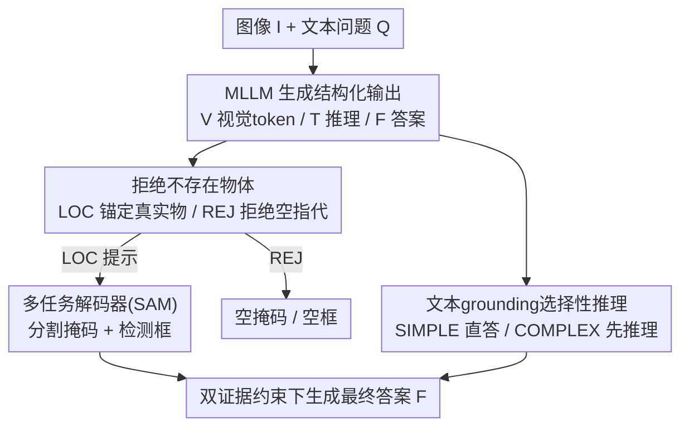

# PostAlign: Multimodal Grounding as a Corrective Lens for MLLMs

**会议**: ICLR 2026  
**OpenReview**: [https://openreview.net/forum?id=zJnPyb2xrp](https://openreview.net/forum?id=zJnPyb2xrp)  
**代码**: 无  
**领域**: 多模态VLM / 幻觉抑制  
**关键词**: 多模态对齐, 幻觉抑制, 视觉grounding, 负样本拒绝, 选择性推理

## 一句话总结
PostAlign 把"视觉 grounding（定位框/掩码）+ 文本 grounding（推理 rationale）"作为一副**矫正眼镜**后置在 MLLM 上，用一个 `<REJ>` 拒绝 token 让模型敢于拒绝不存在的物体、再用 `<SIMPLE>/<COMPLEX>` 路由信号按问题难度决定要不要生成中间推理，从而在 POPE、HaloQuest 等基准上显著压低幻觉、同时保住通用推理能力。

## 研究背景与动机
**领域现状**：MLLM（LLaVA、Qwen2-VL、InternVL 等）靠大规模视觉编码器 + 预训练语言模型把图文对齐，在 caption、VQA、视觉对话上表现亮眼。

**现有痛点**：一旦任务要求细粒度视觉理解或复杂推理，这些模型就常常"对齐崩掉"——它们生成的文字并不真正锚定在图像内容上，于是出现幻觉：图里没有的物体被说成有（典型的共现幻觉，比如沙发上明明是猫却答成狗），或者把属性、空间位置搞错。

**核心矛盾**：根因是模型过度依赖**语言先验（linguistic priors）**而非真实视觉证据。论文用一个很有说服力的实验佐证：把图像输入直接撤掉后，89.2% 的幻觉 token 依然照样产生——说明幻觉主要来自语言统计关联（哪些词常一起出现），而不是看错了图。换句话说，语言先验在解码后期逐层压制视觉信息，把模型推向"凭文字习惯生成"。

**本文目标**：(1) 让模型敢于拒绝图中不存在的指代物，而不是硬幻觉出来；(2) 让推理强度随问题难度自适应，简单问题别画蛇添足、复杂问题给足推理；(3) 不破坏 MLLM 原有的通用推理与泛化能力。

**切入角度**：作者不打算造新的 grounding 架构，而是把 grounding 输出**反过来用**——既然幻觉源于"没锚定在视觉上"，那就显式给模型补上视觉证据（物体定位）和文本证据（推理链），用它们当约束去校正最终答案。

**核心 idea**：把多模态 grounding 当作 MLLM 的"矫正眼镜"——视觉 grounding 提供图像锚定线索、文本 grounding 提供可解释 rationale，双重证据共同把输出拉回到真实视觉与上下文，且通过负样本拒绝和选择性推理两个机制精准对症幻觉与冗余推理。

## 方法详解

### 整体框架
PostAlign（论文中也称 MMGrounded-PostAlign）是一个**后置多模态对齐框架**：在已有 MLLM 上接两个外挂证据源，让 MLLM 输出一个结构化序列 $A = \{V, T, F\}$，其中 $V$ 是视觉 grounding token、$T$ 是文本 grounding 的推理 token、$F$ 是最终答案 token。

整条 pipeline 是：给定图像 $I$ 和文本问题 $Q$，MLLM 先吐出视觉 grounding token `<LOC>`，它的最后一层 embedding 经 MLP 投影后作为提示，喂给一个**多任务解码器**（基于 SAM ViT-H），解码出目标物体的分割掩码和检测框；如果图里根本没有这个指代物，`<LOC>` 会被替换成 `<REJ>`，解码器直接赋空掩码/空框，跳过解码。与此同时，文本 grounding 侧根据问题难度决定是否生成中间 rationale。最后，视觉证据（框/掩码）与文本证据（rationale）作为隐式约束，引导 MLLM 生成锚定在双模态证据上的最终答案。三大部件：MLLM（产 token）、视觉 grounding 编码器（抽稠密视觉特征）、多任务解码器（出掩码 + 框）。

### 关键设计

**1. 双重 grounding 作为后置矫正镜：把定位与推理当成证据而非任务**

针对"输出不锚定在视觉上"的根因，作者不去优化 grounding 本身的精度，而是把 grounding 的**输出**当成校正 MLLM 的约束信号。视觉 grounding 负责"指出图里到底是哪个物体"——它从 `<LOC>` token 的末层 embedding 出发，经 MLP 投影成提示 embedding，连同视觉编码器抽出的稠密特征一起送进多任务解码器，产出掩码和框；文本 grounding 负责"给出答案前的推理链条"。两路证据像隐式约束一样夹住最终答案的生成，把模型从"凭语言习惯接龙"拉回到"既看图又讲理"。这与 Kosmos-2、Shikra 那类"让 MLLM 去做 grounding"的思路正好相反：那些工作把 grounding 当目标任务、用 MLLM 去控制它，而本文是用 grounding 的结果反哺 MLLM 的视觉理解与幻觉抑制。

**2. 负样本拒绝机制：用 `<REJ>` token 让模型敢说"图里没有"**

针对共现幻觉（看到"椅子"就脑补"桌子"、只有绿苹果却答"红苹果"），作者引入负样本拒绝。具体做法是：当指代物在图中缺席时，强制 MLLM 把 `<LOC>` 预测成专用的 `<REJ>` token，多任务解码器对 `<REJ>` 直接赋空掩码和空框、绕过解码流程。为强化这一能力，加一个负样本拒绝损失：

$$L_{rej} = -\frac{1}{N}\sum_{i=1}^{N}\Big[y_i^{rej}\log p_i^{rej} + (1-y_i^{rej})\log(1-p_i^{rej})\Big]$$

其中 $y_i^{rej}\in\{0,1\}$ 标注样本 $i$ 是否应被拒绝。它的妙处在于：模型一旦被显式训练去拒绝那些"语言上很可能、视觉上不存在"的物体，就被迫去区分"真有视觉锚点的 grounding"和"被语言先验误导的伪 grounding"，从而在源头削弱对语言先验的过度依赖——这正对应前面那个"撤掉图 89.2% 幻觉还在"的病灶。

**3. 选择性推理机制：用 `<SIMPLE>/<COMPLEX>` 路由按难度决定要不要推理**

针对"不是所有问题都需要中间推理"这一观察，作者在文本 grounding 里加了选择性推理。训练时把问题分成两类并打上路由 token：简单问题（如"图里车是什么颜色"）模型直接输出 `<LOC>` 和最终答案、跳过 rationale；复杂问题（如"图里哪种食物蛋白质最多"）则输出 `<LOC>` + `<COMPLEX>` + 推理链 + 答案。推理时通过 self-reflection 提示让模型自评难度并自动打标签。配套一个选择性推理损失：

$$L_{reason} = -\frac{1}{N}\sum_{i=1}^{N}\Big[y_i^{rea}\log p_i^{rea} + (1-y_i^{rea})\log(1-p_i^{rea})\Big]$$

其中 $y_i^{rea}\in\{0,1\}$ 指示问题 $i$ 是否需要生成 rationale。这样既避免在简单问题上"过度思考"拖慢推理，又保证复杂问题有足够推理深度——实验（Table 3）显示它在 ReasonSeg 的 Easy/Medium/Hard 三档上都优于"全推理"或"全不推理"的固定策略。

### 损失函数 / 训练策略
作者用 LoRA 微调 MLLM、同时联合优化多任务解码器，冻结视觉 grounding 编码器（SAM ViT-H），而 token embedding、LLM head、投影层、掩码/框解码器全量微调。总损失为：

$$L = \lambda_1 L_{rej} + \lambda_2 L_{reason} + L_{ground} + L_{text}$$

其中视觉 grounding 损失 $L_{ground}$ 由检测损失 $L_{det} = L_{smooth\text{-}L1}(\hat{y}_{bbox}, y_{bbox}) + L_{GIoU}(\hat{y}_{bbox}, y_{bbox})$ 和分割损失 $L_{seg} = L_{BCE}(\hat{y}_{mask}, y_{mask}) + L_{DICE}(\hat{y}_{mask}, y_{mask})$ 组成，$L_{text}$ 为语言建模的交叉熵损失。训练数据为每条样本打上 `<SIMPLE>/<COMPLEX>` 推理类型标签、并加入带 `<REJ>` 的负样本。

## 实验关键数据

骨干覆盖 LLaVA-1.5-7B/13B、Qwen2-VL-7B、Qwen2.5-VL-7B、InternVL3-14B、InternVL3.5-14B，视觉 grounding 用 SAM ViT-H。评测分三类：幻觉（HaloQuest、POPE）、泛化推理（MME、MMBench）、grounding（RefCOCO、ReasonSeg）。

### 主实验

POPE（Random/Popular/Adversarial）+ MME + MMBench（EN/CN），PostAlign 一致提升各骨干：

| 模型 | POPE-Ran | POPE-Pop | POPE-Adv | MME | MMBench-EN |
|------|----------|----------|----------|-----|------------|
| LLaVA-1.5-7B | 83.3 | 80.1 | 78.2 | 1504.6 | 62.2 |
| + PostAlign-7B | 86.6 | 84.2 | 82.3 | 1514.3 | 63.9 |
| LLaVA-1.5-13B | 85.4 | 82.2 | 79.2 | 1517.4 | 66.8 |
| + PostAlign-13B | 88.9 | 87.3 | 85.6 | 1520.3 | 68.9 |
| InternVL3-14B | 89.1 | 87.2 | 84.3 | 1762.8 | 84.3 |
| + PostAlign-14B | 91.2 | 89.0 | 86.6 | 1772.3 | 85.5 |

对比把"框当语言 token 统一学"的 BTL 方法：BTL-Generation 几乎无增益且拉低 MME/MMBench（推理能力下降），BTL-Caption 仅小幅提升，而显式视觉 grounding 模块明显更优——说明把视觉证据"外挂当约束"比"塞进文本序列里硬学"更稳。

### 消融实验

HaloQuest 上拆解视觉 grounding token（LLaVA-1.5-7B 基线，Human Eval）：

| 配置 | False Premise | Visually Challenging | Insufficient Context |
|------|---------------|----------------------|----------------------|
| 无 grounding（基线） | 2.0 | 23.5 | 2.5 |
| + `<SEG>` 掩码 | 6.5 | 30.1 | 7.4 |
| + `<DET>` 框 | 8.2 | 31.1 | 6.6 |
| + `<SEG>`+`<DET>` | 9.9 | 33.9 | 9.9 |
| + `<SEG>`+`<DET>`+`<REJ>` | **33.2** | **38.3** | **31.4** |

ReasonSeg 上对比三种文本 grounding 策略（LLaVA-1.5-7B + SAM-ViT-H，gIoU/cIoU）：

| 策略 | Easy gIoU | Medium gIoU | Hard gIoU |
|------|-----------|-------------|-----------|
| pre-reasoning | 67.3 | 57.2 | 57.0 |
| inter-reasoning | 64.3 | 55.5 | 53.9 |
| selective reasoning | **68.9** | **58.9** | **57.2** |

### 关键发现
- **`<REJ>` 是抑制幻觉的最大功臣**：在 False Premise / Insufficient Context（含大量"反概念"场景，如问"图里狗是什么品种"但图里根本没狗）上，加上 `<REJ>` 把分数从个位数拉到 30+，因为这两类正是直接考"敢不敢拒绝错误前提"的能力。
- **掩码与框互补**：`<SEG>` 和 `<DET>` 单独都涨，合并后更高，说明像素级与框级定位提供了互补的视觉锚点。
- **选择性推理三档全胜**：固定"全推理"（inter-reasoning）反而最差，pre-reasoning 虽好但要多次推理代价高；选择性推理按难度自适应，既省又准。
- **不伤通用能力**：PostAlign 在 MME/MMBench 上不降反小升，而 BTL-Generation 明显掉点——后置外挂证据比改写输出格式更不破坏原模型。

## 亮点与洞察
- **"撤掉图像看幻觉还在不在"是个漂亮的诊断实验**：89.2% 幻觉 token 在无图时依然产生，干净利落地证明幻觉主要来自语言先验而非视觉误读，直接为"补视觉证据当矫正镜"的设计动机背书。
- **`<REJ>` token 把"拒绝"变成可学习的一等公民**：很多工作靠解码后处理压幻觉，这里直接让模型在生成时就显式产出拒绝信号、解码器对它赋空，简单却对症"反概念"场景。
- **grounding 反向使用的思路可迁移**："不造新 grounding 架构、而是把现成 grounding 输出当证据约束"这个范式，可推广到任何"输出不锚定在某模态"的对齐问题（如音频、文档、表格）。
- **选择性推理把 CoT 从"全有/全无"变成自适应**：用路由 token + self-reflection 提示让模型自评难度，避免简单题过度思考，这套机制也能用到纯文本 LLM 的推理预算分配。

## 局限与展望
- **依赖外部 grounding 标注与 SAM 解码器**：训练需要掩码/框监督和带 `<REJ>` 的负样本，构造成本不低；推理时多挂一个 SAM 解码器也增加部署复杂度。
- **难度自评的可靠性存疑**：`<SIMPLE>/<COMPLEX>` 的自动分类质量直接决定选择性推理收益，论文未充分量化误判率，复杂/简单边界样本上可能退化。
- **拒绝阈值与召回的 trade-off 未深挖**：过度倾向 `<REJ>` 可能误拒真实存在但难定位的物体，论文主要展示拒绝带来的增益，对"过度拒绝"的代价讨论较少。
- **改进方向**：可探索无需密集 grounding 标注的弱监督/自监督证据来源，或把矫正镜做成可插拔的推理时模块以降低训练耦合。

## 相关工作与启发
- **vs Kosmos-2 / Shikra（grounding-as-task）**: 它们把 grounding 形式化为"文本预测边界框"、让 MLLM 去做定位；本文相反，用 grounding 输出当证据去校正 MLLM 的最终答案，目标是抑制幻觉而非提升定位精度。
- **vs BTL（框当语言 token 统一学）**: BTL-Generation/Caption 把框坐标嵌进文本序列里学，本文实验显示这会损害通用推理（MME/MMBench 掉点）；显式外挂视觉 grounding 模块既涨幻觉指标又不伤泛化。
- **vs 解码后处理 / 特殊解码类幻觉抑制方法**: 那类方法多在推理时做后处理、增加推理时间且跨域泛化差；本文在训练时把拒绝与证据对齐内化进模型，推理时直接产出锚定输出。

## 评分
- 新颖性: ⭐⭐⭐⭐ "grounding 反向当矫正镜 + `<REJ>` 显式拒绝 + 选择性推理"组合清晰，单点不算颠覆但整体很对症
- 实验充分度: ⭐⭐⭐⭐ 覆盖 6 个骨干 × 幻觉/推理/grounding 三类基准，消融拆得细
- 写作质量: ⭐⭐⭐⭐ 动机由诊断实验驱动、逻辑顺，方法表述清楚
- 价值: ⭐⭐⭐⭐ 对"MLLM 语言先验幻觉"给出可落地的训练侧解法，范式可迁移

<!-- RELATED:START -->

## 相关论文

- [\[ICLR 2026\] P2-DPO: Grounding Hallucination in Perceptual Processing via Calibration Direct Preference Optimization](p2-dpo_grounding_hallucination_in_perceptual_processing_via_calibration_direct_p.md)
- [\[ICML 2026\] Instruction Lens Score: Your Instruction Contributes a Powerful Object Hallucination Detector for Multimodal Large Language Models](../../ICML2026/hallucination/instruction_lens_score_your_instruction_contributes_a_powerful_object_hallucinat.md)
- [\[ICLR 2026\] Grounding or Guessing? Visual Signals for Detecting Hallucinations in Sign Language Translation](grounding_or_guessing_visual_signals_for_detecting_hallucinations_in_sign_langua.md)
- [\[ICLR 2026\] FREAK: A Fine-grained Hallucination Evaluation Benchmark for Advanced MLLMs](freak_a_fine-grained_hallucination_evaluation_benchmark_for_advanced_mllms.md)
- [\[CVPR 2026\] Evaluating and Easing Hallucinations for GUI Grounding](../../CVPR2026/hallucination/exposing_and_evaluating_hallucinations_for_gui_grounding.md)

<!-- RELATED:END -->
