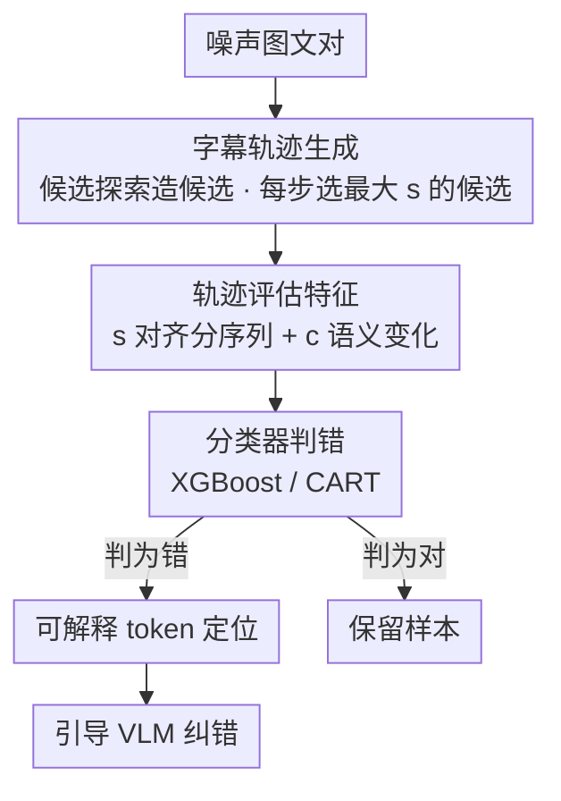

# Seeing What's Wrong: A Trajectory-Guided Approach to Caption Error Detection

**会议**: ICLR 2026  
**OpenReview**: [https://openreview.net/forum?id=73FGjnKu1P](https://openreview.net/forum?id=73FGjnKu1P)  
**代码**: https://github.com/mazumder-lab/TRACED  
**领域**: 多模态VLM / 数据清洗 / 图文对齐  
**关键词**: 字幕错误检测, 图文对齐, 轨迹特征, 数据清洗, 可解释性

## 一句话总结
这篇论文提出 TRACED：不再用"一张图文对一个相似度分"判断字幕是否有误，而是反复编辑字幕去最大化图文对齐分、生成一条"字幕轨迹"，用轨迹的改进幅度与语义变化作为特征训练分类器；在 MS COCO / Flickr30k / MM-IMDb 上把多种现有检测器的准确率最高提升约 2.8%，还能定位出错的具体词、并把这些线索喂给 VLM 把纠错后字幕的对齐分再提升最高 14.5%。

## 研究背景与动机
**领域现状**：CLIP、BLIP、LEMoN 这类大规模图文模型训练时要吃几百万到几亿条网络爬取/合成的图文对，但这些数据里混着大量错误字幕。现有的"错误字幕过滤器"几乎都走同一条路——给每个图文对打**一个**质量分或相似度分（模型置信度、近邻一致性、或多模态对齐分），分低的判为有误、删掉。

**现有痛点**：单分数有个根本盲区——**并非所有错误都同样好检测**。一条大体正确、只错了一个词（比如把 "wearing a black jacket" 改成 "wearing **no** jacket"）的字幕，BLIP 对齐分仍高达 0.55，会被判成"无误"；反过来，一条完全正确但图本身难描述、或措辞笨拙的字幕，可能只拿到 0.44 被误判成"有误"。错误信号被淹没在一个标量里。

**核心矛盾**：单个相似度分数缺乏"分辨率"——它只回答"现在这条字幕和图有多像"，却没回答**"这条字幕还有多大改进空间"**。而作者的关键观察恰恰是：正确字幕已经接近最优、再怎么改对齐分也只能微涨；错误字幕则有巨大的改进潜力、一旦改对关键词对齐分会暴涨。这个"改进潜力"才是区分对错的强信号，但单分数把它丢了。

**本文目标**：(1) 设计一种能捕捉"改进潜力"的检测信号，并且能套在任意现有检测器之上；(2) 顺带让检测结果可解释——指出到底哪个词错了；(3) 把可解释信息用于下游纠错。

**切入角度**：与其看一个静态分数，不如看字幕在"被不断改好"过程中分数与语义如何演化——把检测从"读一个点"变成"读一条曲线"。

**核心 idea**：用"字幕轨迹"（迭代编辑字幕以最大化对齐分得到的有序字幕序列）的统计特征代替单一相似度分，做字幕错误检测。

## 方法详解

### 整体框架
TRACED 要解决的是"单分数判不准"，整体思路是把每个图文对从"一个分"扩成"一条轨迹"，再用轨迹特征做判别。给定一个（可能有噪声的）图文对，系统先**反复改写字幕**去最大化某个对齐打分函数 $s$，得到一串越改越"对齐"的字幕（轨迹）；然后**评估这条轨迹**，抽出对齐分随步数的变化序列、以及每步字幕相对原字幕的语义偏移量作为特征；最后用这些特征训练一个轻量分类器判断该图文对是否有误。判为有误的样本还能进一步**定位出错 token**，并把这些线索喂给 VLM 引导纠错。

整条管线如下（探索策略负责在每一步生成候选、由 $s$ 挑出最优，循环若干步得到轨迹）：

### 关键设计

**1. 字幕轨迹：用"可改进空间"把对错分开**

这是全文的支点，针对的痛点是"单分数把错误信号压成一个标量、淹没了细微错误"。作者把检测对象从"一条字幕"换成"一条由迭代编辑生成的字幕序列"。形式化地，给定打分函数 $s: \mathcal{X}\times\mathcal{Y}\to\mathbb{R}$（图文对齐分，越大越对齐），从原字幕 $x_0$ 出发，每一步生成若干候选改写，选出对齐分最高的那个作为 $x_t$，迭代 $T$ 步得到轨迹 $(x_0, x_1, \dots, x_T)$（Algorithm 1）。核心洞察是：**正确字幕已接近最优**，迭代编辑只能让 $s$ 微涨、且改动几乎不改变语义；**错误字幕改进潜力大**，往往需要大改才能把 $s$ 拉上去。于是"轨迹涨多少、改动多大"本身就把对错区分开了——这比任何单一 $s(x_0,y)$ 都更富信息、也更可解释。$s$ 的选择是灵活的（BLIP 的匹配概率、CLIP 余弦相似度、或 LEMoN 的多模态相似度都行），这让 TRACED 能直接套在现有检测器之上。

**2. 候选探索策略：Elim / GCD / Fast GCD 怎么造候选**

轨迹好不好，取决于每一步怎么生成候选改写——这是计算开销与轨迹质量的权衡所在。作者给了三种策略。**Elimination（Elim）** 最简单：对长度 $L$ 的字幕 $x=(w_1,\dots,w_L)$，每次删掉一个词得到 $L$ 个候选，只需 $L$ 次前向、无需梯度，极廉价。**Greedy Coordinate Descent（GCD）**（借鉴 Zou et al. 2023 的对抗思路）：对每个词考虑 top-$K$ 个由梯度引导的替换词，候选池大小 $KL$，因太大而随机采样 $N$ 个评估。**Fast GCD（FGCD）** 是二者的混合体——先用 Elim 找出"删掉后最能提升 $s$ 的那个词"，再只对这一个词探索 top-$K$ 替换，于是每步只要 1 次梯度 + $K+L$ 次前向，远低于 GCD 的 $KL$ 次。值得注意的是，实验里反而是最朴素的 **Elim 通常给出最有信息的轨迹**：删词只反映每个词对对齐的"正负贡献"、搜索空间受限带来正则化效果，而 GCD/FGCD 的自由替换有时会塞进无意义但能涨分的词。

**3. 轨迹评估特征与分类：s 与 c 双信号**

有了轨迹还得把它压成判别特征。作者定义轨迹评估函数 $e(x_0,\dots,x_T,y)\in\mathbb{R}^d$，并发现两类信号最有用：一是**对齐分序列** $s(x_0,y),\dots,s(x_T,y)$，刻画"还能涨多少"；二是每步字幕相对原字幕的**语义相似度** $c(x_t,x_0)$（用 CLIP 或 BLIP-ITC 嵌入算余弦），刻画"改动有多大"。最终特征拼成

$$e = [\,s(x_0,y),\dots,s(x_T,y),\; c(x_1,x_0),\dots,c(x_T,x_0)\,]$$

附录消融表明只用 $s$ 或只用 $c$ 都次优、两者合用一致最好——因为正确字幕是"微涨+小改动"、错误字幕是"暴涨+大改动"，单看一维分不清"小改动微涨"和"大改动微涨"。把 $e$ 作为特征，作者用 XGBoost / CART（图省事，重点是证明思路有效）做 3 折网格搜索交叉验证、按 AUC 选最优模型，输出"有误/无误"。

**4. 可解释 token 定位与引导 VLM 纠错**

轨迹不仅判对错，还顺手指出"错在哪个词"。在 Elim 轨迹里，**删掉后最能提升对齐分的前几个词，往往就是错误源头**——例子里删掉 "no" 让 BLIP 对齐分从 0.55 一路爬到约 99.4%，直接暴露原字幕有误。把这种 token 级定位用于纠错：删一个词若 $s$ 上升说明该词可能错（该删）、下降说明该词可能对，于是得到一份"可疑词清单"喂进 VLM 提示里引导它改字幕（可叠加 CoT 提示），循环若干步直到无误或到上限。对大规模清洗，作者还用 InternVL3-14B 当老师、把它在 TRACED 引导下纠正的字幕蒸馏给小模型 InternVL3-1B（得到 -FT 版），推理时再对比"喂 TRACED 轨迹信息 vs 只给原字幕"，隔离出 TRACED 在推理期的增量收益。

### 一个例子：定位 "no"
原噪声字幕 "A man is standing in front of a brick storefront wearing **no** jacket."，BLIP 初始对齐分 0.55，单分数会判成"无误"。Elim 轨迹逐步删词：删掉 "no" 后语义对齐显著上升，到第 6 步左右对齐分爬到接近最优，轨迹整体呈"先涨后掉"的形状（删到只剩核心词时才开始掉）。这条"大幅可改进 + 关键词删除引发语义跳变"的轨迹，让分类器把它判成"有误"，并把 "no" 标红作为错误源头——这正是单分数 0.55 看不出来的。

## 实验关键数据

### 主实验
设置：在干净数据集上注入 **50% 错误**图文对，3 个随机种子；三类噪声——random（随机换整条字幕）、noun（换共享名词的字幕）、fine-grained（用 GPT-4o-mini 做最小但语义显著的扰动，最难）。把 TRACED 套在 CLIP / LEMoN（FIX & OPT）/ BLIP（ITC & ITM）上，比检测准确率。

| 数据集 | 基线方法 | 基线 Acc(%) | +TRACED(Elim) | 提升 |
|--------|---------|------------|---------------|------|
| Flickr30k | BLIP(ITM) | 88.5 | 89.5 | +1.3 |
| Flickr30k | CLIP | 83.8 | 85.7 | **+2.8** |
| MS COCO | BLIP(ITM) | 89.1 | 90.5 | +1.7 |
| MS COCO | CLIP | 82.7 | 84.5 | +2.5 |
| MM-IMDb | LEMoN(FIX) | 76.5 | 78.3 | +2.4 |

跨数据集平均提升：MS COCO 最高 +2.5%、Flickr30k +2.8%、MM-IMDb +2.4%；对所有基线都是一致正向。

### 消融与分析

| 配置 | 关键发现 | 说明 |
|------|---------|------|
| 仅 $s$ / 仅 $c$ | 次优 | 单一信号分不清"小改动微涨"与"大改动微涨" |
| $s+c$ 合用 | 一致最好 | 对齐分 + 语义变化双信号互补 |
| Elim vs GCD/FGCD | Elim 通常最优 | 删词反映正负贡献、搜索空间受限带正则化 |
| fine-grained 噪声 | TRACED 增益最大 | 此设定下基线最吃力，TRACED 提升最高 **+7.5%** |
| 轨迹长度 $T$ | 最敏感超参 | $T$ 增大稳定涨点，但小 $T$ 已近最优（关键错词几步内即可定位）|

纠错应用：把 token 级线索喂给 InternVL3，纠错后字幕的 BLIP 对齐分相比"无引导纠错"最高提升 **+14.5%**（fine-grained 噪声、5 步纠错、每步 2 个纠错提示）。

效率：TRACED 高度可并行；用最贵的 BLIP(ITM) 打分，在 4 张 L40 上用 Elim 算法约 **6.5 小时**可对 100 万图文对完成分类。

### 关键发现
- 贡献最大的是"轨迹"这个表征本身：把单分数换成轨迹特征就普遍涨点，且越难的噪声（fine-grained）涨得越多——说明它确实补上了单分数对"细微错误"的盲区。
- 越简单的 Elim 越好，反直觉但合理：受限搜索空间起到正则化、删词信号更纯净；GCD 的自由替换反而会引入"涨分但无意义"的噪声。
- TRACED 对 $T$ 敏感但不需要大 $T$，因为关键错词往往几步内就被定位，兼顾了精度与成本。

## 亮点与洞察
- **把"一个分"升维成"一条曲线"**：核心洞察"正确字幕改不动、错误字幕改进空间大"非常朴素却抓得准，且天然带可解释性（哪步涨得猛=哪个词错），是单分数范式给不了的。
- **model-agnostic 即插即用**：$s$ 可换成任意现有检测器的打分，TRACED 是"增强插件"而非新检测器，CLIP/BLIP/LEMoN 都能直接受益，落地成本低。
- **检测与纠错共用一套信号**：同一条 Elim 轨迹既判对错又定位错词、还能喂给 VLM 纠错，可解释信息被"一鱼三吃"，这种把诊断结果直接转成下游引导的思路可迁移到其他数据清洗任务。
- **更真实的噪声基准**：用 GPT-4o-mini 造"看似合理但暗含细错"的 fine-grained 噪声，比以往"整条换字幕"的合成噪声更贴近真实标注错误，推动了评测的难度上限。

## 局限与展望
- 评测全部建立在**合成注入噪声**（且固定 50% 错误率）上，真实世界数据集里错误率未知、分布更杂，迁移性还需验证。
- TRACED 要为每个图文对跑一条迭代轨迹（多次前向 + 可能的梯度），虽可并行，但相比单次打分仍有数倍开销；超大规模（亿级）清洗的实际成本与收益比有待评估。
- 分类器只用了 XGBoost/CART，作者自承更强模型可能进一步拉大与基线的差距，当前数字是保守下界。
- 纠错环节依赖 VLM（InternVL3）能正确利用"可疑词"线索，若 VLM 本身能力不足或线索有噪声，纠错收益可能打折；CoT 与提示设计对结果影响较大，鲁棒性存疑。

## 相关工作与启发
- **vs 单分数检测器（CLIP / BLIP / LEMoN）**：它们各打一个静态相似度分，TRACED 不替换它们而是把它们的分当作 $s$、再叠一层轨迹特征；区别在于 TRACED 读"改进过程"而非"静态对齐"，因此对细微错误更敏感，且对每个基线都能净增益。
- **vs 基于对抗/坐标下降的 token 编辑（如 GCD, Zou et al. 2023）**：那条线用梯度引导替换词去攻击/优化文本，TRACED 借用其候选生成机制，但目的不是攻击而是"构造可判别的改进轨迹"，并发现更朴素的删词法（Elim）在这个目标下反而更优。
- **vs 字幕纠错方法（结构化编辑 / 专用纠错模型 / GPT-4 纠错）**：以往纠错把"找错"和"改错"当两件事，TRACED 用同一条轨迹同时给出错词定位，再把定位喂给 VLM 引导改写，相当于给纠错模型提供了更精准的"病灶坐标"。

## 评分
- 新颖性: ⭐⭐⭐⭐⭐ 把字幕错误检测从"读一个分"重构为"读一条改进轨迹"，视角转换干净有力且自带可解释性。
- 实验充分度: ⭐⭐⭐⭐ 三数据集、三噪声、五基线、含纠错下游与效率分析，较扎实；但全靠合成噪声、固定 50% 错误率，缺真实噪声验证。
- 写作质量: ⭐⭐⭐⭐⭐ 动机用图 1 的反例讲得极清楚，方法、洞察、可解释例子层层递进，容易读懂。
- 价值: ⭐⭐⭐⭐ 即插即用、能增强现有任意检测器并打通到纠错，对大规模图文数据清洗有直接实用价值。

<!-- RELATED:START -->

## 相关论文

- [\[AAAI 2026\] Ground What You See: Hallucination-Resistant MLLMs via Caption Feedback, Diversity-Aware Sampling, and Conflict Regularization](../../AAAI2026/hallucination/ground_what_you_see_hallucination-resistant_mllms_via_caption_feedback_diversity.md)
- [\[ICLR 2026\] Imitating the Truth: Attention-aware Truth-Guided Enhancement for Hallucination Mitigation in Large Vision-Language Models](imitating_the_truth_attention-aware_truth-guided_enhancement_for_hallucination_m.md)
- [\[ICLR 2026\] Enhancing Hallucination Detection through Noise Injection](enhancing_hallucination_detection_through_noise_injection.md)
- [\[ICLR 2026\] Learning to Reason for Hallucination Span Detection](learning_to_reason_for_hallucination_span_detection.md)
- [\[ICLR 2026\] Neural Message-Passing on Attention Graphs for Hallucination Detection](neural_message-passing_on_attention_graphs_for_hallucination_detection.md)

<!-- RELATED:END -->
