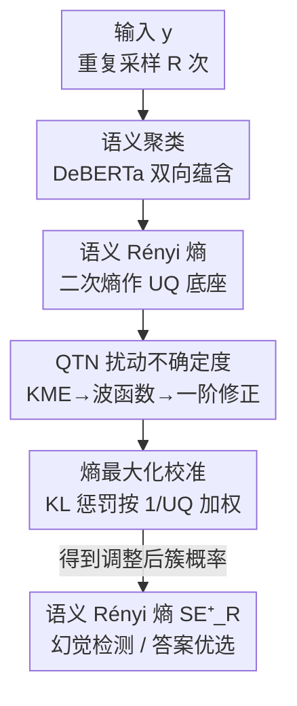

# Semantic Uncertainty Quantification of Hallucinations in LLMs: A Quantum Tensor Network Based Method

**会议**: ICLR 2026  
**OpenReview**: [https://openreview.net/forum?id=11kPIEkj75](https://openreview.net/forum?id=11kPIEkj75)  
**代码**: https://github.com/pragasv/semantic-entropy-UQ-  
**领域**: LLM幻觉检测 / 不确定性量化  
**关键词**: 幻觉检测, 语义熵, 不确定性量化, 量子张量网络, 熵最大化

## 一句话总结
针对语义熵检测幻觉时忽略「token 序列概率本身有多大随机波动」这一盲区，本文把序列概率的核均值嵌入看成一个量子张量网络（QTN）的波函数，用微扰理论一次性算出每条概率的局部不确定度，再用「熵最大化 + 按不确定度反比加权的 KL 惩罚」校准概率，得到对混淆（confabulation）更敏感、且可解释的语义 Rényi 熵；在 4 个数据集、8 个模型、3 档量化的 116 组实验里 AUROC/AURAC 稳定超过 SOTA。

## 研究背景与动机
**领域现状**：LLM 会产生「混淆」（confabulation）——流畅但不可靠、同一提示下答案随机漂移的内容。检测这类幻觉的主流无监督路线是**语义熵（Semantic Entropy, SE）**：对同一问题重复采样多次，用双向蕴含（DeBERTa）把语义等价的回答聚成簇，簇分布的香农熵越高，越可能在幻觉。后续 KLE、SNNE、SD 等在相似度度量、聚类方式上做了改进。

**现有痛点**：这些方法都把 token 序列（TS）概率 $P(s\mid y)$ 当成确定的输入直接算熵，**没有考虑这些概率本身的随机不确定度（aleatoric uncertainty）**。可同一个 prompt 重复问，序列概率会因随机种子、措辞等无关因素而抖动；只要概率不稳，由它推出的语义熵就不可靠。结果是高熵不一定真幻觉、低熵也可能是过自信，误报漏报都难压下去。

**核心矛盾**：幻觉风险其实应该取决于「序列概率对模型扰动有多敏感」——这是一个**局部**敏感度问题，而全局的熵阈值（如「熵 >τ 就判幻觉」）天然抓不到。另外，贝叶斯深度学习（BDL）这类经典 UQ 工具难校准、next-token 概率又不像真正的类别概率，套不进来；而随机采样式变分推断对 LLM 规模又太贵。

**本文目标**：给每条 TS 概率配一个**局部、可解释、一次成型（无需多次采样）**的不确定度度量，并把它真正用进熵的计算里，让最终的语义熵对混淆更敏感。

**切入角度**：借鉴物理启发式 UQ（Principe 2010）——把概率分布的核均值嵌入（KME）当作某个量子系统的波函数，**微扰这个系统**，看本征态/本征能量的一阶修正有多大，就能读出该分布对微小扰动的局部敏感度。本征态在扰动下越不稳，对应概率就越不确定。

**核心 idea**：把 TS 概率视为量子张量网络的波函数，用微扰理论一次算出每条概率的局部不确定度；再用熵最大化把高不确定区域往高熵推、低不确定区域锚定在原值，得到「不确定度感知」的语义 Rényi 熵作为幻觉指标。

## 方法详解

### 整体框架
方法解决的是「**让语义熵把序列概率自身的随机波动也算进去**」。整条流水线是确定性的、单次成型：对输入 $y$ 重复采样 $R$ 次得到 $R$ 条生成；用 DeBERTa 双向蕴含把语义等价的生成聚簇；与以往用香农熵不同，本文在簇上用**语义 Rényi（二次）熵**，因为它正好是物理启发式 UQ 框架的数学底座；接着把所有 TS 概率的 KME 嵌进 RKHS、当成一个 QTN 的波函数，用**微扰理论**算出每条概率 $p_s^{(r)}$ 的局部不确定度 $\mathrm{UQ}(p_s^{(r)})$；最后做一步**熵最大化校准**，按不确定度反比加权的 KL 惩罚把概率往「最大熵」方向调，得到调整后的簇概率 $p_c^{(j)*}$，由此算出对混淆更敏感的 $\mathrm{SE}_R^+$ 用于幻觉检测与答案优选。

### 关键设计

**1. 语义 Rényi 熵：把熵换成 UQ 框架能用的二次形式**

聚类沿用语义熵的经典做法：对输入 $y$ 重复采样，用 DeBERTa 双向蕴含判等价、聚成语义不同的簇集合 $C$，簇概率为 $p_c^{(j)} = P(c_j\mid y) = \frac{\sum_{s\in c_j}P(s\mid y)}{\sum_{j}\sum_{s\in c_j}P(s\mid y)}$。痛点在于：要把后面的物理启发式 UQ 接上来，需要一个能写成核均值嵌入、并直接对应「期望」的熵形式，而香农熵不满足。本文因此改用**二次 Rényi 熵** $S_{E_R}(y) = -\log\sum_j p_c^{(j)2} = -\log(\mathbb{E}[p_c])$。它本身就是分布不确定性的直接度量，且 $\sum_j p_c^{(j)2}$ 恰好能由高斯核的 KME 经验估计 $\hat\psi_y(x)=\frac{1}{R}\sum_r \kappa_\sigma(p_s^{(r)};x)\,p_s^{(r)}$ 来逼近——这一步把「熵」和「波函数」搭上了桥，是后续 QTN 微扰能成立的前提。

**2. QTN 扰动不确定度：用波函数的一阶修正量化局部敏感度**

这是本文最核心的创新，直击「序列概率本身有多不稳没人量化」的盲区。把经验 KME $\{\hat\psi_y\}$ 当作某个 QTN 哈密顿量 $\hat H$ 的一个本征模（eigen-mode）；于是**扰动 $\hat H$ 就等价于扰动底层的 TS 概率分布**，本征模/本征能量的一阶修正量就反映分布对无穷小变化有多敏感。具体构造一阶不确定度「特征」向量

$$V_m^{(1)}(x) = E_m^{(1)} + \frac{\sigma^2}{2}\frac{\nabla_m^2|\psi_m^{(1)}(x)|}{|\psi_m^{(1)}(x)|},\quad E_m^{(1)} = -\min_{p_x}\frac{\sigma^2}{2}\frac{\nabla_m^2|\psi_m^{(1)}(x)|}{|\psi_m^{(1)}(x)|}$$

其中拉普拉斯 $\nabla_m^2|\psi_m^{(1)}(x)|$ 衡量一阶修正在局部邻域相对均值的变化，$V_m^{(1)}(x)$ 可看成各概率幅上不确定度的「频谱图」。最后把概率 $p_s^{(r)}$ 映到 RKHS 的 $x^{(r)}$，取相邻 $M$ 个模（论文用 $M=8$）的平均作为该概率的不确定度：$\mathrm{UQ}(p_s^{(r)}) = \frac{1}{M}\sum_m V_m^{(1)}(x)\big|_{x=x^{(r)}}$。一阶修正大 = 概率高度不稳，小 = 局部稳定。相比贝叶斯/采样式 UQ，它是**确定性、单次、物理可解释**的，不用反复采样。

**3. 熵最大化校准：按不确定度反比加权地把概率往最大熵推**

有了 $\mathrm{UQ}$ 还不够，要把它真正用进概率。本文用最大熵原则做一步校准：在只有部分信息时，最大熵分布是对缺失信息「最不武断」的估计。对每条概率求解

$$p_s^{(r)*} = \arg\max_{\hat p_s^{(r)}}\Big\{-\log\big(\hat p_s^{(r)2} + (1-\hat p_s^{(r)})^2\big) - \lambda\cdot\frac{1}{\mathrm{UQ}(p_s^{(r)})}\cdot \mathrm{KL}(\hat p_s^{(r)}\,\|\,p_s^{(r)})\Big\}$$

第一项是 Rényi 熵（往高熵、不武断方向推），第二项是把调整值 $\hat p_s^{(r)}$ 拉回经验概率 $p_s^{(r)}$ 的 KL 惩罚，关键在于**惩罚强度按 $1/\mathrm{UQ}$ 缩放**：不确定度高时 KL 惩罚放松、熵项主导，概率被大幅往高熵推；不确定度低时 KL 收紧，概率锚定在模型原值附近。$\lambda>0$ 调两者权衡。这样既不会盲目抹平所有概率，也不会对不可靠区域照单全收——高不确定区被推高熵、低不确定区保持原判，最终得到的 $\mathrm{SE}_R^+$ 对混淆的高估偏差被纠正、检测更可靠。

### 一个例子：「哪个产油国是美国的亲密盟友？」
把该问题重复问 10 次，得到 Russia / Saudi Arabia(×4) / Iran / Kuwait / Qatar / Iraq 等生成。各簇按 TS 概率算簇概率 $p_c^{(j)}$；Saudi Arabia 作为语境正确答案原本占 $0.888$。Qatar、Iraq、Iran 这些幻觉答案虽各自概率不大但合起来有非平凡质量，标准 $S_{E_S}$ 会**低估**混淆风险。经不确定度感知校准后，高不确定的幻觉答案概率被压低、Saudi Arabia 的簇概率升到 $0.859$，整体熵估计 $S_E^+$（0.130）系统性低于 NE（0.846）和 $S_{E_S}$（0.225）——即便答案池里混着幻觉，也能把高确定、语义连贯的答案优选出来。

## 实验关键数据

实验覆盖 TriviaQA、NQ-Open、SVAMP、SQuAD 四个数据集，8 个模型（Mistral-7B/instruct、Falcon-rw-1B、LLaMA-3.2-1B、LLaMA-2-7B/13B 及 chat 版），共 116 组场景，指标为 AUROC、AURAC、RAC。

### 主实验
| 评估维度 | 本文方法 | 对比基线 | 结论 |
|--------|--------|----------|------|
| AUROC（区分对/错答案） | SRE-UQ（$\mathrm{SE}_R^+$） | NE / $S_{E_S}$ / DSE / KLE 等 + 监督式 ER、p(True) | 跨全部模型有竞争力，且**无需真值标签训练**即超过监督方法 |
| AURAC（拒答后准确率曲线下面积） | SRE-UQ | 同上 | 随高不确定输出被过滤，准确率保持更高，优于离散语义熵、朴素熵、监督 p(True) |
| 鲁棒性（16/8/4-bit 量化） | SRE-UQ | 同上 | 三档量化下方法相对排序稳定，压缩下仍优于或持平 SOTA |

### 消融 / 分析实验
| 配置 | 关键指标 | 说明 |
|------|---------|------|
| $\mathrm{SE}_R^+$（含 UQ 校准） | 最低熵估计、最高 AUROC/AURAC | 完整方法 |
| $S_{E_R}$（仅 Rényi，无 UQ 校准） | 次于 $\mathrm{SE}_R^+$ | 去掉不确定度集成，高估混淆风险 |
| $S_{E_S}$ / DSE / NE（香农/离散/朴素熵） | 更易低估混淆 | 经典语义熵基线 |
| 4-bit 量化 vs 16-bit | AUROC 绝对值略降 | 量化使校准变粗，但相对排序不变 |

### 关键发现
- **量化鲁棒性**是本文相对前人未被检验的维度：4-bit 下绝对 AUROC 略降，但方法相对优势保持，说明增益不是精度设置的假象，对边缘/移动部署有现实意义。
- **熵变化在输入空间上非均匀**：低熵区（接近 0）相对稳定，而中间区间（尤其 0.25–0.50）波动最大——模型在该区间常在多个「自信但语义相左」的答案间反复横跳。因此单一全局熵阈值很脆弱，这些高风险熵区应谨慎对待、必要时引入人工复核或辅助信号。
- 不确定度集成系统性降低了熵估计、纠正高估偏差，使「即便在幻觉时也能优选高确定答案」成为可能——这是先前工作没做到的。

## 亮点与洞察
- **把幻觉检测接上量子微扰理论**：用波函数本征态在扰动下的一阶修正来度量「概率有多不稳」，给出确定性、单次、可解释的局部 UQ，绕开了贝叶斯 UQ 难校准、采样式变分推断太贵的两难。
- **不确定度不是单独打分，而是缩放 KL 惩罚**：$1/\mathrm{UQ}$ 加权让校准「该动的动、该锚的锚」，比「直接对高熵打标签」更细腻，这个「用辅助信号反比加权约束项」的思路可迁移到其他需要按可信度调整输出的场景。
- **把熵从香农换成二次 Rényi 是为了能写成 KME**——这是为了让物理启发式框架成立而做的数学对齐，体现了「先选好能套进理论的目标函数」的设计自觉。

## 局限与展望
- 受算力限制，评测主要用较小模型（≤13B），可能无法完全反映 GPT-4/Claude 等前沿大模型上幻觉的绝对检测精度与复杂度。
- 语义聚类依赖外部蕴含模型（DeBERTa-large + MNLI），蕴含判断的误差会传导进熵估计。
- 方法需要访问 **token 级概率**，对只给文本、不给 logprob 的闭源 API 不适用。
- QTN 微扰、$M=8$ 模数、$\lambda$ 等超参的选取与计算开销细节放在附录，主文未充分展开敏感性分析；二次 Rényi 熵与一阶修正公式建议对照原文与附录 A.2/D 核实。

## 相关工作与启发
- **vs 语义熵 SE（Farquhar 2024）/ 离散语义熵 DSE**: 二者把 TS 概率当确定输入直接算香农熵，忽略其随机波动；本文用 Rényi 熵 + QTN 微扰显式量化并校准这种 aleatoric 不确定度，对混淆更敏感。
- **vs KLE / SNNE / SD**: 它们改进的是相似度度量与聚合方式，仍对聚类质量、相似度函数、TS 概率抖动敏感；本文直接在概率层面建模其不确定度。
- **vs 结构感知/扰动式（Graph Uncertainty、SPUQ、语义不变扰动采样）**: 这些靠外部知识图谱或反复 paraphrase 查询，开销大；本文是单次确定性计算，无需重复查询或外部知识库。
- **vs 监督式 ER、p(True)**: 需标注/少样本训练且对分布外数据差；本文无监督却在 AUROC/AURAC 上超过它们。

## 评分
- 新颖性: ⭐⭐⭐⭐⭐ 首次把 TS 概率的 aleatoric 不确定度引入幻觉检测，并用量子张量网络微扰理论给出确定性、可解释的局部 UQ。
- 实验充分度: ⭐⭐⭐⭐ 4 数据集 × 8 模型 × 3 量化档共 116 组，且补了前人忽略的量化/生成长度维度；但多数为相对胜率矩阵，缺少绝对数值大表。
- 写作质量: ⭐⭐⭐⭐ 动机与「直觉」一节把物理类比讲得清楚；但 QTN 微扰公式较重，关键推导依赖附录。
- 价值: ⭐⭐⭐⭐ 无监督、单次、量化鲁棒，适合资源受限部署；token 概率依赖限制了对闭源 API 的适用面。

<!-- RELATED:START -->

## 相关论文

- [\[ICLR 2026\] Estimating Semantic Alphabet Size for LLM Uncertainty Quantification](estimating_semantic_alphabet_size_for_llm_uncertainty_quantification.md)
- [\[ICLR 2026\] HalluGuard: Demystifying Data-Driven and Reasoning-Driven Hallucinations in LLMs](halluguard_demystifying_data-driven_and_reasoning-driven_hallucinations_in_llms.md)
- [\[ICLR 2026\] Critical Confabulation: Can LLMs Hallucinate for Social Good?](critical_confabulation_can_llms_hallucinate_for_social_good.md)
- [\[ICLR 2026\] GHOST: Hallucination-Inducing Image Generation for Multimodal LLMs](ghost_hallucination-inducing_image_generation_for_multimodal_llms.md)
- [\[ICLR 2026\] High Accuracy, Less Talk (HALT): Reliable LLMs through Capability-Aligned Finetuning](high_accuracy_less_talk_halt_reliable_llms_through_capability-aligned_finetuning.md)

<!-- RELATED:END -->
