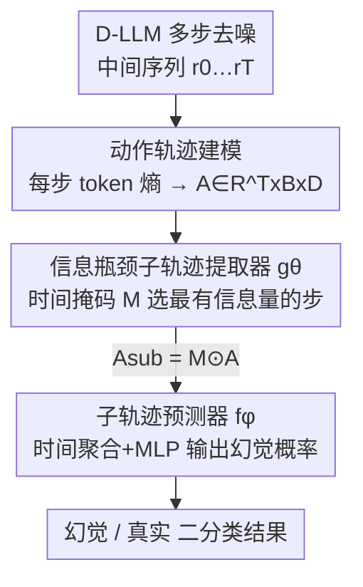

# TraceDet: Hallucination Detection from the Decoding Trace of Diffusion Large Language Models

**会议**: ICLR 2026  
**OpenReview**: [https://openreview.net/forum?id=4puxTouUSV](https://openreview.net/forum?id=4puxTouUSV)  
**代码**: https://github.com/chang-sx/TraceDet  
**领域**: 幻觉检测 / 扩散语言模型 / LLM 安全  
**关键词**: 扩散大模型, 幻觉检测, 去噪轨迹, 信息瓶颈, AUROC

## 一句话总结
针对扩散大语言模型（D-LLM）多步去噪过程中暴露出的幻觉信号，本文把去噪轨迹建模成一条"动作轨迹"，用信息瓶颈原理自动挑出对幻觉最有信息量的子轨迹来训练分类器，在两个开源 D-LLM、三个 QA 数据集上把幻觉检测 AUROC 平均提升 15.2%。

## 研究背景与动机

**领域现状**：扩散大语言模型（D-LLM，如 LLaDA-8B、Dream-7B）正成为自回归 LLM 的有力替代品。它不像 AR-LLM 那样从左到右逐 token 生成，而是用双向注意力对整条序列做多步去噪（denoising）：从全掩码序列出发，每一步预测所有被掩码 token，再按置信度重新掩码一部分，迭代 T 步后输出最终回答。这种范式在计算效率和灵活推理上有潜力，已能在同规模上追平 LLaMA-3 等领先模型。

**现有痛点**：D-LLM 的幻觉问题几乎没人研究，但幻觉一样会损害用户信任、在关键场景酿成严重后果。现有幻觉检测方法全是为 AR-LLM 设计的——要么是 output-based（看多次采样的一致性、token 熵等输出信号），要么是 latent-based（探测单次前向传播的隐状态）。它们都建立在"一次前向生成"这个前提上。

**核心矛盾**：D-LLM 的幻觉信号不只藏在最终输出里，而是弥散在整个多步去噪轨迹中。作者在实证里发现了三种 AR-LLM 没有的独特模式：**交错幻觉**（中间步在真实与幻觉内容间反复横跳）、**摇摆猜测**（多个互相矛盾的关键词轮番出现）、**持续错误**（自始至终咬定一个错误答案）。把这些中间动态丢掉、只看最终文本，等于扔掉了最有判别力的证据；而且部分中间信息会在重新掩码时被擦除，最终输出和中间过程存在错位。

**本文目标**：设计一个专门吃 D-LLM 去噪过程的幻觉检测框架，把藏在中间步里的幻觉信号利用起来。难点在于：哪些去噪步真正贡献了幻觉，事先并不知道（没有 step 级标注监督）。

**切入角度**：借鉴扩散策略优化里的视角，把去噪过程看成一个马尔可夫决策过程（MDP），每一步的"动作"就是模型基于当前中间结果对完整回答的预测。这样整条轨迹就成了可分析的序列证据。

**核心 idea**：用信息瓶颈（IB）原理，从完整动作轨迹中自动抽取"对幻觉标签最有信息量、同时尽量精简"的子轨迹，再用这个子轨迹训分类器——无需显式的 step 级监督。

## 方法详解

### 整体框架

TraceDet 要解决的是"给定一个 D-LLM 的去噪过程，判断它的最终回答是不是幻觉"。整体分三段串行：先把去噪过程转成一条可量化的**动作轨迹**（用每一步的 token 级熵刻画）；再用一个**子轨迹提取器** $g_\theta$ 在信息瓶颈目标下学一个时间掩码，只保留最有信息量的若干步；最后把掩码后的子轨迹喂给**预测器** $f_\phi$ 输出幻觉概率。提取器和预测器联合训练，损失由分类项和信息瓶颈正则项组成。

把去噪建成 MDP 是这套框架的地基：第 $t$ 个状态 $s_t=(p_0, r_{T-t})$ 是输入问题加当前中间序列，动作 $a_t$ 是模型从 $s_t$ 预测出的完整回答 $\hat r_{T-t-1}\sim P_\theta(r_0\mid r_{T-t},p_0)$，转移则是按噪声调度重新掩码一部分 token 进入下一状态。于是整条动作轨迹 $A=\{a_0,\dots,a_{T-1}\}$ 记录了模型如何一步步精修生成，比单看最终输出 $r_0$ 信息量大得多。

### 关键设计

**1. 把去噪过程建模为基于 token 熵的动作轨迹**

幻觉检测的根本困难是中间生成和最终回答错位：信息会在多步去噪和重新掩码中被擦除，单看输出无法知道幻觉是怎么冒出来的。TraceDet 的对策是把整个去噪过程显式表示成动作轨迹——不再只盯最终 $r_0$，而是利用每一步的"动作"。具体到工程实现，动作不直接用中间文本或 token embedding（后者拼上时间编码后表示极大、数值极不稳定），而是用**每步的 token 级熵序列**来刻画：熵反映了该步生成的不确定性，天然是固定大小的分布统计量，恰好能描摹"不确定性随去噪如何演化"这条时间曲线。最终轨迹张量为 $A\in\mathbb{R}^{T\times B\times D}$（$T$ 步、$B$ batch、$D$ 维统计）。这样三种幻觉模式（交错、摇摆、持续）在熵轨迹上就有了可学习的形态差异。

**2. 信息瓶颈驱动的子轨迹提取器**

并不是每一步都对幻觉负责——幻觉相关的步往往稀疏且分布不均，而且哪些步相关事先未知、没有标注。直接用整条轨迹既冗余又会让模型学到捷径。TraceDet 借信息瓶颈原理把目标写成 $\min -I(Y;A_{sub})+\beta I(A;A_{sub})$：第一项要子轨迹 $A_{sub}$ 对幻觉标签 $Y$ 有信息量，第二项约束 $A_{sub}$ 只含 $A$ 的部分信息以避免退化成 $A_{sub}=A$，$\beta$ 权衡两者，目标是找到"最小充分"的子轨迹。由于互信息难直接优化，作者推了可优化的上界：第一项放成分类交叉熵 $L_{cls}$；第二项把后验 $P(A_{sub}\mid A)$ 因子化为各步独立的伯努利分布、先验取比例受 $\tau$ 控制的非信息伯努利，最终得到可微正则项

$$L_{ext}=\sum_{i=0}^{T-1}\Big[p_{a_i}\log\frac{p_{a_i}}{\tau}+(1-p_{a_i})\log\frac{1-p_{a_i}}{1-\tau}\Big],$$

其中 $p_{a_i}$ 是选中第 $i$ 步的概率，$\tau$ 限制被选轨迹的比例。工程上 $g_\theta$ 把熵序列拼上正弦时间嵌入、过 Transformer 得到上下文表示 emb，再用以 emb 为 query 的交叉注意力生成概率掩码 $\hat M\in(0,1)^{T\times B}$，从中采样二值掩码 $M$ 并按 $A_{sub}=M\odot A$ 截取；采样不可导，用 Gumbel-Softmax 解决。

**3. 子轨迹分类预测器**

挑出有信息量的子轨迹后还要落到二分类判断上。预测器 $f_\phi$ 接收掩码后的子轨迹 $A_{sub}$，先做时间聚合（把保留下来的步沿时间维压缩成定长表示），再过 MLP 加激活层，直接输出每个样本是否幻觉的概率 $f_\phi(A_{sub})\in[0,1]$。它与提取器联合训练，整体目标为 $L=L_{cls}+\beta L_{ext}$：$L_{cls}$ 督促"用选中的步能判对幻觉"，$L_{ext}$ 督促"别贪心地全选"，两者的 $\beta$ 与信息瓶颈里的权衡系数同一个。这种端到端联合优化让"选哪些步"和"怎么判"互相校准，比先固定一个再训另一个更紧。

### 损失函数 / 训练策略
总损失 $L=L_{cls}+\beta L_{ext}$，$L_{cls}$ 为子轨迹分类的交叉熵、$L_{ext}$ 为信息瓶颈正则项（Eq. 6），$\beta$ 控制正则强度。提取器与预测器联合训练，掩码采样用 Gumbel-Softmax 保证可微。每个数据集随机采 400 对 QA，划成 200 验证 / 200 测试，按验证集选模型。

## 实验关键数据

### 主实验
两个开源 D-LLM（LLaDA-8B-Instruct、Dream-7B-Instruct），三个事实性 QA 数据集（TriviaQA、HotpotQA、CommonsenseQA），生成长度 128 / 64 两档，指标 AUROC(%)。开放域 QA 用 Qwen3-8B 当裁判（与人工一致性 TriviaQA 90%、HotpotQA 84%）。

| 模型 | 方法 | TriviaQA-128 | HotpotQA-128 | CommonsenseQA-128 | 平均 |
|------|------|------|------|------|------|
| LLaDA-8B | EigenScore（次优） | 69.2 | 64.7 | 58.5 | 63.2 |
| LLaDA-8B | **TraceDet** | **73.9** | **66.1** | **77.2** | **72.0** |
| Dream-7B | EigenScore | 66.0 | 62.5 | 76.9 | 69.8 |
| Dream-7B | **TraceDet** | **78.1** | **75.1** | **84.7** | **80.8** |

TraceDet 在所有设置下都拿到最高 AUROC：在 LLaDA-8B 上比次强 baseline 高 8.8%，Dream-7B 上高 11%，整体相对 baseline 平均提升 15.2%。F1 分数（Table 2）也一致领先，如 TriviaQA-64 达 80.2、CommonsenseQA-64 达 90.2。

### 消融实验

| 配置 | LLaDA-8B 平均 AUROC | Dream-7B 平均 AUROC | 说明 |
|------|------|------|------|
| Ave Entropy | 62.8 | 65.3 | 只用逐步熵的平均值做朴素置信度 |
| TraceDet w/o Masking | 69.1 | 78.4 | 训 Transformer 检测器但去掉子轨迹提取与 $L_{ext}$ |
| **TraceDet（完整）** | **72.0** | **80.8** | 完整框架 |

### 关键发现
- **从"平均熵"到"全轨迹 Transformer"再到"加子轨迹提取"逐级涨点**：Ave Entropy → w/o Masking 在 Dream-7B 上猛涨 13.1 个点，说明把整条去噪轨迹当时间序列建模本身就极有价值；再加信息瓶颈的子轨迹提取又涨 2~3 个点，证明"挑出信息量最大的步"确实进一步去噪。
- **用熵轨迹而非 embedding 轨迹**：embedding 拼时间编码后表示巨大且数值不稳定，token 熵则定长稳定，是工程上的关键取舍。
- **效率优势明显**：TraceDet 推理 100 样本仅 147.5s，远低于 Semantic Entropy（801s）、Lexical Similarity（715s）等需多次采样的方法，和最快的 CCS（141s）同量级。
- **baseline 鲁棒性差**：Semantic Entropy 在 Dream-7B 的 TriviaQA 上有 75.1%，到 CommonsenseQA 直接塌到 51.4%；Dream 因中间 logits 受限，Perplexity/LN-Entropy 常发散到无穷，凸显输出信号在 D-LLM 上的不可靠。
- TraceDet 对不同生成长度（128/64/32/16）和去噪步长（1/2/4/8）都稳定（Fig. 3）。

## 亮点与洞察
- **把去噪轨迹当成"证据序列"而非噪声**：以往大家只关心 D-LLM 的最终输出质量，本文反过来发现中间步的不确定性演化才是幻觉的指纹——这是观念上的"啊哈"点。
- **MDP + 信息瓶颈的组合很巧**：MDP 把去噪过程结构化成动作轨迹，IB 又在没有 step 级标签的情况下把"哪些步重要"变成可学习的最小充分子集问题，二者咬合得很自然。
- **熵轨迹的工程选择可迁移**：任何需要把"多步生成过程"压成定长时序特征的任务（如多步推理监控、early-exit 决策），都可以借鉴"用逐步熵代替逐步 embedding"来避免维度爆炸和数值不稳定。
- **首次系统刻画 D-LLM 三类幻觉模式**（交错幻觉 / 摇摆猜测 / 持续错误），本身就是有价值的实证贡献。

## 局限与展望
- **依赖可拿到逐步 token logits/熵**：方法吃中间步的熵轨迹，只能用在暴露 stepwise logits 的开源 D-LLM 上；作者也坦言目前能用的也就 LLaDA、Dream 两家，闭源或只给最终输出的模型无法适用。
- **只在 QA 事实性任务上验证**：三个数据集都是 QA，开放生成、长文写作、多轮对话等更复杂场景下幻觉模式是否还能被熵轨迹捕捉，尚未验证。
- **机制仍是黑盒**：作者明确说三种幻觉模式背后的生成机制仍是开放问题，TraceDet 是"检测"而非"解释/缓解"，不回答幻觉为什么产生、也不修复。
- **裁判依赖外部 LLM**：开放域幻觉标签由 Qwen3-8B 判定（一致性 84%~90%），裁判偏差可能传入训练标签。
- 改进方向：把熵轨迹与中间文本/隐状态多模态融合、把检测信号回灌到去噪过程做幻觉缓解、扩展到更多 D-LLM 与生成任务。

## 相关工作与启发
- **vs Output-based（Perplexity / Semantic Entropy / Lexical Similarity）**: 它们靠输出端的多采样一致性或 token 熵，假设"一次前向生成"，在 D-LLM 上既丢掉中间过程信号、又受限于 logits 不可得，鲁棒性差且需多次采样很慢；TraceDet 用单次去噪的全轨迹熵，既快又稳。
- **vs Latent-based（EigenScore / CCS / TSV）**: 它们探测单次前向的静态隐状态，无法捕捉去噪的时间动态；TraceDet 显式建模时序演化，故能涨点 8.8%~11%。
- **vs 用 IB 缓解 VLLM 幻觉的工作（Bai et al. 2025）**: 那篇把 IB 当图像 sub-instance 提取器、面向 VLLM 输出；本文把 IB 用在 D-LLM 逐步生成的时序轨迹上，提出时间嵌入方案捕捉中间步信号，应用对象和信号形态都不同。

## 评分
- 新颖性: ⭐⭐⭐⭐⭐ 首次研究 D-LLM 幻觉，并把去噪轨迹建成 action trace + 信息瓶颈提取子轨迹，角度新颖。
- 实验充分度: ⭐⭐⭐⭐ 覆盖 2 模型 ×3 数据集 ×2 长度，含消融/效率/鲁棒性，但仅限 QA 与两家开源模型。
- 写作质量: ⭐⭐⭐⭐ 动机—观察—方法链条清晰，三类幻觉模式图示直观。
- 价值: ⭐⭐⭐⭐ 为 D-LLM 安全部署提供了可落地、低开销的幻觉检测器，AUROC 提升显著。

<!-- RELATED:START -->

## 相关论文

- [\[ACL 2026\] Lost in Diffusion: Uncovering Hallucination Patterns and Failure Modes in Diffusion Large Language Models](../../ACL2026/hallucination/lost_in_diffusion_uncovering_hallucination_patterns_and_failure_modes_in_diffusi.md)
- [\[ICLR 2026\] NDAD: Negative-Direction Aware Decoding for Large Language Models via Controllable Hallucination Signal Injection](ndad_negative-direction_aware_decoding_for_large_language_models_via_controllabl.md)
- [\[ICLR 2026\] Mechanistic Detection and Mitigation of Hallucination in Large Reasoning Models](mechanistic_detection_and_mitigation_of_hallucination_in_large_reasoning_models.md)
- [\[ICLR 2026\] Hallucination-aware Intermediate Representation Edit in Large Vision-Language Models](hallucination-aware_intermediate_representation_edit_in_large_vision-language_mo.md)
- [\[ICLR 2026\] Dynamic Multimodal Activation Steering for Hallucination Mitigation in Large Vision-Language Models](dynamic_multimodal_activation_steering_for_hallucination_mitigation_in_large_vis.md)

<!-- RELATED:END -->
