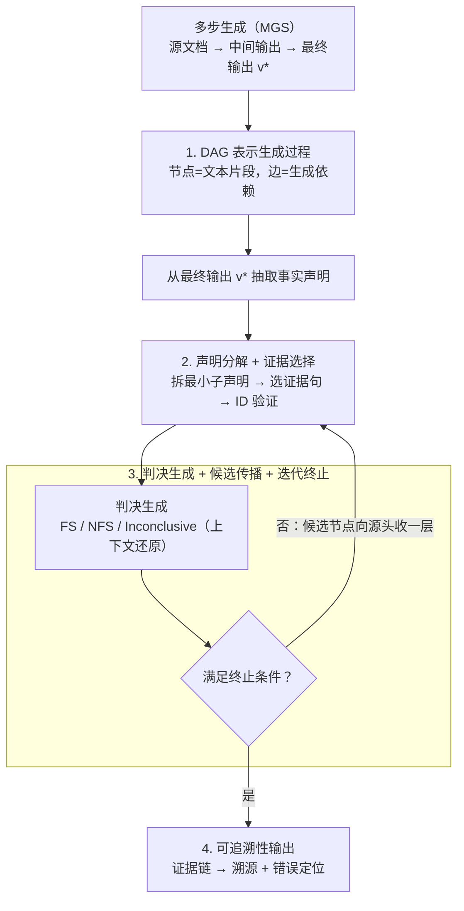

# VeriTrail: Closed-Domain Hallucination Detection with Traceability

**会议**: ICLR2026  
**arXiv**: [2505.21786](https://arxiv.org/abs/2505.21786)  
**代码**: [数据集](https://aka.ms/veritrail-datasets)  
**领域**: 幻觉检测  
**关键词**: hallucination detection, faithfulness evaluation, traceability, multi-generative-step, DAG

## 一句话总结
提出 VeriTrail——首个为多步生成过程（MGS）提供可追溯性的闭域幻觉检测方法，建模生成过程为 DAG 并沿路径逐层验证，同时构建了首批包含所有中间输出和人工标注的 MGS 数据集。

## 研究背景与动机
- LLM 即使被要求遵循源材料，仍常生成未支持的内容——"闭域幻觉"
- 生成过程分为两类：
    - **单步生成（SGS）**：如标准 RAG，一次 LLM 调用产出最终结果
    - **多步生成（MGS）**：如分层摘要、GraphRAG，中间输出作为后续输入
- MGS 更易产生幻觉：每一步都可能引入并传播错误
- **核心论点**：对 MGS 而言，仅检测最终输出中的幻觉是不够的，还需要：
    - **溯源（Provenance）**：理解输出如何从源材料推导
    - **错误定位（Error Localization）**：定位幻觉在哪一步引入
- 现有方法只评估输出与源材料的关系，不利用中间输出，无法提供可追溯性

## 核心贡献
1. 统一的生成过程概念框架（DAG 表示）
2. VeriTrail：首个为 MGS 和 SGS 提供可追溯性的闭域幻觉检测方法
3. FABLES+ 和 DiverseSumm+：首批包含所有中间输出和人工标注的 MGS 数据集

## 方法详解

### 整体框架

VeriTrail 想解决一个"既要又要"的问题：既要判断多步生成（MGS）的最终输出有没有闭域幻觉，又要说清这个结论怎么来的——支持它的证据沿哪条路径回到源材料，幻觉又是在哪一步引入的。它的做法是先把整条生成链建模成一张有向无环图（DAG），源文档、各级中间输出、最终输出都是图上的节点；再从最终输出里抽出一个个事实声明，**逐个声明、自顶向下地反向验证**：从最终输出的上游节点开始选证据、出判决，然后顺着边把候选往源头收一层，如此迭代，直到收敛到"有证据支撑的根节点"或触发终止条件。整个过程累积下来的证据链，正好既是溯源路径，又是错误定位的依据。

### 关键设计

**1. DAG 表示生成过程：给"可追溯"一个统一的数学载体**

闭域幻觉检测过去只盯着"输出 vs 源材料"两端，中间过程是黑盒，自然谈不上溯源和定位。VeriTrail 把整条生成链建模成有向无环图 $G = (V, E)$：节点 $v \in V$ 是文本片段（源文档 / 中间输出 / 最终输出），有向边 $(u, v) \in E$ 表示 $u$ 被用作生成 $v$ 的输入；其中根节点集合 $V_0$ 是源文档（无入边），终端节点 $v^*$ 是最终输出（无出边），再用阶段函数 $\text{stage}: V \to \mathbb{N}$ 标出每个节点在生成过程中的层位。这个表示的好处是把单步生成（SGS，如标准 RAG）和多步生成（MGS，如分层摘要、GraphRAG）统一起来——SGS 不过是只有一层中间节点的退化 DAG，同一套验证流程通吃；后面所有的"选证据、出判决、往源头收"都是在这张图上做的。

**2. 声明分解 + 证据选择：把验证下沉到可核查的最小单元，且证据本身不被幻觉**

直接验证一整句复合声明容易"半对半错"说不清，所以先用 Claimify 的 Decomposition 模块把复合声明拆成独立可验证的子声明，例如"公司 X 在 2020 年收购了两家初创企业作为医疗扩张的一部分"会拆成 (1) X 在 2020 年收购两家初创企业、(2) 收购是医疗扩张的一部分；分解递归进行、最多 20 次以避免死循环（子声明只作上下文、本身不单独判）。拆完做证据选择：从当前要验证的节点集（首轮是终端节点的源节点 $\text{src}(v^*)$）出发，用 NLTK 把候选文本切句并给每句一个唯一 ID，让 LLM 返回支持或反对该声明及其子声明的句子 ID；文本超出上下文窗口就切成多个并行 prompt 分别选。关键的一步是 **ID 验证**——凡是模型返回的、和真实句子对不上的 ID 一律丢弃，由此保证"被当作证据的句子"必然真实存在于源材料里，证据这一环不会反被幻觉污染。

**3. 判决生成 + 候选传播 + 迭代终止：逐层往源头收，用 $q$ 控制保守程度**

证据选好后先出判决：若一句都没被选中，直接判 "Not Fully Supported"；否则让 LLM 基于证据在三类里选一个——**Fully Supported**（源文本强烈暗示整个声明）、**Not Fully Supported**（至少一部分未被支持）、**Inconclusive**（源文本模糊或矛盾）。这里有个易踩的坑：孤立句子脱离上下文会产生歧义，所以判决时不直接把选中的零散句子喂给模型，而是根节点用完整内容、非根节点用证据选择步骤生成的摘要，让模型在**还原语境**的前提下判断。一轮判决完不等于结束，还要顺着 DAG 往上游推进，下一轮验证哪些候选节点取决于本轮最新判决：

| 最新判决 | 候选节点选择策略 |
|----------|---------------|
| Fully Supported / Inconclusive | 本轮有证据节点的源节点 |
| Not Fully Supported | 本轮所有验证节点的源节点（更广泛，防漏检） |

判 NFS 时之所以把候选放宽到"所有验证节点的源节点"，是因为一旦怀疑有问题就要把搜索面铺开，避免证据选择本身漏掉真正的源头、把错误一直传下去。迭代在满足任一条件时终止：①候选节点只剩已验证、有证据的根节点 → 采用最新判决；②没有候选节点（没追到根节点，或根节点没证据）→ Not Fully Supported；③连续 $q$ 次 Not Fully Supported → Not Fully Supported。参数 $q$ 是个旋钮：$q$ 越大，越要反复确认才肯下 NFS，验证更彻底但判决也更保守。

**4. 可追溯性输出：把溯源和错误定位从迭代过程里读出来**

对每个声明，VeriTrail 不只给一个标签，而是返回最终判决 + LLM 推理、所有临时判决、以及一条**证据链**（每轮选中的句子带节点 ID + 各轮证据摘要）。这条链直接支撑两件下游事情：**溯源（Provenance）**——对 Fully Supported 的声明，证据链就记录了从中间节点一路回到根节点的支撑路径；**错误定位（Error Localization）**——找到最后一次判 Fully Supported 的迭代 $n$，该迭代中有证据的非根节点所在的阶段即为幻觉引入的阶段，即 $\{\text{stage}(v) \mid v \in V_e(n),\, v \notin V_0\}$（根节点是 ground truth，不算错误源）。换句话说，"最后一次还说得通"的那层之后，错误就是在它之上的那步被引入并往下传播的；若一个声明从头到尾都没拿到过 Fully Supported，错误阶段则要么落在最终输出本身，要么无法确定。

### 一个完整示例

以分层摘要为例走一遍。一本书被切成多个 chunk，先各自摘要得到一级摘要，再合并成二级摘要，最后汇成全书摘要 $v^*$；从 $v^*$ 抽出声明"主角在结局放弃了继承权"。验证从 $v^*$ 的上游（几个二级摘要节点）开始：证据选择在这些节点里挑出相关句子、ID 校验后交给判决，假设判 Fully Supported，于是候选收缩到这些有证据节点的源节点（对应的一级摘要）。下一轮在一级摘要里继续选证据、出判决；只要还是 Fully Supported，就再往下收到原始 chunk（根节点）。当候选只剩"有证据的根节点"且仍判 Fully Supported 时终止——证据链于是串成 `根 chunk → 一级摘要 → 二级摘要 → 最终输出` 一条完整路径，这就是溯源。反过来，如果在二级摘要这层判了 Fully Supported、但收到一级摘要后变成 Not Fully Supported 并连续 $q$ 次未翻盘而终止，那"最后一次 Fully Supported"发生在二级摘要这一阶段，错误定位就指向：幻觉是在从一级摘要合并到二级摘要这一步被引入的。

## 数据集构建

### FABLES+（分层摘要）
- 基于 FABLES 书籍摘要数据集
- 重新生成 22 本书的分层摘要（平均 118K tokens），保留所有中间输出
- 提取 734 个声明，48% 直接沿用原标注，其余人工标注

### DiverseSumm+（GraphRAG）
- 基于 DiverseSumm 新闻数据集
- 148 个故事，1,479 篇文章，累计 1.19M tokens
- 采样 20 个问题，用 GraphRAG 生成答案
- 提取 560 个声明，4 位 Upwork 标注员 + 1 位作者标注
- 87% 声明可从关联文章判断，13% 需查阅额外文章

## 实验结果

### 基线方法

| 类别 | 方法 | 处理长文本策略 |
|------|------|---------------|
| NLI | INFUSE | 双向蕴含排序 |
| NLI | AlignScore | 350 token 分块 |
| NLI | Bespoke-MiniCheck-7B | 32K token 分块 |
| RAG | Top-k 检索 | 嵌入检索 + 判决 |
| 直接验证 | Gemini 1.5 Pro / GPT-4.1 Mini | 长上下文 LM |

### 硬预测结果（Macro F1 / Balanced Accuracy）

| 方法 | FABLES+ F1 | FABLES+ Bal.Acc | DiverseSumm+ F1 | DiverseSumm+ Bal.Acc |
|------|-----------|----------------|-----------------|---------------------|
| **VeriTrail (q=3)** | **84.5** | **83.6** | **79.5** | 76.3 |
| **VeriTrail (q=1)** | 74.0 | **84.6** | 76.6 | **83.0** |
| RAG (k=15) | 69.6 | 76.5 | 75.1 | 74.0 |
| Bespoke-MiniCheck-7B | 62.2 | 69.0 | 72.1 | 69.4 |
| Gemini 1.5 Pro | 61.1 | 60.8 | 49.8 | 57.6 |
| GPT-4.1 Mini | 60.7 | 58.2 | 62.9 | 61.5 |
| AlignScore | 59.6 | 67.5 | 60.4 | 62.7 |
| INFUSE | 40.5 | 59.5 | 20.0 | 50.1 |

**关键发现**：
- VeriTrail 在两个数据集上均优于所有基线（q=3 在 F1 上最优，q=1 在 Balanced Accuracy 上最优）
- 直接长上下文验证（Gemini 1.5 Pro）并不理想，可能因超长文档中信息检索困难
- AlignScore 和 INFUSE 等经典 NLI 方法在长文档上性能明显不足

### q 参数的权衡
- q=1（一次 NFS 即终止）：高 NFS 召回（89.8%），低 NFS 精度（55.1%）
- q=3（三次 NFS 才终止）：更均衡（NFS 精度 84.5%，召回 55.9%）
- q 越大，验证越彻底但 NFS 判决更保守

## 优势与局限

### 优势
- 首个提供可追溯性（溯源 + 错误定位）的幻觉检测方法
- DAG 框架统一了 SGS 和 MGS 过程的表示
- 句子级证据选择 + ID 验证保证证据不被幻觉
- 在超长文档（>100K tokens）上优于强基线
- 成本效益好（Appendix D 分析）

### 局限
- 依赖 LLM 执行证据选择和判决生成（受 LLM 能力限制）
- 错误定位在某些场景下无法确定具体阶段
- 数据集规模有限（734 + 560 声明）
- 仅评估了 gpt-4o 模型

## 个人评价与思考

### 创新性 ⭐⭐⭐⭐⭐
- "检测 + 追溯"的范式升级非常有价值
- DAG 建模生成过程是对幻觉检测的根本性重新思考
- 迭代证据选择 + 候选节点传播机制设计精妙

### 实用价值 ⭐⭐⭐⭐⭐
- 直接面向 MGS 流水线（GraphRAG、分层摘要等）的实际需求
- 错误定位对系统调试和改进极有价值
- 句子级证据链显著降低人工审核成本

### 数据集贡献 ⭐⭐⭐⭐
- FABLES+ 和 DiverseSumm+ 填补了 MGS 幻觉检测数据的空白
- 包含完整中间输出是关键创新
- 但规模较小

### 实验设计 ⭐⭐⭐⭐
- 基线覆盖全面（NLI、RAG、长上下文 LM）
- 硬预测+软预测双评估
- 消融分析和错误案例分析（附录）增加可信度

### 综合评分 ⭐⭐⭐⭐⭐
一篇开创性的工作，将闭域幻觉检测从"判断对错"提升到"追溯来源和定位错误"。DAG 框架优雅地统一了各类生成过程，VeriTrail 的迭代验证机制在超长文档上展现出强大性能。对于日益复杂的 MGS 管道（如 GraphRAG），这种可追溯的幻觉检测方法具有极强的实用价值。

<!-- RELATED:START -->

## 相关论文

- [\[ICLR 2026\] Beyond In-Domain Detection: SpikeScore for Cross-Domain Hallucination Detection](beyond_in-domain_detection_spikescore_for_cross-domain_hallucination_detection.md)
- [\[ICLR 2026\] Neural Message-Passing on Attention Graphs for Hallucination Detection](neural_message-passing_on_attention_graphs_for_hallucination_detection.md)
- [\[ICLR 2026\] Enhancing Hallucination Detection through Noise Injection](enhancing_hallucination_detection_through_noise_injection.md)
- [\[ICLR 2026\] Learning to Reason for Hallucination Span Detection](learning_to_reason_for_hallucination_span_detection.md)
- [\[ACL 2025\] Learning Auxiliary Tasks Improves Reference-Free Hallucination Detection in Open-Domain Long-Form Generation](../../ACL2025/hallucination/learning_auxiliary_tasks_improves_reference-free_hallucination_detection_in_open.md)

<!-- RELATED:END -->
