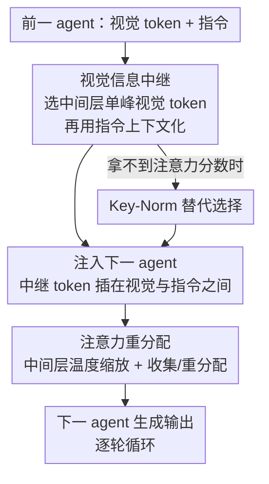

# Visual Multi-Agent System: Mitigating Hallucination Snowballing via Visual Flow

**会议**: ICLR 2026  
**OpenReview**: [https://openreview.net/forum?id=Ii4HBlERix](https://openreview.net/forum?id=Ii4HBlERix)  
**代码**: https://github.com/YU-deep/ViF.git  
**领域**: 多模态VLM / Agent / 幻觉缓解  
**关键词**: 多智能体系统, 视觉幻觉, 幻觉滚雪球, 视觉中继 token, 注意力重分配

## 一句话总结
本文发现 VLM 多智能体系统（MAS）会出现"幻觉滚雪球"——某个 agent 的视觉误判被后续 agent 通过纯文本流不断放大；作者通过逐轮/逐层/逐 token 的注意力分析定位到"中间层单峰视觉 token"是承载视觉证据的关键，进而提出 ViF：用这批视觉中继 token 在 agent 之间额外搭一条"视觉流"，并配合注意力重分配，模型无关地缓解滚雪球，在 8 个 benchmark、4 种 MAS 结构、10 个底座上稳定提升 2.4–3.8%。

## 研究背景与动机
**领域现状**：用 VLM 驱动的多智能体系统（MAS）正成为解决复杂多模态任务的主流方案——多个 agent 多轮通信协作，做协同推理、多轮指令跟随、复杂多模态理解，能啃下单个模型搞不定的问题。

**现有痛点**：MAS 在协作时暴露出一个全新的可靠性故障——**多智能体视觉幻觉滚雪球**。某个 agent 对图像的误读或对文本消息的过度偏好，会随着信息在后续 agent 间流动而被层层放大，最终产出灾难性的、关于视觉内容的传播性幻觉。这是单 agent 研究无法覆盖的新问题。

**核心矛盾**：滚雪球源于两个相互作用的机制：（1）**内在幻觉**——单个 VLM agent 自己就会对视觉内容产生错误描述；（2）**幻觉传播**——agent 之间靠生成的**文本流**来转述视觉信息，而文本会压缩并选择性强调视觉特征，使得幸存的幻觉断言被下游 agent 当作权威证据照单全收。正因为后续 agent 把前文文本当成强证据，早期幻觉被放大而非被纠正。所以仅仅压低单 agent 幻觉（既有工作的做法）根本解决不了传播问题。

**切入角度**：作者先做了一组诊断性注意力分析，从逐轮、逐层、逐 token 三个维度拆解：随 agent 轮次增加，分给视觉 token 的注意力持续下降（平均从 0.165 → 第 10 轮 0.099 → 第 20 轮 0.063，共降 62%），其中**中间层降幅最大（-60%）**，远超首层（-21%）和末层（-30%）；同时注意力被转移到指令 token 上。更关键的是，**在中间层呈"单峰"形态的视觉 token**——一小撮但至关重要——最能保留视觉专属信息（丢掉它们时性能掉得最狠），但其占比随轮次锐减（第 1 轮 1.22% → 第 20 轮 0.10%），正好与视觉注意力峰的消失同步。

**核心 idea**：既然文本流转述会丢失视觉证据，那就**额外开一条视觉流**——直接把那批中间层单峰"视觉中继 token"在 agent 之间传递，并通过注意力重分配放大这种理想模式，让视觉证据顶住"视觉→文本"的信息损耗，不被文本先验完全挤掉。

## 方法详解

### 整体框架
ViF 是一个轻量、模型无关的缓解范式，套在任意 VLM-based MAS 上：原本 agent 之间只靠文本流转述视觉内容，ViF 在此之上额外搭一条**视觉流**。在每一轮，它先从前一 agent 的视觉 token 里按中间层注意力趋势挑出"单峰"子集作为视觉中继 token，用当前指令把它们语义化，再注入下一个 agent；同时在中间层和深层做注意力重分配，把注意力从无效视觉 token / 指令 token 收过来、补给有效视觉 token，从而把"视觉注意力峰"延续到更深的 agent 轮次。对于用了 Flash-Attention、拿不到注意力分数的新模型，作者还提供了基于 Key-Norm 的替代选择方案。

### 关键设计

**1. 视觉信息中继：用单峰视觉 token 在 agent 间架一条视觉流**

这一设计直击"文本流转述导致视觉证据丢失"的痛点。作者不再只靠文本传递视觉信息，而是把视觉 token 集合 $V=\{v_1,\dots,v_m\}$ 按中间层注意力分配的趋势逐 token 分解，挑出呈单峰形态的那批作为初始视觉中继 token $R=\{r_1,\dots,r_n\}\subset V$，其中 $n\ll m$——前面的分析证明这批 token 语义高度相关、几乎不含无关 token，是最能承载视觉证据的"精华"。但仅由视觉编码器切出来的原始中继 token 并没有特定语义，于是用一个轻量 Transformer block $f(\cdot)$ 把它们和指令 token $I$ 拼接后上下文化：

$$\hat{R} = f(R \oplus I)[:n]$$

这里 $\oplus$ 表示拼接，取前 $n$ 个分量以保持中继 token 的原始长度。为保留空间信息，对 $\hat{R}$ 沿用与前一 agent 相同的位置编码策略；随后把中继 token 插在下一 agent 的原始视觉 token 与指令 token 之间，连同其他 token 一起喂给 LLM。这样下游 agent 拿到的是"原生、无偏"的视觉语义载体，而不是被前一 agent 压缩转述过的文本，从源头上抵抗了视觉→文本的信息损耗。

**2. 注意力重分配：把理想的视觉注意力峰延续到更深轮次**

光传中继 token 还不够——分析显示深层 agent 会系统性地把注意力从视觉挪向指令，视觉峰逐轮消失。于是作者主动重塑注意力分布。首先在中间层对 Softmax 加温度缩放，放大视觉注意力的动态趋势（无论上升还是下降），促使单峰形态浮现：

$$A = \mathrm{Softmax}_\tau(S) = \frac{\exp(s/\tau)}{\sum_{i=1}^{m}\exp(s_i/\tau)}$$

其中 $\tau$ 是温度参数，$S$、$s$ 为注意力分数矩阵与分数。其次在中间层用一个收集掩码 $M_c$ 把**无效视觉 token 集** $V_\oslash$ 和指令 token 上的注意力收集起来（系数 $\alpha$），再用重分配掩码 $M_r$ 补给有效视觉 token 集 $V_\circ=V-V_\oslash$，整个过程保持总注意力恒为 1。深层则方向相反——把注意力从视觉 token 重分配给指令 token（与分析中"深层视觉 token 不重要"一致），相应修改两个掩码与系数。这样既激活了视觉中继 token，又把"中间层视觉、深层文本"的理想分工固化下来。

**3. Key-Norm 替代方案：让 Flash-Attention 模型也能选 token**

单峰 token 的选择依赖注意力分数，但许多新模型用了 Flash-Attention 2/3，注意力分数根本拿不到，这会让前两个设计在这些模型上失效。作者据此设计了一个基于 **Key-Norm**（key 矩阵的 L2 范数）的替代方案来近似原本基于注意力分数的选择策略，从而把 ViF 的"模型无关"承诺真正落到这些工程现实上——表格里带 $*$ 号的结果（LLaVA-OV、Qwen2-VL、Qwen2.5-VL 等）正是用 Key-Norm 跑出来的，效果与注意力分数版本相当。

### 损失函数 / 训练策略
ViF 的核心可学习部件是上下文化用的轻量 Transformer block $f(\cdot)$；注意力重分配涉及三个关键超参——单峰显著度阈值 $\omega$、温度 $\tau$、重分配系数 $\alpha$，作者通过敏感性分析确定合理取值。方法整体是即插即用的缓解模块，不改动底座 VLM 的训练。

## 实验关键数据

### 主实验
在 3 个综合 benchmark（MME / MMBench / MM-Vet）+ 5 个幻觉 benchmark（CHAIR / POPE / AMBER / MMHal-Bench / HallBench）上，覆盖 4 种 MAS 结构（linear / layered / random / circular）与多个底座，ViF 一律带来稳定提升。

| MAS 结构 | 底座 | POPE↑ | AMBER↑ | HallBench↑ | 平均提升 |
|--------|------|-------|--------|-----------|---------|
| Linear | LLaVA-NeXT-7B | 88.6 ↑1.8 | 89.3 ↑2.3 | 55.3 ↑2.4 | ↑3.2% |
| Circular | LLaVA-NeXT-7B | 93.3 ↑2.3 | 92.7 ↑3.3 | 55.7 ↑2.6 | ↑3.8% |
| Circular | Qwen2.5-VL-7B* | 93.4 ↑2.1 | 95.9 ↑2.4 | 57.3 ↑2.4 | ↑2.6% |
| Circular | LLaVA-NeXT-34B | 93.6 ↑2.2 | 96.3 ↑2.2 | 57.8 ↑2.8 | ↑4.4% |
| Circular | Qwen2.5-VL-32B* | 94.0 ↑1.5 | 96.7 ↑2.7 | 60.1 ↑3.2 | ↑4.1% |

整体上六个 7B 底座平均提升 2.4–3.8%；交互最密集、幻觉最集中的 circular 结构提升最大；30B+ 的大模型提升均超 4%（作者认为大模型基础能力强，ViF 解锁了它们在多 agent 场景下的潜力）。在多图 / 视频的 4 个增强视觉 benchmark（MMIU / MuirBench / MVBench / Video-MME）上也有 2.0–4.9% 提升。

为量化滚雪球本身，作者定义了**幻觉滚雪球分数 HS**（同时刻画幻觉水平与传播程度，越低越好）。加上 ViF 后五个幻觉 benchmark 平均 HS 至少降 30%，circular 结构降近 40%（17.0 vs 基线 29.1 的 POPE-HS 等）。

| 方法 (circular, LLaVA-NeXT-7B) | POPE 原指标↑ | POPE-HS↓ | AMBER-HS↓ | 平均 HS 变化 |
|------|-----------|---------|----------|------------|
| Baseline | 91.0 | 29.1 | 31.1 | — |
| MemVR | 90.5 | 31.2 | 34.4 | ↑18.4% |
| VISTA | 91.2 | 27.8 | 28.3 | ↑3.1% |
| FarSight | 91.9 | 22.7 | 26.6 | ↓5.4% |
| TAME | 91.4 | 22.8 | 22.7 | ↓3.7% |
| **ViF (Ours)** | **93.3** | **17.0** | **17.7** | **↓39.8%** |

值得注意的是，五个为单模型幻觉设计的 SOTA 方法（MemVR / VISTA / FarSight / DeCo / TAME）搬到 MAS 后**反而常常不如基线**——因为它们改了解码或注意力，却仍保留文本流转述视觉，放大了"重文本轻视觉"的偏好。ViF 凭借视觉流，把 HS 几乎砍半。

### 消融实验
在 LLaVA-NeXT-7B + circular 上逐项消融（数值为相对完整模型的变化）：

| 配置 | POPE↑ | AMBER↑ | HallBench↑ | 说明 |
|------|-------|--------|-----------|------|
| Ours (Full) | 93.3 | 92.7 | 55.7 | 完整模型 |
| w/o Relay Token (50%) | 92.0 (-1.3) | 91.6 (-1.1) | 54.8 (-0.9) | 去掉一半中继 token |
| w/o Relay Token (75%) | 91.7 (-1.6) | 91.1 (-1.6) | 54.1 (-1.6) | 去掉更多中继 token |
| w/o Reallocation (Middle) | 92.1 (-1.2) | 91.4 (-1.3) | 54.4 (-1.3) | 去掉中间层重分配 |
| w/o Reallocation | 91.9 (-1.4) | 91.5 (-1.2) | 54.2 (-1.5) | 去掉全部重分配 |

视觉中继 token 贡献最显著——即使砍掉一半，结果仍优于多数对比方法，鲁棒性强；注意力重分配进一步优化分布并激活中继 token，中间层重分配比深层重分配更关键。

### 关键发现
- **轮次越多，差距越大**：基线和其他方法在轮次增到 5 时就开始退化，到第 20 轮性能甚至低于单 agent；ViF 随轮次增加仍保持上升趋势。但单 agent（轮次=1）时 ViF 仅略优于基线，甚至不如某些单模型方法——其价值专属于多 agent 协作。
- **滚雪球是注意力退化的外显**：视觉注意力平均降 62%、中间层单峰 token 占比从 1.22% 跌到 0.10%，与幻觉率上升（+224%）高度负相关，验证了"用视觉流补回这批 token"的思路。
- **开销可控**：ViF 额外引入 8.1–13.4% 推理延迟、4.8–11.9% FLOPs；模型越大相对开销越小（34B 上延迟 <4%、计算 <3%）。

## 亮点与洞察
- **把"幻觉滚雪球"归因到一个可观测、可干预的物理量**：作者没有停在现象描述，而是用逐轮/逐层/逐 token 注意力分析锁定"中间层单峰视觉 token 的消失"，让缓解方案有了明确的着力点——这种"先诊断再开方"的范式很值得迁移到其他传播型故障。
- **"视觉流"对"文本流"是一个简洁而正确的对称补充**：既有方法都在文本这条线上修修补补，ViF 直接承认"视觉信息就该用视觉 token 传"，绕开了视觉→文本的有损压缩。
- **Key-Norm 替代方案体现工程诚实**：注意力分数在 Flash-Attention 模型上拿不到，作者没有回避，而是给出可落地的近似，让"模型无关"不只是口号。

## 局限与展望
- 单 agent 场景下 ViF 几乎没有增益、甚至不如专门的单模型幻觉方法，说明它的适用范围严格限定在多 agent 协作。
- HS 是作者自定义指标（具体定义见原文 Eq.7，⚠️ 以原文为准），跨结构横向比较 HS 绝对值时需注意各结构初始幻觉程度不同，不宜直接比大小。
- 中继 token 的选择依赖"中间层单峰"这一经验性结论，主要在 LLaVA / Qwen 系列上验证；对架构差异更大的 VLM 是否仍成立，以及单峰阈值 $\omega$、温度 $\tau$、系数 $\alpha$ 的可迁移性，仍需更多验证。
- 额外 8–13% 的延迟在轮次很多、实时性要求高的部署中可能不可忽略。

## 相关工作与启发
- **vs 单模型幻觉缓解（MemVR / VISTA / FarSight / DeCo / TAME）**：它们针对单个 VLM 的内在幻觉，改解码或注意力，但仍走文本流转述视觉，在 MAS 里无法遏制传播，甚至放大文本偏好导致低于基线；ViF 直击传播环节，HS 平均多降 34.4%。
- **vs 既有"幻觉滚雪球"研究**：以往滚雪球多指单模型内部或纯文本场景；本文首次形式化**多智能体视觉**滚雪球，并把它与"深层 agent 视觉注意力退化"系统性地联系起来。

## 评分
- 新颖性: ⭐⭐⭐⭐⭐ 首次形式化多 agent 视觉幻觉滚雪球，并用"视觉流 + 单峰中继 token"给出对症方案
- 实验充分度: ⭐⭐⭐⭐⭐ 8 benchmark × 4 结构 × 10 底座 + HS 指标 + 消融/敏感性/效率，覆盖面极广
- 写作质量: ⭐⭐⭐⭐ 诊断—假设—方法链条清晰，但记号（多个掩码/集合）偏密集
- 价值: ⭐⭐⭐⭐⭐ 模型无关、即插即用，为 VLM-MAS 的可靠性提供了可直接复用的范式

<!-- RELATED:START -->

## 相关论文

- [\[ICML 2026\] MM-Snowball: Evaluating and Mitigating Hallucination Snowballing in Multimodal Multi-Turn Dialogue](../../ICML2026/hallucination/mm-snowball_evaluating_and_mitigating_hallucination_snowballing_in_multimodal_mu.md)
- [\[ACL 2026\] Dialectic-Med: Mitigating Diagnostic Hallucinations via Counterfactual Adversarial Multi-Agent Debate](../../ACL2026/hallucination/dialectic-med_mitigating_diagnostic_hallucinations_via_counterfactual_adversaria.md)
- [\[ICML 2026\] Learning from Fine-Grained Visual Discrepancies: Mitigating Multimodal Hallucinations via In-Context Visual Contrastive Optimization](../../ICML2026/hallucination/learning_from_fine-grained_visual_discrepancies_mitigating_multimodal_hallucinat.md)
- [\[ICML 2026\] Finding the Correct Visual Evidence Without Forgetting: Mitigating Hallucination in LVLMs via Inter-Layer Visual Attention Discrepancy](../../ICML2026/hallucination/finding_the_correct_visual_evidence_without_forgetting_mitigating_hallucination_.md)
- [\[ICLR 2026\] Grounding or Guessing? Visual Signals for Detecting Hallucinations in Sign Language Translation](grounding_or_guessing_visual_signals_for_detecting_hallucinations_in_sign_langua.md)

<!-- RELATED:END -->
