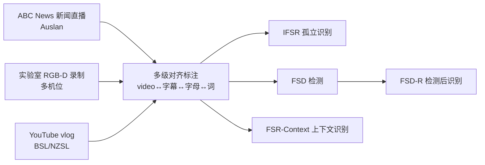

# BANZ-FS: BANZSL Fingerspelling Dataset

**会议**: ICLR 2026  
**OpenReview**: [https://openreview.net/forum?id=GMR9BUsPbq](https://openreview.net/forum?id=GMR9BUsPbq)  
**代码/数据**: [BANZ-FS（CC BY-NC-SA 4.0）](https://openreview.net/forum?id=GMR9BUsPbq)  
**领域**: 手语理解 / 数据集与基准  
**关键词**: 指拼识别, BANZSL, 双手指拼, 手语翻译, 时序检测  

## 一句话总结
本文构建了首个面向 BANZSL（英国/澳大利亚/新西兰手语）**双手指拼**的大规模数据集 BANZ-FS，汇集新闻直播、实验室录制、网络 vlog 三类来源、35K+ 条多级对齐的指拼实例，并在检测、孤立识别、上下文识别三大任务上系统地 benchmark 了 SOTA 模型。

## 研究背景与动机
**领域现状**：指拼（fingerspelling）是手语中用手势逐字母拼写人名、地名、专业术语等"词典外"词汇的关键手段，对手语翻译（SLT）系统至关重要。但现有指拼数据集（ChicagoFSWild、FSBoard、Fleurs-ASL-FS 等）几乎全部聚焦于**单手系统的美国手语（ASL）**。

**现有痛点**：BANZSL 家族（BSL/Auslan/NZSL，共享同一套双手字母表）的**双手指拼**系统被严重忽视——已有的 Auslan-Daily、BOBSL-FS 指拼实例数量很少，且大多缺乏 segment 级时序标注，难以支撑检测任务；现有数据也很少捕捉真实场景中的拼写错误、缩写、首字母缩略、自我纠正等自然现象。

**核心矛盾**：双手指拼天然带来**自遮挡、字母内高方差、字母间快速过渡**等独特视觉挑战，但学界既没有规模够大、又贴近真实使用的 BANZSL 指拼基准来评测和推进相关模型。

**本文目标**：填补这一空白，建立一个覆盖受控与真实环境、带多级对齐标注、可同时支撑检测/识别/上下文识别的大规模 BANZSL 指拼数据集与配套基准。

**核心 idea**：**[多源采集 + 多级对齐]** 从新闻直播、实验室、网络视频三类异质来源采集，并对每条实例做 video↔字幕、video↔指拼字母、video↔目标词三级对齐，让同一份数据同时服务于检测、识别与上下文识别。

## 方法详解

### 整体框架
BANZ-FS 不是一个模型，而是"数据集 + 任务基准"两部分。数据侧用三类来源（ABC News with Auslan 新闻直播、Kinect/RealSense 多机位实验室录制、YouTube 上的 BSL/NZSL vlog）构成覆盖不同节奏与正式度的语料，再由 Auslan 专家做多级时序对齐标注；任务侧把指拼问题拆成四个递进任务，并各配评测指标。

### 关键设计

**1. 三源异质语料：覆盖从正式播报到日常随性的全谱系**。数据集刻意把三类来源拼在一起来制造真实多样性：新闻直播是专业译员的高正式度、live 同传，速度最快（平均 4.59 字符/秒）；实验室录制提供绿幕 + 三台 Kinect-V2 + 一台 RealSense 的干净受控参考，速度最慢（约 1.3 字符/秒），便于做跨机位鲁棒性研究；网络 vlog 则覆盖在野的随性签署风格与多变环境。三者合计 35,028 个视频片段、116 名签署者、超过 20 万个指拼字符，签署者横跨 Auslan 专家、聋人、手语学习者，从而捕捉不同节奏、流利度与语言能力。

**2. 多级对齐标注协议 + 交叉复核**。每条新闻视频先用 AlphaPose 跟踪场景中所有人，标注员按姿态轨迹的空间位置和连续签署动作选定签署者 ID，再依次完成"校正 video↔字幕对齐 → 标注指拼时序段 → 从字幕回填目标词"。最终每条实例带四类标注：手语片段时序边界、指拼时序边界、指拼词形、英文转写。质量上采用"基于识别的验证"协议——每位标注员随机抽检另一人 5% 的片段，约 95% 批次首轮通过；若超过 10% 明显错误则整批打回、第三人重标。五位专家加五位标注员、约 500 工时完成全部标注。

**3. 显式标注真实指拼语言现象**。区别于以往只标"拼了什么字母"，BANZ-FS 显式分类并标注了自然发生的现象：精确匹配（24%）、词汇缩写（如 equipment→EQ，32%）、首字母缩略（GWS，18%）、拼写错误（Maguire→Maquire，15%）、自我纠正（miimiles→miles，5%）等。同时量化数据的开放集特性——报告了从不出现在训练集的 out-of-training 签署者（OOS）、out-of-training 指拼串（OOFS，813 条）以及只出现一次的 FS singletons，让基准能直接考察对未见用户/未见词的泛化。

**4. 四级递进任务与配套指标**。把指拼建模拆成四个任务：**IFSR**（孤立识别，给定切好的片段转写为字母序列，用基于编辑距离的 Letter Accuracy $1-\frac{\text{EditDistance}(L^*,\hat{L})}{|L^*|}$）；**FSD**（检测，在未裁剪视频中定位指拼时间段，用 AP@IoU$_{0.5}$）；**FSD-R**（检测后识别，预测段只有当下游识别字符准确率 >50% 才算 True Positive，用 AP@Acc$_{0.5}$）；**FSR-Context**（上下文识别，从 SLT 模型的预测译文中抽出指拼跨度并对齐评字符级 Letter Accuracy）。FSD-R 这一"检测必须可识别"的设计，把定位质量与可识别性绑在一起评测。

## 实验关键数据

### 主实验表格（IFSR，Letter Accuracy %，Full 列为合并训练）

| Method | News | Lab | Web | Full |
|---|---|---|---|---|
| Iterative-Att | 45.6 | 72.3 | 51.3 | 58.6 |
| MiCT-RANet | 56.4 | 81.8 | 60.1 | 68.6 |
| TS-FS-Reg | 57.2 | 82.9 | 62.4 | 69.7 |
| FS-PoseNet | 62.5 | 87.3 | 70.1 | 74.7 |
| **HandReader** | **64.4** | 86.7 | **71.8** | **75.4** |

### 检测与检测后识别（FSD / FSD-R，Full 训练）

| Method | FSD AP@IoU$_{0.5}$ (Full) | FSD-R AP@Acc$_{0.5}$ (Full) | Web (FSD) |
|---|---|---|---|
| Bi-LSTM CTC | 42.5 | 26.9 | 27.2 |
| Modified R-C3D | 48.8 | 30.5 | 32.2 |
| TS-FS-Det | 54.1 | 42.5 | 37.4 |
| MT-FS-Det | 62.7 | 45.9 | 41.6 |
| **SL-Seg** | **66.9** | **53.5** | **47.3** |

### 关键发现
- **跨域泛化是最大难点**：几乎所有模型在自己的训练域（尤其受控的 Lab，最高 93.1%）表现好，但跨到 Web 在野数据急剧下滑；多模态（RGB+3D pose）的 HandReader 跨域最稳，Web 上 40.2% 大幅领先。
- **检测好 ≠ 识别对**：FSD 与 FSD-R 之间存在明显落差，很多定位准确的段仍达不到 50% 识别阈值，提示需要"识别感知的检测"或联合优化。
- **上下文识别极难**：gloss-free SLT 模型在 FSR-Context 上 Letter Accuracy 仅 16.4%；字符级 tokenization 的 ByT5 优于子词级 T5，说明指拼这种逐字母内容更吃字符级建模。
- **pose 线索利于检测鲁棒性**：基于帧级 BIO 标注 + pose 的 SL-Seg 在 Web 域检测最强，优于 proposal/regression 类方法。

## 亮点与洞察
- **填补真正的空白**：首个大规模、面向双手 BANZSL 系统的指拼数据集，把长期被 ASL 单手研究主导的领域补上了一块。
- **任务设计有"诚实度"**：FSD-R 把"检测出来还得能被认对"显式纳入指标，比单纯报检测 AP 更贴近真实可用性。
- **真实现象被显式建模**：缩写、缩略、拼错、自我纠正这些以往被当噪声丢掉的现象被分类标注，反而成了研究价值。
- **顺带扩了 Auslan News**：标注过程中把 Auslan-Daily News 子集额外扩到约三倍规模、对齐 40 小时新闻，惠及上下文识别研究。

## 局限与展望
- **数据集论文而非新方法**：本文不提出新模型，benchmark 用的都是已有 SOTA，双手指拼的针对性算法仍待后续工作。
- **跨域与上下文性能很低**：Web 域识别、FSR-Context（16.4%）都还远未可用，说明数据集"难"，也意味着短期落地仍有距离。
- **长尾与开放集挑战**：字符频率长尾、大量 OOFS/singleton，低资源与开放词表识别仍是未解难题。
- **来源不均衡**：新闻（Auslan）样本远多于 BSL/NZSL 的网络数据，BANZSL 三种方言之间的覆盖并不均衡。

## 相关工作与启发
本文延续 ASL 指拼数据集谱系（ChicagoFSWild/+、FSBoard、Fleurs-ASL-FS）与 BANZSL 资源（Auslan-Daily、BOBSL-FS），并在表 1 中系统对比：以往要么单手、要么缺 segment 标注、要么规模不足，而 BANZ-FS 在 SL（BANZSL）、规模（35K）、签署者（116）、可支撑任务（FSR-Context/FSD/IFSR 全覆盖）上形成代差。方法侧借鉴了 pose-based 表示（DWPose）、I3D RGB 表示、Transformer/CTC 时序建模、以及 SL-Seg 的 BIO 帧级检测。**启发**：(1) 双手 + 自遮挡场景下，3D pose 与 RGB 的多模态融合是泛化关键；(2) "检测—识别"两阶段评测应联合而非割裂；(3) 指拼这类逐字母任务，字符级 tokenization（ByT5）比子词更合适。

## 评分
- **新颖性**: ⭐⭐⭐⭐ 首个大规模双手 BANZSL 指拼数据集，填补明确空白，多源 + 多级对齐 + 真实现象标注有独到价值。
- **实验充分度**: ⭐⭐⭐⭐ 四任务 × 多 SOTA × 跨域（News/Lab/Web/Full）的矩阵式 benchmark 相当扎实，且做了开放集/泛化分析。
- **写作质量**: ⭐⭐⭐⭐ 动机清晰、任务定义与指标交代完整、表格信息密度高，作为数据集论文可读性好。
- **价值**: ⭐⭐⭐⭐ 为长期被忽视的双手手语社区提供基础设施，CC BY-NC-SA 公开，能持续驱动 BANZSL 手语技术研究。

<!-- RELATED:START -->

## 相关论文

- [\[ICLR 2026\] BAH Dataset for Ambivalence/Hesitancy Recognition in Videos for Digital Behaviour Analysis](bah_dataset_for_ambivalencehesitancy_recognition_in_videos_for_digital_behaviour.md)
- [\[CVPR 2025\] FSboard: Over 3 Million Characters of ASL Fingerspelling Collected via Smartphones](../../CVPR2025/human_understanding/fsboard_over_3_million_characters_of_asl_fingerspelling_collected_via_smartphone.md)
- [\[CVPR 2026\] OpenFS: Multi-Hand-Capable Fingerspelling Recognition with Implicit Signing-Hand Detection and Frame-Wise Letter-Conditioned Synthesis](../../CVPR2026/human_understanding/openfs_multi-hand-capable_fingerspelling_recognition_with_implicit_signing-hand_.md)
- [\[ICLR 2026\] SpeakerVid-5M: A Large-Scale High-Quality Dataset for Audio-Visual Dyadic Interactive Human Generation](speakervid-5m_a_large-scale_high-quality_dataset_for_audio-visual_dyadic_interac.md)
- [\[CVPR 2026\] GazeShift: Unsupervised Gaze Estimation and Dataset for VR](../../CVPR2026/human_understanding/gazeshift_unsupervised_gaze_estimation_and_dataset_for_vr.md)

<!-- RELATED:END -->
