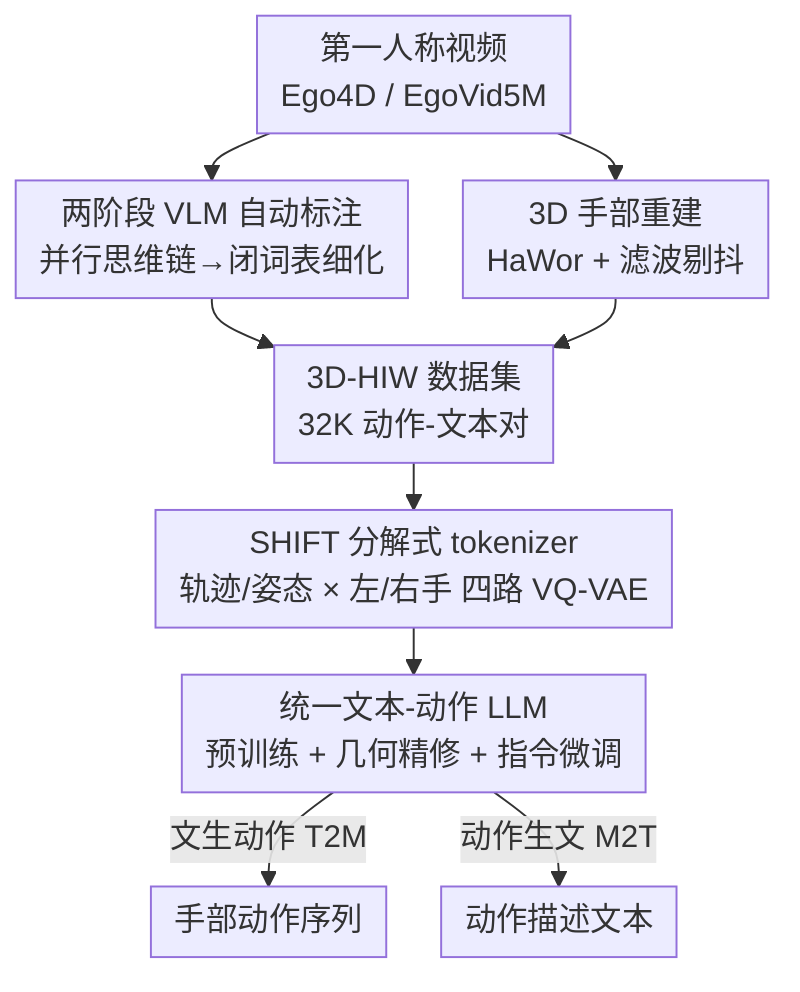

# CLUTCH: Contextualized Language model for Unlocking Text-Conditioned Hand motion modelling in the wild

**会议**: ICLR2026  
**OpenReview**: [https://openreview.net/forum?id=W7YRskO47j](https://openreview.net/forum?id=W7YRskO47j)  
**代码**: 项目页 https://balamuruganthambiraja.github.io/CLUTCH （承诺开源代码、数据、模型）  
**领域**: 人体理解 / 手部动作生成  
**关键词**: 手部动作生成, 文本到动作, VQ-VAE, 运动语言模型, 自动标注

## 一句话总结
CLUTCH 用「VLM 自动标注的 3.2 万条野外手部动作数据（3D-HIW）+ 把轨迹/姿态、左/右手分别离散化的 SHIFT 分解式 VQ-VAE + 在动作空间上加几何重建损失微调 LLM」三件套，第一次把文本↔手部动作建模做到了"野外"场景（弹琴、揉面、写字等），在文生动作与动作生文两项任务上都刷到 SOTA。

## 研究背景与动机
**领域现状**：当下的手部动作建模（hand motion modelling）几乎全部依赖 GRAB、ARCTIC、H2O 这类**摄影棚动捕**数据集——它们质量高，但动作种类极窄、采集昂贵。主流做法是在这些数据上训一个 VQ-VAE 把动作离散成 token，再让 LLM（MotionGPT、HOIGPT）把动作 token 当"外语"来做文本↔动作的互转。

**现有痛点**：这套范式有两个硬伤。其一，动捕数据只有有限几种动作和意图，模型学不到"野外"（in-the-wild）那种自然、多样、一段里夹好几个动作的手部运动；其二，把现成方法（MotionGPT/HOIGPT）直接搬到手部动画上效果很差，作者定位到两个具体原因——**动作 tokenizer 泛化差**（单个 VQ-VAE 同时编码双手会抖、不真实）和**LLM 预测出的动作几何不准**（token 预测对了不等于解码出的动作好）。

**核心矛盾**：训练目标里的交叉熵（CE）只追求"下一个 token 选对"，但 token-level 精度并不保证解码后的动作几何平滑、真实——前人 EgoLM 想用软混合回归损失补救，可软混合鼓励平滑插值、CE 逼迫硬选 token，两者在预训练阶段**互相打架**。

**本文目标**：拆成三个子问题——(1) 如何低成本拿到大规模、带文本标注的野外手部动作数据；(2) 如何设计一个能在高时间压缩下还保真、泛化好的动作 tokenizer；(3) 如何让 LLM 微调既保留语言对齐又保证动作几何正确。

**切入角度**：作者借鉴"用 VLM/LLM 当标注员"的思路，把现成 3D 手部 tracker 套到海量第一人称（egocentric）视频上自动造数据；同时把"动作多模态"这件事在 tokenizer 里显式拆开——轨迹归轨迹、姿态归姿态，左手归左手、右手归右手。

**核心 idea**：用「VLM 自动标注的野外数据 + 部件-模态分解的 VQ-VAE（SHIFT）+ 在动作空间上做几何重建的 LLM 微调阶段」三者合一，把文本条件手部动作建模从摄影棚解放到真实世界。

## 方法详解

### 整体框架
CLUTCH 要解决的是"给一句话生成野外手部动作、或给一段手部动作写描述"，整条管线分三段串行：**先造数据，再把动作离散成 token，最后训一个统一文本-动作 token 空间的 LLM**。

第一段是**数据标注管线**：拿 Ego4D / EgoVid5M 的第一人称视频，一路用 VLM 做两阶段文本标注（开放词表的并行思维链 → 闭合词表细化），另一路用 3D 手部 tracker（HaWor）重建出 MANO 参数的手部运动，再做滤波与异常剔除，最终配成 3.2 万条「动作-文本」对，命名为 3D-HIW 数据集。第二段是 **SHIFT tokenizer**：把每只手的运动按"轨迹 $\tau$ / 姿态 $\theta$"和"左手 / 右手"四路分别用独立 VQ-VAE 编码量化，得到一组细粒度离散 token。第三段是**统一 LLM**：把动作 token 和文本 token 拼成一个共享词表 $V = V_t \cup V_m$，用边界符 `<som>/<eom>` 标出动作段，经过预训练 → 几何精修 → 指令微调三个训练阶段，使同一个模型能做文生动作（T2M）和动作生文（M2T）。

### 关键设计

**1. 两阶段 VLM 自动标注：用并行思维链压住幻觉，造野外文本标注**

野外手部数据缺的不是视频，而是**可靠的文本描述**——VLM 直接给第一人称视频写说明时常幻觉出不存在的物体/动作。作者设计的标注管线分两阶段。阶段一是**开放词表高层标注**：把"复杂推理"这个大 prompt 拆成若干**原子 prompt**（手的角色、动作-物体关系、状态转移、动作意图），让 VLM（VILA）各自独立回答，再用一个 summarization LLM（Claude）把这些原子回答聚合成一句连贯的高层描述——这种**并行思维链（Parallel Chain-of-Thought）**把"一次想清楚所有事"拆成"每次只盯一个侧面"，显著降低幻觉。阶段二是**闭合词表细化**：从 EgoVid5M/Ego4D 旁白里挖出物体、动作、手部角色三类候选词并聚类，约束 VLM 只能从候选里选，把高层描述细化成更忠实的细粒度标注；最后再用一遍 VLM 校验 + LOF（局部离群因子）过滤离群样本。GPT-Score 评测里这套管线拿到 6.9，明显高于 LaVILA(4.9)、EgoHOD(6.1)，也高于"单一大 prompt"的 VILA-Naive(5.5) 与只做阶段一的 VILA-Stage1(6.4)。

**2. 动作重建与数据筛选：把第一人称视频炼成干净的 MANO 序列**

光有文本没有动作不行，这条支线负责把视频变成 3D 手部运动。作者先按高层文本筛出有人、且人在与物交互的片段，按场景活动（如手作、维修）聚类后从每类采样以保证覆盖均衡（避免做饭类压倒一切）；然后跑手部关键点 tracker，只保留**双手在 ≥80% 帧都可见**的序列，用 HaWor 在全局坐标系下重建 3D 手部运动。为压住重建噪声，先后过 Savitzky-Golay 滤波和高斯滤波；最后用"平移/旋转参数上 top-3 序列级加速度的均值"识别并剔除突变抖动的样本（HaWor 失败的信号）。最终 3D-HIW 含 5000 分钟手部姿态、1355 个物体、1045 个动词、共 1200 万帧 MANO 姿态——约为 GRAB/ARCTIC 的 10 倍、Gigahands 的 2 倍。

**3. SHIFT：把手按"部件×模态"拆成四路 VQ-VAE，换来高压缩下的保真与泛化**

这是针对"tokenizer 泛化差"痛点的核心创新。手部运动本质是多模态的，用一个标准 VQ-VAE 同时编码双手会抖、不真实，野外数据更放大这个问题。SHIFT（Structuring Hands Into Fine-grained Tokens）的做法是**把运动沿两个维度解耦**：模态上分"轨迹 $\tau$（9 维，含 6D 全局旋转+平移）"与"姿态 $\theta$（90 维，15 关节各 6D 旋转）"，部件上分左手/右手，于是有专门的轨迹编码器 $E_\tau$ 与姿态编码器 $E_\theta$，分别产出 $z_j, y_j \in \mathbb{R}^{d\times N/8}$ 的嵌入（$j\in\{l,r\}$），各自最近邻量化成 $\hat z_j, \hat y_j$ 后由对应解码器重建。训练用标准 VQ 损失，但 codebook/commitment 损失对四路嵌入分别施加：

$$L_{VQ} = L_{rec}(M, \hat M) + \sum_{x\in X}\big(\|\mathrm{sg}[x]-\hat x\|^2 + \beta\|x-\mathrm{sg}[\hat x]\|^2\big),\quad X=\{z_l,z_r,y_l,y_r\}$$

其中 $\mathrm{sg}$ 是 stop-gradient。这种"部件-模态"四路分解比单 codebook、也比只分左右手的部件分解（PD VQ-VAE）都更准：消融里 SHIFT 的 MPJPE 45.94 远低于标准 VQ-VAE 的 93.26，并且在高时间压缩（$N/8$）下仍保真，使 LLM 只需 4 张 A100 就能训（MotionGPT/HOIGPT 要 64 张 V100 / 32 张 A100）。

**4. 几何精修阶段：用 Gumbel-Softmax 把重建损失搬进动作空间，化解 CE 与回归的冲突**

针对"LLM 预测的动作几何不准"痛点。LLM 把动作 token 按交错流（轨迹/姿态 token 交替排列）和文本一起做自回归预测，目标是标准下一 token 交叉熵 $L_{LM}=-\sum_i \log p_\theta(x_i^t\mid x_{<i}^t, X_s)$。但 token 选对不等于解码出的动作平滑真实；前人想在预训练里加软混合回归损失，却和 CE 互相打架（一个要平滑插值、一个要硬选 token）。作者的解法是在预训练之后单设一个**几何精修阶段**：用 **Gumbel-Softmax 参数化**做离散 token 选择，这样可微地把采样 token 解码回手部运动参数，再**直接在动作空间施加重建损失**，得到联合目标 $L = \alpha L_{LM} + \lambda L_{rec}$；并额外用 $\alpha=0$ 的掩码预测任务进一步逼模型关注重建质量。消融显示，几何精修把全模型 KID 从 0.297（w/o GR）降到 0.216，并优于 EgoLM 的软混合重建损失——它让"指令微调带来的泛化"真正落在几何对齐的动作上。整条 LLM 训练是"预训练 → 几何精修 → 指令微调（沿用 MotionGPT 的多任务 prompt 策略）"三阶段。

### 损失函数 / 训练策略
- **SHIFT**：$L_{VQ}$ = MSE 重建 + 四路 codebook/commitment 损失（式见上）。
- **LLM 预训练**：纯交叉熵的下一 token 预测 + 简单 T2M/M2T 任务，学语言语义与动作时序。
- **几何精修**：$L=\alpha L_{LM}+\lambda L_{rec}$，Gumbel-Softmax 使重建损失可微回传；另加 $\alpha=0$ 掩码预测任务。
- **指令微调**：多任务 prompt 监督，统一支持 T2M、M2T。

## 实验关键数据

### 主实验
数据集为自建 3D-HIW（3.2 万序列，按 80%/10%/10% 划分训练/验证/测试，无泄漏）。所有基线在同一数据上重训以公平对比。

文生动作（T2M）：

| 方法 | RP3 ↑ | MMD ↓ | KID ↓ | Div → | MM ↑ |
|------|------|------|------|------|------|
| Ground Truth | 0.667 | 1.903 | — | 3.964 | — |
| HumanMDM | 0.694 | 1.971 | 0.344 | 3.824 | 1.748 |
| MotionGPT | 0.573 | 2.183 | 0.756 | 3.642 | 2.015 |
| T2M-GPT | 0.683 | 1.976 | 0.431 | 3.854 | 1.892 |
| **CLUTCH** | **0.721** | **1.765** | **0.216** | 3.865 | 1.984 |

动作生文（M2T）：CLUTCH 的 RP3 0.571 / BLEU4 0.181 / BLEU1 0.420 / Rouge-L 0.472，全面超过 MotionGPT（0.407 / 0.132 / 0.345 / 0.439）与 TM2T。

### 消融实验

| 配置 | 关键指标 | 说明 |
|------|---------|------|
| SHIFT（本文） | MPJPE 45.94 / ACCEL 5.395 | 部件-模态四路分解，最优 |
| PD VQ-VAE | MPJPE 95.27 / ACCEL 7.500 | 只分左右手 |
| Std. VQ-VAE | MPJPE 93.26 / ACCEL 7.771 | 单 codebook |
| MotionGPT VQ-VAE | MPJPE 93.49 / ACCEL 8.340 | 基线 tokenizer |
| Full（PT+GR+IFT） | KID 0.216 / T2M RP3 0.72 / M2T RP3 0.57 | 完整训练 |
| w/o GR（PT+IFT） | KID 0.297 / T2M RP3 0.69 / M2T RP3 0.57 | 去掉几何精修 |
| PT only | T2M RP3 0.53 / M2T RP3 0.50 | 仅预训练 |

### 关键发现
- **SHIFT 是 tokenizer 质量的关键**：仅靠"部件-模态分解"就把 MPJPE 从 ~93 砍到 45.94（约腰斩），且高时间压缩下仍稳，直接把训练成本从几十张 GPU 降到 4 张 A100。
- **IFT 扩泛化、GR 保几何**：指令微调把 T2M RP3 从 0.53 提到 0.69，几何精修再把 KID 从 0.297 压到 0.216——作者一句话总结"IFT 让泛化变多，GR 让泛化有意义"。
- **数据与模型双双随规模上涨**：标注序列从 7K→30K 持续提点；语言模型从 T5-Small(50M)→Base(220M)→Large(770M)，T2M RP3 0.545→0.721→0.733、KID 0.732→0.216→0.092，规模红利明显。
- **标注管线两阶段缺一不可**：单大 prompt（VILA-Naive 5.5）和只做阶段一（VILA-Stage1 6.4）都不如完整两阶段（6.9）。

## 亮点与洞察
- **"用 VLM 造数据 + 用几何损失修动作"两手都硬**：一手解决"野外数据从哪来"（自动标注管线把 Ego4D 变成带文本的手部动作库），一手解决"LLM 动作几何为什么不准"（Gumbel-Softmax 把重建损失搬进动作空间），两个瓶颈各打一拳。
- **并行思维链当标注 trick 很可迁移**：把"一次推理所有侧面"拆成若干原子 prompt 再聚合，是个朴素但有效的降幻觉手段，可直接搬到其他"VLM 给视频/图像写细标注"的数据工程里。
- **部件-模态分解的 codebook 设计**：把"多模态难离散"这件事用"按物理语义拆 codebook（轨迹/姿态、左/右手）"来根治，而不是一味堆大 codebook，这个思路对其他结构化序列（全身动作、人脸、手物交互）同样有借鉴价值。
- **最"啊哈"的点**：token-level 精度高 ≠ 动作好，几何精修阶段把"训练信号"从离散 token 空间显式拉回到连续动作空间，恰好对症 CE 与回归冲突的老问题。

## 局限与展望
- **作者承认**：当前只建模手部动作，**回避了手-物交互（HOI）**，因为野外 HOI 重建仍很难；细粒度表现力和对"一段里多个重叠动作"的时间切分都还有提升空间。
- **数据质量受 tracker 上限约束**：3D-HIW 的动作真值来自 HaWor 重建 + 滤波，本质是"伪标签"，抖动剔除靠加速度阈值这类启发式，可能滤掉真实的快速动作或漏掉系统性偏差，未与人工动捕做精度校准。
- **评测多为自建基准**：3D-HIW 是首个野外手部基准，缺少独立第三方数据上的交叉验证，SOTA 结论目前是"在自家数据上重训所有基线"的结果。
- **可改进方向**：把 HOI 纳入统一 token 空间、引入时间分段头处理重叠动作、用更强的 3D tracker 或多视角线索提升真值质量。

## 相关工作与启发
- **vs MotionGPT / HOIGPT**：同样把动作 token 当"外语"喂 LLM，但它们用单/双 codebook 的 tokenizer、训练只追求 token 预测精度；CLUTCH 用部件-模态四路分解的 SHIFT + 几何精修，泛化和几何保真都更好，且训练成本低一个量级。
- **vs EgoLM（软混合回归）**：EgoLM 在预训练里加软混合回归损失改善对齐，但与 CE 冲突、提升有限；CLUTCH 把几何对齐独立成精修阶段、用 Gumbel-Softmax 做可微离散选择，消融里全面优于软混合方案。
- **vs GRAB / ARCTIC / Gigahands 等动捕数据**：这些数据高质量但窄、贵、限于摄影棚；3D-HIW 用 VLM+tracker 自动标注，规模约为前者 10 倍、Gigahands 2 倍，覆盖弹琴/做饭/写字等动捕里罕见的野外动作。

## 评分
- 新颖性: ⭐⭐⭐⭐⭐ 首个"野外手部动作建模"，数据管线、SHIFT tokenizer、几何精修三处都是针对性创新
- 实验充分度: ⭐⭐⭐⭐ T2M/M2T/标注/tokenizer/训练阶段/数据与模型规模都做了消融，但评测主要在自建基准上
- 写作质量: ⭐⭐⭐⭐ 痛点→方法对应清晰，三段管线讲得明白；部分指标定义需查附录
- 价值: ⭐⭐⭐⭐⭐ 打开了野外手部动作生成的大门，数据+模型+代码承诺开源，AR/VR、机器人、人机协作都用得上

<!-- RELATED:START -->

## 相关论文

- [\[ECCV 2024\] HUMOS: Human Motion Model Conditioned on Body Shape](../../ECCV2024/human_understanding/humos_human_motion_model_conditioned_on_body_shape.md)
- [\[CVPR 2026\] MoLingo: Motion-Language Alignment for Text-to-Human Motion Generation](../../CVPR2026/human_understanding/molingo_motion-language_alignment_for_text-to-motion_generation.md)
- [\[ICCV 2025\] GenM3: Generative Pretrained Multi-path Motion Model for Text Conditional Human Motion Generation](../../ICCV2025/human_understanding/genm3_generative_pretrained_multi-path_motion_model_for_text_conditional_human_m.md)
- [\[CVPR 2026\] OpenFS: Multi-Hand-Capable Fingerspelling Recognition with Implicit Signing-Hand Detection and Frame-Wise Letter-Conditioned Synthesis](../../CVPR2026/human_understanding/openfs_multi-hand-capable_fingerspelling_recognition_with_implicit_signing-hand_.md)
- [\[ICLR 2026\] Motion-Aligned Word Embeddings for Text-to-Motion Generation](motion-aligned_word_embeddings_for_text-to-motion_generation.md)

<!-- RELATED:END -->
