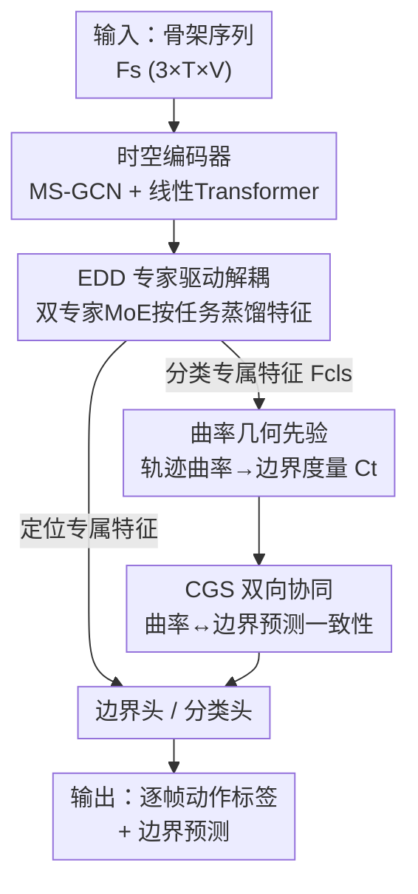

# Curvature-Guided Task Synergy for Skeleton based Temporal Action Segmentation

**会议**: ICLR2026  
**OpenReview**: [https://openreview.net/forum?id=Vgh30npuN3](https://openreview.net/forum?id=Vgh30npuN3)  
**代码**: 待确认  
**领域**: 人体理解 / 骨架动作分割 / 时序动作分割  
**关键词**: 骨架动作分割, 曲率几何先验, 任务协同, 混合专家, 边界定位

## 一句话总结
CurvSeg 针对骨架时序动作分割中"分类要时序不变、边界定位要时序敏感"的内在冲突，提出用**分类特征轨迹的几何曲率**当边界先验——动作段内曲率高、转换处曲率低，由此在分类与定位之间建立双向闭环协同，并配一套双专家 MoE 给两个子任务各自蒸馏特征，作为即插即用模块提升 DeST/LaSA 等基线在四个数据集上的分割精度。

## 研究背景与动机

**领域现状**：时序动作分割（TAS）要给未裁剪视频的每一帧打动作标签，是细粒度人体行为理解的基础任务。基于 RGB/光流的视频方法虽进展很大，但在隐私敏感、外观多变的场景（如医疗）下不可靠。**基于骨架的 TAS（STAS）**只建模纯运动学，天然保护隐私、与视觉混淆因素解耦，成为重要替代路线。

**现有痛点**：STAS 有两个子任务且需求天然冲突——**动作分类**要时序不变、抽象的特征，保证段内识别一致；**边界定位**要时序敏感、细粒度的特征，精确锁定动作切换时刻。主流范式是"任务解耦"：在共享时空编码器（GCN+TCN）上挂两个独立解码头（DeST、LaSA 等）。

**核心矛盾**：作者认为这种解耦是一种"过度简化"。特征层面两个任务确实竞争，但语义层面它们高度互补——知道"正在发生什么动作"能为"边界在哪"提供强先验，反之亦然。把两者隔离会造出"信息孤岛"（information silos），人为切断了本可互利的跨任务协同。近期工作要么解耦时空建模缓解过平滑（DeST），要么引语言先验增强表示（LaSA），都没触及"跨任务协同不足"这个根本问题。

**切入角度**：作者借用表示学习里的一个几何洞察——在学好的特征空间里，连续数据序列（如骨架帧）的轨迹会被空间约束在各自的类簇内部。这种约束**逼着轨迹在动作段内不断转向**以免越出类簇边界，于是段内曲率高；而在动作转换处轨迹"拉直"，形成低曲率的"山谷"。曲率谷恰好天然标记了潜在的转换点。

**核心 idea**：用分类特征的曲率当**参数无关的几何先验**去引导边界检测，再让定位预测反过来监督分类特征空间（惩罚预测动作段内的低曲率），形成"特征学习 ↔ 时序定位"的良性闭环；同时用双专家 MoE 为两个子任务各自提炼专属特征，保证曲率计算所依赖的特征质量。

## 方法详解

### 整体框架

CurvSeg（图 2）在 DeST/LaSA 式骨架编码器之上叠两个核心模块。输入是骨架序列 $F_s \in \mathbb{R}^{D_{in}\times T\times V}$（$D_{in}=3$ 是 3D 坐标，$T$ 帧，$V$ 关节），输出是每帧动作标签。整条流水线是：骨架先过**时空编码器**（多尺度 GCN 做空间建模 + 线性 Transformer 做 $O(n)$ 全局时序建模）拿到帧级时空特征 $F_{ST}$；接着**专家驱动解耦（EDD）**把这份共享特征按任务自适应地拆成分类专属特征 $F_{cls}$ 和定位专属特征；然后**曲率引导协同（CGS）**从 $F_{cls}$ 算出每帧曲率、转成边界变化度量 $C_t$，与边界头预测 $\hat{y}^b_t$ 做双向一致性约束；最后分类头和边界头分别输出帧分类 logits 和边界 logits。两个模块互为依存——EDD 提供高质量特征作地基，CGS 在此地基上把几何潜力发挥到极致。

### 关键设计

**1. EDD 专家驱动解耦：给分类和定位各自蒸馏专属特征**

曲率协同的有效性取决于底层特征质量，但现有做法让两个解码头吃同一份共享编码输出，这是个"妥协表示"，谁都伺候不好。EDD 受多模态感知启发，构建分类专家和定位专家两组时空专家：它们处理同一份编码特征，但各自聚焦任务相关方面。空间上用 SE 风格模块重标定关节——$F_{ST} = F_{ST} + \mathrm{Sigmoid}(\mathrm{MLP}(z_{st}))\, F_{ST}$，$z_{st}$ 是 $F_{ST}$ 沿时间维全局池化的结果，再经解耦时空交互层（DSTI）压成 $F_{ST}\in\mathbb{R}^{D\times T}$。时序上部署一组**高斯专家**当软时序掩码：把 $T$ 帧视频均匀切成 $M$ 段（$M>N$，$N$ 为真实动作段数），每段含 $S=\lfloor T/M\rfloor$ 帧；每段生成 $G$ 个高斯函数 $G^{(m)}_i=\mathcal{N}(\mu^{(m)}_i,(\sigma^{(m)}_i)^2)$，中心和方差由 MLP 算出。路由器按段特征给每个专家打软权重 $\tau^{(m)}=\mathrm{Sigmoid}(\mathrm{MLP}(\mathrm{Avg}(F^{(m)})\cdot W_g))$，再加权求和 $\tilde{F}^{(m)}=\sum_{i=1}^{G}\tau^{(m)}_i G^{(m)}_i F^{(m)}$。分段建模让高斯专家学的是"事件开始"这类**相对**时序模式（在归一化局部上下文里），而非长视频里的绝对位置，大幅简化学习、增强泛化。和"强制共享"（丢失任务专属性）或"完全独立编码器"（丢失互通信号）相比，EDD 用动态路由各取所长。

**2. 曲率几何先验：把分类特征轨迹的曲率当边界探针**

这是全文的几何基石。当分类表示成功分开不同动作类时，会把序列轨迹约束在紧凑的类专属区域里；附录 B 形式化推导出**随机游走的平均曲率与其包围超球半径成反比**。直观后果是：段内的点为留在类边界内必须频繁改变方向 → 高曲率；段间转换的点在类区域之间平移 → 低曲率。具体计算时取轨迹上三个连续点 $F_{cls,t-w},F_{cls,t},F_{cls,t+w}$，用两个相邻差分向量的夹角衡量转向：

$$\theta_t = \arccos \frac{(F_{cls,t}-F_{cls,t-w})\cdot(F_{cls,t+w}-F_{cls,t})}{\|F_{cls,t}-F_{cls,t-w}\|\cdot\|F_{cls,t+w}-F_{cls,t}\|}$$

曲率定义为转向角按差分向量长度归一 $\kappa_t = \theta_t/(\|F_{cls,t}-F_{cls,t-w}\|\cdot\|F_{cls,t+w}-F_{cls,t}\|+\epsilon)$。再对原始曲率序列做滑动平均去噪得 $\bar\kappa$，min-max 归一化保证尺度不变 $\hat\kappa_t=\frac{\bar\kappa_t-\min(\bar\kappa)}{\max(\bar\kappa)-\min(\bar\kappa)}$，最后**取反**得到边界变化度量 $C_t = 1-\hat\kappa_t$——低曲率（谷）对应高边界概率。相比传统距离度量（欧氏/余弦对特征幅度敏感）和梯度显著性（倾向高亮动作中心而非边界），曲率显式刻画特征流形的方向演化，是稳健的参数无关转换代理。

**3. CGS 双向任务协同：曲率与边界预测互相对齐成良性闭环**

光有曲率先验还不够，关键是把它和定位、分类拧成闭环。CGS 在边界预测概率和曲率边界度量之间施加**双向一致性约束**：

$$L_{curv} = -\frac{1}{T}\sum_{t=1}^{T}\big[\mathrm{MSE}(\hat{y}^b_t,\varphi(C_t)) + \mathrm{MSE}(C_t,\varphi(\hat{y}^b_t))\big]$$

其中 $\varphi(\cdot)$ 是梯度停止函数。前向路 $C\!\to\!L$（曲率引导边界）主要靠几何先验细化边界、提升 F1；后向路 $L\!\to\!C$（边界监督分类）通过惩罚预测动作段内的低曲率，逼分类特征组织成更具判别力、更紧凑的簇，从而提升准确率并产出更精准的几何先验。两条路互相强化，形成"边界更准 → 特征更纯 → 先验更好 → 边界更准"的螺旋上升，完整 CGS 的协同增益显著大于两条单路之和。

### 损失函数 / 训练策略

总目标把基线的帧级交叉熵+段级平滑分类损失 $L_c$、二元逻辑回归边界损失 $L_b$ 与曲率协同损失 $L_{curv}$ 加权相加：

$$L = L_c + L_b + \lambda L_{curv}$$

$\lambda$ 平衡协同强度。训练用 Adam、单卡 3090；MCFS 用 batch=1、lr=5e-4、300 epoch；PKU-MMD/LARa 用 batch=4/3、lr=1e-3、300/40 epoch。曲率窗口 $w=10$，$\lambda$ 在 PKU/LARa/MCFS 上分别取 4/2.5/2，每视频切 64 段、每段 2 个高斯专家。

## 实验关键数据

### 主实验

CurvSeg 作为即插即用模块挂到 DeST 和 LaSA 上，在四个标准数据集（MCFS-22/130、PKU-MMD X-sub/X-view、LARa）全面提升，**段级 F1 提升最显著**，同时帧准确率也涨，印证了"边界更准 → 特征更纯 → 分类更好"的互惠闭环。

| 数据集 | 指标 | 基线 LaSA | +Ours | 提升 |
|--------|------|-----------|-------|------|
| PKU-MMD (X-sub) | F1@50 | 63.6 | 65.5 | +1.9 |
| PKU-MMD (X-view) | F1@10 | 72.9 | 74.4 | +1.5 |
| LARa | Acc | 75.3 | 76.6 | +1.3 |
| MCFS-130 | Edit | 79.3 | 79.8 | +0.5 |

（在 MCFS-22/130 上 Ours 全面超 DeST/LaSA，如 MCFS-130 Acc 72.6→73.1，F1@10 79.3→79.8。）

### 消融实验

| 配置 | LARa Acc | F1@50 | 说明 |
|------|---------|-------|------|
| Base (LaSA) | 75.3 | 57.9 | 仅基线 |
| +EDD | 76.2 | 58.4 | 专家解耦提供专属特征地基 |
| +CGS | 76.2 | 58.7 | 曲率协同主攻边界 F1 |
| Full (Ours) | 76.6 | 59.0 | 两者协同，增益超单模块之和 |

引导信号对比（LARa）：曲率 vs 其他边界代理。

| 引导方式 | Acc | F1@50 | 说明 |
|---------|-----|-------|------|
| Base | 75.3 | 57.9 | 无引导 |
| 欧氏距离 | 76.0 | 57.8 | 对幅度敏感 |
| 余弦 | 75.2 | 57.0 | 表现最差 |
| 梯度显著性 | 74.4 | 57.1 | 倾向高亮动作中心 |
| 曲率 (Ours) | 76.2 | 58.7 | 最优、参数无关 |

### 关键发现
- **EDD 与 CGS 互为表里**：全模型增益显著大于两模块单独贡献之和——EDD 提供高质量专属特征作地基，CGS 才能把曲率几何潜力发挥到极致。
- **双向路各司其职**：前向 $C\!\to\!L$ 主升 F1（细化边界），后向 $L\!\to\!C$ 主升 Acc（正则化特征），合起来产生协同增益。
- **曲率可直接当边界检测器**：把取反曲率值直接阈值化当边界预测，在 LARa 上效果已相当可观（F1@10 72.3），强证"低曲率点是时序边界的高效代理"。
- **超参敏感性**：$\lambda=2$、$M=64$、$G=2$、$w=10$ 为最优。$w$ 太小（5）上下文不足，太大（≥40）会把定义边界的尖锐方向变化过平滑掉；$G>2$ 收益递减并可能过拟合。

## 亮点与洞察
- **把"表示几何"翻译成"任务协同信号"**：曲率谷=边界这一洞察，把抽象的流形几何变成可直接监督边界的参数无关先验，是最让人"啊哈"的地方——不引入新参数就架起分类与定位的桥。
- **双向梯度停止设计巧妙**：$L_{curv}$ 两项都用 $\varphi$ 停梯度，让曲率与边界互为"软标签"对齐而非互相拖拽崩塌，是实现稳定良性闭环的关键 trick。
- **高斯专家的"相对时序"思路可迁移**：把长视频切段、让专家学"事件开始"这类相对模式而非绝对位置，这套归一化局部上下文的做法可迁移到任何长序列时序定位任务。
- **即插即用**：CGS+EDD 不改基线主干，能直接增益 DeST/LaSA，复用成本低。

## 局限与展望
- **低动态动作曲率谷浅**：如花滑的 Step Sequence 这类连续演化、无突变的动作，曲率谷比 Jump 等高动态动作浅得多，边界在物理上本就更模糊，几何先验失灵。
- **传感器噪声造伪峰**：骨架估计抖动会在特征轨迹引入高频波动，在非边界区造出虚假曲率峰（假阳性）。
- **依赖分类特征质量**：整套机制建立在"分类表示已学好、类簇紧凑"的前提上，训练早期或类别极不平衡时几何先验可能不可靠。
- **改进方向**：可对低动态段引入自适应窗口或多尺度曲率，对噪声引入鲁棒平滑/置信度加权，缓解上述两类失败模式。

## 相关工作与启发
- **vs DeST**: DeST 解耦时空建模缓解特征过平滑，但仍是独立双头、共享输入；本文在其上补上跨任务协同（CGS）与任务专属特征（EDD），把"解耦"升级为"解耦+协同"。
- **vs LaSA**: LaSA 引语言先验增强表示，方向是语义注入；本文走纯几何路线，不依赖外部模态，且二者正交——CGS 挂到 LaSA 上仍有稳定增益。
- **vs 目标检测的解耦头**: STAS 的分类/定位冲突借鉴自目标检测的解耦思想，但本文指出单纯解耦会造信息孤岛，用曲率几何桥重建协同，是对"解耦范式"的反思与修正。

## 评分
- 新颖性: ⭐⭐⭐⭐⭐ 用表示几何的曲率当边界先验并构建双向闭环，角度新颖且有理论支撑（附录 B 曲率-半径反比推导）
- 实验充分度: ⭐⭐⭐⭐ 四数据集、两基线、CGS/EDD 逐组件消融、引导方式对比、超参分析齐全，但绝对提升幅度多在 1-2 个点
- 写作质量: ⭐⭐⭐⭐ 动机递进清晰、几何直觉讲得透，图 1 的孤岛→协同对比一目了然
- 价值: ⭐⭐⭐⭐ 即插即用、参数无关、隐私友好，对医疗等骨架场景的细粒度动作分割有实用价值

<!-- RELATED:START -->

## 相关论文

- [\[CVPR 2026\] PRISM: Learning a Shared Primitive Space for Transferable Skeleton Action Representation](../../CVPR2026/human_understanding/prism_learning_a_shared_primitive_space_for_transferable_skeleton_action_represe.md)
- [\[ICLR 2026\] From Pixels to Semantics: Unified Facial Action Representation Learning for Micro-Expression Analysis](from_pixels_to_semantics_unified_facial_action_representation_learning_for_micro.md)
- [\[ICLR 2026\] Human-Object Interaction via Automatically Designed VLM-Guided Motion Policy](human-object_interaction_via_automatically_designed_vlm-guided_motion_policy.md)
- [\[ICLR 2026\] From Sparse to Dense: Spatio-Temporal Fusion for Multi-View 3D Human Pose Estimation with DenseWarper](from_sparse_to_dense_spatio-temporal_fusion_for_multi-view_3d_human_pose_estimat.md)
- [\[ICLR 2026\] Pose-RFT: Aligning MLLMs for 3D Pose Generation via Hybrid Action Reinforcement Fine-Tuning](pose-rft_aligning_mllms_for_3d_pose_generation_via_hybrid_action_reinforcement_f.md)

<!-- RELATED:END -->
