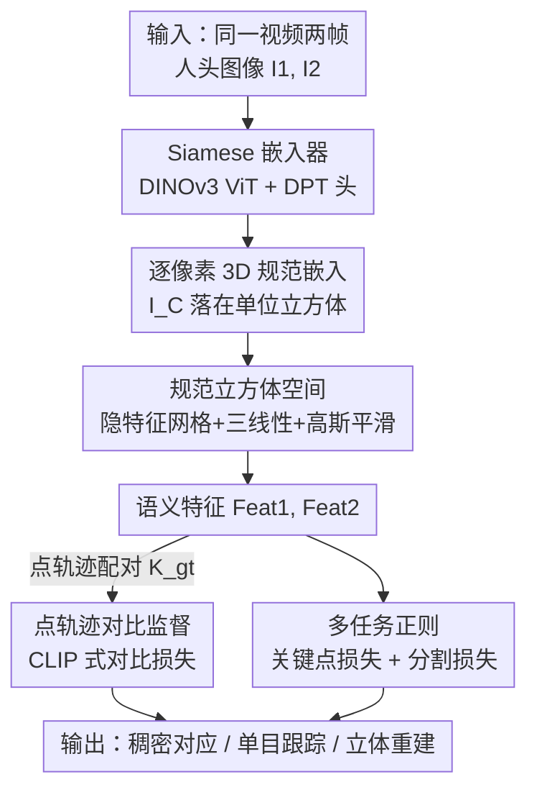

# DenseMarks：通过点轨迹学习人头图像的规范嵌入

**会议**: ICLR2026  
**OpenReview**: [https://openreview.net/forum?id=KOvRxAMBzV](https://openreview.net/forum?id=KOvRxAMBzV)  
**代码**: 待确认（作者称将公开 code 与 checkpoint）  
**领域**: 人体理解 / 稠密对应 / 人头跟踪  
**关键词**: 规范嵌入, 稠密对应, 点轨迹, 对比学习, 人头跟踪

## 一句话总结
DenseMarks 用一个 ViT 嵌入器把人头图像的**每个像素**映射到一个 3D 规范单位立方体里的坐标，并用现成点跟踪器在野外说话人视频上自动产生的配对作监督、配合对比损失训练，得到一个跨身份、跨姿态一致且可解释的稠密对应表示，在几何感知点匹配和单目人头跟踪上达到 SOTA。

## 研究背景与动机
**领域现状**：高质量的人脸/人头建模（AR/VR、影视、游戏）几乎都依赖**人头跟踪**来维持特征点之间的对应。主流做法有两类：一是稀疏人脸关键点检测（68 点之类），跟踪眼角、鼻线、嘴角这些统计上稳定的孤立特征；二是参数化 3D 模型（3DMM/FLAME）拟合，假设人头几何服从一个共享的 PCA 形状基。

**现有痛点**：这两类方法都**只覆盖人脸/皮肤**，把头发、配饰、衣物排除在外。而在真实视频里，极端姿态、表情或遮挡会让单个关键点或整块区域消失，给跟踪引入大误差。换句话说，传统对应是**不完整且不稳定**的——它们只在"统计规律强"的特征上工作得好。

**核心矛盾**：要鲁棒，就得把对应从"检测+对齐少数孤立关键点"换成"在每个像素上稠密地提取并匹配表示"。视觉基础模型（DINOv3 等）确实能给出稠密表示，但这些通用特征往往**匹配的是颜色而非语义**，或者带有几何伪影，直接拿来做对应并不可靠；而想直接学一个像 NOCS 那样的规范坐标，又缺乏人头域的大规模 3D 模型监督。

**本文目标**：学一个人头表示，要同时满足（1）覆盖完整人头（含头发/配饰）的高质量稠密对应、（2）强遮挡下的鲁棒跟踪、（3）一个结构化、可解释、平滑的规范隐空间可供探索与交互。

**切入角度**：作者注意到人头是高度结构相似的视觉类别，且**点跟踪器**（CoTracker3）能在普通说话人视频里免费产生海量逐帧逐点的真实对应——这正好可以替代缺失的 3D ground-truth。

**核心 idea**：把"对应"问题转成"把每个像素嵌入到一个共享 3D 规范立方体"，用点轨迹配对 + 对比损失把语义相同的点在立方体里推到一起，从而把对应退化成立方体里的最近邻搜索。

## 方法详解

### 整体框架
DenseMarks 要解决的是"给一张人头图，输出每个像素在一个共享规范空间里的坐标，使得不同人、不同姿态下语义相同的点落到同一位置"。整体上是一个 **Siamese 训练 pipeline**：从同一段说话人视频里取两帧 $I_1, I_2$，各自过同一个嵌入器 $\psi_\theta$（共享权重）得到逐像素的规范嵌入 $I_C^1, I_C^2 \in \mathbb{R}^{H\times W\times 3}$，每个值是单位立方体里的一个 3D 位置；再用这些位置去查询一个预先离散化的隐特征网格 $E$（三线性插值）拿到语义特征 $\text{Feat}^1, \text{Feat}^2$；最后用点跟踪器给出的配对在这些特征上施加对比损失，并叠加关键点损失、分割损失做正则。推理时只需前馈单张图，得到的嵌入可直接用于点匹配、单目跟踪、立体重建等下游任务。

### 关键设计

**1. 3D 规范立方体空间：用可查询、可解释的隐特征网格替代缺失的 3D 模板**

作者没有用 UV（2D 规范）来表示人头，因为 UV 难以无缝地覆盖头发和配饰、还会有接缝。于是把规范空间设成一个 3D **单位立方体**，每个像素的嵌入就是立方体里的一个连续坐标。光有坐标不够语义，作者在立方体上叠一个分辨率为 $N_d\times N_d\times N_d$ 的隐特征网格，给每个体素挂一个 $D$ 维可学习向量，构成矩阵 $E_{\text{raw}}\in\mathbb{R}^{(N_d)^3\times D}$，存储该位置的高维语义。查询时对实数坐标 $I_C$ 做三线性插值 $\text{Feat}=\text{Trilerp}(E, I_C)$ 取语义特征——这等价于一个注意力操作（坐标当 query/key、网格特征当 value）。为满足"平滑连续"的要求，对 $E_{\text{raw}}$ 施加强度为 $\sigma$ 的 3D 高斯滤波得到 $E=\text{gaussian\_filter\_3D}(E_{\text{raw}},\sigma)$，让邻近点语义平滑变化，避免区域突变交叠。这一设计灵感来自函数图（functional maps，如 CSE）里用 Laplace-Beltrami 平滑的隐特征矩阵，但放进了 3D 立方体里、不依赖参数化网格，从而能覆盖头发等参数模型抓不到的部分。

**2. Siamese 嵌入器：用预训练 VFM 把每个像素抬到规范坐标**

嵌入器 $\psi_\theta: I\to I_C$ 要把一张 RGB 图映成同分辨率的逐像素规范坐标。作者用 **DINOv3** 预训练 ViT 作 backbone（利用其强先验），接一个 DPT 头逐级上采样到 $512\times512$ 的输出分辨率。Siamese 是关键：两帧共享同一套权重独立前馈，保证同一身份不同帧得到的是同一映射，使后续对比损失能在"同一规范空间"里比较。之所以借力 VFM，是因为通用深度特征虽与语义相关却不够几何感知；DenseMarks 在其上再训出几何感知的 3D 规范坐标，把"匹配颜色"纠正为"匹配语义位置"。

**3. 点轨迹对比监督：用现成跟踪器的配对当伪 GT，CLIP 式对比损失把同语义点拉近**

人头域没有稠密 ground-truth 对应，作者改用点跟踪器在说话人视频上自动产生的配对。训练时两帧 $I_1, I_2$ 总取自**同一段视频**（任意远近的两帧），用 CoTracker3 跟踪前景区域里均匀采样的点，得到匹配集 $(K_{gt}^1, K_{gt}^2)$。在这些匹配位置取出语义特征 $\text{Feat}^1, \text{Feat}^2\in\mathbb{R}^{P\times D}$，施加一个类似 CLIP 的对比损失，要求两组特征的成对余弦相似度矩阵逼近单位阵：
$$\mathcal{L}^{\text{contr}}_{\theta,E}(\text{Feat}^1,\text{Feat}^2)=\left\|(\text{norm}(\text{Feat}^1))(\text{norm}(\text{Feat}^2))^T-I\right\|_F$$
其中 norm 是按行归一化。这样正配对（同一被跟踪点）被推近、其余被推远，立方体里语义相同的位置自然聚拢。作者发现点轨迹给出的对应比从预训练扩散模型蒸馏出的语义对应**更可靠**，这是不依赖任何 3D 模型就能训出完整人头对应的关键。

**4. 多任务正则：关键点损失锚定 + 分割损失结构化，让规范空间可解释**

只有对比损失，规范空间会有歧义、不可解释。作者加两条正则。**关键点损失**把 300W 格式的人脸关键点锚到立方体里预定义的固定位置 $L_k\in\mathbb{R}^3$：用现成检测器在 $I_1,I_2$ 上得到关键点，令 $\mathcal{L}^{\text{lmks}}=\sum_{k=1}^{68}|I_C[l_k]-L_k|$，给立方体一个统一的"坐标系"。**分割损失**加一个 conv1×1 的分割头 $S_\xi$，吃语义特征预测人脸解析（face parsing）的区域 logits $S=S_\xi(\text{Feat})$，与现成解析器的 GT 掩码做逐像素交叉熵，使嵌入与图像语义区域对齐、区域不重叠。总损失为
$$\mathcal{L}=\mathcal{L}^{\text{contr}}+\lambda_{\text{lmks}}(\mathcal{L}^{\text{lmks}}(I_C^1)+\mathcal{L}^{\text{lmks}}(I_C^2))+\lambda_{\text{segm}}(\mathcal{L}^{\text{segm}}(S^1)+\mathcal{L}^{\text{segm}}(S^2))$$
取 $\lambda_{\text{lmks}}=50,\ \lambda_{\text{segm}}=1$。消融显示去掉这两条损失后，特征点和区域定位会显著变差。

### 损失函数 / 训练策略
训练数据为 CelebV-HQ 的 35K 野外说话人视频，用 GroundedSAM2（文本 prompt "person"）取前景、均匀采点、CoTracker3 跟踪生成伪 GT；轨迹太少（<80）或分割失败的视频被丢弃，剩 32K，单视频轨迹数不超过 400，留 100 段做评测。关键点用 Mediapipe 取 70 个手选点，分割掩码用 FaRL + face-parsing 精修。嵌入器用 DINOv3 初始化 + DPT 头，$E$ 从 $\mathcal{N}(0,1)$ 初始化。优化用 AdamW，backbone 学习率 $5\times10^{-5}$、DPT 头 $10^{-4}$、隐特征 $E$ 为 $10^{-3}$，余弦退火 140K 步 + 2800 步 warmup；每 batch 8 对图，单张 RTX 3090 Ti 训 1.5 天。

## 实验关键数据

### 主实验
在 Nersemble 数据集上评测：同人配对衡量对应质量（MAE/RMSE/PCK），跨人配对衡量一致性与身份保持（ArcFace/Met3R）。

| 方法 | MAE↓ | RMSE↓ | PCK@0.05↑ | ArcFace↑ | Met3R↓ |
|------|------|-------|-----------|----------|--------|
| Fit3D (768) | 12.75 | 21.83 | 0.57 | 0.236 | 0.558 |
| Hyperfeatures (384) | 8.26 | 13.29 | 0.72 | 0.329 | 0.454 |
| DINOv3 (768) | 7.60 | 12.69 | 0.72 | 0.266 | 0.460 |
| Sapiens (1280) | 14.88 | 24.12 | 0.56 | 0.167 | 0.595 |
| CSE (16) | 11.22 | 17.92 | 0.55 | 0.359 | 0.490 |
| **Ours (3)** | **3.68** | **5.90** | **0.90** | **0.384** | **0.388** |

只用 **3 维**嵌入，DenseMarks 在所有指标上大幅超越用了 768/1280 维的通用与人头专用基线（MAE 从最好的 7.60 降到 3.68，PCK 从 0.72 升到 0.90）。下游单目跟踪上，给现成跟踪器（追踪 FLAME 模板）叠加一条 DenseMarks 纹理的额外光度损失，能显著提升极端姿态下的鲁棒性。

### 消融实验

| 配置 | MAE↓ | RMSE↓ | PCK↑ | ArcFace↑ | Met3R↓ | 说明 |
|------|------|-------|------|----------|--------|------|
| w/o 规范空间 | 6.35 | 10.20 | 0.85 | 0.348 | 0.455 | 去掉立方体只做表示学习 |
| **Ours** | **3.68** | **5.90** | **0.90** | **0.384** | **0.388** | 完整模型 |

规范立方体瓶颈贡献巨大：去掉后 MAE 几乎翻倍（3.68→6.35）。关键点/分割损失的消融（Fig. 8）显示去掉任一条都会让特征点和区域定位明显变差。

### 关键发现
- **维度极小却最准**：3 维规范坐标击败上千维通用特征，说明"正确的几何约束"远比"表示容量"重要。
- **规范空间是核心**：去掉立方体瓶颈掉点最多，它强制了跨姿态、跨身份的一致性。
- **对伪 GT 噪声鲁棒**：随机只保留 10%~80% 轨迹、或给轨迹加最高 ±16px 高斯噪声，方法仍优于所有基线；噪声比轨迹缺失更伤性能，但整体退化温和，说明点跟踪伪 GT 提供了可靠监督。

## 亮点与洞察
- **把"无 3D GT 的稠密对应"转成"点跟踪伪 GT + 对比学习"**：跳过了人头域稀缺的 3D 模型监督，用视频里免费的点轨迹撬动完整人头（含头发）的稠密对应，思路可迁移到其他缺 3D 标注的类别。
- **3D 规范立方体当瓶颈**：用一个可查询、可点选、可解释的连续 3D 空间替代 UV/网格模板，既覆盖完整人头又支持 click-based 检索，消融证明它是性能主力。
- **3 维嵌入即可达 SOTA**：把语义压进 3 维坐标 + 隐特征网格的设计，提示"几何约束 > 表示维度"，对存储/检索效率也友好。

## 局限与展望
- **依赖现成工具链质量**：伪 GT 来自点跟踪器、关键点检测器、分割器，作者也承认 DenseMarks 质量受这些工具鲁棒性约束；虽对噪声鲁棒，但系统性偏差（如某类发型/配饰跟踪失败）可能被继承。
- **训练数据偏采访风格说话人**：CelebV-HQ 多为正面采访视角，极端视角/全侧脸/夸张配饰的覆盖可能不足。
- **只针对人头单一类别**：方法围绕人头结构相似性设计，跨类别推广（如手、动物头）需重新构建规范空间与关键点锚点。
- **改进方向**：引入多视图或时序一致性约束进一步压低 Met3R；用更强的点跟踪器或自训练循环减少伪 GT 噪声。

## 相关工作与启发
- **vs NOCS / 规范坐标学习**：NOCS 用大量 3D 模型监督学规范坐标，本文在人头域无此监督，改用点轨迹 + 对比损失隐式学规范立方体，覆盖参数模型抓不到的头发/配饰。
- **vs CSE（函数图）**：CSE 用隐特征矩阵 + Laplace-Beltrami 平滑做全身对应，但需拟合参数化 3D 模型监督；本文借鉴隐特征网格思路但放进 3D 立方体、用 3D 高斯平滑，且完全不依赖参数模型。
- **vs DINOv3 / Sapiens 等 VFM**：通用 VFM 的稠密特征常匹配颜色或带几何伪影；DenseMarks 在 DINOv3 之上再训出几何感知的规范坐标，把匹配从"颜色"纠正为"语义位置"，3 维即超越上千维基线。
- **vs 3DMM 跟踪器**：3DMM 几何完整但拓扑简单、依赖关键点初始化与非凸光度损失；DenseMarks 提供稠密鲁棒语义对应，作为额外光度项叠加进现成跟踪器即可提升极端姿态鲁棒性，二者互补。

## 评分
- 新颖性: ⭐⭐⭐⭐⭐ 用点轨迹伪 GT + 3D 规范立方体解决无 3D 标注的完整人头稠密对应，角度新颖且自洽
- 实验充分度: ⭐⭐⭐⭐ 主表 + 规范空间消融 + 损失消融 + 对伪 GT 噪声鲁棒性都有，下游跟踪/立体重建有定性验证
- 写作质量: ⭐⭐⭐⭐ 动机层层推导清晰，方法图文对照；部分指标只在附录给出
- 价值: ⭐⭐⭐⭐⭐ 3 维嵌入达 SOTA 且对存储/检索友好，对 AR/VR 人头跟踪有直接应用价值

<!-- RELATED:START -->

## 相关论文

- [\[ICLR 2026\] Disentangled Hierarchical VAE for 3D Human-Human Interaction Generation](disentangled_hierarchical_vae_for_3d_human-human_interaction_generation.md)
- [\[ICLR 2026\] GaitSnippet: Gait Recognition Beyond Unordered Sets and Ordered Sequences](gaitsnippet_gait_recognition_beyond_unordered_sets_and_ordered_sequences.md)
- [\[ICLR 2026\] EasyTune: Efficient Step-Aware Fine-Tuning for Diffusion-Based Motion Generation](easytune_efficient_step-aware_fine-tuning_for_diffusion-based_motion_generation.md)
- [\[ICLR 2026\] Motion-Aligned Word Embeddings for Text-to-Motion Generation](motion-aligned_word_embeddings_for_text-to-motion_generation.md)
- [\[ICLR 2026\] CLUTCH: Contextualized Language model for Unlocking Text-Conditioned Hand motion modelling in the wild](clutch_contextualized_language_model_for_unlocking_text-conditioned_hand_motion_.md)

<!-- RELATED:END -->
