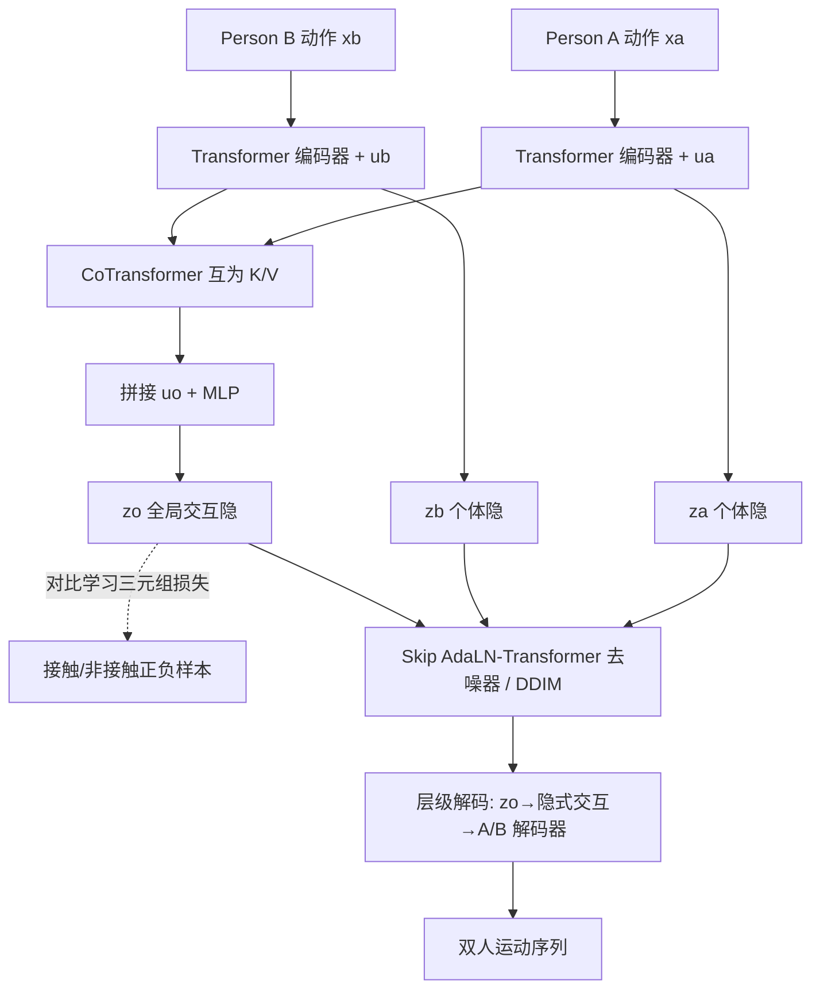

# Disentangled Hierarchical VAE for 3D Human-Human Interaction Generation

**会议**: ICLR 2026  
**OpenReview**: [https://openreview.net/forum?id=53eIDko6N5](https://openreview.net/forum?id=53eIDko6N5)  
**代码**: [https://github.com/ZenGengChin/dhvae-official](https://github.com/ZenGengChin/dhvae-official)  
**领域**: 3D 人体运动生成 / 双人交互生成  
**关键词**: Human-Human Interaction, 解耦层级 VAE, 隐空间扩散, 对比学习, 物理合理性  

## 一句话总结
DHVAE 把双人交互运动显式拆成「A 个人动作 / B 个人动作 / 全局交互上下文」三个解耦隐变量，并在全局隐变量上加对比学习约束接触合理性，再用 DDIM 在层级隐空间做扩散去噪，以更小更快的模型在 InterHuman / InterX 上刷新 SOTA。

## 研究背景与动机
- **领域现状**: 文本条件下的人体运动生成在单人场景已经成熟（T2M-GPT、MDM、MLD 等），近年开始向双人交互（Human-Human Interaction, HHI）延伸，主流做法是用隐扩散（LDM）把交互压进一个隐空间再去噪。
- **现有痛点**: InterLDM 把两人编码进一个**扁平统一隐空间**，纠缠了"个体身份"和"交互上下文"，细粒度协调能力差；InterMask 虽是 SOTA，但**缺乏对全局交互的显式建模**，常出现手部穿模、该接触却没接触等物理不合理现象。
- **核心矛盾**: 单一隐变量既要表达每个人独立的精细动作，又要表达两人之间的全局交互语义，信息被过度压缩、两人之间协方差过大，导致语义错位和物理穿插。
- **本文目标**: 构建一个**解耦、可控、物理合理**的双人交互生成框架，让文本能分别控制个体动作与交互方式，同时保证接触真实、无穿模。
- **核心 idea**: **【显式三层解耦】** 把 HHI 表示拆为 $z_a$（A 个体动作）、$z_b$（B 个体动作）、$z_o$（全局交互上下文），用 CoTransformer 互相感知地编码 $z_o$，再在 $z_o$ 上施加对比学习先验，最后用层级隐空间扩散合成。

## 方法详解

### 整体框架
DHVAE 是一个两阶段 pipeline：先训练一个解耦层级 VAE 把双人运动编码成 $\{z_o, z_a, z_b\}$ 三个隐 token，再在这个层级隐空间上训练一个 skip-connected AdaLN-Transformer 去噪器做 DDIM 扩散生成。VAE 端通过 CoTransformer 实现两人的"互相感知"，并用对比学习给全局交互隐变量 $z_o$ 注入物理合理性先验；扩散端通过段位置编码（SPE）+ token 缩放解决三组隐变量尺度/结构异质的问题。

### 关键设计

**1. 解耦层级 VAE 与三层 ELBO：把"个体"和"交互"分账记。** 传统扁平 VAE 用单一 $z$ 建模 $\log p(x_a,x_b)\ge \mathbb{E}_{q(z|x)}[\log p(x|z)]-D_{KL}[q(z|x)\|p(z)]$，无法分离个体与共享语义。DHVAE 改写 ELBO 为三隐变量结构：

$$\mathcal{L}_{ELBO}=\mathbb{E}\big[\log p(x_a|z_o,z_a)+\log p(x_b|z_o,z_b)\big]-D_{KL}[q(z_a|x_a)\|p(z_a)]-D_{KL}[q(z_b|x_b)\|p(z_b)]-D_{KL}[q(z_o|z_a,z_b)\|p(z_o)]$$

其中每个人的重建都由"自己的个体隐 + 共享全局隐"共同解码，$q(z_o|z_a,z_b)$ 由 CoTransformer 编码。这种分账让两人之间的协方差显著降低，去噪过程更容易学，也天然支持"固定一人、生成多种另一人反应"的一对多可控生成。

**2. CoTransformer 互相感知编码：在保留个体身份的同时建模相互意识。** 两个个体分支各自用 Transformer 编码器配可学习 token $u_a,u_b$ 抽取 $z_a,z_b$ 和时序嵌入；CoTransformer 让**每个分支把对方的输出当作 key/value** 来做交叉注意力，从而捕捉"互相意识"，同时用 skip connection 减少 query 失真、保住个体身份不被对方淹没。两分支输出再与全局 token $u_o$ 拼接，过 MLP 得到带可学习均值方差的高斯隐变量 $z_o$。消融显示把 CoTransformer 换成带残差的 3 层 MLP 会让重建和生成都明显掉点，证明"互为 K/V"的上下文聚合是必要的。

**3. 全局交互隐变量上的对比学习：用接触感知的正负样本约束物理合理性。** InterGen / InterLDM 直接惩罚两人间距，但它假设了固定空间邻近度，无法区分接触型和非接触型交互，容易过拟合并产生穿模或不自然分离。DHVAE 改为在 $z_o$ 上做三元组对比：对每对运动先体素化人体网格判断是否**真实接触**——若接触则对 $x_b$ 施加 $\pm\sigma_c$（约 5cm）的小地面平移得正样本 $x_b^+$，非接触则放宽到 $\pm\sigma_u$（约 30cm）；负样本 $x_b^-$ 则从双尾截断高斯采更大位移（约 45–90cm）制造空间不一致。三元组 margin 损失 $\mathcal{L}_{triplet}=\max(0, d(z_o,z_o^+)-d(z_o,z_o^-)+m)$ 让 $z_o$ 对空间合理性敏感，配合关节位置 L1 惩罚 $\mathcal{L}_{joint}$，总目标为 $\mathcal{L}_{DHVAE}=\mathcal{L}_{ELBO}+\lambda_{joint}\mathcal{L}_{joint}+\lambda_{triplet}\mathcal{L}_{triplet}$。

**4. 层级隐空间扩散与 skip-AdaLN 去噪器：解决三组隐变量的尺度与结构异质。** 在 $\{z_o,z_a,z_b\}$ 上用 DDIM 做非马尔可夫采样，前向加噪 $z_t=\sqrt{\bar\alpha_t}z_0+\sqrt{1-\bar\alpha_t}\epsilon$。由于三组隐变量取值范围不同，先做 **token 缩放**把 $z_a,z_b$ 按因子 $s_l$ 归一到与 $z_o$ 可比；再用 **段位置编码（SPE）**（SiLU-MLP + embedding 替代正弦编码）标记每个 token 在交互中的角色。去噪器采用 AdaLN-zero 三参数风格，并引入 **U-Net 式 skip connection**（对称层之间跳连）缓解深堆叠的梯度消失、复用浅层低级特征。推理用 CFG（强度 3.5/3.0）增强文本可控性。

## 实验关键数据

### 主实验表格（InterHuman / InterX，节选）

| 数据集 | 模型 | R-Prec@1 ↑ | FID ↓ | MM Dist ↓ |
|---|---|---|---|---|
| InterHuman | InterMask | 0.449 | 5.153 | 3.790 |
| InterHuman | TIMotion | 0.485 | 5.600 | 3.779 |
| InterHuman | **Ours** | **0.496** | **5.015** | **3.772** |
| InterX | InterMask | 0.403 | 0.399 | 3.705 |
| InterX | TIMotion | 0.412 | 0.385 | 3.706 |
| InterX | **Ours** | **0.442** | **0.339** | **3.604** |

在两个基准上 R-Precision、FID、MMDist 全面领先，是 InterMask 之后首个在两个数据集所有核心指标上一致提升的方法。

### 重建质量与计算效率

| 模型 | rFID ↓ | MPJPE ↓ | L1 ↓ | | 模型 | AITS ↓ | 参数量 |
|---|---|---|---|---|---|---|---|
| MLD-VAE | 1.011 | 0.089 | 0.256 | | InterMask | 1.021 | 74M |
| 2D-VQ-VAE | 0.970 | 0.129 | 0.276 | | TIMotion | 1.472 | 77M |
| **DHVAE** | **0.503** | **0.055** | **0.218** | | **DHVAE** | **0.454** | **56M** |

模型最小（56M）且最快（0.454s/句），重建上界也最高。

### 物理合理性 & 消融

| 模型 | PV ↓ | PFR ↓ | PDR ↓ | Contact ↑ |
|---|---|---|---|---|
| InterMask | 0.873 | 0.149 | 0.243 | 0.349 |
| TIMotion | 0.485 | 0.122 | 0.104 | 0.466 |
| Ours w/o triplet | 0.446 | 0.107 | 0.102 | 0.445 |
| **Ours** | **0.390** | **0.064** | **0.087** | **0.581** |

### 关键发现
- **三元组对比损失主要管物理**：去掉后数值指标变化不大，但穿模显著上升、接触比从 0.581 掉到 0.445，说明它专治"穿模/缺接触"。
- **解耦隐空间 > 扁平隐空间**：把 DHVAE 换成 MLD-VAE，rFID 从 0.503 恶化到 ~1.0、gFID 也明显掉点。
- **去噪器侧 SPE 和 token 缩放最关键**：去掉任一个都大幅掉点（gFID 升到 6.5–7.5），skip connection 影响较小但有助收敛。

## 亮点与洞察
- **"分账建模"思路清晰**：把交互拆成个体+全局三隐变量，从概率图模型角度直接降低两人协方差，比硬塞进一个隐空间更符合 HHI 的层级本质，也顺带换来一对多可控生成。
- **对比学习对接触合理性的处理很巧**：用体素化接触检测来区分"接触型 vs 非接触型"并据此设置不同抖动幅度构造正负样本，避免了"固定间距惩罚"的过拟合，是把物理先验注入隐空间的可复用范式。
- **小而快还更强**：56M / 0.454s 同时拿下精度、效率、物理三方面，说明解耦带来的不是更复杂而是更高效的表示。

## 局限与展望
- **仅限两人**：框架天然为双人设计，扩展到三人及以上（群体交互）需要重新设计全局隐变量的聚合方式。
- **对比样本靠几何平移构造**：正负样本主要通过地面平移 + 高斯抖动生成，对旋转/姿态层面的不合理接触覆盖有限。
- **两阶段训练**：VAE 重建上界限制了生成上限，端到端联合优化或更强的 tokenizer 仍有空间。
- 作者展望引入社交线索、扩展到多智能体、对接 3D avatar 与具身仿真环境。

## 相关工作与启发
- **单人运动生成**：T2M-GPT、MotionGPT、MDM、MLD（首个把隐扩散用于单人运动）。
- **双人交互生成**：反应式（条件于对方动作）vs 联合生成；InterGen（协作去噪 + 互条件）、in2IN（先单独生成再引导精修）、TIMotion（角色感知）、InterMask（BERT 式离散 token 掩码生成，前 SOTA）、InterLDM（扁平统一隐空间）。
- **启发**：当一个隐变量要同时承担"多个体 + 它们之间的关系"时，显式按图模型结构解耦 + 在关系隐变量上加任务先验（这里是物理接触），往往比扩容单一隐空间更有效——这套思路可迁移到人-物交互、多智能体协作等场景。

## 评分
- **新颖性**: ⭐⭐⭐⭐ 三层解耦 ELBO + CoTransformer + 接触感知对比学习的组合在 HHI 隐扩散里是新颖且自洽的，但各组件（层级 VAE、对比学习、AdaLN 去噪）均有出处，是巧妙整合而非全新范式。
- **实验充分度**: ⭐⭐⭐⭐ 两个基准、重建/生成/效率/物理四类指标齐全，消融覆盖 VAE 与去噪器两侧的每个组件，物理合理性还自定义了 PV/PFR/PDR 三个穿模指标，较扎实。
- **写作质量**: ⭐⭐⭐⭐ 动机—方法—实验逻辑清晰，图 1 直观对比三种隐空间设计，公式与算法（Alg.1）交代完整。
- **价值**: ⭐⭐⭐⭐ 在更小更快的前提下刷新 SOTA 且显著改善物理合理性，对动画、人机协作、具身交互有直接应用价值，开源实现进一步提升可用性。

<!-- RELATED:START -->

## 相关论文

- [\[CVPR 2026\] Hierarchical Enhancement of Semantic Priors for Disentangled Text-Driven Motion Generation](../../CVPR2026/human_understanding/hierarchical_enhancement_of_semantic_priors_for_disentangled_text-driven_motion_.md)
- [\[ICLR 2026\] InfBaGel: Human-Object-Scene Interaction Generation with Dynamic Perception and Iterative Refinement](infbagel_human-object-scene_interaction_generation_with_dynamic_perception_and_i.md)
- [\[ICLR 2026\] Unleashing Guidance Without Classifiers for Human-Object Interaction Animation](unleashing_guidance_without_classifiers_for_human-object_interaction_animation.md)
- [\[CVPR 2026\] Interact2Ar: Full-Body Human-Human Interaction Generation via Autoregressive Diffusion Models](../../CVPR2026/human_understanding/interact2ar_full-body_human-human_interaction_generation_via_autoregressive_diff.md)
- [\[ICLR 2026\] Human-Object Interaction via Automatically Designed VLM-Guided Motion Policy](human-object_interaction_via_automatically_designed_vlm-guided_motion_policy.md)

<!-- RELATED:END -->
